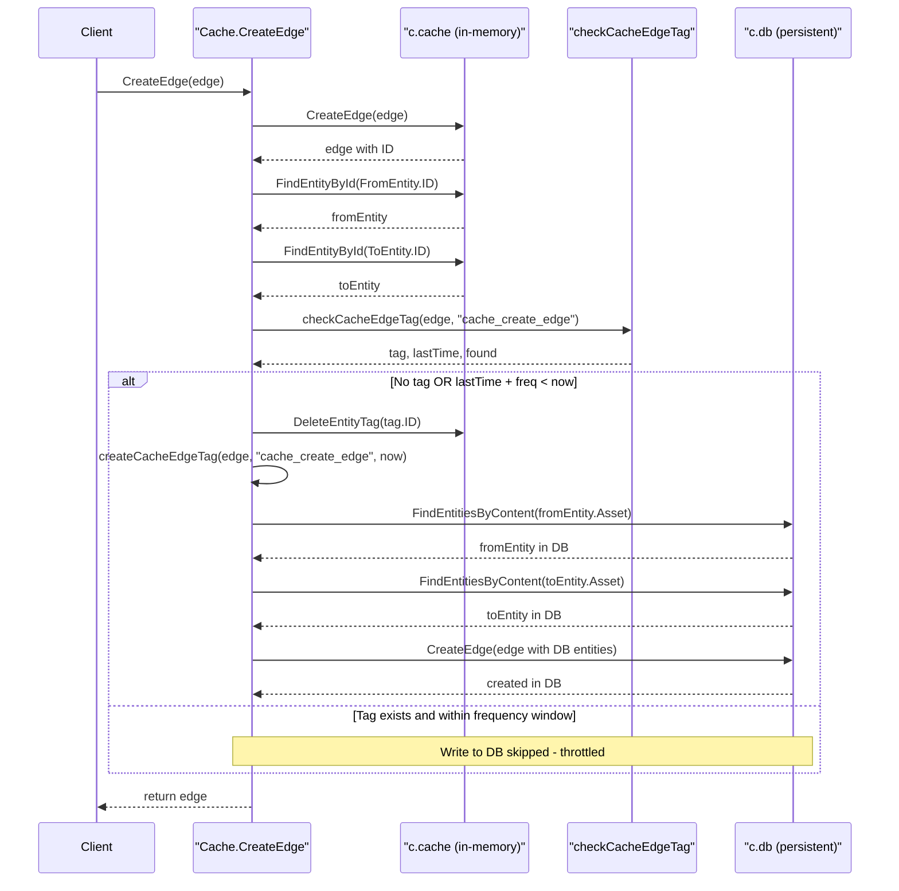
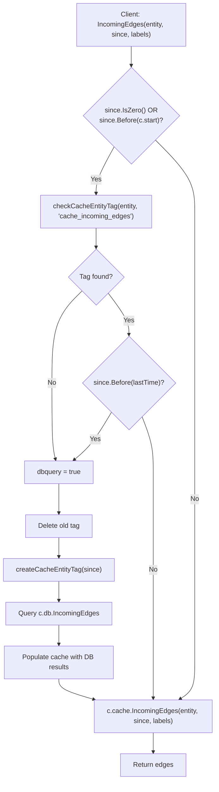
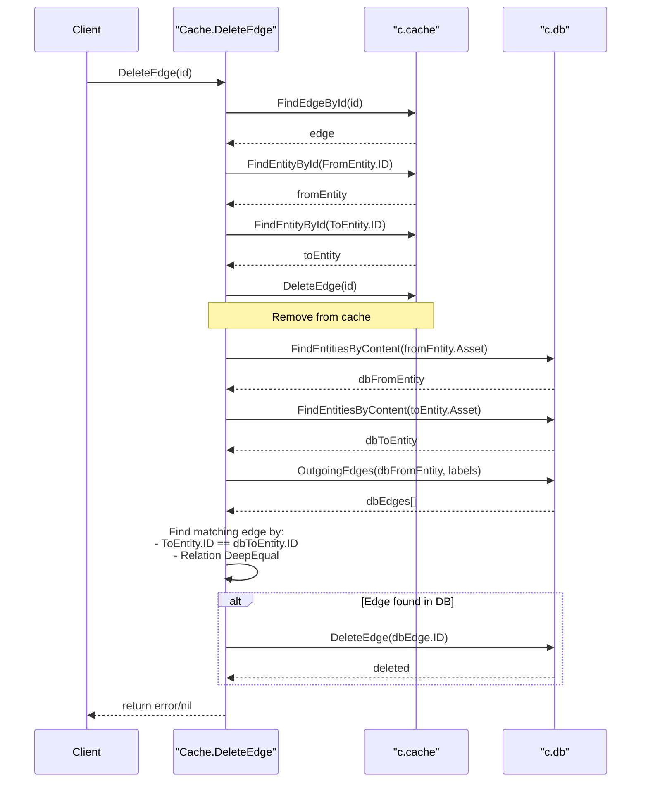

# Edge Caching

# Edge Caching

<details>
<summary>Relevant source files</summary>

The following files were used as context for generating this wiki page:

- [cache/cache_test.go](cache/cache_test.go)
- [cache/edge.go](cache/edge.go)
- [cache/entity_test.go](cache/entity_test.go)
- [db_test.go](db_test.go)

</details>


This page documents how edge (relationship) operations are cached by the `cache.Cache` implementation. Edge caching optimizes relationship queries between entities, reducing load on the persistent database while maintaining data consistency through tag-based invalidation and frequency-based throttling.

For information about entity caching, see [Entity Caching](#6.2). For tag-specific caching behavior, see [Tag Caching](#6.4). For the overall caching architecture, see [Cache Architecture](#6.1).

---

## Overview

The edge caching system in `cache/edge.go` implements the `Repository` interface methods for edge operations, providing a performance layer over the persistent database. All edge operations interact with two repositories:

| Repository | Type | Purpose |
|------------|------|---------|
| `c.cache` | In-memory | Fast access, temporary storage |
| `c.db` | Persistent | Durable storage (PostgreSQL, SQLite, or Neo4j) |

Edge caching uses three specialized cache tags to track synchronization state:

- `cache_create_edge` - Tracks when an edge was last written to the persistent database
- `cache_incoming_edges` - Tracks when incoming edges were last queried from the database
- `cache_outgoing_edges` - Tracks when outgoing edges were last queried from the database

**Sources:** [cache/edge.go:1-217]()

---

## Edge Creation with Write Throttling

The `CreateEdge` method implements frequency-based write throttling to reduce database load. Edges are always written to the in-memory cache immediately, but writes to the persistent database are throttled based on the `c.freq` duration.

### Create Edge Flow



### Implementation Details

The `CreateEdge` method in [cache/edge.go:15-57]() performs the following steps:

1. **Immediate Cache Write**: Creates the edge in `c.cache`, receiving an ID
2. **Entity Lookup**: Retrieves both `FromEntity` and `ToEntity` from cache to validate the edge
3. **Tag Check**: Calls `checkCacheEdgeTag` to determine if a database write is needed
4. **Conditional Database Write**: Only writes to `c.db` if:
   - No cache tag exists for this edge, OR
   - The tag exists but `lastTime + c.freq < time.Now()`
5. **Tag Update**: Creates a new cache tag with the current timestamp

When writing to the database, the method must look up the corresponding entities in `c.db` by their asset content, as the cache entity IDs differ from database entity IDs.

**Sources:** [cache/edge.go:15-57]()

---

## Edge Retrieval by ID

The `FindEdgeById` method provides direct edge lookup without any database interaction. This is a pass-through to the cache repository.

```go
// cache/edge.go:59-62
func (c *Cache) FindEdgeById(id string) (*types.Edge, error) {
    return c.cache.FindEdgeById(id)
}
```

Since edges are populated into the cache through either `CreateEdge` or relationship query methods (`IncomingEdges`, `OutgoingEdges`), this method can always operate entirely from the in-memory cache.

**Sources:** [cache/edge.go:59-62]()

---

## Incoming Edges Cache-Aside Pattern

The `IncomingEdges` method retrieves all edges where the specified entity is the target (`ToEntity`). It implements a cache-aside pattern with tag-based staleness detection.

### Incoming Edges Query Flow



### Cache Staleness Determination

The method uses two criteria to determine if the cache is stale and requires a database query:

1. **Temporal Scope**: If `since.IsZero()` or `since.Before(c.start)`, the query requires data from before the cache was initialized
2. **Tag Comparison**: If a cache tag exists, compare `since` against the tag's timestamp - if `since` is earlier, the cache doesn't have the required historical data

**Sources:** [cache/edge.go:64-114]()

---

## Incoming Edges Implementation

```mermaid
graph TB
    subgraph "IncomingEdges Method"
        Entry["IncomingEdges(entity, since, labels)"]
        Check1["Check temporal scope"]
        Check2["checkCacheEntityTag<br/>(entity, 'cache_incoming_edges')"]
        Decision{"Need DB<br/>query?"}
        
        subgraph "Database Query Branch"
            DBFind["c.db.FindEntitiesByContent(entity.Asset)"]
            DBIncoming["c.db.IncomingEdges(dbEntity, since)"]
            Hydrate["For each edge:<br/>FindEntityById(ToEntity.ID)"]
            CreateCacheEntity["c.cache.CreateEntity(toEntity)"]
            CreateCacheEdge["c.cache.CreateEdge(edge)"]
        end
        
        FinalQuery["c.cache.IncomingEdges<br/>(entity, since, labels)"]
    end
    
    Entry-->Check1
    Check1-->Check2
    Check2-->Decision
    Decision-->|Yes|DBFind
    DBFind-->DBIncoming
    DBIncoming-->Hydrate
    Hydrate-->CreateCacheEntity
    CreateCacheEntity-->CreateCacheEdge
    CreateCacheEdge-->FinalQuery
    Decision-->|No|FinalQuery
```



The implementation in [cache/edge.go:64-114]() follows this pattern:

1. **Staleness Check**: Determines if a database query is needed based on `since` timestamp and cache tags
2. **Database Query** (if stale):
   - Finds the entity in the persistent database by asset content
   - Queries `c.db.IncomingEdges(dbEntity, since)`
   - Hydrates the `ToEntity` for each edge (the entity that the edge points from)
   - Creates both entities and edges in the cache
3. **Cache Query**: Always returns results from `c.cache.IncomingEdges()`, which now contains fresh data

**Sources:** [cache/edge.go:64-114]()

---

## Outgoing Edges Cache-Aside Pattern

The `OutgoingEdges` method retrieves all edges where the specified entity is the source (`FromEntity`). Its implementation mirrors `IncomingEdges` with identical cache-aside logic.

### Outgoing Edges Key Differences

```go
// cache/edge.go:116-166
func (c *Cache) OutgoingEdges(entity *types.Entity, since time.Time, labels ...string) ([]*types.Edge, error) {
    // Uses "cache_outgoing_edges" tag instead of "cache_incoming_edges"
    // Queries c.db.OutgoingEdges() instead of c.db.IncomingEdges()
    // Otherwise identical logic to IncomingEdges
}
```

### Query Comparison

| Aspect | IncomingEdges | OutgoingEdges |
|--------|---------------|---------------|
| Cache Tag | `cache_incoming_edges` | `cache_outgoing_edges` |
| DB Query | `c.db.IncomingEdges()` | `c.db.OutgoingEdges()` |
| Edge Direction | `FromEntity -> entity` | `entity -> ToEntity` |
| Hydrated Entity | `ToEntity` (source) | `ToEntity` (target) |

Both methods populate the cache with discovered edges and their associated entities, ensuring subsequent queries can be served from memory.

**Sources:** [cache/edge.go:116-166]()

---

## Edge Deletion

The `DeleteEdge` method removes an edge from both the cache and the persistent database. Unlike creation, deletion is not throttled - it occurs immediately in both repositories to maintain consistency.

### Delete Edge Flow



### Implementation Strategy

The deletion process in [cache/edge.go:168-216]() is complex because cache entity IDs differ from database entity IDs:

1. **Retrieve Edge Details**: Gets the edge and both entities from the cache
2. **Delete from Cache**: Removes the edge from `c.cache` immediately
3. **Locate DB Entities**: Finds corresponding entities in `c.db` by asset content
4. **Find Matching DB Edge**: 
   - Queries outgoing edges from the source entity with the relation label
   - Finds the edge where `ToEntity.ID` matches and `Relation` is deep-equal
5. **Delete from Database**: Removes the located edge from `c.db`

The method uses `reflect.DeepEqual` at [cache/edge.go:206]() to match the relation, ensuring the exact relationship is deleted even if multiple edges exist with the same label between two entities.

**Sources:** [cache/edge.go:168-216]()

---

## Cache Tag Management for Edges

Edge caching uses cache tags stored as `EntityTag` objects to track synchronization state. These tags are associated with entities rather than edges themselves.

### Tag Types and Purposes

| Tag Name | Associated With | Purpose | Created By |
|----------|----------------|---------|------------|
| `cache_create_edge` | Edge entity | Tracks last write to persistent DB | `CreateEdge` |
| `cache_incoming_edges` | Target entity | Tracks last incoming edges query | `IncomingEdges` |
| `cache_outgoing_edges` | Source entity | Tracks last outgoing edges query | `OutgoingEdges` |

### Tag Check Methods

The cache uses helper methods (likely in `cache/cache.go` or similar) to manage these tags:

- `checkCacheEdgeTag(edge, tagName)` - Returns `(tag, lastTime, found)` for edge-related tags
- `checkCacheEntityTag(entity, tagName)` - Returns `(tag, lastTime, found)` for entity-related tags
- `createCacheEdgeTag(edge, tagName, timestamp)` - Creates a new edge-related cache tag
- `createCacheEntityTag(entity, tagName, timestamp)` - Creates a new entity-related cache tag

These methods store timestamps as string values in the tag's `Property` field, which are parsed using `time.Parse(time.RFC3339Nano, value)` to determine cache freshness.

**Sources:** [cache/edge.go:31-35](), [cache/edge.go:69-74](), [cache/edge.go:121-126](), [cache/entity_test.go:341-345]()

---

## Testing Edge Caching

The test suite in `cache/entity_test.go` verifies edge caching behavior, although specific edge tests are not shown in the provided files. Based on the entity test patterns, edge tests would verify:

- Creation throttling based on `c.freq` duration
- Proper population of cache from database queries
- Tag-based cache invalidation
- Synchronization between `c.cache` and `c.db`

Test repositories are created using SQLite in-memory for the cache and SQLite file-based for the persistent database, as shown in [cache/cache_test.go:69-86]().

**Sources:** [cache/cache_test.go:69-86](), [cache/entity_test.go:1-405]()