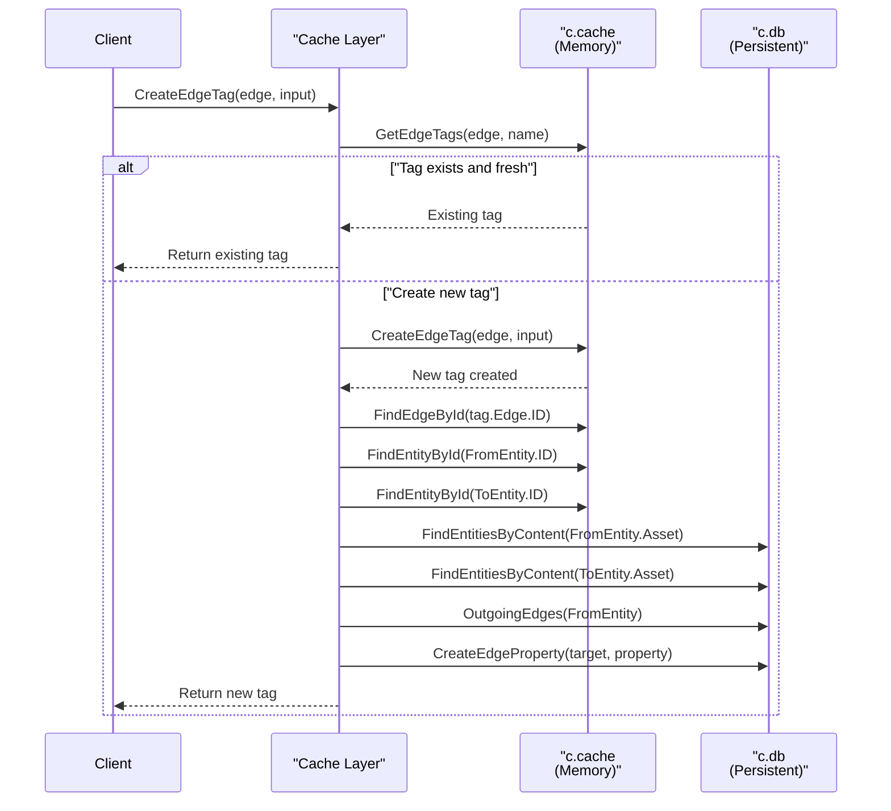
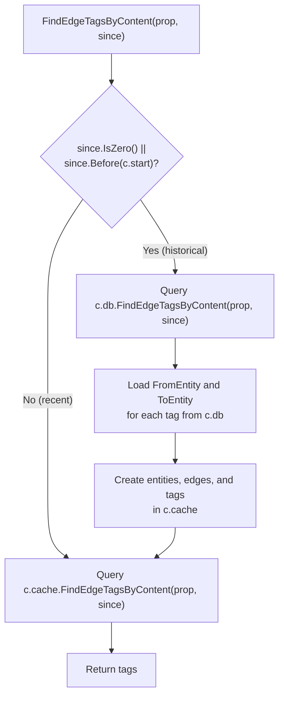
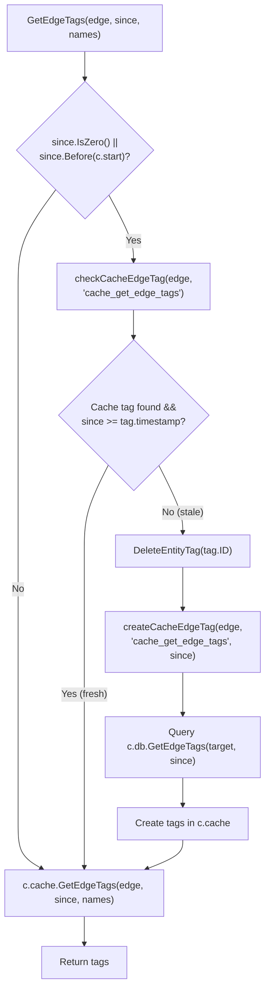
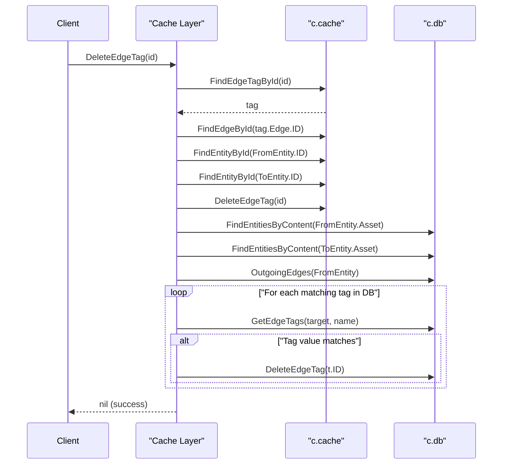
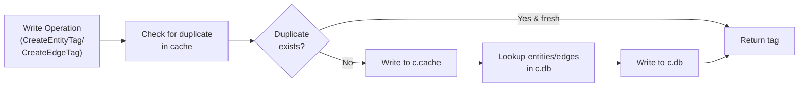
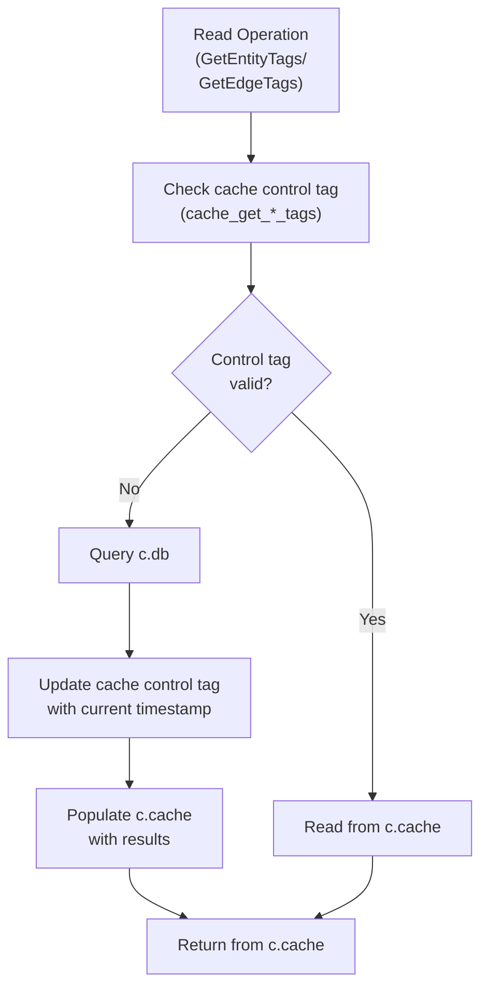
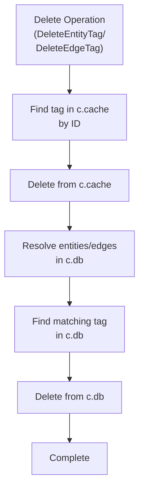

# Tag Caching

# Tag Caching

<details>
<summary>Relevant source files</summary>

The following files were used as context for generating this wiki page:

- [cache/cache_test.go](cache/cache_test.go)
- [cache/edge_tag.go](cache/edge_tag.go)
- [cache/edge_tag_test.go](cache/edge_tag_test.go)
- [cache/entity_test.go](cache/entity_test.go)
- [db_test.go](db_test.go)

</details>


## Purpose and Scope

This page documents how entity tags ([`types.EntityTag`](types/types.go)) and edge tags ([`types.EdgeTag`](types/types.go)) are cached and synchronized between the in-memory cache repository and the persistent database repository. Tag caching enables the system to attach metadata (properties) to entities and edges while minimizing database load through intelligent caching strategies.

For information about the overall cache architecture and dual-repository pattern, see [Cache Architecture](#6.1). For entity and edge caching operations, see [Entity Caching](#6.2) and [Edge Caching](#6.3).

---

## Tag Types in the Cache System

The cache system works with two distinct categories of tags:

| Tag Category | Purpose | Storage Location | Examples |
|--------------|---------|------------------|----------|
| **User Data Tags** | Application-defined properties attached to entities and edges | Both cache and persistent DB | Entity metadata, edge properties, DNS records |
| **Cache Control Tags** | Internal tags used by the cache to track synchronization state | Cache repository only | `cache_create_entity`, `cache_get_edge_tags`, `cache_find_entities_by_type` |

Cache control tags store timestamps as their property values, indicating when data was last synchronized from the persistent database. These tags enable the cache to implement a tag-based invalidation strategy without requiring explicit cache expiration logic.

**Sources:** [cache/entity_test.go:50-52](), [cache/edge_tag_test.go:327-328](), [cache/entity_test.go:335-345]()

---

## Entity Tag Caching Operations

### CreateEntityTag

Entity tags are created immediately in the cache repository, then asynchronously written to the persistent database. The cache first checks if an identical tag already exists and is fresh (within `c.freq` duration):

```
CreateEntityTag flow:
1. Check if tag exists in cache with same name and value
2. If exists and LastSeen + c.freq > now, return existing tag
3. Create tag in cache repository
4. Locate corresponding entity in persistent DB
5. Create tag in persistent DB
```

The frequency-based throttling prevents redundant database writes for tags that are frequently updated.

**Sources:** [cache/entity.go]() (inferred from edge tag pattern), [cache/entity_test.go:39-52]()

### GetEntityTags

Retrieving entity tags implements a cache-aside pattern with cache control tag tracking:

```
GetEntityTags flow:
1. Check for cache control tag "cache_get_entity_tags"
2. If tag missing or stale (since < tag timestamp), query persistent DB
3. Delete old cache control tag
4. Create new cache control tag with current timestamp
5. Populate cache with tags from persistent DB
6. Return tags from cache
```

This approach ensures that the cache only queries the persistent database when necessary, based on the temporal requirements specified by the `since` parameter.

**Sources:** [cache/edge_tag.go:208-274]() (analogous pattern for edge tags)

### FindEntityTagsByContent

Content-based tag searches follow a similar pattern, checking the cache start time to determine if a database query is required:

```go
if since.IsZero() || since.Before(c.start) {
    // Query persistent database
    // Populate cache with results
}
return c.cache.FindEntityTagsByContent(prop, since)
```

If the requested time range predates the cache's start time (`c.start`), the persistent database must be queried to retrieve historical data.

**Sources:** [cache/edge_tag.go:140-206]() (analogous implementation)

---

## Edge Tag Caching Operations

### CreateEdgeTag and CreateEdgeProperty

The cache provides two methods for creating edge tags:

**CreateEdgeTag Workflow Diagram**



Both [`CreateEdgeTag`](cache/edge_tag.go:16-73)() and [`CreateEdgeProperty`](cache/edge_tag.go:75-133)() follow the same pattern:

1. Check for existing tag in cache with matching name and value
2. If found and `tag.LastSeen.Add(c.freq).After(time.Now())`, return existing tag
3. Create tag in cache repository
4. Resolve the edge's `FromEntity` and `ToEntity` from cache
5. Find corresponding entities in persistent database
6. Find corresponding edge in persistent database using [`OutgoingEdges`](cache/edge_tag.go:56)()
7. Create tag in persistent database

The key difference is that `CreateEdgeProperty` accepts an [`oam.Property`](cache/edge_tag.go:76)() directly, while `CreateEdgeTag` accepts a complete [`types.EdgeTag`](cache/edge_tag.go:16)() structure.

**Sources:** [cache/edge_tag.go:16-133]()

### FindEdgeTagById

This operation is a simple pass-through to the cache repository:

```go
func (c *Cache) FindEdgeTagById(id string) (*types.EdgeTag, error) {
    return c.cache.FindEdgeTagById(id)
}
```

Tags are identified by their unique ID, which is assumed to be present in the cache repository. No database query is performed.

**Sources:** [cache/edge_tag.go:135-138]()

### FindEdgeTagsByContent

Content-based edge tag searches populate the cache from the persistent database when querying historical data:

**FindEdgeTagsByContent Data Flow**



The implementation at [cache/edge_tag.go:140-206]() performs the following steps:

1. If `since` predates cache start time, query persistent database
2. For each tag from database, load the associated edge and entities
3. Recreate entities, edges, and tags in cache repository
4. Return results from cache repository

This ensures that historical tag data is available in the cache for subsequent queries.

**Sources:** [cache/edge_tag.go:140-206](), [cache/edge_tag_test.go:180-253]()

### GetEdgeTags

The [`GetEdgeTags`](cache/edge_tag.go:208-274)() method uses the cache control tag `"cache_get_edge_tags"` to track synchronization state:

**GetEdgeTags Cache Control Tag Flow**



The implementation follows this logic:

```go
if since.IsZero() || since.Before(c.start) {
    if tag, last, found := c.checkCacheEdgeTag(edge, "cache_get_edge_tags"); 
       !found || since.Before(last) {
        // Tag is missing or stale
        dbquery = true
        if found {
            _ = c.cache.DeleteEntityTag(tag.ID)
        }
        _ = c.createCacheEdgeTag(edge, "cache_get_edge_tags", since)
    }
}
```

This strategy ensures that database queries are only performed when:
- The cache control tag doesn't exist (first query for this edge)
- The `since` parameter requests data older than the cached timestamp

**Sources:** [cache/edge_tag.go:208-274](), [cache/edge_tag_test.go:255-372]()

### DeleteEdgeTag

Deletion requires removing the tag from both the cache and persistent database:

**DeleteEdgeTag Synchronization**



The method at [cache/edge_tag.go:276-337]() must:

1. Find the tag in cache by ID
2. Locate the associated edge and entities
3. Delete from cache repository
4. Find corresponding edge in persistent database
5. Find matching tag in persistent database (by name and value)
6. Delete from persistent database

The matching logic ensures that only tags with identical property names and values are deleted from the persistent database.

**Sources:** [cache/edge_tag.go:276-337](), [cache/edge_tag_test.go:374-424]()

---

## Cache Control Tag Types

The cache system uses specific tag names to track synchronization state for different operations:

| Cache Control Tag | Purpose | Used By |
|-------------------|---------|---------|
| `cache_create_entity` | Tracks entity creation timestamp | Entity write operations |
| `cache_create_asset` | Tracks asset creation timestamp | Asset write operations |
| `cache_find_entities_by_type` | Tracks last sync for type-based queries | `FindEntitiesByType` |
| `cache_incoming_edges` | Tracks last sync for incoming edges | `IncomingEdges` |
| `cache_outgoing_edges` | Tracks last sync for outgoing edges | `OutgoingEdges` |
| `cache_get_edge_tags` | Tracks last sync for edge tags | `GetEdgeTags` |
| `cache_get_entity_tags` | Tracks last sync for entity tags | `GetEntityTags` |

These tags are stored as entity tags on the relevant entities or edges, with their property values containing RFC3339Nano-formatted timestamps:

```go
tagtime, err := time.Parse(time.RFC3339Nano, tags[0].Property.Value())
```

**Sources:** [cache/entity_test.go:50-52](), [cache/entity_test.go:99-101](), [cache/entity_test.go:335-345](), [cache/edge_tag_test.go:327-328](), [cache/edge_tag_test.go:361-372]()

---

## Tag Synchronization Patterns

### Write-Through Pattern for Tag Creation

User data tags follow a write-through caching pattern:



This ensures that:
1. Tags are immediately available in the cache for fast reads
2. Tags are persisted to the database for durability
3. Duplicate writes are suppressed using frequency-based throttling

**Sources:** [cache/edge_tag.go:16-133]()

### Cache-Aside Pattern for Tag Retrieval

Tag retrieval operations use a cache-aside pattern with cache control tags:



The cache control tag timestamp determines whether the cached data is sufficiently fresh for the requested `since` parameter. If not, the persistent database is queried and the cache is updated.

**Sources:** [cache/edge_tag.go:208-274]()

### Deletion Synchronization

Tag deletions must be synchronized to both repositories:



The resolution step is necessary because entities and edges in the cache have different IDs than their counterparts in the persistent database. The cache must locate the equivalent objects in the database using content-based lookups.

**Sources:** [cache/edge_tag.go:276-337]()

---

## Cache Invalidation Strategy

The tag-based invalidation strategy relies on comparing timestamps:

| Comparison | Result | Action |
|------------|--------|--------|
| `since > cache_control_tag.timestamp` | Requested data is newer than cached | Query database, update cache |
| `since <= cache_control_tag.timestamp` | Cached data is sufficient | Return from cache |
| `cache_control_tag` not found | First query or cache cleared | Query database, create control tag |
| `since.Before(c.start)` | Historical data requested | Query database (predates cache) |

The [`checkCacheEdgeTag`](cache/edge_tag.go:213)() and [`createCacheEdgeTag`](cache/edge_tag.go:218)() helper methods (referenced but not shown in provided files) manage these cache control tags. They store timestamps as property values, enabling temporal cache invalidation without explicit expiration logic.

**Test Evidence:**

The test at [cache/edge_tag_test.go:323-372]() demonstrates this behavior:

1. First call to `GetEdgeTags` with `c.StartTime()` returns only recent data
2. Cache control tag is not created (line 327-328) because no DB query was needed
3. Second call with older `since` parameter triggers DB query
4. Cache control tag is created with timestamp (line 361-372)
5. Subsequent queries use this control tag to determine cache freshness

**Sources:** [cache/edge_tag.go:208-274](), [cache/edge_tag_test.go:255-372](), [cache/entity_test.go:335-345]()