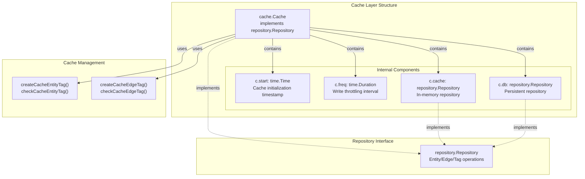
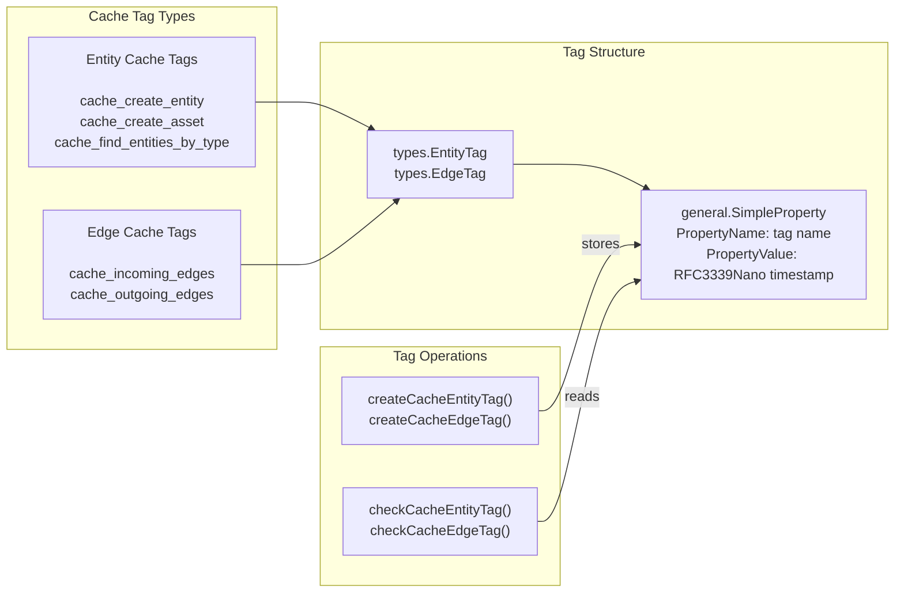
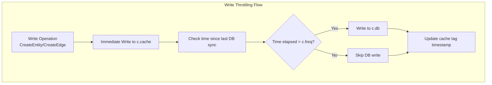

# Caching System

# Caching System

<details>
<summary>Relevant source files</summary>

The following files were used as context for generating this wiki page:

- [cache/cache.go](cache/cache.go)
- [cache/cache_test.go](cache/cache_test.go)
- [cache/entity_test.go](cache/entity_test.go)
- [db_test.go](db_test.go)

</details>


The caching system provides a performance optimization layer that wraps any `repository.Repository` implementation with an in-memory cache. It reduces database load through tag-based cache invalidation, frequency-based write throttling, and temporal query optimization. The cache implements the same `repository.Repository` interface, making it a transparent drop-in wrapper for any existing repository.

This document covers the overall caching architecture and mechanisms. For detailed operation-specific behavior, see [Entity Caching](#6.2), [Edge Caching](#6.3), and [Tag Caching](#6.4). For the underlying repository abstraction, see [Repository Pattern](#3.1).

---

## Core Architecture

The caching system is built around a dual-repository pattern where an in-memory repository serves as a fast cache layer over a persistent database repository. The `Cache` struct wraps both repositories and implements the `repository.Repository` interface.



**Sources:** [cache/cache.go:15-31](), [cache/cache_test.go:22-25]()

---

## Cache Struct Components

The `Cache` struct contains four primary fields that control its behavior:

| Field | Type | Purpose |
|-------|------|---------|
| `start` | `time.Time` | Records when the cache was initialized. Used as a baseline for temporal queries. |
| `freq` | `time.Duration` | Controls write throttling frequency. Determines how often cache data is synchronized to the persistent database. |
| `cache` | `repository.Repository` | In-memory repository for fast data access. Typically a SQLite in-memory database. |
| `db` | `repository.Repository` | Persistent repository for durable storage. Can be PostgreSQL, SQLite file, or Neo4j. |

The cache is created using the `New` function:

```go
func New(cache, database repository.Repository, freq time.Duration) (*Cache, error)
```

**Sources:** [cache/cache.go:15-31](), [cache/cache_test.go:69-86]()

---

## Dual Repository Pattern

The caching system implements a dual-repository pattern where operations are distributed between the fast in-memory cache and the slower persistent database based on operation type and temporal parameters.

```mermaid
sequenceDiagram
    participant Client
    participant Cache["cache.Cache"]
    participant CacheRepo["c.cache<br/>(In-Memory)"]
    participant DBRepo["c.db<br/>(Persistent)"]
    
    Note over Client,DBRepo: Write Operation Flow
    Client->>Cache: "CreateEntity(entity)"
    Cache->>CacheRepo: "CreateEntity(entity)"
    CacheRepo-->>Cache: "entity"
    Cache->>Cache: "createCacheEntityTag()"
    Cache->>DBRepo: "CreateEntity() (throttled)"
    DBRepo-->>Cache: "entity"
    Cache-->>Client: "entity"
    
    Note over Client,DBRepo: Read Operation Flow (Cache Hit)
    Client->>Cache: "FindEntityById(id)"
    Cache->>CacheRepo: "FindEntityById(id)"
    CacheRepo-->>Cache: "entity (found)"
    Cache-->>Client: "entity"
    
    Note over Client,DBRepo: Read Operation Flow (Cache Miss)
    Client->>Cache: "FindEntitiesByType(type, since)"
    Cache->>Cache: "checkCacheEntityTag()"
    Cache->>DBRepo: "FindEntitiesByType()"
    DBRepo-->>Cache: "entities"
    Cache->>CacheRepo: "Populate cache"
    Cache->>Cache: "createCacheEntityTag()"
    Cache-->>Client: "entities"
```

**Write Operations:** Data is immediately written to the in-memory cache and tagged with a cache timestamp. Writes to the persistent database are throttled based on the `freq` duration to reduce database load.

**Read Operations:** The cache checks the in-memory repository first. If data is not found or is stale (based on `since` parameters and cache tags), the persistent database is queried and the cache is populated.

**Sources:** [cache/cache.go:48-80](), [cache/entity_test.go:20-72]()

---

## Tag-Based Cache Invalidation

Cache invalidation is managed through a tag system where each cached entity or edge is tagged with a timestamp indicating when it was last synchronized from the persistent database. These tags enable the cache to determine data freshness without constant database queries.



**Cache Tag Functions:**

- `createCacheEntityTag(entity, name, since)` - Creates an entity tag with a timestamp [cache/cache.go:48-54]()
- `checkCacheEntityTag(entity, name)` - Retrieves and parses entity tag timestamp [cache/cache.go:56-63]()
- `createCacheEdgeTag(edge, name, since)` - Creates an edge tag with a timestamp [cache/cache.go:65-71]()
- `checkCacheEdgeTag(edge, name)` - Retrieves and parses edge tag timestamp [cache/cache.go:73-80]()

Each tag is stored as a `general.SimpleProperty` with:
- `PropertyName`: The cache tag identifier (e.g., `"cache_create_entity"`)
- `PropertyValue`: Timestamp in RFC3339Nano format

**Sources:** [cache/cache.go:48-80](), [cache/entity_test.go:50-52, 99-101, 313-314]()

---

## Frequency-Based Write Throttling

The `freq` duration parameter controls how often cached data is written to the persistent database. This throttling mechanism significantly reduces database write load while maintaining eventual consistency.



The frequency parameter is specified when creating the cache:

```go
cache, err := New(inMemoryRepo, persistentRepo, time.Minute)
```

With `freq` set to `time.Minute`, writes to the persistent database are throttled to occur no more frequently than once per minute, regardless of how many write operations are performed on the cache.

**Sources:** [cache/cache.go:22-31](), [cache/cache_test.go:29, 38, 60, 83]()

---

## Temporal Awareness

The caching system is temporally aware, using timestamps to determine data freshness and synchronization requirements. This is achieved through two primary mechanisms: the cache start time and the `since` parameter in query operations.

### Start Time

The `start` field records when the cache was initialized and serves as a baseline for temporal queries:

```go
func (c *Cache) StartTime() time.Time {
    return c.start
}
```

Operations using `c.StartTime()` as the `since` parameter will only return entities created or modified after the cache was initialized. This is useful for retrieving only new data without querying the entire persistent database.

### Since Parameter

Most query methods accept a `since time.Time` parameter that filters results to only include entities/edges modified after that timestamp. The cache uses this parameter to determine whether cached data is fresh enough or if a database query is needed.

**Example from tests:**

```go
// Query entities created after the cache start time
entities, err := cache.FindEntitiesByType(oam.FQDN, cache.StartTime())

// Query older entities
entities, err := cache.FindEntitiesByType(oam.FQDN, ctime1)
```

When a `since` timestamp is older than the cached tag timestamp, the cache queries the persistent database for historical data.

**Sources:** [cache/cache.go:33-36](), [cache/entity_test.go:205-206, 294, 316](), [cache/cache_test.go:27-49]()

---

## Implementation Overview

The `Cache` struct implements the complete `repository.Repository` interface, providing transparent caching for all repository operations:

| Operation Category | Methods | Behavior |
|-------------------|---------|----------|
| **Initialization** | `New()`, `Close()`, `GetDBType()`, `StartTime()` | Setup and metadata |
| **Entity Operations** | `CreateEntity()`, `CreateAsset()`, `FindEntityById()`, `FindEntitiesByContent()`, `FindEntitiesByType()`, `DeleteEntity()` | Cache-aside pattern with tag tracking |
| **Edge Operations** | `CreateEdge()`, `FindEdgeById()`, `IncomingEdges()`, `OutgoingEdges()`, `DeleteEdge()` | Cache-aside pattern with tag tracking |
| **Tag Operations** | `CreateEntityProperty()`, `GetEntityTags()`, `CreateEdgeProperty()`, `GetEdgeTags()` | Direct passthrough to cache repository |

The cache transparently wraps any repository implementation, whether SQL-based ([SQL Repository](#4)) or graph-based ([Neo4j Repository](#5)).

**Sources:** [cache/cache.go:15-81](), [cache/cache_test.go:22-25]()

---

## Usage Example

Creating and using a cached repository:

```go
import (
    "time"
    assetdb "github.com/owasp-amass/asset-db"
    "github.com/owasp-amass/asset-db/cache"
    "github.com/owasp-amass/asset-db/repository/sqlrepo"
)

// Create in-memory cache repository
cacheRepo, err := assetdb.New(sqlrepo.SQLiteMemory, "")

// Create persistent database repository
dbRepo, err := assetdb.New(sqlrepo.SQLite, "/path/to/db.sqlite")

// Wrap with cache layer (1-minute write throttling)
cachedRepo, err := cache.New(cacheRepo, dbRepo, time.Minute)
defer cachedRepo.Close()

// Use cachedRepo like any repository.Repository
entity, err := cachedRepo.CreateAsset(&dns.FQDN{Name: "example.com"})
entities, err := cachedRepo.FindEntitiesByType(oam.FQDN, cachedRepo.StartTime())
```

**Sources:** [cache/cache_test.go:69-86](), [cache/entity_test.go:29-31, 83-85]()