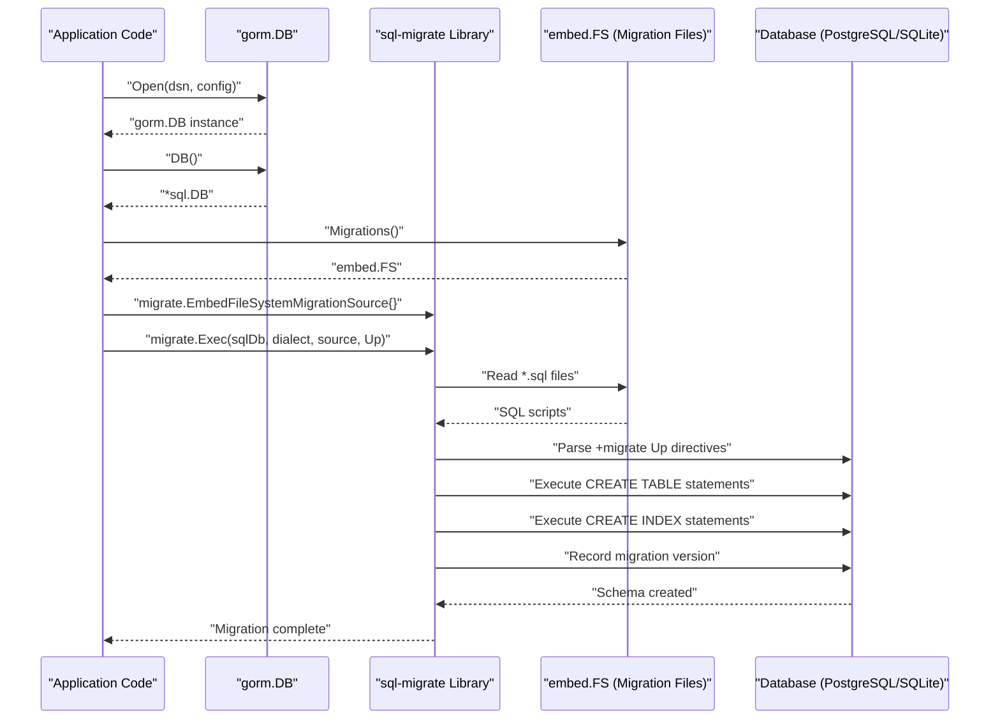
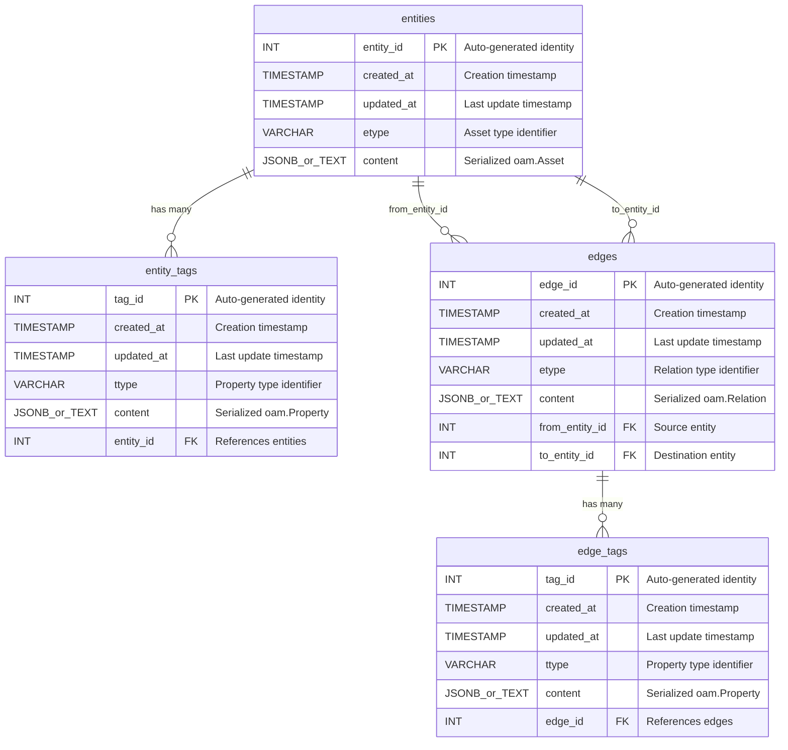
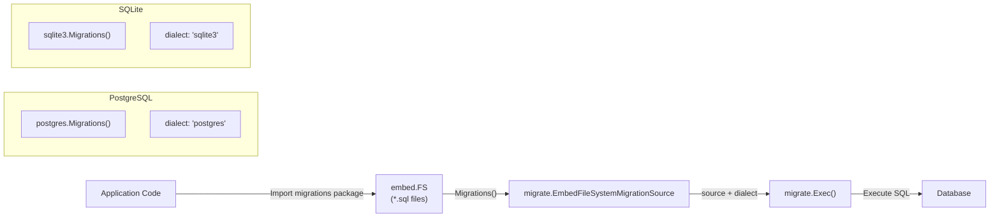
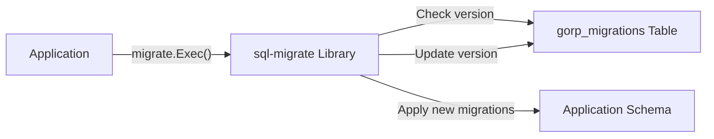

# SQL Schema Migrations

# SQL Schema Migrations

<details>
<summary>Relevant source files</summary>

The following files were used as context for generating this wiki page:

- [migrations/postgres/001_schema_init.sql](migrations/postgres/001_schema_init.sql)
- [migrations/postgres/embed.go](migrations/postgres/embed.go)
- [migrations/postgres/example_test.go](migrations/postgres/example_test.go)
- [migrations/sqlite3/001_schema_init.sql](migrations/sqlite3/001_schema_init.sql)
- [migrations/sqlite3/embed.go](migrations/sqlite3/embed.go)
- [migrations/sqlite3/example_test.go](migrations/sqlite3/example_test.go)
- [types/types.go](types/types.go)

</details>


## Purpose and Scope

This document covers the SQL schema migration system for PostgreSQL and SQLite databases in the asset-db repository. It details the migration scripts, table structures, indexes, constraints, and the execution mechanism using the `sql-migrate` library.

For Neo4j graph database schema initialization, see [Neo4j Schema Initialization](#7.2).

---

## Migration Architecture

The SQL migration system uses the `rubenv/sql-migrate` library to manage database schema versioning. Migration scripts are embedded directly into the Go binary using Go's `embed` package, ensuring that schema definitions are always available at runtime without external file dependencies.

### Embedded Migration Files

Each database type has its own migration package with embedded SQL files:

**PostgreSQL Migrations:**
- Package: `migrations/postgres`
- Embedded via: [migrations/postgres/embed.go:11-12]()
- Accessor function: `Migrations()` returns `embed.FS` [migrations/postgres/embed.go:15-17]()

**SQLite Migrations:**
- Package: `migrations/sqlite3`
- Embedded via: [migrations/sqlite3/embed.go:11-12]()
- Accessor function: `Migrations()` returns `embed.FS` [migrations/sqlite3/embed.go:14-16]()

**Sources:** [migrations/postgres/embed.go:1-18](), [migrations/sqlite3/embed.go:1-17]()

---

## Migration Execution Flow



**Sources:** [migrations/postgres/example_test.go:19-65](), [migrations/sqlite3/example_test.go:16-54]()

---

## Schema Structure

The SQL schema implements a property graph model with four core tables: `entities`, `entity_tags`, `edges`, and `edge_tags`. This structure corresponds to the types defined in [types/types.go:14-47]().

### Entity-Relationship Diagram



**Sources:** [migrations/postgres/001_schema_init.sql:1-90](), [migrations/sqlite3/001_schema_init.sql:1-85](), [types/types.go:14-47]()

---

## PostgreSQL Schema Details

### Table Definitions

The PostgreSQL schema uses native JSONB columns for storing serialized Open Asset Model content, providing efficient querying and indexing capabilities.

#### Entities Table

[migrations/postgres/001_schema_init.sql:3-10]()

| Column | Type | Constraints | Description |
|--------|------|-------------|-------------|
| `entity_id` | `INT` | `PRIMARY KEY`, `GENERATED ALWAYS AS IDENTITY` | Auto-incrementing primary key |
| `created_at` | `TIMESTAMP without time zone` | `DEFAULT CURRENT_TIMESTAMP` | Record creation time |
| `updated_at` | `TIMESTAMP without time zone` | `DEFAULT CURRENT_TIMESTAMP` | Last modification time |
| `etype` | `VARCHAR(255)` | - | Asset type from Open Asset Model |
| `content` | `JSONB` | - | Serialized `oam.Asset` object |

#### Entity Tags Table

[migrations/postgres/001_schema_init.sql:15-27]()

| Column | Type | Constraints | Description |
|--------|------|-------------|-------------|
| `tag_id` | `INT` | `PRIMARY KEY`, `GENERATED ALWAYS AS IDENTITY` | Auto-incrementing primary key |
| `created_at` | `TIMESTAMP without time zone` | `DEFAULT CURRENT_TIMESTAMP` | Record creation time |
| `updated_at` | `TIMESTAMP without time zone` | `DEFAULT CURRENT_TIMESTAMP` | Last modification time |
| `ttype` | `VARCHAR(255)` | - | Property type from Open Asset Model |
| `content` | `JSONB` | - | Serialized `oam.Property` object |
| `entity_id` | `INT` | `FOREIGN KEY`, `ON DELETE CASCADE` | References `entities(entity_id)` |

#### Edges Table

[migrations/postgres/001_schema_init.sql:32-49]()

| Column | Type | Constraints | Description |
|--------|------|-------------|-------------|
| `edge_id` | `INT` | `PRIMARY KEY`, `GENERATED ALWAYS AS IDENTITY` | Auto-incrementing primary key |
| `created_at` | `TIMESTAMP without time zone` | `DEFAULT CURRENT_TIMESTAMP` | Record creation time |
| `updated_at` | `TIMESTAMP without time zone` | `DEFAULT CURRENT_TIMESTAMP` | Last modification time |
| `etype` | `VARCHAR(255)` | - | Relation type from Open Asset Model |
| `content` | `JSONB` | - | Serialized `oam.Relation` object |
| `from_entity_id` | `INT` | `FOREIGN KEY`, `ON DELETE CASCADE` | Source entity reference |
| `to_entity_id` | `INT` | `FOREIGN KEY`, `ON DELETE CASCADE` | Destination entity reference |

#### Edge Tags Table

[migrations/postgres/001_schema_init.sql:55-67]()

| Column | Type | Constraints | Description |
|--------|------|-------------|-------------|
| `tag_id` | `INT` | `PRIMARY KEY`, `GENERATED ALWAYS AS IDENTITY` | Auto-incrementing primary key |
| `created_at` | `TIMESTAMP without time zone` | `DEFAULT CURRENT_TIMESTAMP` | Record creation time |
| `updated_at` | `TIMESTAMP without time zone` | `DEFAULT CURRENT_TIMESTAMP` | Last modification time |
| `ttype` | `VARCHAR(255)` | - | Property type from Open Asset Model |
| `content` | `JSONB` | - | Serialized `oam.Property` object |
| `edge_id` | `INT` | `FOREIGN KEY`, `ON DELETE CASCADE` | References `edges(edge_id)` |

### Foreign Key Constraints

PostgreSQL uses named constraints for referential integrity:

- `fk_entity_tags_entities`: Links `entity_tags.entity_id` to `entities.entity_id` [migrations/postgres/001_schema_init.sql:23-26]()
- `fk_edges_entities_from`: Links `edges.from_entity_id` to `entities.entity_id` [migrations/postgres/001_schema_init.sql:41-43]()
- `fk_edges_entities_to`: Links `edges.to_entity_id` to `entities.entity_id` [migrations/postgres/001_schema_init.sql:45-48]()
- `fk_edge_tags_edges`: Links `edge_tags.edge_id` to `edges.edge_id` [migrations/postgres/001_schema_init.sql:63-66]()

All foreign keys use `ON DELETE CASCADE` to ensure dependent records are automatically removed when parent records are deleted.

**Sources:** [migrations/postgres/001_schema_init.sql:1-90]()

---

## SQLite Schema Details

### Table Definitions

The SQLite schema is structurally similar to PostgreSQL but uses `TEXT` columns for JSON content and requires explicit foreign key enforcement.

#### Foreign Key Enforcement

SQLite requires explicit enablement of foreign key constraints:

```sql
PRAGMA foreign_keys = ON;
```

[migrations/sqlite3/001_schema_init.sql:3-4]()

#### Entities Table

[migrations/sqlite3/001_schema_init.sql:6-12]()

| Column | Type | Constraints | Description |
|--------|------|-------------|-------------|
| `entity_id` | `INTEGER` | `PRIMARY KEY` | Auto-incrementing primary key |
| `created_at` | `DATETIME` | `DEFAULT CURRENT_TIMESTAMP` | Record creation time |
| `updated_at` | `DATETIME` | `DEFAULT CURRENT_TIMESTAMP` | Last modification time |
| `etype` | `TEXT` | - | Asset type from Open Asset Model |
| `content` | `TEXT` | - | JSON-serialized `oam.Asset` object |

#### Entity Tags Table

[migrations/sqlite3/001_schema_init.sql:17-27]()

| Column | Type | Constraints | Description |
|--------|------|-------------|-------------|
| `tag_id` | `INTEGER` | `PRIMARY KEY` | Auto-incrementing primary key |
| `created_at` | `DATETIME` | `DEFAULT CURRENT_TIMESTAMP` | Record creation time |
| `updated_at` | `DATETIME` | `DEFAULT CURRENT_TIMESTAMP` | Last modification time |
| `ttype` | `TEXT` | - | Property type from Open Asset Model |
| `content` | `TEXT` | - | JSON-serialized `oam.Property` object |
| `entity_id` | `INTEGER` | `FOREIGN KEY`, `ON DELETE CASCADE` | References `entities(entity_id)` |

#### Edges Table

[migrations/sqlite3/001_schema_init.sql:32-46]()

| Column | Type | Constraints | Description |
|--------|------|-------------|-------------|
| `edge_id` | `INTEGER` | `PRIMARY KEY` | Auto-incrementing primary key |
| `created_at` | `DATETIME` | `DEFAULT CURRENT_TIMESTAMP` | Record creation time |
| `updated_at` | `DATETIME` | `DEFAULT CURRENT_TIMESTAMP` | Last modification time |
| `etype` | `TEXT` | - | Relation type from Open Asset Model |
| `content` | `TEXT` | - | JSON-serialized `oam.Relation` object |
| `from_entity_id` | `INTEGER` | `FOREIGN KEY`, `ON DELETE CASCADE` | Source entity reference |
| `to_entity_id` | `INTEGER` | `FOREIGN KEY`, `ON DELETE CASCADE` | Destination entity reference |

#### Edge Tags Table

[migrations/sqlite3/001_schema_init.sql:52-62]()

| Column | Type | Constraints | Description |
|--------|------|-------------|-------------|
| `tag_id` | `INTEGER` | `PRIMARY KEY` | Auto-incrementing primary key |
| `created_at` | `DATETIME` | `DEFAULT CURRENT_TIMESTAMP` | Record creation time |
| `updated_at` | `DATETIME` | `DEFAULT CURRENT_TIMESTAMP` | Last modification time |
| `ttype` | `TEXT` | - | Property type from Open Asset Model |
| `content` | `TEXT` | - | JSON-serialized `oam.Property` object |
| `edge_id` | `INTEGER` | `FOREIGN KEY`, `ON DELETE CASCADE` | References `edges(edge_id)` |

**Sources:** [migrations/sqlite3/001_schema_init.sql:1-85]()

---

## Index Strategy

Both PostgreSQL and SQLite schemas include identical indexing strategies to optimize common query patterns.

### Index Definitions

| Index Name | Table | Columns | Purpose |
|------------|-------|---------|---------|
| `idx_entities_updated_at` | `entities` | `updated_at` | Temporal queries filtering by last update time |
| `idx_entities_etype` | `entities` | `etype` | Type-based entity lookups |
| `idx_enttag_updated_at` | `entity_tags` | `updated_at` | Temporal queries for entity tags |
| `idx_enttag_entity_id` | `entity_tags` | `entity_id` | Fast lookup of tags for a specific entity |
| `idx_edge_updated_at` | `edges` | `updated_at` | Temporal queries for relationships |
| `idx_edge_from_entity_id` | `edges` | `from_entity_id` | Outgoing edge traversal |
| `idx_edge_to_entity_id` | `edges` | `to_entity_id` | Incoming edge traversal |
| `idx_edgetag_updated_at` | `edge_tags` | `updated_at` | Temporal queries for edge tags |
| `idx_edgetag_edge_id` | `edge_tags` | `edge_id` | Fast lookup of tags for a specific edge |

**PostgreSQL:** [migrations/postgres/001_schema_init.sql:12-13](), [29-30](), [51-53](), [69-70]()

**SQLite:** [migrations/sqlite3/001_schema_init.sql:14-15](), [29-30](), [48-50](), [64-65]()

### Temporal Query Optimization

All `updated_at` indexes support the repository's temporal query pattern, where operations accept a `since` parameter to retrieve only records modified after a specific timestamp. This is critical for the caching system's synchronization strategy.

**Sources:** [migrations/postgres/001_schema_init.sql:12-70](), [migrations/sqlite3/001_schema_init.sql:14-65]()

---

## PostgreSQL vs SQLite Differences

### Content Storage

| Feature | PostgreSQL | SQLite |
|---------|-----------|--------|
| Content Column Type | `JSONB` | `TEXT` |
| JSON Querying | Native JSONB operators | String-based parsing |
| Indexing Content | GIN indexes supported | Full-text search extensions |
| Storage Efficiency | Binary JSON format | String serialization |

**PostgreSQL:** [migrations/postgres/001_schema_init.sql:8]()  
**SQLite:** [migrations/sqlite3/001_schema_init.sql:11]()

### Identity/Auto-increment

| Feature | PostgreSQL | SQLite |
|---------|-----------|--------|
| Primary Key Generation | `GENERATED ALWAYS AS IDENTITY` | `INTEGER PRIMARY KEY` (implicit auto-increment) |
| Syntax | SQL standard | SQLite-specific |

**PostgreSQL:** [migrations/postgres/001_schema_init.sql:4]()  
**SQLite:** [migrations/sqlite3/001_schema_init.sql:7]()

### Foreign Key Handling

| Feature | PostgreSQL | SQLite |
|---------|-----------|--------|
| Foreign Keys | Always enforced | Requires `PRAGMA foreign_keys = ON` |
| Constraint Naming | Named constraints (e.g., `fk_entity_tags_entities`) | Anonymous constraints |

**PostgreSQL:** [migrations/postgres/001_schema_init.sql:23-26]()  
**SQLite:** [migrations/sqlite3/001_schema_init.sql:3-4](), [24-26]()

### Timestamp Types

| Feature | PostgreSQL | SQLite |
|---------|-----------|--------|
| Timestamp Type | `TIMESTAMP without time zone` | `DATETIME` |
| Default Value | `CURRENT_TIMESTAMP` | `CURRENT_TIMESTAMP` |

**Sources:** [migrations/postgres/001_schema_init.sql:1-90](), [migrations/sqlite3/001_schema_init.sql:1-85]()

---

## Migration Execution Example

### Code Integration



### PostgreSQL Migration Execution

The PostgreSQL example demonstrates the complete migration flow:

1. **Open GORM Connection:** [migrations/postgres/example_test.go:38-41]()
2. **Get SQL Database:** [migrations/postgres/example_test.go:43]()
3. **Create Migration Source:** [migrations/postgres/example_test.go:45-48]()
4. **Execute Migrations:** [migrations/postgres/example_test.go:50-53]()
5. **Verify Tables:** [migrations/postgres/example_test.go:55-58]()

**Sources:** [migrations/postgres/example_test.go:19-65]()

### SQLite Migration Execution

The SQLite example follows the same pattern but uses SQLite-specific configuration:

1. **Open GORM Connection:** [migrations/sqlite3/example_test.go:22-25]()
2. **Get SQL Database:** [migrations/sqlite3/example_test.go:27]()
3. **Create Migration Source:** [migrations/sqlite3/example_test.go:29-32]()
4. **Execute Migrations:** [migrations/sqlite3/example_test.go:34-37]()
5. **Verify Tables:** [migrations/sqlite3/example_test.go:39-42]()

**Sources:** [migrations/sqlite3/example_test.go:16-54]()

---

## Migration Directives

The `sql-migrate` library uses special comment directives to identify migration sections:

### Up Migration

```sql
-- +migrate Up
```

Marks the beginning of forward migration SQL statements. This section is executed when upgrading the database schema.

**PostgreSQL:** [migrations/postgres/001_schema_init.sql:1]()  
**SQLite:** [migrations/sqlite3/001_schema_init.sql:1]()

### Down Migration

```sql
-- +migrate Down
```

Marks the beginning of rollback migration SQL statements. This section is executed when downgrading the database schema.

**PostgreSQL:** [migrations/postgres/001_schema_init.sql:72]()  
**SQLite:** [migrations/sqlite3/001_schema_init.sql:67]()

### Rollback Order

The down migration drops objects in reverse dependency order:

1. Drop `edge_tags` indexes and table
2. Drop `edges` indexes and table
3. Drop `entity_tags` indexes and table
4. Drop `entities` indexes and table

This ensures foreign key constraints are not violated during schema teardown.

**PostgreSQL:** [migrations/postgres/001_schema_init.sql:72-89]()  
**SQLite:** [migrations/sqlite3/001_schema_init.sql:67-85]()

**Sources:** [migrations/postgres/001_schema_init.sql:1-90](), [migrations/sqlite3/001_schema_init.sql:1-85]()

---

## Schema Version Tracking

The `sql-migrate` library automatically creates a `gorp_migrations` table to track applied migrations:



This table stores:
- Migration ID (filename)
- Applied timestamp

This prevents duplicate execution of migrations and enables proper ordering of schema changes.

**Sources:** [migrations/postgres/example_test.go:50-53](), [migrations/sqlite3/example_test.go:34-37]()