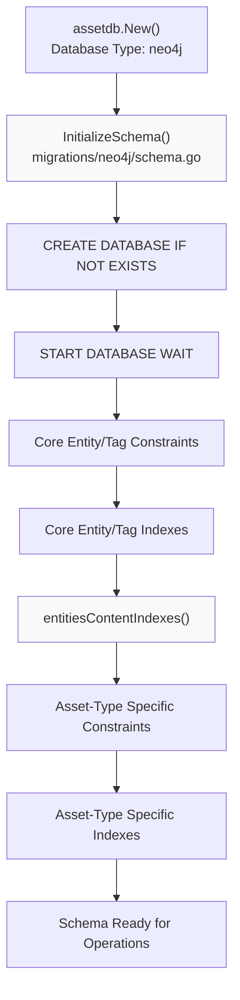
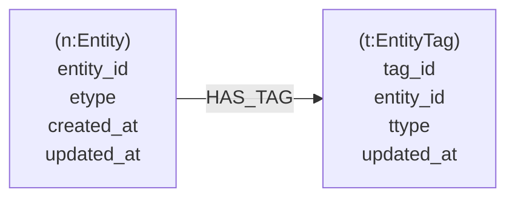
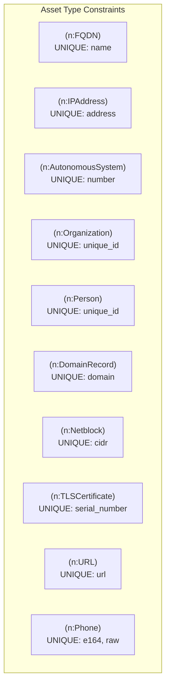
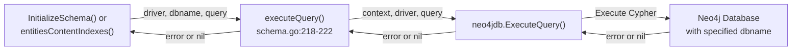
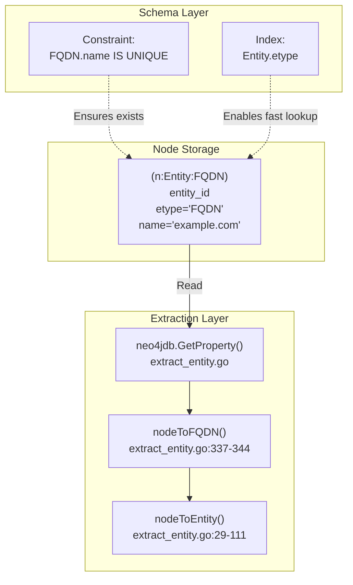

# Neo4j Schema Initialization

# Neo4j Schema Initialization

<details>
<summary>Relevant source files</summary>

The following files were used as context for generating this wiki page:

- [migrations/neo4j/schema.go](migrations/neo4j/schema.go)
- [repository/neo4j/extract_entity.go](repository/neo4j/extract_entity.go)

</details>


This page documents the Neo4j schema initialization process that occurs during database setup. The initialization creates the necessary constraints, indexes, and database structures required for storing and querying the asset graph database. Unlike the SQL migration system covered in [7.1](#7.1), Neo4j schema initialization uses Cypher queries to establish constraints and indexes rather than versioned migration scripts.

For information about Neo4j-specific entity and edge operations after initialization, see [5.1](#5.1) and [5.2](#5.2). For broader context on how Neo4j schema design influences query patterns, see [5.4](#5.4).

---

## Initialization Entry Point

The schema initialization is triggered through the `InitializeSchema` function located in [migrations/neo4j/schema.go:13-73](). This function accepts a Neo4j driver and database name, then executes a series of Cypher queries to establish the complete schema.



**Schema Initialization Flow**

The initialization follows a two-phase approach: first establishing core entity and tag structures, then creating asset-type-specific constraints and indexes.

**Sources:** [migrations/neo4j/schema.go:13-73]()

---

## Database Creation and Startup

The first operations ensure the database exists and is running:

| Operation | Cypher Query | Purpose |
|-----------|--------------|---------|
| Create Database | `CREATE DATABASE <dbname> IF NOT EXISTS` | Ensures database exists |
| Start Database | `START DATABASE <dbname> WAIT 10 SECONDS` | Activates database with 10-second timeout |

These operations are executed in [migrations/neo4j/schema.go:14-15]() using the `executeQuery` helper function [migrations/neo4j/schema.go:218-222](). The database name is passed as a parameter, allowing flexible deployment configurations.

**Sources:** [migrations/neo4j/schema.go:14-15](), [migrations/neo4j/schema.go:218-222]()

---

## Core Entity Schema

The Entity node schema establishes the foundation for all asset storage in Neo4j. Each entity in the graph is represented as a node with the label `Entity` and contains asset-type-specific content labels.

### Entity Constraints

The primary constraint ensures entity uniqueness across the database:

```cypher
CREATE CONSTRAINT constraint_entities_entity_id IF NOT EXISTS 
FOR (n:Entity) REQUIRE n.entity_id IS UNIQUE
```

This constraint is created in [migrations/neo4j/schema.go:17-20]() and guarantees that each entity can be uniquely identified by its `entity_id` property.

### Entity Indexes

Two range indexes optimize entity queries:

| Index Name | Property | Query Optimization |
|------------|----------|-------------------|
| `entities_range_index_etype` | `etype` | Enables fast filtering by asset type (FQDN, IPAddress, etc.) |
| `entities_range_index_updated_at` | `updated_at` | Supports temporal queries and cache invalidation |

These indexes are created in [migrations/neo4j/schema.go:22-30]() and directly support the query patterns used by `FindEntitiesByType` and time-based filtering operations.

**Sources:** [migrations/neo4j/schema.go:17-30]()

---

## EntityTag Schema

EntityTag nodes store metadata properties associated with entities. They connect to Entity nodes through relationships and provide flexible property storage following the Open Asset Model.



**EntityTag Node Structure**

### EntityTag Constraints

The uniqueness constraint for tags:

```cypher
CREATE CONSTRAINT constraint_enttag_tag_id IF NOT EXISTS 
FOR (n:EntityTag) REQUIRE n.tag_id IS UNIQUE
```

Created in [migrations/neo4j/schema.go:32-35]().

### EntityTag Indexes

Three range indexes optimize tag queries:

| Index Name | Property | Purpose |
|------------|----------|---------|
| `enttag_range_index_ttype` | `ttype` | Filter tags by property type |
| `enttag_range_index_updated_at` | `updated_at` | Temporal filtering |
| `enttag_range_index_entity_id` | `entity_id` | Fast tag lookup for specific entities |

These indexes are created in [migrations/neo4j/schema.go:37-50]() and enable efficient tag retrieval operations used by `GetEntityTags`.

**Sources:** [migrations/neo4j/schema.go:32-50]()

---

## EdgeTag Schema

EdgeTag nodes store properties for relationships between entities, following the same pattern as EntityTag but associated with edges.

### EdgeTag Constraints

```cypher
CREATE CONSTRAINT constraint_edgetag_tag_id IF NOT EXISTS 
FOR (n:EdgeTag) REQUIRE n.tag_id IS UNIQUE
```

Created in [migrations/neo4j/schema.go:52-55]().

### EdgeTag Indexes

Four range indexes support edge tag queries:

| Index Name | Property | Purpose |
|------------|----------|---------|
| `edgetag_range_index_ttype` | `ttype` | Filter by tag type |
| `edgetag_range_index_updated_at` | `updated_at` | Temporal queries |
| `edgetag_range_index_edge_id` | `edge_id` | Associate tags with specific edges |

Created in [migrations/neo4j/schema.go:57-70]().

**Sources:** [migrations/neo4j/schema.go:52-70]()

---

## Asset-Type Specific Constraints

The `entitiesContentIndexes` function [migrations/neo4j/schema.go:75-216]() creates constraints for each asset type defined in the Open Asset Model. These constraints ensure content uniqueness based on the natural key for each asset type.



**Sample Asset Type Constraints**

### Network Asset Constraints

| Asset Type | Label | Unique Property | Line Reference |
|------------|-------|-----------------|----------------|
| FQDN | `FQDN` | `name` | [migrations/neo4j/schema.go:111-114]() |
| IPAddress | `IPAddress` | `address` | [migrations/neo4j/schema.go:126-129]() |
| Netblock | `Netblock` | `cidr` | [migrations/neo4j/schema.go:146-149]() |
| AutonomousSystem | `AutonomousSystem` | `number` | [migrations/neo4j/schema.go:91-94]() |

### Registration Asset Constraints

| Asset Type | Label | Unique Property | Line Reference |
|------------|-------|-----------------|----------------|
| DomainRecord | `DomainRecord` | `domain` | [migrations/neo4j/schema.go:101-104]() |
| AutnumRecord | `AutnumRecord` | `handle`, `number` | [migrations/neo4j/schema.go:81-89]() |
| IPNetRecord | `IPNetRecord` | `handle` | [migrations/neo4j/schema.go:136-139]() |

### Identity Asset Constraints

| Asset Type | Label | Unique Property | Line Reference |
|------------|-------|-----------------|----------------|
| Organization | `Organization` | `unique_id` | [migrations/neo4j/schema.go:151-154]() |
| Person | `Person` | `unique_id` | [migrations/neo4j/schema.go:166-169]() |
| Account | `Account` | `unique_id` | [migrations/neo4j/schema.go:76-79]() |
| Phone | `Phone` | `e164`, `raw` | [migrations/neo4j/schema.go:176-184]() |

### Other Asset Constraints

Additional constraints for TLS certificates, URLs, files, and other asset types are created in [migrations/neo4j/schema.go:96-215]().

**Sources:** [migrations/neo4j/schema.go:75-216]()

---

## Searchable Field Indexes

Beyond uniqueness constraints, the initialization creates range indexes on frequently searched fields to optimize query performance.

### Organization Search Indexes

```cypher
CREATE INDEX org_range_index_name IF NOT EXISTS 
FOR (n:Organization) ON (n.name)

CREATE INDEX org_range_index_legal_name IF NOT EXISTS 
FOR (n:Organization) ON (n.legal_name)
```

Created in [migrations/neo4j/schema.go:156-164](). These indexes enable efficient organization lookup by name or legal name.

### Person Search Indexes

```cypher
CREATE INDEX person_range_index_full_name IF NOT EXISTS 
FOR (n:Person) ON (n.full_name)
```

Created in [migrations/neo4j/schema.go:171-174](). Enables person search by full name.

### Product Search Indexes

```cypher
CREATE INDEX product_range_index_name IF NOT EXISTS 
FOR (n:Product) ON (n.product_name)
```

Created in [migrations/neo4j/schema.go:191-194](). Supports product discovery by name.

### IPNetRecord CIDR Index

```cypher
CREATE INDEX ipnetrec_range_index_cidr IF NOT EXISTS 
FOR (n:IPNetRecord) ON (n.cidr)
```

Created in [migrations/neo4j/schema.go:131-134](). While `handle` is the unique constraint, CIDR is also indexed for network range queries.

**Sources:** [migrations/neo4j/schema.go:131-194]()

---

## Schema Execution Pattern

All schema operations use the `executeQuery` helper function, which provides consistent error handling and database context management.



**Query Execution Flow**

The function signature:

```go
func executeQuery(driver neo4jdb.DriverWithContext, dbname, query string) error
```

Located at [migrations/neo4j/schema.go:218-222](), this function:
- Executes queries in the background context
- Uses eager result transformation
- Specifies the target database via `ExecuteQueryWithDatabase`
- Returns any errors encountered during execution

**Sources:** [migrations/neo4j/schema.go:218-222]()

---

## Schema Relationship to Entity Extraction

The schema constraints directly correspond to the properties extracted when converting Neo4j nodes to entities. The extraction logic in [repository/neo4j/extract_entity.go:29-111]() uses `neo4jdb.GetProperty` to retrieve properties that must exist due to the schema constraints.



**Schema-to-Code Correspondence**

For example, the FQDN constraint at [migrations/neo4j/schema.go:111-114]() ensures the `name` property exists, which is retrieved by `neo4jdb.GetProperty[string](node, "name")` at [repository/neo4j/extract_entity.go:338-341]().

**Sources:** [migrations/neo4j/schema.go:111-114](), [repository/neo4j/extract_entity.go:29-111](), [repository/neo4j/extract_entity.go:337-344]()

---

## Error Handling During Initialization

The initialization process handles errors at multiple levels:

1. **Database Creation/Startup Errors**: Ignored via `_ = executeQuery()` at [migrations/neo4j/schema.go:14-15](), allowing the process to continue if the database already exists
2. **Constraint/Index Errors**: Checked and returned immediately, preventing partial schema initialization
3. **Content Index Errors**: Propagated from `entitiesContentIndexes` back to the caller

All constraint and index creation queries use the `IF NOT EXISTS` clause, making the initialization idempotent and safe to run multiple times.

**Sources:** [migrations/neo4j/schema.go:14-15](), [migrations/neo4j/schema.go:17-73]()

---

## Complete Constraint Summary

The following table provides a comprehensive reference of all constraints created during initialization:

| Node Label | Property | Constraint Type | Purpose |
|------------|----------|-----------------|---------|
| `Entity` | `entity_id` | UNIQUE | Primary entity identifier |
| `EntityTag` | `tag_id` | UNIQUE | Primary tag identifier |
| `EdgeTag` | `tag_id` | UNIQUE | Primary edge tag identifier |
| `Account` | `unique_id` | UNIQUE | Account deduplication |
| `AutnumRecord` | `handle` | UNIQUE | WHOIS record deduplication |
| `AutnumRecord` | `number` | UNIQUE | ASN deduplication |
| `AutonomousSystem` | `number` | UNIQUE | AS number deduplication |
| `ContactRecord` | `discovered_at` | UNIQUE | Contact discovery deduplication |
| `DomainRecord` | `domain` | UNIQUE | Domain name deduplication |
| `File` | `url` | UNIQUE | File URL deduplication |
| `FQDN` | `name` | UNIQUE | Hostname deduplication |
| `FundsTransfer` | `unique_id` | UNIQUE | Transaction deduplication |
| `Identifier` | `unique_id` | UNIQUE | Identifier deduplication |
| `IPAddress` | `address` | UNIQUE | IP address deduplication |
| `IPNetRecord` | `handle` | UNIQUE | WHOIS network record deduplication |
| `Location` | `address` | UNIQUE | Location address deduplication |
| `Netblock` | `cidr` | UNIQUE | Network block deduplication |
| `Organization` | `unique_id` | UNIQUE | Organization deduplication |
| `Person` | `unique_id` | UNIQUE | Person deduplication |
| `Phone` | `e164` | UNIQUE | E.164 format phone deduplication |
| `Phone` | `raw` | UNIQUE | Raw phone format deduplication |
| `Product` | `unique_id` | UNIQUE | Product deduplication |
| `ProductRelease` | `name` | UNIQUE | Release version deduplication |
| `Service` | `unique_id` | UNIQUE | Service deduplication |
| `TLSCertificate` | `serial_number` | UNIQUE | Certificate serial deduplication |
| `URL` | `url` | UNIQUE | URL deduplication |

**Sources:** [migrations/neo4j/schema.go:13-216]()