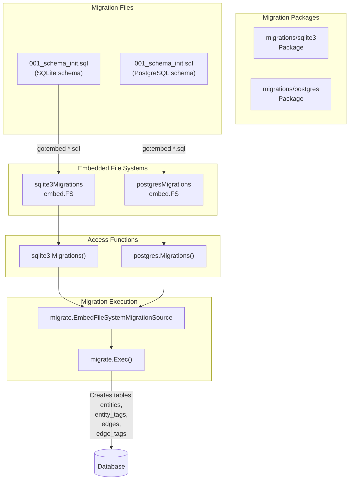
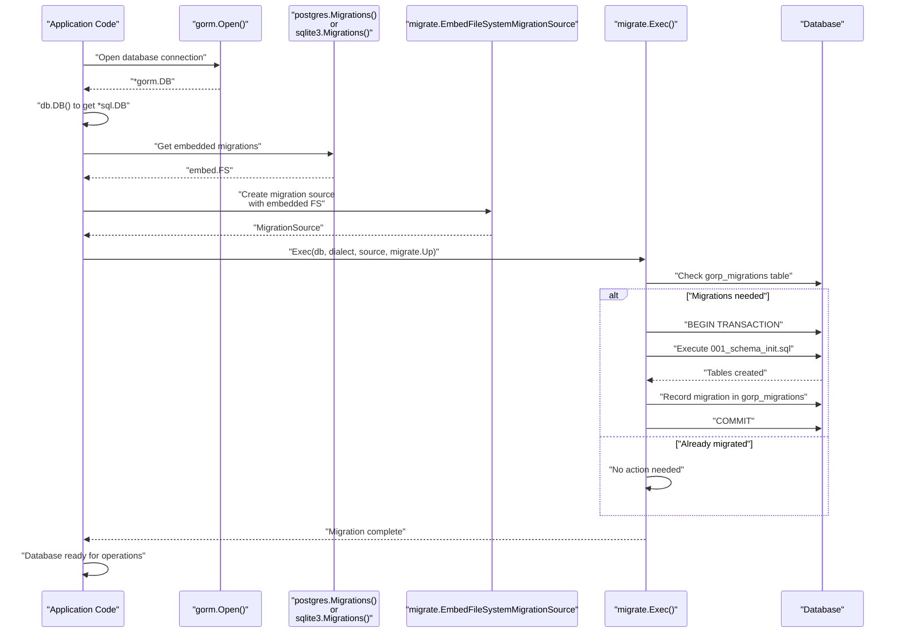

# Database Migrations

# Database Migrations

<details>
<summary>Relevant source files</summary>

The following files were used as context for generating this wiki page:

- [migrations/postgres/001_schema_init.sql](migrations/postgres/001_schema_init.sql)
- [migrations/postgres/embed.go](migrations/postgres/embed.go)
- [migrations/sqlite3/001_schema_init.sql](migrations/sqlite3/001_schema_init.sql)
- [migrations/sqlite3/embed.go](migrations/sqlite3/embed.go)
- [migrations/sqlite3/example_test.go](migrations/sqlite3/example_test.go)
- [types/types.go](types/types.go)

</details>


## Purpose and Scope

This page provides an overview of the database migration system in asset-db, which ensures database schemas are properly initialized and versioned before data operations begin. The migration system automatically creates the necessary tables, indexes, and constraints required by the repository implementations.

This page covers:
- The overall migration architecture and execution flow
- The embedded migration file system pattern used for SQL databases
- How the `sql-migrate` library is integrated for schema versioning

For detailed information about specific implementations:
- SQL schema structure and migration scripts: see [SQL Schema Migrations](#7.1)
- Neo4j constraint and index initialization: see [Neo4j Schema Initialization](#7.2)

---

## Migration System Overview

The asset-db migration system uses different approaches for SQL and graph databases:

| Database Type | Migration Tool | Migration Format | Location |
|--------------|----------------|------------------|----------|
| PostgreSQL | `rubenv/sql-migrate` | Embedded SQL scripts | [migrations/postgres/]() |
| SQLite | `rubenv/sql-migrate` | Embedded SQL scripts | [migrations/sqlite3/]() |
| Neo4j | Custom Cypher initialization | Programmatic constraints | [repository/neorepo/init.go]() |

The SQL migration system leverages Go's `embed` package to bundle migration scripts directly into the compiled binary, eliminating the need for external migration files at runtime.

**Sources:** [migrations/sqlite3/embed.go:1-17](), [migrations/postgres/embed.go:1-18]()

---

## Migration Architecture

The following diagram illustrates how migrations are organized and accessed:



The migration packages expose a `Migrations()` function that returns an `embed.FS` containing all SQL migration files. This pattern allows the `sql-migrate` library to read migration scripts as if they were regular files, while actually reading from embedded data compiled into the binary.

**Sources:** [migrations/sqlite3/embed.go:7-16](), [migrations/postgres/embed.go:7-17](), [migrations/sqlite3/001_schema_init.sql:1-85](), [migrations/postgres/001_schema_init.sql:1-90]()

---

## Migration Execution Flow

The following sequence diagram shows how migrations are executed during database initialization:



The `sql-migrate` library maintains its own tracking table (`gorp_migrations`) to record which migrations have been applied, preventing duplicate execution of migration scripts.

**Sources:** [migrations/sqlite3/example_test.go:16-54]()

---

## Embedded Migration Pattern

The migration system uses Go's `embed` directive to package SQL files into the compiled binary. Here's how the pattern works:

### SQLite Migration Package

The [migrations/sqlite3/embed.go:1-17]() file demonstrates the pattern:

```go
//go:embed *.sql
var sqlite3Migrations embed.FS

func Migrations() embed.FS {
    return sqlite3Migrations
}
```

The `//go:embed *.sql` directive instructs the Go compiler to embed all `.sql` files in the package directory into the `sqlite3Migrations` variable of type `embed.FS`. The `Migrations()` function provides external access to this embedded file system.

### PostgreSQL Migration Package

The [migrations/postgres/embed.go:1-18]() file follows the same pattern:

```go
//go:embed *.sql
var postgresMigrations embed.FS

func Migrations() embed.FS {
    return postgresMigrations
}
```

This consistent pattern allows both database types to be handled uniformly by the migration execution code.

**Sources:** [migrations/sqlite3/embed.go:7-16](), [migrations/postgres/embed.go:7-17]()

---

## Using Migrations in Code

The following example from [migrations/sqlite3/example_test.go:16-54]() demonstrates how to execute migrations:

```go
// 1. Open database connection with GORM
db, err := gorm.Open(sqlite.Open(dsn), &gorm.Config{})

// 2. Get standard *sql.DB from GORM
sqlDb, _ := db.DB()

// 3. Create migration source from embedded file system
migrationsSource := migrate.EmbedFileSystemMigrationSource{
    FileSystem: Migrations(),  // Get embed.FS
    Root:       "/",           // Root directory in the embedded FS
}

// 4. Execute migrations
_, err = migrate.Exec(sqlDb, "sqlite3", migrationsSource, migrate.Up)
```

The `migrate.Exec()` function takes:
- `sqlDb`: A standard `*sql.DB` connection
- `"sqlite3"` or `"postgres"`: The SQL dialect identifier
- `migrationsSource`: The embedded migration source
- `migrate.Up`: Direction (apply migrations)

**Sources:** [migrations/sqlite3/example_test.go:22-37]()

---

## Migration File Naming Convention

Migration files follow a numbered naming convention to control execution order:

| File Name | Purpose | Apply Order |
|-----------|---------|-------------|
| `001_schema_init.sql` | Initial schema creation | First |
| `002_*.sql` | Future migrations | Second |
| `003_*.sql` | Future migrations | Third |

The numeric prefix ensures migrations are applied in the correct sequence. Each file contains both `-- +migrate Up` and `-- +migrate Down` sections, allowing bidirectional migration.

### Migration File Structure

```sql
-- +migrate Up
CREATE TABLE entities(...);
CREATE INDEX idx_entities_updated_at ON entities (updated_at);
-- ... more DDL statements

-- +migrate Down
DROP INDEX IF EXISTS idx_entities_updated_at;
DROP TABLE entities;
-- ... rollback statements
```

The `-- +migrate Up` section defines the forward migration (creating schema), while `-- +migrate Down` defines the rollback (dropping schema). The `sql-migrate` library parses these directives to execute the appropriate section.

**Sources:** [migrations/sqlite3/001_schema_init.sql:1-85](), [migrations/postgres/001_schema_init.sql:1-90]()

---

## Database Schema Components

All SQL migrations create four core tables that map to the [types package](#3.2):

| Table Name | Maps To Type | Purpose |
|------------|--------------|---------|
| `entities` | `types.Entity` | Stores asset nodes |
| `entity_tags` | `types.EntityTag` | Stores entity metadata properties |
| `edges` | `types.Edge` | Stores relationships between entities |
| `edge_tags` | `types.EdgeTag` | Stores edge metadata properties |

Each table includes:
- Auto-incrementing primary key (`entity_id`, `tag_id`, `edge_id`)
- Timestamp fields (`created_at`, `updated_at`)
- Type field (`etype`, `ttype`) for storing OAM type information
- Content field (`content`) for storing serialized OAM objects
- Foreign key constraints for referential integrity
- Indexes on `updated_at` fields for efficient temporal queries

**Sources:** [migrations/sqlite3/001_schema_init.sql:6-66](), [migrations/postgres/001_schema_init.sql:3-71](), [types/types.go:13-47]()

---

## Database-Specific Differences

While the schema structure is identical across SQL databases, there are implementation differences:

| Feature | PostgreSQL | SQLite |
|---------|------------|--------|
| Primary Key | `INT GENERATED ALWAYS AS IDENTITY` | `INTEGER PRIMARY KEY` (autoincrement) |
| JSON Storage | `JSONB` (binary JSON with indexing) | `TEXT` (JSON as string) |
| Timestamp Type | `TIMESTAMP without time zone` | `DATETIME` |
| Foreign Key Default | Enforced by default | Requires `PRAGMA foreign_keys = ON` |
| Constraint Naming | Named constraints (`fk_entity_tags_entities`) | Anonymous constraints |

### SQLite Specific Configuration

SQLite requires explicit foreign key enforcement via pragma:

[migrations/sqlite3/001_schema_init.sql:3-4]()
```sql
-- see https://www.sqlite.org/foreignkeys.html#fk_enable about enabling foreign keys
PRAGMA foreign_keys = ON;
```

This pragma must be set at the beginning of each connection, not just during migration.

**Sources:** [migrations/sqlite3/001_schema_init.sql:3-12](), [migrations/postgres/001_schema_init.sql:3-10]()

---

## Migration State Tracking

The `sql-migrate` library automatically creates and manages a `gorp_migrations` table to track applied migrations:

```
gorp_migrations
├── id (migration identifier, e.g., "001_schema_init.sql")
└── applied_at (timestamp of application)
```

This table is created automatically and should not be modified manually. The library queries this table to determine which migrations need to be applied during `migrate.Exec()` execution.

**Sources:** [migrations/sqlite3/example_test.go:29-37]()

---

## Integration with Repository Layer

Migrations are executed before repository creation in the initialization flow. From the high-level architecture diagrams, the sequence is:

1. `assetdb.New()` is called with database type and connection string
2. Migration system executes schema initialization
3. Repository implementation (`sqlRepository` or `neoRepository`) is created
4. Repository is returned to the caller

This ensures the database schema is always in the correct state before any data operations occur. The migration execution is transparent to repository consumers.

For details on how repositories use the migrated schema:
- SQL repository usage: see [SQL Repository](#4)
- Neo4j repository usage: see [Neo4j Repository](#5)

**Sources:** Architecture diagrams, [migrations/sqlite3/example_test.go:16-54]()