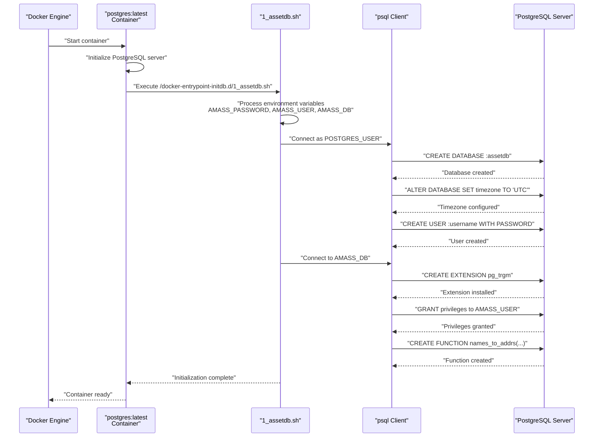
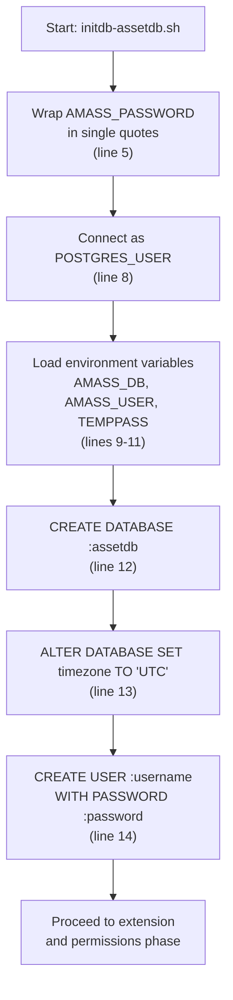
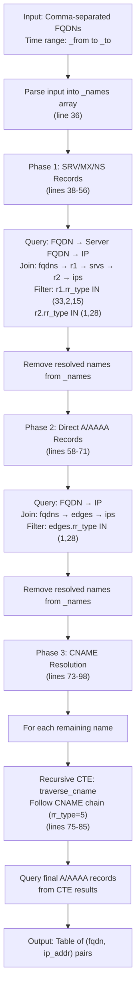
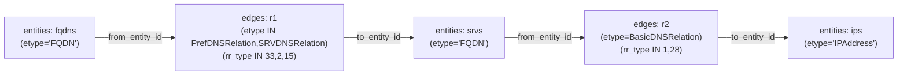
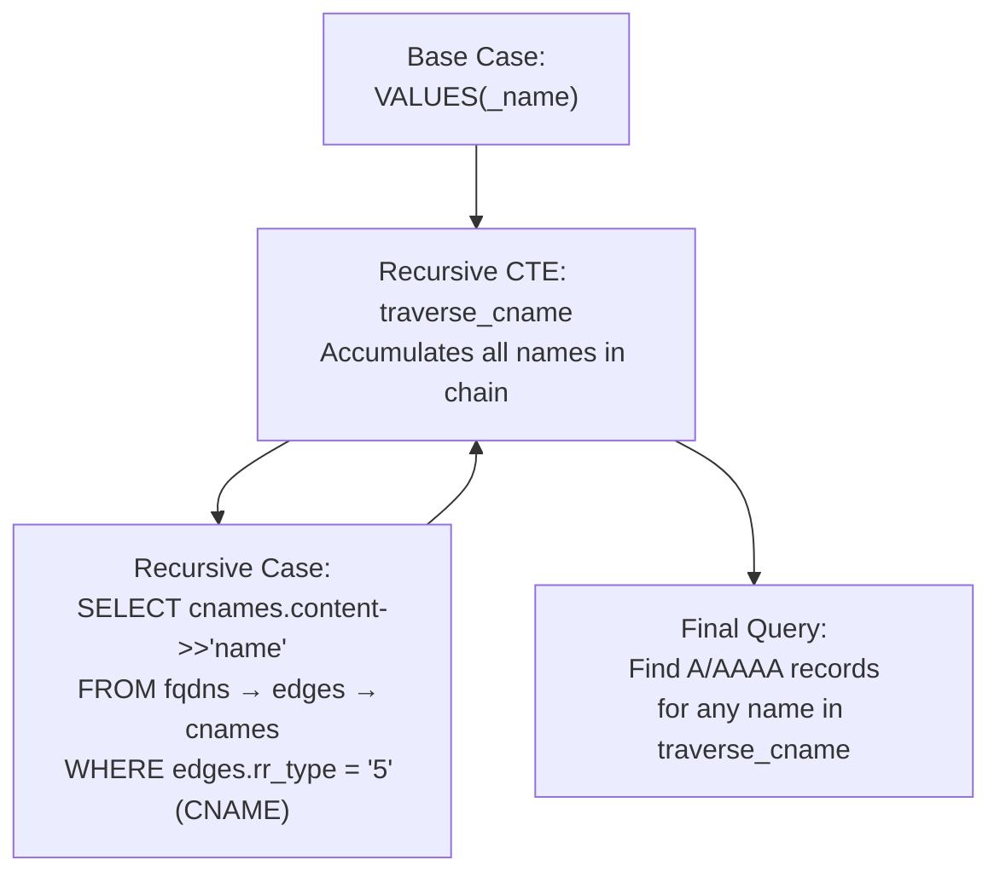
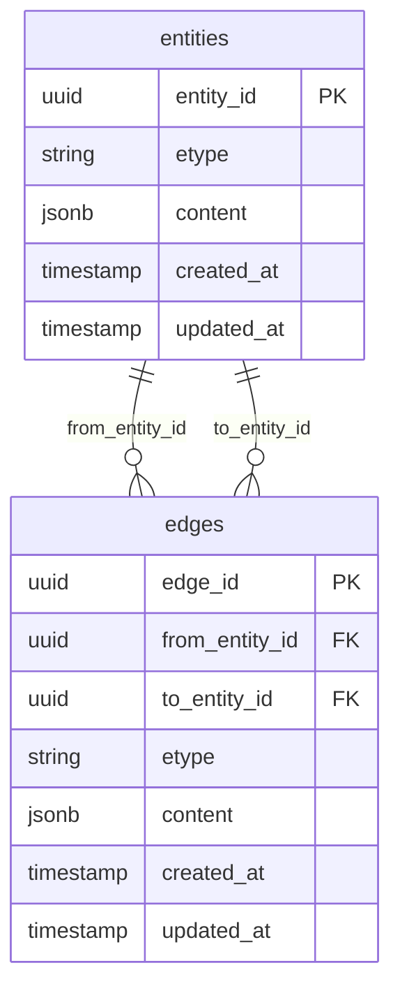

# PostgreSQL Docker Container

# PostgreSQL Docker Container

<details>
<summary>Relevant source files</summary>

The following files were used as context for generating this wiki page:

- [Dockerfile](Dockerfile)
- [initdb-assetdb.sh](initdb-assetdb.sh)

</details>


## Purpose and Scope

This document describes the PostgreSQL Docker container deployment configuration for asset-db. It covers the Dockerfile setup, database initialization process, user provisioning, extension installation, and the custom `names_to_addrs` function used for DNS resolution queries. For information about SQL schema migrations and table structures, see [SQL Schema Migrations](#7.1). For general database configuration and connection setup, see [Database Configuration](#2.2).

## Dockerfile Configuration

The asset-db PostgreSQL container is built using the official PostgreSQL base image with a custom initialization script.

**Container Specification**

| Component | Value | Purpose |
|-----------|-------|---------|
| Base Image | `postgres:latest` | Official PostgreSQL Docker image |
| Init Script | `/docker-entrypoint-initdb.d/1_assetdb.sh` | Automatic database setup on first run |
| Exposed Port | `5432` | Standard PostgreSQL port |
| Stop Signal | `SIGINT` | Graceful shutdown signal |
| Health Check | `pg_isready -U postgres -d postgres` | Every 5s with 10 retries |

The Dockerfile [Dockerfile:1-9]() performs the following operations:

1. Creates the initialization directory [Dockerfile:2]()
2. Copies the initialization script [Dockerfile:3]()
3. Makes the script executable [Dockerfile:4]()
4. Configures health checking and networking [Dockerfile:5-8]()

**Sources:** [Dockerfile:1-9]()

---

## Container Initialization Flow

The PostgreSQL container automatically executes scripts in `/docker-entrypoint-initdb.d/` on first startup. The asset-db initialization follows a specific sequence.

**Initialization Sequence Diagram**



**Sources:** [Dockerfile:1-9](), [initdb-assetdb.sh:1-102]()

---

## Environment Variables

The initialization script requires specific environment variables to configure the database and user credentials.

**Required Environment Variables**

| Variable | Purpose | Used In |
|----------|---------|---------|
| `POSTGRES_USER` | PostgreSQL superuser (default: `postgres`) | Database creation context |
| `AMASS_DB` | Name of the asset-db database to create | Target database name |
| `AMASS_USER` | Asset-db application username | Database user to create |
| `AMASS_PASSWORD` | Password for `AMASS_USER` | User authentication |

The script uses PostgreSQL's `\getenv` meta-command to read environment variables into psql variables [initdb-assetdb.sh:9-11](), and wraps the password in single quotes to handle special characters [initdb-assetdb.sh:5]().

**Sources:** [initdb-assetdb.sh:4-15]()

---

## Database and User Provisioning

The first phase of initialization creates the database and user with appropriate configuration.

**Database Creation Process**



The database is configured with UTC timezone to ensure consistent timestamp handling across the distributed Amass system [initdb-assetdb.sh:13]().

**Sources:** [initdb-assetdb.sh:4-15]()

---

## PostgreSQL Extensions and Permissions

After database creation, the script installs the `pg_trgm` extension and grants necessary privileges to the application user.

**Extension and Permission Setup**

The second psql session connects to the newly created database [initdb-assetdb.sh:19]():

| Operation | Command | Purpose |
|-----------|---------|---------|
| Install trigram extension | `CREATE EXTENSION pg_trgm SCHEMA public` | Enables fuzzy text matching for content searches |
| Grant schema usage | `GRANT USAGE ON SCHEMA public` | Allow user to access public schema |
| Grant schema creation | `GRANT CREATE ON SCHEMA public` | Allow user to create objects (migrations) |
| Grant table access | `GRANT ALL ON ALL TABLES IN SCHEMA public` | Full access to existing tables |

The `pg_trgm` extension [initdb-assetdb.sh:21]() is critical for the SQL repository's content-based entity search operations, enabling efficient similarity matching on JSON content fields using trigram indexes.

**Sources:** [initdb-assetdb.sh:17-25]()

---

## The names_to_addrs Function

The initialization script creates a custom PL/pgSQL function `names_to_addrs` that performs complex DNS resolution queries across the entity-edge graph structure.

### Function Signature

```
names_to_addrs(TEXT, TIMESTAMP WITH TIME ZONE, TIMESTAMP WITH TIME ZONE)
RETURNS TABLE(fqdn TEXT, ip_addr TEXT)
```

**Parameters:**
- `$1` (TEXT): Comma-separated list of FQDN names to resolve
- `$2` (TIMESTAMP): Start of time range (`_from`)
- `$3` (TIMESTAMP): End of time range (`_to`)

**Returns:** Table with columns `fqdn` and `ip_addr`

**Sources:** [initdb-assetdb.sh:26-27]()

---

### Function Logic Overview

The `names_to_addrs` function implements a three-phase DNS resolution strategy to find IP addresses for given FQDNs.

**Resolution Strategy Diagram**



**Sources:** [initdb-assetdb.sh:26-100]()

---

### Phase 1: Indirect DNS Records (SRV/MX/NS)

The first phase handles DNS records that point to an intermediate server name, which then resolves to an IP address.

**Query Structure:**

```
SELECT srvs.content->>'name' AS "name", ips.content->>'address' AS "addr"
FROM entities AS fqdns
INNER JOIN edges AS r1 ON fqdns.entity_id = r1.from_entity_id
INNER JOIN entities AS srvs ON r1.to_entity_id = srvs.entity_id
INNER JOIN edges AS r2 ON srvs.entity_id = r2.from_entity_id
INNER JOIN entities AS ips ON r2.to_entity_id = ips.entity_id
WHERE ...
```

**Join Pattern:**



**RR Types Handled:**
- **Type 33:** SRV (Service record)
- **Type 2:** NS (Name server)
- **Type 15:** MX (Mail exchange)
- **Type 1:** A (IPv4 address)
- **Type 28:** AAAA (IPv6 address)

Successfully resolved names are removed from the `_names` array [initdb-assetdb.sh:54]() to avoid duplicate resolution in subsequent phases.

**Sources:** [initdb-assetdb.sh:38-56]()

---

### Phase 2: Direct A/AAAA Records

The second phase handles FQDNs that have direct IP address mappings without intermediate records.

**Query Structure:**

```
SELECT fqdns.content->>'name' AS "name", ips.content->>'address' AS "addr"
FROM entities AS fqdns
INNER JOIN edges ON fqdns.entity_id = edges.from_entity_id
INNER JOIN entities AS ips ON edges.to_entity_id = ips.entity_id
WHERE fqdns.etype = 'FQDN'
  AND ips.etype = 'IPAddress'
  AND edges.etype = 'BasicDNSRelation'
  AND edges.content->>'label' = 'dns_record'
  AND edges.content->'header'->'rr_type' IN ('1', '28')
  AND edges.updated_at >= _from AND edges.updated_at <= _to
  AND fqdns.content->>'name' = ANY(_names)
```

This phase uses a simpler join pattern: FQDN → Edge → IP [initdb-assetdb.sh:60-66](). The time range filtering ensures only relevant DNS records are considered [initdb-assetdb.sh:65-66]().

**Sources:** [initdb-assetdb.sh:58-71]()

---

### Phase 3: CNAME Chain Resolution

The final phase handles remaining FQDNs by following CNAME (canonical name) chains using a recursive Common Table Expression (CTE).

**Recursive CTE Structure:**



The CTE [initdb-assetdb.sh:75-85]() recursively follows CNAME records (RR type 5) until it finds all canonical names in the chain. The final query [initdb-assetdb.sh:86-93]() then searches for A/AAAA records for any name in the traversed chain.

**CNAME Resolution Logic:**

1. Start with input name [initdb-assetdb.sh:76]()
2. Find all CNAMEs pointing from current name [initdb-assetdb.sh:77-85]()
3. Add discovered names to traversal set
4. Repeat until no more CNAMEs found
5. Query A/AAAA records for entire traversal set [initdb-assetdb.sh:86-93]()
6. Return results with original input name as `fqdn` [initdb-assetdb.sh:94]()

The function maintains the original input FQDN in the result [initdb-assetdb.sh:94](), even when resolution required following CNAME chains, providing a clear mapping from queried name to discovered IP address.

**Sources:** [initdb-assetdb.sh:73-98]()

---

## Function Properties

The `names_to_addrs` function is declared with specific properties affecting its behavior and optimization:

| Property | Value | Implication |
|----------|-------|-------------|
| Language | `plpgsql` | PostgreSQL procedural language |
| Volatility | `IMMUTABLE` | Result depends only on input parameters |
| Null handling | `STRICT` | Returns NULL if any parameter is NULL |

The `IMMUTABLE` property [initdb-assetdb.sh:100]() signals to PostgreSQL that the function's results depend solely on its input parameters, enabling query plan optimization and potential result caching. The `STRICT` property [initdb-assetdb.sh:100]() ensures the function doesn't execute at all when given NULL inputs, preventing unnecessary processing.

**Sources:** [initdb-assetdb.sh:100]()

---

## Container Health and Lifecycle

The Dockerfile configures health checking to ensure the container is ready before accepting connections.

**Health Check Configuration:**

| Parameter | Value | Purpose |
|-----------|-------|---------|
| Command | `pg_isready -U postgres -d postgres` | Verify server accepting connections |
| Interval | 5 seconds | Frequency of health checks |
| Timeout | 5 seconds | Maximum time for check to complete |
| Retries | 10 | Attempts before marking unhealthy |

The health check [Dockerfile:7-8]() uses PostgreSQL's built-in `pg_isready` utility to verify the server is accepting connections. With the configured parameters, the container allows up to 50 seconds (10 retries × 5 second interval) for the database to become ready before marking it as unhealthy.

The `SIGINT` stop signal [Dockerfile:5]() ensures PostgreSQL receives a graceful shutdown signal, allowing it to complete transactions and properly close files before termination.

**Sources:** [Dockerfile:5-8]()

---

## Integration with Asset-DB Schema

The initialized PostgreSQL database serves as the persistent storage layer for the SQL repository implementation. The `names_to_addrs` function operates on the schema created by SQL migrations.

**Schema Dependencies:**



The `names_to_addrs` function queries:
- **entities table:** Stores FQDN and IPAddress nodes with JSON content [initdb-assetdb.sh:40-44]()
- **edges table:** Stores DNS relationships with JSON metadata [initdb-assetdb.sh:41-43]()
- **etype field:** Entity/edge type for filtering [initdb-assetdb.sh:45]()
- **content field:** JSON data containing names, addresses, and DNS header info [initdb-assetdb.sh:39,46-48]()
- **updated_at field:** Timestamp for temporal filtering [initdb-assetdb.sh:50-51]()

For detailed schema structure and migration scripts, see [SQL Schema Migrations](#7.1).

**Sources:** [initdb-assetdb.sh:26-100]()