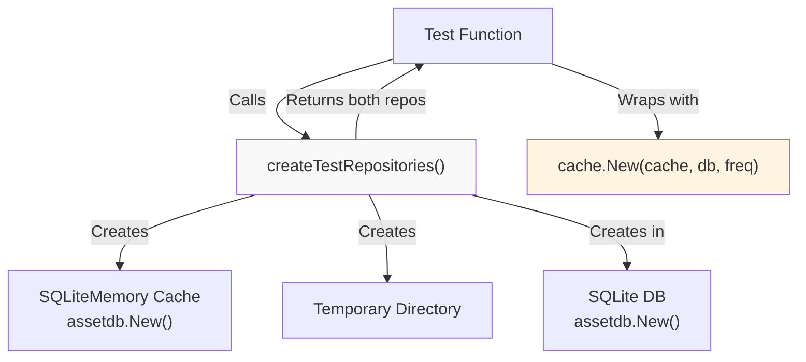
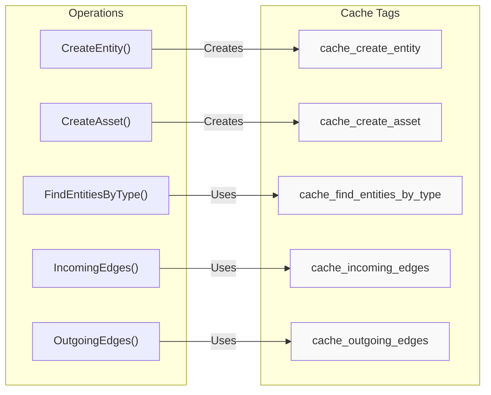
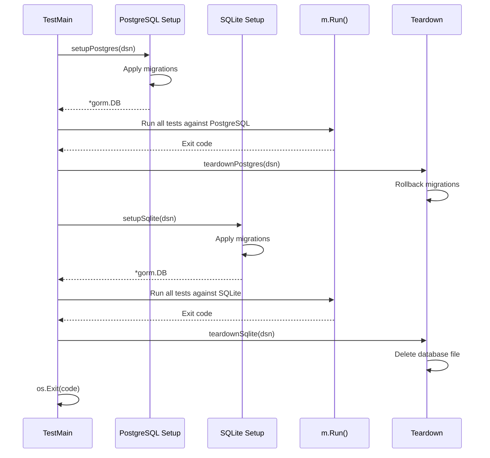
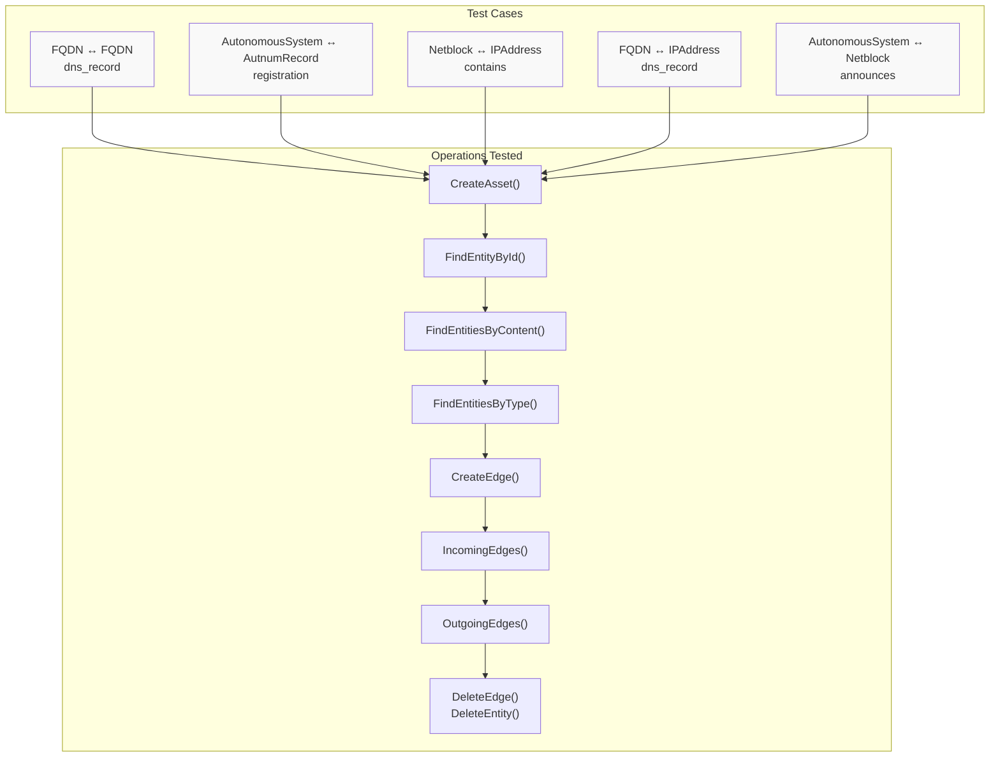
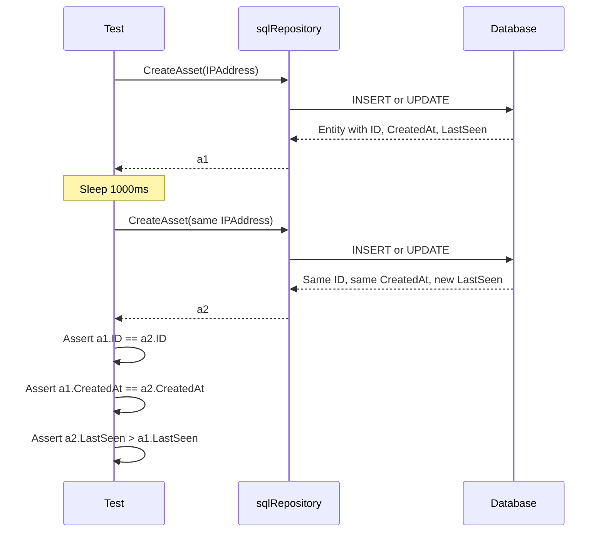
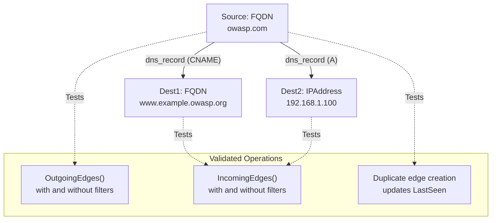
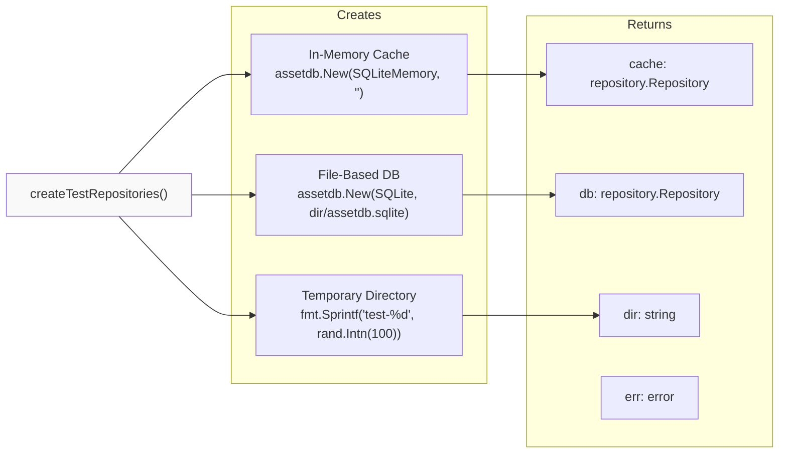
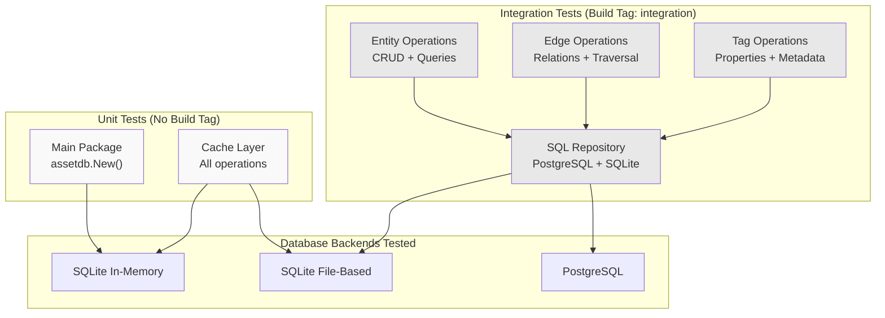

# Testing

# Testing

<details>
<summary>Relevant source files</summary>

The following files were used as context for generating this wiki page:

- [cache/cache_test.go](cache/cache_test.go)
- [cache/entity_test.go](cache/entity_test.go)
- [db_test.go](db_test.go)
- [repository/sqlrepo/edge_test.go](repository/sqlrepo/edge_test.go)
- [repository/sqlrepo/entity_test.go](repository/sqlrepo/entity_test.go)
- [repository/sqlrepo/tag_test.go](repository/sqlrepo/tag_test.go)

</details>


## Purpose and Scope

This document describes the testing infrastructure and approach for the asset-db repository. It covers test organization, execution procedures, and the testing strategies employed across different layers of the system. For information about the actual repository implementations being tested, see [SQL Repository](#4) and [Neo4j Repository](#5). For caching layer details, see [Caching System](#6).

---

## Test Organization

The test suite is organized by architectural layer, with each package containing tests for its respective functionality:

```
asset-db/
├── db_test.go                          # Main package initialization tests
├── cache/
│   ├── cache_test.go                   # Cache infrastructure tests
│   ├── entity_test.go                  # Cache entity operation tests
│   ├── edge_test.go                    # Cache edge operation tests
│   └── tag_test.go                     # Cache tag operation tests
└── repository/
    └── sqlrepo/
        ├── entity_test.go              # SQL entity integration tests
        ├── edge_test.go                # SQL edge integration tests
        └── tag_test.go                 # SQL tag integration tests
```

### Build Tags

The repository uses Go build tags to separate unit tests from integration tests:

| Build Tag | Purpose | Files |
|-----------|---------|-------|
| None (default) | Unit tests that use in-memory databases | `cache/*_test.go`, `db_test.go` |
| `integration` | Integration tests requiring real database instances | `repository/sqlrepo/*_test.go` |

**Sources**: [repository/sqlrepo/entity_test.go:1-1](), [cache/cache_test.go:1-87]()

---

## Unit Tests

### Cache Layer Tests

The cache layer tests validate caching behavior without requiring external database infrastructure. These tests use in-memory SQLite databases for both the cache and persistent storage layers.

#### Test Repository Creation



**Diagram**: Cache test infrastructure showing dual repository creation pattern

The `createTestRepositories` function creates two isolated repositories for testing:

- **Cache Repository**: In-memory SQLite (`SQLiteMemory`) for fast cache operations
- **Persistent Repository**: File-based SQLite in a temporary directory
- **Temporary Directory**: Automatically cleaned up after tests

**Sources**: [cache/cache_test.go:69-86]()

#### Cache Test Coverage

| Test Function | Purpose | Key Validations |
|---------------|---------|-----------------|
| `TestCacheImplementsRepository` | Interface compliance | Verifies `Cache` implements `repository.Repository` |
| `TestStartTime` | Cache initialization timing | Validates start time is set correctly on creation |
| `TestGetDBType` | Database type retrieval | Confirms correct database type is returned |
| `TestCreateEntity` | Entity creation with caching | Cache tag creation, eventual consistency with DB |
| `TestCreateAsset` | Asset creation convenience method | Similar to CreateEntity but with simpler API |
| `TestFindEntityById` | Entity lookup by ID | Cache hit behavior |
| `TestFindEntityByContent` | Content-based entity search | Temporal filtering, cache vs. DB queries |
| `TestFindEntitiesByType` | Type-based entity search | Tag-based cache invalidation |
| `TestDeleteEntity` | Entity deletion | Deletion from both cache and DB |

**Sources**: [cache/cache_test.go:22-67](), [cache/entity_test.go:20-404]()

#### Cache Tag System

The cache uses a tag-based invalidation system to track when data was last synchronized between the cache and persistent database:



**Diagram**: Cache tag system mapping operations to tag names

Tags store timestamps as `SimpleProperty` values, enabling temporal queries and cache freshness checks.

**Sources**: [cache/entity_test.go:50-52](), [cache/entity_test.go:99-101](), [cache/entity_test.go:313-314]()

### Main Package Tests

The main package contains basic tests for the initialization function:

```go
// Test from db_test.go
func TestNew(t *testing.T) {
    if _, err := New(sqlrepo.SQLiteMemory, ""); err != nil {
        t.Errorf("Failed to create a new SQLite in-memory repository: %v", err)
    }
}
```

This validates that the `assetdb.New` factory function correctly creates an in-memory SQLite repository.

**Sources**: [db_test.go:1-17]()

---

## Integration Tests

Integration tests validate repository implementations against real database instances. These tests are marked with the `//go:build integration` build tag and require running database servers.

### Test Setup Infrastructure

#### TestMain and Database Lifecycle

The SQL repository uses a `TestMain` function to coordinate test execution across multiple database backends:



**Diagram**: Integration test lifecycle showing sequential execution across database backends

**Sources**: [repository/sqlrepo/entity_test.go:121-179]()

#### Database-Specific Setup Functions

| Function | Database | Operations |
|----------|----------|------------|
| `setupPostgres(dsn)` | PostgreSQL | Opens connection, applies migrations using `pgmigrations.Migrations()` |
| `teardownPostgres(dsn)` | PostgreSQL | Opens connection, rolls back all migrations |
| `setupSqlite(dsn)` | SQLite | Opens connection, applies migrations using `sqlitemigrations.Migrations()` |
| `teardownSqlite(dsn)` | SQLite | Deletes database file |

**Sources**: [repository/sqlrepo/entity_test.go:41-119]()

#### Environment Variables

Integration tests use environment variables for database configuration:

| Variable | Default | Purpose |
|----------|---------|---------|
| `POSTGRES_USER` | `postgres` | PostgreSQL username |
| `POSTGRES_PASSWORD` | `postgres` | PostgreSQL password |
| `POSTGRES_DB` | `postgres` | PostgreSQL database name |
| `SQLITE3_DB` | `test.db` | SQLite database file path |

**Sources**: [repository/sqlrepo/entity_test.go:122-154]()

### SQL Repository Test Coverage

#### Entity Operations

The `TestRepository` function provides comprehensive coverage of entity and edge operations through multiple test cases:



**Diagram**: Test case structure showing operations validated per asset type combination

Each test case validates:
1. Entity creation and ID assignment
2. Entity retrieval by ID
3. Entity search by content
4. Entity search by type
5. Edge creation between entities
6. Incoming edge queries
7. Outgoing edge queries
8. Edge and entity deletion

**Sources**: [repository/sqlrepo/entity_test.go:200-363]()

#### LastSeen Update Behavior

The `TestLastSeenUpdates` function validates that duplicate entity creation updates the `LastSeen` timestamp while preserving the original `CreatedAt` timestamp:



**Diagram**: LastSeen update validation sequence

**Sources**: [repository/sqlrepo/entity_test.go:181-198]()

#### Edge Operations

The `TestUnfilteredRelations` function validates edge creation, querying, and duplicate handling:



**Diagram**: Edge operation test structure showing multi-edge scenario

**Sources**: [repository/sqlrepo/edge_test.go:20-112]()

#### Tag Operations

Tag tests validate the lifecycle of both entity and edge tags:

| Test | Operations Validated |
|------|---------------------|
| `TestEntityTag` | `CreateEntityProperty()`, `FindEntityTagById()`, `GetEntityTags()`, `DeleteEntityTag()` |
| `TestEdgeTag` | `CreateEdgeProperty()`, `FindEdgeTagById()`, `GetEdgeTags()`, `DeleteEdgeTag()` |

Both tests verify:
- Tag creation with correct property name/value
- Timestamp initialization (`CreatedAt`, `LastSeen`)
- Duplicate property handling (updates `LastSeen`)
- Property value updates (creates new tag with new `CreatedAt`)
- Tag retrieval by ID and by entity/edge
- Tag deletion

**Sources**: [repository/sqlrepo/tag_test.go:20-165]()

---

## Running Tests

### Unit Tests (Default)

Run all unit tests including cache tests:

```bash
go test ./...
```

Run cache tests specifically:

```bash
go test ./cache/...
```

Run with verbose output:

```bash
go test -v ./cache/...
```

**Sources**: [cache/cache_test.go:1-87](), [db_test.go:1-17]()

### Integration Tests

Integration tests require running database instances.

#### Prerequisites

**PostgreSQL**:
```bash
docker run -d \
  -p 5432:5432 \
  -e POSTGRES_USER=postgres \
  -e POSTGRES_PASSWORD=postgres \
  -e POSTGRES_DB=postgres \
  postgres:latest
```

**SQLite**: No external setup required (file-based)

#### Running Integration Tests

Execute integration tests with the build tag:

```bash
go test -tags=integration ./repository/sqlrepo/...
```

With custom environment variables:

```bash
POSTGRES_USER=testuser \
POSTGRES_PASSWORD=testpass \
POSTGRES_DB=testdb \
SQLITE3_DB=/tmp/test.db \
go test -tags=integration ./repository/sqlrepo/...
```

Verbose output:

```bash
go test -tags=integration -v ./repository/sqlrepo/...
```

**Sources**: [repository/sqlrepo/entity_test.go:1-1](), [repository/sqlrepo/entity_test.go:122-154]()

---

## Test Helpers and Utilities

### Cache Test Helpers

#### createTestRepositories Function



**Diagram**: createTestRepositories helper function structure

This helper provides:
- Isolated test environments via temporary directories
- In-memory cache for fast operations
- File-based persistent storage for validation
- Automatic cleanup via `defer` in test functions

**Sources**: [cache/cache_test.go:69-86]()

### SQL Repository Test Helpers

#### testSetup Structure

The `testSetup` struct encapsulates database-specific setup and teardown logic:

```go
type testSetup struct {
    name     string                           // Database type name
    dsn      string                           // Data source name
    setup    func(string) (*gorm.DB, error)  // Setup function
    teardown func(string)                     // Teardown function
}
```

This abstraction allows `TestMain` to iterate over multiple database backends with consistent setup/teardown procedures.

**Sources**: [repository/sqlrepo/entity_test.go:34-39]()

#### Migration Helpers

Both setup functions use embedded migration sources:

**PostgreSQL**:
```go
migrationsSource := migrate.EmbedFileSystemMigrationSource{
    FileSystem: pgmigrations.Migrations(),
    Root:       "/",
}
_, err = migrate.Exec(sqlDb, "postgres", migrationsSource, migrate.Up)
```

**SQLite**:
```go
migrationsSource := migrate.EmbedFileSystemMigrationSource{
    FileSystem: sqlitemigrations.Migrations(),
    Root:       "/",
}
_, err = migrate.Exec(sqlDb, "sqlite3", migrationsSource, migrate.Up)
```

**Sources**: [repository/sqlrepo/entity_test.go:47-61](), [repository/sqlrepo/entity_test.go:79-92]()

---

## Test Assertions and Validation Patterns

### Testing Framework

All tests use the `testify/assert` package for assertions:

```go
import "github.com/stretchr/testify/assert"

// Common patterns
assert.NoError(t, err)                    // Verify no error occurred
assert.Error(t, err)                      // Verify error occurred
assert.Equal(t, expected, actual)         // Verify equality
assert.NotEqual(t, notExpected, actual)   // Verify inequality
```

**Sources**: [cache/cache_test.go:19](), [repository/sqlrepo/entity_test.go:27]()

### Temporal Validation Pattern

Tests frequently validate timestamp behavior:

```go
before := time.Now().Add(-2 * time.Second)
after := time.Now().Add(2 * time.Second)

// Create entity
entity, err := c.CreateEntity(...)

// Validate timestamp within window
if entity.CreatedAt.Before(before) || entity.CreatedAt.After(after) {
    t.Errorf("timestamp outside expected window")
}
```

This pattern accounts for database timestamp precision and test execution timing.

**Sources**: [cache/entity_test.go:34-49](), [repository/sqlrepo/tag_test.go:24-40]()

### Deep Equality for Assets

Asset comparison uses `reflect.DeepEqual` to validate OAM asset reconstruction:

```go
if !reflect.DeepEqual(entity1.Asset, entity2.Asset) {
    t.Errorf("DeepEqual failed for the assets in the two entities")
}
```

This ensures proper serialization/deserialization of complex asset types through the database layer.

**Sources**: [cache/entity_test.go:63-64](), [repository/sqlrepo/entity_test.go:259-261]()

---

## Test Coverage Summary



**Diagram**: Complete test coverage across layers and database backends

| Layer | Test Files | Databases | Coverage |
|-------|-----------|-----------|----------|
| Main Package | `db_test.go` | SQLite (memory) | Initialization |
| Cache Layer | `cache/*_test.go` | SQLite (memory, file) | All operations, tag system, dual-repository pattern |
| SQL Repository | `repository/sqlrepo/*_test.go` | PostgreSQL, SQLite | Entities, edges, tags, migrations |

**Sources**: [db_test.go:1-17](), [cache/cache_test.go:1-87](), [cache/entity_test.go:1-404](), [repository/sqlrepo/entity_test.go:1-377]()