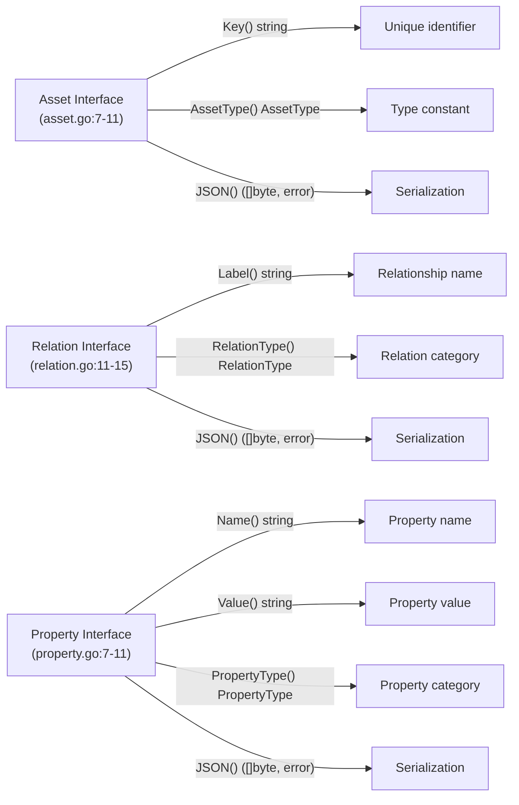
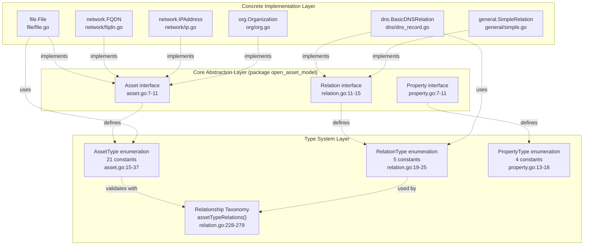
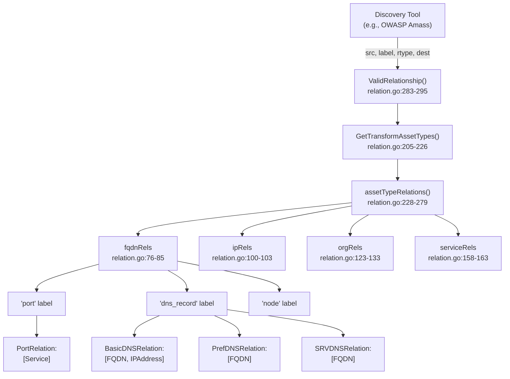
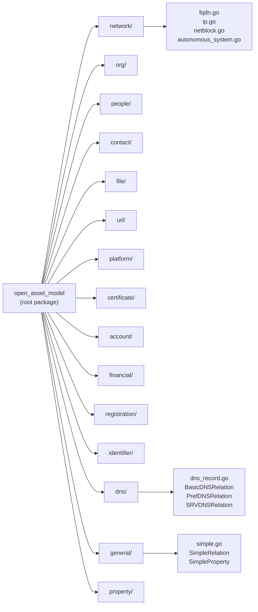
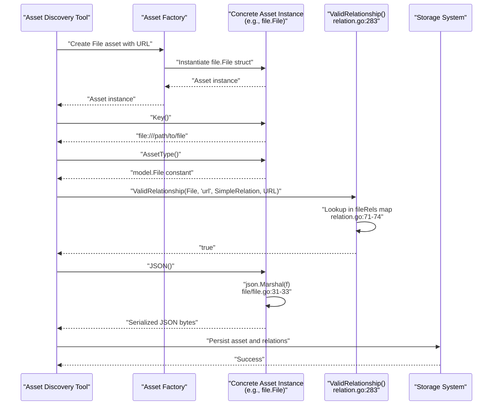
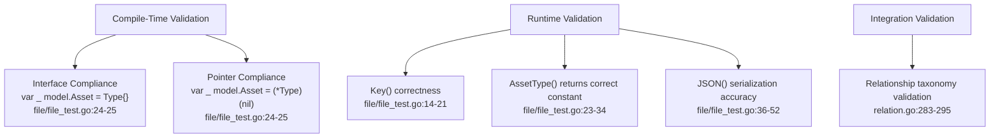

# Open Asset Model Overview

# Open Asset Model Overview

<details>
<summary>Relevant source files</summary>

The following files were used as context for generating this wiki page:

- [asset.go](asset.go)
- [docs/CONTRIBUTING.md](docs/CONTRIBUTING.md)
- [docs/README.md](docs/README.md)
- [docs/images/taxonomy.excalidraw.png](docs/images/taxonomy.excalidraw.png)
- [docs/taxonomy.md](docs/taxonomy.md)
- [file/file.go](file/file.go)
- [file/file_test.go](file/file_test.go)
- [relation.go](relation.go)

</details>


## Purpose and Scope

This document introduces the Open Asset Model repository, a standardized specification for describing organizational attack surfaces through typed assets, their relationships, and properties. The model serves as a transport specification enabling tools to exchange asset inventory data in a consistent format.

For detailed information about specific components, see [Core Architecture](#2) for the three-tier system design, [Asset Types](#3) for the complete taxonomy of 21 asset types, [Relationship System](#4) for inter-asset connections, and [Implementation Patterns](#6) for guidance on extending the model.

## Overview

The Open Asset Model is a **specification**, not a discovery tool. It defines a common vocabulary and structure for representing attack surface assets discovered by tools like OWASP Amass. The model encompasses not just network infrastructure (FQDNs, IP addresses, autonomous systems) but also organizational entities (organizations, people, locations), digital artifacts (files, URLs, services, certificates), financial assets, and registration records.

The specification is implemented in Go and uses JSON as its serialization format, enabling interoperability between asset discovery tools, storage systems, and analysis platforms.

**Sources:** [docs/README.md:1-114](), [docs/taxonomy.md:1-37]()

## Design Philosophy

The model addresses three key requirements:

| Requirement | Solution | Implementation |
|------------|----------|----------------|
| **Asset Diversity** | Model 21 distinct asset types spanning technical, organizational, and digital domains | Type enumeration in [asset.go:15-37]() |
| **Relationship Integrity** | Enforce valid connections between asset types through compile-time and runtime validation | Relationship taxonomy in [relation.go:31-295]() |
| **Data Exchange** | Provide JSON serialization for all assets, relations, and properties | `JSON()` method required by all interfaces |

The architecture follows **interface segregation principles**: clients depend on abstract interfaces (`Asset`, `Relation`, `Property`) rather than concrete types, enabling polymorphic handling across the system.

**Sources:** [asset.go:1-44](), [relation.go:1-296](), [docs/README.md:44-56]()

## Core Interface Specifications

The model defines three fundamental interfaces that all implementations must satisfy:



### Asset Interface

Defined in [asset.go:7-11](), the `Asset` interface requires three methods:

- **`Key() string`**: Returns a unique identifier for the asset instance. For example, `File` uses its URL as the key [file/file.go:21-23](), while `FQDN` uses its domain name.
- **`AssetType() AssetType`**: Returns one of 21 type constants from [asset.go:15-37](). This enables type-based routing and validation.
- **`JSON() ([]byte, error)`**: Serializes the asset to JSON format for transport and storage.

### Relation Interface

Defined in [relation.go:11-15](), the `Relation` interface models connections between assets:

- **`Label() string`**: The semantic name of the relationship (e.g., "dns_record", "port", "certificate")
- **`RelationType() RelationType`**: One of 5 relation type constants [relation.go:19-25]() that determines relationship semantics
- **`JSON() ([]byte, error)`**: Serializes relationship metadata (e.g., DNS record types, port numbers)

### Property Interface

Properties attach metadata to assets without creating relationships. They represent attributes like DNS record details, source provenance, or vulnerability information. See [Property System](#5) for details.

**Sources:** [asset.go:7-11](), [relation.go:11-15](), [property.go:7-11](), [file/file.go:20-33]()

## Three-Tier Architecture



**Layer 1: Core Abstraction Layer** defines the three fundamental interfaces. These reside in the root `open_asset_model` package and have no dependencies on concrete types.

**Layer 2: Type System Layer** provides enumerations and validation logic:
- **`AssetType`** enumeration ([asset.go:15-37]()): 21 constants like `FQDN`, `IPAddress`, `Organization`, `TLSCertificate`
- **`RelationType`** enumeration ([relation.go:19-25]()): 5 constants for relationship semantics
- **Relationship Taxonomy** ([relation.go:228-279]()): Central dispatcher function `assetTypeRelations()` that maps each asset type to valid outgoing relationships

**Layer 3: Concrete Implementation Layer** contains domain-specific packages:
- `network/` - Network infrastructure assets (FQDN, IPAddress, Netblock, AutonomousSystem)
- `org/`, `people/`, `contact/` - Organizational entities
- `file/`, `url/`, `platform/`, `certificate/` - Digital artifacts
- `account/`, `financial/` - Financial assets
- `registration/` - WHOIS/RDAP records
- `dns/`, `general/` - Relationship implementations

**Sources:** [asset.go:1-44](), [relation.go:1-296](), [file/file.go:1-34]()

## Asset Type Taxonomy

The model defines 21 asset types organized into seven domains:

```mermaid
graph TD
    Root["AssetType Enumeration<br/>asset.go:15-37"]
    
    Root --> Network["Network Infrastructure<br/>(6 types)"]
    Root --> Org["Organizational<br/>(5 types)"]
    Root --> Digital["Digital Artifacts<br/>(5 types)"]
    Root --> Financial["Financial<br/>(2 types)"]
    Root --> Product["Product<br/>(2 types)"]
    Root --> Registration["Registration<br/>(3 types)"]
    Root --> Identity["Identity<br/>(1 type)"]
    
    Network --> FQDN["FQDN<br/>network/fqdn.go"]
    Network --> IPAddress["IPAddress<br/>network/ip.go"]
    Network --> Netblock["Netblock<br/>network/netblock.go"]
    Network --> AutonomousSystem["AutonomousSystem<br/>network/autonomous_system.go"]
    
    Org --> Organization["Organization<br/>org/org.go"]
    Org --> Person["Person<br/>people/person.go"]
    Org --> Location["Location<br/>contact/location.go"]
    Org --> Phone["Phone<br/>contact/phone.go"]
    Org --> ContactRecord["ContactRecord<br/>contact/contact_record.go"]
    
    Digital --> File["File<br/>file/file.go"]
    Digital --> URL["URL<br/>url/url.go"]
    Digital --> Service["Service<br/>platform/service.go"]
    Digital --> TLSCertificate["TLSCertificate<br/>certificate/tls_certificate.go"]
    Digital --> DomainRecord["DomainRecord<br/>registration/domain_record.go"]
    
    Financial --> Account["Account<br/>account/account.go"]
    Financial --> FundsTransfer["FundsTransfer<br/>financial/funds_transfer.go"]
    
    Product --> ProductType["Product<br/>platform/product.go"]
    Product --> ProductRelease["ProductRelease<br/>platform/product.go"]
    
    Registration --> DomainRec["DomainRecord"]
    Registration --> AutnumRecord["AutnumRecord<br/>registration/autnum_record.go"]
    Registration --> IPNetRecord["IPNetRecord<br/>registration/ipnet_record.go"]
    
    Identity --> Identifier["Identifier<br/>identifier/identifier.go"]
```



The complete enumeration is stored in `AssetList` [asset.go:39-43](), which provides a canonical ordering for iteration. Each constant maps to a concrete implementation in a domain-specific package.

This breadth distinguishes the model from pure network scanners—it treats attack surface discovery holistically, modeling technical infrastructure alongside organizational context, digital presence, and financial relationships.

**Sources:** [asset.go:15-43](), [docs/taxonomy.md:39-554]()

## Relationship Validation System

The model enforces relationship integrity through a three-level nested map structure:



### Validation Flow

1. **Central Dispatcher**: `assetTypeRelations(atype AssetType)` [relation.go:228-279]() acts as a switch statement mapping each of the 21 asset types to its relationship map.

2. **Nested Map Structure**: Each asset type's map follows the pattern `map[string]map[RelationType][]AssetType`:
   - **Level 1 (string)**: Relationship label (e.g., "dns_record", "port", "certificate")
   - **Level 2 (RelationType)**: Relation type constant (e.g., `BasicDNSRelation`, `SimpleRelation`)
   - **Level 3 ([]AssetType)**: Slice of valid destination asset types

3. **Public API Functions**:
   - `GetAssetOutgoingRelations(subject AssetType)` [relation.go:188-199](): Returns all valid labels for an asset type
   - `GetTransformAssetTypes(subject AssetType, label string, rtype RelationType)` [relation.go:205-226](): Returns valid destination types for a specific label and relation type
   - `ValidRelationship(src AssetType, label string, rtype RelationType, destination AssetType)` [relation.go:283-295](): Boolean validation for a complete relationship tuple

### Example: FQDN Relationships

The `fqdnRels` map [relation.go:76-85]() demonstrates multi-valued relationships:

```go
var fqdnRels = map[string]map[RelationType][]AssetType{
    "port": {PortRelation: {Service}},
    "dns_record": {
        BasicDNSRelation: {FQDN, IPAddress},  // A, AAAA, CNAME, NS records
        PrefDNSRelation:  {FQDN},             // MX records with preference
        SRVDNSRelation:   {FQDN},             // SRV records with priority/weight
    },
    "node":         {SimpleRelation: {FQDN}},
    "registration": {SimpleRelation: {DomainRecord}},
}
```

A single label ("dns_record") can map to different destination types depending on the `RelationType`, enabling sophisticated DNS infrastructure modeling.

**Sources:** [relation.go:76-295]()

## Package Organization



The repository follows a **hub-and-spoke architecture**:

- **Root package** (`open_asset_model`): Contains only interface definitions ([asset.go](), [relation.go](), [property.go]()) and type enumerations. No concrete implementations.

- **Domain-specific packages**: Each package contains one or more concrete asset types that implement the `Asset` interface. Package names are semantic:
  - `network/` - Network primitives
  - `org/`, `people/`, `contact/` - Organizational entities
  - `file/`, `url/`, `platform/`, `certificate/` - Digital artifacts
  - `account/`, `financial/` - Financial assets
  - `registration/` - WHOIS/RDAP records
  - `identifier/` - Universal identifiers (LEI, DUNS, etc.)

- **Cross-cutting packages**: 
  - `dns/` - DNS-specific relation implementations
  - `general/` - Generic `SimpleRelation` and `SimpleProperty` implementations
  - `property/` - Property type implementations

This structure enables **independent evolution** of asset types while maintaining system-wide polymorphism through the core interfaces.

**Sources:** File structure observed across repository

## Data Flow and Usage Pattern



### Typical Integration Pattern

1. **Asset Creation**: Discovery tools instantiate concrete types (e.g., `file.File{URL: "...", Name: "...", Type: "..."}`)

2. **Identity Extraction**: Call `Key()` to get the unique identifier for deduplication

3. **Type Classification**: Call `AssetType()` to route the asset to appropriate handlers

4. **Relationship Validation**: Before persisting relationships, call `ValidRelationship()` to ensure taxonomy compliance

5. **Serialization**: Call `JSON()` to serialize for transport or storage. All implementations use `encoding/json.Marshal` with struct field tags [file/file.go:14-18]()

6. **Storage**: Persist JSON bytes to database/file system

This flow enforces **data integrity at ingestion time**—invalid relationships are rejected before storage, preventing graph corruption.

**Sources:** [file/file.go:20-33](), [relation.go:283-295](), [file/file_test.go:14-52]()

## Testing Strategy

The model employs a three-layer testing approach:



### Test File Pattern

Every concrete asset type includes a `_test.go` file with three standard tests, as demonstrated in [file/file_test.go:1-53]():

1. **Interface Compliance** (lines 24-25): Uses Go's type assertion pattern to verify implementation
   ```go
   var _ model.Asset = File{}       // Verify value receiver
   var _ model.Asset = (*File)(nil) // Verify pointer receiver
   ```

2. **Method Behavior** (lines 14-34): Tests each interface method returns expected values

3. **JSON Serialization** (lines 36-52): Validates JSON output matches expected schema, including `omitempty` tag behavior

This defensive testing strategy is critical for a **community-driven specification**—any interface-breaking change is caught at compile time.

**Sources:** [file/file_test.go:1-53](), [docs/.github/workflows observed in CI configuration]

## Relationship to OWASP Amass

The Open Asset Model was developed as part of the **Amass ecosystem** to provide a standardized data exchange format. While Amass is an asset discovery tool, the Open Asset Model is purely a specification—it defines what can be represented, not how to discover it.

The relationship:
- **Amass**: Discovers assets through DNS enumeration, web scraping, certificate transparency, WHOIS lookups
- **Open Asset Model**: Provides the type system for representing discovered assets and their relationships
- **Integration**: Amass can serialize discovered assets using this model's JSON format for consumption by other tools

The model is intentionally **tool-agnostic**—any asset discovery system can adopt it as a transport specification.

**Sources:** [docs/README.md:13-42]()

## Extension Points

The model is designed for extension through three mechanisms:

1. **New Asset Types**: Add a new constant to `AssetType` enumeration [asset.go:15-37](), create implementation package, add to `AssetList` [asset.go:39-43]()

2. **New Relationship Types**: Add constant to `RelationType` enumeration [relation.go:19-25](), implement `Relation` interface, add validation rules to appropriate asset type maps

3. **New Property Types**: Add constant to `PropertyType` enumeration, implement `Property` interface

For detailed implementation guidance, see [Implementing Asset Types](#6.1) and [Testing Asset Implementations](#6.2).

**Sources:** [asset.go:15-43](), [relation.go:19-29](), [property.go:13-18]()

---

**Primary Sources:**
- [asset.go:1-44]()
- [relation.go:1-296]()
- [property.go:1-60]()
- [file/file.go:1-34]()
- [file/file_test.go:1-53]()
- [docs/README.md:1-114]()
- [docs/taxonomy.md:1-586]()
- [docs/CONTRIBUTING.md:1-65]()