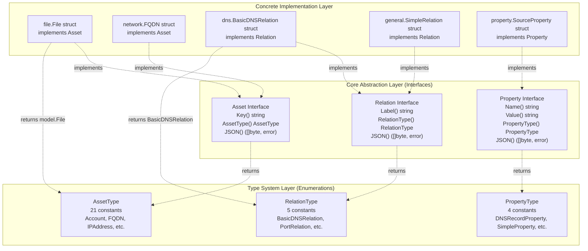
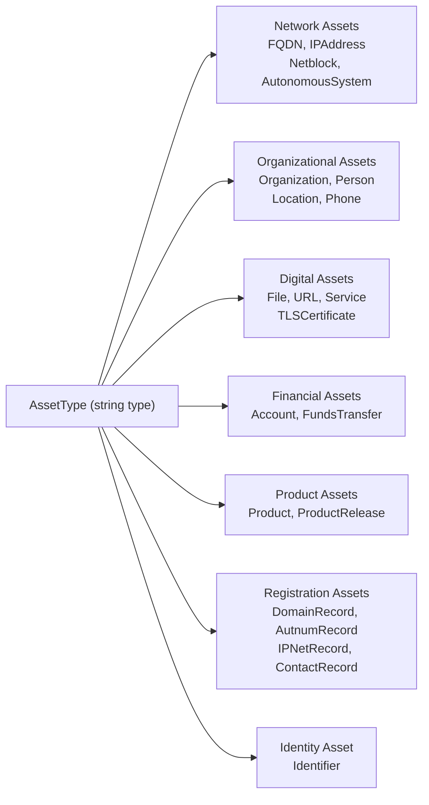
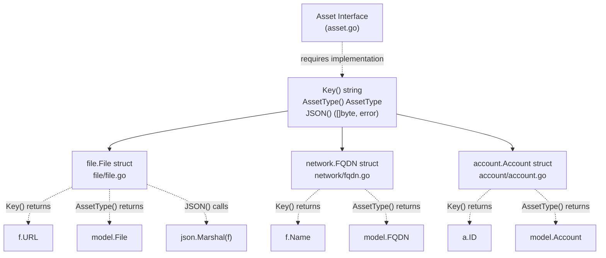
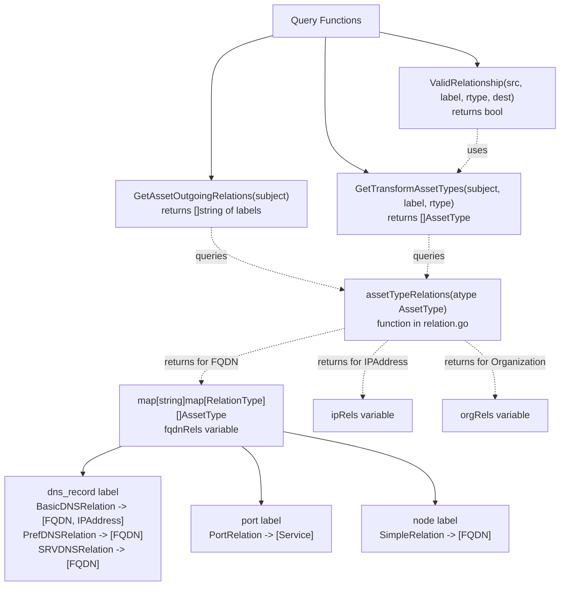
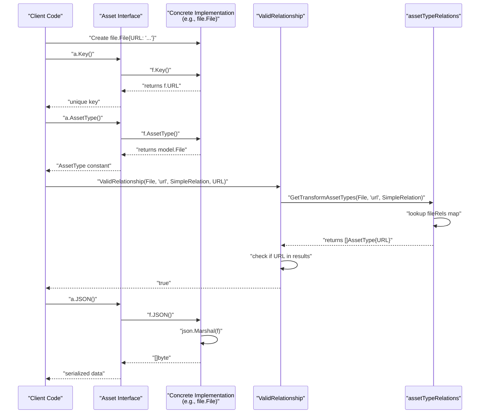

# Core Architecture

# Core Architecture

<details>
<summary>Relevant source files</summary>

The following files were used as context for generating this wiki page:

- [asset.go](asset.go)
- [asset_test.go](asset_test.go)
- [file/file.go](file/file.go)
- [file/file_test.go](file/file_test.go)
- [property.go](property.go)
- [relation.go](relation.go)

</details>


## Purpose and Scope

This document explains the three-tier architectural design of the open-asset-model, covering the core abstraction layer (interfaces), type system layer (enumerations), and concrete implementation layer (struct types). Understanding this architecture is essential for working with or extending the model.

For detailed information about individual interfaces and their methods, see:
- Asset interface specifics: [Asset Interface](#2.1)
- Relation interface and validation: [Relation Interface](#2.2)
- Property interface details: [Property Interface](#2.3)

For information about concrete asset type implementations, see [Asset Types](#3).

---

## Three-Tier Architecture Overview

The open-asset-model employs a **three-tier architecture** that separates interface contracts from type classification from concrete implementations. This design enables polymorphic handling of diverse asset types while maintaining strict type safety through compile-time verification.

### Architecture Layers



**Sources:** [asset.go:7-11](), [relation.go:11-15](), [property.go:7-12](), [file/file.go:14-33]()

---

## Core Abstraction Layer

The abstraction layer defines three fundamental interfaces that all implementations must satisfy. Each interface follows a consistent pattern: identity method, type classifier method, and serialization method.

### Interface Design Pattern

| Interface | Identity Method | Type Method | Serialization | Purpose |
|-----------|----------------|-------------|---------------|---------|
| `Asset` | `Key() string` | `AssetType() AssetType` | `JSON() ([]byte, error)` | Represents discoverable entities |
| `Relation` | `Label() string` | `RelationType() RelationType` | `JSON() ([]byte, error)` | Represents connections between assets |
| `Property` | `Name() string`, `Value() string` | `PropertyType() PropertyType` | `JSON() ([]byte, error)` | Represents asset metadata |

**Sources:** [asset.go:7-11](), [relation.go:11-15](), [property.go:7-12]()

### Asset Interface

The `Asset` interface is defined in [asset.go:7-11]() and requires three methods:

```go
type Asset interface {
    Key() string
    AssetType() AssetType
    JSON() ([]byte, error)
}
```

- **`Key()`**: Returns a unique identifier for the asset. This identifier must be deterministic and stable across invocations for the same logical entity. For example, `File` uses the URL as its key [file/file.go:21-23]().
- **`AssetType()`**: Returns the type constant from the `AssetType` enumeration, enabling runtime type discrimination without reflection.
- **`JSON()`**: Serializes the asset to JSON format for storage and transport.

**Sources:** [asset.go:7-11](), [file/file.go:20-33]()

### Relation Interface

The `Relation` interface is defined in [relation.go:11-15]() and structures connections between assets:

```go
type Relation interface {
    Label() string
    RelationType() RelationType
    JSON() ([]byte, error)
}
```

- **`Label()`**: Returns a semantic identifier for the relationship type (e.g., "dns_record", "port", "parent").
- **`RelationType()`**: Returns the relation type constant, which determines the structure and validation rules.
- **`JSON()`**: Serializes the relation data to JSON.

**Sources:** [relation.go:11-15]()

### Property Interface

The `Property` interface is defined in [property.go:7-12]() and attaches metadata to assets without creating relationships:

```go
type Property interface {
    Name() string
    Value() string
    PropertyType() PropertyType
    JSON() ([]byte, error)
}
```

- **`Name()`**: The property identifier (e.g., "ttl", "source", "cve_id").
- **`Value()`**: The property value as a string.
- **`PropertyType()`**: The type constant determining property semantics.
- **`JSON()`**: Serialization method.

**Sources:** [property.go:7-12]()

---

## Type System Layer

The type system layer provides strongly-typed enumerations for categorizing implementations. These types are defined as string constants to enable JSON serialization while maintaining type safety in Go.

### AssetType Enumeration

The `AssetType` enumeration defines 21 asset types in [asset.go:13-43]():



**Complete enumeration** [asset.go:15-37]():
- Network: `FQDN`, `IPAddress`, `Netblock`, `AutonomousSystem`
- Organizational: `Organization`, `Person`, `Location`, `Phone`, `ContactRecord`
- Digital: `File`, `URL`, `Service`, `TLSCertificate`
- Financial: `Account`, `FundsTransfer`
- Product: `Product`, `ProductRelease`
- Registration: `DomainRecord`, `AutnumRecord`, `IPNetRecord`
- Identity: `Identifier`

The `AssetList` variable [asset.go:39-43]() provides a slice of all asset types for iteration.

**Sources:** [asset.go:13-43]()

### RelationType Enumeration

The `RelationType` enumeration defines 5 relation types in [relation.go:17-29]():

| RelationType | Purpose | Used For |
|--------------|---------|----------|
| `BasicDNSRelation` | Basic DNS records | A, AAAA, CNAME, NS records |
| `PrefDNSRelation` | DNS records with preference | MX records with priority values |
| `SRVDNSRelation` | DNS service records | SRV records with priority/weight/port |
| `PortRelation` | Service port connections | Port-based service relationships |
| `SimpleRelation` | Generic connections | Most non-DNS relationships |

**Sources:** [relation.go:17-29]()

### PropertyType Enumeration

The `PropertyType` enumeration defines 4 property types in [property.go:14-25]():

| PropertyType | Purpose |
|--------------|---------|
| `DNSRecordProperty` | DNS-specific metadata (TTL, record type) |
| `SimpleProperty` | Generic key-value properties |
| `SourceProperty` | Data source attribution |
| `VulnProperty` | Vulnerability information |

**Sources:** [property.go:14-25]()

---

## Concrete Implementation Layer

Implementations satisfy the interface contracts by implementing required methods. Each implementation is defined in domain-specific packages.

### Implementation Pattern



**Sources:** [asset.go:7-11](), [file/file.go:14-33]()

### Example: File Implementation

The `File` struct [file/file.go:14-18]() demonstrates a complete implementation:

```go
type File struct {
    URL  string `json:"url"`
    Name string `json:"name,omitempty"`
    Type string `json:"type,omitempty"`
}
```

**Method implementations:**
- `Key()` [file/file.go:21-23](): Returns the `URL` field
- `AssetType()` [file/file.go:26-28](): Returns `model.File` constant
- `JSON()` [file/file.go:31-33](): Delegates to `json.Marshal(f)`

**Sources:** [file/file.go:14-33](), [file/file_test.go:24-25]()

### Interface Compliance Verification

Implementation correctness is verified at compile-time using Go's type assertion syntax [file/file_test.go:24-25]():

```go
var _ model.Asset = File{}       // Verify value receiver
var _ model.Asset = (*File)(nil) // Verify pointer receiver
```

This pattern ensures that both value and pointer receivers satisfy the interface, catching implementation errors before runtime.

**Sources:** [file/file_test.go:24-25]()

---

## Relationship Validation System

The model includes a sophisticated validation system that enforces which relationships are valid between asset types. This system is implemented through a series of nested maps and query functions.

### Relationship Taxonomy Structure



**Sources:** [relation.go:228-279](), [relation.go:76-85](), [relation.go:185-226](), [relation.go:281-295]()

### Taxonomy Definition Pattern

Relationships are defined using nested maps [relation.go:76-85]():

```go
var fqdnRels = map[string]map[RelationType][]AssetType{
    "port": {PortRelation: {Service}},
    "dns_record": {
        BasicDNSRelation: {FQDN, IPAddress},
        PrefDNSRelation:  {FQDN},
        SRVDNSRelation:   {FQDN},
    },
    "node":         {SimpleRelation: {FQDN}},
    "registration": {SimpleRelation: {DomainRecord}},
}
```

This structure encodes:
1. **First level (string key)**: Relationship label
2. **Second level (RelationType key)**: Type of relation implementation
3. **Third level ([]AssetType)**: Valid destination asset types

**Sources:** [relation.go:76-85]()

### Validation Functions

Three public functions provide different query patterns:

**GetAssetOutgoingRelations** [relation.go:188-199]():
- Returns all valid relationship labels for a given asset type
- Used for discovery workflows to determine possible relationships

**GetTransformAssetTypes** [relation.go:205-226]():
- Returns valid destination types for a specific (source type, label, relation type) combination
- Used in data transformation pipelines

**ValidRelationship** [relation.go:283-295]():
- Boolean check for relationship validity
- Used for integrity verification during data ingestion

**Sources:** [relation.go:188-199](), [relation.go:205-226](), [relation.go:283-295]()

---

## Design Principles

The three-tier architecture embodies several key design principles:

### Interface Segregation

Each interface defines a minimal contract. Implementations only need to provide the three required methods, allowing diverse asset types without forcing unnecessary method implementations.

**Sources:** [asset.go:7-11]()

### Open-Closed Principle

New asset types can be added by:
1. Adding a constant to `AssetType` enumeration [asset.go:15-37]()
2. Creating a struct in a new package
3. Implementing the three interface methods
4. Adding relationship rules to [relation.go:31-183]() if needed

No modifications to existing implementations are required.

**Sources:** [asset.go:15-37](), [relation.go:31-183]()

### Compile-Time Verification

Go's type system enforces interface implementation at compile time. Tests further verify compliance using type assertions [file/file_test.go:24-25]().

**Sources:** [file/file_test.go:24-25]()

### Polymorphic Asset Handling

Client code can work with `Asset` interface types without knowing concrete implementations:

```go
func processAsset(a Asset) {
    key := a.Key()           // Works for any Asset implementation
    atype := a.AssetType()   // Runtime type discrimination
    data, _ := a.JSON()      // Serialization
}
```

**Sources:** [asset.go:7-11]()

---

## Layer Interactions



**Sources:** [asset.go:7-11](), [file/file.go:20-33](), [relation.go:283-295](), [relation.go:228-279]()

---

## Testing Strategy

The architecture enforces quality through multiple testing layers:

### Interface Compliance Tests

[file/file_test.go:24-25]() demonstrates compile-time verification:

```go
var _ model.Asset = File{}       // Value receiver check
var _ model.Asset = (*File)(nil) // Pointer receiver check
```

**Sources:** [file/file_test.go:24-25]()

### Method Behavior Tests

Each interface method is tested individually [file/file_test.go:14-34]():
- `Key()` returns expected identifier
- `AssetType()` returns correct constant
- `JSON()` produces valid serialization

**Sources:** [file/file_test.go:14-52]()

### Type System Tests

The enumeration constants are validated [asset_test.go:27-85]():
- All 21 asset types have correct string values
- `AssetList` contains all types

**Sources:** [asset_test.go:27-85]()