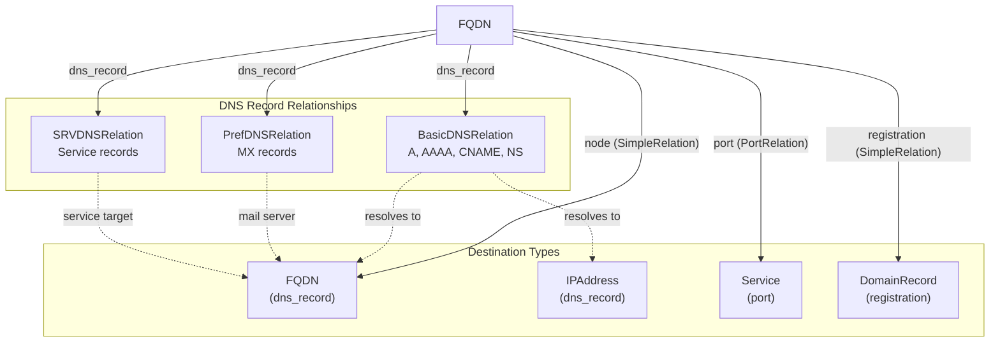
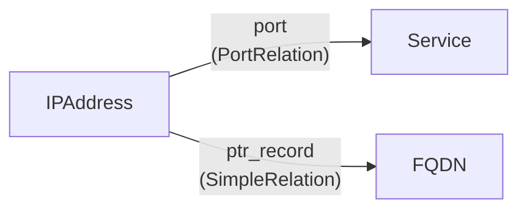
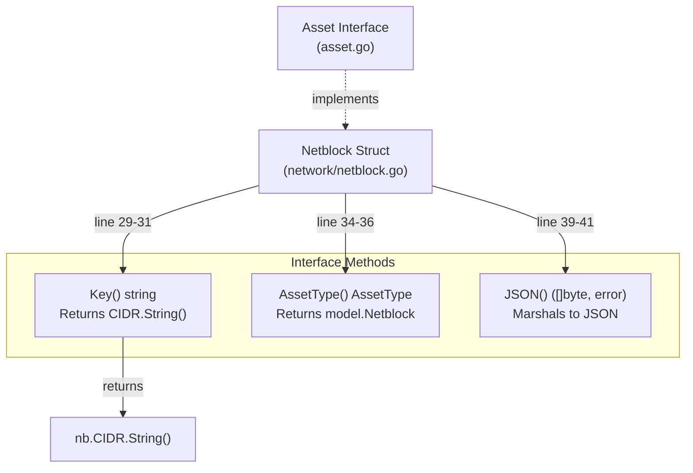
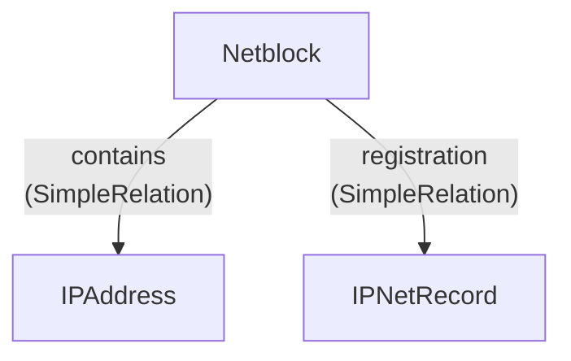
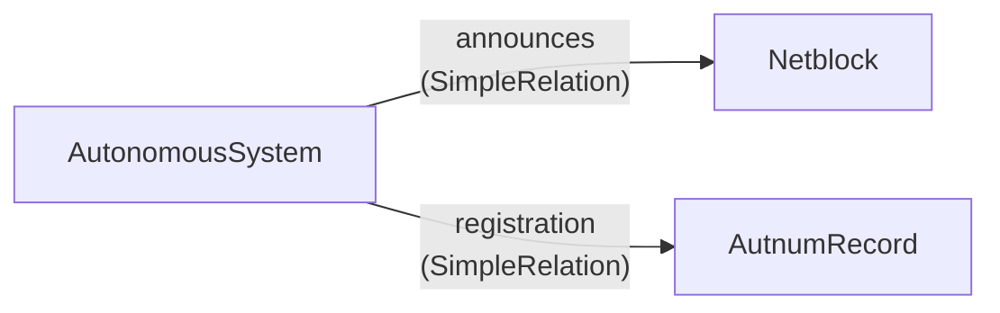
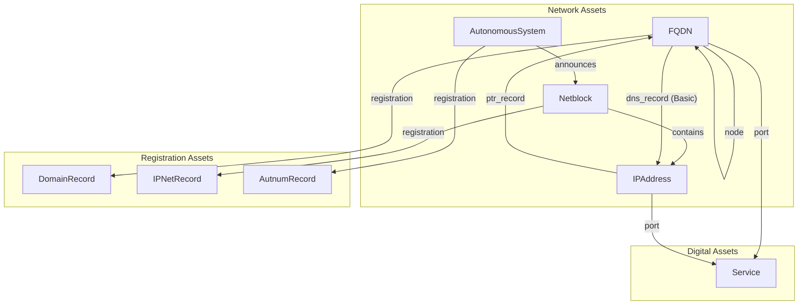

# Network Assets

# Network Assets

<details>
<summary>Relevant source files</summary>

The following files were used as context for generating this wiki page:

- [network/autonomous_system.go](network/autonomous_system.go)
- [network/autonomous_system_test.go](network/autonomous_system_test.go)
- [network/netblock.go](network/netblock.go)
- [network/netblock_test.go](network/netblock_test.go)
- [relation.go](relation.go)
- [url/url.go](url/url.go)
- [url/url_test.go](url/url_test.go)

</details>


## Purpose and Scope

This document describes the four network infrastructure asset types in the open-asset-model: **FQDN**, **IPAddress**, **Netblock**, and **AutonomousSystem**. These asset types represent the fundamental building blocks of network topology and addressing used in network reconnaissance and attack surface mapping. This page focuses on their structure, implementation, and network-specific relationships.

For information about registration records associated with network assets (DomainRecord, AutnumRecord, IPNetRecord), see [3.6](#3.6). For details on the Asset interface these types implement, see [2.1](#2.1). For the complete relationship validation system, see [4](#4).

## Network Asset Type Overview

The network domain defines four asset types that model Internet infrastructure:

| Asset Type | Purpose | Key Format | Primary Use Case |
|------------|---------|------------|------------------|
| `FQDN` | Fully Qualified Domain Name | Domain name string | DNS hierarchy, hostnames |
| `IPAddress` | IP address (v4 or v6) | IP address string | Network endpoints, routing |
| `Netblock` | IP address range in CIDR notation | CIDR string (e.g., "192.168.1.0/24") | IP allocation, ownership |
| `AutonomousSystem` | AS number representing routing domain | AS number as string | BGP routing, ISP identification |

Sources: [relation.go:76-85](), [relation.go:100-103](), [relation.go:118-121](), [relation.go:46-49]()

## Asset Type: FQDN

The `FQDN` asset type represents fully qualified domain names in the DNS hierarchy. It is the most relationship-rich asset type in the network domain, supporting DNS record relationships, port-based service connections, hierarchical node relationships, and domain registration links.

### FQDN Relationships



The `fqdnRels` map in [relation.go:76-85]() defines four relationship labels for FQDN assets:

| Label | Relation Type(s) | Destination Type(s) | Purpose |
|-------|------------------|---------------------|---------|
| `dns_record` | `BasicDNSRelation`, `PrefDNSRelation`, `SRVDNSRelation` | `FQDN`, `IPAddress` | DNS resolution (A, AAAA, CNAME, NS, MX, SRV) |
| `port` | `PortRelation` | `Service` | Services listening on the FQDN |
| `node` | `SimpleRelation` | `FQDN` | DNS hierarchy (subdomains) |
| `registration` | `SimpleRelation` | `DomainRecord` | WHOIS/RDAP registration data |

**Key Implementation Detail**: The `dns_record` label supports three distinct `RelationType` values, each corresponding to different DNS record types. `BasicDNSRelation` handles standard records (A, AAAA, CNAME, NS), `PrefDNSRelation` adds preference/priority for MX records, and `SRVDNSRelation` includes priority, weight, and port for service records.

Sources: [relation.go:76-85]()

## Asset Type: IPAddress

The `IPAddress` asset type represents individual IPv4 or IPv6 addresses. It supports connections to services via ports and PTR record reverse DNS lookups.

### IPAddress Relationships



The `ipRels` map in [relation.go:100-103]() defines two relationship labels:

| Label | Relation Type | Destination Type | Purpose |
|-------|---------------|------------------|---------|
| `port` | `PortRelation` | `Service` | Services listening on the IP address |
| `ptr_record` | `SimpleRelation` | `FQDN` | Reverse DNS (PTR) records |

**Contrast with FQDN**: While FQDN assets support forward DNS relationships (dns_record) that can resolve to IP addresses, IPAddress assets support reverse DNS relationships (ptr_record) that point back to FQDNs. Both asset types share the `port` relationship for connecting to services.

Sources: [relation.go:100-103]()

## Asset Type: Netblock

The `Netblock` asset type represents CIDR-notated IP address ranges. It models IP address allocation and ownership, connecting address blocks to their constituent IP addresses and registration records.

### Netblock Structure

```go
// From network/netblock.go
type Netblock struct {
    CIDR netip.Prefix `json:"cidr"`
    Type string        `json:"type"`
}
```

The struct uses Go's `netip.Prefix` type for type-safe CIDR representation. The `Type` field distinguishes between "IPv4" and "IPv6" address blocks.

Sources: [network/netblock.go:14-26]()

### Netblock Interface Implementation



The `Key()` method at [network/netblock.go:29-31]() returns the CIDR notation as a string (e.g., "192.168.1.0/24"), which serves as the unique identifier for the asset. The `AssetType()` method at [network/netblock.go:34-36]() returns the `model.Netblock` constant. The `JSON()` method at [network/netblock.go:39-41]() uses standard `json.Marshal()` serialization.

Sources: [network/netblock.go:29-41]()

### Netblock Relationships



The `netblockRels` map in [relation.go:118-121]() defines two relationship labels:

| Label | Relation Type | Destination Type | Purpose |
|-------|---------------|------------------|---------|
| `contains` | `SimpleRelation` | `IPAddress` | Individual IP addresses within the CIDR block |
| `registration` | `SimpleRelation` | `IPNetRecord` | WHOIS/RDAP registration for the netblock |

The `contains` relationship enables modeling the hierarchical relationship between address blocks and individual addresses, supporting queries like "which IP addresses are contained in this netblock?"

Sources: [relation.go:118-121]()

### Netblock JSON Serialization

Example JSON output from a Netblock instance:

```json
{
  "cidr": "198.51.100.0/24",
  "type": "IPv4"
}
```

The test suite at [network/netblock_test.go:76-85]() verifies serialization for both IPv4 and IPv6 netblocks, ensuring the CIDR field serializes correctly using `netip.Prefix`'s string representation.

Sources: [network/netblock_test.go:76-85]()

## Asset Type: AutonomousSystem

The `AutonomousSystem` asset type represents an autonomous system number (ASN) used in BGP routing. It models the organizational units that control IP routing on the Internet, such as ISPs, cloud providers, and large enterprises.

### AutonomousSystem Structure

```go
// From network/autonomous_system.go
type AutonomousSystem struct {
    Number int `json:"number"`
}
```

The struct contains a single field: the AS number (e.g., 64496 for a private ASN, or 15169 for Google's public ASN).

Sources: [network/autonomous_system.go:14-17]()

### AutonomousSystem Interface Implementation

| Method | Implementation | Line Reference |
|--------|----------------|----------------|
| `Key()` | Returns `strconv.Itoa(a.Number)` | [network/autonomous_system.go:20-22]() |
| `AssetType()` | Returns `model.AutonomousSystem` | [network/autonomous_system.go:25-27]() |
| `JSON()` | Returns `json.Marshal(a)` | [network/autonomous_system.go:30-32]() |

The `Key()` method converts the integer AS number to a string for use as the asset's unique identifier. This ensures that ASN 64496 has the key "64496".

Sources: [network/autonomous_system.go:20-32]()

### AutonomousSystem Relationships



The `autonomousSystemRels` map in [relation.go:46-49]() defines two relationship labels:

| Label | Relation Type | Destination Type | Purpose |
|-------|---------------|------------------|---------|
| `announces` | `SimpleRelation` | `Netblock` | IP address blocks announced by the AS via BGP |
| `registration` | `SimpleRelation` | `AutnumRecord` | WHOIS/RDAP registration for the AS number |

The `announces` relationship models BGP announcements, enabling queries like "which netblocks does AS 15169 announce?" This is critical for attack surface mapping, as it reveals the IP space controlled by an organization.

Sources: [relation.go:46-49]()

### AutonomousSystem JSON Serialization

Example JSON output:

```json
{
  "number": 64496
}
```

The test at [network/autonomous_system_test.go:37-44]() verifies this serialization format.

Sources: [network/autonomous_system_test.go:37-44]()

## Network Asset Relationship Graph

The following diagram shows how all four network asset types interconnect, including cross-domain relationships to registration records and services:



**Key Observations**:

1. **Hierarchical Structure**: `AutonomousSystem` → `Netblock` → `IPAddress` forms a three-level hierarchy of network address space
2. **DNS Bidirectionality**: FQDNs resolve to IP addresses (dns_record), while IP addresses reverse-resolve to FQDNs (ptr_record)
3. **Registration Linkage**: All three network primitive types (AS, Netblock, FQDN) link to corresponding registration record types for ownership data
4. **Service Connectivity**: Both FQDN and IPAddress assets connect to Service assets via PortRelation
5. **Self-Referential FQDN**: FQDNs can reference other FQDNs through both dns_record (CNAME, NS, MX, SRV) and node (subdomain hierarchy) relationships

Sources: [relation.go:46-49](), [relation.go:76-85](), [relation.go:100-103](), [relation.go:118-121]()

## Interface Compliance Testing Pattern

All network asset implementations follow a consistent testing pattern that verifies interface compliance at compile time:

```go
// From network/netblock_test.go
var _ model.Asset = Netblock{}       // Value receiver
var _ model.Asset = (*Netblock)(nil) // Pointer receiver

// From network/autonomous_system_test.go
var _ model.Asset = AutonomousSystem{}       // Value receiver
var _ model.Asset = (*AutonomousSystem)(nil) // Pointer receiver
```

This pattern uses Go's blank identifier assignment to verify that both value and pointer receivers satisfy the `Asset` interface. If the type does not implement all required methods, this code will fail at compile time, preventing interface violations from reaching runtime.

The tests also verify method behavior:
- **Key() correctness**: [network/netblock_test.go:16-23](), [network/autonomous_system_test.go:15-22]()
- **AssetType() returns correct constant**: [network/netblock_test.go:30-57](), [network/autonomous_system_test.go:29-35]()
- **JSON() serialization format**: [network/netblock_test.go:59-86](), [network/autonomous_system_test.go:37-44]()

Sources: [network/netblock_test.go:25-28](), [network/autonomous_system_test.go:24-27]()

## Implementation Summary

All network asset types share common implementation patterns:

| Pattern | Implementation Detail | Example |
|---------|----------------------|---------|
| **Struct Simplicity** | Minimal fields, focused on identity | Netblock: 2 fields, AS: 1 field |
| **Type-Safe Keys** | Leverage Go stdlib types for validation | `netip.Prefix` for Netblock CIDR |
| **String-Based Keys** | Key() returns string representation | AS.Key() uses `strconv.Itoa()` |
| **Standard JSON** | Use `json.Marshal()` without custom logic | No custom MarshalJSON methods |
| **Relationship Clarity** | Clear semantic labels in relation maps | "announces", "contains", "ptr_record" |

This consistency simplifies client code: all network assets can be handled polymorphically through the `Asset` interface, with type-specific behavior expressed through the relationship taxonomy rather than custom methods.

Sources: [network/netblock.go:14-42](), [network/autonomous_system.go:14-33]()