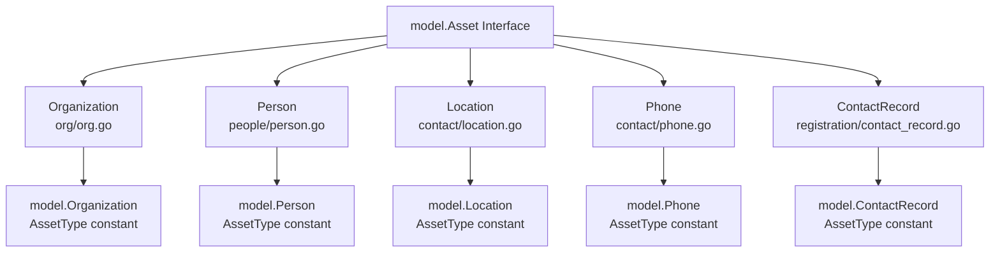
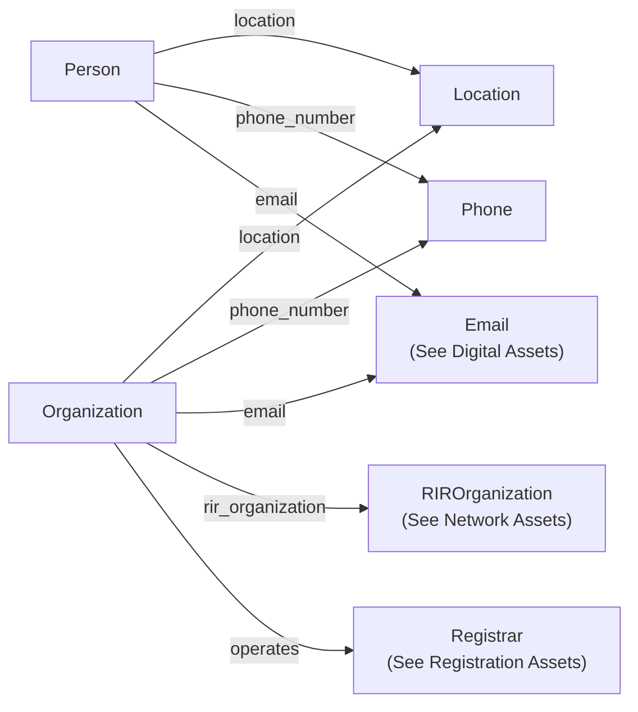
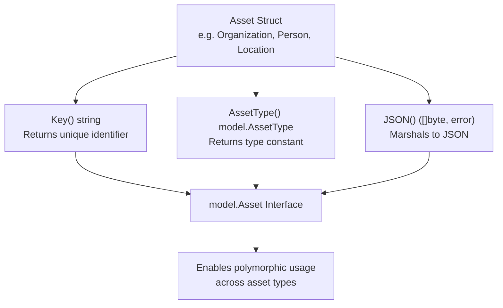
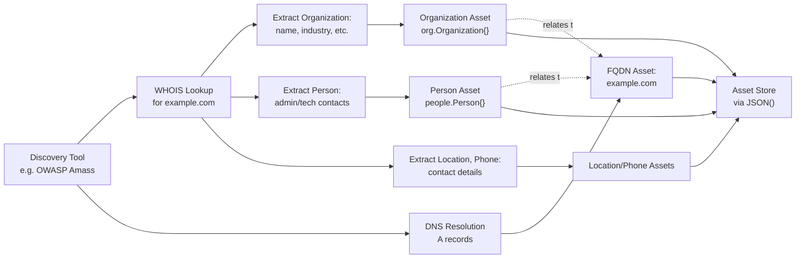

# Organizational Assets

# Organizational Assets

<details>
<summary>Relevant source files</summary>

The following files were used as context for generating this wiki page:

- [contact/location.go](contact/location.go)
- [contact/location_test.go](contact/location_test.go)
- [docs/images/taxonomy.excalidraw.png](docs/images/taxonomy.excalidraw.png)
- [docs/taxonomy.md](docs/taxonomy.md)
- [org/org.go](org/org.go)
- [org/org_test.go](org/org_test.go)
- [people/person.go](people/person.go)
- [people/person_test.go](people/person_test.go)

</details>


## Purpose and Scope

This document details the organizational entity asset types within the Open Asset Model. These assets represent business entities, individuals, and their contact information. The five organizational asset types are:

- `Organization` - Corporate entities, nonprofits, and other business organizations
- `Person` - Individual people with biographical information
- `Location` - Physical addresses and geographic locations
- `Phone` - Telephone contact information with E.164 formatting
- `ContactRecord` - Registration contact details (covered in [Registration Assets](#3.6))

For network infrastructure assets (FQDN, IPAddress, etc.), see [Network Assets](#3.1). For digital artifacts like files and services, see [Digital Assets](#3.3).

**Sources:** [docs/taxonomy.md:290-354]()

---

## Organizational Asset Type Hierarchy

The following diagram shows the organizational asset types and their implementation packages:



**Sources:** [org/org.go:1-58](), [people/person.go:1-38](), [contact/location.go:1-43]()

---

## Organization Asset Type

### Structure

The `Organization` struct represents corporate entities, nonprofits, government organizations, and other business entities. It is defined in [org/org.go:33-42]().

| Field | JSON Tag | Type | Description |
|-------|----------|------|-------------|
| `ID` | `unique_id` | string | Unique identifier for the organization (required for Key()) |
| `Name` | `name` | string | Common name of the organization |
| `LegalName` | `legal_name` | string | Official legal name |
| `FoundingDate` | `founding_date` | string | ISO 8601 formatted founding date |
| `Industry` | `industry` | string | Primary industry classification |
| `Active` | `active` | bool | Whether the organization is currently operating |
| `NonProfit` | `non_profit` | bool | Tax-exempt/nonprofit status |
| `NumOfEmployees` | `num_of_employees` | int | Employee count |

### Interface Methods

The `Organization` type implements the `Asset` interface via three methods defined in [org/org.go:44-57]():

- `Key() string` - Returns the `ID` field as the unique identifier
- `AssetType() model.AssetType` - Returns `model.Organization` constant
- `JSON() ([]byte, error)` - Marshals the struct to JSON with proper field tags

### Outgoing Relationships

Organizations can establish the following relationships (as defined in [docs/taxonomy.md:299-308]()):

| Label | Destination Type | Description |
|-------|------------------|-------------|
| `location` | Location | Physical address or headquarters |
| `phone_number` | Phone | Contact phone numbers |
| `email` | Email | Contact email addresses |
| `rir_organization` | RIROrganization | Associated Regional Internet Registry record |
| `operates` | Registrar | Registrar operations (for registrar companies) |

### JSON Serialization Example

From the test implementation in [org/org_test.go:39-60]():

```json
{
  "unique_id": "222333444",
  "name": "Acme Inc.",
  "legal_name": "Acme Inc.",
  "founding_date": "2013-07-24T14:15:00Z",
  "industry": "Technology",
  "active": true,
  "num_of_employees": 10000
}
```

Note that `non_profit` is omitted when false due to the `omitempty` JSON tag.

**Sources:** [org/org.go:33-58](), [org/org_test.go:14-60](), [docs/taxonomy.md:292-322]()

---

## Person Asset Type

### Structure

The `Person` struct represents individual people with biographical information. It is defined in [people/person.go:14-22]().

| Field | JSON Tag | Type | Description |
|-------|----------|------|-------------|
| `ID` | `unique_id` | string | Unique identifier (required for Key()) |
| `FullName` | `full_name` | string | Complete name as a single string |
| `FirstName` | `first_name` | string | Given name |
| `MiddleName` | `middle_name` | string | Middle name(s), optional |
| `FamilyName` | `family_name` | string | Surname/last name |
| `BirthDate` | `birth_date` | string | Date of birth |
| `Gender` | `gender` | string | Gender identification |

### Interface Methods

Implemented in [people/person.go:24-37]():

- `Key() string` - Returns the `ID` field
- `AssetType() model.AssetType` - Returns `model.Person` constant  
- `JSON() ([]byte, error)` - Marshals to JSON

### Outgoing Relationships

Persons can establish relationships to (from [docs/taxonomy.md:338-345]()):

| Label | Destination Type | Description |
|-------|------------------|-------------|
| `phone_number` | Phone | Personal phone numbers |
| `email` | Email | Email addresses |
| `location` | Location | Physical addresses |

### JSON Serialization Example

From [people/person_test.go:37-69]():

```json
{
  "unique_id": "222333444",
  "full_name": "John Jacob Doe",
  "first_name": "John",
  "middle_name": "Jacob",
  "family_name": "Doe",
  "birth_date": "01/01/1970",
  "gender": "Male"
}
```

**Sources:** [people/person.go:14-37](), [people/person_test.go:15-69](), [docs/taxonomy.md:327-354]()

---

## Location Asset Type

### Structure

The `Location` struct represents physical addresses and geographic locations. It is defined in [contact/location.go:14-27]().

| Field | JSON Tag | Type | Description |
|-------|----------|------|-------------|
| `Address` | `address` | string | Full formatted address (used as Key()) |
| `Building` | `building` | string | Building name |
| `BuildingNumber` | `building_number` | string | Street number |
| `StreetName` | `street_name` | string | Street name |
| `Unit` | `unit` | string | Apartment/suite number |
| `POBox` | `po_box` | string | Post office box |
| `City` | `city` | string | City name |
| `Locality` | `locality` | string | Locality/district |
| `Province` | `province` | string | State/province/region |
| `Country` | `country` | string | ISO 3166-1 alpha-2 country code |
| `PostalCode` | `postal_code` | string | Postal/ZIP code |
| `GLN` | `gln` | int | Global Location Number (GS1 standard) |

### Interface Methods

Implemented in [contact/location.go:29-42]():

- `Key() string` - Returns the `Address` field as the unique identifier
- `AssetType() model.AssetType` - Returns `model.Location` constant
- `JSON() ([]byte, error)` - Marshals to JSON

### Relationship Characteristics

Locations have **no outgoing relationships** ([docs/taxonomy.md:83-86]()). They serve as terminal nodes in the asset graph, representing physical endpoints. Organizations and Persons establish relationships **to** Locations, but Locations do not point to other assets.

### JSON Serialization Example

From [contact/location_test.go:32-58]():

```json
{
  "address": "123 Main St",
  "building": "Building A",
  "building_number": "123",
  "street_name": "Main St",
  "unit": "Apt 1",
  "po_box": "P.O. Box 145",
  "city": "Anytown",
  "locality": "Anytown",
  "province": "Anyregion",
  "country": "US",
  "postal_code": "12345",
  "gln": 1234567890123
}
```

**Sources:** [contact/location.go:14-42](), [contact/location_test.go:13-58](), [docs/taxonomy.md:69-99]()

---

## Phone Asset Type

### Structure

The `Phone` asset type represents telephone contact information with support for E.164 international formatting. According to [docs/taxonomy.md:100-111](), the structure includes:

| Field | JSON Tag | Type | Required | Description |
|-------|----------|------|----------|-------------|
| `Type` | `type` | string | No | Type of phone (mobile, landline, fax, etc.) |
| `Raw` | `raw` | string | Yes | Unparsed phone number as provided |
| `E164` | `e164` | string | No | E.164 formatted international number |
| `CountryAbbrev` | `country_abbrev` | string | No | ISO 3166-1 alpha-2 country code |
| `CountryCode` | `country_code` | string | No | ISO 3166-1 numeric country code |
| `SubscriberNumber` | `subscriber_number` | string | No | Subscriber portion of the number |
| `Ext` | `ext` | string | No | Extension number |

### Relationship Characteristics

Like Location, Phone assets have **no outgoing relationships** ([docs/taxonomy.md:112-114]()). They are referenced by Organization, Person, and various registration record types through incoming relationships.

**Sources:** [docs/taxonomy.md:100-127]()

---

## Organizational Asset Relationship Graph

The following diagram illustrates how organizational assets connect within the model:



Key observations:

1. **Terminal Nodes**: `Location` and `Phone` have no outgoing relationships - they serve as leaf nodes
2. **Shared Contact Pattern**: Both `Organization` and `Person` can have `location`, `phone_number`, and `email` relationships
3. **Organization-Specific**: Only `Organization` can have `rir_organization` and `operates` relationships
4. **Cross-Domain**: Organizational assets establish relationships to Network (RIROrganization) and Registration (Registrar) domains

**Sources:** [docs/taxonomy.md:299-345]()

---

## Implementation Pattern

All organizational assets follow the same implementation pattern established by the core Asset interface:



### Common Implementation Details

1. **Key Field Selection**: Each asset uses a different field as its unique key:
   - Organization: `ID` field ([org/org.go:45-47]())
   - Person: `ID` field ([people/person.go:25-27]())
   - Location: `Address` field ([contact/location.go:30-32]())

2. **JSON Tags**: All structs use lowercase snake_case JSON tags with `omitempty` for optional fields

3. **Type Constants**: Each returns its corresponding `model.AssetType` constant

4. **Marshaling**: All use standard `json.Marshal()` with no custom serialization logic

**Sources:** [org/org.go:44-57](), [people/person.go:24-37](), [contact/location.go:29-42]()

---

## Testing Patterns

The organizational asset tests follow a consistent three-part validation pattern:

### Interface Compliance Checks

Both value and pointer receivers are verified ([org/org_test.go:27-28]()):

```go
var _ model.Asset = Organization{}       // Value receiver
var _ model.Asset = (*Organization)(nil) // Pointer receiver
```

This compile-time check ensures the Asset interface is properly implemented.

### Method Behavior Tests

Each test suite validates the three interface methods:

| Test | File | Purpose |
|------|------|---------|
| `TestOrganizationKey()` | [org/org_test.go:14-24]() | Verifies Key() returns ID field |
| `TestOrganizationAssetType()` | [org/org_test.go:26-37]() | Verifies AssetType() returns correct constant |
| `TestOrganizationJSON()` | [org/org_test.go:39-60]() | Verifies JSON marshaling and field tags |

### JSON Serialization Validation

Tests verify that:
1. JSON output matches expected structure exactly
2. Required fields are present
3. Optional fields with zero values are omitted (due to `omitempty`)
4. Field names match JSON tag specifications

The Person test ([people/person_test.go:37-69]()) demonstrates deep equality checking by unmarshaling both expected and actual JSON into maps before comparison.

**Sources:** [org/org_test.go:1-61](), [people/person_test.go:1-70](), [contact/location_test.go:1-59]()

---

## Integration with Registration Records

Organizational assets are extensively referenced by registration record types (WHOIS/RDAP data). From [docs/taxonomy.md:520-547](), a `Whois` record can establish relationships to:

| Relationship Label | Destination Type | Contact Role |
|-------------------|------------------|--------------|
| `admin_org` | Organization | Administrative contact organization |
| `tech_org` | Organization | Technical contact organization |
| `billing_org` | Organization | Billing contact organization |
| `registrant_org` | Organization | Registrant organization |
| `admin_person` | Person | Administrative contact person |
| `tech_person` | Person | Technical contact person |
| `billing_person` | Person | Billing contact person |
| `registrant_person` | Person | Registrant person |
| `admin_location` | Location | Administrative contact address |
| `admin_phone` | Phone | Administrative contact phone |
| `admin_email` | Email | Administrative contact email |

This creates a rich graph connecting domain registrations to the real-world organizations and individuals that control them.

**Sources:** [docs/taxonomy.md:475-547]()

---

## Usage in Asset Discovery

Organizational assets play a critical role in External Attack Surface Management (EASM) by providing context about the entities behind technical infrastructure:



The discovery workflow:

1. **Initial Discovery**: Tools like OWASP Amass resolve domains and perform WHOIS lookups
2. **Entity Extraction**: Parse WHOIS responses to extract organization, person, and contact data
3. **Asset Creation**: Instantiate typed assets (Organization, Person, Location, Phone)
4. **Relationship Establishment**: Create relationships between domains and their registrants
5. **Validation**: Use `ValidRelationship()` to ensure graph integrity
6. **Persistence**: Serialize via `JSON()` method for storage

This enables analysts to answer questions like:
- "What domains are registered to Organization X?"
- "What is the contact information for the technical contact of domain Y?"
- "What locations are associated with Organization Z?"

**Sources:** [docs/taxonomy.md:1-40](), [docs/taxonomy.md:556-586]()