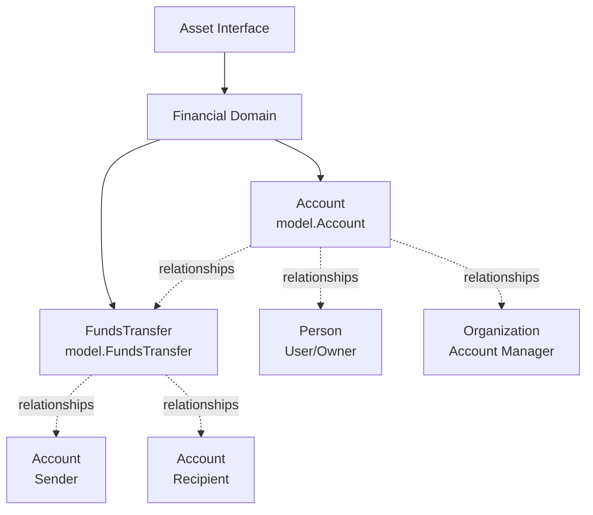
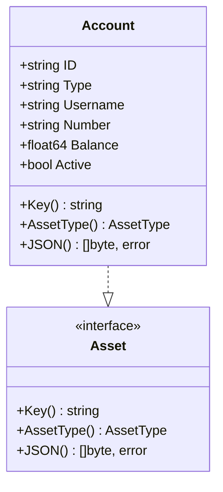
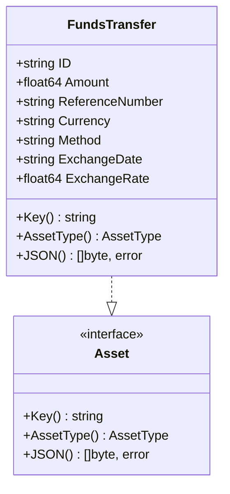
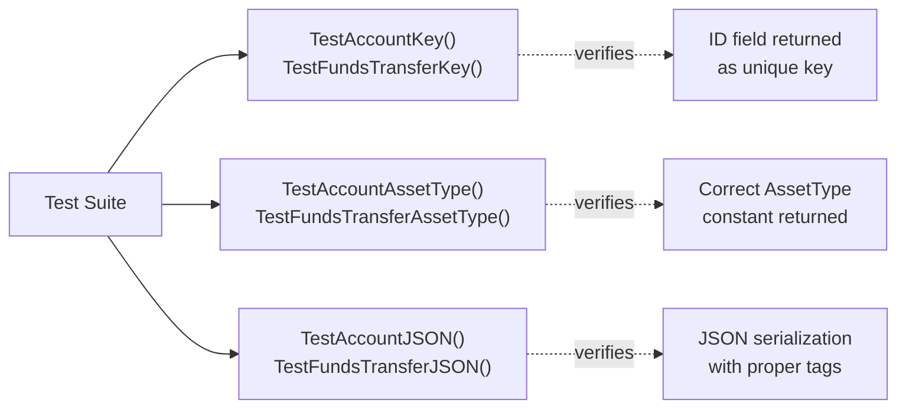
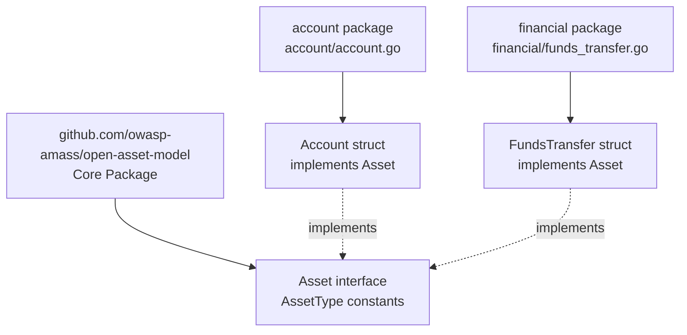
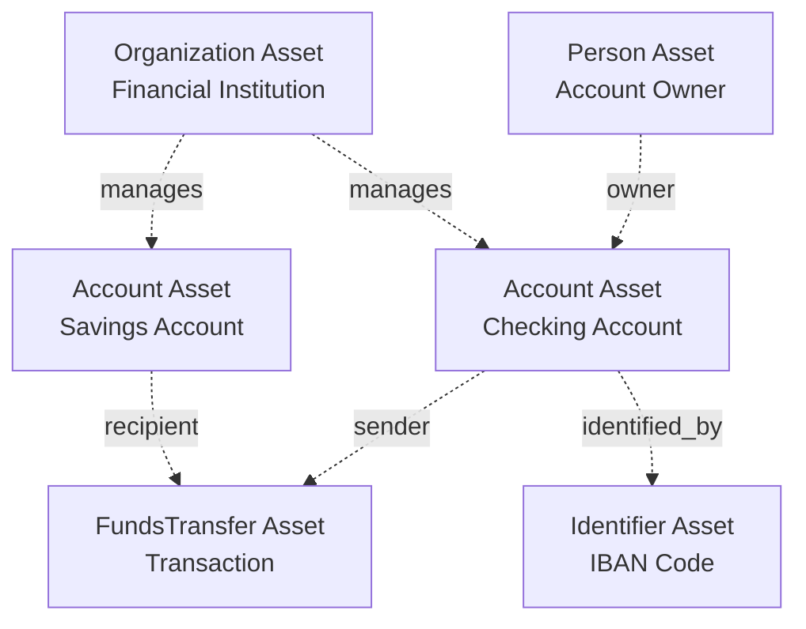

# Financial Assets

# Financial Assets

<details>
<summary>Relevant source files</summary>

The following files were used as context for generating this wiki page:

- [account/account.go](account/account.go)
- [account/account_test.go](account/account_test.go)
- [docs/images/taxonomy.excalidraw.png](docs/images/taxonomy.excalidraw.png)
- [docs/taxonomy.md](docs/taxonomy.md)
- [financial/funds_transfer.go](financial/funds_transfer.go)
- [financial/funds_transfer_test.go](financial/funds_transfer_test.go)

</details>


## Purpose and Scope

This page documents the Financial Assets domain within the Open Asset Model, which provides standardized representations for financial entities and transactions. The financial domain consists of two asset types: `Account` and `FundsTransfer`. These types enable modeling of financial accounts, account ownership, and monetary transfers between accounts.

For information about identity-related aspects of accounts (user authentication, access control), see [Identifier Assets](#3.7). For organizational ownership of financial accounts, see [Organizational Assets](#3.2).

**Sources:** [asset.go](), [account/account.go:1-41](), [financial/funds_transfer.go:1-42]()

---

## Financial Asset Type Taxonomy

The financial domain contains two distinct asset types that model different aspects of financial systems:



**Diagram: Financial Asset Types and Their Relationships**

The two asset types serve complementary purposes:
- **Account**: Represents a financial account entity managed by an organization
- **FundsTransfer**: Represents a single monetary transfer transaction between accounts

**Sources:** [account/account.go:13-18](), [financial/funds_transfer.go:13-18]()

---

## Account Asset Type

The `Account` type represents financial accounts managed by organizations. It models account metadata including identifiers, types, ownership, and status information.

### Structure Definition



**Diagram: Account Struct Implementation**

**Sources:** [account/account.go:18-25](), [account/account.go:27-40]()

### Field Specifications

| Field | JSON Key | Type | Required | Description |
|-------|----------|------|----------|-------------|
| `ID` | `unique_id` | `string` | Yes | Unique identifier for the account; serves as the asset key |
| `Type` | `account_type` | `string` | Yes | Type classification of the account (e.g., "ACH", "checking", "savings") |
| `Username` | `username` | `string` | No | Username associated with the account for access |
| `Number` | `account_number` | `string` | No | Account number (e.g., bank account number) |
| `Balance` | `balance` | `float64` | No | Current balance of the account |
| `Active` | `active` | `bool` | No | Whether the account is currently active |

All optional fields use the `omitempty` JSON tag and will be excluded from serialization when unset.

**Sources:** [account/account.go:19-24](), [account/account_test.go:42-49]()

### Asset Interface Implementation

The `Account` type implements the three required methods of the `Asset` interface:

**`Key() string`** - Returns the unique identifier for deduplication
```go
func (a Account) Key() string {
    return a.ID
}
```
[account/account.go:28-30]()

**`AssetType() model.AssetType`** - Returns the constant `model.Account`
```go
func (a Account) AssetType() model.AssetType {
    return model.Account
}
```
[account/account.go:33-35]()

**`JSON() ([]byte, error)`** - Serializes the account to JSON
```go
func (a Account) JSON() ([]byte, error) {
    return json.Marshal(a)
}
```
[account/account.go:38-40]()

**Sources:** [account/account.go:27-40](), [account/account_test.go:14-26](), [account/account_test.go:28-39]()

### Intended Relationships

According to the inline documentation, `Account` assets are designed to support relationships with the following asset types:

- **User**: Links to `Person` or `Organization` assets representing the account owner or user
- **Funds Transfers**: Links to `FundsTransfer` assets for incoming/outgoing transactions
- **IBAN and SWIFT Codes**: Support for international banking identifiers (likely via `Identifier` assets)

These relationship semantics are not enforced by the struct itself but are part of the model's intended usage patterns.

**Sources:** [account/account.go:13-17]()

### JSON Serialization Example

```json
{
  "unique_id": "222333444",
  "account_type": "ACH",
  "username": "test",
  "account_number": "12345",
  "balance": 42.5,
  "active": true
}
```

**Sources:** [account/account_test.go:41-60]()

---

## FundsTransfer Asset Type

The `FundsTransfer` type represents a single monetary transfer transaction between two financial accounts. It captures transaction metadata including amounts, currencies, exchange rates, and reference numbers.

### Structure Definition



**Diagram: FundsTransfer Struct Implementation**

**Sources:** [financial/funds_transfer.go:18-26](), [financial/funds_transfer.go:28-41]()

### Field Specifications

| Field | JSON Key | Type | Required | Description |
|-------|----------|------|----------|-------------|
| `ID` | `unique_id` | `string` | Yes | Unique identifier for the transfer; serves as the asset key |
| `Amount` | `amount` | `float64` | Yes | Monetary amount of the transfer |
| `ReferenceNumber` | `reference_number` | `string` | No | Reference or tracking number for the transaction |
| `Currency` | `currency` | `string` | No | Currency code for the transfer (e.g., "USD", "EUR") |
| `Method` | `transfer_method` | `string` | No | Transfer method or mechanism (e.g., "ACH", "wire", "SWIFT") |
| `ExchangeDate` | `exchange_date` | `string` | No | Date/time of currency exchange (ISO 8601 format) |
| `ExchangeRate` | `exchange_rate` | `float64` | No | Exchange rate applied if currency conversion occurred |

All optional fields use the `omitempty` JSON tag.

**Sources:** [financial/funds_transfer.go:19-25](), [financial/funds_transfer_test.go:37-45]()

### Asset Interface Implementation

The `FundsTransfer` type implements the three required methods of the `Asset` interface:

**`Key() string`** - Returns the unique identifier
```go
func (ft FundsTransfer) Key() string {
    return ft.ID
}
```
[financial/funds_transfer.go:29-31]()

**`AssetType() model.AssetType`** - Returns the constant `model.FundsTransfer`
```go
func (ft FundsTransfer) AssetType() model.AssetType {
    return model.FundsTransfer
}
```
[financial/funds_transfer.go:34-36]()

**`JSON() ([]byte, error)`** - Serializes the transfer to JSON
```go
func (ft FundsTransfer) JSON() ([]byte, error) {
    return json.Marshal(ft)
}
```
[financial/funds_transfer.go:39-41]()

**Sources:** [financial/funds_transfer.go:28-41](), [financial/funds_transfer_test.go:14-21](), [financial/funds_transfer_test.go:23-34]()

### Intended Relationships

According to the inline documentation, `FundsTransfer` assets are designed to support relationships with:

- **Sender Financial Account**: Links to an `Account` asset representing the source account
- **Recipient Financial Account**: Links to an `Account` asset representing the destination account
- **IBIN and SWIFT Codes**: Support for international banking transaction codes (likely via `Identifier` assets)

These relationships enable modeling of the complete transaction flow between accounts.

**Sources:** [financial/funds_transfer.go:13-17]()

### JSON Serialization Example

```json
{
  "unique_id": "222333444",
  "amount": 42,
  "reference_number": "555666777",
  "currency": "US",
  "transfer_method": "ACH",
  "exchange_date": "2013-07-24T14:15:00Z",
  "exchange_rate": 0.9
}
```

**Sources:** [financial/funds_transfer_test.go:36-56]()

---

## Interface Compliance and Testing

Both financial asset types undergo rigorous testing to ensure proper implementation of the `Asset` interface.

### Compile-Time Interface Verification

Both asset types use Go's type assertion pattern to verify interface compliance at compile time:

```go
// From account_test.go
var _ model.Asset = Account{}       // Value receiver
var _ model.Asset = (*Account)(nil) // Pointer receiver

// From funds_transfer_test.go
var _ model.Asset = FundsTransfer{}       // Value receiver
var _ model.Asset = (*FundsTransfer)(nil) // Pointer receiver
```

This pattern ensures that any interface method signature changes will cause compilation failures, catching breaking changes immediately.

**Sources:** [account/account_test.go:29-30](), [financial/funds_transfer_test.go:24-25]()

### Method Behavior Tests

Each asset type has dedicated tests validating:

1. **Key() method**: Verifies the correct field is returned as the unique identifier
2. **AssetType() method**: Confirms the correct `AssetType` constant is returned
3. **JSON() method**: Validates serialization produces expected JSON with correct field names and `omitempty` behavior



**Diagram: Financial Asset Test Coverage**

**Sources:** [account/account_test.go:14-60](), [financial/funds_transfer_test.go:14-56]()

---

## Package Organization

The financial domain assets are organized across two packages:



**Diagram: Financial Asset Package Structure**

### Import Pattern

Both packages follow the same import pattern:
```go
import (
    "encoding/json"
    
    model "github.com/owasp-amass/open-asset-model"
)
```

This imports the core package as `model`, providing access to:
- The `Asset` interface definition
- The `AssetType` enumeration constants (`model.Account`, `model.FundsTransfer`)

**Sources:** [account/account.go:7-11](), [financial/funds_transfer.go:7-11]()

---

## Usage Examples

### Creating Account Assets

```go
account := account.Account{
    ID:       "acct-123456",
    Type:     "checking",
    Username: "john.doe",
    Number:   "9876543210",
    Balance:  1250.50,
    Active:   true,
}

key := account.Key()           // "acct-123456"
assetType := account.AssetType() // model.Account
jsonBytes, _ := account.JSON()
```

### Creating FundsTransfer Assets

```go
transfer := financial.FundsTransfer{
    ID:              "txn-789012",
    Amount:          250.00,
    ReferenceNumber: "ref-456789",
    Currency:        "USD",
    Method:          "ACH",
    ExchangeDate:    "2025-01-15T10:30:00Z",
    ExchangeRate:    1.0,
}

key := transfer.Key()           // "txn-789012"
assetType := transfer.AssetType() // model.FundsTransfer
jsonBytes, _ := transfer.JSON()
```

**Sources:** [account/account_test.go:16-21](), [financial/funds_transfer_test.go:16-16]()

---

## Relationship Integration

While relationship validation is defined elsewhere in the model (see [Relationship System](#4)), the financial assets are designed to participate in specific relationship patterns:



**Diagram: Financial Asset Relationship Patterns**

The relationship taxonomy for financial assets would be defined in the core model's relationship validation functions (see [Relationship Taxonomy](#4.1)).

**Sources:** [account/account.go:13-17](), [financial/funds_transfer.go:13-17]()