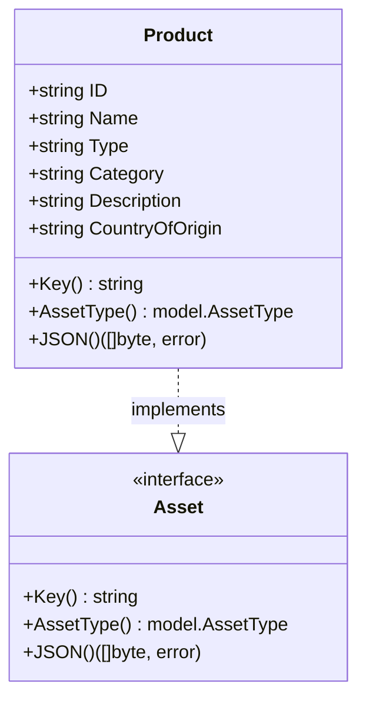
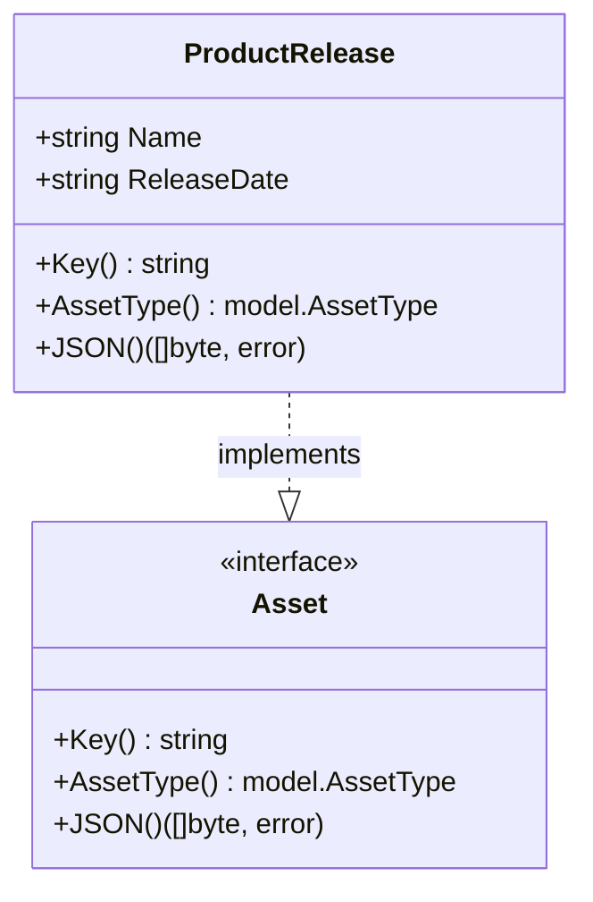
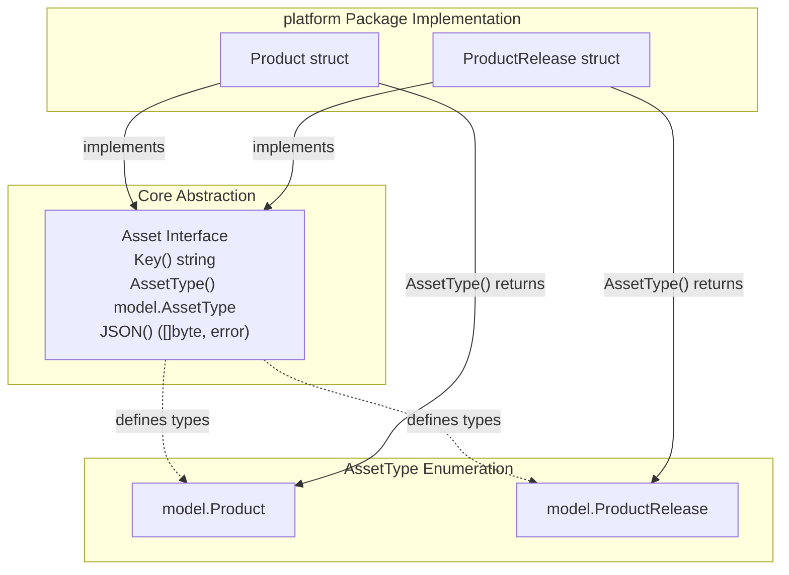
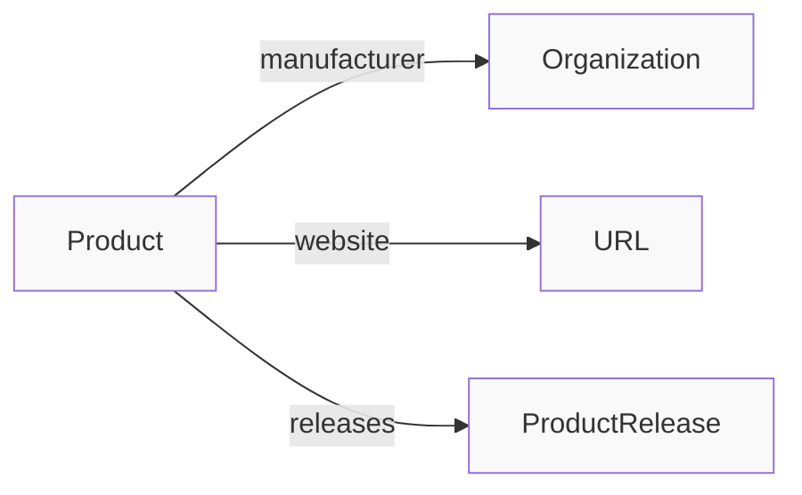
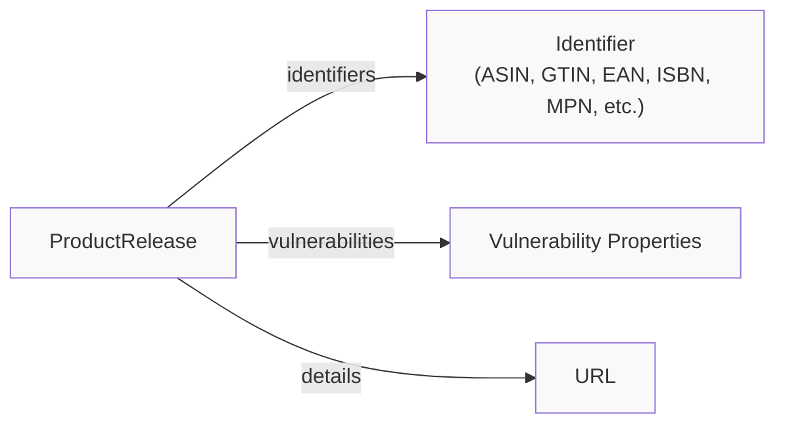
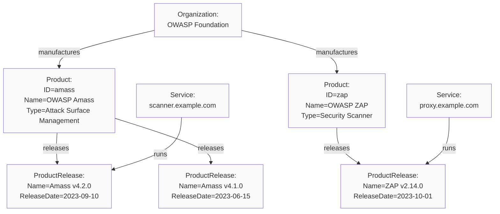

# Product Assets

# Product Assets

<details>
<summary>Relevant source files</summary>

The following files were used as context for generating this wiki page:

- [docs/images/taxonomy.excalidraw.png](docs/images/taxonomy.excalidraw.png)
- [docs/taxonomy.md](docs/taxonomy.md)
- [platform/product.go](platform/product.go)
- [platform/product_test.go](platform/product_test.go)

</details>


## Purpose and Scope

This document describes the **Product** and **ProductRelease** asset types defined in the Open Asset Model. These asset types represent technology products and their specific versions/releases, enabling tracking of software, hardware, and other technology products within an organization's attack surface.

Product Assets belong to the Business Entities domain and model the commercial/technological products used or managed by organizations. For information about organizational entities that manufacture or own products, see [Organizational Assets](#3.2). For information about services running specific product versions, see [Digital Assets](#3.3).

**Sources:** [platform/product.go:1-75](), [docs/taxonomy.md:1-586]()

## Asset Type Overview

The Product Assets domain defines two asset types:

| Asset Type | AssetType Constant | Purpose | Key Field |
|------------|-------------------|---------|-----------|
| `Product` | `model.Product` | Represents a technology product | `ID` (unique identifier) |
| `ProductRelease` | `model.ProductRelease` | Represents a specific version/release of a product | `Name` (release name/version) |

**Sources:** [platform/product.go:18-74](), [asset.go]()

## Product Asset Type

### Structure Definition

The `Product` struct represents a technology product and serves as the parent entity for organizing product releases.



**Diagram: Product struct implementing the Asset interface**

**Sources:** [platform/product.go:18-40]()

### Product Fields

| Field | JSON Tag | Type | Required | Description |
|-------|----------|------|----------|-------------|
| `ID` | `unique_id` | string | Yes | Unique identifier for the product (used as key) |
| `Name` | `product_name` | string | Yes | Human-readable product name |
| `Type` | `product_type` | string | Yes | Classification of the product type |
| `Category` | `category` | string | No | Product category (omitted if empty) |
| `Description` | `description` | string | No | Detailed description of the product (omitted if empty) |
| `CountryOfOrigin` | `country_of_origin` | string | No | ISO country code of product origin (omitted if empty) |

**Sources:** [platform/product.go:18-25]()

### Key Generation

The `Key()` method for `Product` returns the `ID` field, which serves as the unique identifier for deduplication in asset stores.

```go
// Example from test
p := Product{
    ID:   "12345",
    Name: "OWASP Amass",
    Type: "Information Security",
}
p.Key() // Returns: "12345"
```

**Sources:** [platform/product.go:28-30](), [platform/product_test.go:14-24]()

### JSON Serialization

The `Product` type marshals to JSON with specific field name mappings:

| Example Product | Serialized JSON |
|-----------------|-----------------|
| `Product{ID: "12345", Name: "OWASP Amass", Type: "Attack Surface Management", Category: "Information Security", Description: "In-depth attack surface mapping and asset discovery", CountryOfOrigin: "US"}` | `{"unique_id":"12345","product_name":"OWASP Amass","product_type":"Attack Surface Management","category":"Information Security","description":"In-depth attack surface mapping and asset discovery","country_of_origin":"US"}` |

Fields marked with `omitempty` are excluded when empty.

**Sources:** [platform/product.go:38-40](), [platform/product_test.go:40-58]()

## ProductRelease Asset Type

### Structure Definition

The `ProductRelease` struct represents a specific release or version of a product. It is designed to be linked to a parent `Product` asset through relationships.



**Diagram: ProductRelease struct implementing the Asset interface**

**Sources:** [platform/product.go:56-74]()

### ProductRelease Fields

| Field | JSON Tag | Type | Required | Description |
|-------|----------|------|----------|-------------|
| `Name` | `name` | string | Yes | Release name or version identifier (used as key) |
| `ReleaseDate` | `release_date` | string | No | ISO 8601 timestamp of release date (omitted if empty) |

**Sources:** [platform/product.go:56-59]()

### Key Generation

The `Key()` method for `ProductRelease` returns the `Name` field, which uniquely identifies the release.

```go
// Example from test
p := ProductRelease{Name: "Amass v4.2.0"}
p.Key() // Returns: "Amass v4.2.0"
```

**Sources:** [platform/product.go:62-64](), [platform/product_test.go:61-67]()

### JSON Serialization

The `ProductRelease` type marshals to JSON with minimal fields:

| Example ProductRelease | Serialized JSON |
|------------------------|-----------------|
| `ProductRelease{Name: "Amass v4.2.0", ReleaseDate: "2023-09-10T14:15:00Z"}` | `{"name":"Amass v4.2.0","release_date":"2023-09-10T14:15:00Z"}` |

**Sources:** [platform/product.go:72-74](), [platform/product_test.go:83-97]()

## Asset Interface Implementation

Both `Product` and `ProductRelease` implement the `Asset` interface defined in the core model.



**Diagram: Product Assets implementation hierarchy**

**Sources:** [platform/product.go:1-75](), [asset.go]()

### Interface Compliance Verification

The test suite verifies interface implementation using Go's compile-time type assertions:

```go
// From product_test.go
var _ model.Asset = Product{}        // Value receiver
var _ model.Asset = (*Product)(nil)  // Pointer receiver

var _ model.Asset = ProductRelease{}       // Value receiver
var _ model.Asset = (*ProductRelease)(nil) // Pointer receiver
```

These assertions ensure that both value and pointer receivers correctly implement the `Asset` interface.

**Sources:** [platform/product_test.go:28-29](), [platform/product_test.go:71-72]()

## Planned Relationship Support

The code comments document intended relationship support for future implementation:

### Product Relationships



**Diagram: Planned outgoing relationships from Product**

The `Product` asset type is designed to support relationships to:
- **Manufacturer**: Link to an `Organization` asset representing the product manufacturer
- **Website**: Link to a `URL` asset for the product's official website
- **Product releases**: Links to `ProductRelease` assets for specific versions

**Sources:** [platform/product.go:13-17]()

### ProductRelease Relationships



**Diagram: Planned outgoing relationships from ProductRelease**

The `ProductRelease` asset type is designed to support relationships to:
- **Product Identifiers**: Links to `Identifier` assets for various product identification systems:
  - Amazon Standard Identification Number (ASIN)
  - Global Trade Item Number (GTIN)
  - International Article Number (EAN)
  - International Standard Book Number (ISBN)
  - Manufacturer Part Number (MPN)
  - Model Number
  - NATO Stock Number (NSN)
  - Serial Number
  - Universal Product Code (UPC)
  - Version Number
- **Vulnerabilities**: Links to vulnerability information for the release
- **Website**: Link to a `URL` asset with release-specific details

**Sources:** [platform/product.go:43-55]()

## Use Cases

### Technology Inventory Management

Product assets enable comprehensive tracking of technology products used within an organization:



**Diagram: Product asset hierarchy in a technology inventory**

**Sources:** [platform/product.go:13-55]()

### Vulnerability Management

Product releases can be linked to vulnerability information, enabling impact assessment:

| Scenario | Assets Involved |
|----------|-----------------|
| Known vulnerability in specific version | `ProductRelease` → Vulnerability Property |
| All services running vulnerable version | Query services linked to vulnerable `ProductRelease` |
| Product line impact assessment | Enumerate all `ProductRelease` assets linked to parent `Product` |

**Sources:** [platform/product.go:43-55]()

### Software Bill of Materials (SBOM)

Product and ProductRelease assets can represent components in a software bill of materials:

1. Create `Product` asset for each dependency
2. Create `ProductRelease` asset for specific version used
3. Link `ProductRelease` to identifier assets (e.g., Maven coordinates, NPM package names)
4. Track which services/applications use which product releases

**Sources:** [platform/product.go:1-75]()

## Testing Coverage

The test suite validates all interface methods and JSON serialization:

| Test Function | Purpose | File Location |
|---------------|---------|---------------|
| `TestProductKey` | Verifies `Key()` returns `ID` field | [platform/product_test.go:14-25]() |
| `TestProductAssetType` | Verifies `AssetType()` returns `model.Product` and interface compliance | [platform/product_test.go:27-38]() |
| `TestProductJSON` | Verifies JSON serialization with all fields | [platform/product_test.go:40-59]() |
| `TestProductReleaseKey` | Verifies `Key()` returns `Name` field | [platform/product_test.go:61-68]() |
| `TestProductReleaseAssetType` | Verifies `AssetType()` returns `model.ProductRelease` and interface compliance | [platform/product_test.go:70-81]() |
| `TestProductReleaseJSON` | Verifies JSON serialization with minimal fields | [platform/product_test.go:83-98]() |

**Sources:** [platform/product_test.go:1-99]()