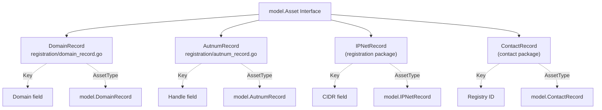
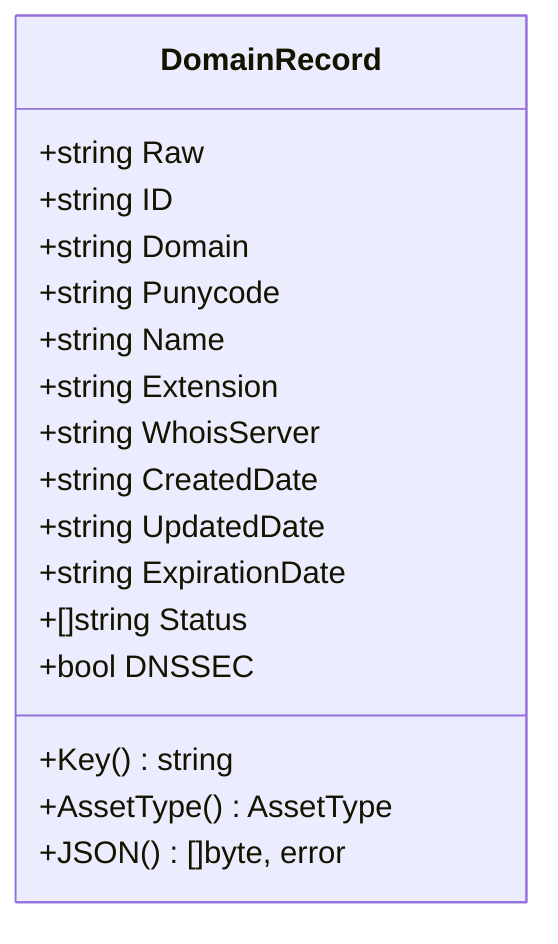
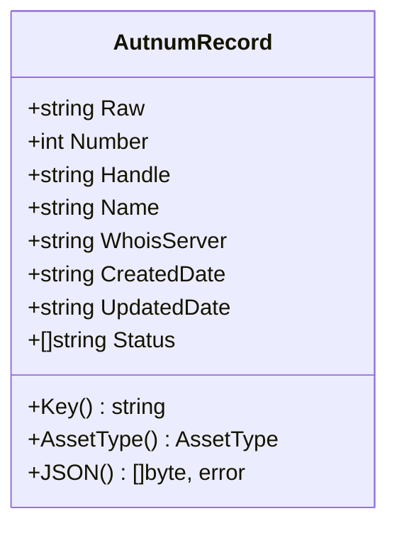
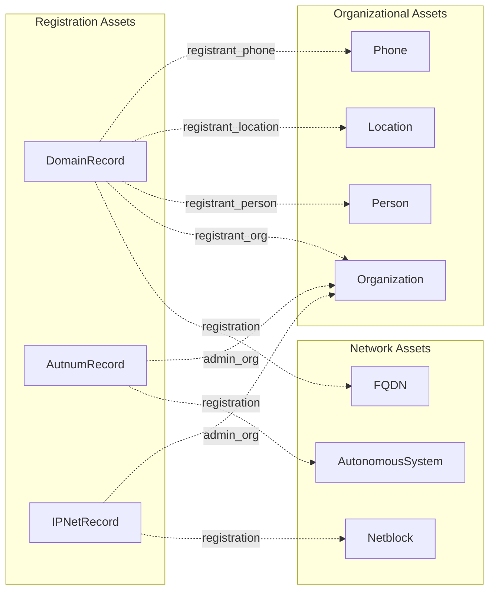
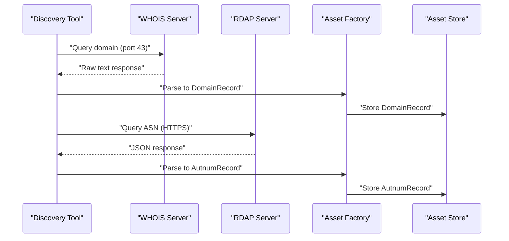
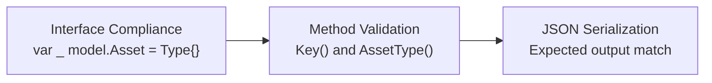
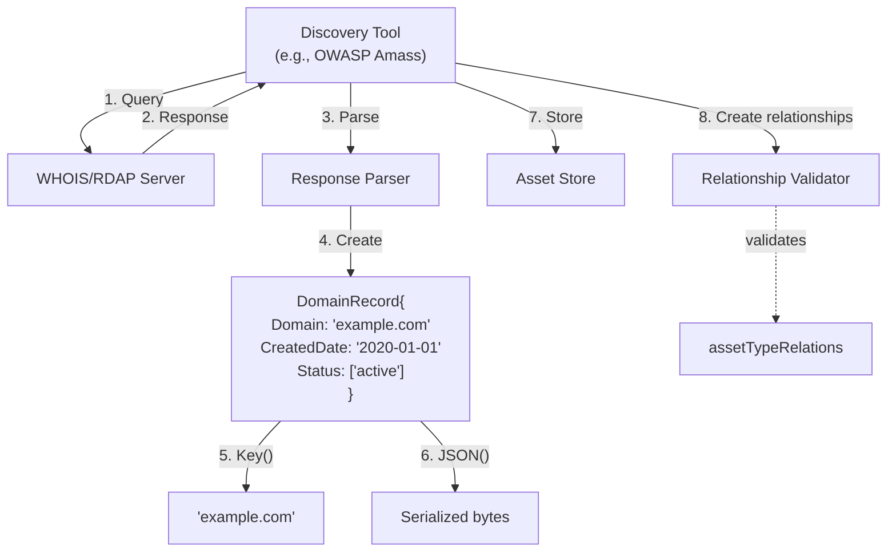

# Registration Assets

# Registration Assets

<details>
<summary>Relevant source files</summary>

The following files were used as context for generating this wiki page:

- [certificate/tls_certificate.go](certificate/tls_certificate.go)
- [docs/images/taxonomy.excalidraw.png](docs/images/taxonomy.excalidraw.png)
- [docs/taxonomy.md](docs/taxonomy.md)
- [registration/autnum_record.go](registration/autnum_record.go)
- [registration/autnum_record_test.go](registration/autnum_record_test.go)
- [registration/domain_record.go](registration/domain_record.go)
- [registration/domain_record_test.go](registration/domain_record_test.go)

</details>


## Purpose and Scope

This document details the registration record asset types in the Open Asset Model, which represent metadata obtained from WHOIS and RDAP (Registration Data Access Protocol) lookups. These assets capture registration information for internet resources such as domain names, autonomous system numbers, and IP network allocations.

Registration assets store administrative and operational data about who registered an internet resource, when it was registered, its status, and associated contact information. Unlike network assets that represent the resources themselves (see [Network Assets](#3.1)), registration assets document the registration records for those resources.

For information about organizational entities referenced in registration records, see [Organizational Assets](#3.2).

---

## Registration Asset Type Overview

The Open Asset Model defines four registration record asset types:

| Asset Type | Purpose | Data Source | Key Field |
|------------|---------|-------------|-----------|
| `DomainRecord` | Domain name registration records | WHOIS/RDAP | Domain name |
| `AutnumRecord` | Autonomous system number records | RDAP | AS handle |
| `IPNetRecord` | IP network allocation records | RDAP/RIR | CIDR range |
| `ContactRecord` | Contact information from registries | WHOIS/RDAP | Registry ID |

Each registration asset type implements the `Asset` interface with three required methods: `Key()`, `AssetType()`, and `JSON()`.

**Sources:** [registration/domain_record.go:13-42](), [registration/autnum_record.go:13-38](), [docs/taxonomy.md:450-554]()

---

## Asset Type Hierarchy



**Sources:** [registration/domain_record.go:29-36](), [registration/autnum_record.go:26-33]()

---

## DomainRecord Asset Type

### Structure

The `DomainRecord` type represents WHOIS/RDAP registration information for a domain name. It is defined in the `registration` package.



### Field Descriptions

| Field | Type | JSON Tag | Purpose |
|-------|------|----------|---------|
| `Raw` | `string` | `raw,omitempty` | Original raw WHOIS/RDAP response |
| `ID` | `string` | `id,omitempty` | Registry-assigned identifier |
| `Domain` | `string` | `domain,omitempty` | Fully qualified domain name |
| `Punycode` | `string` | `punycode,omitempty` | Punycode representation of IDN domains |
| `Name` | `string` | `name,omitempty` | Domain name without extension |
| `Extension` | `string` | `extension,omitempty` | Top-level domain extension |
| `WhoisServer` | `string` | `whois_server,omitempty` | WHOIS server hostname |
| `CreatedDate` | `string` | `created_date,omitempty` | Registration creation date |
| `UpdatedDate` | `string` | `updated_date,omitempty` | Last update timestamp |
| `ExpirationDate` | `string` | `expiration_date,omitempty` | Registration expiration date |
| `Status` | `[]string` | `status,omitempty` | Domain status codes (e.g., "clientTransferProhibited") |
| `DNSSEC` | `bool` | `dnssec,omitempty` | DNSSEC enabled status |

### Interface Implementation

The `DomainRecord` type implements the `Asset` interface:

- **Key()**: Returns the `Domain` field as the unique identifier
- **AssetType()**: Returns `model.DomainRecord` constant
- **JSON()**: Marshals the struct to JSON using standard `encoding/json`

All fields use `omitempty` JSON tags to exclude empty values from serialization.

### Example JSON Output

```json
{
  "domain": "example.com",
  "created_date": "2020-01-01",
  "updated_date": "2021-01-01",
  "expiration_date": "2022-01-01",
  "status": ["active", "clientTransferProhibited"],
  "dnssec": true
}
```

**Sources:** [registration/domain_record.go:1-42](), [registration/domain_record_test.go:33-57]()

---

## AutnumRecord Asset Type

### Structure

The `AutnumRecord` type represents RDAP registration information for an Autonomous System Number (ASN). It is defined in the `registration` package.



### Field Descriptions

| Field | Type | JSON Tag | Purpose |
|-------|------|----------|---------|
| `Raw` | `string` | `raw,omitempty` | Original raw RDAP response |
| `Number` | `int` | `number` | Autonomous System Number (e.g., 26808) |
| `Handle` | `string` | `handle` | Registry handle identifier (e.g., "AS26808") |
| `Name` | `string` | `name` | ASN assignment name |
| `WhoisServer` | `string` | `whois_server,omitempty` | RDAP/WHOIS server hostname |
| `CreatedDate` | `string` | `created_date,omitempty` | Registration creation timestamp |
| `UpdatedDate` | `string` | `updated_date,omitempty` | Last update timestamp |
| `Status` | `[]string` | `status,omitempty` | Registration status codes |

### Interface Implementation

The `AutnumRecord` type implements the `Asset` interface:

- **Key()**: Returns the `Handle` field (e.g., "AS26808")
- **AssetType()**: Returns `model.AutnumRecord` constant
- **JSON()**: Marshals the struct to JSON using standard `encoding/json`

### Example JSON Output

```json
{
  "number": 26808,
  "handle": "AS26808",
  "name": "UTICA-COLLEGE",
  "whois_server": "whois.arin.net",
  "created_date": "2002-11-25 22:25:46",
  "updated_date": "2021-05-03 17:59:17",
  "status": ["active"]
}
```

**Sources:** [registration/autnum_record.go:1-38](), [registration/autnum_record_test.go:33-58]()

---

## IPNetRecord Asset Type

### Overview

The `IPNetRecord` type represents RDAP registration information for IP network allocations. While implementation files were not provided, this asset type follows the same patterns as `DomainRecord` and `AutnumRecord`.

### Expected Structure

Based on the model's architecture and RDAP specifications, `IPNetRecord` likely contains:

| Field | Expected Type | Purpose |
|-------|--------------|---------|
| `CIDR` | `string` | IP network range in CIDR notation |
| `Handle` | `string` | Registry handle identifier |
| `Name` | `string` | Network name or description |
| `StartAddress` | `string` | First IP address in range |
| `EndAddress` | `string` | Last IP address in range |
| `IPVersion` | `string` | "IPv4" or "IPv6" |
| `ParentHandle` | `string` | Parent network handle |
| `RegistryName` | `string` | RIR name (ARIN, RIPE, etc.) |
| `CreatedDate` | `string` | Allocation creation timestamp |
| `UpdatedDate` | `string` | Last update timestamp |
| `Status` | `[]string` | Allocation status codes |

**Sources:** [docs/taxonomy.md:450-554]()

---

## ContactRecord Asset Type

### Overview

The `ContactRecord` type stores contact information extracted from registration records. This asset type is referenced in the taxonomy but implemented in a separate package from the core registration records.

### Purpose

`ContactRecord` captures structured contact data from WHOIS/RDAP responses, enabling relationships to:
- `Person` assets for individual contacts
- `Organization` assets for organizational contacts
- `Location` assets for physical addresses
- `Phone` assets for contact numbers

This allows registration records to reference normalized contact entities rather than embedding redundant contact information.

**Sources:** [docs/taxonomy.md:450-554]()

---

## Relationship Patterns

Registration assets establish relationships with other asset types to create a comprehensive view of internet resource registrations.



### Common Relationship Labels

Registration assets typically support these outgoing relationship labels:

| Label | Destination Type | Purpose |
|-------|------------------|---------|
| `registrant_org` | `Organization` | Registrant organization |
| `registrant_person` | `Person` | Registrant individual |
| `registrant_location` | `Location` | Registrant address |
| `registrant_phone` | `Phone` | Registrant contact number |
| `registrant_email` | `EmailAddress` | Registrant email address |
| `admin_org` | `Organization` | Administrative contact organization |
| `admin_person` | `Person` | Administrative contact person |
| `tech_org` | `Organization` | Technical contact organization |
| `tech_person` | `Person` | Technical contact person |
| `billing_org` | `Organization` | Billing contact organization |
| `billing_person` | `Person` | Billing contact person |
| `name_server` | `FQDN` | Authoritative name servers |
| `published_by` | `Registrar` | Domain registrar |

**Sources:** [docs/taxonomy.md:520-547]()

---

## Data Sources and Protocols

Registration assets are populated from two primary data sources:

### WHOIS Protocol

**Purpose**: Legacy protocol for querying domain registration data  
**Transport**: TCP port 43  
**Format**: Unstructured text responses  
**Primary Use**: Domain name registrations (`DomainRecord`)

WHOIS responses vary by registry and require parsing to extract structured fields. The `Raw` field in registration assets preserves the original WHOIS response for troubleshooting and audit purposes.

### RDAP Protocol

**Purpose**: Modern replacement for WHOIS  
**Transport**: HTTPS  
**Format**: Structured JSON responses  
**Primary Use**: All registration records (domains, ASNs, IP networks)

RDAP provides standardized JSON responses that map more cleanly to the registration asset structures. The protocol is preferred for `AutnumRecord` and `IPNetRecord` queries.



**Sources:** [registration/domain_record.go:13-14](), [registration/autnum_record.go:13-14]()

---

## Implementation Patterns

### Struct Design Pattern

All registration asset types follow a consistent design pattern:

1. **Raw field preservation**: Optional `Raw` field stores unprocessed source data
2. **Omitempty JSON tags**: All optional fields use `omitempty` to minimize serialization size
3. **String dates**: Temporal fields use `string` type for maximum flexibility with diverse date formats
4. **Handle-based keys**: Key fields prefer registry handles over numeric identifiers
5. **Status arrays**: Multi-valued status fields use `[]string` slices

### Key Method Pattern

Registration assets use domain-specific key fields:

```go
// DomainRecord uses domain name as key
func (dr DomainRecord) Key() string {
    return dr.Domain
}

// AutnumRecord uses AS handle as key
func (as AutnumRecord) Key() string {
    return as.Handle
}
```

This ensures uniqueness within each asset type while allowing human-readable identifiers.

**Sources:** [registration/domain_record.go:29-32](), [registration/autnum_record.go:26-28]()

### Testing Pattern

Registration asset tests follow a three-phase validation pattern:



**Phase 1: Interface Compliance**
```go
var _ model.Asset = DomainRecord{}
var _ model.Asset = (*DomainRecord)(nil)
```
Verifies compile-time interface implementation for both value and pointer receivers.

**Phase 2: Method Validation**
Tests verify `Key()` returns the expected identifier and `AssetType()` returns the correct constant.

**Phase 3: Serialization Validation**
Tests compare JSON output against expected strings to ensure correct field names and `omitempty` behavior.

**Sources:** [registration/domain_record_test.go:22-32](), [registration/autnum_record_test.go:22-32](), [registration/domain_record_test.go:33-57](), [registration/autnum_record_test.go:33-58]()

---

## Integration with Discovery Tools

Registration assets are typically created by discovery tools during reconnaissance workflows:



The discovery tool:
1. Queries WHOIS/RDAP servers for registration data
2. Receives raw responses
3. Parses responses into structured data
4. Creates registration asset instances
5. Extracts unique keys for deduplication
6. Serializes to JSON for storage
7. Persists to the asset store
8. Creates validated relationships to other assets

**Sources:** [registration/domain_record.go:13-42](), [registration/autnum_record.go:13-38]()

---

## Status Codes

Registration assets use status arrays to capture the operational state of registrations. Common status values include:

### Domain Status Codes (EPP)

| Status Code | Meaning |
|-------------|---------|
| `active` | Domain is active and resolvable |
| `clientDeleteProhibited` | Registrar prevents deletion |
| `clientHold` | Domain is not resolvable |
| `clientRenewProhibited` | Registrar prevents renewal |
| `clientTransferProhibited` | Registrar prevents transfer |
| `clientUpdateProhibited` | Registrar prevents updates |
| `pendingDelete` | Domain scheduled for deletion |
| `redemptionPeriod` | Grace period for redemption |
| `serverDeleteProhibited` | Registry prevents deletion |
| `serverHold` | Registry suspension |
| `serverTransferProhibited` | Registry prevents transfer |

### ASN Status Codes

| Status Code | Meaning |
|-------------|---------|
| `active` | ASN is in active use |
| `reserved` | ASN reserved for special use |
| `assigned` | ASN assigned to entity |
| `unallocated` | ASN not yet allocated |

**Sources:** [registration/domain_record.go:25](), [registration/autnum_record.go:22](), [registration/domain_record_test.go:39](), [registration/autnum_record_test.go:41]()

---

## Summary

Registration assets in the Open Asset Model provide standardized representations of internet resource registration records obtained from WHOIS and RDAP services. The four asset types—`DomainRecord`, `AutnumRecord`, `IPNetRecord`, and `ContactRecord`—follow consistent implementation patterns while accommodating the unique characteristics of different registration systems.

Key characteristics:
- **Source preservation**: Raw field stores unprocessed data
- **Flexible serialization**: Omitempty tags minimize JSON size
- **Relationship-rich**: Connect registration data to network, organizational, and contact assets
- **Protocol-agnostic**: Support both WHOIS and RDAP data sources
- **Status tracking**: Capture operational state through status arrays

For implementation guidance, see [Implementing Asset Types](#6.1). For relationship validation details, see [Relationship Taxonomy](#4.1).