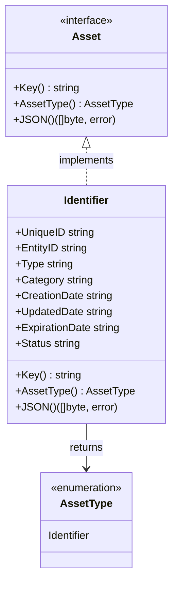
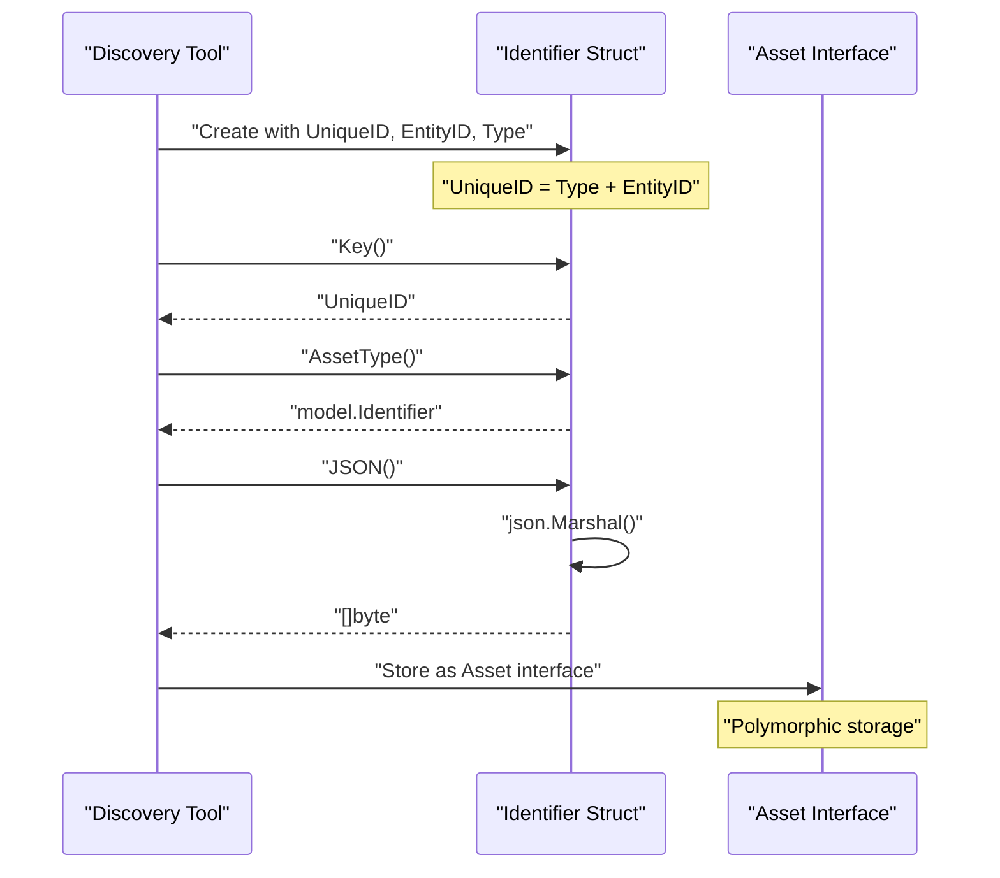
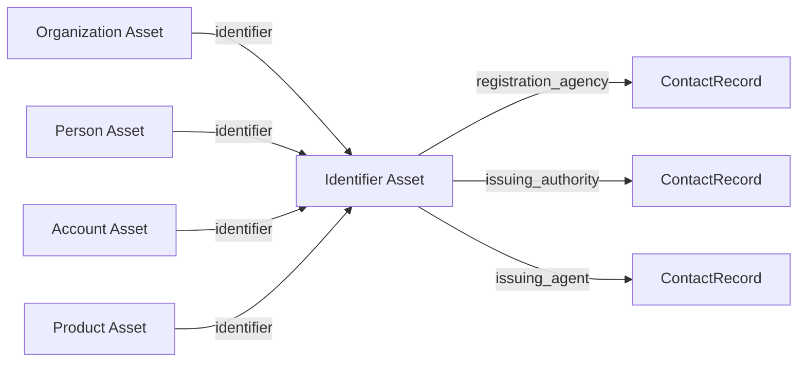

# Identifier Assets

# Identifier Assets

<details>
<summary>Relevant source files</summary>

The following files were used as context for generating this wiki page:

- [docs/images/taxonomy.excalidraw.png](docs/images/taxonomy.excalidraw.png)
- [docs/taxonomy.md](docs/taxonomy.md)
- [general/identifier.go](general/identifier.go)
- [general/identifier_test.go](general/identifier_test.go)

</details>


## Purpose and Scope

This document covers the **Identifier** asset type, which represents standardized identification numbers, codes, and identifiers issued by registration agencies, standards organizations, and governing bodies. Identifiers are used to uniquely identify entities (organizations, products, accounts, locations, etc.) within specific identification schemes such as LEI, DUNS, ISBN, IBAN, and 30+ other types.

For information about other identity-related assets, see [Identity & Access Assets](#3). For registration records obtained from WHOIS/RDAP lookups, see [Registration Assets](#3.6). For organizational entities themselves, see [Organizational Assets](#3.2).

---

## Overview

The `Identifier` asset type models standardized identification codes and numbers that are assigned to entities by issuing authorities. These identifiers serve as canonical references within specific identification schemes and are commonly encountered during reconnaissance activities involving:

- **Legal entities**: LEI codes, DUNS numbers, tax IDs
- **Financial instruments**: SWIFT codes, IBAN numbers, account numbers
- **Products**: ISBN, UPC, EAN, GTIN, serial numbers
- **Industry classification**: NAICS, SIC, ISIC, OECD codes
- **Domain registration**: ICANN authorization codes and EPP status codes

The Identifier asset is defined in [general/identifier.go:52-61]() and implements the core `Asset` interface defined in [asset.go]().

**Sources:** [general/identifier.go:1-77](), [general/identifier_test.go:1-60]()

---

## Data Structure

The `Identifier` struct contains eight fields that capture both the identifier itself and metadata about its lifecycle:



### Field Specifications

| Field | JSON Tag | Type | Required | Description |
|-------|----------|------|----------|-------------|
| `UniqueID` | `unique_id` | string | Yes | Composite key combining type and entity ID (e.g., "Legal Entity Identifier:549300XMYB546ZI1F126") |
| `EntityID` | `entity_id` | string | Yes | The actual identifier value assigned by the issuing authority |
| `Type` | `id_type` | string | Yes | The identifier scheme/type (must be one of the 32+ defined constants) |
| `Category` | `category` | string | No | Categorization of the identifier (e.g., "GENERAL", "FINANCIAL", "PRODUCT") |
| `CreationDate` | `creation_date` | string | No | ISO 8601 timestamp when the identifier was first issued |
| `UpdatedDate` | `update_date` | string | No | ISO 8601 timestamp of the last update to the identifier record |
| `ExpirationDate` | `expiration_date` | string | No | ISO 8601 timestamp when the identifier expires or becomes invalid |
| `Status` | `status` | string | No | Current status of the identifier (e.g., "ACTIVE", "EXPIRED", "REVOKED") |

The `UniqueID` field serves as the asset's key and should be constructed by concatenating the `Type` and `EntityID` to ensure global uniqueness across different identification schemes.

**Sources:** [general/identifier.go:52-61](), [general/identifier_test.go:39-59]()

---

## Identifier Type Constants

The Open Asset Model defines 32 standardized identifier types as string constants in [general/identifier.go:14-45](). These constants should be used to populate the `Type` field to ensure consistency across implementations.

### Complete Taxonomy

```mermaid
graph TD
    Identifier["Identifier Asset"]
    
    Identifier --> Financial["Financial Identifiers"]
    Identifier --> Product["Product Identifiers"]
    Identifier --> Business["Business Identifiers"]
    Identifier --> Industry["Industry Classification"]
    Identifier --> Domain["Domain Registration"]
    Identifier --> General["General Identifiers"]
    
    Financial --> BankIDCode["BankIDCode (bic)"]
    Financial --> IBANCode["IBANCode (iban)"]
    Financial --> SWIFTCode["SWIFTCode (swift)"]
    Financial --> AccountNumber["AccountNumber (account)"]
    
    Product --> ISBN["ISBN (isbn)"]
    Product --> ASINNumber["ASINNumber (asin)"]
    Product --> EAN8["EAN8 (ean_8)"]
    Product --> EAN13["EAN13 (ean_13)"]
    Product --> UPCNumberA["UPCNumberA (upc_a)"]
    Product --> UPCNumberE["UPCNumberE (upc_e)"]
    Product --> MPN["MPN (mpn)"]
    Product --> GlobalTradeItemNumber["GlobalTradeItemNumber (gtin)"]
    Product --> NSNCode["NSNCode (nsn)"]
    Product --> ModelNumber["ModelNumber (model)"]
    Product --> SerialNumber["SerialNumber (serial)"]
    Product --> VersionNumber["VersionNumber (version)"]
    
    Business --> LEICode["LEICode (lei)"]
    Business --> DUNSNumer["DUNSNumer (duns)"]
    Business --> EmployerIDNumber["EmployerIDNumber (ein)"]
    Business --> TaxIDNumber["TaxIDNumber (tin)"]
    Business --> GlobalLocNumber["GlobalLocNumber (gln)"]
    Business --> TickerSymbol["TickerSymbol (ticker)"]
    
    Industry --> NAICSCode["NAICSCode (naics)"]
    Industry --> SICCode["SICCode (sic)"]
    Industry --> ISICCode["ISICCode (isic)"]
    Industry --> OECDCode["OECDCode (oecd)"]
    
    Domain --> ICANNAuthCode["ICANNAuthCode (icann_auth)"]
    Domain --> ICANNEPPCode["ICANNEPPCode (icann_epp)"]
    
    General --> EmailAddress["EmailAddress (email)"]
    General --> GovIssuedIDNumber["GovIssuedIDNumber (gov_id)"]
```



### Identifier Type Reference Table

| Constant Name | String Value | Description | Issuing Authority Example |
|--------------|--------------|-------------|---------------------------|
| `LEICode` | `lei` | Legal Entity Identifier | Global Legal Entity Identifier Foundation (GLEIF) |
| `DUNSNumer` | `duns` | Data Universal Numbering System | Dun & Bradstreet (D&B) |
| `BankIDCode` | `bic` | Bank Identifier Code | SWIFT |
| `IBANCode` | `iban` | International Bank Account Number | ISO 13616 |
| `SWIFTCode` | `swift` | Society for Worldwide Interbank Financial Telecommunication | SWIFT |
| `AccountNumber` | `account` | Generic account number | Various financial institutions |
| `ISBN` | `isbn` | International Standard Book Number | International ISBN Agency |
| `ASINNumber` | `asin` | Amazon Standard Identification Number | Amazon |
| `EAN8` | `ean_8` | International Article Number (8-digit) | GS1 |
| `EAN13` | `ean_13` | International Article Number (13-digit) | GS1 |
| `UPCNumberA` | `upc_a` | Universal Product Code Version A | GS1 |
| `UPCNumberE` | `upc_e` | Universal Product Code Version E | GS1 |
| `GlobalTradeItemNumber` | `gtin` | Global Trade Item Number | GS1 |
| `MPN` | `mpn` | Manufacturer Part Number | Product manufacturers |
| `NSNCode` | `nsn` | NATO Stock Number | NATO |
| `ModelNumber` | `model` | Product model number | Product manufacturers |
| `SerialNumber` | `serial` | Product serial number | Product manufacturers |
| `VersionNumber` | `version` | Software/product version number | Software vendors |
| `EmployerIDNumber` | `ein` | Employer Identification Number | IRS (United States) |
| `TaxIDNumber` | `tin` | Taxpayer Identification Number | Tax authorities |
| `GovIssuedIDNumber` | `gov_id` | Government-issued ID for individuals | Government agencies |
| `GlobalLocNumber` | `gln` | Global Location Number | GS1 |
| `TickerSymbol` | `ticker` | Stock ticker symbol | Stock exchanges |
| `NAICSCode` | `naics` | North American Industry Classification System | U.S. Census Bureau |
| `SICCode` | `sic` | Standard Industrial Classification | U.S. Government |
| `ISICCode` | `isic` | International Standard Industrial Classification | United Nations |
| `OECDCode` | `oecd` | Organization for Economic Co-operation and Development | OECD |
| `ICANNAuthCode` | `icann_auth` | ICANN Authorization Code | Domain registrars |
| `ICANNEPPCode` | `icann_epp` | ICANN EPP status code | Domain registries |
| `EmailAddress` | `email` | Email address identifier | Email service providers |

**Sources:** [general/identifier.go:14-45]()

---

## Interface Implementation

The `Identifier` struct implements the `Asset` interface through three required methods:

### Key() Method

The `Key()` method returns the `UniqueID` field, which serves as the asset's unique identifier across the system. This should be a composite string combining the identifier type and entity ID.

```go
// Example from general/identifier.go:64-66
func (r Identifier) Key() string {
    return r.UniqueID
}
```

**Example key format:** `"Legal Entity Identifier:549300XMYB546ZI1F126"`

**Sources:** [general/identifier.go:63-66](), [general/identifier_test.go:14-24]()

### AssetType() Method

The `AssetType()` method returns the `model.Identifier` constant, classifying this asset within the type enumeration system.

```go
// Example from general/identifier.go:69-71
func (r Identifier) AssetType() model.AssetType {
    return model.Identifier
}
```

**Sources:** [general/identifier.go:68-71](), [general/identifier_test.go:26-37]()

### JSON() Method

The `JSON()` method serializes the identifier to JSON format using the struct's JSON tags. Fields with `omitempty` tags are excluded when empty.

**Example JSON output:**
```json
{
  "unique_id": "Legal Entity Identifier:549300XMYB546ZI1F126",
  "entity_id": "549300XMYB546ZI1F126",
  "id_type": "Legal Entity Identifier",
  "category": "GENERAL",
  "creation_date": "2013-07-24T14:15:00Z",
  "update_date": "2023-08-04T17:33:45Z",
  "expiration_date": "2020-01-16T00:32:00Z",
  "status": "ACTIVE"
}
```

**Sources:** [general/identifier.go:73-76](), [general/identifier_test.go:39-59]()

---

## Usage Examples

### Creating an Identifier Asset



### Example: Legal Entity Identifier

```go
// LEI for an organization
identifier := Identifier{
    UniqueID:       "Legal Entity Identifier:549300XMYB546ZI1F126",
    EntityID:       "549300XMYB546ZI1F126",
    Type:           LEICode,  // Constant: "lei"
    Category:       "GENERAL",
    CreationDate:   "2013-07-24T14:15:00Z",
    UpdatedDate:    "2023-08-04T17:33:45Z",
    ExpirationDate: "2024-01-16T00:32:00Z",
    Status:         "ACTIVE",
}
```

### Example: DUNS Number

```go
// D&B DUNS number for a company
identifier := Identifier{
    UniqueID: "Data Universal Numbering System:123456789",
    EntityID: "123456789",
    Type:     DUNSNumer,  // Constant: "duns"
    Category: "BUSINESS",
    Status:   "ACTIVE",
}
```

### Example: Product ISBN

```go
// ISBN for a book/publication
identifier := Identifier{
    UniqueID: "International Standard Book Number:978-0-13-110362-7",
    EntityID: "978-0-13-110362-7",
    Type:     ISBN,  // Constant: "isbn"
    Category: "PRODUCT",
}
```

### Example: IBAN

```go
// International Bank Account Number
identifier := Identifier{
    UniqueID: "International Bank Account Number:GB82WEST12345698765432",
    EntityID: "GB82WEST12345698765432",
    Type:     IBANCode,  // Constant: "iban"
    Category: "FINANCIAL",
    Status:   "ACTIVE",
}
```

**Sources:** [general/identifier_test.go:14-59]()

---

## Relationships

According to the inline documentation in [general/identifier.go:47-51](), the `Identifier` asset is designed to support relationships with registration and issuing authorities:

### Planned Relationship Support



**Note:** As of the current implementation, these relationships are documented in code comments but not yet implemented in the relationship taxonomy. Refer to [Relationship System](#4) for information on how to implement asset relationships when this feature becomes available.

**Potential relationship labels:**
- `registration_agency`: Links to the ContactRecord representing the agency that maintains the identifier registry
- `issuing_authority`: Links to the ContactRecord for the authority that issued this specific identifier
- `issuing_agent`: Links to the ContactRecord for the agent or registrar that processed the identifier issuance

**Sources:** [general/identifier.go:47-51]()

---

## Testing

The identifier implementation includes comprehensive test coverage in [general/identifier_test.go:1-60]().

### Test Coverage

The test suite validates three critical aspects:

#### 1. Interface Compliance

```go
// Compile-time verification from general/identifier_test.go:27-28
var _ model.Asset = Identifier{}       // Value receiver
var _ model.Asset = (*Identifier)(nil) // Pointer receiver
```

This ensures both value and pointer types properly implement the `Asset` interface.

#### 2. Key() Method Validation

The test verifies that `Key()` returns the `UniqueID` field correctly:

```go
// Test case from general/identifier_test.go:14-24
want := "Legal Entity Identifier:549300XMYB546ZI1F126"
i := Identifier{
    UniqueID: want,
    EntityID: "549300XMYB546ZI1F126",
    Type:     "Legal Entity Identifier",
}
if got := i.Key(); got != want {
    t.Errorf("Identifier.Key() = %v, want %v", got, want)
}
```

#### 3. AssetType() Method Validation

Confirms that the asset returns the correct type constant:

```go
// Test case from general/identifier_test.go:26-37
i := Identifier{}
expected := model.Identifier
actual := i.AssetType()
if actual != expected {
    t.Errorf("Expected asset type %v but got %v", expected, actual)
}
```

#### 4. JSON Serialization

Validates that all fields serialize correctly with proper JSON tags and `omitempty` behavior:

```go
// Test case from general/identifier_test.go:39-59
i := Identifier{
    UniqueID:       "Legal Entity Identifier:549300XMYB546ZI1F126",
    EntityID:       "549300XMYB546ZI1F126",
    Type:           "Legal Entity Identifier",
    Category:       "GENERAL",
    CreationDate:   "2013-07-24T14:15:00Z",
    UpdatedDate:    "2023-08-04T17:33:45Z",
    ExpirationDate: "2020-01-16T00:32:00Z",
    Status:         "ACTIVE",
}
expected := `{"unique_id":"...","entity_id":"...","id_type":"...","category":"...","creation_date":"...","update_date":"...","expiration_date":"...","status":"..."}`
```

**Sources:** [general/identifier_test.go:1-60]()

---

## Implementation Notes

### Key Construction Best Practice

The `UniqueID` should be constructed by concatenating the human-readable identifier type name with the entity ID, separated by a colon:

```
UniqueID = "<Type Description>:<EntityID>"
```

Examples:
- `"Legal Entity Identifier:549300XMYB546ZI1F126"`
- `"Data Universal Numbering System:123456789"`
- `"International Standard Book Number:978-0-13-110362-7"`

### Type Constant Usage

Always use the defined string constants from [general/identifier.go:14-45]() rather than hardcoded strings to ensure consistency and prevent typos:

```go
// Good
identifier.Type = LEICode

// Bad
identifier.Type = "lei"  // Prone to typos and inconsistency
```

### Date Format

All date fields (`CreationDate`, `UpdatedDate`, `ExpirationDate`) should use ISO 8601 format with timezone information (preferably UTC):

```
"2013-07-24T14:15:00Z"
```

### Category Field

The `Category` field is optional and can be used to group identifiers by domain. Common categories include:
- `"GENERAL"`
- `"FINANCIAL"`
- `"BUSINESS"`
- `"PRODUCT"`
- `"DOMAIN"`
- `"INDUSTRY"`

**Sources:** [general/identifier.go:1-77](), [general/identifier_test.go:39-59]()