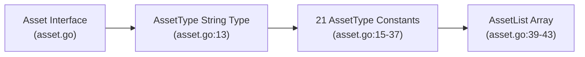
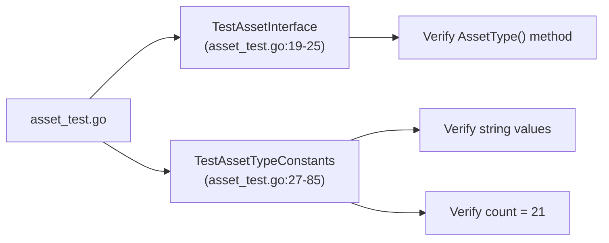

# Asset Types

# Asset Types

<details>
<summary>Relevant source files</summary>

The following files were used as context for generating this wiki page:

- [asset.go](asset.go)
- [asset_test.go](asset_test.go)
- [docs/images/taxonomy.excalidraw.png](docs/images/taxonomy.excalidraw.png)
- [docs/taxonomy.md](docs/taxonomy.md)
- [file/file.go](file/file.go)
- [file/file_test.go](file/file_test.go)

</details>


## Purpose and Scope

This page provides a comprehensive overview of the 21 asset types defined in the Open Asset Model. Asset types represent the fundamental categories of entities that can be discovered, tracked, and related within an organizational attack surface. Each asset type is implemented as a Go constant and has corresponding concrete implementations across domain-specific packages.

This document focuses on the taxonomy and organization of asset types. For details about the `Asset` interface that all types implement, see [Asset Interface](#2.1). For implementation details of specific asset types within each domain, see the domain-specific pages: [Network Assets](#3.1), [Organizational Assets](#3.2), [Digital Assets](#3.3), [Financial Assets](#3.4), [Product Assets](#3.5), [Registration Assets](#3.6), and [Identifier Assets](#3.7).

## Asset Type Enumeration

The Open Asset Model defines 21 distinct asset types as string constants in the core package. These types serve as discriminators for polymorphic asset handling and enable type-safe relationship validation throughout the system.

**Asset Type Definition**



Sources: [asset.go:7-11](), [asset.go:13](), [asset.go:15-37](), [asset.go:39-43]()

The `AssetType` is defined as a string type [asset.go:13](), allowing for compile-time type safety while maintaining human-readable string representations. All 21 constants are exported and available for use by client code [asset.go:15-37](). The `AssetList` variable provides programmatic access to all defined types [asset.go:39-43]().

## Complete Asset Type Listing

The following table catalogs all 21 asset types with their primary domain classification and brief description:

| Asset Type | Primary Domain | Description |
|------------|----------------|-------------|
| `Account` | Identity / Financial | User accounts and authentication credentials |
| `AutnumRecord` | Registration / Network | AS number registration records from RIR databases |
| `AutonomousSystem` | Network | BGP autonomous system numbers |
| `ContactRecord` | Registration / Organizational | Contact information from registration databases |
| `DomainRecord` | Registration / Digital | Domain name registration records from WHOIS/RDAP |
| `File` | Digital | Files such as documents, images, or other artifacts |
| `FQDN` | Network | Fully qualified domain names |
| `FundsTransfer` | Financial | Financial transactions and money movement |
| `Identifier` | Identity | Various organizational and entity identifiers (LEI, DUNS, etc.) |
| `IPAddress` | Network | IPv4 and IPv6 addresses |
| `IPNetRecord` | Registration / Network | IP network allocation records from RIR databases |
| `Location` | Organizational | Physical addresses and geographic locations |
| `Netblock` | Network | CIDR network blocks |
| `Organization` | Organizational | Companies, institutions, and organizational entities |
| `Person` | Organizational | Individual people |
| `Phone` | Organizational | Telephone numbers |
| `Product` | Product | Technology products and software |
| `ProductRelease` | Product | Specific versions or releases of products |
| `Service` | Digital | Network services running on infrastructure |
| `TLSCertificate` | Digital | X.509 TLS/SSL certificates |
| `URL` | Digital | Universal resource locators |

Sources: [asset.go:15-37](), [docs/taxonomy.md:1-555]()

## Domain-Based Taxonomy

The asset types are organized into six logical domains, reflecting the holistic approach to attack surface modeling. Some asset types appear in multiple domains due to their multi-faceted nature.

```mermaid
graph TD
    Root["Asset Type Taxonomy<br/>21 Total Types"]
    
    Network["Network Domain<br/>(6 types)"]
    Organizational["Organizational Domain<br/>(5 types)"]
    Digital["Digital Domain<br/>(5 types)"]
    Financial["Financial Domain<br/>(2 types)"]
    Product["Product Domain<br/>(2 types)"]
    Registration["Registration Domain<br/>(4 types)"]
    Identity["Identity Domain<br/>(2 types)"]
    
    Root --> Network
    Root --> Organizational
    Root --> Digital
    Root --> Financial
    Root --> Product
    Root --> Registration
    Root --> Identity
    
    Network --> FQDN["FQDN"]
    Network --> IPAddress["IPAddress"]
    Network --> Netblock["Netblock"]
    Network --> AS["AutonomousSystem"]
    Network --> IPNetRec["IPNetRecord"]
    Network --> AutnumRec["AutnumRecord"]
    
    Organizational --> Org["Organization"]
    Organizational --> Person["Person"]
    Organizational --> Location["Location"]
    Organizational --> Phone["Phone"]
    Organizational --> Contact["ContactRecord"]
    
    Digital --> File["File"]
    Digital --> URL["URL"]
    Digital --> Service["Service"]
    Digital --> TLS["TLSCertificate"]
    Digital --> DomainRec["DomainRecord"]
    
    Financial --> Account1["Account"]
    Financial --> Transfer["FundsTransfer"]
    
    Product --> Prod["Product"]
    Product --> Release["ProductRelease"]
    
    Registration --> DomainRec2["DomainRecord"]
    Registration --> AutnumRec2["AutnumRecord"]
    Registration --> IPNetRec2["IPNetRecord"]
    Registration --> Contact2["ContactRecord"]
    
    Identity --> Account2["Account"]
    Identity --> Identifier["Identifier"]
```



Sources: [asset.go:15-37](), [docs/taxonomy.md:39-555]()

### Domain Descriptions

**Network Domain**

Network infrastructure assets represent the technical foundation of internet connectivity. This includes DNS names (`FQDN`), IP addressing (`IPAddress`, `Netblock`), routing infrastructure (`AutonomousSystem`), and their corresponding registration records (`IPNetRecord`, `AutnumRecord`). See [Network Assets](#3.1) for detailed implementation information.

**Organizational Domain**

Organizational assets model the human and physical entities associated with an attack surface. This includes corporate entities (`Organization`), individuals (`Person`), physical locations (`Location`), contact methods (`Phone`), and structured contact records (`ContactRecord`). See [Organizational Assets](#3.2) for details.

**Digital Domain**

Digital assets represent artifacts and services within the digital infrastructure. This encompasses files (`File`), web resources (`URL`), running services (`Service`), cryptographic certificates (`TLSCertificate`), and domain registration data (`DomainRecord`). See [Digital Assets](#3.3) for implementation specifics.

**Financial Domain**

Financial assets track monetary relationships and transactions. Currently includes user accounts with financial implications (`Account`) and fund movements (`FundsTransfer`). See [Financial Assets](#3.4) for details.

**Product Domain**

Product assets model technology products and their releases. This includes general product information (`Product`) and version-specific data (`ProductRelease`). See [Product Assets](#3.5) for implementation details.

**Registration Domain**

Registration assets capture data from authoritative registration databases (WHOIS/RDAP/RIR). Includes domain registrations (`DomainRecord`), AS number registrations (`AutnumRecord`), IP allocation records (`IPNetRecord`), and contact records (`ContactRecord`). See [Registration Assets](#3.6) for details.

**Identity Domain**

Identity assets represent credentials and identifiers for authentication and unique entity identification. Includes user accounts (`Account`) and various standardized identifiers (`Identifier`). See [Identifier Assets](#3.7) for details about the 32+ identifier types supported.

Sources: [asset.go:15-37](), [docs/taxonomy.md:39-555]()

## Code Organization

Asset type implementations follow a hub-and-spoke package architecture where the core package defines the interface and type constants, while domain-specific packages provide concrete implementations.

```mermaid
graph TB
    CorePkg["Core Package<br/>open-asset-model"]
    AssetGo["asset.go<br/>Interface + Constants"]
    AssetList["AssetList Variable<br/>(asset.go:39-43)"]
    
    NetPkg["network/*"]
    OrgPkg["org/*, people/*, contact/*"]
    DigitalPkg["file/*, url/*, platform/*, certificate/*"]
    FinPkg["financial/*, account/*"]
    ProdPkg["platform/*"]
    RegPkg["registration/*"]
    IdentPkg["identity/*"]
    
    CorePkg --> AssetGo
    AssetGo --> AssetList
    
    AssetGo -.."defines types for".-> NetPkg
    AssetGo -.."defines types for".-> OrgPkg
    AssetGo -.."defines types for".-> DigitalPkg
    AssetGo -.."defines types for".-> FinPkg
    AssetGo -.."defines types for".-> ProdPkg
    AssetGo -.."defines types for".-> RegPkg
    AssetGo -.."defines types for".-> IdentPkg
    
    NetPkg -.."implements Asset".-> AssetGo
    OrgPkg -.."implements Asset".-> AssetGo
    DigitalPkg -.."implements Asset".-> AssetGo
    FinPkg -.."implements Asset".-> AssetGo
    ProdPkg -.."implements Asset".-> AssetGo
    RegPkg -.."implements Asset".-> AssetGo
    IdentPkg -.."implements Asset".-> AssetGo
```

Sources: [asset.go:1-44](), [file/file.go:1-34]()

Each domain package contains one or more concrete asset type implementations. For example, the `File` type in [file/file.go:14-18]() implements the `Asset` interface by providing `Key()`, `AssetType()`, and `JSON()` methods [file/file.go:20-33](). The `AssetType()` method returns the corresponding constant from [asset.go:21]().

## Asset Type Validation

The asset type constants are validated through comprehensive testing that ensures string values match expected representations and that all types are included in the `AssetList` array.

**Test Coverage Structure**



Sources: [asset_test.go:1-86]()

The test suite in [asset_test.go:27-85]() validates that:
1. All 21 asset type constants have correct string representations [asset_test.go:52-74]()
2. The total count of asset types matches expectations [asset_test.go:76-78]()
3. Each string value matches its expected format [asset_test.go:80-84]()

## Usage Patterns

Asset types are primarily used in three contexts within the system:

1. **Type Discrimination**: The `AssetType()` method allows runtime identification of concrete asset types
2. **Relationship Validation**: Asset types serve as keys in the relationship taxonomy maps (see [Relationship Taxonomy](#4.1))
3. **Serialization Routing**: Asset types enable type-specific JSON serialization logic

**Example: Asset Type Usage**

The `File` asset type demonstrates typical implementation patterns:

```
File struct implements Asset interface (file/file.go:14-18)
  ├── Key() returns URL field (file/file.go:21-23)
  ├── AssetType() returns model.File constant (file/file.go:26-28)
  └── JSON() serializes struct (file/file.go:31-33)

Test validates implementation (file/file_test.go:23-34)
  ├── Interface compliance check (file/file_test.go:24-25)
  └── AssetType() return value verification (file/file_test.go:27-33)
```

Sources: [file/file.go:14-33](), [file/file_test.go:23-34]()

## Extensibility

The asset type system is designed for extensibility. Adding a new asset type requires:

1. Adding a new constant to [asset.go:15-37]()
2. Adding the constant to the `AssetList` array [asset.go:39-43]()
3. Creating a concrete implementation in an appropriate package
4. Implementing the three required interface methods
5. Adding the type to relationship maps if it participates in relationships

See [Implementing Asset Types](#6.1) for a detailed guide on creating new asset type implementations.

Sources: [asset.go:1-44]()

## Related Pages

- **[Asset Interface](#2.1)**: Details about the `Asset` interface that all types implement
- **[Relationship System](#4)**: How asset types participate in the relationship taxonomy
- **[Implementation Patterns](#6)**: Best practices for implementing new asset types
- Domain-specific pages: [Network](#3.1), [Organizational](#3.2), [Digital](#3.3), [Financial](#3.4), [Product](#3.5), [Registration](#3.6), [Identifier](#3.7)