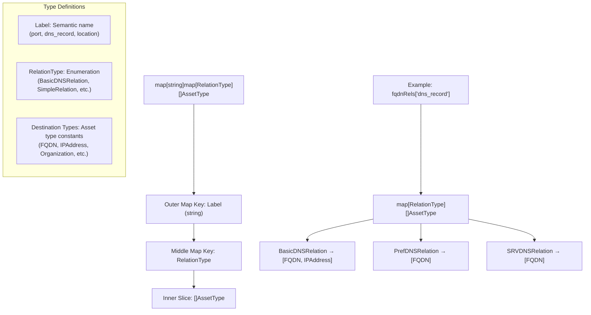
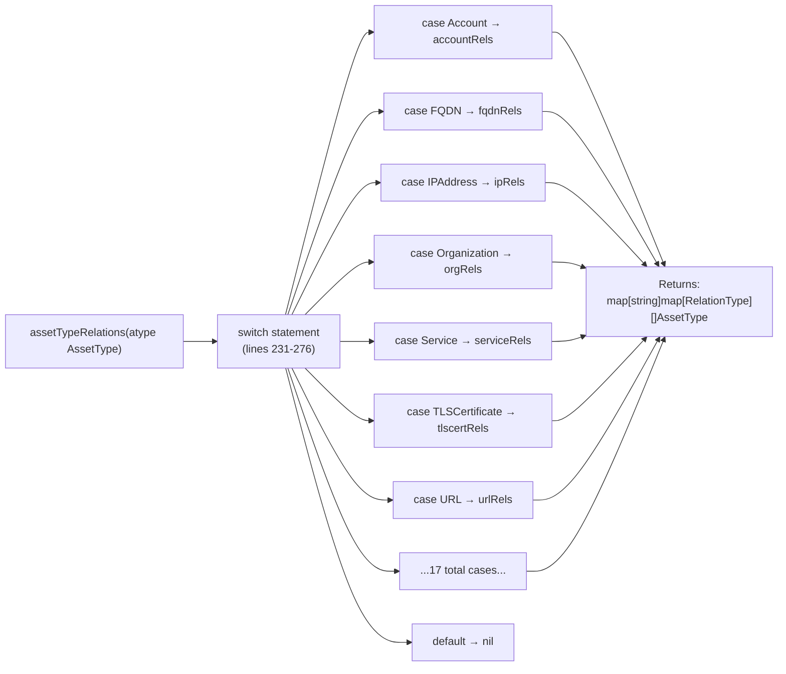
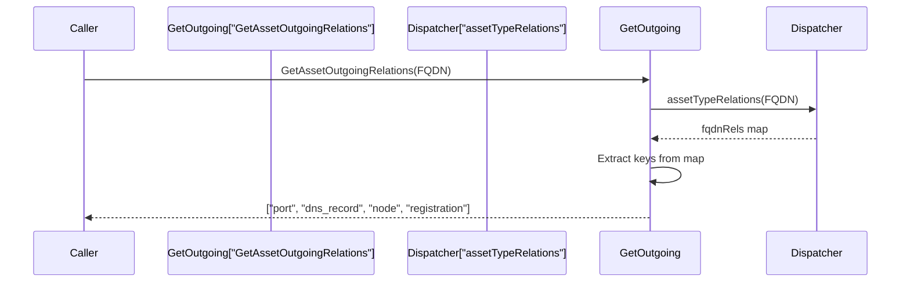
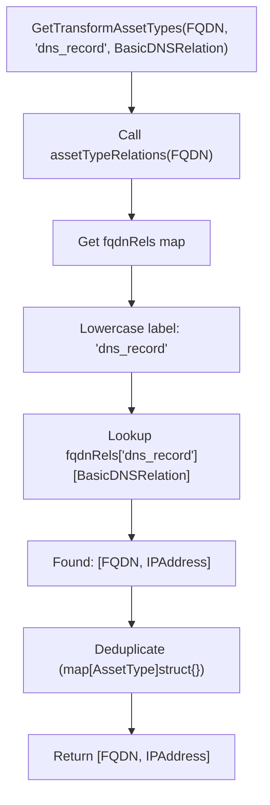
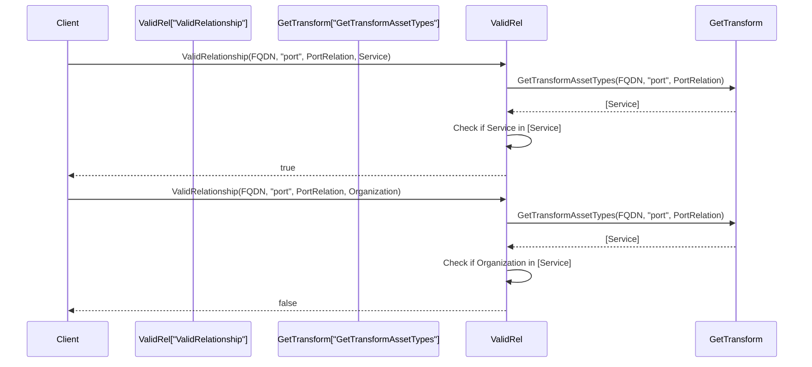
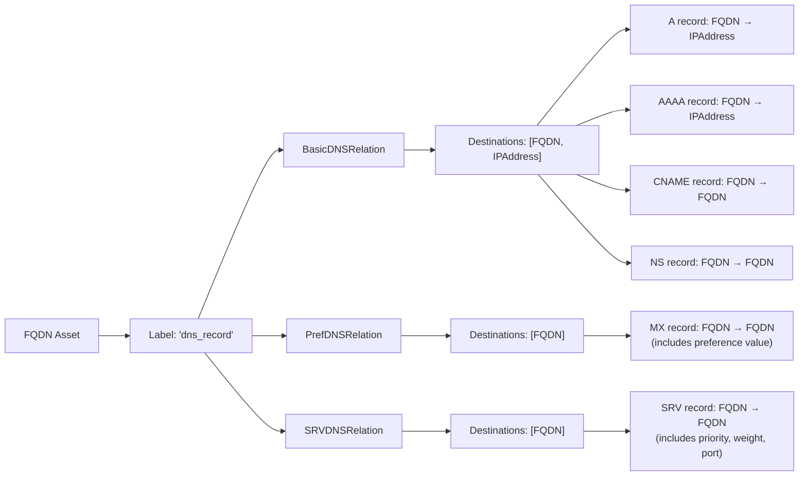
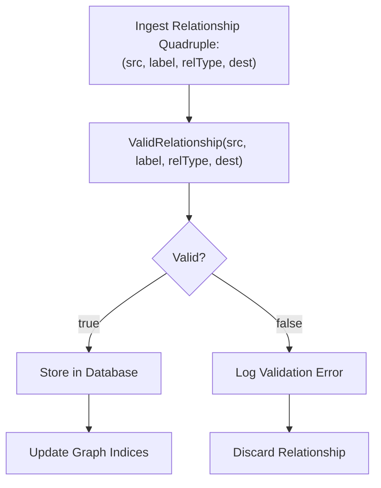
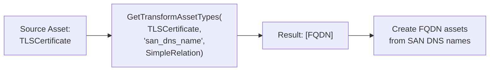

# Relationship Taxonomy

# Relationship Taxonomy

<details>
<summary>Relevant source files</summary>

The following files were used as context for generating this wiki page:

- [relation.go](relation.go)

</details>


## Purpose and Scope

This document explains the **relationship taxonomy system** that defines which connections are valid between asset types in the open-asset-model. The taxonomy is implemented as a nested map structure that maps source asset types to allowed relationship labels, relation types, and destination asset types. This page covers the central dispatcher function `assetTypeRelations`, the three public query functions (`GetAssetOutgoingRelations`, `GetTransformAssetTypes`, `ValidRelationship`), and the complete set of relationship definitions for all 21 asset types.

For information about the actual implementations of relation types (BasicDNSRelation, SimpleRelation, etc.), see [4.2](#4.2) and [4.3](#4.3). For the core Relation interface definition, see [2.2](#2.2).

**Sources:** [relation.go:1-296]()

---

## The Three-Level Nested Map Structure

The relationship taxonomy uses a **three-level nested map** to define valid relationships with fine-grained control:

```
map[string]map[RelationType][]AssetType
     │           │              │
     │           │              └─ Valid destination asset types
     │           └─ Relation type (BasicDNS, Simple, Port, etc.)
     └─ Relationship label (semantic meaning)
```

This structure allows the same label to map to different destination types depending on the `RelationType` used. For example, FQDN's `"dns_record"` label can point to different destinations based on whether it's a BasicDNSRelation (A/AAAA/CNAME records) or PrefDNSRelation (MX records).

### Structure Diagram



**Sources:** [relation.go:31-184](), [relation.go:228-279]()

---

## Central Dispatcher: assetTypeRelations Function

The `assetTypeRelations` function serves as the **central dispatcher** that routes each `AssetType` to its corresponding relationship map. This function implements a large switch statement covering all 21 asset types.



The function returns `nil` for invalid or unrecognized asset types, enabling safe querying through the public API functions.

**Sources:** [relation.go:228-279]()

---

## Query Functions

The relationship taxonomy exposes three public query functions, each serving a distinct use case in the asset discovery and validation workflow.

### GetAssetOutgoingRelations

Returns all valid relationship **labels** for a given source asset type. This function is used for discovery workflows where the caller needs to enumerate all possible relationships from a specific asset.

**Function Signature:** `GetAssetOutgoingRelations(subject AssetType) []string`

**Implementation Pattern:**
1. Call `assetTypeRelations(subject)` to get the relationship map
2. Return `nil` if the map is `nil` (invalid asset type)
3. Extract all keys from the map (relationship labels)
4. Return the label slice



**Example Results:**

| Asset Type | Returned Labels |
|-----------|----------------|
| `FQDN` | `["port", "dns_record", "node", "registration"]` |
| `IPAddress` | `["port", "ptr_record"]` |
| `Organization` | `["id", "location", "parent", "subsidiary", "sister", "account", "website", "social_media_profile", "funding_source"]` |
| `Service` | `["provider", "certificate", "terms_of_service", "product_used"]` |

**Sources:** [relation.go:185-199]()

---

### GetTransformAssetTypes

Returns all valid **destination asset types** for a given source asset type, relationship label, and relation type. This function is used in data transformation pipelines where the caller needs to determine what asset types can be created from a relationship.

**Function Signature:** `GetTransformAssetTypes(subject AssetType, label string, rtype RelationType) []AssetType`

**Implementation Pattern:**
1. Call `assetTypeRelations(subject)` to get the relationship map
2. Return `nil` if the map is `nil`
3. Convert label to lowercase for case-insensitive matching
4. Look up `relations[label][rtype]` to get the destination types
5. Deduplicate results using a map
6. Return the deduplicated slice



**Example Results:**

| Source Type | Label | RelationType | Destination Types |
|------------|-------|--------------|-------------------|
| `FQDN` | `"dns_record"` | `BasicDNSRelation` | `[FQDN, IPAddress]` |
| `FQDN` | `"dns_record"` | `PrefDNSRelation` | `[FQDN]` |
| `FQDN` | `"port"` | `PortRelation` | `[Service]` |
| `Organization` | `"location"` | `SimpleRelation` | `[Location]` |
| `TLSCertificate` | `"common_name"` | `SimpleRelation` | `[FQDN]` |

**Sources:** [relation.go:201-226]()

---

### ValidRelationship

Returns `true` if a specific relationship quadruple `(source, label, relationType, destination)` is valid according to the taxonomy. This is the **primary validation function** used to enforce relationship integrity before persisting data.

**Function Signature:** `ValidRelationship(src AssetType, label string, rtype RelationType, destination AssetType) bool`

**Implementation Pattern:**
1. Call `GetTransformAssetTypes(src, label, rtype)` to get allowed destinations
2. Return `false` if the result is `nil`
3. Iterate through allowed destination types
4. Return `true` if `destination` matches any allowed type
5. Return `false` if no match found



**Usage in Data Pipelines:**

```
Discovery Tool → Create Relationship → ValidRelationship() → Store if valid
                                      ↓
                                   false → Log error, discard
```

**Sources:** [relation.go:281-295]()

---

## Relationship Maps by Asset Type

Each asset type has a dedicated relationship map variable that defines its allowed outgoing relationships. The maps are declared as package-level variables and consumed by the `assetTypeRelations` dispatcher.

### Network Asset Relationships

#### FQDN Relationships

The `fqdnRels` map defines four relationship types for FQDN assets, including the only **multi-RelationType relationship** in the entire taxonomy (the `"dns_record"` label).

| Label | RelationType | Destination Types | Semantic Meaning |
|-------|-------------|-------------------|------------------|
| `"port"` | `PortRelation` | `[Service]` | Services listening on FQDN |
| `"dns_record"` | `BasicDNSRelation` | `[FQDN, IPAddress]` | A, AAAA, CNAME, NS records |
| `"dns_record"` | `PrefDNSRelation` | `[FQDN]` | MX records with preference |
| `"dns_record"` | `SRVDNSRelation` | `[FQDN]` | SRV records with priority/weight |
| `"node"` | `SimpleRelation` | `[FQDN]` | Subdomain/parent relationships |
| `"registration"` | `SimpleRelation` | `[DomainRecord]` | WHOIS/RDAP registration |

**Sources:** [relation.go:76-85]()

#### IPAddress Relationships

The `ipRels` map defines relationships for IP address assets.

| Label | RelationType | Destination Types | Semantic Meaning |
|-------|-------------|-------------------|------------------|
| `"port"` | `PortRelation` | `[Service]` | Services listening on IP |
| `"ptr_record"` | `SimpleRelation` | `[FQDN]` | Reverse DNS PTR record |

**Sources:** [relation.go:100-103]()

#### Netblock Relationships

The `netblockRels` map defines relationships for IP address blocks.

| Label | RelationType | Destination Types | Semantic Meaning |
|-------|-------------|-------------------|------------------|
| `"contains"` | `SimpleRelation` | `[IPAddress]` | IP addresses within netblock |
| `"registration"` | `SimpleRelation` | `[IPNetRecord]` | WHOIS/RDAP registration |

**Sources:** [relation.go:118-121]()

#### AutonomousSystem Relationships

The `autonomousSystemRels` map defines AS relationships.

| Label | RelationType | Destination Types | Semantic Meaning |
|-------|-------------|-------------------|------------------|
| `"announces"` | `SimpleRelation` | `[Netblock]` | BGP route announcements |
| `"registration"` | `SimpleRelation` | `[AutnumRecord]` | AS registration record |

**Sources:** [relation.go:46-49]()

---

### Organizational Asset Relationships

#### Organization Relationships

The `orgRels` map defines the most comprehensive set of relationships for modeling organizational structures.

| Label | RelationType | Destination Types | Semantic Meaning |
|-------|-------------|-------------------|------------------|
| `"id"` | `SimpleRelation` | `[Identifier]` | LEI, DUNS, tax IDs, etc. |
| `"location"` | `SimpleRelation` | `[Location]` | Physical office/HQ location |
| `"parent"` | `SimpleRelation` | `[Organization]` | Parent company relationship |
| `"subsidiary"` | `SimpleRelation` | `[Organization]` | Subsidiary company |
| `"sister"` | `SimpleRelation` | `[Organization]` | Sister company (same parent) |
| `"account"` | `SimpleRelation` | `[Account]` | Digital account owned by org |
| `"website"` | `SimpleRelation` | `[URL]` | Official website |
| `"social_media_profile"` | `SimpleRelation` | `[URL]` | Social media presence |
| `"funding_source"` | `SimpleRelation` | `[Person, Organization]` | Investors or funding entities |

**Sources:** [relation.go:123-133]()

#### Person Relationships

The `personRels` map defines relationships for individual persons.

| Label | RelationType | Destination Types | Semantic Meaning |
|-------|-------------|-------------------|------------------|
| `"id"` | `SimpleRelation` | `[Identifier]` | National ID, SSN, passport |
| `"address"` | `SimpleRelation` | `[Location]` | Residential address |
| `"phone"` | `SimpleRelation` | `[Phone]` | Phone number |

**Sources:** [relation.go:135-139]()

#### Location Relationships

The `locationRels` map is minimal, allowing only identifier linkage.

| Label | RelationType | Destination Types | Semantic Meaning |
|-------|-------------|-------------------|------------------|
| `"id"` | `SimpleRelation` | `[Identifier]` | Geolocation identifiers |

**Sources:** [relation.go:114-116]()

---

### Digital Asset Relationships

#### Service Relationships

The `serviceRels` map defines relationships for network services.

| Label | RelationType | Destination Types | Semantic Meaning |
|-------|-------------|-------------------|------------------|
| `"provider"` | `SimpleRelation` | `[Organization]` | Service provider/vendor |
| `"certificate"` | `SimpleRelation` | `[TLSCertificate]` | TLS certificate used |
| `"terms_of_service"` | `SimpleRelation` | `[File, URL]` | ToS document |
| `"product_used"` | `SimpleRelation` | `[Product, ProductRelease]` | Software/product running |

**Sources:** [relation.go:158-163]()

#### TLSCertificate Relationships

The `tlscertRels` map defines the most extensive relationship set (10 labels), reflecting the complexity of X.509 certificate data.

| Label | RelationType | Destination Types | Semantic Meaning |
|-------|-------------|-------------------|------------------|
| `"common_name"` | `SimpleRelation` | `[FQDN]` | Certificate CN field |
| `"subject_contact"` | `SimpleRelation` | `[ContactRecord]` | Certificate subject info |
| `"issuer_contact"` | `SimpleRelation` | `[ContactRecord]` | Certificate issuer info |
| `"san_dns_name"` | `SimpleRelation` | `[FQDN]` | Subject Alternative Name DNS |
| `"san_email_address"` | `SimpleRelation` | `[Identifier]` | SAN email address |
| `"san_ip_address"` | `SimpleRelation` | `[IPAddress]` | SAN IP address |
| `"san_url"` | `SimpleRelation` | `[URL]` | SAN URI |
| `"issuing_certificate"` | `SimpleRelation` | `[TLSCertificate]` | CA certificate in chain |
| `"issuing_certificate_url"` | `SimpleRelation` | `[URL]` | CA issuers URL |
| `"ocsp_server"` | `SimpleRelation` | `[URL]` | OCSP responder URL |

**Sources:** [relation.go:165-176]()

#### URL Relationships

The `urlRels` map connects URLs to their infrastructure components.

| Label | RelationType | Destination Types | Semantic Meaning |
|-------|-------------|-------------------|------------------|
| `"domain"` | `SimpleRelation` | `[FQDN]` | Domain portion of URL |
| `"ip_address"` | `SimpleRelation` | `[IPAddress]` | Direct IP in URL |
| `"port"` | `PortRelation` | `[Service]` | Service on URL's port |
| `"file"` | `SimpleRelation` | `[File]` | Downloaded file from URL |

**Sources:** [relation.go:178-183]()

#### File Relationships

The `fileRels` map defines relationships for file assets.

| Label | RelationType | Destination Types | Semantic Meaning |
|-------|-------------|-------------------|------------------|
| `"url"` | `SimpleRelation` | `[URL]` | Source URL of file |
| `"contains"` | `SimpleRelation` | `[ContactRecord, URL]` | Contact info or URLs extracted |

**Sources:** [relation.go:71-74]()

---

### Financial Asset Relationships

#### Account Relationships

The `accountRels` map defines relationships for digital accounts.

| Label | RelationType | Destination Types | Semantic Meaning |
|-------|-------------|-------------------|------------------|
| `"id"` | `SimpleRelation` | `[Identifier]` | Account identifiers (IBAN, etc.) |
| `"user"` | `SimpleRelation` | `[Person, Organization]` | Account owner |
| `"funds_transfer"` | `SimpleRelation` | `[FundsTransfer]` | Associated transactions |

**Sources:** [relation.go:31-35]()

#### FundsTransfer Relationships

The `fundsTransferRels` map models financial transaction relationships.

| Label | RelationType | Destination Types | Semantic Meaning |
|-------|-------------|-------------------|------------------|
| `"id"` | `SimpleRelation` | `[Identifier]` | Transaction identifiers |
| `"sender"` | `SimpleRelation` | `[Account]` | Source account |
| `"recipient"` | `SimpleRelation` | `[Account]` | Destination account |
| `"third_party"` | `SimpleRelation` | `[Organization]` | Intermediary organization |

**Sources:** [relation.go:87-92]()

---

### Product Asset Relationships

#### Product Relationships

The `productRels` map defines relationships for software/hardware products.

| Label | RelationType | Destination Types | Semantic Meaning |
|-------|-------------|-------------------|------------------|
| `"id"` | `SimpleRelation` | `[Identifier]` | Product identifiers |
| `"manufacturer"` | `SimpleRelation` | `[Organization]` | Manufacturer/vendor |
| `"website"` | `SimpleRelation` | `[URL]` | Product website |
| `"release"` | `SimpleRelation` | `[ProductRelease]` | Specific version releases |

**Sources:** [relation.go:146-151]()

#### ProductRelease Relationships

The `productReleaseRels` map defines relationships for specific product versions.

| Label | RelationType | Destination Types | Semantic Meaning |
|-------|-------------|-------------------|------------------|
| `"id"` | `SimpleRelation` | `[Identifier]` | Version identifiers (CVE, CPE) |
| `"website"` | `SimpleRelation` | `[URL]` | Release notes/download page |

**Sources:** [relation.go:153-156]()

---

### Registration Record Relationships

#### DomainRecord Relationships

The `domainRecordRels` map defines WHOIS/RDAP domain registration relationships.

| Label | RelationType | Destination Types | Semantic Meaning |
|-------|-------------|-------------------|------------------|
| `"name_server"` | `SimpleRelation` | `[FQDN]` | Authoritative nameservers |
| `"whois_server"` | `SimpleRelation` | `[FQDN]` | WHOIS server for domain |
| `"registrar_contact"` | `SimpleRelation` | `[ContactRecord]` | Registrar contact info |
| `"registrant_contact"` | `SimpleRelation` | `[ContactRecord]` | Domain owner contact |
| `"admin_contact"` | `SimpleRelation` | `[ContactRecord]` | Administrative contact |
| `"technical_contact"` | `SimpleRelation` | `[ContactRecord]` | Technical contact |
| `"billing_contact"` | `SimpleRelation` | `[ContactRecord]` | Billing contact |

**Sources:** [relation.go:61-69]()

#### AutnumRecord Relationships

The `autnumRecordRels` map defines AS registration relationships.

| Label | RelationType | Destination Types | Semantic Meaning |
|-------|-------------|-------------------|------------------|
| `"whois_server"` | `SimpleRelation` | `[FQDN]` | WHOIS server for AS |
| `"registrant"` | `SimpleRelation` | `[ContactRecord]` | AS registrant |
| `"admin_contact"` | `SimpleRelation` | `[ContactRecord]` | Administrative contact |
| `"abuse_contact"` | `SimpleRelation` | `[ContactRecord]` | Abuse contact |
| `"technical_contact"` | `SimpleRelation` | `[ContactRecord]` | Technical contact |
| `"rdap_url"` | `SimpleRelation` | `[URL]` | RDAP service URL |

**Sources:** [relation.go:37-44]()

#### IPNetRecord Relationships

The `ipnetRecordRels` map defines IP network registration relationships, sharing the same structure as `AutnumRecord`.

| Label | RelationType | Destination Types | Semantic Meaning |
|-------|-------------|-------------------|------------------|
| `"whois_server"` | `SimpleRelation` | `[FQDN]` | WHOIS server for netblock |
| `"registrant"` | `SimpleRelation` | `[ContactRecord]` | Netblock registrant |
| `"admin_contact"` | `SimpleRelation` | `[ContactRecord]` | Administrative contact |
| `"abuse_contact"` | `SimpleRelation` | `[ContactRecord]` | Abuse contact |
| `"technical_contact"` | `SimpleRelation` | `[ContactRecord]` | Technical contact |
| `"rdap_url"` | `SimpleRelation` | `[URL]` | RDAP service URL |

**Sources:** [relation.go:105-112]()

---

### Identifier Asset Relationships

#### Identifier Relationships

The `identifierRels` map allows identifiers to reference their registration authorities.

| Label | RelationType | Destination Types | Semantic Meaning |
|-------|-------------|-------------------|------------------|
| `"registration_agency"` | `SimpleRelation` | `[ContactRecord]` | Agency that maintains ID registry |
| `"issuing_authority"` | `SimpleRelation` | `[ContactRecord]` | Authority that issued the ID |
| `"issuing_agent"` | `SimpleRelation` | `[ContactRecord]` | Agent that issued the ID |

**Sources:** [relation.go:94-98]()

---

### ContactRecord Relationships

The `contactRecordRels` map is particularly important because contact records aggregate information from WHOIS/RDAP lookups.

| Label | RelationType | Destination Types | Semantic Meaning |
|-------|-------------|-------------------|------------------|
| `"fqdn"` | `SimpleRelation` | `[FQDN]` | Domain in contact email |
| `"id"` | `SimpleRelation` | `[Identifier]` | Contact identifiers |
| `"person"` | `SimpleRelation` | `[Person]` | Person entity |
| `"organization"` | `SimpleRelation` | `[Organization]` | Organization entity |
| `"location"` | `SimpleRelation` | `[Location]` | Physical address |
| `"phone"` | `SimpleRelation` | `[Phone]` | Phone number |
| `"url"` | `SimpleRelation` | `[URL]` | Contact webpage |

**Sources:** [relation.go:51-59]()

---

### Phone Relationships

The `phoneRels` map defines minimal relationships for phone numbers.

| Label | RelationType | Destination Types | Semantic Meaning |
|-------|-------------|-------------------|------------------|
| `"account"` | `SimpleRelation` | `[Account]` | Account associated with phone |
| `"contact"` | `SimpleRelation` | `[ContactRecord]` | Contact record containing phone |

**Sources:** [relation.go:141-144]()

---

## Multi-RelationType Relationships

The FQDN asset type contains the **only multi-RelationType relationship** in the entire taxonomy. The `"dns_record"` label maps to three different `RelationType` values, each supporting different destination types:



This design allows DNS record semantics to be preserved while maintaining type safety. For example:
- **A/AAAA records** use `BasicDNSRelation` and point to `IPAddress`
- **CNAME/NS records** use `BasicDNSRelation` and point to `FQDN`
- **MX records** use `PrefDNSRelation` and point to `FQDN`, with an additional preference value in the relation
- **SRV records** use `SRVDNSRelation` and point to `FQDN`, with priority, weight, and port metadata

All other relationship labels in the taxonomy map to exactly one `RelationType`.

**Sources:** [relation.go:76-85]()

---

## Usage Patterns

### Discovery Workflow Pattern

```mermaid
sequenceDiagram
    participant Tool["Discovery Tool<br/>(e.g., Amass)"]
    participant Model["open-asset-model"]
    participant Storage["Storage Layer"]
    
    Tool->>Model: Create FQDN asset
    Tool->>Model: GetAssetOutgoingRelations(FQDN)
    Model-->>Tool: ["port", "dns_record", "node", "registration"]
    
    Tool->>Tool: Perform DNS lookup
    Tool->>Model: ValidRelationship(FQDN, "dns_record", BasicDNSRelation, IPAddress)
    Model-->>Tool: true
    
    Tool->>Model: Create BasicDNSRelation instance
    Tool->>Storage: Store asset and relation
    
    Tool->>Tool: Perform port scan
    Tool->>Model: ValidRelationship(FQDN, "port", PortRelation, Service)
    Model-->>Tool: true
    
    Tool->>Model: Create PortRelation instance
    Tool->>Storage: Store asset and relation
```

### Validation Pattern



### Type Transformation Pattern

Tools use `GetTransformAssetTypes` to determine what asset types to create when processing relationship data:



**Sources:** [relation.go:185-295]()

---

## Summary Table: Complete Taxonomy Overview

| Asset Type | Number of Labels | Notable Labels | Special Features |
|-----------|------------------|----------------|------------------|
| `Account` | 3 | id, user, funds_transfer | Links users to financial transactions |
| `AutnumRecord` | 6 | whois_server, registrant, contacts | WHOIS/RDAP data |
| `AutonomousSystem` | 2 | announces, registration | BGP routing |
| `ContactRecord` | 7 | person, organization, location | Aggregates contact info |
| `DomainRecord` | 7 | name_server, contacts | WHOIS/RDAP domain data |
| `File` | 2 | url, contains | Content extraction |
| `FQDN` | 4 | port, dns_record, node, registration | **Multi-RelationType dns_record** |
| `FundsTransfer` | 4 | sender, recipient, third_party | Transaction modeling |
| `Identifier` | 3 | registration_agency, issuing_authority | ID registry references |
| `IPAddress` | 2 | port, ptr_record | Network endpoints |
| `IPNetRecord` | 6 | whois_server, registrant, contacts | WHOIS/RDAP netblock data |
| `Location` | 1 | id | Minimal geolocation linking |
| `Netblock` | 2 | contains, registration | IP address containment |
| `Organization` | 9 | parent, subsidiary, location, website | **Most comprehensive** |
| `Person` | 3 | id, address, phone | Individual identity |
| `Phone` | 2 | account, contact | Phone number linking |
| `Product` | 4 | manufacturer, website, release | Software/hardware tracking |
| `ProductRelease` | 2 | id, website | Version-specific data |
| `Service` | 4 | provider, certificate, product_used | Running services |
| `TLSCertificate` | 10 | common_name, san_*, issuer_contact | **Most labels** |
| `URL` | 4 | domain, ip_address, port, file | Web resource linking |

**Sources:** [relation.go:31-184]()