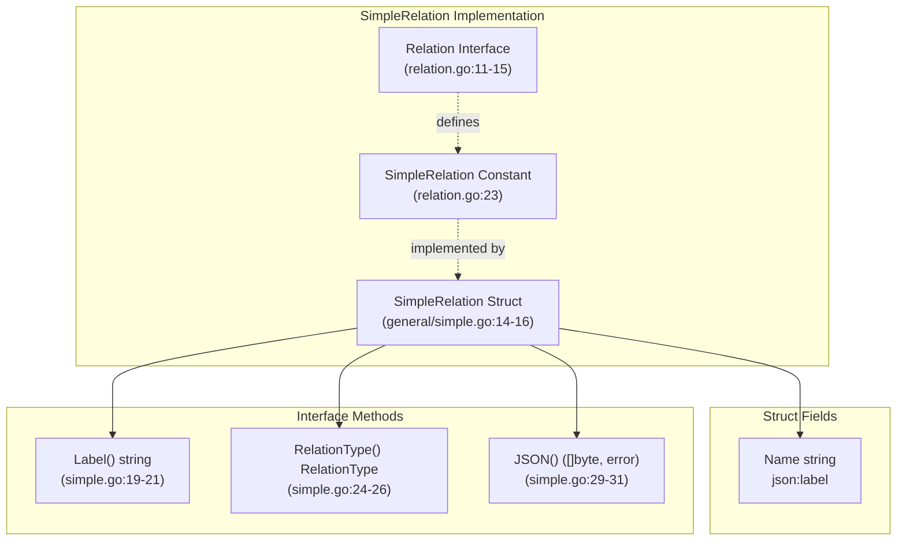
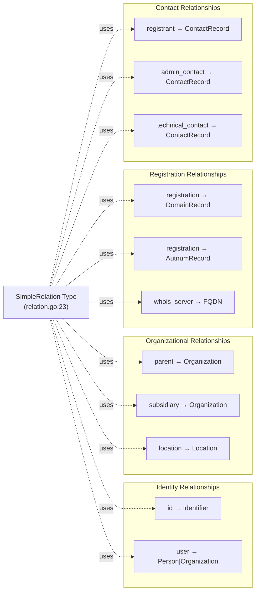
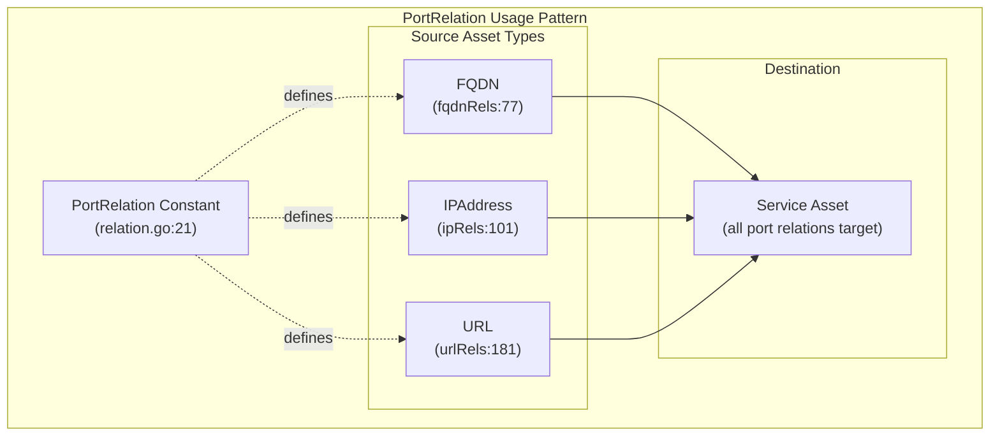
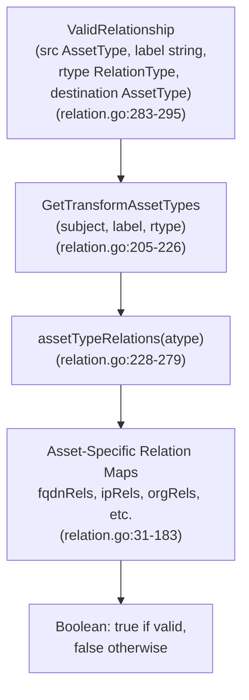
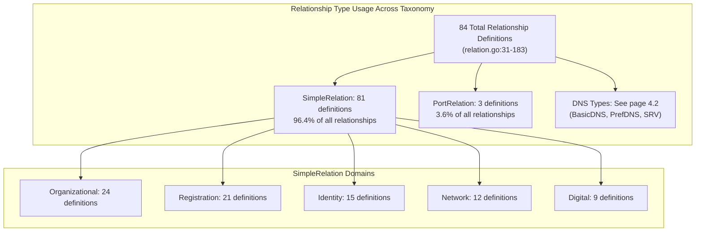
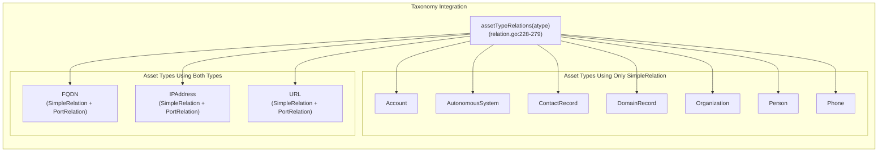

# General Relationship Types

# General Relationship Types

<details>
<summary>Relevant source files</summary>

The following files were used as context for generating this wiki page:

- [general/simple.go](general/simple.go)
- [general/simple_test.go](general/simple_test.go)
- [general/source.go](general/source.go)
- [relation.go](relation.go)

</details>


## Purpose and Scope

This document describes the two general-purpose relationship types in the open-asset-model: `SimpleRelation` and `PortRelation`. These types handle non-DNS connections between assets, representing the majority of relationships in the taxonomy. For DNS-specific relationship types (BasicDNSRelation, PrefDNSRelation, SRVDNSRelation), see [DNS Relationship Types](#4.2). For the overall relationship system architecture and validation functions, see [Relationship Taxonomy](#4.1).

---

## Overview of General Relationship Types

The open-asset-model defines five `RelationType` constants in [relation.go:19-25](). Of these, two are classified as general-purpose types that handle relationships outside the DNS domain:

| RelationType | Purpose | Primary Use Cases |
|------------|---------|-------------------|
| `SimpleRelation` | Generic bidirectional connection with no additional metadata | Organizational hierarchies, ownership, registration records, identifiers |
| `PortRelation` | Network service connection on a specific port | Service endpoints on FQDNs, IP addresses, and URLs |

The remaining three types (`BasicDNSRelation`, `PrefDNSRelation`, `SRVDNSRelation`) are DNS-specific and documented in [DNS Relationship Types](#4.2).

**Sources:** [relation.go:19-25]()

---

## SimpleRelation Type

### Purpose and Structure

`SimpleRelation` is the most commonly used relationship type in the model, representing straightforward connections between assets that require no additional metadata beyond the label. It is implemented in [general/simple.go:14-31]().



**Diagram: SimpleRelation Implementation Architecture**

The `SimpleRelation` struct contains only one field:

| Field | JSON Tag | Type | Purpose |
|-------|----------|------|---------|
| `Name` | `label` | `string` | The relationship label (e.g., "parent", "location", "id") |

**Sources:** [general/simple.go:14-16](), [relation.go:11-15](), [relation.go:23]()

### JSON Serialization Format

When serialized to JSON via the `JSON()` method, a `SimpleRelation` produces minimal output containing only the label:

```json
{
  "label": "parent"
}
```

This compact representation is appropriate since the relationship carries no additional data—all semantic meaning is conveyed by the label and the connected asset types.

**Sources:** [general/simple.go:29-31](), [general/simple_test.go:36-43]()

### Usage Across Asset Types

`SimpleRelation` appears in 18 of the 21 asset type relationship maps defined in [relation.go:31-183](). The following table shows its distribution:

| Asset Type | Number of SimpleRelation Labels | Example Labels |
|------------|--------------------------------|----------------|
| `Organization` | 8 | `id`, `location`, `parent`, `subsidiary`, `website` |
| `TLSCertificate` | 10 | `common_name`, `san_dns_name`, `issuer_contact`, `ocsp_server` |
| `ContactRecord` | 7 | `fqdn`, `person`, `organization`, `location`, `phone` |
| `DomainRecord` | 5 | `name_server`, `whois_server`, `registrar_contact`, `admin_contact` |
| `Service` | 4 | `provider`, `certificate`, `terms_of_service`, `product_used` |
| `Account` | 3 | `id`, `user`, `funds_transfer` |
| `AutonomousSystem` | 2 | `announces`, `registration` |
| `FQDN` | 2 | `node`, `registration` |

The prevalence of `SimpleRelation` in organizational and registration-related asset types reflects its role as the default relationship type for logical connections that don't require specialized semantics.

**Sources:** [relation.go:31-183](), [relation.go:228-279]()

### Common Relationship Labels



**Diagram: Common SimpleRelation Label Patterns**

**Sources:** [relation.go:31-183]()

---

## PortRelation Type

### Purpose and Structure

`PortRelation` represents network service connections on specific TCP/UDP ports. Unlike `SimpleRelation`, it is not separately implemented in its own file—instead, it exists only as a `RelationType` constant in [relation.go:21](). Discovery tools are expected to create relation implementations that return this type when representing port-based connections.



**Diagram: PortRelation Type Definition and Usage**

**Sources:** [relation.go:21](), [relation.go:77](), [relation.go:101](), [relation.go:181]()

### Relationship Taxonomy Integration

`PortRelation` appears in exactly three asset type relationship maps, always with the label `"port"` and always targeting the `Service` asset type:

| Source Asset Type | Label | RelationType | Destination Asset Type | Location in Code |
|------------------|-------|--------------|------------------------|------------------|
| `FQDN` | `port` | `PortRelation` | `Service` | [relation.go:77]() |
| `IPAddress` | `port` | `PortRelation` | `Service` | [relation.go:101]() |
| `URL` | `port` | `PortRelation` | `Service` | [relation.go:181]() |

This exclusive targeting of `Service` assets reflects the semantic purpose: a `PortRelation` models the availability of a network service on a specific network endpoint.

**Sources:** [relation.go:76-85](), [relation.go:100-103](), [relation.go:178-183]()

### Comparison with SimpleRelation

The following table highlights the key differences between the two general relationship types:

| Characteristic | SimpleRelation | PortRelation |
|---------------|----------------|--------------|
| **Implementation** | Concrete struct in [general/simple.go:14-31]() | Constant only, no standard implementation |
| **Number of Uses** | 18+ asset types | 3 asset types (FQDN, IPAddress, URL) |
| **Destination Variety** | 21 different asset types | Only `Service` |
| **Semantic Scope** | Generic logical connections | Network service endpoints only |
| **Expected Metadata** | None beyond label | Port number, protocol (stored in Relation implementation) |
| **Label Variety** | 50+ distinct labels | Always `"port"` |

**Sources:** [general/simple.go:14-31](), [relation.go:19-25](), [relation.go:31-183]()

---

## Validation and Query Functions

Both `SimpleRelation` and `PortRelation` are validated through the same taxonomy system described in [Relationship Taxonomy](#4.1). The three key functions operate identically for general and DNS relationship types:

### ValidRelationship Function



**Diagram: Relationship Validation Flow for General Types**

**Sources:** [relation.go:283-295](), [relation.go:205-226](), [relation.go:228-279]()

### Example Validation Scenarios

| Source | Label | Type | Destination | Valid? | Reason |
|--------|-------|------|-------------|--------|--------|
| `FQDN` | `"port"` | `PortRelation` | `Service` | ✓ | Defined in [relation.go:77]() |
| `Organization` | `"parent"` | `SimpleRelation` | `Organization` | ✓ | Defined in [relation.go:126]() |
| `FQDN` | `"port"` | `SimpleRelation` | `Service` | ✗ | Wrong RelationType (must be PortRelation) |
| `IPAddress` | `"location"` | `SimpleRelation` | `Location` | ✗ | Not defined in ipRels map |
| `URL` | `"port"` | `PortRelation` | `FQDN` | ✗ | PortRelation only targets Service |

**Sources:** [relation.go:76-85](), [relation.go:100-103](), [relation.go:123-133](), [relation.go:178-183]()

---

## Implementation Patterns

### Creating SimpleRelation Instances

Discovery tools create `SimpleRelation` instances by importing the `general` package and initializing the struct:

```go
import "github.com/owasp-amass/open-asset-model/general"

rel := general.SimpleRelation{
    Name: "parent",
}

// Use interface methods
label := rel.Label()                    // Returns "parent"
rtype := rel.RelationType()             // Returns model.SimpleRelation
jsonData, err := rel.JSON()             // Returns {"label":"parent"}
```

**Sources:** [general/simple.go:14-31](), [general/simple_test.go:29-44]()

### Implementing PortRelation

Since `PortRelation` has no standard implementation, discovery tools must create their own struct that implements the `Relation` interface and returns `model.PortRelation` from `RelationType()`:

```go
type PortConnection struct {
    PortNumber uint16
    Protocol   string  // "tcp" or "udp"
}

func (p PortConnection) Label() string {
    return "port"
}

func (p PortConnection) RelationType() model.RelationType {
    return model.PortRelation
}

func (p PortConnection) JSON() ([]byte, error) {
    return json.Marshal(p)
}
```

This flexibility allows different discovery tools to include tool-specific metadata (banner grabbing results, TLS handshake data, etc.) while conforming to the relationship taxonomy.

**Sources:** [relation.go:21](), [relation.go:11-15]()

---

## Relationship Type Distribution Analysis



**Diagram: Distribution of General Relationship Types in Taxonomy**

This analysis demonstrates that `SimpleRelation` is the dominant relationship type, handling over 96% of non-DNS connections in the model. `PortRelation` serves a specialized niche for network service discovery, while DNS relationship types (covered in [DNS Relationship Types](#4.2)) handle the remaining DNS-specific connections.

**Sources:** [relation.go:31-183](), [relation.go:228-279]()

---

## Testing and Validation

The test suite for `SimpleRelation` in [general/simple_test.go:14-44]() demonstrates the testing patterns applicable to all relation implementations:

### Interface Compliance Tests

```go
func TestSimpleRelationImplementsRelation(t *testing.T) {
    var _ model.Relation = SimpleRelation{}       // Value receiver
    var _ model.Relation = (*SimpleRelation)(nil) // Pointer receiver
}
```

These compile-time assertions ensure the struct correctly implements all three interface methods.

**Sources:** [general/simple_test.go:23-26]()

### Method Behavior Tests

| Test Function | Validates | Expected Behavior |
|--------------|-----------|-------------------|
| `TestSimpleRelationName` | `Label()` method | Returns the `Name` field value |
| `TestSimpleRelation` | `RelationType()` method | Returns `model.SimpleRelation` constant |
| `TestSimpleRelation` | `JSON()` method | Produces correct JSON with `"label"` key |

**Sources:** [general/simple_test.go:14-44]()

### JSON Serialization Validation

The test suite uses `require.JSONEq()` to validate serialization output:

```go
jsonData, err := sr.JSON()
require.NoError(t, err)
require.JSONEq(t, `{"label":"anything"}`, string(jsonData))
```

This ensures that the JSON output matches the expected schema exactly, including key names and field presence.

**Sources:** [general/simple_test.go:36-43]()

---

## Integration with Asset Taxonomy

The relationship taxonomy system integrates general relationship types with asset type definitions through the `assetTypeRelations` function at [relation.go:228-279](). This dispatcher returns the appropriate relationship map for each asset type:



**Diagram: Asset Type Categories by Relationship Type Usage**

Assets in the "Both Types" category represent network endpoints where services can be discovered, necessitating both logical connections (`SimpleRelation`) and service port connections (`PortRelation`).

**Sources:** [relation.go:228-279](), [relation.go:76-85](), [relation.go:100-103](), [relation.go:178-183]()