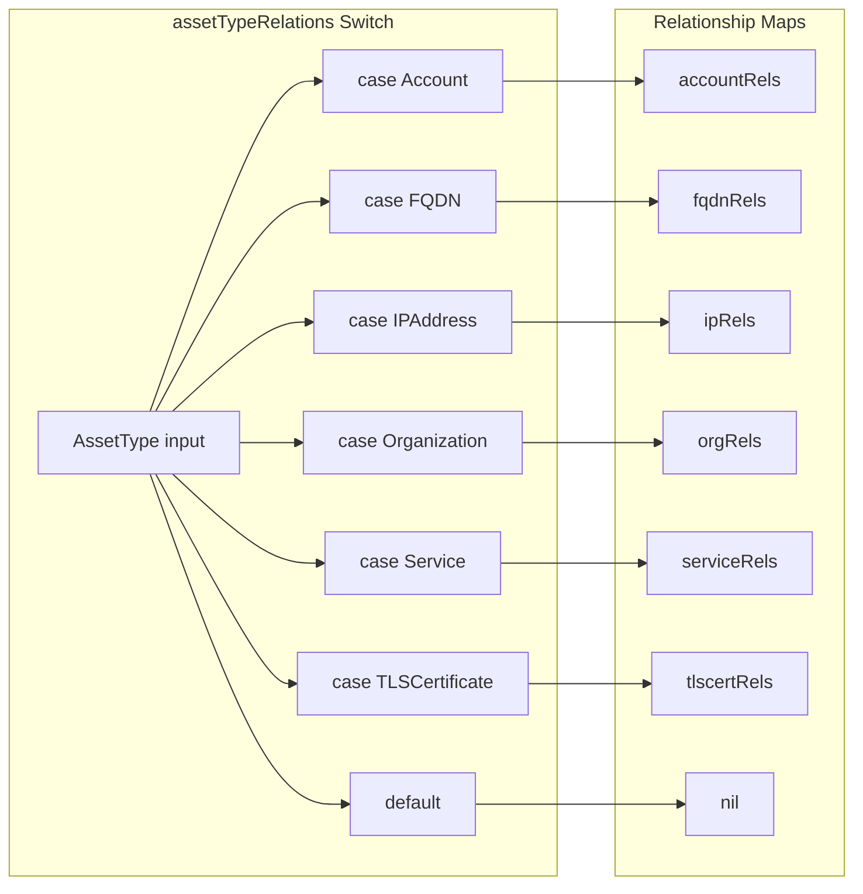
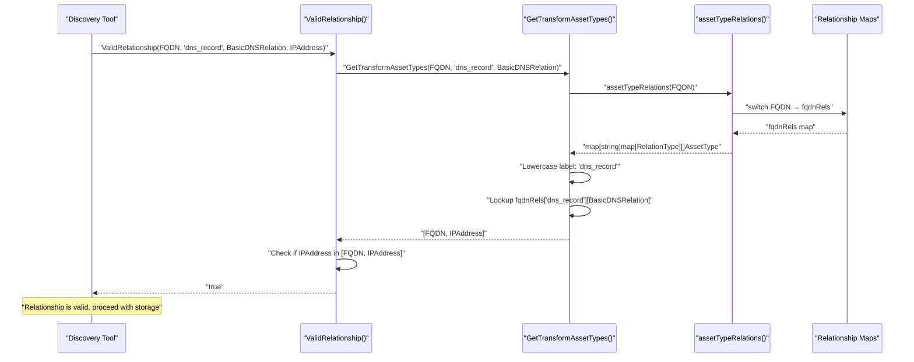

# Relationship System

# Relationship System

<details>
<summary>Relevant source files</summary>

The following files were used as context for generating this wiki page:

- [docs/images/taxonomy.excalidraw.png](docs/images/taxonomy.excalidraw.png)
- [docs/taxonomy.md](docs/taxonomy.md)
- [relation.go](relation.go)

</details>


## Purpose and Scope

The Relationship System defines how assets connect to each other within the Open Asset Model. This system provides a **type-safe, validated taxonomy** that constrains which asset types can connect via which relationship labels and types. The system consists of three components: (1) the `Relation` interface that all relationship implementations must satisfy, (2) a nested map structure defining valid relationship combinations per asset type, and (3) query and validation functions for runtime enforcement.

This page covers the **relationship definition, validation, and query mechanisms**. For details on concrete relationship implementations like DNS records, see [DNS Relationship Types](#4.2) and [General Relationship Types](#4.3). For information on the asset types that relationships connect, see [Asset Types](#3). For the broader three-tier architecture context, see [Core Architecture](#2).

---

## Relation Interface

The `Relation` interface defines the contract that all relationship types must implement. It requires three methods that provide identity, type classification, and serialization:

```go
type Relation interface {
    Label() string
    RelationType() RelationType
    JSON() ([]byte, error)
}
```

**Method Descriptions:**

| Method | Return Type | Purpose |
|--------|-------------|---------|
| `Label()` | `string` | Returns the semantic relationship label (e.g., "dns_record", "port", "certificate") |
| `RelationType()` | `RelationType` | Returns the type constant identifying the concrete implementation |
| `JSON()` | `([]byte, error)` | Serializes the relationship data to JSON format for persistence or transmission |

The `Label()` identifies the semantic nature of the relationship (what it represents), while `RelationType()` identifies the structural implementation (how it's represented). This separation allows multiple `RelationType` implementations to share the same label when they have different data structures—for example, FQDN's "dns_record" label maps to `BasicDNSRelation`, `PrefDNSRelation`, and `SRVDNSRelation` depending on the DNS record type.

**Sources:** [relation.go:11-15]()

---

## RelationType Enumeration

The `RelationType` is a string-based type enumeration defining five distinct relationship implementation types. Each type corresponds to a concrete struct that implements the `Relation` interface with type-specific fields:

| RelationType Constant | Value | Use Case |
|----------------------|-------|----------|
| `BasicDNSRelation` | "BasicDNSRelation" | A, AAAA, CNAME, NS DNS records with destination only |
| `PortRelation` | "PortRelation" | Network port and protocol information (port number + TCP/UDP) |
| `PrefDNSRelation` | "PrefDNSRelation" | MX records with preference/priority value |
| `SimpleRelation` | "SimpleRelation" | Generic directed connection with no additional data |
| `SRVDNSRelation` | "SRVDNSRelation" | SRV records with priority, weight, and port information |

The `RelationList` variable at [relation.go:27-29]() provides an ordered slice of all five types for iteration and validation purposes.

**Sources:** [relation.go:17-29]()

---

## Relationship Taxonomy Architecture

### Overview

The relationship taxonomy uses a **three-level nested map structure** to define valid relationships: `map[string]map[RelationType][]AssetType`. This structure is read as: "for label X using RelationType Y, these AssetType values are valid destinations." This design enables fine-grained control where the same label can map to different destination types depending on the RelationType used.

```mermaid
graph TB
    subgraph "Taxonomy Structure"
        Level1["Asset Type<br/>(e.g., FQDN)"]
        Level2["Label<br/>(e.g., 'dns_record')"]
        Level3["RelationType<br/>(e.g., BasicDNSRelation)"]
        Level4["[]AssetType<br/>(e.g., [FQDN, IPAddress])"]
    end
    
    Level1 -->|"key: string"| Level2
    Level2 -->|"key: RelationType"| Level3
    Level3 -->|"value: slice"| Level4
    
    subgraph "Example Lookup"
        FQDN["FQDN Asset"]
        dnsLabel["'dns_record' label"]
        BasicType["BasicDNSRelation type"]
        Destinations["Valid: FQDN, IPAddress"]
    end
    
    FQDN --> dnsLabel
    dnsLabel --> BasicType
    BasicType --> Destinations
    
    subgraph "Query Functions"
        assetTypeRelations["assetTypeRelations(AssetType)"]
        GetOutgoing["GetAssetOutgoingRelations(AssetType)"]
        GetTransform["GetTransformAssetTypes(AssetType, label, RelationType)"]
        ValidRel["ValidRelationship(src, label, type, dest)"]
    end
    
    assetTypeRelations -->|"returns nested map"| GetOutgoing
    assetTypeRelations -->|"returns nested map"| GetTransform
    GetTransform -->|"queries"| ValidRel
```



**Sources:** [relation.go:31-184](), [relation.go:228-279]()

---

### Central Dispatcher Function

The `assetTypeRelations(atype AssetType)` function at [relation.go:228-279]() serves as the **central dispatcher** that routes each asset type to its corresponding relationship map. It uses a switch statement to match against all 21 asset types and returns the appropriate nested map or `nil` for invalid types.

**Function Signature:**
```go
func assetTypeRelations(atype AssetType) map[string]map[RelationType][]AssetType
```

The switch statement maps each asset type constant to its relationship definition variable:



The function returns `nil` for unrecognized asset types, which all calling functions check to handle gracefully.

**Sources:** [relation.go:228-279]()

---

### Asset-Specific Relationship Maps

Each asset type has a dedicated relationship map variable defining its outgoing relationships. The maps follow the naming convention `<assetType>Rels` and are defined at the package level. Below is a comprehensive table of all relationship maps:

| Asset Type | Variable Name | Location | Label Count |
|------------|---------------|----------|-------------|
| Account | `accountRels` | [relation.go:31-35]() | 3 |
| AutnumRecord | `autnumRecordRels` | [relation.go:37-44]() | 6 |
| AutonomousSystem | `autonomousSystemRels` | [relation.go:46-49]() | 2 |
| ContactRecord | `contactRecordRels` | [relation.go:51-59]() | 7 |
| DomainRecord | `domainRecordRels` | [relation.go:61-69]() | 7 |
| File | `fileRels` | [relation.go:71-74]() | 2 |
| FQDN | `fqdnRels` | [relation.go:76-85]() | 4 |
| FundsTransfer | `fundsTransferRels` | [relation.go:87-92]() | 4 |
| Identifier | `identifierRels` | [relation.go:94-98]() | 3 |
| IPAddress | `ipRels` | [relation.go:100-103]() | 2 |
| IPNetRecord | `ipnetRecordRels` | [relation.go:105-112]() | 6 |
| Location | `locationRels` | [relation.go:114-116]() | 1 |
| Netblock | `netblockRels` | [relation.go:118-121]() | 2 |
| Organization | `orgRels` | [relation.go:123-133]() | 9 |
| Person | `personRels` | [relation.go:135-139]() | 3 |
| Phone | `phoneRels` | [relation.go:141-144]() | 2 |
| Product | `productRels` | [relation.go:146-151]() | 4 |
| ProductRelease | `productReleaseRels` | [relation.go:153-156]() | 2 |
| Service | `serviceRels` | [relation.go:158-163]() | 4 |
| TLSCertificate | `tlscertRels` | [relation.go:165-176]() | 10 |
| URL | `urlRels` | [relation.go:178-183]() | 4 |

**Example: FQDN Relationships**

The `fqdnRels` map at [relation.go:76-85]() demonstrates the multi-type pattern:

```go
var fqdnRels = map[string]map[RelationType][]AssetType{
    "port": {PortRelation: {Service}},
    "dns_record": {
        BasicDNSRelation: {FQDN, IPAddress},
        PrefDNSRelation:  {FQDN},
        SRVDNSRelation:   {FQDN},
    },
    "node":         {SimpleRelation: {FQDN}},
    "registration": {SimpleRelation: {DomainRecord}},
}
```

This structure indicates:
- **"port"** label with `PortRelation` → connects to `Service` assets
- **"dns_record"** label has three implementations:
  - `BasicDNSRelation` → connects to `FQDN` or `IPAddress` (A, AAAA, CNAME, NS records)
  - `PrefDNSRelation` → connects to `FQDN` only (MX records)
  - `SRVDNSRelation` → connects to `FQDN` only (SRV records)
- **"node"** label with `SimpleRelation` → connects to other `FQDN` assets (subdomain relationships)
- **"registration"** label with `SimpleRelation` → connects to `DomainRecord` (WHOIS data)

**Sources:** [relation.go:31-183]()

---

## Query Functions

The system provides three public query functions for discovering and validating relationships. These functions all internally call `assetTypeRelations()` to retrieve the appropriate relationship map.

### GetAssetOutgoingRelations

**Function Signature:**
```go
func GetAssetOutgoingRelations(subject AssetType) []string
```

**Purpose:** Returns all valid relationship labels that can originate from the specified asset type, regardless of RelationType or destination. Returns `nil` for invalid asset types.

**Algorithm:**
1. Call `assetTypeRelations(subject)` to get the nested map
2. Return `nil` if the map is `nil` (invalid asset type)
3. Extract all first-level map keys (labels) into a string slice

**Example Usage:**
```go
labels := GetAssetOutgoingRelations(FQDN)
// Returns: ["port", "dns_record", "node", "registration"]
```

**Sources:** [relation.go:185-199]()

---

### GetTransformAssetTypes

**Function Signature:**
```go
func GetTransformAssetTypes(subject AssetType, label string, rtype RelationType) []AssetType
```

**Purpose:** Returns the asset types that are valid destinations when connecting from `subject` via the specified `label` and `rtype`. The label parameter is normalized to lowercase. Returns `nil` for invalid combinations.

**Algorithm:**
1. Call `assetTypeRelations(subject)` to get the nested map
2. Return `nil` if the map is `nil`
3. Lowercase the label parameter
4. Lookup `relations[label][rtype]` to get the `[]AssetType` slice
5. Use a map for deduplication as multiple entries may exist
6. Return deduplicated asset type slice

**Example Usage:**
```go
types := GetTransformAssetTypes(FQDN, "dns_record", BasicDNSRelation)
// Returns: [FQDN, IPAddress]

types := GetTransformAssetTypes(FQDN, "dns_record", PrefDNSRelation)
// Returns: [FQDN]
```

**Sources:** [relation.go:201-226]()

---

### ValidRelationship

**Function Signature:**
```go
func ValidRelationship(src AssetType, label string, rtype RelationType, destination AssetType) bool
```

**Purpose:** Validates whether a specific relationship quadruple (source type, label, relation type, destination type) is permitted in the taxonomy. Returns `false` for invalid combinations.

**Algorithm:**
1. Call `GetTransformAssetTypes(src, label, rtype)` to get allowed destinations
2. Return `false` if the result is `nil`
3. Iterate through the returned asset types
4. Return `true` if `destination` matches any allowed type
5. Return `false` if no match found

**Example Usage:**
```go
valid := ValidRelationship(FQDN, "dns_record", BasicDNSRelation, IPAddress)
// Returns: true

valid := ValidRelationship(FQDN, "dns_record", PrefDNSRelation, IPAddress)
// Returns: false (MX records point to FQDNs, not IPs)
```

This function serves as the **primary validation gate** for relationship creation in data ingestion pipelines.

**Sources:** [relation.go:281-295]()

---

## Relationship Validation Flow

The following sequence diagram illustrates how a discovery tool or data pipeline uses the relationship system to validate connections before storage:



**Validation Rejection Example:**

If a client attempts to create an invalid relationship (e.g., connecting an `Organization` to an `IPAddress` via a "location" label), the validation flow would return `false`:

```go
valid := ValidRelationship(Organization, "location", SimpleRelation, IPAddress)
// Returns: false (Organization's "location" only connects to Location assets)
```

The `orgRels` map at [relation.go:123-133]() defines `"location": {SimpleRelation: {Location}}`, which does not include `IPAddress`.

**Sources:** [relation.go:228-295]()

---

## Relationship Map Patterns

### Pattern 1: Single Destination Type

Many relationships connect to exactly one destination type using `SimpleRelation`:

```go
var locationRels = map[string]map[RelationType][]AssetType{
    "id": {SimpleRelation: {Identifier}},
}
```

**Sources:** [relation.go:114-116]()

---

### Pattern 2: Multiple Destination Types (Union)

Some relationships can connect to multiple destination types via the same RelationType:

```go
var contactRecordRels = map[string]map[RelationType][]AssetType{
    "fqdn":         {SimpleRelation: {FQDN}},
    "id":           {SimpleRelation: {Identifier}},
    "person":       {SimpleRelation: {Person}},
    "organization": {SimpleRelation: {Organization}},
    "location":     {SimpleRelation: {Location}},
    "phone":        {SimpleRelation: {Phone}},
    "url":          {SimpleRelation: {URL}},
}
```

This allows a `ContactRecord` (from WHOIS/RDAP data) to connect to various entity types representing the contact information.

**Sources:** [relation.go:51-59]()

---

### Pattern 3: Multiple RelationTypes (Polymorphic Label)

The most sophisticated pattern uses the same label with different RelationTypes to handle structural variations:

```go
var fqdnRels = map[string]map[RelationType][]AssetType{
    "dns_record": {
        BasicDNSRelation: {FQDN, IPAddress},
        PrefDNSRelation:  {FQDN},
        SRVDNSRelation:   {FQDN},
    },
}
```

The "dns_record" label accommodates three different DNS record structures, each with specific fields (preference value for MX, priority/weight/port for SRV).

**Sources:** [relation.go:76-85]()

---

### Pattern 4: Port-Based Connections

Network assets and URLs use `PortRelation` to represent TCP/UDP service connections:

```go
var ipRels = map[string]map[RelationType][]AssetType{
    "port":       {PortRelation: {Service}},
    "ptr_record": {SimpleRelation: {FQDN}},
}
```

The `PortRelation` type includes port number and protocol fields that `SimpleRelation` lacks.

**Sources:** [relation.go:100-103]()

---

## Notable Relationship Characteristics

### TLS Certificate Relationships

`TLSCertificate` has the most complex relationship map with 10 distinct labels, reflecting the rich data in X.509 certificates:

```go
var tlscertRels = map[string]map[RelationType][]AssetType{
    "common_name":             {SimpleRelation: {FQDN}},
    "subject_contact":         {SimpleRelation: {ContactRecord}},
    "issuer_contact":          {SimpleRelation: {ContactRecord}},
    "san_dns_name":            {SimpleRelation: {FQDN}},
    "san_email_address":       {SimpleRelation: {Identifier}},
    "san_ip_address":          {SimpleRelation: {IPAddress}},
    "san_url":                 {SimpleRelation: {URL}},
    "issuing_certificate":     {SimpleRelation: {TLSCertificate}},
    "issuing_certificate_url": {SimpleRelation: {URL}},
    "ocsp_server":             {SimpleRelation: {URL}},
}
```

This enables complete representation of certificate chains, SAN entries, and OCSP infrastructure.

**Sources:** [relation.go:165-176]()

---

### Registration Record Patterns

The three registration record types (`AutnumRecord`, `DomainRecord`, `IPNetRecord`) share a common structure for WHOIS/RDAP contact information:

| Label | Destination | Purpose |
|-------|-------------|---------|
| `whois_server` | FQDN | WHOIS server hostname |
| `registrant` | ContactRecord | Registrant contact info |
| `admin_contact` | ContactRecord | Administrative contact |
| `abuse_contact` | ContactRecord | Abuse contact |
| `technical_contact` | ContactRecord | Technical contact |
| `rdap_url` | URL | RDAP service endpoint |

**Sources:** [relation.go:37-44](), [relation.go:61-69](), [relation.go:105-112]()

---

### Organizational Hierarchy

`Organization` assets support multi-level corporate structures:

```go
var orgRels = map[string]map[RelationType][]AssetType{
    "parent":               {SimpleRelation: {Organization}},
    "subsidiary":           {SimpleRelation: {Organization}},
    "sister":               {SimpleRelation: {Organization}},
    // ... other relationships
}
```

This allows modeling of parent companies, subsidiaries, and sister organizations in corporate hierarchies.

**Sources:** [relation.go:123-133]()

---

## Integration with Concrete Implementations

The relationship types defined in this taxonomy system are implemented by concrete structs in other packages:

| RelationType | Implementation Package | See Wiki Page |
|--------------|------------------------|---------------|
| `BasicDNSRelation` | `dns/` | [DNS Relationship Types](#4.2) |
| `PrefDNSRelation` | `dns/` | [DNS Relationship Types](#4.2) |
| `SRVDNSRelation` | `dns/` | [DNS Relationship Types](#4.2) |
| `SimpleRelation` | `general/` | [General Relationship Types](#4.3) |
| `PortRelation` | `general/` | [General Relationship Types](#4.3) |

These implementations provide the `Label()`, `RelationType()`, and `JSON()` methods required by the `Relation` interface, along with type-specific fields (e.g., `Preference` for MX records, `Port` and `Protocol` for port relationships).

**Sources:** [relation.go:19-25]()

---

## Summary Table: All Asset Type Relationships

The following table provides a complete reference of relationship counts per asset type:

| Asset Type | Total Labels | Key Relationships | Primary Patterns |
|------------|--------------|-------------------|------------------|
| Account | 3 | id, user, funds_transfer | Identity and financial links |
| AutnumRecord | 6 | whois_server, contacts, rdap_url | WHOIS/RDAP contacts |
| AutonomousSystem | 2 | announces, registration | Network infrastructure |
| ContactRecord | 7 | fqdn, person, organization, location | Universal contact info |
| DomainRecord | 7 | name_server, contacts | Domain registration data |
| File | 2 | url, contains | Document discovery |
| FQDN | 4 | port, dns_record, node, registration | **Multi-type dns_record** |
| FundsTransfer | 4 | id, sender, recipient, third_party | Financial transactions |
| Identifier | 3 | registration_agency, issuing_authority | Identifier provenance |
| IPAddress | 2 | port, ptr_record | Network services |
| IPNetRecord | 6 | whois_server, contacts, rdap_url | IP block registration |
| Location | 1 | id | Geographic identifiers |
| Netblock | 2 | contains, registration | IP address containment |
| Organization | 9 | id, location, hierarchy, website | **Most complex structure** |
| Person | 3 | id, address, phone | Personal information |
| Phone | 2 | account, contact | Phone associations |
| Product | 4 | id, manufacturer, website, release | Product tracking |
| ProductRelease | 2 | id, website | Version tracking |
| Service | 4 | provider, certificate, terms, product | Service infrastructure |
| TLSCertificate | 10 | common_name, SANs, issuer, ocsp | **Most relationship types** |
| URL | 4 | domain, ip_address, port, file | Web resource references |

**Sources:** [relation.go:31-183]()