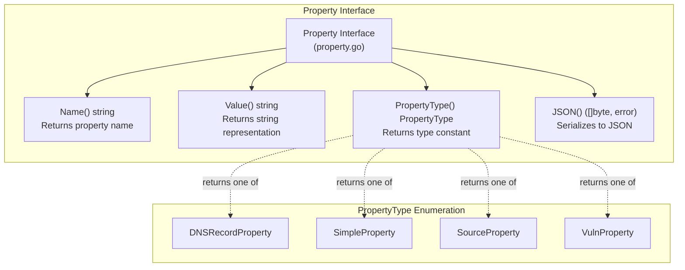
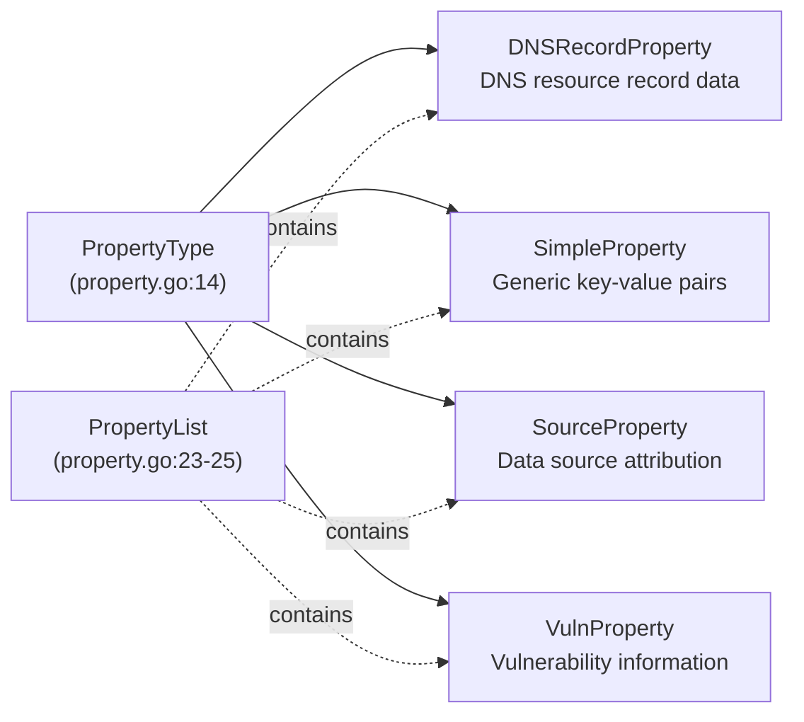
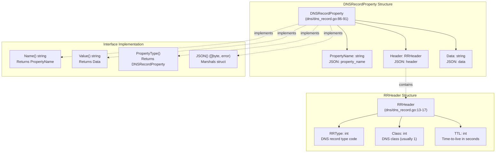
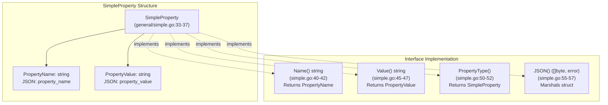
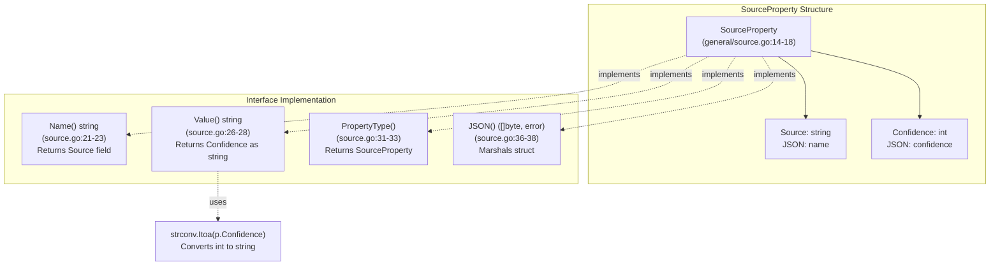
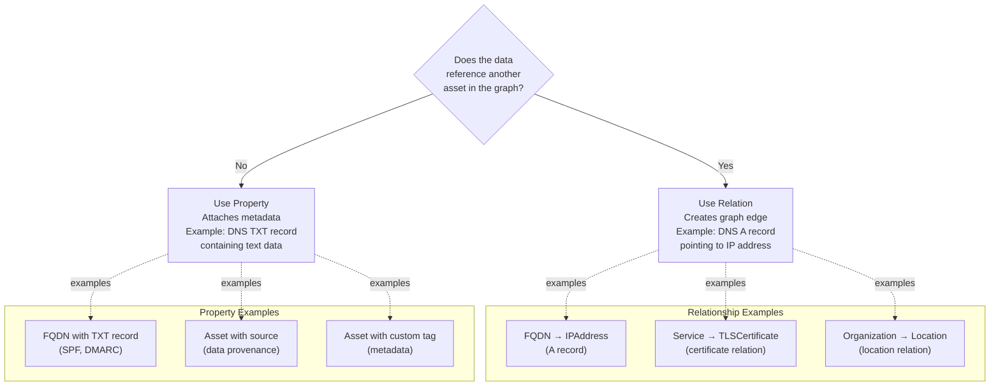
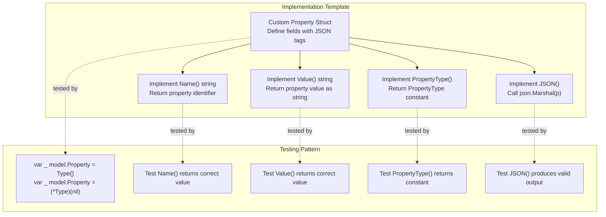
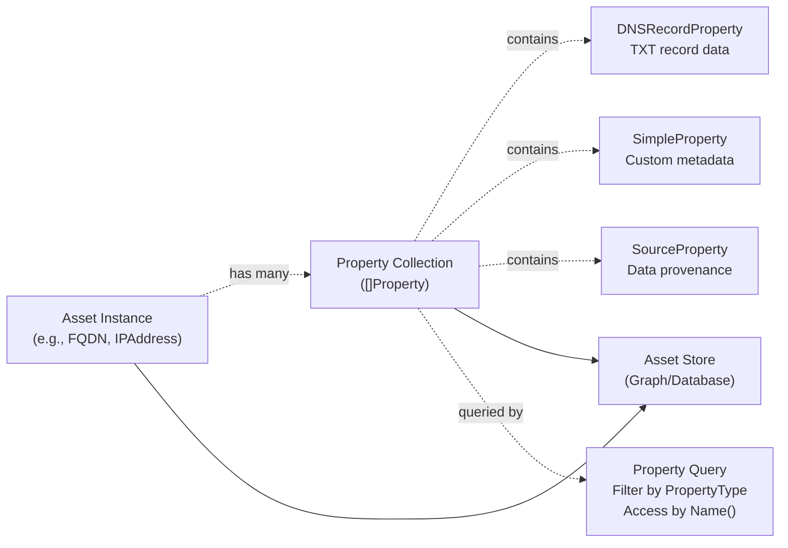

# Property System

# Property System

Relevant source files

The following files were used as context for generating this wiki page:

- [dns/dns_record.go](dns/dns_record.go)
- [dns/dns_record_test.go](dns/dns_record_test.go)
- [general/simple.go](general/simple.go)
- [general/simple_test.go](general/simple_test.go)
- [general/source.go](general/source.go)
- [property.go](property.go)

## Purpose and Scope

The Property System provides a mechanism for attaching metadata to assets without establishing relationships between them. Properties represent attributes, characteristics, or contextual information about a single asset—such as DNS record details, data source attribution, or arbitrary key-value pairs—that do not reference other assets in the graph.

For information about how assets connect to other assets, see [Relationship System](#4). For the broader context of how properties fit into the three-tier architecture, see [Core Architecture](#2).

---

## Property Interface

The Property interface defines the contract that all property implementations must satisfy. It consists of four methods that enable uniform handling of diverse property types across the system.

**Sources:** [property.go:7-12]()

### Method Specifications

| Method | Return Type | Purpose |
|--------|-------------|---------|
| `Name()` | `string` | Returns the property name/identifier |
| `Value()` | `string` | Returns the property value as a string |
| `PropertyType()` | `PropertyType` | Returns the property type constant for type discrimination |
| `JSON()` | `([]byte, error)` | Serializes the property to JSON format |

The `Name()` and `Value()` methods provide a key-value abstraction over all property types, enabling generic property handling without type assertions. The `PropertyType()` method enables runtime type discrimination when specific property type behavior is required.

**Sources:** [property.go:7-12]()

---

## PropertyType Enumeration

The `PropertyType` is a string-based enumeration defining four distinct property categories. This type system enables compile-time type safety while maintaining JSON serialization compatibility.

**Sources:** [property.go:14-25]()

### PropertyType Constants

| Constant | String Value | Purpose |
|----------|--------------|---------|
| `DNSRecordProperty` | `"DNSRecordProperty"` | DNS records that don't reference other assets (e.g., TXT, SPF) |
| `SimpleProperty` | `"SimpleProperty"` | Generic key-value properties |
| `SourceProperty` | `"SourceProperty"` | Data source metadata with confidence scores |
| `VulnProperty` | `"VulnProperty"` | Vulnerability or security information |

The `PropertyList` variable ([property.go:23-25]()) provides an iterable slice of all defined property types, useful for validation and enumeration operations.

**Sources:** [property.go:14-25]()

---

## Concrete Property Implementations

### DNSRecordProperty

`DNSRecordProperty` represents DNS resource records that contain data but do not reference another asset in the graph. This is the distinction from DNS relationships: if a DNS record points to an IP address or another FQDN, it becomes a relationship; if it contains arbitrary text data (like TXT, SPF, or DMARC records), it becomes a property.

**Sources:** [dns/dns_record.go:13-17](), [dns/dns_record.go:86-111]()

#### Field Structure

- **PropertyName** (`string`): The property identifier, typically describing the DNS record type or purpose
- **Header** (`RRHeader`): DNS resource record header containing:
  - `RRType` (`int`): DNS record type code (e.g., 16 for TXT records)
  - `Class` (`int`): DNS class, typically 1 for Internet class
  - `TTL` (`int`): Time-to-live value in seconds
- **Data** (`string`): The record's data content

#### Implementation Details

The `Name()` method returns the `PropertyName` field ([dns/dns_record.go:94-96]()), while `Value()` returns the `Data` field ([dns/dns_record.go:99-101]()). The `PropertyType()` method returns the constant `model.DNSRecordProperty` ([dns/dns_record.go:104-106]()).

**Sources:** [dns/dns_record.go:86-111](), [dns/dns_record_test.go:173-230]()

---

### SimpleProperty

`SimpleProperty` represents a generic key-value property with no specialized structure. It serves as the default property type for arbitrary metadata that doesn't fit other specialized categories.

**Sources:** [general/simple.go:33-57]()

#### Field Structure

| Field | Type | JSON Tag | Purpose |
|-------|------|----------|---------|
| `PropertyName` | `string` | `property_name` | The property identifier/key |
| `PropertyValue` | `string` | `property_value` | The property value |

#### Usage Pattern

`SimpleProperty` is designed for straightforward key-value metadata attachment. Example use cases include:
- Asset tags or labels
- Configuration parameters
- Custom metadata fields
- Arbitrary annotations

The simplicity of this type makes it the most flexible property implementation, suitable for any metadata that doesn't require specialized structure or validation.

**Sources:** [general/simple.go:33-57](), [general/simple_test.go:46-98]()

---

### SourceProperty

`SourceProperty` represents data source attribution with a confidence score. This property type is critical for data provenance tracking in systems that aggregate information from multiple sources.

**Sources:** [general/source.go:14-38]()

#### Field Structure

| Field | Type | JSON Tag | Purpose |
|-------|------|----------|---------|
| `Source` | `string` | `name` | The data source identifier (e.g., "owasp-amass", "censys", "shodan") |
| `Confidence` | `int` | `confidence` | Confidence score for the data from this source |

#### Implementation Details

The `Name()` method returns the `Source` field, treating the source identifier as the property name ([general/source.go:21-23]()). The `Value()` method converts the `Confidence` integer to a string using `strconv.Itoa()` ([general/source.go:26-28]()), maintaining the interface contract that `Value()` returns a string.

This type is particularly useful in multi-source asset discovery pipelines where data provenance and reliability scoring are essential.

**Sources:** [general/source.go:14-38]()

---

### VulnProperty

`VulnProperty` is defined in the `PropertyType` enumeration ([property.go:20]()) but has no concrete implementation in the provided codebase. This property type is reserved for future vulnerability or security information attachment to assets.

**Sources:** [property.go:20]()

---

## Property vs. Relationship Distinction

Understanding when to use a property versus a relationship is fundamental to correct model usage:

### Decision Criteria

| Criterion | Use Relationship | Use Property |
|-----------|------------------|--------------|
| References another asset? | Yes | No |
| Creates graph traversal path? | Yes | No |
| Represents edge data? | Yes | No |
| Represents node metadata? | No | Yes |
| Example: DNS A record | `BasicDNSRelation` | N/A |
| Example: DNS TXT record | N/A | `DNSRecordProperty` |
| Example: Data source info | N/A | `SourceProperty` |

**Sources:** [property.go:1-26](), [dns/dns_record.go:86-111]()

---

## Implementation Pattern

All property implementations follow a consistent pattern to satisfy the `Property` interface:

**Sources:** [dns/dns_record.go:86-111](), [general/simple.go:33-57](), [general/source.go:14-38]()

### Implementation Checklist

1. **Define struct** with appropriate fields and JSON tags
2. **Implement `Name()`**: Return the property's identifying name
3. **Implement `Value()`**: Return the property's value (convert to string if necessary)
4. **Implement `PropertyType()`**: Return the appropriate `PropertyType` constant
5. **Implement `JSON()`**: Typically `return json.Marshal(p)`
6. **Add compile-time checks**: Use `var _ model.Property = Type{}` pattern
7. **Add unit tests**: Verify each interface method and JSON serialization

### JSON Serialization Conventions

All property implementations use standard Go JSON marshaling with lowercase, snake_case field names:

| Implementation | Name Field | Value Field(s) |
|----------------|------------|----------------|
| `DNSRecordProperty` | `property_name` | `data`, `header` |
| `SimpleProperty` | `property_name` | `property_value` |
| `SourceProperty` | `name` | `confidence` |

**Sources:** [dns/dns_record_test.go:214-229](), [general/simple_test.go:87-97]()

---

## Testing Strategy

The test suite for property implementations follows a comprehensive pattern ensuring interface compliance and correct behavior:

```mermaid
graph TB
    subgraph "Test Coverage"
        InterfaceTests["Interface Compliance Tests<br/>(dns/dns_record_test.go:197-200)"]
        MethodTests["Method Behavior Tests<br/>(dns/dns_record_test.go:173-195)"]
        SerializationTests["JSON Serialization Tests<br/>(dns/dns_record_test.go:202-230)"]
        CreationTests["Struct Creation Tests<br/>(general/simple_test.go:75-85)"]
    end
    
    InterfaceTests --> CompileTime["Compile-time type checks<br/>var _ model.Property = Type{}"]
    InterfaceTests --> PointerCheck["Pointer receiver check<br/>var _ model.Property = (*Type)(nil)"]
    
    MethodTests --> NameTest["Name() returns correct string"]
    MethodTests --> ValueTest["Value() returns correct string"]
    MethodTests --> TypeTest["PropertyType() returns constant"]
    
    SerializationTests --> JSONValid["JSON output is valid"]
    SerializationTests --> FieldCheck["Fields serialize correctly"]
    SerializationTests --> TagCheck["JSON tags match specification"]
    
    CreationTests --> FieldAssign["Fields assigned correctly"]
    CreationTests --> TypeReturn["PropertyType() returns correctly"]
```

**Sources:** [dns/dns_record_test.go:173-230](), [general/simple_test.go:46-98]()

### Test Pattern Example

Each property implementation includes:

1. **Interface compliance test** ([dns/dns_record_test.go:197-200]()):
   - Verifies value receiver implementation
   - Verifies pointer receiver implementation

2. **Method tests** ([dns/dns_record_test.go:173-195]()):
   - `Name()` returns expected value
   - `Value()` returns expected value

3. **Creation and serialization test** ([dns/dns_record_test.go:202-230]()):
   - Struct fields set correctly
   - `PropertyType()` returns correct constant
   - `JSON()` produces valid, expected output

**Sources:** [dns/dns_record_test.go:173-230](), [general/simple_test.go:46-98]()

---

## System Integration

Properties integrate with the broader asset model through attachment to asset instances. While the property interface itself is defined in the core package, property instances are created and managed by systems consuming the model (such as OWASP Amass).

Properties are serialized alongside their associated assets through the `JSON()` method, enabling transport and storage in external systems. The uniform `Property` interface allows generic property handling without type-specific code.

**Sources:** [property.go:7-12]()