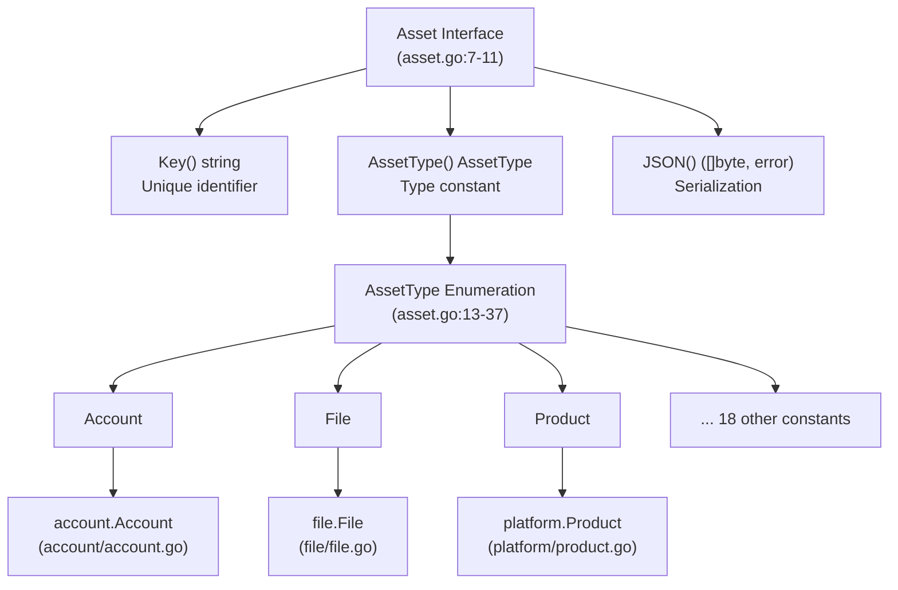
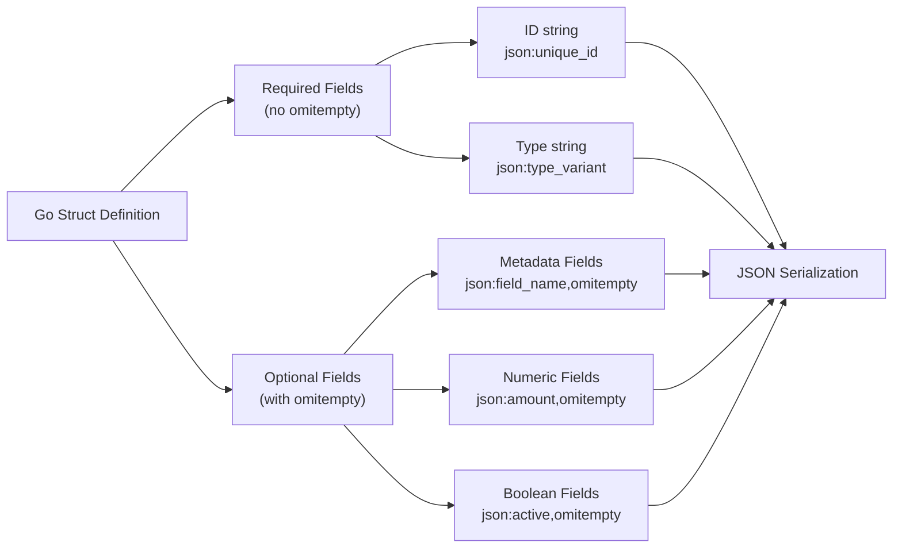
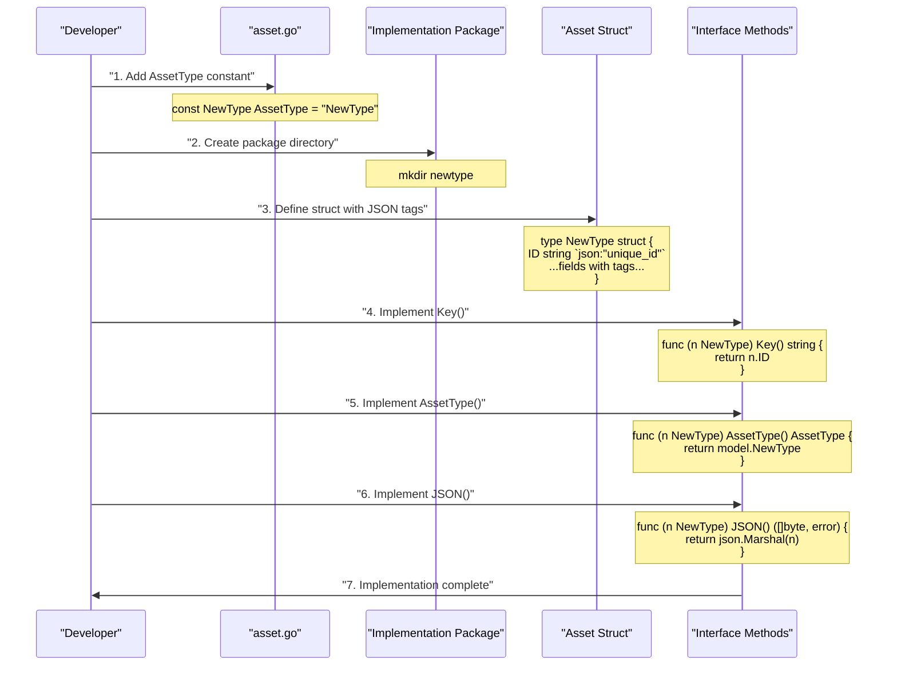

# Implementing Asset Types

# Implementing Asset Types

<details>
<summary>Relevant source files</summary>

The following files were used as context for generating this wiki page:

- [account/account.go](account/account.go)
- [account/account_test.go](account/account_test.go)
- [asset.go](asset.go)
- [file/file.go](file/file.go)
- [file/file_test.go](file/file_test.go)
- [financial/funds_transfer.go](financial/funds_transfer.go)
- [financial/funds_transfer_test.go](financial/funds_transfer_test.go)
- [platform/product.go](platform/product.go)
- [platform/product_test.go](platform/product_test.go)

</details>


## Purpose and Scope

This guide provides a step-by-step walkthrough for implementing new asset types in the open-asset-model. It covers struct definition, JSON tag conventions, interface method implementation, and field naming patterns. Examples are drawn from existing implementations including `File`, `Account`, `Product`, and `ProductRelease`.

For information about the Asset interface itself and the 21 predefined asset type constants, see [Asset Interface](#2.1). For testing patterns and validation strategies, see [Testing Asset Implementations](#6.2). For documentation of specific asset type domains, see sections [3.1](#3.1) through [3.7](#3.7).

---

## Asset Interface Requirements

All asset types must implement the `Asset` interface defined in [asset.go:7-11](). This interface specifies three required methods:

| Method | Return Type | Purpose |
|--------|-------------|---------|
| `Key()` | `string` | Returns a unique identifier for the asset instance |
| `AssetType()` | `AssetType` | Returns the asset type constant from the enumeration |
| `JSON()` | `([]byte, error)` | Serializes the asset to JSON format |

The `AssetType` enumeration defines 21 constants ([asset.go:15-37]()) that must be returned by the `AssetType()` method. New asset types must first add their constant to this enumeration before implementation.



**Sources:** [asset.go:7-44](), [account/account.go:1-41](), [file/file.go:1-34](), [platform/product.go:1-75]()

---

## Struct Definition Pattern

### Basic Structure

Asset types are implemented as Go structs with exported fields and JSON struct tags. The general pattern follows this template:

```go
type AssetName struct {
    // Required fields (no omitempty)
    RequiredField string `json:"field_name"`
    
    // Optional fields (with omitempty)
    OptionalField string `json:"optional_field,omitempty"`
    NumericField  int    `json:"numeric_field,omitempty"`
    BooleanField  bool   `json:"boolean_field,omitempty"`
}
```

### Field Naming Conventions

The codebase follows consistent conventions for field naming:

| Pattern | Go Field Name | JSON Tag | Example |
|---------|---------------|----------|---------|
| Unique identifier | `ID` | `unique_id` | [account/account.go:19]() |
| Primary name | `Name` | `name` or `[type]_name` | [file/file.go:16](), [platform/product.go:20]() |
| Type classification | `Type` | `type` or `[domain]_type` | [file/file.go:17](), [account/account.go:20]() |
| Descriptive text | `Description` | `description` | [platform/product.go:23]() |
| Optional metadata | Various | Always includes `,omitempty` | [account/account.go:21-24]() |

### JSON Tag Patterns

Three distinct JSON tag patterns appear across implementations:

**Pattern 1: Snake Case with Descriptive Prefix**
```go
Name     string `json:"product_name"`        // platform/product.go:20
Type     string `json:"account_type"`        // account/account.go:20
Number   string `json:"account_number,omitempty"`  // account/account.go:22
```

**Pattern 2: Simple Snake Case**
```go
URL  string `json:"url"`              // file/file.go:15
Name string `json:"name,omitempty"`   // file/file.go:16
Type string `json:"type,omitempty"`   // file/file.go:17
```

**Pattern 3: Standardized Common Fields**
```go
ID string `json:"unique_id"`  // Appears in Account, Product, FundsTransfer
```



**Sources:** [account/account.go:18-25](), [file/file.go:14-18](), [platform/product.go:18-25](), [financial/funds_transfer.go:18-26]()

---

## Implementing Interface Methods

### Key() Method

The `Key()` method returns a unique identifier for the asset instance. The implementation pattern varies by asset type semantic:

**Pattern 1: Explicit ID Field**

Used when assets have system-assigned unique identifiers:

```go
// account/account.go:28-30
func (a Account) Key() string {
    return a.ID
}
```

**Pattern 2: Semantic Identifier**

Used when the asset's natural identifier is its primary value:

```go
// file/file.go:21-23
func (f File) Key() string {
    return f.URL
}
```

| Asset Type | Key Field | Rationale |
|------------|-----------|-----------|
| `Account` | `ID` | System-assigned unique identifier |
| `FundsTransfer` | `ID` | Transaction reference number |
| `Product` | `ID` | Product catalog identifier |
| `ProductRelease` | `Name` | Release version is naturally unique |
| `File` | `URL` | URL is the canonical file locator |

**Sources:** [account/account.go:28-30](), [file/file.go:21-23](), [platform/product.go:28-30,62-64](), [financial/funds_transfer.go:29-31]()

### AssetType() Method

The `AssetType()` method returns the corresponding constant from the `AssetType` enumeration. This method is identical across all implementations, simply returning the appropriate constant:

```go
// account/account.go:33-35
func (a Account) AssetType() model.AssetType {
    return model.Account
}

// file/file.go:26-28
func (f File) AssetType() model.AssetType {
    return model.File
}

// platform/product.go:33-35
func (p Product) AssetType() model.AssetType {
    return model.Product
}
```

The constant returned must match one of the 21 predefined values in [asset.go:15-37]().

**Sources:** [account/account.go:33-35](), [file/file.go:26-28](), [platform/product.go:33-35,67-69](), [financial/funds_transfer.go:34-36]()

### JSON() Method

The `JSON()` method serializes the asset to JSON using Go's standard `encoding/json` package. The implementation is uniform across all asset types:

```go
// account/account.go:38-40
func (a Account) JSON() ([]byte, error) {
    return json.Marshal(a)
}
```

This method relies entirely on the struct's JSON tags to control serialization behavior. Fields with `omitempty` are excluded when they contain zero values, while required fields always appear in output.

**Sources:** [account/account.go:38-40](), [file/file.go:31-33](), [platform/product.go:38-40,72-74](), [financial/funds_transfer.go:39-41]()

---

## Complete Implementation Examples

### Example 1: Simple Asset (File)

The `File` asset type demonstrates a minimal implementation with semantic key and optional fields:

```go
// file/file.go:14-33
package file

import (
    "encoding/json"
    model "github.com/owasp-amass/open-asset-model"
)

type File struct {
    URL  string `json:"url"`
    Name string `json:"name,omitempty"`
    Type string `json:"type,omitempty"`
}

func (f File) Key() string {
    return f.URL
}

func (f File) AssetType() model.AssetType {
    return model.File
}

func (f File) JSON() ([]byte, error) {
    return json.Marshal(f)
}
```

**JSON Output Example:**
```json
{
    "url": "file:///var/html/index.html",
    "name": "index.html",
    "type": "Document"
}
```

**Sources:** [file/file.go:14-33](), [file/file_test.go:36-52]()

### Example 2: Complex Asset (Account)

The `Account` asset type shows more complex field types including numeric and boolean values:

```go
// account/account.go:18-40
type Account struct {
    ID       string  `json:"unique_id"`
    Type     string  `json:"account_type"`
    Username string  `json:"username,omitempty"`
    Number   string  `json:"account_number,omitempty"`
    Balance  float64 `json:"balance,omitempty"`
    Active   bool    `json:"active,omitempty"`
}

func (a Account) Key() string {
    return a.ID
}

func (a Account) AssetType() model.AssetType {
    return model.Account
}

func (a Account) JSON() ([]byte, error) {
    return json.Marshal(a)
}
```

**JSON Output Example:**
```json
{
    "unique_id": "222333444",
    "account_type": "ACH",
    "username": "test",
    "account_number": "12345",
    "balance": 42.5,
    "active": true
}
```

**Sources:** [account/account.go:18-40](), [account/account_test.go:41-60]()

### Example 3: Hierarchical Assets (Product and ProductRelease)

The `Product` asset type demonstrates richer metadata, while `ProductRelease` shows how related asset types can be defined in the same package:

```go
// platform/product.go:18-40
type Product struct {
    ID              string `json:"unique_id"`
    Name            string `json:"product_name"`
    Type            string `json:"product_type"`
    Category        string `json:"category,omitempty"`
    Description     string `json:"description,omitempty"`
    CountryOfOrigin string `json:"country_of_origin,omitempty"`
}

func (p Product) Key() string {
    return p.ID
}

func (p Product) AssetType() model.AssetType {
    return model.Product
}

func (p Product) JSON() ([]byte, error) {
    return json.Marshal(p)
}
```

**JSON Output Example:**
```json
{
    "unique_id": "12345",
    "product_name": "OWASP Amass",
    "product_type": "Attack Surface Management",
    "category": "Information Security",
    "description": "In-depth attack surface mapping and asset discovery",
    "country_of_origin": "US"
}
```

**Sources:** [platform/product.go:18-40,56-74](), [platform/product_test.go:40-59]()

---

## Implementation Flow Diagram



**Sources:** [asset.go:7-44](), [account/account.go:1-41](), [file/file.go:1-34](), [platform/product.go:1-75]()

---

## Common Patterns and Best Practices

### Package Organization

Asset implementations follow a domain-based package structure:

| Domain | Package Path | Asset Types |
|--------|--------------|-------------|
| Identity/Access | `account/` | `Account` |
| Files | `file/` | `File` |
| Products | `platform/` | `Product`, `ProductRelease` |
| Financial | `financial/` | `FundsTransfer` |

Each package typically contains:
- Main implementation file (e.g., `account.go`)
- Test file (e.g., `account_test.go`)
- Package-level documentation comments

**Sources:** [account/account.go:1-6](), [file/file.go:1-6](), [platform/product.go:1-6](), [financial/funds_transfer.go:1-6]()

### Import Conventions

All asset implementations import the core model package with a consistent alias:

```go
import (
    "encoding/json"
    model "github.com/owasp-amass/open-asset-model"
)
```

This pattern appears uniformly across [account/account.go:7-11](), [file/file.go:7-11](), [platform/product.go:7-11](), and [financial/funds_transfer.go:7-11]().

### Value vs. Pointer Receivers

All interface methods use **value receivers** rather than pointer receivers:

```go
func (a Account) Key() string          // NOT func (a *Account) Key()
func (f File) AssetType() AssetType    // NOT func (f *File) AssetType()
func (p Product) JSON() ([]byte, error) // NOT func (p *Product) JSON()
```

This design choice enables both value and pointer types to satisfy the `Asset` interface, as verified by test assertions like:

```go
var _ model.Asset = Account{}       // Value type
var _ model.Asset = (*Account)(nil) // Pointer type
```

**Sources:** [account/account.go:28-40](), [file/file.go:21-33](), [platform/product.go:28-40](), [account/account_test.go:29-30](), [file/file_test.go:24-25]()

### Field Documentation

Struct definitions include documentation comments describing:
1. The asset's purpose and what it represents
2. Expected relationship types it should support
3. References to external standards (IBAN, ISBN, etc.)

Examples from [account/account.go:13-17]():
```go
// Account represents an account managed by an organization.
// Should support relationships for the following:
// - User (e.g. Person or Organization)
// - Funds transfers
// - IBAN and SWIFT codes
```

And from [platform/product.go:42-55]():
```go
// ProductRelease represents a release of a technology product that belongs to a Product.
// Should support relationships for the following:
// - Amazon Standard Identification Number (ASIN)
// - Global Trade Item Number (GTIN)
// ... [additional identifiers]
```

**Sources:** [account/account.go:13-17](), [platform/product.go:13-17,42-55](), [file/file.go:13](), [financial/funds_transfer.go:13-17]()

### omitempty Usage

The `omitempty` JSON tag is applied consistently to optional fields:

| Field Category | omitempty Required | Rationale |
|----------------|-------------------|-----------|
| Unique identifiers | No | Always required for asset identity |
| Type classifiers | No | Essential for asset categorization |
| Descriptive metadata | Yes | May not always be available |
| Numeric values | Yes | Zero values are valid but omittable |
| Boolean flags | Yes | False is a valid but omittable state |

Example from [account/account.go:18-25]():
- `ID` and `Type` lack `omitempty` (required)
- `Username`, `Number`, `Balance`, `Active` include `omitempty` (optional)

**Sources:** [account/account.go:18-25](), [platform/product.go:18-25](), [file/file.go:14-18](), [financial/funds_transfer.go:18-26]()

---

## Checklist for New Asset Types

When implementing a new asset type, verify:

- [ ] Added `AssetType` constant to [asset.go:15-37]()
- [ ] Added constant to `AssetList` in [asset.go:39-43]()
- [ ] Created domain-appropriate package directory
- [ ] Defined struct with proper JSON tags
- [ ] Implemented `Key()` method returning unique identifier
- [ ] Implemented `AssetType()` method returning correct constant
- [ ] Implemented `JSON()` method using `json.Marshal`
- [ ] Used value receivers for all interface methods
- [ ] Applied `omitempty` to optional fields only
- [ ] Added documentation comments describing relationships
- [ ] Created corresponding test file (see [Testing Asset Implementations](#6.2))

**Sources:** [asset.go:7-44](), [account/account.go:1-41](), [file/file.go:1-34](), [platform/product.go:1-75]()