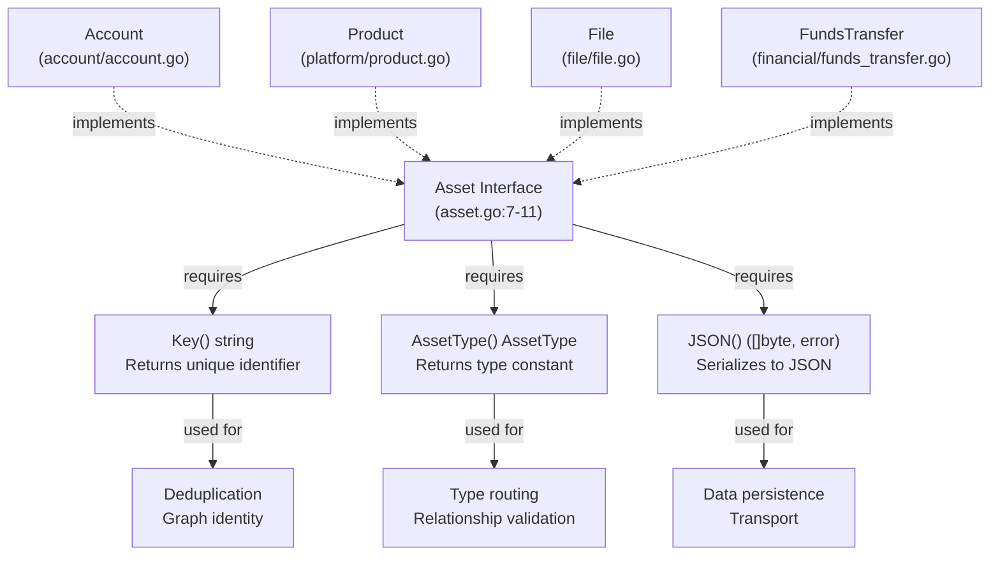
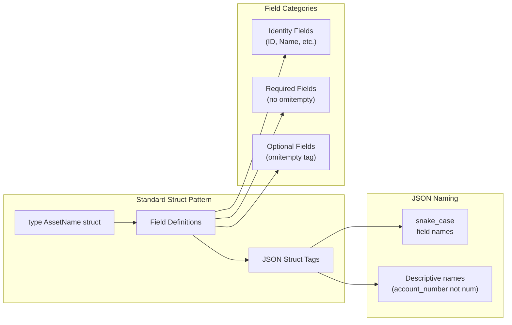
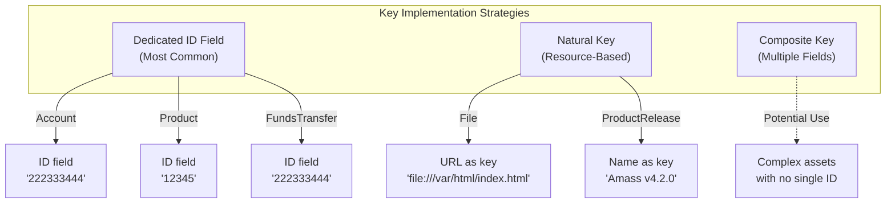
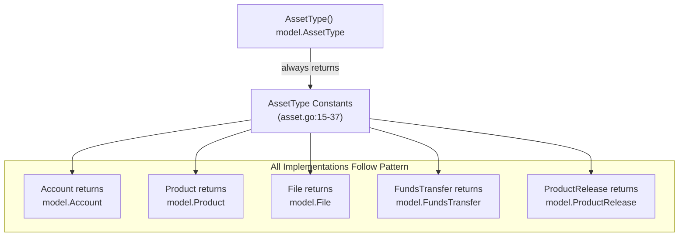
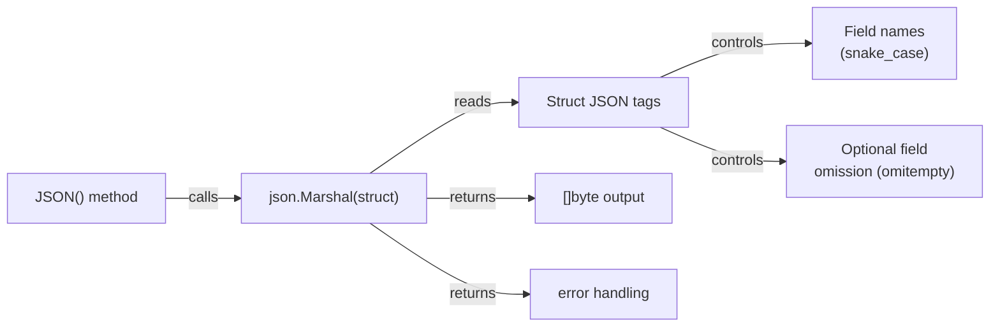
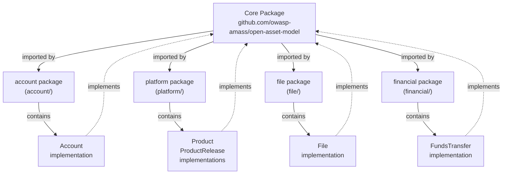
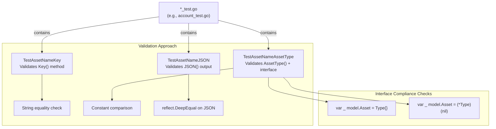

# Implementation Patterns

# Implementation Patterns

<details>
<summary>Relevant source files</summary>

The following files were used as context for generating this wiki page:

- [account/account.go](account/account.go)
- [account/account_test.go](account/account_test.go)
- [asset.go](asset.go)
- [file/file.go](file/file.go)
- [file/file_test.go](file/file_test.go)
- [financial/funds_transfer.go](financial/funds_transfer.go)
- [financial/funds_transfer_test.go](financial/funds_transfer_test.go)
- [platform/product.go](platform/product.go)
- [platform/product_test.go](platform/product_test.go)

</details>


## Purpose and Scope

This document provides practical guidance for implementing new types within the open-asset-model. It covers the standard patterns, best practices, and common variations used throughout the codebase when creating new asset types, relations, and properties.

For step-by-step instructions on implementing asset types with code examples, see [Implementing Asset Types](#6.1). For testing best practices, see [Testing Asset Implementations](#6.2). For understanding the interface definitions themselves, see [Asset Interface](#2.1), [Relation Interface](#2.2), and [Property Interface](#2.3).

---

## The Three-Method Pattern

All asset types in the model follow a consistent three-method implementation pattern. The `Asset` interface requires exactly three methods, each serving a specific purpose in the asset lifecycle.



**Sources:** [asset.go:7-11](), [account/account.go:28-40](), [platform/product.go:28-40](), [file/file.go:21-33]()

### Method Responsibilities

| Method | Return Type | Purpose | Implementation Notes |
|--------|-------------|---------|---------------------|
| `Key()` | `string` | Provides unique identifier for deduplication and graph indexing | Must be stable and deterministic for the same logical entity |
| `AssetType()` | `AssetType` | Returns the type constant for this asset | Must return one of the 21 constants defined in [asset.go:15-37]() |
| `JSON()` | `([]byte, error)` | Serializes the asset to JSON format | Uses `encoding/json.Marshal` on the struct |

---

## Struct Design Pattern

Asset implementations follow consistent struct design conventions that ensure compatibility with the model's serialization and validation systems.



**Sources:** [account/account.go:18-25](), [platform/product.go:18-25](), [file/file.go:14-18](), [financial/funds_transfer.go:18-26]()

### JSON Tag Conventions

The codebase consistently uses specific JSON tag patterns:

| Pattern | Usage | Example |
|---------|-------|---------|
| `json:"field_name"` | Required fields always present in output | `json:"unique_id"` |
| `json:"field_name,omitempty"` | Optional fields omitted when zero-value | `json:"username,omitempty"` |
| Snake case naming | All JSON field names | `account_number`, `release_date`, `product_type` |
| Descriptive names | Full words over abbreviations | `account_number` not `acct_num` |

**Example from Account:**
```go
// account/account.go:18-25
type Account struct {
    ID       string  `json:"unique_id"`          // Required
    Type     string  `json:"account_type"`       // Required
    Username string  `json:"username,omitempty"` // Optional
    Number   string  `json:"account_number,omitempty"`
    Balance  float64 `json:"balance,omitempty"`
    Active   bool    `json:"active,omitempty"`
}
```

**Sources:** [account/account.go:18-25](), [platform/product.go:18-25](), [platform/product.go:56-59](), [financial/funds_transfer.go:18-26]()

---

## Key() Implementation Strategies

The `Key()` method must return a stable, unique identifier for each asset instance. The codebase demonstrates three primary strategies:



**Sources:** [account/account.go:28-30](), [platform/product.go:28-30](), [platform/product.go:62-64](), [file/file.go:21-23](), [financial/funds_transfer.go:29-31]()

### Strategy Comparison

| Strategy | When to Use | Examples | Pros | Cons |
|----------|-------------|----------|------|------|
| **Dedicated ID Field** | Assets with externally-assigned identifiers | Account, Product, FundsTransfer | Simple, explicit, unchanging | Requires ID generation |
| **Natural Key** | Assets with inherent unique identifiers | File (URL), ProductRelease (Name) | No extra field needed, self-documenting | Key may be long, potential conflicts |
| **Composite Key** | Assets requiring multiple fields for uniqueness | Not yet used in codebase | Handles complex cases | More complex implementation |

### Implementation Examples

**Pattern 1: Dedicated ID Field**
```go
// account/account.go:28-30
func (a Account) Key() string {
    return a.ID
}
```

**Pattern 2: Natural Key**
```go
// file/file.go:21-23
func (f File) Key() string {
    return f.URL
}
```

**Sources:** [account/account.go:28-30](), [platform/product.go:28-30](), [platform/product.go:62-64](), [file/file.go:21-23](), [financial/funds_transfer.go:29-31]()

---

## AssetType() Implementation Pattern

The `AssetType()` method implementation is remarkably consistent across all asset types—it always returns the corresponding constant from [asset.go:15-37]().



**Sources:** [account/account.go:33-35](), [platform/product.go:33-35](), [platform/product.go:67-69](), [file/file.go:26-28](), [financial/funds_transfer.go:34-36]()

### Boilerplate Pattern

Every asset type uses identical implementation logic:

```go
// Generic pattern used by all assets
func (x TypeName) AssetType() model.AssetType {
    return model.TypeName
}
```

**Concrete Examples:**

| Asset Type | Implementation | Constant Returned |
|------------|----------------|-------------------|
| Account | [account/account.go:33-35]() | `model.Account` |
| Product | [platform/product.go:33-35]() | `model.Product` |
| ProductRelease | [platform/product.go:67-69]() | `model.ProductRelease` |
| File | [file/file.go:26-28]() | `model.File` |
| FundsTransfer | [financial/funds_transfer.go:34-36]() | `model.FundsTransfer` |

**Sources:** [account/account.go:33-35](), [platform/product.go:33-35](), [platform/product.go:67-69](), [file/file.go:26-28](), [financial/funds_transfer.go:34-36]()

---

## JSON() Serialization Pattern

All asset types use Go's `encoding/json` package with `json.Marshal` for serialization. The method is a thin wrapper that delegates to the standard library.



**Sources:** [account/account.go:38-40](), [platform/product.go:38-40](), [platform/product.go:72-74](), [file/file.go:31-33](), [financial/funds_transfer.go:39-41]()

### Standard Implementation

Every asset type follows the exact same pattern:

```go
// Universal pattern across all assets
func (x TypeName) JSON() ([]byte, error) {
    return json.Marshal(x)
}
```

**Key Points:**

- **No custom marshaling logic**: All assets rely on struct tags for control
- **Value receiver**: All implementations use value receivers, not pointers
- **Error passthrough**: Errors from `json.Marshal` propagate directly to caller
- **No preprocessing**: Struct is marshaled as-is with no modifications

### JSON Output Examples

| Asset Type | Sample Output |
|------------|---------------|
| Account | `{"unique_id":"222333444","account_type":"ACH","username":"test",...}` |
| Product | `{"unique_id":"12345","product_name":"OWASP Amass","product_type":"Attack Surface Management",...}` |
| ProductRelease | `{"name":"Amass v4.2.0","release_date":"2023-09-10T14:15:00Z"}` |
| File | `{"url":"file:///var/html/index.html","name":"index.html","type":"Document"}` |

**Sources:** [account/account_test.go:41-60](), [platform/product_test.go:40-59](), [platform/product_test.go:83-98](), [file/file_test.go:36-52]()

---

## Package Organization Pattern

Asset implementations are organized into domain-specific packages, each importing the core model package.



**Sources:** [account/account.go:7-11](), [platform/product.go:7-11](), [file/file.go:7-11](), [financial/funds_transfer.go:7-11]()

### Import Convention

All asset implementations use the same import alias:

```go
import (
    "encoding/json"
    
    model "github.com/owasp-amass/open-asset-model"
)
```

**Consistent Elements:**

- Package `encoding/json` for marshaling
- Aliased import `model` for the core package
- No other dependencies typically required
- Test files add `"testing"` and `"reflect"` imports

**Sources:** [account/account.go:7-11](), [platform/product.go:7-11](), [file/file.go:7-11](), [financial/funds_transfer.go:7-11]()

---

## Testing Pattern Overview

Every asset implementation includes a test file following Go naming conventions (`*_test.go`). Tests verify three aspects: interface compliance, method correctness, and JSON serialization.



**Sources:** [account/account_test.go:1-61](), [platform/product_test.go:1-99](), [file/file_test.go:1-53](), [financial/funds_transfer_test.go:1-57]()

### Standard Test Structure

Every asset type has three test functions with consistent naming:

| Test Function | Purpose | Pattern |
|---------------|---------|---------|
| `TestXKey` | Verify `Key()` returns expected identifier | Create instance → call `Key()` → compare with `want` |
| `TestXAssetType` | Verify `AssetType()` and interface compliance | Compile-time checks + runtime constant comparison |
| `TestXJSON` | Verify `JSON()` produces correct output | Marshal → compare with expected JSON string |

**Example Test Naming:**

- Account: `TestAccountKey`, `TestAccountAssetType`, `TestAccountJSON`
- Product: `TestProductKey`, `TestProductAssetType`, `TestProductJSON`
- File: `TestFileKey`, `TestFileAssetType`, `TestFileJSON`

**Sources:** [account/account_test.go:14-61](), [platform/product_test.go:14-99](), [file/file_test.go:14-53](), [financial/funds_transfer_test.go:14-57]()

---

## Implementation Checklist

When implementing a new asset type, follow this checklist to ensure compliance with model patterns:

### 1. Package Setup
- [ ] Create domain-specific package or use existing one
- [ ] Import `encoding/json` and `model` alias for core package
- [ ] Add file header with copyright and license

### 2. Struct Definition
- [ ] Define struct with descriptive name matching AssetType constant
- [ ] Use snake_case JSON tags for all fields
- [ ] Apply `omitempty` to optional fields
- [ ] Include comments describing the asset and potential relationships

### 3. Interface Methods
- [ ] Implement `Key()` returning unique string identifier
- [ ] Implement `AssetType()` returning correct constant from [asset.go:15-37]()
- [ ] Implement `JSON()` calling `json.Marshal(struct)`

### 4. Test File
- [ ] Create `*_test.go` file with three test functions
- [ ] Add interface compliance checks in `TestXAssetType`
- [ ] Verify `Key()` with expected value
- [ ] Verify `JSON()` output matches expected string

### 5. Core Package Update
- [ ] Add AssetType constant to [asset.go:15-37]()
- [ ] Add constant to AssetList in [asset.go:39-43]()
- [ ] Update relationship taxonomy if needed (see [Relationship System](#4))

**Sources:** [asset.go:15-43](), [account/account.go:1-41](), [account/account_test.go:1-61]()

---

## Common Pitfalls and Solutions

### Pitfall 1: Inconsistent JSON Tag Naming

**Problem:** Using camelCase or inconsistent field names in JSON tags.

**Solution:** Always use snake_case matching the pattern in existing assets.

```go
// Wrong
type Asset struct {
    ID string `json:"id"`
    AccountNumber string `json:"accountNumber"`
}

// Correct
type Asset struct {
    ID string `json:"unique_id"`
    Number string `json:"account_number"`
}
```

### Pitfall 2: Missing omitempty on Optional Fields

**Problem:** Optional fields appear in JSON output even when empty.

**Solution:** Add `omitempty` to all optional fields.

```go
// Wrong - empty balance always appears
Balance float64 `json:"balance"`

// Correct - zero balance omitted
Balance float64 `json:"balance,omitempty"`
```

### Pitfall 3: Non-Deterministic Key() Implementation

**Problem:** `Key()` returns different values for the same logical entity.

**Solution:** Base key on immutable, stable fields like IDs or URLs.

```go
// Wrong - timestamp makes key non-deterministic
func (a Asset) Key() string {
    return fmt.Sprintf("%s-%d", a.ID, time.Now().Unix())
}

// Correct - stable ID field
func (a Asset) Key() string {
    return a.ID
}
```

**Sources:** [account/account.go:18-40](), [file/file.go:14-33](), [platform/product.go:18-40]()

---

## Advanced Patterns

### Multiple Assets in Single Package

Some packages define multiple asset types. The platform package demonstrates this pattern:

```go
// platform/product.go contains both Product and ProductRelease
type Product struct { ... }
func (p Product) Key() string { return p.ID }
func (p Product) AssetType() model.AssetType { return model.Product }
func (p Product) JSON() ([]byte, error) { return json.Marshal(p) }

type ProductRelease struct { ... }
func (p ProductRelease) Key() string { return p.Name }
func (p ProductRelease) AssetType() model.AssetType { return model.ProductRelease }
func (p ProductRelease) JSON() ([]byte, error) { return json.Marshal(p) }
```

**Key Points:**
- Both types implement the same interface
- Each has distinct `AssetType()` return value
- Different key strategies (ID vs. Name)
- Share same package and test file

**Sources:** [platform/product.go:13-74](), [platform/product_test.go:14-99]()

### Relationships in Comments

Asset structs include comments documenting potential relationships:

```go
// Product represents a technology product...
// Should support relationships for the following:
// - Manufacturer (e.g. Organization)
// - Website
// - Product releases
type Product struct { ... }
```

This pattern provides documentation without enforcing constraints in code. The relationship taxonomy system ([Relationship System](#4)) handles actual validation.

**Sources:** [platform/product.go:13-17](), [platform/product.go:42-55](), [account/account.go:13-17](), [financial/funds_transfer.go:13-17]()