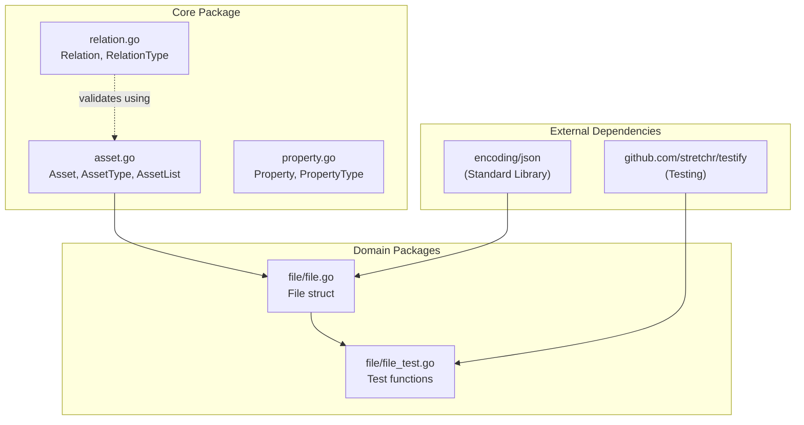
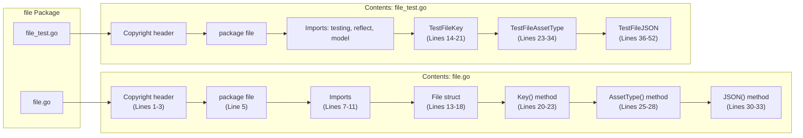
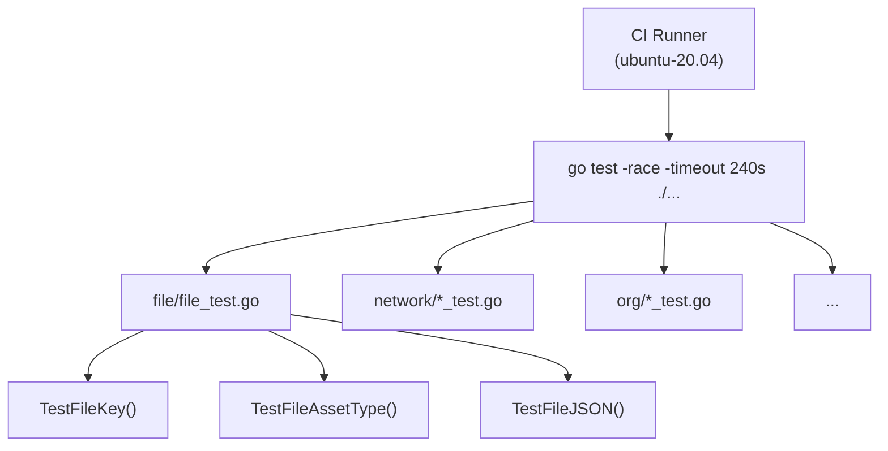
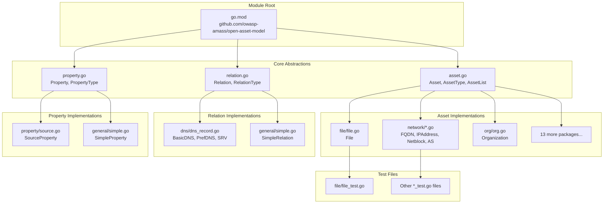

# Package Organization

# Package Organization

<details>
<summary>Relevant source files</summary>

The following files were used as context for generating this wiki page:

- [.github/workflows/ci.yml](.github/workflows/ci.yml)
- [asset.go](asset.go)
- [docs/CONTRIBUTING.md](docs/CONTRIBUTING.md)
- [docs/README.md](docs/README.md)
- [file/file.go](file/file.go)
- [file/file_test.go](file/file_test.go)
- [go.mod](go.mod)
- [go.sum](go.sum)

</details>


## Purpose and Scope

This document explains the repository's package structure, describing how the codebase is organized into a core package and domain-specific packages. It covers the relationship between packages, file naming conventions, and the architectural principles that guide the organization.

For details on implementing new asset types within these packages, see [Implementing Asset Types](#6.1). For information on the core interfaces that drive this organization, see [Core Architecture](#2).

---

## Core Package Structure

The repository follows a **hub-and-spoke architecture** where a single core package defines interfaces and type enumerations, while domain-specific packages provide concrete implementations.

### Root Package: `open_asset_model`

The root package [asset.go:5]() contains the foundational abstractions that all other packages depend on:

| Component | Definition | Lines |
|-----------|------------|-------|
| `Asset` interface | Defines the contract all asset types must implement | [asset.go:7-11]() |
| `AssetType` enum | String-based enumeration of all 21 asset type constants | [asset.go:13-37]() |
| `AssetList` variable | Slice containing all defined asset types for iteration | [asset.go:39-43]() |

The core package also defines `Relation` and `Property` interfaces (referenced but not shown in provided files), following the same pattern of interface definition followed by type enumeration.

**Design Principle**: The root package contains **only abstractions**—no concrete implementations exist in `open_asset_model` package itself. This enforces clean separation between interface definitions and their implementations.

### Directory Structure Overview

```mermaid
graph TB
    root["Root: open_asset_model<br/>(asset.go, relation.go, property.go)"]
    
    root --> network["network/<br/>(Network Infrastructure)"]
    root --> org["org/<br/>(Organizations)"]
    root --> people["people/<br/>(Persons)"]
    root --> contact["contact/<br/>(Locations, Phones)"]
    root --> file["file/<br/>(Files)"]
    root --> url["url/<br/>(URLs)"]
    root --> platform["platform/<br/>(Services, Products)"]
    root --> certificate["certificate/<br/>(TLS Certificates)"]
    root --> account["account/<br/>(Accounts)"]
    root --> financial["financial/<br/>(Fund Transfers)"]
    root --> registration["registration/<br/>(WHOIS/RDAP Records)"]
    root --> dns["dns/<br/>(DNS Relations)"]
    root --> general["general/<br/>(Simple Relations/Properties)"]
    root --> property["property/<br/>(Source Properties)"]
    
    network -.imports.-> root
    org -.imports.-> root
    people -.imports.-> root
    contact -.imports.-> root
    file -.imports.-> root
    url -.imports.-> root
    platform -.imports.-> root
    certificate -.imports.-> root
    account -.imports.-> root
    financial -.imports.-> root
    registration -.imports.-> root
    dns -.imports.-> root
    general -.imports.-> root
    property -.imports.-> root
```



**Sources**: [asset.go:1-44](), Diagram 4 from system context

---

## Domain-Specific Package Organization

Each domain-specific package focuses on a cohesive set of related asset types or relationship types. Packages are organized by **business domain** rather than technical layer.

### Asset Implementation Packages

| Package | Asset Types | Purpose |
|---------|-------------|---------|
| `network` | FQDN, IPAddress, Netblock, AutonomousSystem | Network infrastructure primitives |
| `org` | Organization | Organizational entities |
| `people` | Person | Individual persons |
| `contact` | Location, Phone | Contact information |
| `file` | File | File resources |
| `url` | URL | Web URLs |
| `platform` | Service, Product, ProductRelease | Technology platforms and services |
| `certificate` | TLSCertificate | TLS/SSL certificates |
| `account` | Account | User accounts and credentials |
| `financial` | FundsTransfer | Financial transactions |
| `registration` | DomainRecord, AutnumRecord, IPNetRecord, ContactRecord | WHOIS/RDAP registration records |

### Relationship and Property Packages

| Package | Components | Purpose |
|---------|------------|---------|
| `dns` | BasicDNSRelation, PrefDNSRelation, SRVDNSRelation | DNS-specific relationship types |
| `general` | SimpleRelation, SimpleProperty | Generic relationship and property implementations |
| `property` | SourceProperty | Data source tracking properties |

**Sources**: Diagram 4 from system context, [asset.go:15-37]()

---

## Package Import Patterns

### Standard Import Pattern

All domain-specific packages follow a consistent import pattern for accessing the core abstractions:

```
import (
    model "github.com/owasp-amass/open-asset-model"
)
```

This aliased import as `model` is the **standard convention** used throughout the codebase [file/file.go:10](), [file/file_test.go:11](). It provides a clear namespace for core types like `model.Asset`, `model.AssetType`, and `model.File`.

### Dependency Flow



**Key Observations**:
- Domain packages depend only on the core package and standard library
- No cross-dependencies between domain packages (e.g., `file` doesn't import `network`)
- Test files import both the implementation and `testify` for assertions [file/file_test.go:7-12]()

**Sources**: [file/file.go:7-11](), [file/file_test.go:7-12](), [go.mod:1-11]()

---

## File Naming Conventions

### Implementation Files

Each package follows a consistent naming pattern:

| Pattern | Example | Purpose |
|---------|---------|---------|
| `<asset>.go` | `file.go` | Main implementation file containing the asset struct and interface methods |
| `<asset>_test.go` | `file_test.go` | Unit tests for the asset implementation |

**Single Responsibility**: Each implementation file contains exactly one asset type definition [file/file.go:14-33](). This keeps files small and focused.

### Test File Organization

Test files are co-located with their implementation files in the same package [file/file_test.go:5](). This provides:
- Direct access to package-private members
- Clear correspondence between implementation and tests
- Simplified test discovery for CI pipelines

**Sources**: [file/file.go:1-34](), [file/file_test.go:1-53]()

---

## Typical Package Structure

Each domain package follows this structure pattern:



**Sources**: [file/file.go:1-34](), [file/file_test.go:1-53]()

---

## Implementation File Anatomy

### Required Components

Every asset implementation file contains these components in order:

1. **Copyright Header** [file/file.go:1-3]()
   - Apache 2.0 license notice
   - SPDX identifier

2. **Package Declaration** [file/file.go:5]()
   - Package name matches directory name

3. **Import Block** [file/file.go:7-11]()
   - Standard library imports (`encoding/json`)
   - Aliased model import

4. **Struct Definition** [file/file.go:13-18]()
   - Public struct implementing `Asset` interface
   - JSON tags for serialization

5. **Interface Methods** [file/file.go:20-33]()
   - `Key()` returning unique identifier
   - `AssetType()` returning asset type constant
   - `JSON()` performing serialization

### Test File Anatomy

Test files follow a parallel structure:

| Test Function | Purpose | Example |
|---------------|---------|---------|
| `Test<Asset>Key` | Verifies `Key()` returns expected value | [file/file_test.go:14-21]() |
| `Test<Asset>AssetType` | Verifies interface implementation and type constant | [file/file_test.go:23-34]() |
| `Test<Asset>JSON` | Verifies JSON serialization output | [file/file_test.go:36-52]() |

**Interface Compliance Check**: Every `AssetType` test includes compile-time verification:
```go
var _ model.Asset = File{}       // Value receiver check
var _ model.Asset = (*File)(nil) // Pointer receiver check
```
[file/file_test.go:24-25]()

**Sources**: [file/file.go:1-34](), [file/file_test.go:1-53]()

---

## CI Integration and Testing

### Continuous Integration Pipeline

The repository uses GitHub Actions for automated testing [.github/workflows/ci.yml:1](). Two jobs run on every push and pull request:

| Job | Command | Purpose |
|-----|---------|---------|
| `golangci` | `golangci-lint` | Static analysis and linting [.github/workflows/ci.yml:6-15]() |
| `unit` | `go test -race -timeout 240s ./...` | Unit tests with race detection [.github/workflows/ci.yml:17-26]() |

**Test Discovery**: The `./...` pattern in the test command recursively discovers all test files across all packages [.github/workflows/ci.yml:26](). This means:
- New packages automatically integrate into CI without configuration changes
- Every `*_test.go` file is executed
- Race conditions are detected across the entire codebase

### Package-Level Test Execution

Tests run at the package level with proper isolation:



**Sources**: [.github/workflows/ci.yml:1-27]()

---

## Module Configuration

The repository is configured as a Go module [go.mod:1]():

```
module github.com/owasp-amass/open-asset-model

go 1.19
```

### Dependencies

| Dependency | Purpose | Usage |
|------------|---------|-------|
| `github.com/stretchr/testify` | Test assertions and helpers | Used in test files for cleaner assertions [go.mod:5]() |
| Standard library only | Core functionality | No external dependencies for production code |

**Minimal Dependencies**: The production code depends only on Go's standard library [go.mod:1-11](). This ensures:
- Easy integration into other projects
- No dependency conflicts
- Minimal attack surface
- Fast compilation times

**Sources**: [go.mod:1-11](), [go.sum:1-11]()

---

## Package Relationship Summary



**Key Principles**:
1. **Unidirectional dependencies**: Domain packages depend on core, never the reverse
2. **No lateral dependencies**: Asset packages don't import each other
3. **Test isolation**: Each package tests only its own implementations
4. **Interface-driven**: All implementations satisfy interfaces defined in core

**Sources**: [asset.go:1-44](), [file/file.go:1-34](), [file/file_test.go:1-53](), [go.mod:1-11](), Diagram 4 from system context