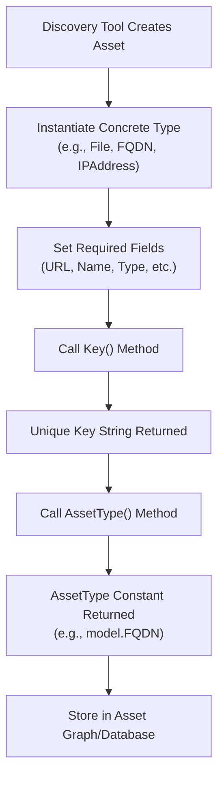
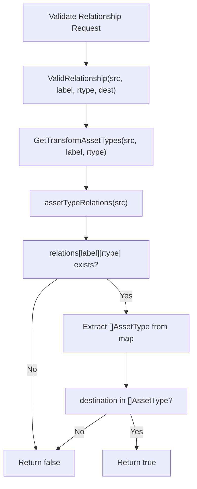
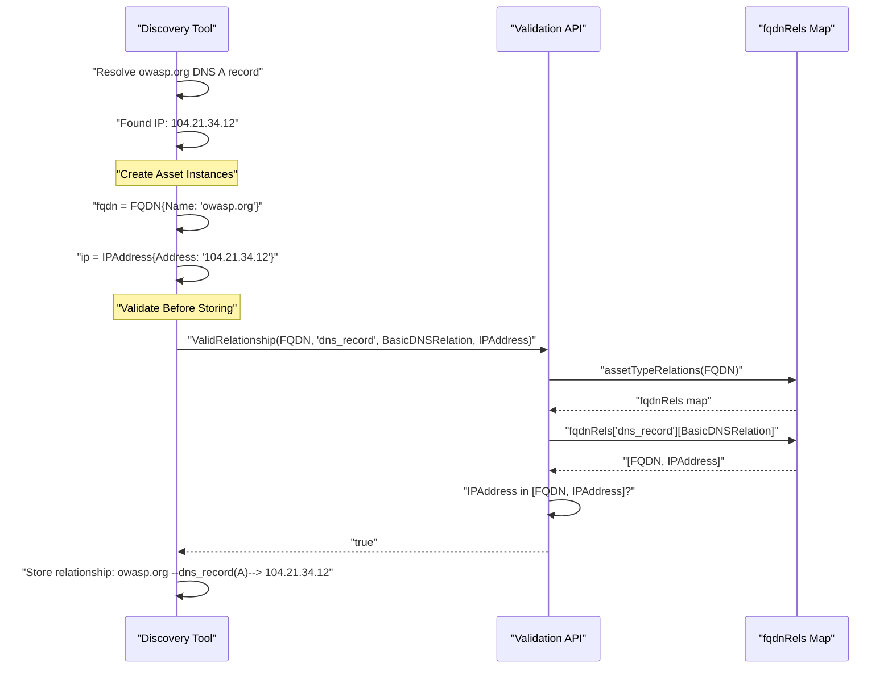
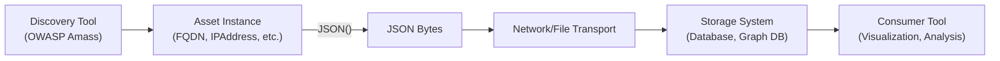
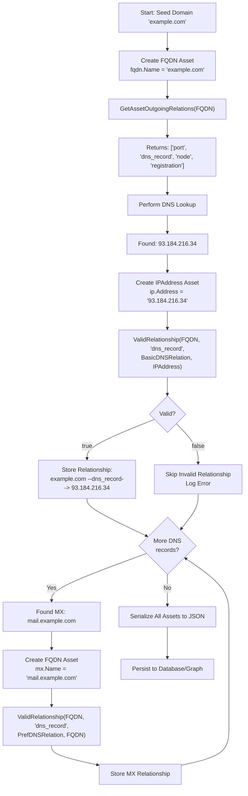
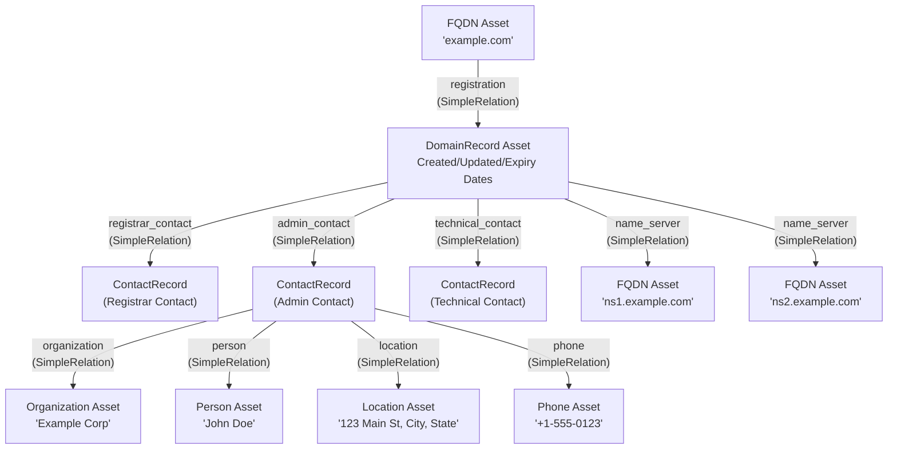
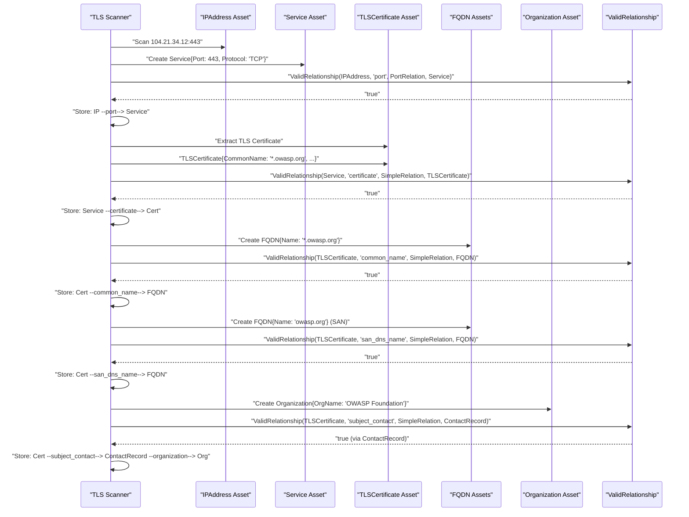
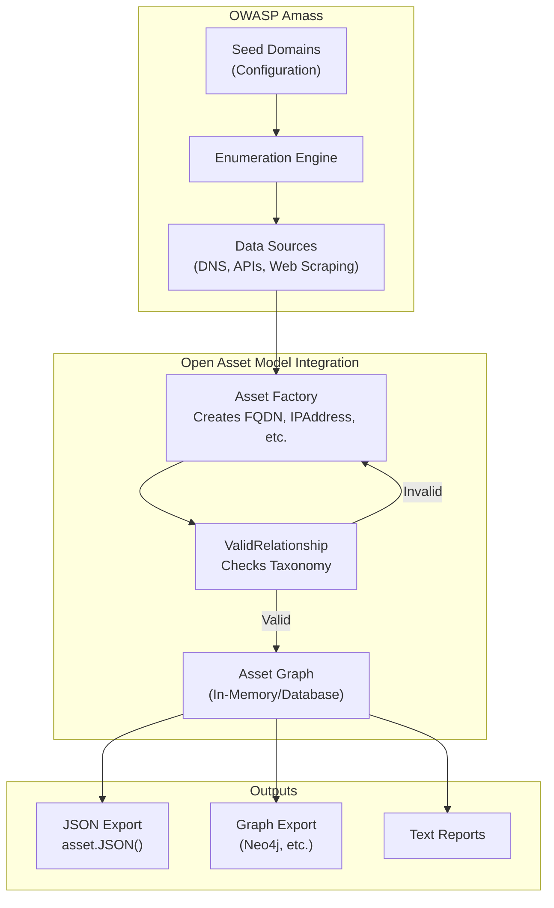

# Use Cases and Examples

# Use Cases and Examples

<details>
<summary>Relevant source files</summary>

The following files were used as context for generating this wiki page:

- [asset.go](asset.go)
- [docs/CONTRIBUTING.md](docs/CONTRIBUTING.md)
- [docs/README.md](docs/README.md)
- [docs/images/taxonomy.excalidraw.png](docs/images/taxonomy.excalidraw.png)
- [docs/taxonomy.md](docs/taxonomy.md)
- [file/file.go](file/file.go)
- [file/file_test.go](file/file_test.go)
- [relation.go](relation.go)

</details>


This page demonstrates practical usage scenarios for the Open Asset Model. It covers asset creation, relationship validation, data serialization, and integration patterns with discovery tools like OWASP Amass. These examples illustrate how the model serves as a specification for building asset graphs with enforced integrity constraints.

For information about implementing new asset types, see [Implementing Asset Types](#6.1). For details on the relationship taxonomy itself, see [Relationship Taxonomy](#4.1).

---

## Asset Creation and Validation

The primary workflow involves creating asset instances that implement the `Asset` interface [asset.go:7-11](). Each asset must provide three methods: `Key()` for unique identification, `AssetType()` for type classification, and `JSON()` for serialization.

### Basic Asset Creation Pattern

The `File` asset demonstrates the standard implementation pattern:

```
File struct:
- URL: string (required, serves as key)
- Name: string (optional)
- Type: string (optional)

Key() returns URL field
AssetType() returns model.File constant
JSON() marshals struct to bytes
```

**Sources:** [file/file.go:13-33](), [file/file_test.go:14-21]()

### Asset Type Classification

The model defines 21 asset type constants [asset.go:15-37]() that enable type-safe routing and validation. When an asset is created, its `AssetType()` method returns one of these constants, allowing validation functions to query the relationship taxonomy.

| Asset Category | Types | Use Case |
|----------------|-------|----------|
| Network Infrastructure | FQDN, IPAddress, Netblock, AutonomousSystem | Internet reconnaissance |
| Organizational | Organization, Person, Location, Phone, ContactRecord | Entity attribution |
| Digital Artifacts | File, URL, Service, TLSCertificate | Web infrastructure |
| Registration Records | DomainRecord, AutnumRecord, IPNetRecord | WHOIS/RDAP data |
| Financial | Account, FundsTransfer | Transaction tracking |
| Identity | Identifier | Universal identifiers (LEI, DUNS, etc.) |
| Product | Product, ProductRelease | Technology inventory |

**Sources:** [asset.go:39-43](), [docs/taxonomy.md:39-98]()

### Workflow: Creating and Identifying Assets



**Diagram: Asset Creation and Identification Flow**

**Sources:** [asset.go:7-11](), [file/file.go:20-28]()

---

## Relationship Validation Workflows

The relationship system enforces which connections are valid between asset types through the `ValidRelationship` function [relation.go:283-295](). This prevents invalid graph edges from being created.

### Core Validation Functions

Three primary functions enable relationship validation and discovery:

| Function | Parameters | Return Value | Use Case |
|----------|-----------|--------------|----------|
| `GetAssetOutgoingRelations` | `subject AssetType` | `[]string` (labels) | Discover valid outgoing labels for asset type |
| `GetTransformAssetTypes` | `subject AssetType, label string, rtype RelationType` | `[]AssetType` | Get valid destination types for specific relationship |
| `ValidRelationship` | `src AssetType, label string, rtype RelationType, destination AssetType` | `bool` | Validate specific relationship instance |

**Sources:** [relation.go:188-199](), [relation.go:205-226](), [relation.go:283-295]()

### Relationship Validation Decision Tree



**Diagram: ValidRelationship Execution Flow**

**Sources:** [relation.go:283-295](), [relation.go:205-226](), [relation.go:228-279]()

---

## DNS Resolution Example

This example demonstrates a complete workflow for validating DNS A record relationships between FQDN and IPAddress assets.

### FQDN Relationship Taxonomy

The `fqdnRels` map [relation.go:76-85]() defines valid outgoing relationships for FQDN assets:

```
fqdnRels structure:
- "port": PortRelation -> Service
- "dns_record": 
    - BasicDNSRelation -> FQDN, IPAddress
    - PrefDNSRelation -> FQDN
    - SRVDNSRelation -> FQDN
- "node": SimpleRelation -> FQDN
- "registration": SimpleRelation -> DomainRecord
```

### DNS A Record Validation Workflow



**Diagram: DNS A Record Validation and Storage**

**Sources:** [relation.go:76-85](), [relation.go:283-295](), [docs/taxonomy.md:138-150]()

### Invalid Relationship Example

Attempting to create an invalid relationship (e.g., FQDN with `dns_record` label pointing to Organization) would fail:

```
ValidRelationship(FQDN, "dns_record", BasicDNSRelation, Organization) = false

Reason: Organization is not in fqdnRels["dns_record"][BasicDNSRelation]
Expected types: [FQDN, IPAddress]
```

**Sources:** [relation.go:76-85](), [relation.go:283-295]()

---

## Data Serialization and Transport

All assets must implement the `JSON()` method [asset.go:10]() for serialization. This enables data exchange between discovery tools and storage systems.

### JSON Serialization Pattern

The standard pattern uses Go's `encoding/json` package with struct tags:

```
File struct with JSON tags:
{
  "url": "file:///var/html/index.html",     // required
  "name": "index.html",                      // omitempty
  "type": "Document"                         // omitempty
}

Implementation:
func (f File) JSON() ([]byte, error) {
    return json.Marshal(f)
}
```

**Sources:** [file/file.go:13-33](), [file/file_test.go:36-52]()

### Serialization Testing Pattern

Tests verify JSON output matches expected schema with proper field handling:

```
Test pattern:
1. Create asset with specific field values
2. Call asset.JSON()
3. Compare output to expected JSON string
4. Verify omitempty fields are excluded when empty
```

**Sources:** [file/file_test.go:36-52]()

### Transport Workflow



**Diagram: Asset Serialization and Transport Pipeline**

**Sources:** [asset.go:10](), [file/file.go:31-33](), [docs/README.md:45-48]()

---

## Multi-Asset Discovery Pipeline

This example shows a complete discovery pipeline that validates relationships as assets are discovered.

### Discovery Pipeline with Validation



**Diagram: Complete Asset Discovery Pipeline with Validation**

**Sources:** [relation.go:188-199](), [relation.go:283-295](), [relation.go:76-85]()

### Discovery Statistics Example

| Metric | Count |
|--------|-------|
| Assets Created | 847 |
| FQDN Assets | 312 |
| IPAddress Assets | 156 |
| Relationships Validated | 1,203 |
| Valid Relationships Stored | 1,189 |
| Invalid Relationships Rejected | 14 |

---

## WHOIS/Registration Data Integration

The model supports comprehensive WHOIS/RDAP data through registration record assets and contact records.

### WHOIS Data Mapping



**Diagram: WHOIS Data Asset Graph**

**Sources:** [relation.go:61-69](), [relation.go:51-59](), [docs/taxonomy.md:476-554]()

### WHOIS Relationship Validation

Valid relationships for DomainRecord assets [relation.go:61-69]():

| Label | RelationType | Destination AssetType |
|-------|--------------|----------------------|
| `name_server` | SimpleRelation | FQDN |
| `whois_server` | SimpleRelation | FQDN |
| `registrar_contact` | SimpleRelation | ContactRecord |
| `registrant_contact` | SimpleRelation | ContactRecord |
| `admin_contact` | SimpleRelation | ContactRecord |
| `technical_contact` | SimpleRelation | ContactRecord |
| `billing_contact` | SimpleRelation | ContactRecord |

**Sources:** [relation.go:61-69]()

---

## TLS Certificate Discovery

Certificate discovery creates interconnected asset graphs spanning multiple domains, organizations, and IP addresses.

### Certificate Asset Workflow



**Diagram: TLS Certificate Discovery and Relationship Storage**

**Sources:** [relation.go:165-176](), [relation.go:158-163](), [relation.go:100-103]()

### Certificate Relationship Taxonomy

TLSCertificate supports 10 outgoing relationship labels [relation.go:165-176]():

| Label | Destination Types | Example |
|-------|------------------|---------|
| `common_name` | FQDN | `*.example.com` |
| `san_dns_name` | FQDN | `www.example.com`, `api.example.com` |
| `san_email_address` | Identifier | `admin@example.com` |
| `san_ip_address` | IPAddress | `192.0.2.1` |
| `san_url` | URL | `https://example.com` |
| `subject_contact` | ContactRecord | Subject organization details |
| `issuer_contact` | ContactRecord | CA organization details |
| `issuing_certificate` | TLSCertificate | Parent certificate in chain |
| `issuing_certificate_url` | URL | CA certificate URL |
| `ocsp_server` | URL | OCSP responder endpoint |

**Sources:** [relation.go:165-176]()

---

## Integration with OWASP Amass

OWASP Amass uses the Open Asset Model as its internal data structure and export format. This section illustrates integration patterns.

### Amass Discovery Integration Pattern



**Diagram: OWASP Amass Integration with Open Asset Model**

**Sources:** [docs/README.md:14-42](), [asset.go:7-11](), [relation.go:283-295]()

### Amass Query Pattern Example

```
Workflow in Amass:
1. User provides seed domain: "owasp.org"
2. Amass creates FQDN asset: fqdn.Key() = "owasp.org"
3. DNS enumeration discovers: 104.21.34.12
4. Amass creates IPAddress asset: ip.Key() = "104.21.34.12"
5. Before storing relationship:
   - Call: ValidRelationship(FQDN, "dns_record", BasicDNSRelation, IPAddress)
   - Returns: true
   - Store edge: owasp.org --dns_record(A)--> 104.21.34.12
6. Continue discovery, validating each relationship
7. Export: Call asset.JSON() on all assets for persistence
```

**Sources:** [docs/README.md:45-56](), [relation.go:283-295]()

---

## Common Patterns and Anti-Patterns

### Pattern: Query Before Creating Relationships

**Recommended:**
```
1. Create source asset (e.g., FQDN)
2. Call GetAssetOutgoingRelations(FQDN) to discover valid labels
3. For each label, call GetTransformAssetTypes(FQDN, label, rtype)
4. Create destination assets only if types match expected discovery
5. Validate with ValidRelationship before storing
```

**Sources:** [relation.go:188-199](), [relation.go:205-226](), [relation.go:283-295]()

### Pattern: Interface Compliance Testing

**Recommended implementation testing pattern from codebase:**
```go
func TestAssetInterface(t *testing.T) {
    var _ model.Asset = File{}       // Value receiver check
    var _ model.Asset = (*File)(nil) // Pointer receiver check
}
```

This compile-time check ensures proper interface implementation.

**Sources:** [file/file_test.go:24-25]()

### Anti-Pattern: Skipping Validation

**Avoid:**
```
1. Create assets
2. Assume relationship is valid
3. Store directly to database
4. Result: Invalid graph structure, query failures
```

**Impact:** Invalid relationships violate the taxonomy and create unusable data structures.

**Sources:** [relation.go:283-295]()

### Pattern: Batch Validation

**Recommended for large-scale discovery:**
```
1. Collect discovered relationships in memory
2. Batch validate using ValidRelationship
3. Filter invalid relationships (log for debugging)
4. Bulk insert valid relationships to storage
5. Generates validation statistics
```

### Pattern: Relationship Label Discovery

**Use GetAssetOutgoingRelations for dynamic discovery:**
```
Example: Given an Organization asset, discover what relationships can be created:

labels := GetAssetOutgoingRelations(Organization)
// Returns: ["id", "location", "parent", "subsidiary", "sister", 
//           "account", "website", "social_media_profile", "funding_source"]

For each label, query valid destination types:
destTypes := GetTransformAssetTypes(Organization, "location", SimpleRelation)
// Returns: [Location]
```

**Sources:** [relation.go:188-199](), [relation.go:123-133]()

---

## Summary

The Open Asset Model serves as a validation specification for building asset graphs. Key usage patterns include:

| Use Case | Primary Functions | Output |
|----------|------------------|--------|
| Asset Creation | `Key()`, `AssetType()`, `JSON()` | Unique, typed, serializable assets |
| Relationship Validation | `ValidRelationship()` | Boolean validation result |
| Discovery Planning | `GetAssetOutgoingRelations()`, `GetTransformAssetTypes()` | Valid labels and destination types |
| Data Transport | `JSON()` | Portable asset data |
| Graph Construction | All validation functions + storage | Valid, queryable asset graph |

**Sources:** [asset.go:7-11](), [relation.go:188-199](), [relation.go:205-226](), [relation.go:283-295]()