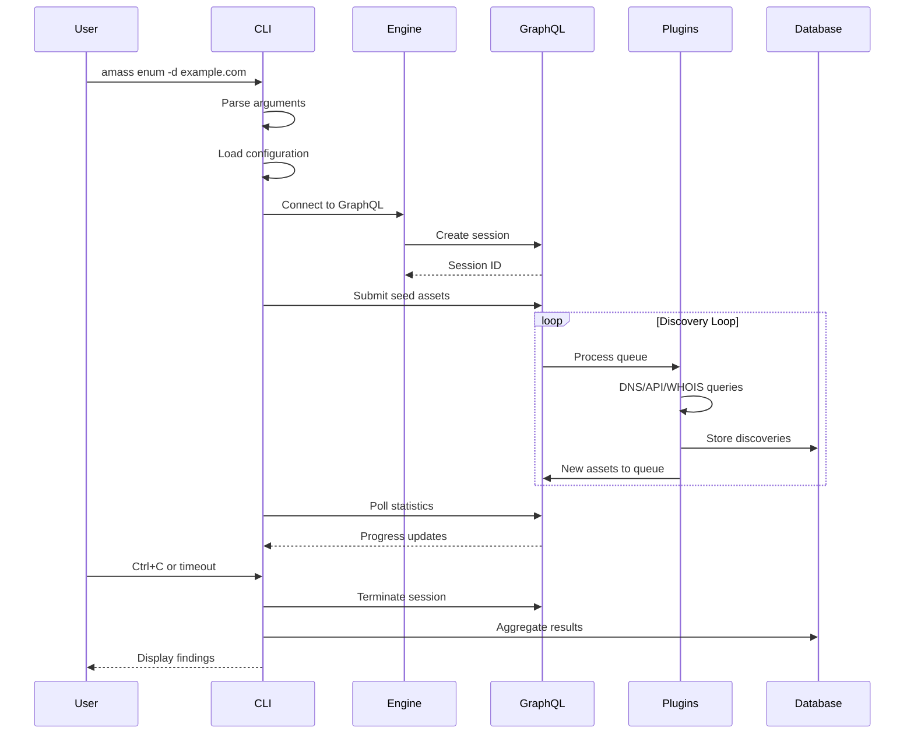
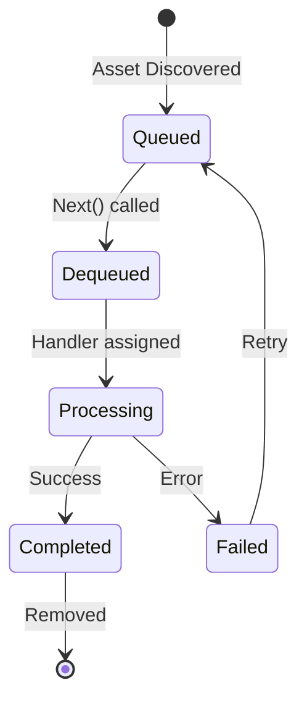
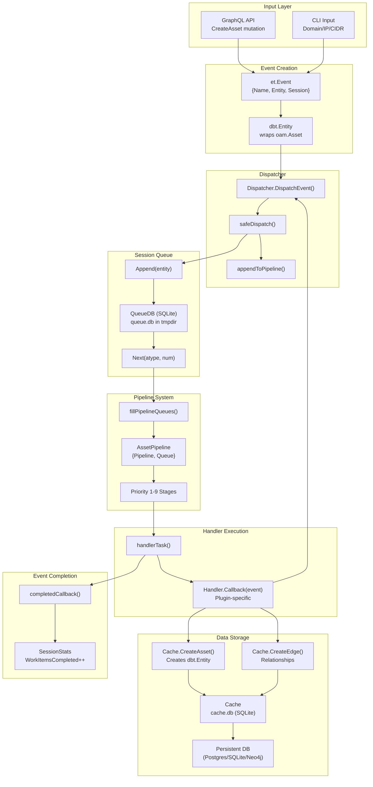
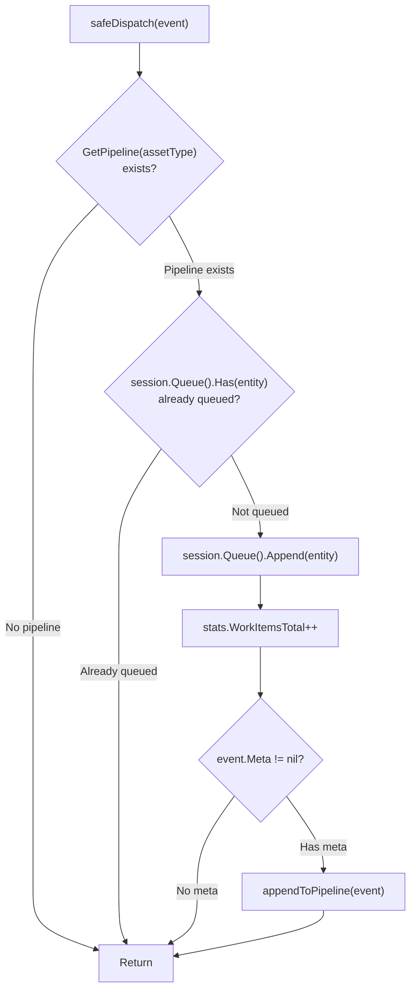
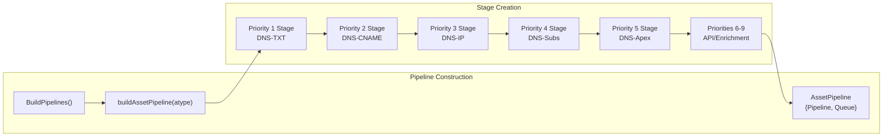
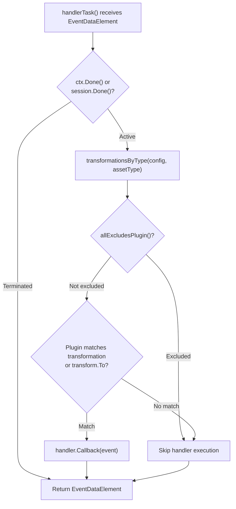
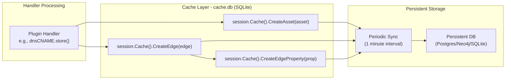
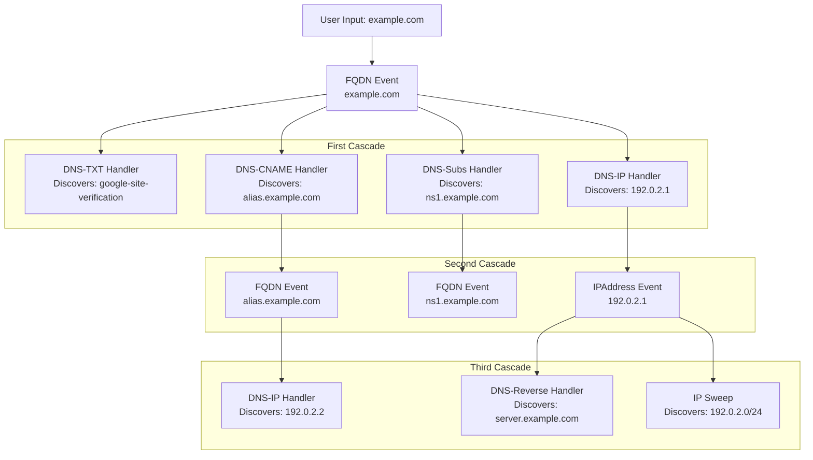
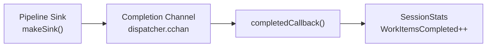
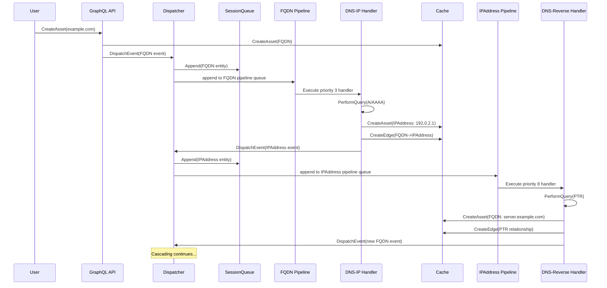

# Data Flow

Understanding how assets flow through Amass helps optimize enumeration strategies and interpret results.

## Asset Discovery Flow

## Enumeration Workflow

The `enum` command follows this sequence:



## Asset Relationship Building

As assets are discovered, Amass builds a relationship graph following the Open Asset Model:

### Relationship Types

| Source | Relation | Target |
|--------|----------|--------|
| FQDN | `resolves_to` | IP Address |
| IP Address | `belongs_to` | Netblock |
| Netblock | `member_of` | ASN |
| ASN | `owned_by` | Organization |
| FQDN | `registered_to` | Organization |
| FQDN | `protected_by` | Certificate |
| Certificate | `issued_to` | Organization |
| Person | `works_for` | Organization |
| FQDN | `contains` | FQDN (subdomain) |

## DNS Resolution Flow

### Resolver Rate Limiting

| Resolver Type | Default QPS | Purpose |
|---------------|-------------|---------|
| Baseline | 15 | Reliable fallback |
| Public | 5 | Distributed load |
| Custom | Configurable | User preference |
| Trusted | 15+ | High-volume queries |

## Caching Strategy

### Cache Layers

| Layer | Storage | TTL | Purpose |
|-------|---------|-----|---------|
| **Memory** | In-process | Session | Rapid deduplication |
| **File** | Disk | Configurable | Cross-session persistence |
| **Database** | SQLite/PostgreSQL | Permanent | Long-term storage |

## Queue Processing

The session queue manages asset processing state:



### Queue Operations

| Operation | Description |
|-----------|-------------|
| `Append` | Add new asset to queue |
| `Next` | Retrieve next unprocessed asset |
| `Processed` | Mark asset as completed |
| `Delete` | Remove from queue |

## Output Generation

### Output Commands

| Command | Purpose | Formats |
|---------|---------|---------|
| `enum` | Discovery results | Text, JSON |
| `subs` | Subdomain listing | Text, JSON |
| `assoc` | Relationship analysis | Text, JSON |
| `track` | Change detection | Text, JSON |
| `viz` | Visualizations | D3, DOT, GEXF |

## Feedback Loops

Discoveries feed back into the processing queue, creating cascading discovery:

### Example Cascade

```
example.com (seed)
    │
    ├─► DNS TXT → mail.example.com
    │   └─► Resolves to 192.0.2.10
    │       └─► Netblock 192.0.2.0/24
    │           └─► ASN 64496
    │               └─► Example Inc
    │
    ├─► Certificate → *.example.com
    │   └─► SAN: api.example.com
    │       └─► New FQDN queued
    │
    └─► Brute Force → www.example.com
        └─► HTTP Probe → Redirects to cdn.example.com
            └─► New FQDN queued
```

## Performance Considerations

### Parallelism

| Component | Concurrency |
|-----------|-------------|
| DNS Resolvers | Pool of resolvers with individual rate limits |
| HTTP Probes | Configurable concurrent connections |
| API Calls | Per-service rate limiting |
| Queue Processing | Multiple handlers per asset type |

### Optimization Tips

!!! tip "Enumeration Performance"
    - Use `-dns-qps` to control overall DNS query rate
    - Configure trusted resolvers (`-tr`) for higher throughput
    - Use `-passive` mode for stealth reconnaissance
    - Set appropriate `-timeout` to bound enumeration time

## Technical Reference

The following diagrams detail the internal pipeline mechanics sourced from the engine codebase.

### End-to-End Data Flow (Internal)



### Safe Dispatch Logic



### Priority-Based Pipeline Construction



### Handler Execution and Transformation Filtering



### Cache Staging and Persistence



### Cascading Discovery Pattern



### Event Completion Tracking



### FQDN to IP: Full Sequence


