# Data Model & Storage

This document explains the data model and storage architecture used by OWASP Amass. It covers the Open Asset Model (OAM) specification that defines asset types and relationships, the three-tier storage architecture (graph database, cache, and work queue), and how assets flow through the system from discovery to persistent storage.

---

## Data Model Foundation

Amass uses the **Open Asset Model (OAM)** as its core data specification. OAM is a standardized schema for representing cybersecurity assets and their relationships in a graph structure. Each discovered piece of information (domain, IP address, organization, service, etc.) is represented as an OAM asset type.

### OAM Asset Types

The system supports 20 distinct asset types, each implementing the `oam.Asset` interface:

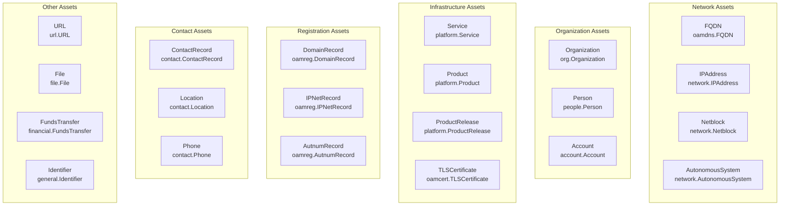

### Entity Wrapper Pattern

OAM assets are not stored directly. Instead, they are wrapped in a `dbt.Entity` object that provides metadata and tracking:

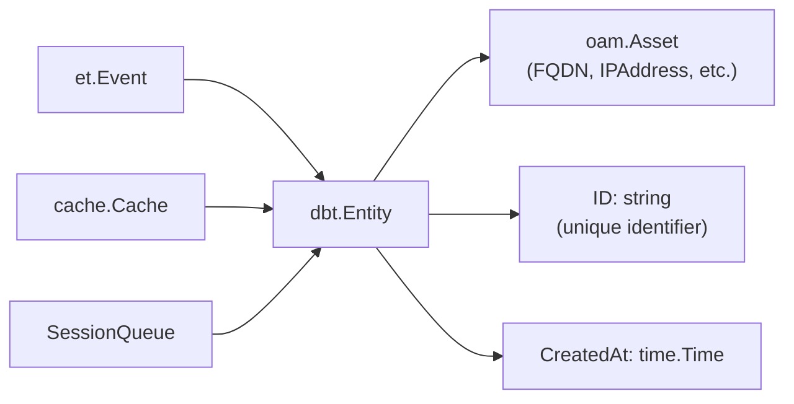

The `Event` structure carries entities through the system:

| Field | Type | Purpose |
|-------|------|---------|
| `Name` | `string` | Human-readable event identifier |
| `Entity` | `*dbt.Entity` | Wrapped OAM asset |
| `Meta` | `interface{}` | Optional metadata (e.g., `EmailMeta`) |
| `Dispatcher` | `Dispatcher` | Reference for dispatching new events |
| `Session` | `Session` | Associated session context |

---

## Three-Tier Storage Architecture

Amass maintains three distinct storage layers, each serving a specific purpose in the data lifecycle:

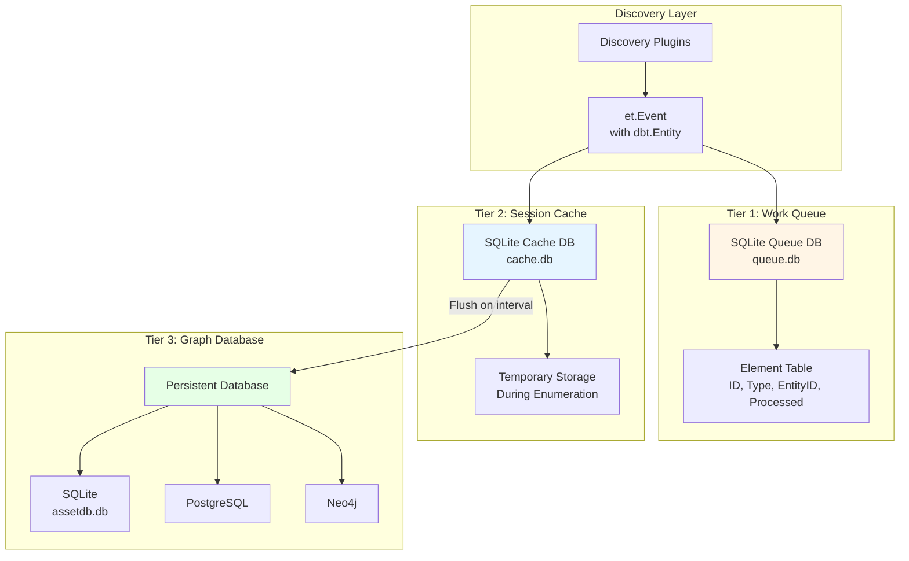

| Tier | Purpose | Lifetime | Backend | Location |
|------|---------|----------|---------|----------|
| **Cache** | Temporary asset storage, deduplication | Session duration | SQLite | `<tmpdir>/cache.db` |
| **Queue** | Work item tracking, processing state | Session duration | SQLite + GORM | `<tmpdir>/queue.db` |
| **Persistent** | Long-term asset storage | Permanent | SQLite/Postgres/Neo4j | Configurable |

### Tier 1: Work Queue Database

The work queue is a **SQLite database** (`queue.db`) that tracks which assets need processing. It implements a priority-based FIFO queue for each asset type.

**Database Schema:**

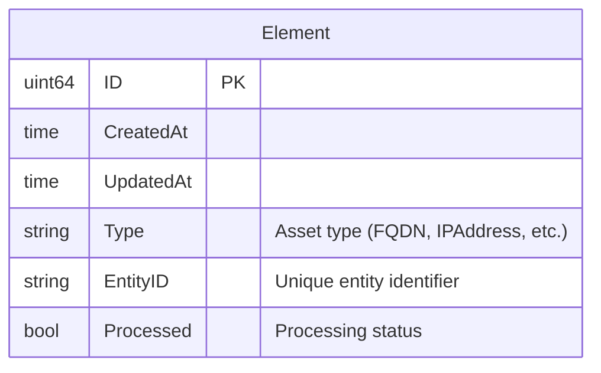

**Indexes:**
- `idx_created_at` — Orders by creation time (FIFO)
- `idx_etype` — Filters by asset type
- `idx_entity_id` — Ensures uniqueness
- `idx_processed` — Filters unprocessed items

**Key Operations:**

| Method | Purpose | SQL Pattern |
|--------|---------|-------------|
| `Has(eid)` | Check if entity is queued | `SELECT COUNT(*) WHERE entity_id = ?` |
| `Append(type, eid)` | Add to queue | `INSERT INTO elements (type, entity_id, processed) VALUES (?, ?, false)` |
| `Next(type, num)` | Get next N unprocessed | `SELECT * WHERE etype = ? AND processed = false ORDER BY created_at LIMIT ?` |
| `Processed(eid)` | Mark as processed | `UPDATE elements SET processed = true WHERE entity_id = ?` |
| `Delete(eid)` | Remove from queue | `DELETE FROM elements WHERE entity_id = ?` |

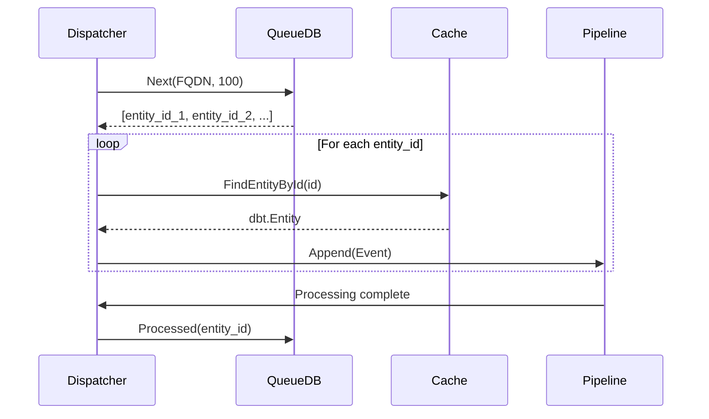

### Tier 2: Session Cache

The session cache is a **temporary SQLite database** (`cache.db`) created per session. It uses the `cache.Cache` abstraction from the `asset-db` library.

**Cache Lifecycle:**

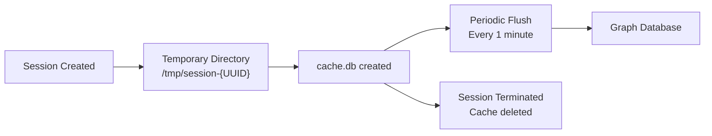

| Component | Implementation |
|-----------|---------------|
| Cache Interface | `cache.Cache` |
| Backend Repository | SQLite file |
| Flush Interval | 1 minute |
| DSN Options | `busy_timeout=30000`, `journal_mode=WAL` |

### Tier 3: Persistent Graph Database

The persistent graph database is the **single source of truth** for all discovered assets. Amass supports three database backends:

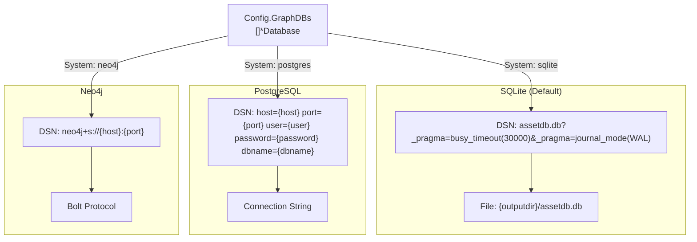

**Environment Variable Support:**

| Variable | Purpose | Default |
|----------|---------|---------|
| `AMASS_DB_USER` | Database username | (required) |
| `AMASS_DB_PASSWORD` | Database password | (optional) |
| `AMASS_DB_HOST` | Database host | `localhost` |
| `AMASS_DB_PORT` | Database port | `5432` |
| `AMASS_DB_NAME` | Database name | `assetdb` |

---

## Asset and Entity Lifecycle

Assets flow through multiple stages from initial discovery to persistent storage:

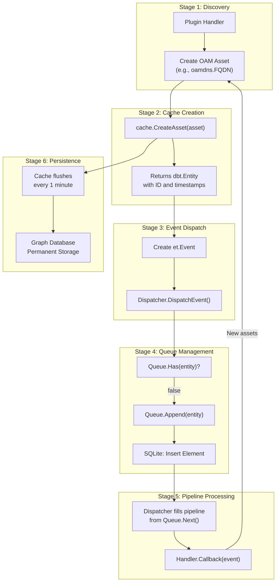

### Stage-by-Stage Breakdown

**Stage 1 — Plugin Discovery:** A plugin handler discovers new information (e.g., DNS lookup finds an IP) and creates an OAM asset object.

**Stage 2 — Cache Creation:** Calls `session.Cache().CreateAsset(oamAsset)`. Cache wraps the asset in `dbt.Entity` with a unique ID and timestamp.

**Stage 3 — Event Dispatch:** Plugin creates `et.Event` with the entity and calls `dispatcher.DispatchEvent(event)`.

**Stage 4 — Queue Management:** Dispatcher checks `session.Queue().Has(entity)` to prevent duplicates. If not queued, calls `session.Queue().Append(entity)`.

**Stage 5 — Pipeline Processing:** Dispatcher periodically calls `Queue.Next(assetType, 100)` to fill pipelines. Handlers execute in priority order (1–9). After processing, marks as processed: `Queue.Processed(entity)`.

**Stage 6 — Persistence:** Cache flushes to the graph database every 1 minute.

---

## Asset Creation from Configuration Scope

Initial assets are created from the configuration scope before enumeration begins:

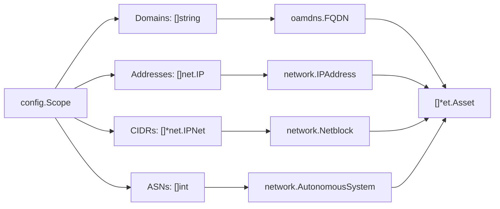

| Scope Field | OAM Asset Type | Properties |
|-------------|----------------|------------|
| `Domains []string` | `oamdns.FQDN` | `Name: domain` |
| `Addresses []net.IP` | `network.IPAddress` | `Address: netip.Addr`, `Type: "IPv4"/"IPv6"` |
| `CIDRs []*net.IPNet` | `network.Netblock` | `CIDR: netip.Prefix`, `Type: "IPv4"/"IPv6"` |
| `ASNs []int` | `network.AutonomousSystem` | `Number: asn` |

---

## Session-Specific Storage

Each session maintains isolated storage in a temporary directory:

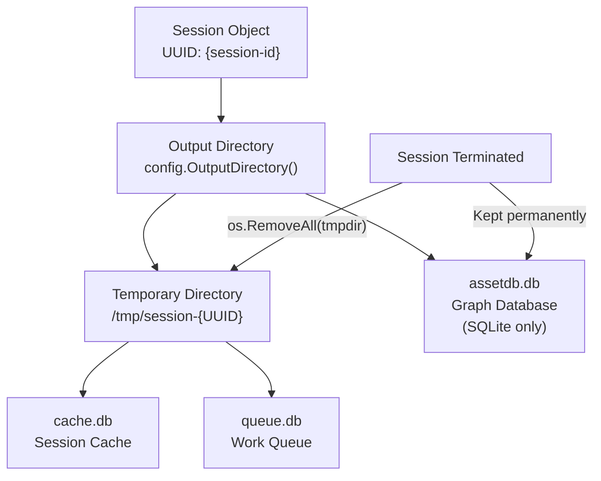

**Directory structure:**

```
{OutputDir}/
├── assetdb.db              # Persistent graph database (SQLite)
└── session-{UUID}/         # Temporary session directory
    ├── cache.db            # Session cache (deleted on exit)
    └── queue.db            # Work queue (deleted on exit)
```

---

## Asset Types and Properties

### Asset Type Hierarchy

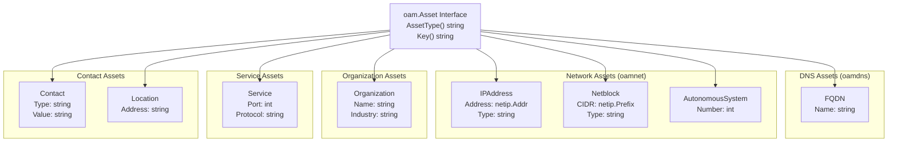

### Property Attachment Model

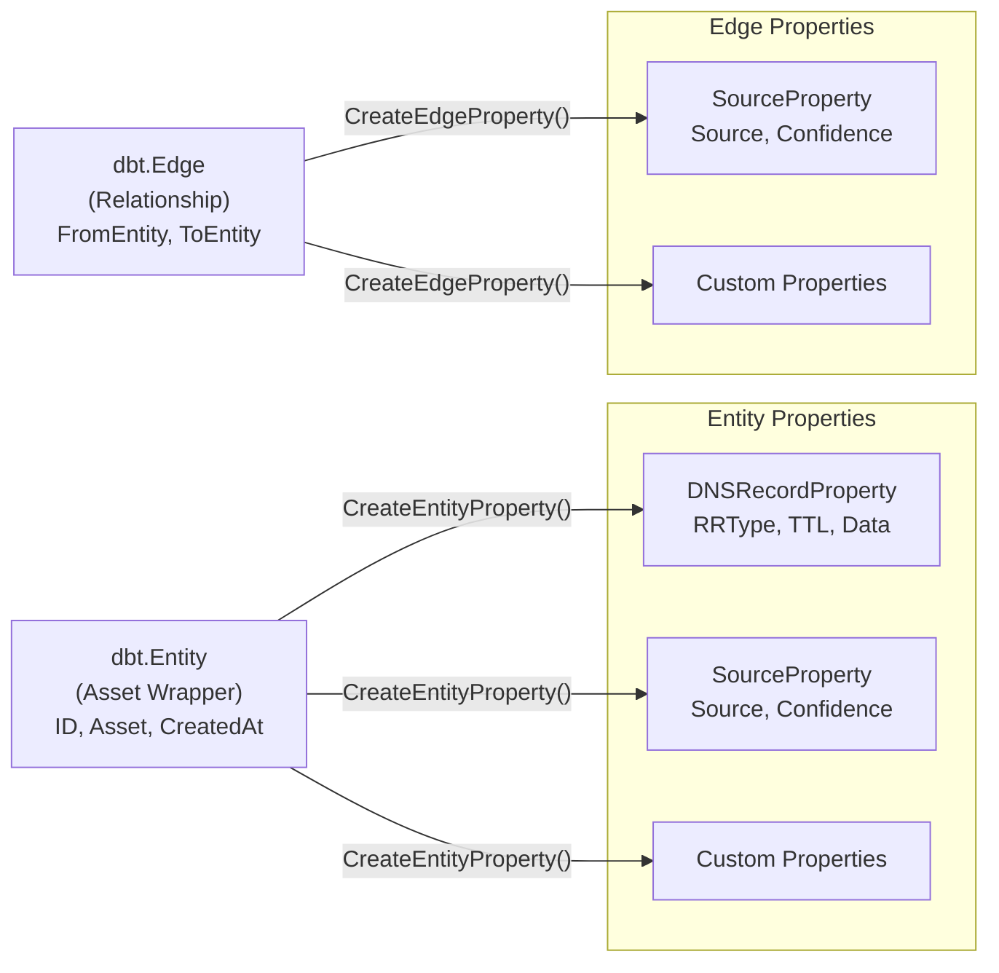

### DNSRecordProperty

The `DNSRecordProperty` attaches DNS record information to FQDN entities.

| Field | Type | Description |
|-------|------|-------------|
| `PropertyName` | `string` | Always `"dns_record"` |
| `Header.RRType` | `int` | DNS record type (1=A, 5=CNAME, 15=MX, 16=TXT, 28=AAAA…) |
| `Header.Class` | `int` | DNS class (typically 1 for IN) |
| `Header.TTL` | `int` | Time to live in seconds |
| `Data` | `string` | Record-specific data |

```go
_, err := session.Cache().CreateEntityProperty(fqdn, &oamdns.DNSRecordProperty{
    PropertyName: "dns_record",
    Header: oamdns.RRHeader{
        RRType: int(dns.TypeTXT),
        Class:  int(record.Header().Class),
        TTL:    int(record.Header().Ttl),
    },
    Data: txtValue,
})
```

### Asset to Entity Conversion

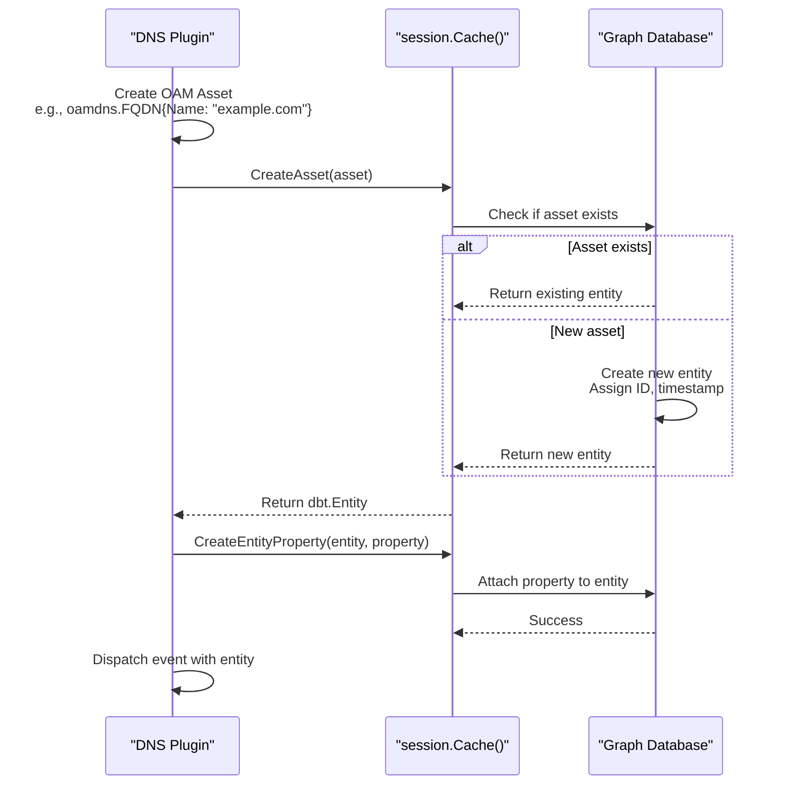

### DNS Plugin Asset Flow

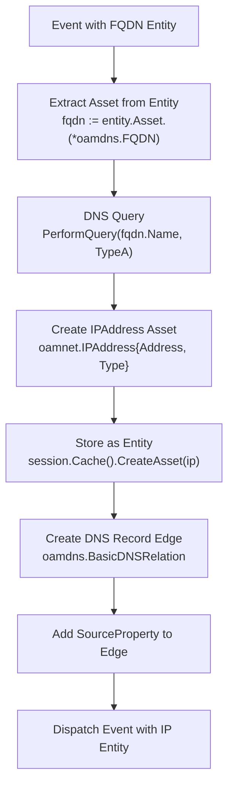

### Asset Type Summary

| Asset Type | Package | Key Structure | Primary Use Case |
|------------|---------|---------------|------------------|
| `FQDN` | `oamdns` | Domain name | DNS enumeration, subdomain discovery |
| `IPAddress` | `oamnet` | IP address string | Network infrastructure mapping |
| `Netblock` | `oamnet` | CIDR notation | Network range definition |
| `AutonomousSystem` | `oamnet` | ASN | BGP/network ownership |
| `Organization` | `oam` | Organization name | Entity attribution and enrichment |
| `Service` | `oam` | Service identifier | Active service discovery |
| `Contact` | `oam` | Contact value | WHOIS/organization contacts |
| `Location` | `oam` | Address | Physical location data |

---

## Relationships and Edges

### Edge Structure

Edges are represented by the `dbt.Edge` struct with three required components:

- **Relation** — An object implementing `oam.Relation` that defines the relationship type
- **FromEntity** — The source entity of the directed edge
- **ToEntity** — The destination entity of the directed edge

### Edge Creation Pattern

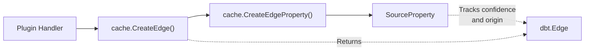

```go
edge, err := e.Session.Cache().CreateEdge(&dbt.Edge{
    Relation: &oamdns.BasicDNSRelation{
        Name: "dns_record",
        Header: oamdns.RRHeader{RRType: 1, Class: 1, TTL: 300},
    },
    FromEntity: fqdn,
    ToEntity:   ipEntity,
})
if err == nil && edge != nil {
    e.Session.Cache().CreateEdgeProperty(edge, &general.SourceProperty{
        Source:     "DNS",
        Confidence: 100,
    })
}
```

### DNS Relations

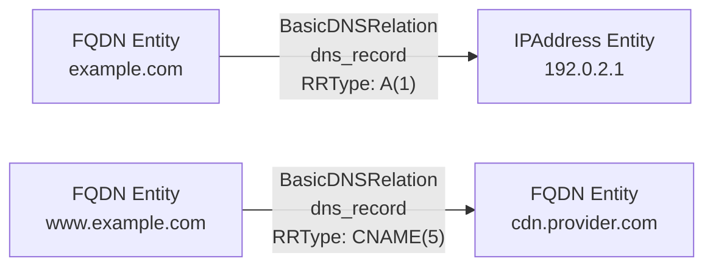

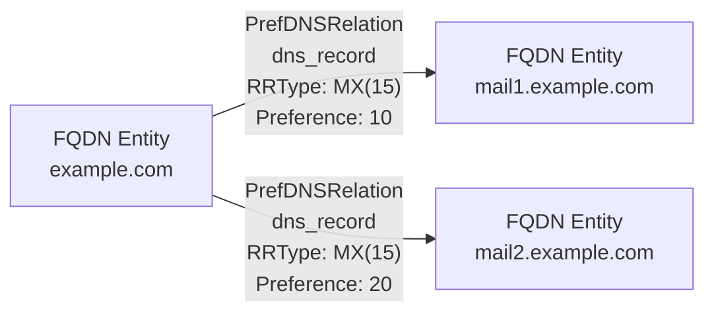

### Identity Relations

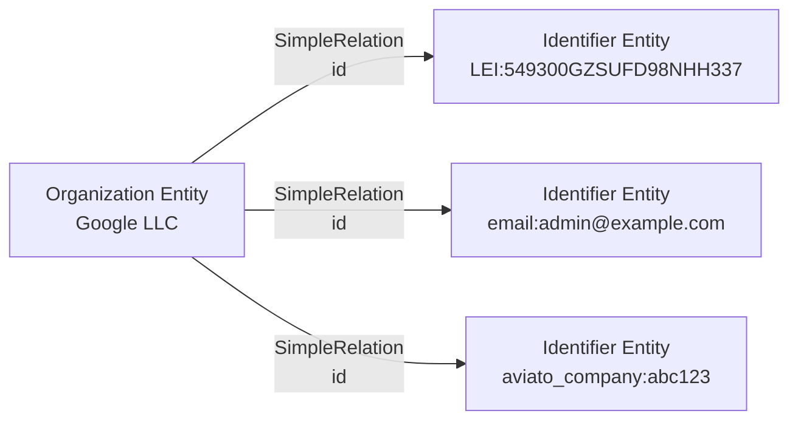

### Organizational Relations

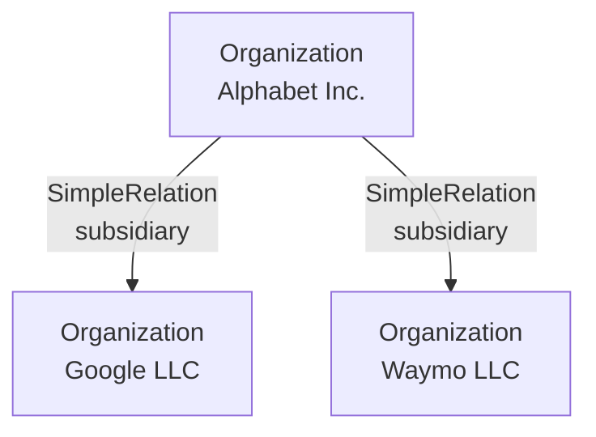

### Location Relations

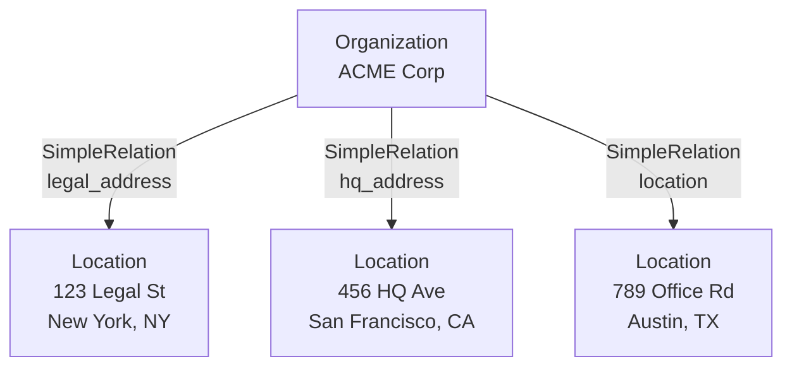

### Network Relations

```mermaid
graph LR
    FQDN["FQDN Entity<br/>web.example.com"]
    IP["IPAddress Entity<br/>192.0.2.1"]
    Service1["Service Entity<br/>HTTP on :443"]
    Service2["Service Entity<br/>SSH on :22"]

    FQDN -->|"PortRelation<br/>port: 443<br/>protocol: tcp"| Service1
    IP -->|"PortRelation<br/>port: 22<br/>protocol: tcp"| Service2
```

```mermaid
graph LR
    IP["IPAddress Entity<br/>192.0.2.1"]
    PTR["FQDN Entity<br/>1.2.0.192.in-addr.arpa"]
    Target["FQDN Entity<br/>mail.example.com"]

    IP -->|"SimpleRelation<br/>ptr_record"| PTR
    PTR -->|"BasicDNSRelation<br/>dns_record<br/>RRType: PTR(12)"| Target
```

### Domain Hierarchy (node relation)

```mermaid
graph TB
    Apex["FQDN Entity<br/>example.com"]
    Sub1["FQDN Entity<br/>www.example.com"]
    Sub2["FQDN Entity<br/>mail.example.com"]
    Sub3["FQDN Entity<br/>api.subdomain.example.com"]
    Sub4["FQDN Entity<br/>subdomain.example.com"]

    Apex -->|"SimpleRelation<br/>node"| Sub1
    Apex -->|"SimpleRelation<br/>node"| Sub2
    Apex -->|"SimpleRelation<br/>node"| Sub4
    Sub4 -->|"SimpleRelation<br/>node"| Sub3
```

### Contact Relations

```mermaid
graph TB
    DomRec["DomainRecord<br/>example.com"]
    Contact["ContactRecord<br/>Registrant Info"]
    Person["Person<br/>John Doe"]
    Org["Organization<br/>Example Corp"]
    Loc["Location<br/>123 Main St"]
    Email["Identifier<br/>email:admin@example.com"]
    Phone["Phone<br/>+1-555-1234"]

    DomRec -->|"SimpleRelation<br/>registrant_contact"| Contact
    Contact -->|"SimpleRelation<br/>person"| Person
    Contact -->|"SimpleRelation<br/>organization"| Org
    Contact -->|"SimpleRelation<br/>location"| Loc
    Contact -->|"SimpleRelation<br/>id"| Email
    Contact -->|"SimpleRelation<br/>phone"| Phone
```

Contact relation types include: `registrant_contact`, `admin_contact`, `technical_contact`, `billing_contact`, `abuse_contact`, `subject_contact`, `issuer_contact`.

### Certificate Relations

```mermaid
graph TB
    Cert["TLSCertificate<br/>Serial: ABC123"]
    CN["FQDN Entity<br/>*.example.com"]
    SAN1["FQDN Entity<br/>www.example.com"]
    SAN2["FQDN Entity<br/>api.example.com"]
    IP["IPAddress Entity<br/>192.0.2.1"]
    Email["Identifier<br/>email:admin@example.com"]
    URL["URL Entity<br/>http://ocsp.ca.com"]
    Service["Service Entity<br/>HTTPS on :443"]

    Cert -->|"SimpleRelation<br/>common_name"| CN
    Cert -->|"SimpleRelation<br/>san_dns_name"| SAN1
    Cert -->|"SimpleRelation<br/>san_dns_name"| SAN2
    Cert -->|"SimpleRelation<br/>san_ip_address"| IP
    Cert -->|"SimpleRelation<br/>san_email_address"| Email
    Cert -->|"SimpleRelation<br/>ocsp_server"| URL
    Service -->|"SimpleRelation<br/>certificate"| Cert
```

### Financial Relations

```mermaid
graph LR
    Investor["Organization<br/>VC Fund"]
    SeedAcct["Account<br/>Seed Round A"]
    Transfer["FundsTransfer<br/>$5M USD"]
    OrgAcct["Account<br/>Startup Checking"]
    Org["Organization<br/>Startup Inc."]

    Investor -->|"SimpleRelation<br/>account"| SeedAcct
    Transfer -->|"SimpleRelation<br/>sender"| SeedAcct
    Transfer -->|"SimpleRelation<br/>recipient"| OrgAcct
    Org -->|"SimpleRelation<br/>account"| OrgAcct
```

### Domain Registration Relations

```mermaid
graph TB
    DomRec["DomainRecord<br/>example.com"]
    NS1["FQDN<br/>ns1.nameserver.com"]
    NS2["FQDN<br/>ns2.nameserver.com"]
    WHOIS["FQDN<br/>whois.registry.com"]

    DomRec -->|"SimpleRelation<br/>name_server"| NS1
    DomRec -->|"SimpleRelation<br/>name_server"| NS2
    DomRec -->|"SimpleRelation<br/>whois_server"| WHOIS
```

### Source Attribution

Every edge should have a `SourceProperty` attached to track which plugin discovered the relationship and with what confidence:

```go
type SourceProperty struct {
    Source:     string  // Plugin/source name
    Confidence: int     // 0-100 confidence score
}
```

```mermaid
graph TD
    Handler["Plugin Handler"]
    CreateAssets["Create Assets"]
    CreateEdge["Create Edge"]
    AttachSource["Attach SourceProperty"]

    Handler --> CreateAssets
    CreateAssets --> CreateEdge
    CreateEdge --> AttachSource

    AttachSource -.->|"Tracks:<br/>• Plugin name<br/>• Confidence<br/>• Timestamp"| EdgeTags["Edge Tags"]
```

---

## Graph Database and Querying

### Storage Architecture Overview

```mermaid
graph TB
    subgraph "Session-Specific Storage (Temporary)"
        Cache["Cache Repository<br/>(SQLite)<br/>cache.db"]
        Queue["Queue Database<br/>(SQLite + GORM)<br/>queue.db"]
    end

    subgraph "Persistent Storage (Configurable)"
        PersistentDB["Persistent Repository<br/>SQLite: assetdb.db<br/>Postgres: Network DB<br/>Neo4j: Network DB"]
    end

    subgraph "Engine Components"
        Plugin["Plugins"]
        Dispatcher["Dispatcher"]
    end

    Plugin -->|"CreateAsset()"| Cache
    Cache -->|"Flush every 1 min"| PersistentDB

    Dispatcher -->|"Append(entity)"| Queue
    Queue -->|"Next(type, num)"| Dispatcher
    Dispatcher -->|"Processed(entity)"| Queue

    Cache -.->|"Shares entity IDs"| Queue

    style Cache fill:#f9f9f9
    style Queue fill:#f9f9f9
    style PersistentDB fill:#e8e8e8
```

### Database Connection Flow

```mermaid
graph TD
    Session["Session Creation<br/>CreateSession(cfg)"]

    Session --> SelectDBMS["selectDBMS()<br/>Parse cfg.GraphDBs"]

    SelectDBMS --> CheckType{"Database Type?"}

    CheckType -->|"postgres"| Postgres["DSN:<br/>host=X port=Y user=Z<br/>password=W dbname=N<br/>Type: sqlrepo.Postgres"]
    CheckType -->|"sqlite/sqlite3"| SQLite["DSN:<br/>&lt;dir&gt;/assetdb.db<br/>?_pragma=busy_timeout(30000)<br/>&amp;_pragma=journal_mode(WAL)<br/>Type: sqlrepo.SQLite"]
    CheckType -->|"neo4j/bolt"| Neo4j["DSN: db.URL<br/>Type: neo4j.Neo4j"]

    Postgres --> InitDB["assetdb.New(dbtype, dsn)"]
    SQLite --> InitDB
    Neo4j --> InitDB

    InitDB --> AssignDB["s.db = store"]

    AssignDB --> CreateTmp["createTemporaryDir()<br/>&lt;outdir&gt;/session-&lt;uuid&gt;"]

    CreateTmp --> CreateCache["createFileCacheRepo()<br/>&lt;tmpdir&gt;/cache.db"]

    CreateCache --> NewCache["cache.New(c, s.db, 1min)"]

    NewCache --> CreateQueue["newSessionQueue(s)<br/>&lt;tmpdir&gt;/queue.db"]

    style InitDB fill:#f9f9f9
    style NewCache fill:#f9f9f9
    style CreateQueue fill:#f9f9f9
```

### Queue and Dispatcher Workflow

```mermaid
sequenceDiagram
    participant Plugin
    participant Dispatcher
    participant SessionQueue
    participant QueueDB
    participant Cache

    Plugin->>Dispatcher: DispatchEvent(event)
    Dispatcher->>SessionQueue: Has(entity)
    SessionQueue->>QueueDB: Has(entity.ID)
    QueueDB-->>Dispatcher: false

    Dispatcher->>SessionQueue: Append(entity)
    SessionQueue->>QueueDB: Append(type, ID)

    Note over Dispatcher: Every 1 second
    Dispatcher->>SessionQueue: Next(type, 500)
    SessionQueue->>QueueDB: Next(type, 500)
    QueueDB-->>SessionQueue: [entity_ids]
    SessionQueue->>Cache: FindEntityById(id)
    Cache-->>SessionQueue: entity
    SessionQueue-->>Dispatcher: [entities]

    Dispatcher->>Pipeline: Process(entity)
    Pipeline-->>Dispatcher: Completed

    Dispatcher->>SessionQueue: Processed(entity)
    SessionQueue->>QueueDB: Processed(entity.ID)
```

### Triple-Based Graph Traversal

Amass uses **triple-based queries** to traverse the graph database. A triple is a pattern `(subject, predicate, object)` describing a relationship traversal:

```
fqdn -> dns_record -> ipaddr
ipaddr -> netblock_contains -> netblock
netblock -> asn_announcement -> as
```

The `oam_assoc` command-line tool performs graph traversal using these triples:

```bash
oam_assoc -t1 "fqdn -> dns_record -> ipaddr" -t2 "ipaddr -> netblock_contains -> netblock"
# or load from file
oam_assoc -tf triples_file.txt
```

```mermaid
graph TD
    CLI["oam_assoc CLI<br/>CLIWorkflow()"]

    CLI --> ParseArgs["Parse Arguments<br/>-t1...-t10 or -tf"]

    ParseArgs --> LoadFile{"Triple File<br/>Provided?"}

    LoadFile -->|"Yes"| ReadFile["GetListFromFile()<br/>Parse up to 10 triples"]
    LoadFile -->|"No"| ValidateTriples["Validate CLI triples"]

    ReadFile --> ValidateTriples

    ValidateTriples --> OpenDB["OpenGraphDatabase(cfg)<br/>Connect to asset-db"]

    OpenDB --> ParseTriples["Loop: triples.ParseTriple(tstr)<br/>Build []*triples.Triple"]

    ParseTriples --> Extract["triples.Extract(db, tris)<br/>Execute graph traversal"]

    Extract --> Results["Results map"]

    Results --> JSON["json.MarshalIndent(results)<br/>Pretty JSON output"]

    JSON --> Output["Print to stdout"]

    style Extract fill:#f9f9f9
    style OpenDB fill:#f9f9f9
```

### oam_subs: Subdomain Query Flow

```mermaid
graph TD
    Start["oam_subs -d domain.com"]

    Start --> GetDomain["FindEntitiesByContent()<br/>FQDN{Name: domain.com}"]

    GetDomain --> FindSubdomains["FindByFQDNScope(db, entity)<br/>Recursive subdomain discovery"]

    FindSubdomains --> BuildList["Build list of FQDN names"]

    BuildList --> GetAddrs["NamesToAddrs(db, time, names)<br/>Resolve FQDNs to IP addresses"]

    GetAddrs --> ASNLookup["ASNCache.AddrSearch(ip)<br/>Get ASN/netblock info"]

    ASNLookup --> Format["Format output with<br/>names, IPs, ASNs"]

    Format --> Print["Print summary table"]

    style FindSubdomains fill:#f9f9f9
    style GetAddrs fill:#f9f9f9
    style ASNLookup fill:#f9f9f9
```

### oam_track: Time-Based Filtering

```mermaid
graph TD
    Start["oam_track -d domain.com<br/>-since '01/02 15:04:05 2006 MST'"]

    Start --> ParseTime["time.Parse(TimeFormat, args.Since)"]

    ParseTime --> FindDomains["FindEntitiesByContent()<br/>with since filter"]

    FindDomains --> GetScope["FindByFQDNScope(db, entity, since)"]

    GetScope --> FilterAssets{"Filter assets where<br/>CreatedAt >= since<br/>AND LastSeen >= since"}

    FilterAssets --> NewAssets["Collect new asset names"]

    NewAssets --> Output["Print to stdout"]

    style FilterAssets fill:#f9f9f9
```

!!! tip "Auto-timestamp selection"
    If no `since` parameter is provided, `oam_track` automatically uses the most recent asset's `LastSeen` timestamp, truncated to midnight.

### oam_viz: Graph Data Extraction

```mermaid
graph TD
    Start["oam_viz -d domain.com<br/>-d3 / -dot / -gexf"]

    Start --> OpenDB["OpenGraphDatabase(cfg)"]

    OpenDB --> Extract["VizData(domains, start, db)<br/>Extract nodes and edges"]

    Extract --> BuildNodes["Build Node list:<br/>- FQDNs<br/>- IP addresses<br/>- Netblocks<br/>- ASNs"]

    BuildNodes --> BuildEdges["Build Edge list:<br/>- dns_record<br/>- netblock_contains<br/>- asn_announcement"]

    BuildEdges --> Format{"Output Format?"}

    Format -->|"D3"| D3["WriteD3Data()<br/>HTML + JavaScript"]
    Format -->|"DOT"| DOT["WriteDOTData()<br/>Graphviz format"]
    Format -->|"GEXF"| GEXF["WriteGEXFData()<br/>Gephi XML format"]

    D3 --> Save["Save to file"]
    DOT --> Save
    GEXF --> Save

    style Extract fill:#f9f9f9
```

---

## Database Connection Strings

=== "SQLite (Default)"

    ```
    {path}/assetdb.db?_pragma=busy_timeout(30000)&_pragma=journal_mode(WAL)
    ```

    **Pragma options:**
    - `busy_timeout(30000)` — Wait 30 seconds when database is locked
    - `journal_mode(WAL)` — Write-Ahead Logging for better concurrency

=== "PostgreSQL"

    ```
    host={host} port={port} user={user} password={password} dbname={dbname}
    ```

    ```bash
    export AMASS_DB_USER="amass"
    export AMASS_DB_PASSWORD="secret"
    export AMASS_DB_HOST="localhost"
    export AMASS_DB_PORT="5432"
    export AMASS_DB_NAME="assetdb"
    ```

=== "Neo4j"

    ```
    neo4j+s://{host}:{port}
    ```

    **Supported schemes:** `neo4j`, `neo4j+s`, `neo4j+sec`, `bolt`, `bolt+s`, `bolt+sec`

---

## Summary

| Capability | Details |
|------------|---------|
| **Standardized Assets** | OAM specification ensures consistent asset types across all plugins |
| **Three-Tier Storage** | Work queue for scheduling, cache for performance, graph DB for persistence |
| **Session Isolation** | Each enumeration session has dedicated temporary storage |
| **Flexible Backends** | SQLite for standalone use; PostgreSQL/Neo4j for production deployments |
| **Entity Wrapping** | `dbt.Entity` provides metadata layer over OAM assets |
| **Efficient Lifecycle** | Assets flow: discovery → cache → queue → pipeline → persistent storage |
| **Graph Traversal** | Triple-based queries via `oam_assoc`; direct repository API for tools |
