# DNS TTL & Caching


This page documents Amass's DNS response caching mechanisms, Time-To-Live (TTL) management, and query deduplication strategies. It explains how the system balances performance through caching with data freshness requirements, prevents redundant DNS queries, and handles DNS TTL values to avoid overloading resolvers while maintaining up-to-date reconnaissance data.

## DNS Query Retry and Timeout Strategy

Amass implements a retry mechanism for DNS queries to handle transient failures. The `PerformQuery` function attempts up to **10 retries** for each DNS query before declaring failure.

### Query Execution Flow

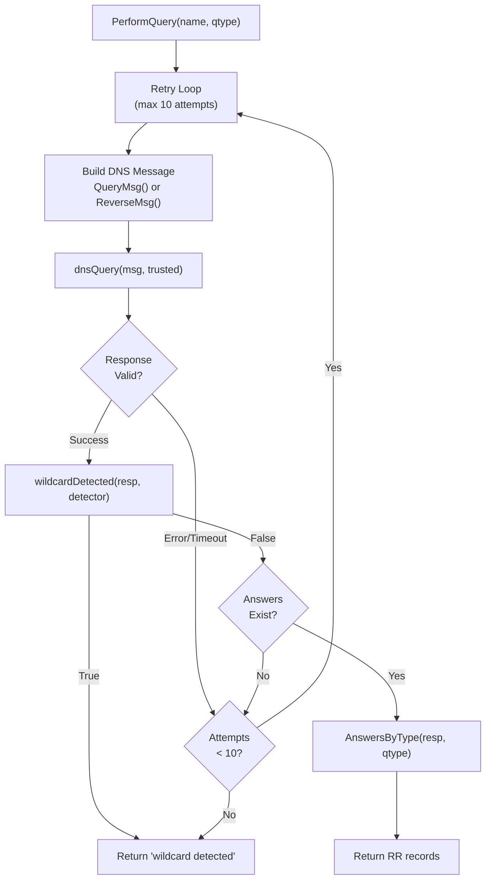

### Timeout Configuration

The DNS query timeout is hardcoded to **2 seconds** per attempt:

| Component | Timeout Value | Purpose |
|-----------|---------------|---------|
| Per-query timeout | 2 seconds | Maximum wait time for a single DNS query |
| Total retry window | ~20 seconds | Maximum time across 10 retries |
| Wildcard detector timeout | 2 seconds | Dedicated timeout for wildcard checks |

The timeout is configured at pool initialization:

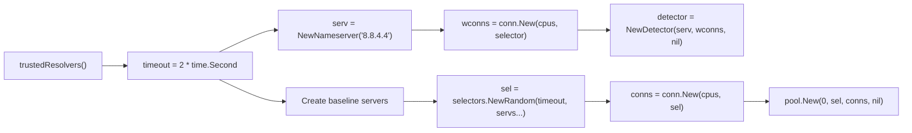

## Queries Per Second (QPS) Management

Amass implements **per-resolver rate limiting** to prevent overwhelming DNS servers. Each resolver type has different QPS limits based on trust level and capacity.

### Resolver QPS Configuration

The system maintains two tiers of resolvers:

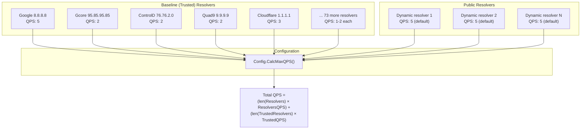

### QPS Constants and Calculation

| Constant | Value | Applied To |
|----------|-------|------------|
| `DefaultQueriesPerPublicResolver` | 5 | Dynamically fetched public resolvers |
| `DefaultQueriesPerBaselineResolver` | 15 | Trusted baseline resolvers |
| Individual baseline QPS | 1–5 | Hardcoded per resolver in baseline list |

The `CalcMaxQPS` method computes total system-wide query capacity:

```
MaxDNSQueries = (len(Resolvers) × ResolversQPS) + (len(TrustedResolvers) × TrustedQPS)
```

!!! tip "Example capacity"
    - 10 public resolvers × 5 QPS = 50 QPS
    - 78 baseline resolvers × 15 QPS = 1,170 QPS
    - **Total: ~1,220 queries per second**

## Baseline Resolver Pool

The system maintains a hardcoded list of **78 trusted public DNS resolvers** with varying QPS allocations:

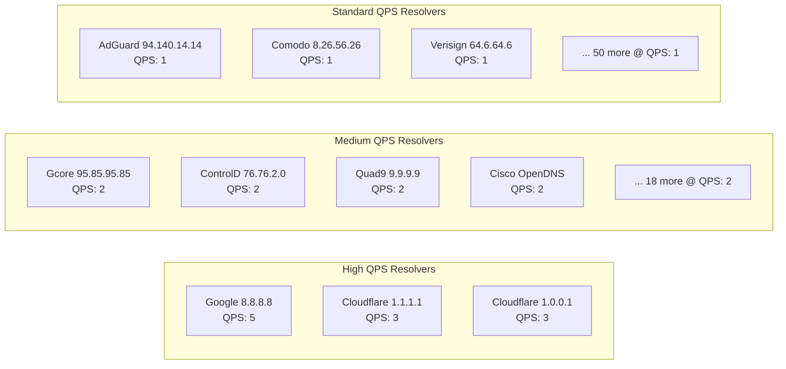

### Trusted Resolver Pool Initialization

The `trustedResolvers` function creates a connection pool with random selection:

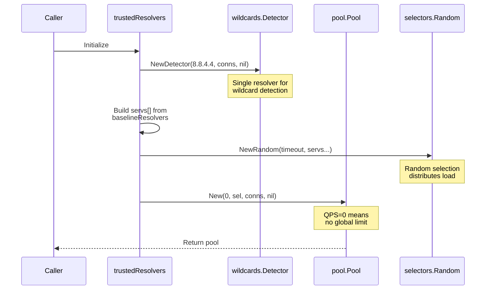

## Query Deduplication and Response Validation

Each query response undergoes multiple validation stages before being accepted.

### Response Validation Pipeline

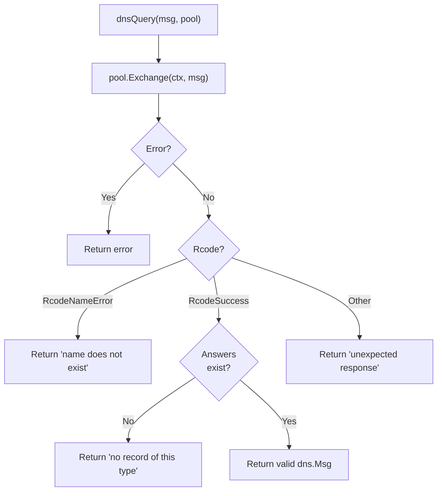

### Wildcard Detection as Cache Invalidation

Before accepting a DNS response, the system checks for wildcard patterns using eTLD+1 extraction:

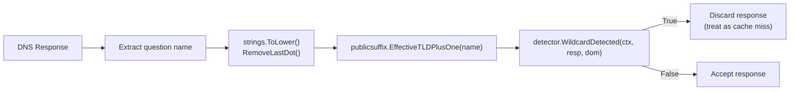

Wildcard responses are discarded to prevent false positives from polluting results. This is critical for subdomain enumeration accuracy.

## Resolver Selection Strategy

The system uses a **random selector** to distribute queries across the baseline resolver pool, preventing any single resolver from being overwhelmed:

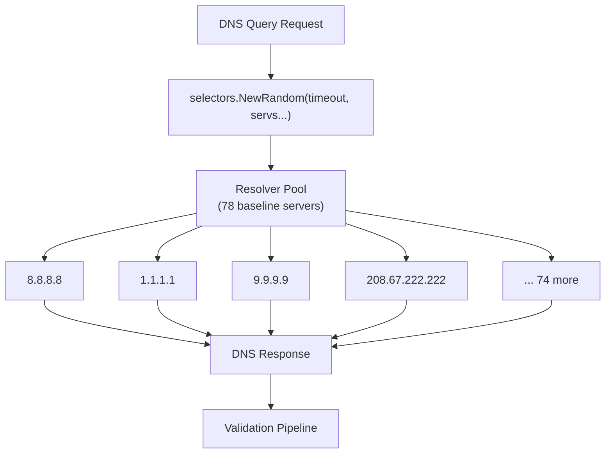

Alternative selector implementations available in the `resolve` package:

- `selectors.NewAuthoritative` — Queries authoritative nameservers directly
- `selectors.NewSingle` — Uses a single dedicated resolver

## Dynamic Public Resolver Loading

In addition to the 78 baseline trusted resolvers, Amass can dynamically fetch public DNS resolvers from `public-dns.info` with reliability filtering.

### Public Resolver Acquisition Process

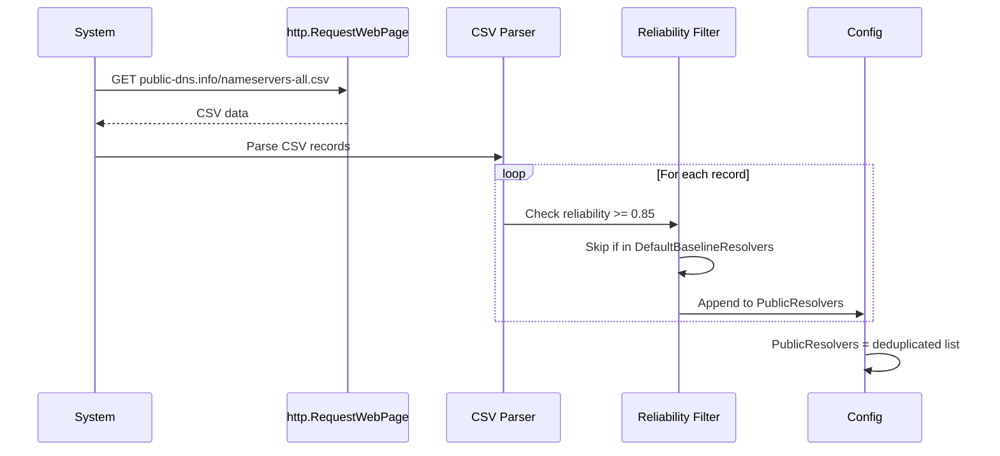

!!! info "Reliability threshold"
    Only resolvers with **≥ 85% reliability** (`minResolverReliability = 0.85`) are included. Resolvers already in `DefaultBaselineResolvers` are excluded to avoid double-counting.

## TTL Handling and Cache Expiration

While explicit TTL extraction is handled by the underlying `resolve` package, the system's architecture implies TTL-based caching through the resolver pool abstraction.

### Implied TTL Workflow

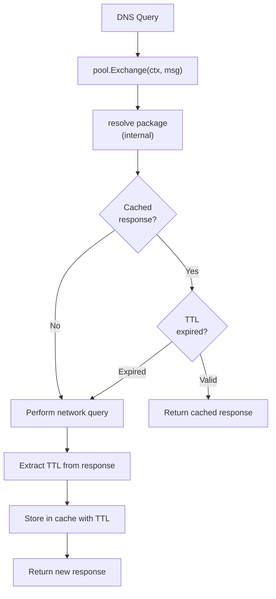

**Key caching principles:**

1. DNS responses contain TTL values (time-to-live in seconds)
2. The resolver pool caches responses until TTL expiration
3. Expired cache entries trigger new network queries
4. Wildcard responses are excluded from caching (treated as invalid)

## Data Freshness Strategy

The retry mechanism combined with TTL-based caching ensures data freshness while preventing excessive load on DNS infrastructure:

| Mechanism | Purpose | Implementation |
|-----------|---------|----------------|
| **Retry loops** | Overcome transient failures | 10 attempts per query |
| **TTL respect** | Honor authoritative cache times | Implicit in resolver pool |
| **Wildcard filtering** | Prevent false positive caching | Per-response validation |
| **QPS limiting** | Sustainable query rates | Per-resolver QPS caps |
| **Multiple resolvers** | Redundancy and validation | 78 baseline + dynamic public |

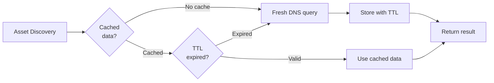

## Configuration API

### Resolver Management Methods

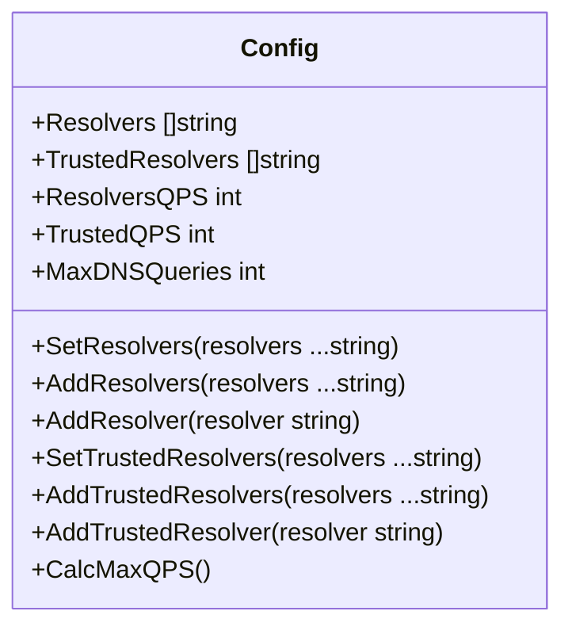

| Method | Behaviour |
|--------|-----------|
| `SetResolvers` | Replaces entire resolver list (calls `AddResolvers` internally) |
| `AddResolvers` | Appends multiple resolvers, deduplicates, recalculates QPS |
| `AddResolver` | Appends single resolver with trim and deduplication |
| `CalcMaxQPS` | Updates `MaxDNSQueries` based on resolver counts and QPS settings |

### File-Based Resolver Loading

Resolvers can be loaded from configuration files containing IP addresses:

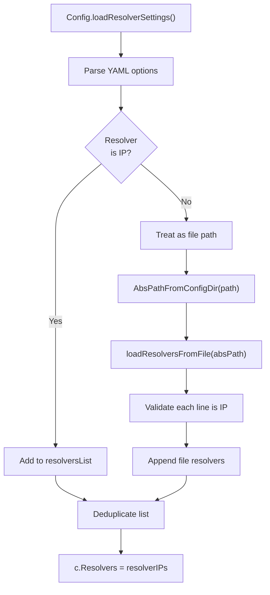

!!! info "File format"
    - One IP address per line
    - Empty lines are skipped
    - Invalid IPs cause loading failure
    - Automatic deduplication is applied

## Summary

Amass's TTL and caching strategy balances performance with data accuracy through:

1. **Multi-tier resolver architecture** — 78 baseline trusted + dynamic public resolvers
2. **Per-resolver QPS limits** — Prevent overwhelming individual DNS servers (1–5 QPS each)
3. **Retry mechanism** — Up to 10 attempts with 2-second timeouts per attempt
4. **Random load distribution** — Selector randomises resolver choice across the pool
5. **Wildcard filtering** — Prevents false positive caching via EffectiveTLD+1 validation
6. **TTL-based expiration** — Respects DNS authoritative cache timing (handled by `resolve` package)
7. **Configuration flexibility** — File-based and programmatic resolver management

This design enables sustainable reconnaissance at scale (1,000+ QPS total capacity) while respecting DNS infrastructure limits.

## Related

- [Engine Core](engine-core.md) — Overview of the Amass engine components
- [Event Dispatcher](event-dispatcher.md) — Event routing and session management
- [Plugin Registry & Pipelines](plugin-registry.md) — DNS plugin handlers and pipeline priorities
- [DNS Wildcard Detection](dns-wildcard.md) — Wildcard detection algorithm and integration
