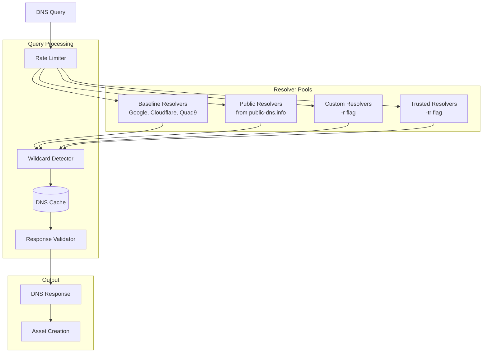
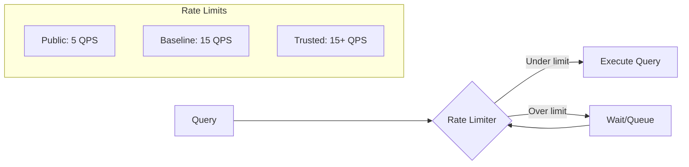
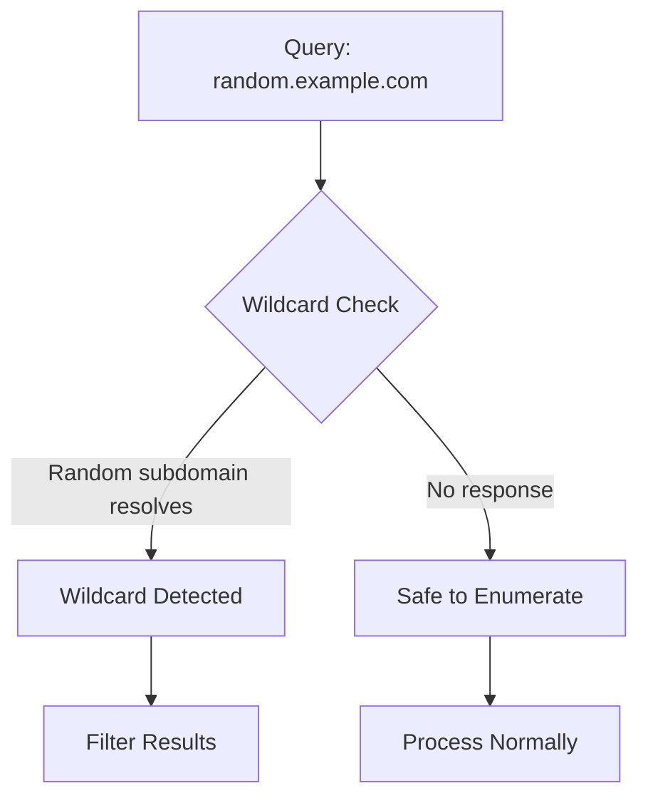
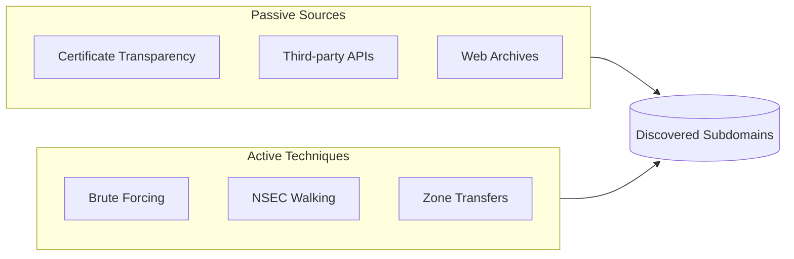
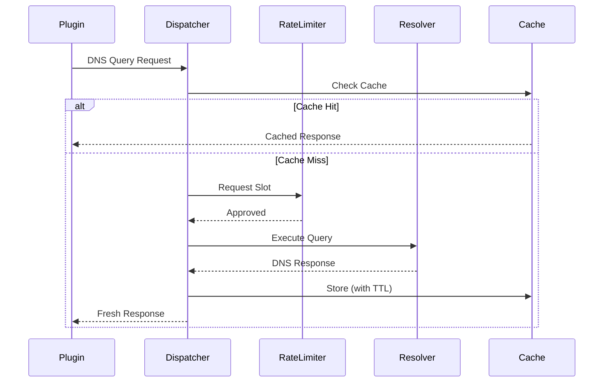

# DNS System

Amass implements a sophisticated DNS resolution system with multiple resolver pools, intelligent rate limiting, wildcard detection, and caching.

## Resolver Architecture



## Resolver Types

| Type | Description | Default QPS |
|------|-------------|-------------|
| **Baseline** | Curated reliable resolvers (Google 8.8.8.8, Cloudflare 1.1.1.1, Quad9 9.9.9.9) | 15 |
| **Public** | Dynamic pool from public-dns.info with reliability filtering | 5 |
| **Custom** | User-specified via `-r` flag | Configurable |
| **Trusted** | High-priority resolvers via `-tr` flag | 15+ |

## Rate Limiting

The system enforces strict query rate limits per resolver:



### Configuration Flags

| Flag | Description | Default |
|------|-------------|---------|
| `-dns-qps` | Maximum total DNS queries per second | Unlimited |
| `-rqps` | Max QPS per untrusted resolver | 5 |
| `-trqps` | Max QPS per trusted resolver | 15 |

## Wildcard Detection

The wildcard detector prevents false positives from catch-all DNS configurations:



### Detection Method

1. Generate random subdomain string
2. Query `random-string.target.com`
3. If resolves → domain has wildcard DNS
4. Filter subsequent results against wildcard response

## DNS Caching

Responses are cached respecting TTL values:

| Cache Layer | Storage | TTL |
|-------------|---------|-----|
| **In-Memory** | Session cache | Query duration |
| **File** | Disk cache | DNS TTL |
| **Database** | Graph DB | Permanent |

## DNS Discovery Handlers

The DNS plugin ecosystem includes specialized handlers executed by priority:

| Handler | Priority | Function |
|---------|----------|----------|
| DNS TXT Handler | 1 | Extract TXT record data (SPF, DKIM, etc.) |
| DNS CNAME Handler | 2 | Follow CNAME relationships |
| DNS IP Handler | 3 | Resolve A/AAAA records |
| DNS Subdomain Handler | 4 | Enumerate subdomains |
| DNS Apex Handler | 5 | Analyze root domain records |
| DNS Reverse Handler | 8 | Perform reverse DNS lookups |

## DNS Discovery Techniques

### Subdomain Enumeration



### Techniques

| Technique | Description | Mode |
|-----------|-------------|------|
| **Brute Forcing** | Wordlist-based subdomain guessing | Active |
| **NSEC Walking** | Exploit DNSSEC NSEC/NSEC3 records | Active |
| **Zone Transfer** | AXFR queries (rarely successful) | Active |
| **Reverse DNS** | PTR record lookups from IPs | Active |
| **Certificate Transparency** | CT log analysis | Passive |
| **API Queries** | Third-party data sources | Passive |

### Brute Force Configuration

| Flag | Description |
|------|-------------|
| `-brute` | Enable brute forcing |
| `-w` | Custom wordlist path |
| `-min-for-recursive` | Minimum discoveries before recursive brute forcing |
| `-max-depth` | Maximum subdomain label depth |

## DNS Resolution Flow



## Feedback Loop

Discovered assets generate new DNS queries, enabling cascading discovery:

```
example.com (seed)
    │
    ├─► DNS Resolution → 192.0.2.1
    │   └─► Reverse DNS → mail.example.com (new FQDN)
    │       └─► DNS Resolution → 192.0.2.10
    │
    ├─► TXT Records → SPF includes mx.example.com
    │   └─► DNS Resolution (new FQDN queued)
    │
    └─► Certificate → SAN: api.example.com
        └─► DNS Resolution (new FQDN queued)
```

## Best Practices

!!! tip "DNS Performance"
    - Use trusted resolvers (`-tr`) for higher throughput
    - Set appropriate rate limits to avoid resolver blocks
    - Enable caching for repeated queries
    - Use passive mode (`-passive`) for stealth reconnaissance

!!! warning "Rate Limiting"
    Aggressive DNS queries can trigger rate limiting or blocks from DNS providers. Always respect the configured QPS limits.
