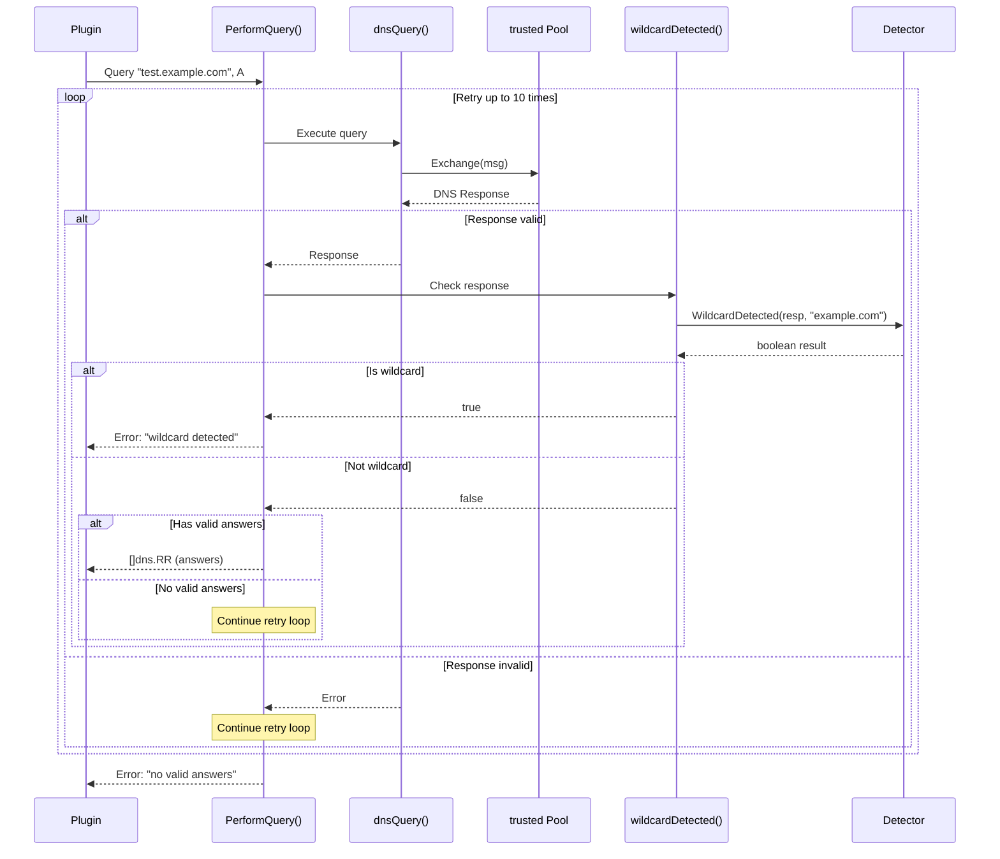
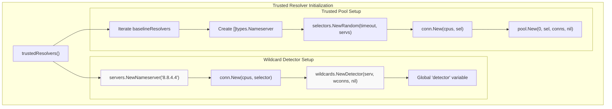

# DNS Wildcard Detection

## Purpose and Scope

This page describes the wildcard DNS detection mechanism in Amass, which prevents false positive domain discoveries caused by wildcard DNS records. Wildcard detection is a critical filtering step that runs during DNS query resolution to ensure enumeration accuracy.

## Overview of DNS Wildcards

DNS wildcard records allow administrators to configure a single DNS record that matches all subdomains under a domain. For example, a wildcard record `*.example.com` will resolve any previously undefined subdomain like `random123.example.com` or `nonexistent.example.com` to the same IP address.

!!! warning "Problem for Reconnaissance"
    During subdomain enumeration, wildcard records create false positives. If Amass queries `test-abcd1234.example.com` and receives a valid DNS response, it cannot determine whether this subdomain legitimately exists or is simply matching a wildcard record. Without wildcard detection, enumeration results would be polluted with thousands of non-existent subdomains that all resolve to the same wildcard IP.

## Architecture Overview

The wildcard detection system operates independently from the main DNS resolver pool, using a dedicated single resolver for consistency.

```mermaid
graph TB
    subgraph "DNS Query Flow"
        Q[DNS Query Request]
        PQ["PerformQuery()"]
        TP["trusted Pool"]
        DQ["dnsQuery()"]
        R["DNS Response"]
    end
    
    subgraph "Wildcard Detection System"
        WD["wildcards.Detector<br/>(global variable)"]
        WDF["wildcardDetected()"]
        ETLD["publicsuffix.EffectiveTLDPlusOne()"]
        WDM["Detector.WildcardDetected()"]
    end
    
    subgraph "Dedicated Wildcard Resolver"
        GD["8.8.4.4<br/>(Google DNS Secondary)"]
        WC["conn.New() for detector"]
    end
    
    Q --> PQ
    PQ --> DQ
    DQ --> TP
    TP --> R
    R --> WDF
    
    WDF --> ETLD
    ETLD --> WDM
    WDM --> WD
    WD --> GD
    WD --> WC
    
    WDF -.."wildcard detected".-> PQ
    
    style WD fill:#f9f9f9
    style GD fill:#f9f9f9
    style WDF fill:#f9f9f9
```

### Key Components

| Component | Type | Purpose |
|-----------|------|---------|
| `detector` | `*wildcards.Detector` | Global singleton wildcard detector instance |
| `wildcardDetected()` | Function | Checks if a DNS response matches a wildcard pattern |
| `8.8.4.4` | Nameserver | Google DNS Secondary used exclusively for wildcard detection |
| `EffectiveTLDPlusOne` | Function | Extracts the registered domain (eTLD+1) from an FQDN |

## Detection Algorithm

### EffectiveTLD+1 Extraction

The detection algorithm first extracts the **EffectiveTLD+1** (eTLD+1) from the queried domain — the registered domain name:

| Input | eTLD+1 Result |
|-------|---------------|
| `www.test.example.com` | `example.com` |
| `api.staging.company.co.uk` | `company.co.uk` |
| `subdomain.github.io` | `github.io` |

This extraction is critical because wildcard detection must be performed at the registered domain level. If `*.example.com` is a wildcard, then all subdomains under `example.com` will match it regardless of depth.

```go
if dom, err := publicsuffix.EffectiveTLDPlusOne(name); err == nil && dom != "" {
    return r.WildcardDetected(context.TODO(), resp, dom)
}
```

The function uses the `golang.org/x/net/publicsuffix` package, which implements the Public Suffix List algorithm to correctly identify registered domains across all TLDs, including complex cases like `.co.uk` and `.gov.au`.

## Integration with DNS Query Execution

Wildcard detection is integrated into the main DNS query path through the `PerformQuery()` function:



### Retry Logic

`PerformQuery()` implements a retry mechanism with up to **10 attempts**. For each attempt:

1. Query is sent via the `trusted` resolver pool
2. Response is validated by `dnsQuery()`
3. If valid, wildcard detection is performed
4. If wildcard is detected, the query **fails immediately** with `"wildcard detected"`
5. If not a wildcard but no valid answers, retry continues
6. If valid non-wildcard answers exist, they are returned

!!! info "Fail fast on wildcards"
    Wildcard detection causes an immediate failure with no further retries, preventing the retry loop from generating false positives.

## Initialization and Configuration

The wildcard detector is initialized as part of the trusted resolver pool setup:



### Single Resolver Design

The wildcard detector uses a **single dedicated resolver** (`8.8.4.4`) rather than the pool of 78+ resolvers used for regular queries:

| Aspect | Benefit |
|--------|---------|
| **Consistency** | All wildcard checks use the same resolver, eliminating variability |
| **Reliability** | Google's DNS service has high uptime and consistent behaviour |
| **Simplicity** | Avoids resolver-specific wildcard handling logic |
| **Performance** | Dedicated connection pool prevents contention with regular query traffic |

```go
serv := servers.NewNameserver("8.8.4.4")
wconns := conn.New(cpus, selectors.NewSingle(timeout, serv))
detector = wildcards.NewDetector(serv, wconns, nil)
```

## Implementation Details

### Global State Management

The wildcard detector is a **global singleton**:

```go
var detector *wildcards.Detector
```

Initialized once during the first call to `trustedResolvers()` and remains available for the process lifetime. The global design allows all DNS query operations to share a single detector instance without explicit dependency injection.

### Connection Pool Sizing

The detector's connection pool is sized based on the number of CPU cores:

```go
cpus := runtime.NumCPU()
wconns := conn.New(cpus, selectors.NewSingle(timeout, serv))
```

This ensures the detector can handle concurrent wildcard checks proportional to the system's parallelism capabilities.

### Error Handling

The `wildcardDetected()` function returns `false` (not a wildcard) if it cannot extract the eTLD+1:

```go
if dom, err := publicsuffix.EffectiveTLDPlusOne(name); err == nil && dom != "" {
    return r.WildcardDetected(context.TODO(), resp, dom)
}
return false
```

!!! tip "Fail-safe behaviour"
    If the domain cannot be properly parsed (e.g., invalid format, local domain), the system assumes it is **not** a wildcard and allows the result through. This avoids blocking legitimate results due to parsing errors.

### Dependencies

| Library | Purpose | Import Path |
|---------|---------|-------------|
| `resolve/wildcards` | Core wildcard detection logic | `github.com/owasp-amass/resolve/wildcards` |
| `publicsuffix` | eTLD+1 extraction | `golang.org/x/net/publicsuffix` |

The actual wildcard detection algorithm is implemented in the external `owasp-amass/resolve` library, keeping the detection logic separate from the main Amass engine.

## Related

- [Engine Core](engine-core.md) — Overview of the Amass engine components
- [Event Dispatcher](event-dispatcher.md) — How events are routed to DNS processing plugins
- [Plugin Registry & Pipelines](plugin-registry.md) — DNS plugin handler registration and priorities
- [DNS TTL & Caching](dns-caching.md) — Resolver pool, retry strategy, and QPS limits
