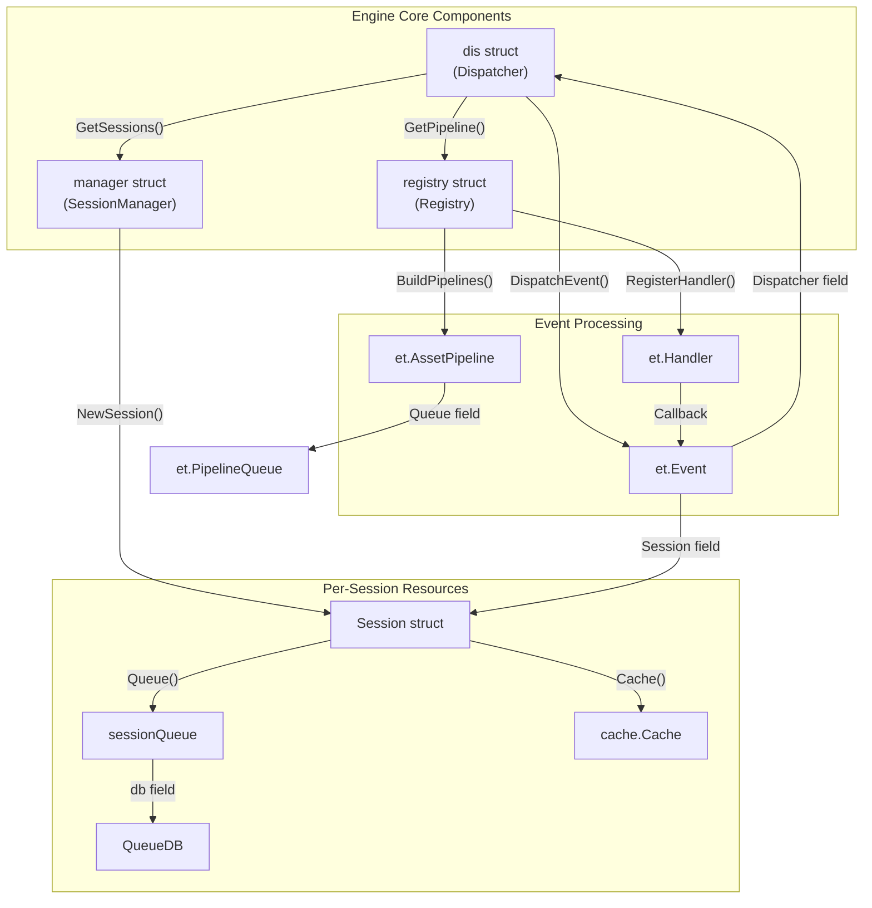
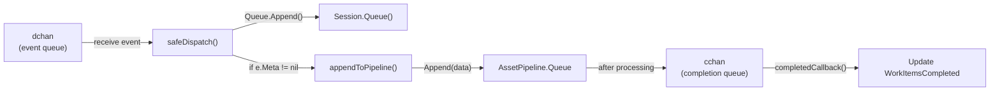
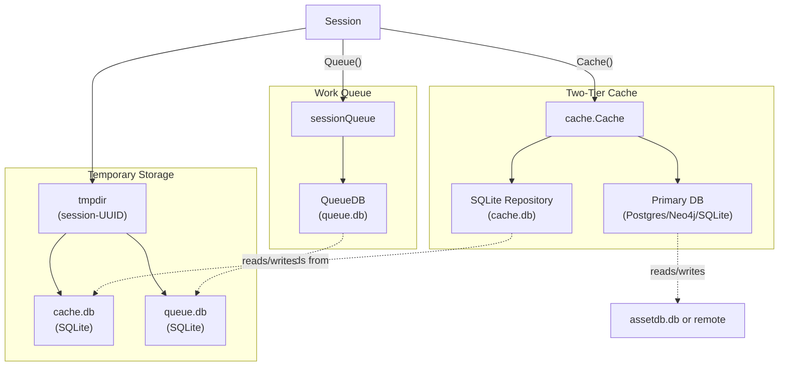
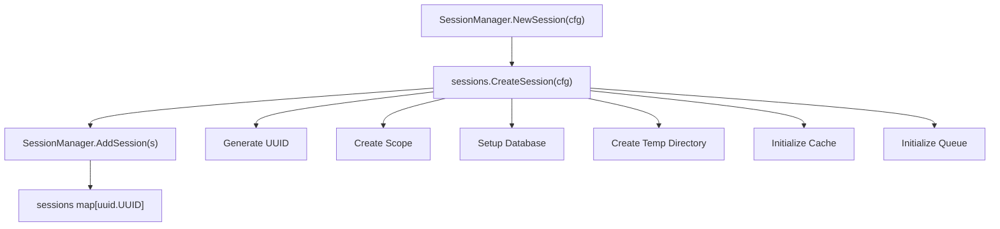
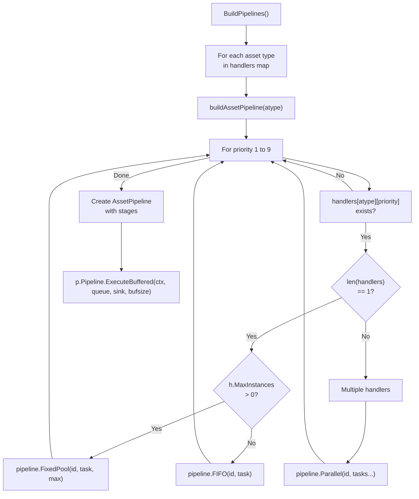
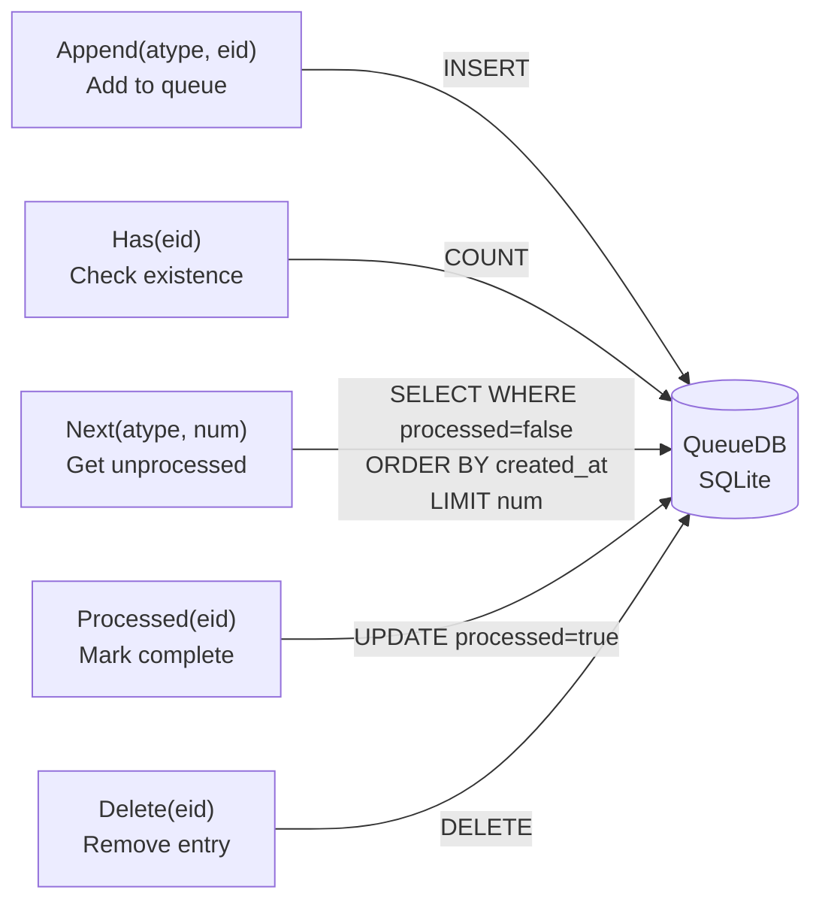
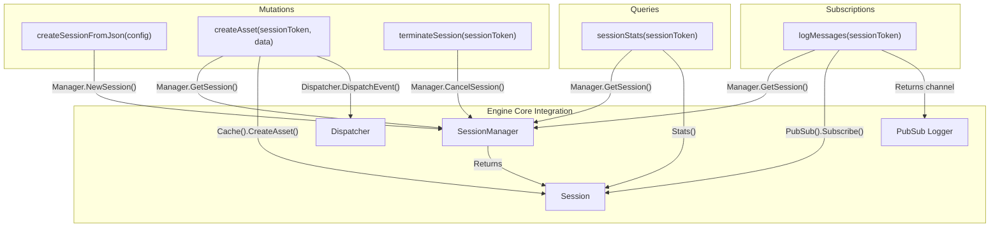

# Engine Core

The Engine Core is the orchestration layer that manages the lifecycle of enumeration sessions, dispatches events to plugins, and coordinates the overall discovery process. It consists of three primary components: the **Dispatcher** (event routing), the **SessionManager** (session lifecycle management), and the **Registry** (plugin management and pipeline construction). These components work together to enable Amass's event-driven architecture where discovered assets trigger cascading plugin executions.

## Core Components Overview

Three interfaces define the contracts for the Engine Core components:

| Interface | Purpose |
|-----------|---------|
| `et.Dispatcher` | Routes events to asset pipelines |
| `et.SessionManager` | Manages multiple concurrent sessions |
| `et.Registry` | Registers plugins and builds pipelines |

**Component Interaction Diagram**



## Dispatcher

The Dispatcher is responsible for routing events to appropriate asset pipelines and managing the completion callbacks.

### Dispatcher Structure

```go
type dis struct {
    logger *slog.Logger
    reg    et.Registry
    mgr    et.SessionManager
    done   chan struct{}
    dchan  chan *et.Event
    cchan  chan *et.EventDataElement
}
```

The `dchan` receives new events for dispatching, while `cchan` receives completed event data elements for callback processing. The Dispatcher maintains references to both the Registry (for pipeline lookups) and SessionManager (for pulling work from queues).

### Event Dispatching Flow

The `DispatchEvent()` method performs validation before queueing events:

1. Validates event is non-nil with associated session and entity
2. Checks that the session has not been terminated
3. Queues the event to `dchan` for asynchronous processing

The `maintainPipelines()` goroutine processes events in a loop:



### Queue Filling Mechanism

Every second, the Dispatcher proactively fills pipeline queues by pulling work from session queues. The `fillPipelineQueues()` method:

1. Iterates through all active sessions via `mgr.GetSessions()`
2. Identifies pipelines with queue length below `MinPipelineQueueSize` (100)
3. Requests up to `MaxPipelineQueueSize / len(sessions)` entities per session per asset type
4. Wraps each entity in an `et.Event` and appends to the appropriate pipeline

| Constant | Value | Purpose |
|----------|-------|---------|
| `MinPipelineQueueSize` | 100 | Threshold to trigger queue refilling |
| `MaxPipelineQueueSize` | 500 | Maximum items distributed per fill cycle |

### Memory Management

The Dispatcher includes a memory management mechanism that triggers manual garbage collection when heap allocation exceeds the next GC threshold by more than 500MB:

```go
func checkOnTheHeap() {
    var mstats runtime.MemStats
    runtime.ReadMemStats(&mstats)
    
    if diff := mstats.HeapAlloc - mstats.NextGC; bToMb(diff) > 500 {
        runtime.GC()
    }
}
```

This check runs every 10 seconds via the `mtick` timer in `maintainPipelines()`.

## Session Architecture

A Session represents a single enumeration execution with its own configuration, scope, database connections, and work queue. Sessions are isolated from each other, allowing multiple concurrent enumerations.

### Session Structure

```go
type Session struct {
    id       uuid.UUID
    log      *slog.Logger
    ps       *pubsub.Logger
    cfg      *config.Config
    scope    *scope.Scope
    db       repository.Repository
    queue    *sessionQueue
    dsn      string
    dbtype   string
    cache    *cache.Cache
    ranger   cidranger.Ranger
    tmpdir   string
    stats    *et.SessionStats
    done     chan struct{}
    finished bool
}
```

**Session Resource Diagram**

```mermaid
graph TB
    Session["Session struct"]
    
    subgraph "Configuration & Identity"
        ID["id: uuid.UUID"]
        Config["cfg: *config.Config"]
        Scope["scope: *scope.Scope"]
    end
    
    subgraph "Logging & Communication"
        Logger["log: *slog.Logger"]
        PubSub["ps: *pubsub.Logger"]
    end
    
    subgraph "Storage Layer"
        DB["db: repository.Repository<br/>(Neo4j/Postgres/SQLite)"]
        Cache["cache: *cache.Cache"]
        DSN["dsn: string<br/>dbtype: string"]
    end
    
    subgraph "Work Management"
        Queue["queue: *sessionQueue"]
        TmpDir["tmpdir: string"]
        Stats["stats: *et.SessionStats"]
    end
    
    subgraph "Network Utilities"
        Ranger["ranger: cidranger.Ranger"]
    end
    
    subgraph "Lifecycle"
        Done["done: chan struct{}"]
        Finished["finished: bool"]
    end
    
    Session --> ID
    Session --> Config
    Session --> Scope
    Session --> Logger
    Session --> PubSub
    Session --> DB
    Session --> Cache
    Session --> DSN
    Session --> Queue
    Session --> TmpDir
    Session --> Stats
    Session --> Ranger
    Session --> Done
    Session --> Finished
```



### Session Initialization

The `CreateSession()` function initializes all session resources:

1. **UUID Generation**: Creates unique identifier via `uuid.New()`
2. **Scope Creation**: Builds scope from config via `scope.CreateFromConfigScope(cfg)`
3. **Database Setup**: Calls `setupDB()` which determines database type (SQLite/Postgres/Neo4j) from `cfg.GraphDBs`
4. **Temporary Directory**: Creates session-specific temp directory in output directory
5. **Cache Initialization**: Creates two-tier cache system with SQLite backing store
6. **Queue Creation**: Initializes `sessionQueue` with dedicated SQLite database

### Database Selection Logic

The `selectDBMS()` method processes the `GraphDBs` configuration to determine the primary database:

| Database System | DSN Format | Type Constant |
|-----------------|------------|---------------|
| `postgres` | `host=%s port=%s user=%s password=%s dbname=%s` | `sqlrepo.Postgres` |
| `sqlite`/`sqlite3` | `{outputdir}/assetdb.db?_pragma=...` | `sqlrepo.SQLite` |
| `neo4j`/`bolt` | Direct URL from config | `neo4j.Neo4j` |

The DSN includes SQLite pragmas for concurrency: `busy_timeout(30000)` and `journal_mode(WAL)`.

### Cache and Storage Architecture

Sessions maintain a two-tier storage architecture:



The cache is initialized with a 1-minute TTL:

```go
s.cache, err = cache.New(c, s.db, time.Minute)
```

This two-tier design allows fast access to recently used entities while persisting all discoveries to the primary database.

### Session Statistics

The `et.SessionStats` struct tracks work progress:

```go
type SessionStats struct {
    sync.Mutex
    WorkItemsCompleted int
    WorkItemsTotal     int
}
```

Statistics are updated by the Dispatcher:
- `WorkItemsTotal` incremented when `DispatchEvent()` adds to queue
- `WorkItemsCompleted` incremented by `completedCallback()`

## SessionManager

The SessionManager maintains a registry of active sessions and coordinates their lifecycle:

```go
type manager struct {
    sync.RWMutex
    logger   *slog.Logger
    sessions map[uuid.UUID]et.Session
}
```

### Session Lifecycle Operations

**Session Creation Flow**



### Session Termination

The `CancelSession()` method performs graceful shutdown:

1. **Signal Termination**: Calls `session.Kill()` to close the `done` channel
2. **Wait for Completion**: Polls `SessionStats` until `WorkItemsCompleted >= WorkItemsTotal`
3. **Resource Cleanup**: Close queue DB, cache, CIDR ranger, temp directory, primary DB, and removes from map

The polling mechanism uses a 500ms ticker to avoid busy waiting:

```go
t := time.NewTicker(500 * time.Millisecond)
defer t.Stop()

for range t.C {
    ss := s.Stats()
    ss.Lock()
    total := ss.WorkItemsTotal
    completed := ss.WorkItemsCompleted
    ss.Unlock()
    if completed >= total {
        break
    }
}
```

### Concurrent Session Management

The manager uses `sync.RWMutex` to allow concurrent read access while serializing writes:

| Operation | Lock Type | Purpose |
|-----------|-----------|---------|
| `AddSession()` | Write Lock | Add to `sessions` map |
| `GetSession()` | Read Lock | Lookup by UUID |
| `GetSessions()` | Read Lock | Return all sessions slice |
| `CancelSession()` | Write Lock (deferred) | Cleanup and delete |

The `Shutdown()` method cancels all sessions concurrently using `sync.WaitGroup`.

## Registry and Pipeline Building

The Registry manages plugin registration and constructs asset pipelines based on registered handlers.

### Handler Registration

Plugins register handlers via `Registry.RegisterHandler()`. Each `Handler` struct specifies:

```go
type Handler struct {
    Plugin       Plugin
    Name         string
    Priority     int              // 1-9, lower = higher priority
    MaxInstances int              // 0 = unlimited
    EventType    oam.AssetType   // Asset type this handles
    Transforms   []string         // Transformation permissions
    Callback     func(*Event) error
}
```

**Handler Priority System**

| Priority Range | Typical Handlers | Execution Stage |
|----------------|------------------|-----------------|
| 1-3 | DNS TXT, CNAME, IP resolution | Initial discovery |
| 4-6 | Subdomain enumeration, Apex detection | Expansion |
| 7-9 | Enrichment, reverse DNS, service probing | Deep analysis |

### Pipeline Construction

The `BuildPipelines()` method constructs a pipeline for each asset type that has registered handlers. The `buildAssetPipeline()` function creates pipelines as follows:



### Pipeline Queue Interface

The `PipelineQueue` struct wraps `queue.Queue` and implements the `pipeline.InputSource` interface:

```go
type PipelineQueue struct {
    queue.Queue
}

func (pq *PipelineQueue) Next(ctx context.Context) bool
func (pq *PipelineQueue) Data() pipeline.Data
func (pq *PipelineQueue) Error() error
```

The `Next()` method blocks until data is available or context is cancelled, and `Data()` extracts `EventDataElement` instances while filtering out events from terminated sessions.

## Work Queue System

Each session maintains a dedicated work queue implemented as a SQLite database.

### Queue Database Schema

The `QueueDB` uses GORM with a single table:

```go
type Element struct {
    ID        uint64    `gorm:"primaryKey;column:id"`
    CreatedAt time.Time `gorm:"index:idx_created_at,sort:asc"`
    UpdatedAt time.Time
    Type      string    `gorm:"index:idx_etype;column:etype"`
    EntityID  string    `gorm:"index:idx_entity_id,unique;column:entity_id"`
    Processed bool      `gorm:"index:idx_processed;column:processed"`
}
```

**Indexes for Performance**

| Index | Purpose |
|-------|---------|
| `idx_created_at` | Ordered retrieval of oldest unprocessed items |
| `idx_etype` | Fast filtering by asset type |
| `idx_entity_id` | Unique constraint and fast lookups |
| `idx_processed` | Filtering processed vs unprocessed |

### Queue Operations



The `Next()` method queries:

```sql
SELECT * FROM elements 
WHERE etype = ? AND processed = ? 
ORDER BY created_at ASC 
LIMIT ?
```

This ensures FIFO processing within each asset type while allowing different asset types to be processed in parallel.

## Event Processing Flow

The complete event processing flow integrates all Engine Core components:

```mermaid
graph TB
    Start["Event Source<br/>(Plugin or User Input)"]
    
    subgraph "1. Event Dispatch"
        DispatchEvent["Dispatcher.DispatchEvent(e)"]
        Validate["Validate event<br/>session, entity"]
        SendToDchan["Send to dchan"]
    end
    
    subgraph "2. Queue Management"
        SafeDispatch["safeDispatch(e)"]
        CheckDuplicate["Queue.Has(entity)?"]
        AppendQueue["Queue.Append(entity)"]
        CheckMeta{"e.Meta != nil?"}
        AppendPipeline["appendToPipeline(e)"]
    end
    
    subgraph "3. Pipeline Processing"
        GetPipeline["Registry.GetPipeline(assetType)"]
        CreateEDE["NewEventDataElement(e)"]
        MarkProcessed["Queue.Processed(entity)"]
        PipelineQueue["AssetPipeline.Queue.Append(data)"]
    end
    
    subgraph "4. Handler Execution"
        PipelineExec["Pipeline.ExecuteBuffered()"]
        HandlerTask["handlerTask()"]
        CheckTransform["Transformation filtering"]
        CallbackExec["Handler.Callback(event)"]
    end
    
    subgraph "5. Completion"
        Sink["makeSink()"]
        SendToCchan["Send to cchan"]
        CompletedCallback["completedCallback(ede)"]
        UpdateStats["Update WorkItemsCompleted"]
    end
    
    Start --> DispatchEvent
    DispatchEvent --> Validate
    Validate --> SendToDchan
    SendToDchan --> SafeDispatch
    
    SafeDispatch --> CheckDuplicate
    CheckDuplicate -->|No| AppendQueue
    CheckDuplicate -->|Yes| End1[Return]
    AppendQueue --> CheckMeta
    CheckMeta -->|Yes| AppendPipeline
    CheckMeta -->|No| End2[Return]
    
    AppendPipeline --> GetPipeline
    GetPipeline --> CreateEDE
    CreateEDE --> MarkProcessed
    MarkProcessed --> PipelineQueue
    
    PipelineQueue --> PipelineExec
    PipelineExec --> HandlerTask
    HandlerTask --> CheckTransform
    CheckTransform -->|Allowed| CallbackExec
    CheckTransform -->|Denied| Sink
    CallbackExec --> Sink
    
    Sink --> SendToCchan
    SendToCchan --> CompletedCallback
    CompletedCallback --> UpdateStats
```



!!! info "Key Decision Points"
    - **Duplicate Detection**: `Queue.Has()` prevents processing same entity multiple times
    - **Meta Check**: Events without `Meta` are queued but not immediately dispatched to a pipeline
    - **Transformation Filtering**: Handler execution is gated by config transformations

### GraphQL API Integration

The Engine Core exposes session management through a GraphQL API. Key mutations and queries:



## Related

- [Event Dispatcher](event-dispatcher.md) — Deep dive into event routing, queue filling, and completion callbacks
- [Plugin Registry & Pipelines](plugin-registry.md) — Handler registration, pipeline construction, and priority system
- [DNS Wildcard Detection](dns-wildcard.md) — How wildcard DNS records are filtered during enumeration
- [DNS TTL & Caching](dns-caching.md) — Query retry, timeout, and resolver pool management
