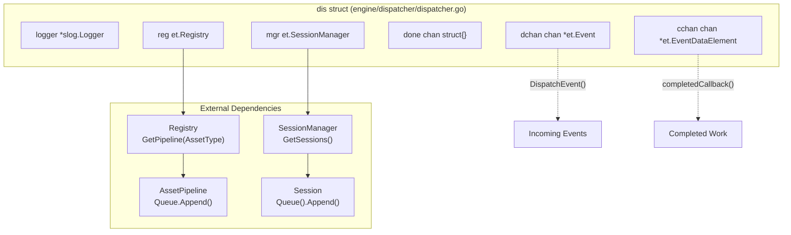
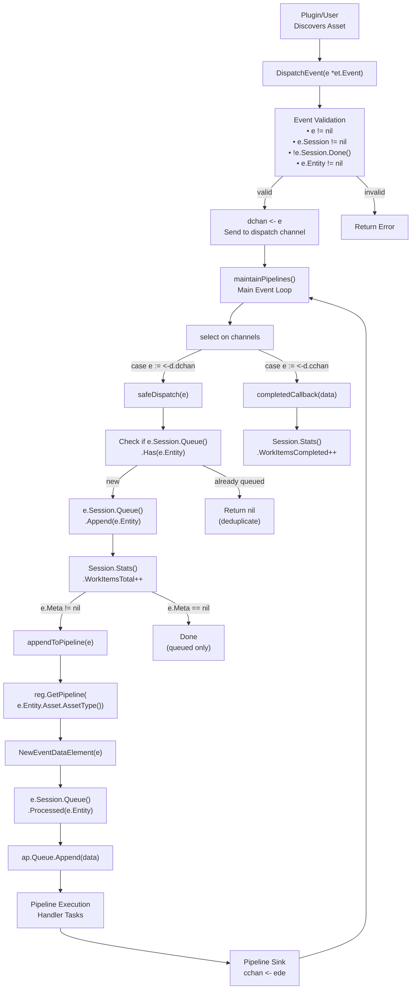
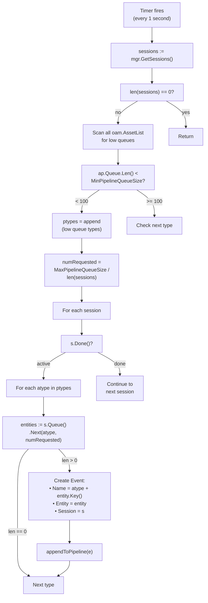
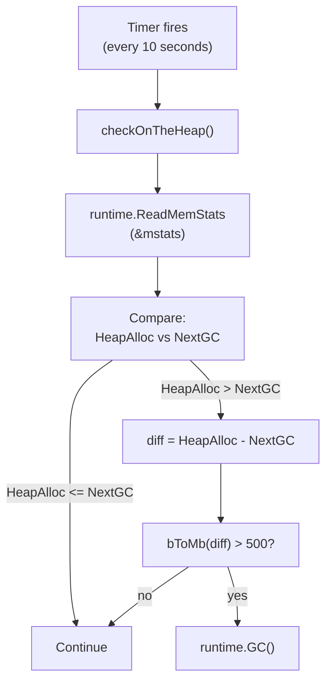
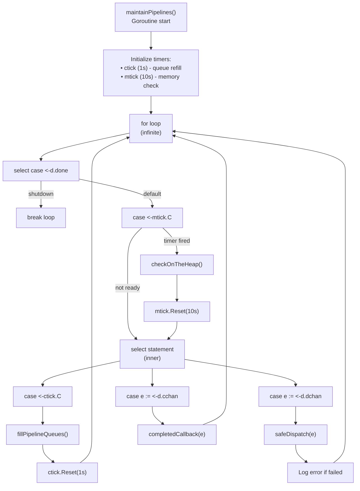
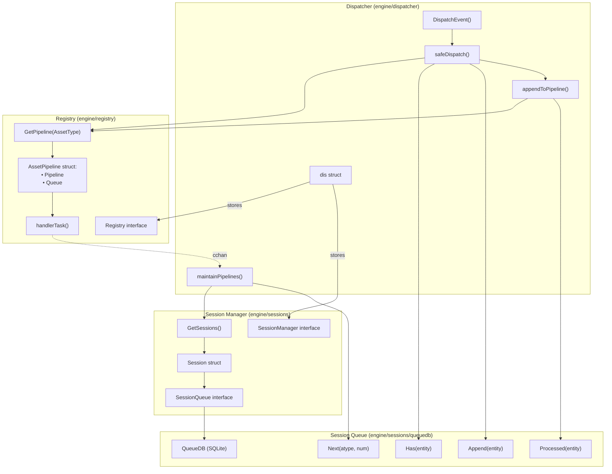

# Event Dispatcher

## Purpose and Scope

The Event Dispatcher is the central routing component of the Amass engine that manages the flow of events from discovery sources to asset processing pipelines. It coordinates between sessions, plugin handlers, and work queues to ensure events are processed in priority order while maintaining session isolation and resource efficiency.

## Overview

The Event Dispatcher implements the `et.Dispatcher` interface and serves as the orchestration hub for all asset discovery events in Amass. When a plugin discovers a new asset (e.g., a domain, IP address, or organization), it creates an `Event` and submits it to the dispatcher via `DispatchEvent()`. The dispatcher validates the event, adds it to the appropriate session's work queue, and ensures it flows through the correct asset pipeline based on its type.

The dispatcher operates asynchronously via a main event loop (`maintainPipelines()`) that continuously:

- Processes incoming events from the dispatch channel
- Refills asset pipeline queues from session work queues
- Handles completion callbacks from finished event processing
- Monitors memory usage and triggers garbage collection when needed

## Architecture and Components

### Dispatcher Structure

The core dispatcher implementation is the `dis` struct, which contains all necessary components for event routing:

The `dis` struct fields serve specific purposes:

| Field | Purpose |
|-------|---------|
| `logger` | Logs errors and debugging information |
| `reg` | References the plugin registry to retrieve asset pipelines |
| `mgr` | References the session manager to access active sessions |
| `done` | Signals shutdown to the maintenance goroutine |
| `dchan` | Receives events submitted via `DispatchEvent()` (buffer: 100) |
| `cchan` | Receives completion notifications from pipeline sink functions (buffer: 100) |

### Event and EventDataElement

Events flow through the dispatcher wrapped in two data structures:

| Structure | Purpose | Key Fields |
|-----------|---------|------------|
| `Event` | Represents a discovered asset ready for processing | `Name`, `Entity`, `Session`, `Dispatcher`, `Meta` |
| `EventDataElement` | Wraps events for pipeline execution with error tracking | `Event`, `Error`, `Queue` |

The transformation from `Event` to `EventDataElement` occurs in `appendToPipeline()` when events are added to asset pipeline queues.

## Event Flow Architecture

### Dispatch Path

!!! info "Key behaviours"
    - **Validation**: Event, session, and entity must be non-nil; session must be active.
    - **Deduplication**: `Queue.Has()` silently drops events for entities already in the queue.
    - **Conditional dispatch**: Events with `e.Meta == nil` are queued but not immediately sent to a pipeline — they are picked up by the periodic queue-fill mechanism instead.

## Pipeline Queue Management

### Fill Algorithm

The dispatcher automatically refills asset pipeline queues every second via `fillPipelineQueues()`:

**Queue thresholds:**

| Constant | Value | Purpose |
|----------|-------|---------|
| `MinPipelineQueueSize` | 100 | Refill trigger threshold |
| `MaxPipelineQueueSize` | 500 | Maximum items distributed per refill cycle |

!!! tip "Load balancing"
    `numRequested = MaxPipelineQueueSize / len(sessions)` distributes pipeline slots evenly across active sessions. With 5 sessions, each can contribute up to 100 items per cycle.

## Completion Callbacks

### Callback Processing

When a pipeline completes processing an event, it flows through a sink function:

```mermaid
graph LR
    PipelineTask["Pipeline Handler Task"]
    HandlerCallback["h.Callback(ede.Event)"]
    TaskReturn["Return data, error"]
    
    PipelineSink["Pipeline Sink Function"]
    ExtractEDE["Extract EventDataElement<br/>from pipeline.Data"]
    SendCompletion["ede.Queue <- ede<br/>(Send to cchan)"]
    
    MaintainLoop["maintainPipelines()<br/>select statement"]
    CaseReceive["case e := <-d.cchan"]
    CompletedCB["completedCallback(e)"]
    
    LogError["Log error if<br/>ede.Error != nil"]
    IncrementStats["stats.WorkItemsCompleted++"]
    
    PipelineTask --> HandlerCallback
    HandlerCallback --> TaskReturn
    TaskReturn --> PipelineSink
    
    PipelineSink --> ExtractEDE
    ExtractEDE --> SendCompletion
    
    SendCompletion --> MaintainLoop
    MaintainLoop --> CaseReceive
    CaseReceive --> CompletedCB
    
    CompletedCB --> LogError
    LogError --> IncrementStats
```

**Statistics tracking:** Each completion increments `Session.Stats().WorkItemsCompleted`, paired with the `WorkItemsTotal` increment in `safeDispatch()`. Clients can monitor progress via the GraphQL `sessionStats()` query.

**Error logging:** Errors are accumulated by handlers using `multierror`, allowing multiple handler failures to be tracked per event. Errors are logged in `completedCallback()` but do not halt processing.

## Memory Management

### Garbage Collection Strategy

The dispatcher monitors heap memory every 10 seconds and triggers GC when necessary:

!!! warning "GC threshold"
    GC is only triggered when `HeapAlloc - NextGC > 500 MB`. This prevents excessive GC cycles while ensuring memory doesn't grow unbounded during large enumeration sessions.

## Main Event Loop

### maintainPipelines() Structure

The dispatcher's main loop implements a multiplexed event processing model:

**Nested select pattern:** Two nested select statements ensure:

- Shutdown is checked on every iteration
- Memory management runs at lower frequency (10 s)
- Event dispatch and completion callbacks are processed immediately when available
- Queue refills occur regularly without blocking other operations

## Integration with Registry and Sessions

**Session Queue interaction** — key operations:

| Operation | Purpose |
|-----------|---------|
| `Has()` | Deduplication check before queueing |
| `Append()` | Add new entity to session's work queue |
| `Next()` | Retrieve entities for pipeline processing |
| `Processed()` | Mark entity as being actively processed |

## Error Handling

| Layer | Mechanism |
|-------|-----------|
| **API Validation** | Return errors from `DispatchEvent()` |
| **Internal Logging** | Log errors without stopping the loop |
| **Pipeline Errors** | Accumulate in `EventDataElement.Error` via `multierror` |
| **Session Logging** | Log via session's structured logger |

Non-blocking error handling ensures one problematic event doesn't halt the entire enumeration.

## Related

- [Engine Core](engine-core.md) — Dispatcher, SessionManager, and Registry overview
- [Plugin Registry & Pipelines](plugin-registry.md) — How handlers are registered and pipelines constructed
- [DNS Wildcard Detection](dns-wildcard.md) — Wildcard filtering during DNS resolution
- [DNS TTL & Caching](dns-caching.md) — Retry, timeout, and resolver pool configuration
