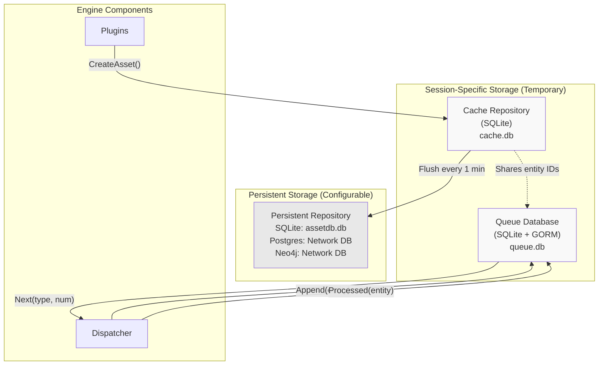
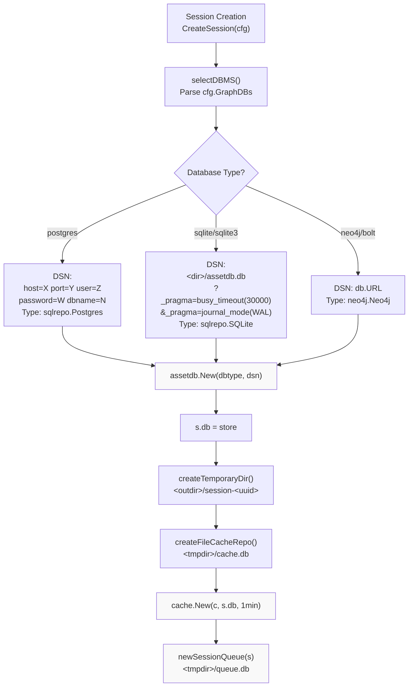
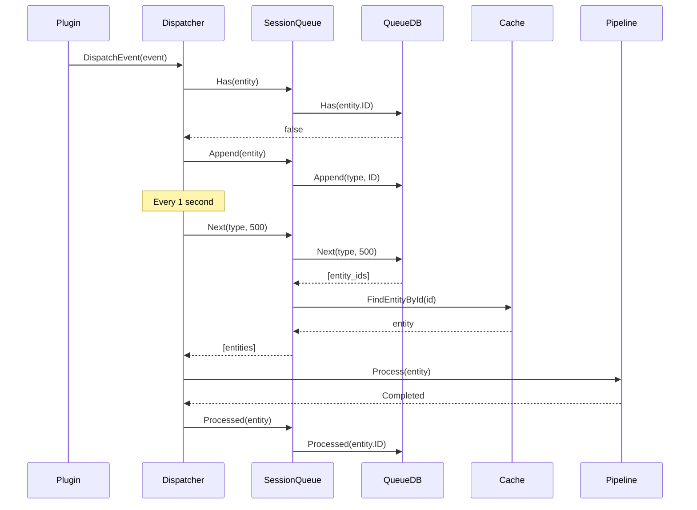
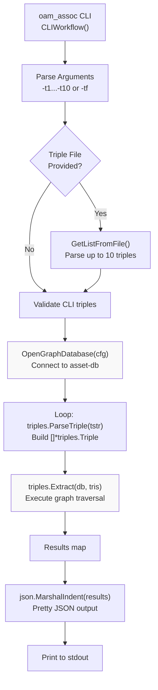
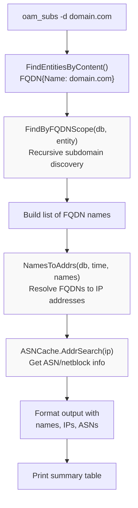
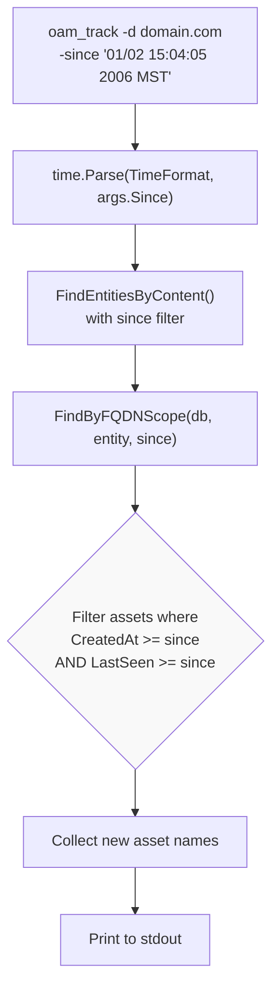
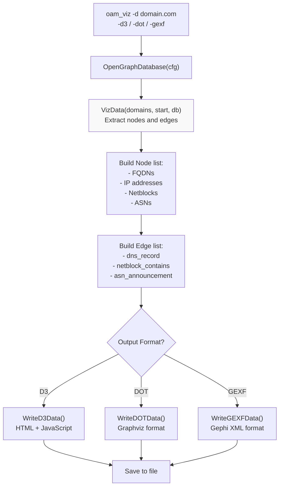

# Graph Database and Querying

## Storage Architecture Overview



## Database Connection Flow



## Queue and Dispatcher Workflow



## Triple-Based Graph Traversal

Amass uses **triple-based queries** to traverse the graph database. A triple is a pattern `(subject, predicate, object)` describing a relationship traversal:

```
fqdn -> dns_record -> ipaddr
ipaddr -> netblock_contains -> netblock
netblock -> asn_announcement -> as
```

The `oam_assoc` command-line tool performs graph traversal using these triples:

```bash
oam_assoc -t1 "fqdn -> dns_record -> ipaddr" -t2 "ipaddr -> netblock_contains -> netblock"
# or load from file
oam_assoc -tf triples_file.txt
```



## oam_subs: Subdomain Query Flow



## oam_track: Time-Based Filtering



!!! tip "Auto-timestamp selection"
    If no `since` parameter is provided, `oam_track` automatically uses the most recent asset's `LastSeen` timestamp, truncated to midnight.

## oam_viz: Graph Data Extraction



---

# Database Connection Strings

=== "SQLite (Default)"

    ```
    {path}/assetdb.db?_pragma=busy_timeout(30000)&_pragma=journal_mode(WAL)
    ```

    **Pragma options:**
    - `busy_timeout(30000)` — Wait 30 seconds when database is locked
    - `journal_mode(WAL)` — Write-Ahead Logging for better concurrency

=== "PostgreSQL"

    ```
    host={host} port={port} user={user} password={password} dbname={dbname}
    ```

    ```bash
    export AMASS_DB_USER="amass"
    export AMASS_DB_PASSWORD="secret"
    export AMASS_DB_HOST="localhost"
    export AMASS_DB_PORT="5432"
    export AMASS_DB_NAME="assetdb"
    ```

=== "Neo4j"

    ```
    neo4j+s://{host}:{port}
    ```

    **Supported schemes:** `neo4j`, `neo4j+s`, `neo4j+sec`, `bolt`, `bolt+s`, `bolt+sec`

---

# Summary

| Capability | Details |
|------------|---------|
| **Standardized Assets** | OAM specification ensures consistent asset types across all plugins |
| **Three-Tier Storage** | Work queue for scheduling, cache for performance, graph DB for persistence |
| **Session Isolation** | Each enumeration session has dedicated temporary storage |
| **Flexible Backends** | SQLite for standalone use; PostgreSQL/Neo4j for production deployments |
| **Entity Wrapping** | `dbt.Entity` provides metadata layer over OAM assets |
| **Efficient Lifecycle** | Assets flow: discovery → cache → queue → pipeline → persistent storage |
| **Graph Traversal** | Triple-based queries via `oam_assoc`; direct repository API for tools |
