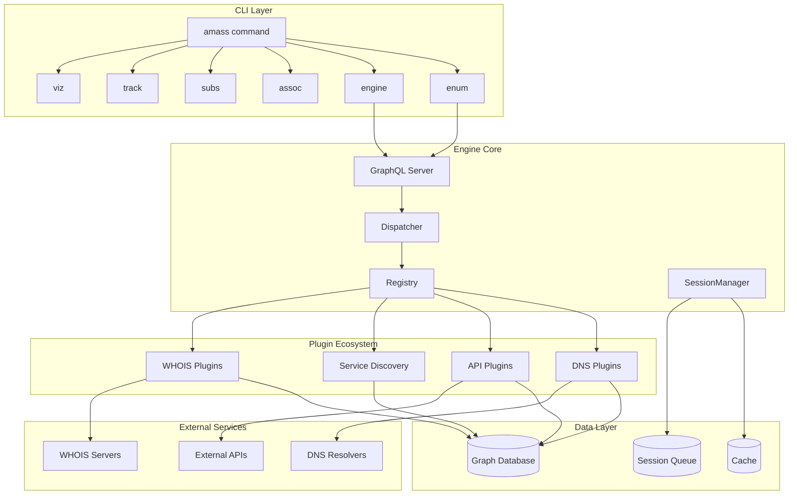
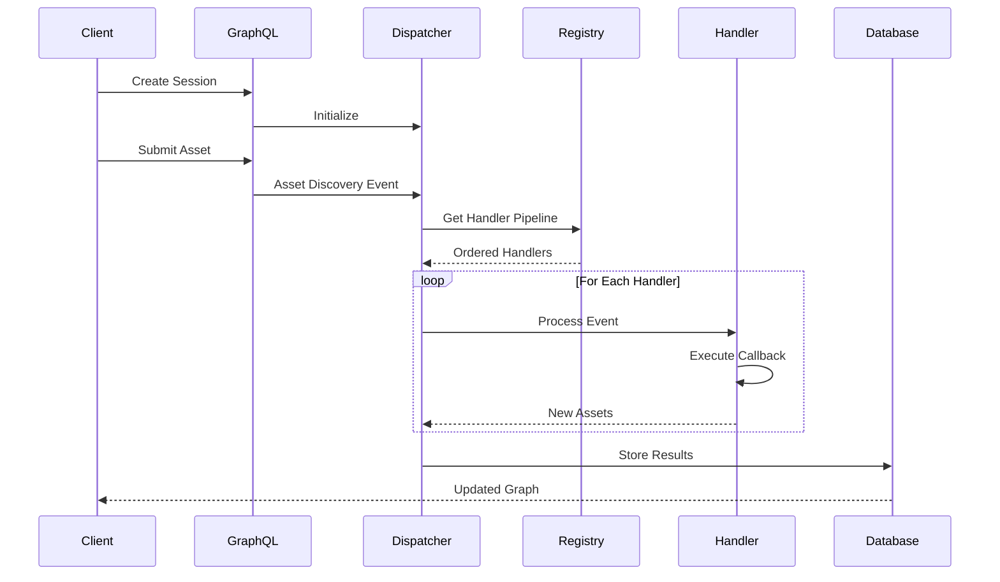
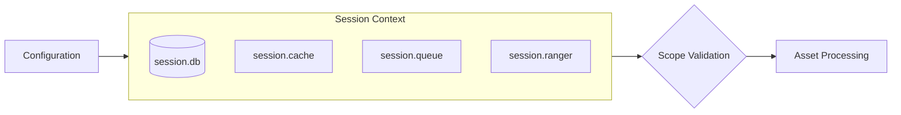
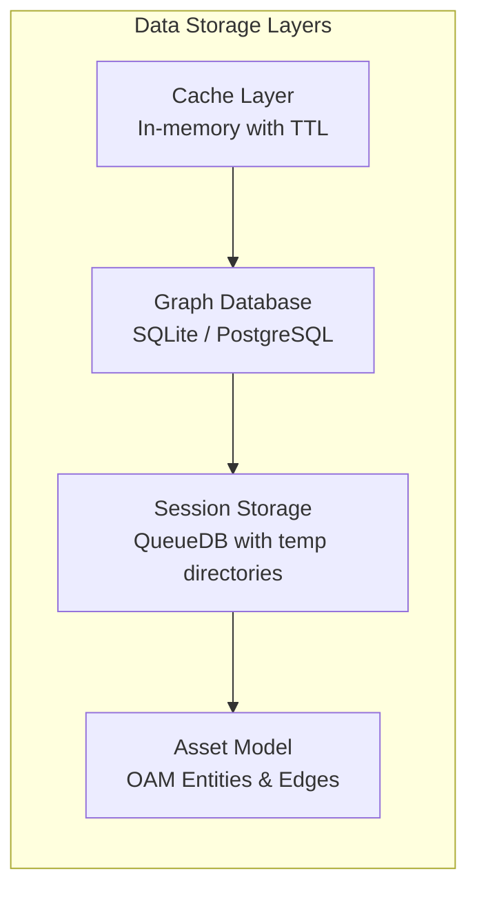
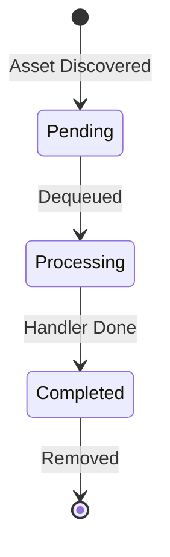
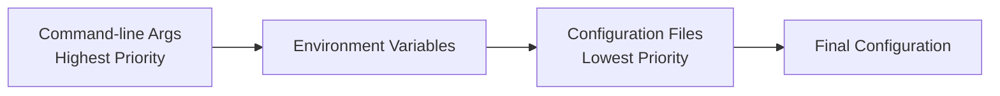

# Architecture Overview

OWASP Amass implements an **event-driven plugin architecture** centered on a core engine that processes asset discovery through sophisticated coordination mechanisms. The system implements the Open Asset Model (OAM) to standardize cyber asset representation across a graph database backend.

## System Architecture

## Core Components

### Engine Core

The central `AmassEngine` orchestrates discovery operations through these key subsystems:

| Component | Purpose |
|-----------|---------|
| **Dispatcher** | Routes events through registered handler pipelines, processing assets sequentially based on type and priority |
| **Registry** | Manages plugin registration and constructs processing pipelines dynamically |
| **SessionManager** | Coordinates concurrent discovery sessions with isolated state, configuration, and caching |
| **GraphQL Server** | Exposes endpoints for session management and real-time monitoring |

### Event Processing Pipeline

Events flow through a deterministic pipeline where the system maintains session context including cache, queue, and scope definitions throughout processing.

## Session Management

The `SessionManager` coordinates multiple concurrent discovery sessions with isolated configuration and state:

| Component | Description |
|-----------|-------------|
| `session.db` | SQLite persistent storage for the session |
| `session.cache` | In-memory asset cache for deduplication |
| `session.queue` | Processing queue managing asset flow |
| `session.ranger` | CIDR range matching for network scope |

## Multi-Layer Storage Architecture

### Database Support

| Backend | Use Case |
|---------|----------|
| **SQLite** | Local, single-user deployments |
| **PostgreSQL** | Enterprise concurrent access |

## Queue Management

The session queue uses SQLite with an `Element` table tracking processing state:

| Field | Purpose |
|-------|---------|
| `entity_id` | Unique asset identifier |
| `etype` | Asset type (FQDN, IP, etc.) |
| `processed` | Processing state flag |
| `created_at` | Queue entry timestamp |

## GraphQL API Interface

The engine exposes a GraphQL API for programmatic control:

### Mutations

| Operation | Description |
|-----------|-------------|
| `createSessionFromJson` | Initiate discovery sessions with configuration |
| `createAsset` | Submit seed assets for discovery |
| `terminateSession` | Stop running enumeration |

### Queries

| Operation | Description |
|-----------|-------------|
| `sessionStats` | Real-time discovery statistics |

### Subscriptions

| Operation | Description |
|-----------|-------------|
| `logMessages` | Stream session log messages |

**Default endpoint:** `http://127.0.0.1:4000/graphql`

## Configuration Priority

Settings are resolved in priority order:

## External Service Integration

### DNS Resolution Infrastructure

The system manages multiple resolver pools with sophisticated rate limiting:

| Resolver Type | Description | Default QPS |
|---------------|-------------|-------------|
| **Baseline** | Google, Cloudflare, Quad9 | 15 |
| **Public Pool** | Dynamic from public-dns.info | 5 |
| **Custom** | User-specified resolvers | Configurable |
| **Trusted** | Higher rate limit resolvers | 15+ |

### DNS Operations

- Wildcard detection and filtering
- QPS rate limiting per resolver
- TTL-based response caching
- Response validation

## Learn More

-   :material-puzzle:{ .lg .middle } **Plugin System**

    ---

    Understand how plugins extend Amass capabilities

    [:octicons-arrow-right-24: Plugin Architecture](plugins.md)

-   :material-api:{ .lg .middle } **Data Flow**

    ---

    How assets move through the discovery pipeline

    [:octicons-arrow-right-24: Data Flow](data-flow.md)

