# Network Infrastructure Mapping

Amass performs comprehensive network mapping through coordinated plugin operations, correlating IP addresses, network blocks, and autonomous system numbers (ASNs) to build complete infrastructure maps.

## Network Discovery Architecture

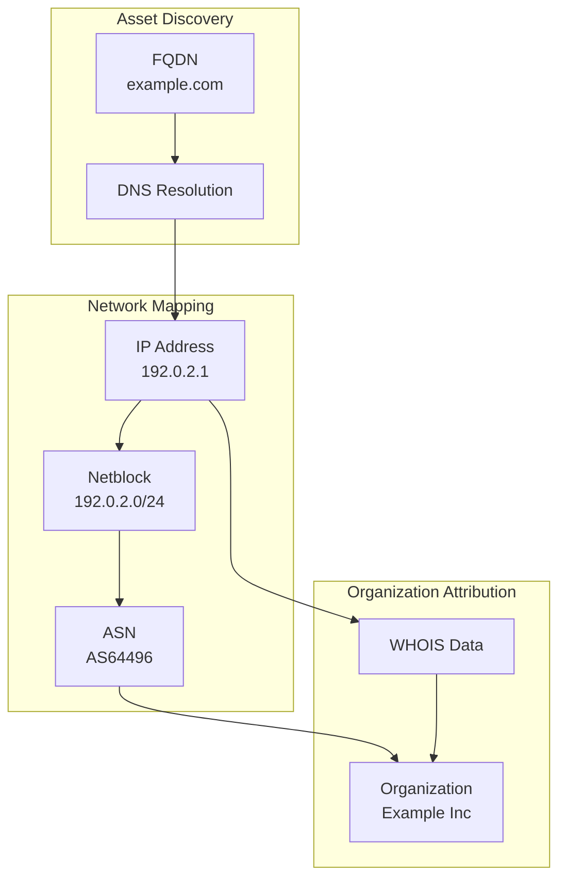

## IP-to-Network Correlation

### Discovery Pipeline

1. **DNS Resolution** - Resolve FQDNs to IP addresses
2. **Netblock Lookup** - Query WHOIS/RDAP for network allocation
3. **ASN Attribution** - Identify autonomous system ownership
4. **Organization Mapping** - Link infrastructure to entities

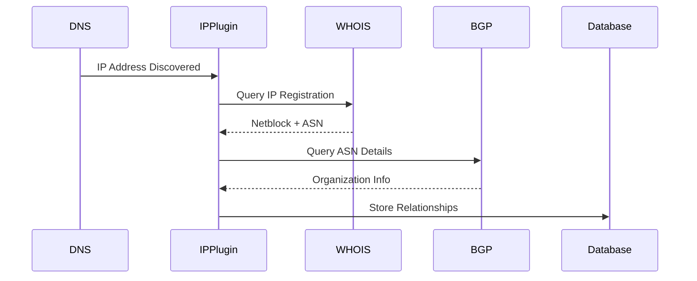

## BGP Tools Integration

The `BGP.Tools` plugin provides autonomous system intelligence:

### Plugin Components

| File | Function |
|------|----------|
| `plugin.go` | Main BGP.Tools integration |
| `autsys.go` | ASN lookup and enrichment |
| `netblock.go` | Network block discovery |

### Data Retrieved

| Data Type | Description |
|-----------|-------------|
| **ASN Information** | AS number, name, description |
| **Network Blocks** | CIDR ranges allocated to ASN |
| **Organization** | Entity owning the ASN |
| **Peers** | BGP peering relationships |

## WHOIS Integration

### Query Types

| Query | Purpose |
|-------|---------|
| **IP WHOIS** | Network block allocation |
| **Domain WHOIS** | Domain registration data |
| **ASN WHOIS** | Autonomous system details |
| **Reverse WHOIS** | Find related domains |

### RDAP Support

Modern RDAP (Registration Data Access Protocol) queries provide structured JSON responses:

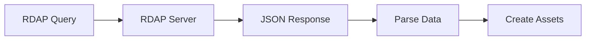

## Network Relationship Model

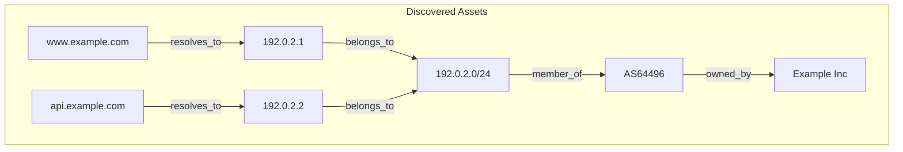

### Relationship Types

| Source | Relation | Target |
|--------|----------|--------|
| IP Address | `belongs_to` | Netblock |
| Netblock | `member_of` | ASN |
| ASN | `owned_by` | Organization |
| FQDN | `resolves_to` | IP Address |

## Recursive Discovery

Network discoveries trigger further enumeration:

```
IP 192.0.2.1 discovered
    │
    ├─► WHOIS Query → Netblock 192.0.2.0/24
    │   │
    │   ├─► Reverse DNS on range → New FQDNs
    │   │   └─► mail.example.com
    │   │   └─► ftp.example.com
    │   │
    │   └─► ASN Lookup → AS64496
    │       │
    │       └─► Organization → Example Inc
    │           │
    │           └─► GLEIF/Aviato → Related entities
    │
    └─► BGP Tools → Peer ASNs
        └─► AS64497 (CDN Provider)
```

## Infrastructure Correlation

### Multi-Source Correlation

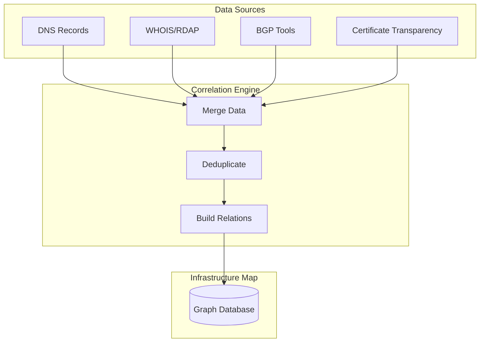

### Correlation Points

| Data Point | Sources |
|------------|---------|
| **IP Address** | DNS A/AAAA, Certificate SAN, WHOIS |
| **Organization** | WHOIS registrant, Certificate issuer, GLEIF |
| **Network Block** | WHOIS, BGP announcements |
| **ASN** | WHOIS, BGP Tools, DNS TXT |

## Rate Limiting

Network queries respect rate limits:

| Service | Default Limit |
|---------|---------------|
| WHOIS Servers | 1 QPS |
| RDAP Servers | 5 QPS |
| BGP.Tools | 10 QPS |

## Output Examples

### Network Summary

```
Target: example.com

Network Infrastructure:
├── Netblock: 192.0.2.0/24
│   ├── ASN: AS64496 (Example Inc)
│   ├── IPs: 192.0.2.1, 192.0.2.2, 192.0.2.10
│   └── Hosts: www, api, mail
│
└── Netblock: 198.51.100.0/24
    ├── ASN: AS64497 (CDN Provider)
    ├── IPs: 198.51.100.50
    └── Hosts: cdn
```

## Best Practices

!!! tip "Network Mapping"
    - Use passive mode for initial reconnaissance
    - Correlate data from multiple sources
    - Respect WHOIS rate limits
    - Track ASN relationships for infrastructure pivoting

!!! warning "Legal Considerations"
    WHOIS queries and network reconnaissance may be subject to terms of service and legal restrictions. Ensure proper authorization before scanning.

## Technical Deep Dive

### Event-Driven Processing Model

Every network asset discovery generates an **Event** — the fundamental unit of work that flows through the Amass engine.

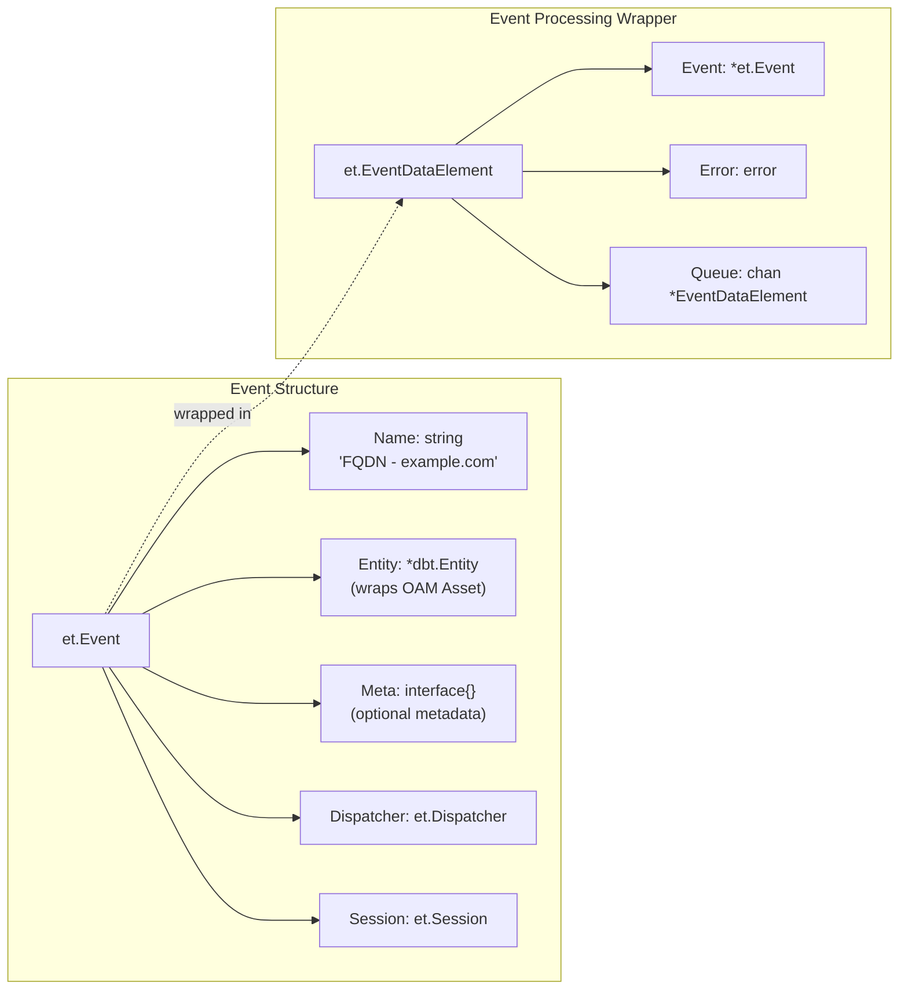

### Complete Event Flow

This diagram shows how a discovered network asset travels from creation through pipeline processing to completion:

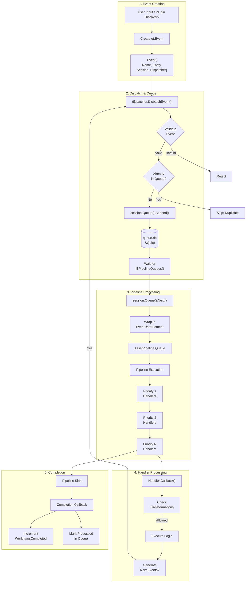

Key properties of this model:

1. Events can generate new events recursively (discovery cascade)
2. The session queue prevents duplicate processing
3. Pipelines execute handlers in strict priority order
4. Transformations filter which handlers execute for a given asset
5. Completion callbacks track overall progress statistics

### Handler Priority System

Handlers registered by plugins execute in **priority order** from 1 (highest) to 9 (lowest). For network infrastructure mapping, this ordering ensures DNS resolution completes before IP enrichment, and IP enrichment completes before service probing:

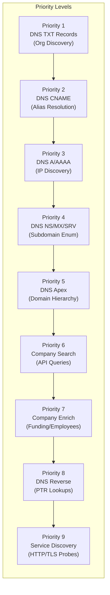

DNS TXT records at priority 1 may reveal organization identifiers, enabling CNAME resolution (priority 2) which yields IP addresses (priority 3), ultimately enabling service discovery (priority 9).

### Asset Pipeline Structure

For each OAM asset type, the registry constructs a pipeline of all registered handlers for that type, ordered by priority:

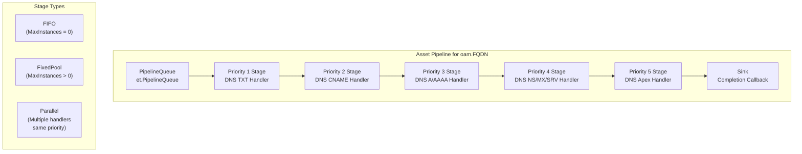

| Stage Type | When Used | Behavior |
|------------|-----------|----------|
| `FIFO` | Single handler, `MaxInstances = 0` | Serial processing, unlimited goroutines |
| `FixedPool` | Single handler, `MaxInstances > 0` | Concurrent processing, limited pool |
| `Parallel` | Multiple handlers, same priority | All handlers run concurrently |

### Transformation Matching

Transformation rules in `config.yaml` control which plugins are permitted to process which asset types. This is evaluated for every handler execution:

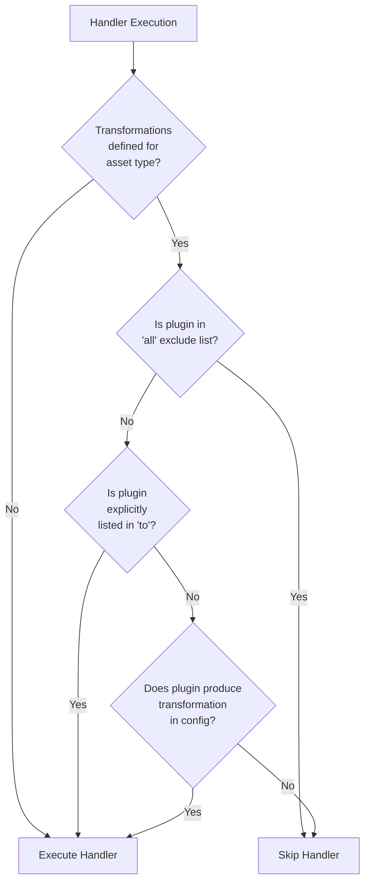

Example transformation configuration:

```yaml
transformations:
  - from: FQDN
    to: all
    exclude:
      - dnsSubs
  - from: IPAddress
    to: dnsReverse
```

### OAM Asset Type Hierarchy

Network assets discovered during mapping are represented using the Open Asset Model (OAM). The full hierarchy of asset types recognized by the engine:

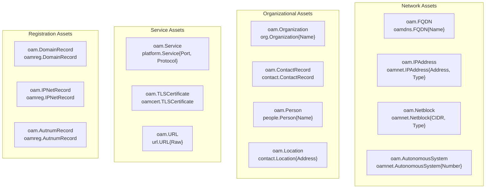

### Session Queue Schema

Each enumeration session tracks work items in a dedicated SQLite-backed queue, preventing duplicate processing of discovered assets:

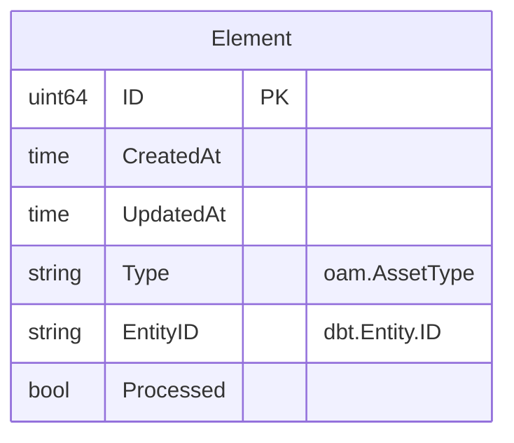

| Method | Purpose |
|--------|---------|
| `Has(e)` | Check if entity is already queued |
| `Append(e)` | Add entity to queue |
| `Next(atype, num)` | Get next batch of unprocessed entities |
| `Processed(e)` | Mark entity as processed |
