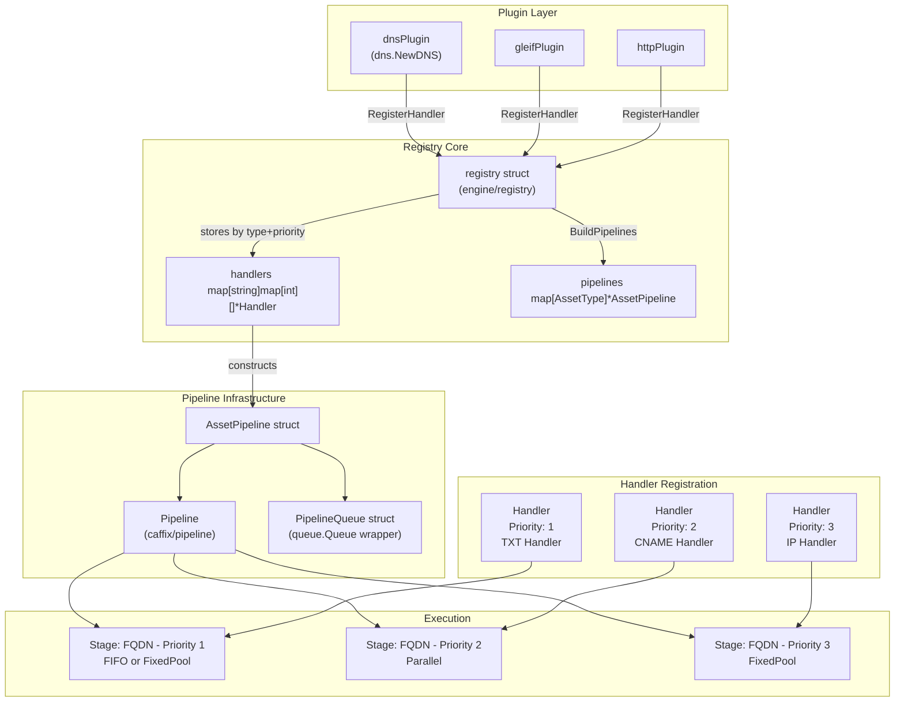
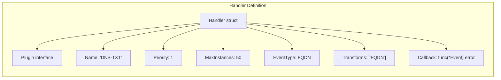
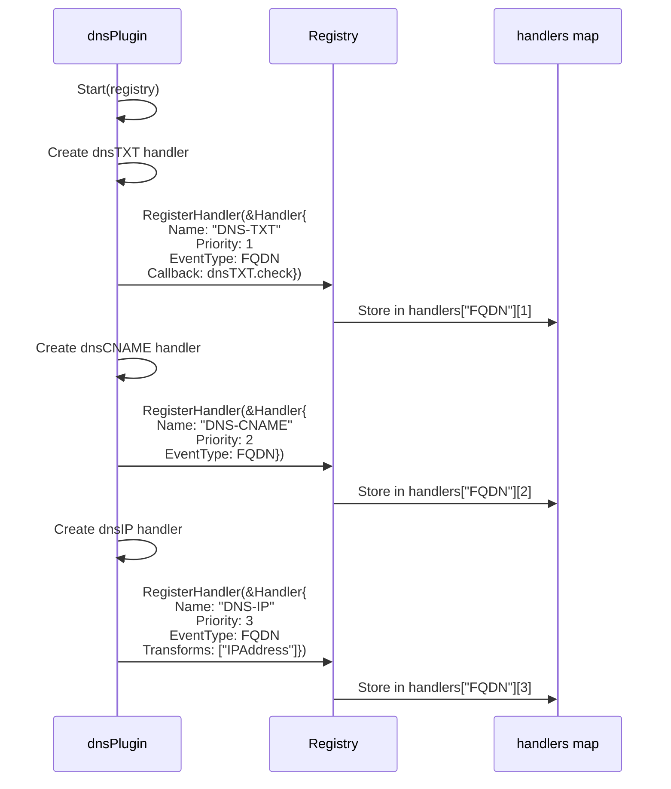
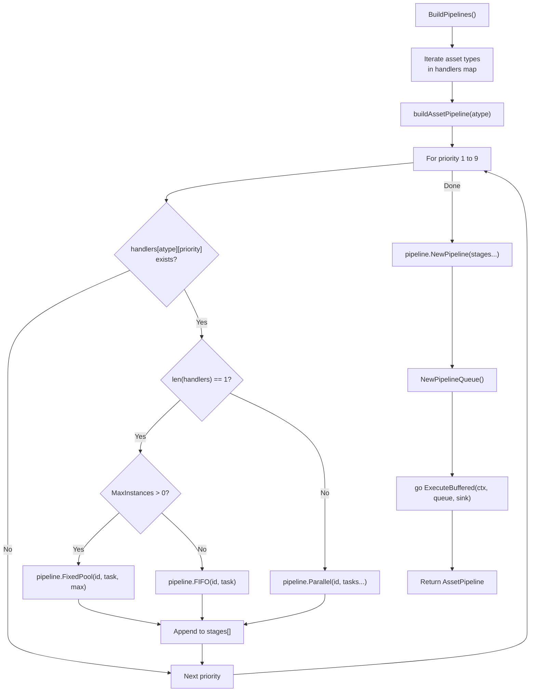
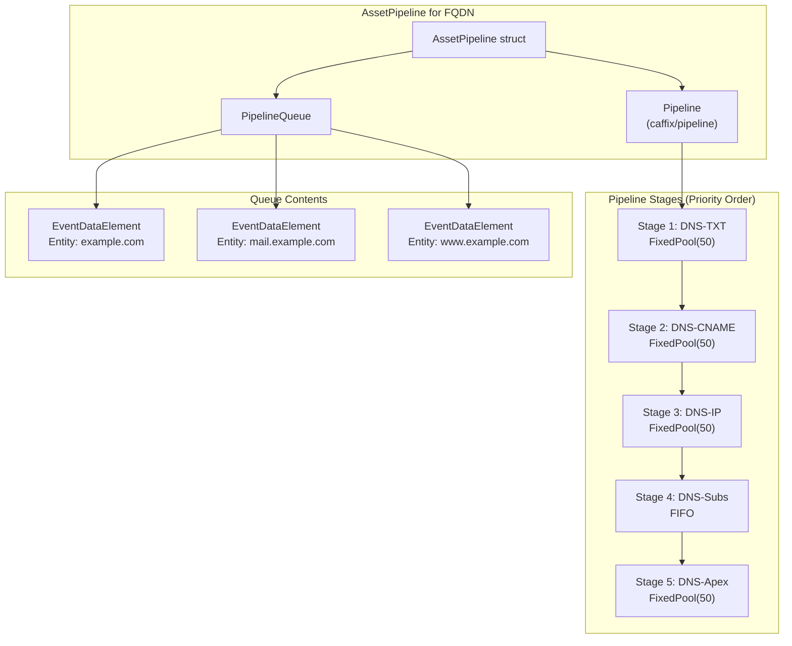
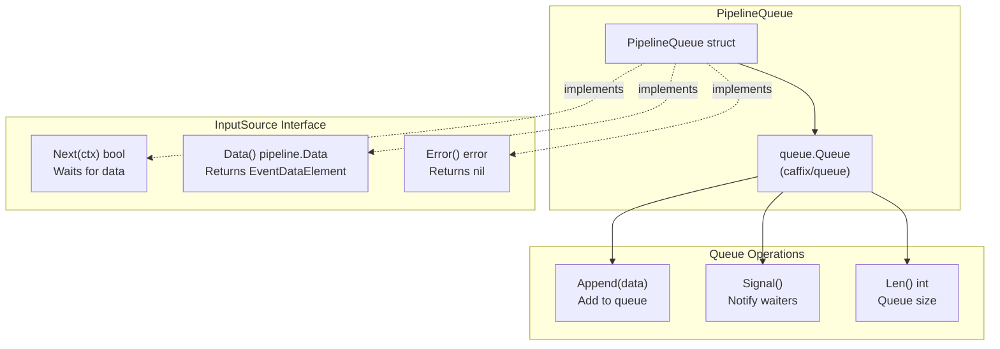
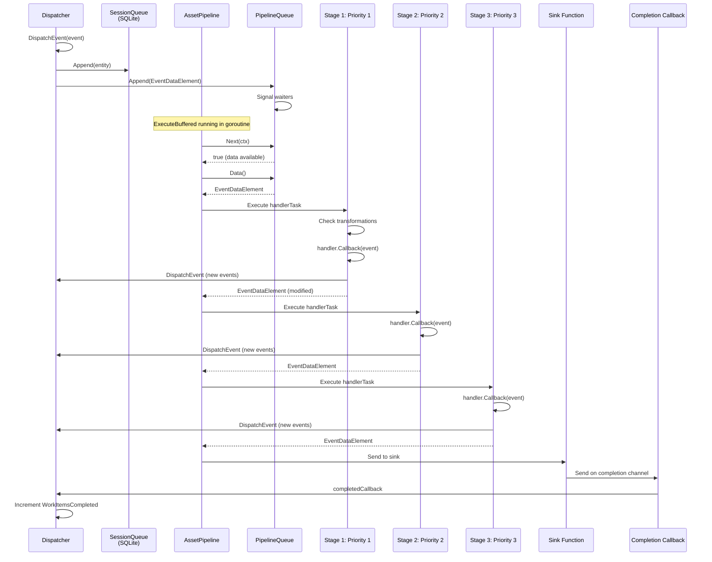
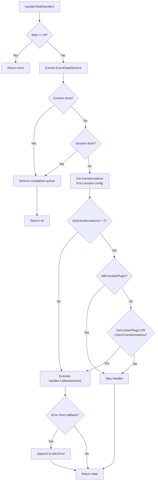
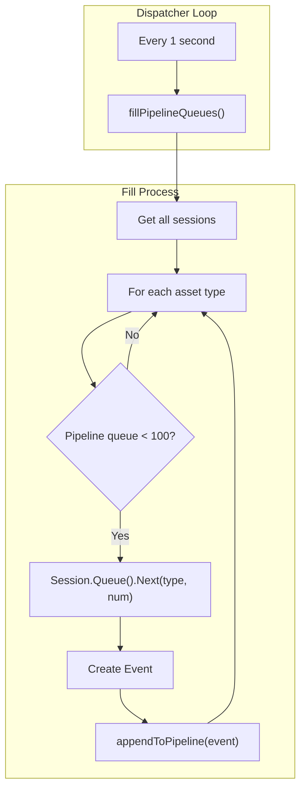

# Plugin Registry & Pipelines

## Purpose and Scope

This page explains the plugin registry and asset pipeline system, which orchestrates how plugins process events in Amass. The registry manages handler registration from plugins, constructs priority-ordered pipelines for each asset type, and coordinates execution of handlers across multiple concurrent sessions.

## System Architecture

The plugin registry and pipeline system consists of four primary components:



## Registry Component

The `registry` struct maintains the central index of all registered handlers and constructs asset pipelines on demand.

### Registry Data Structure

| Field | Type | Purpose |
|-------|------|---------|
| `handlers` | `map[string]map[int][]*Handler` | Maps asset type → priority → handlers |
| `pipelines` | `map[AssetType]*AssetPipeline` | Maps asset type → constructed pipeline |
| `logger` | `*slog.Logger` | Logging instance |

The two-level map structure enables efficient pipeline construction by iterating through priorities in order:

- **First level:** Asset type (e.g., `"FQDN"`, `"IPAddress"`)
- **Second level:** Priority integer (1–9)
- **Value:** Array of handlers at that priority

## Handler Structure

A `Handler` defines how a plugin processes a specific event type:



### Handler Fields

| Field | Type | Description |
|-------|------|-------------|
| `Plugin` | `Plugin` | Reference to parent plugin |
| `Name` | `string` | Unique handler identifier (e.g., `"DNS-TXT"`) |
| `Priority` | `int` | Execution order (1–9, lower = earlier) |
| `MaxInstances` | `int` | Concurrent execution limit (0 = unlimited) |
| `EventType` | `oam.AssetType` | Asset type this handler processes |
| `Transforms` | `[]string` | Allowed transformation outputs |
| `Callback` | `func(*Event) error` | Processing function |

## Handler Registration Process

Plugins register handlers during their `Start()` method:



### DNS Plugin Registration Example

The DNS plugin registers six handlers:

| Handler | Priority | Event Type | Transforms | Purpose |
|---------|----------|------------|------------|---------|
| DNS-TXT | 1 | FQDN | `["FQDN"]` | Extract organization IDs from TXT records |
| DNS-CNAME | 2 | FQDN | `["FQDN"]` | Resolve CNAME aliases |
| DNS-IP | 3 | FQDN | `["IPAddress"]` | Resolve A/AAAA records to IP addresses |
| DNS-Subdomains | 4 | FQDN | `["FQDN"]` | Enumerate NS/MX/SRV subdomains |
| DNS-Apex | 5 | FQDN | `["FQDN"]` | Build domain hierarchy relationships |
| DNS-Reverse | 8 | IPAddress | `["FQDN"]` | Reverse DNS PTR lookups |

## Pipeline Construction

The registry builds pipelines after all plugins have registered their handlers via `BuildPipelines()`:



### Pipeline Stage Types

| Stage Type | Condition | Behaviour |
|------------|-----------|-----------|
| **FixedPool** | Single handler, `MaxInstances > 0` | Worker pool with fixed concurrency |
| **FIFO** | Single handler, `MaxInstances == 0` | Sequential processing |
| **Parallel** | Multiple handlers at same priority | All handlers execute concurrently |

### Pipeline Execution

Each constructed pipeline runs in its own goroutine:

```go
go func(p *AssetPipeline) {
    if err := p.Pipeline.ExecuteBuffered(context.TODO(), p.Queue, makeSink(), bufsize); err != nil {
        r.logger.Error(fmt.Sprintf("Pipeline terminated: %v", err), "OAM type", atype)
    }
}(ap)
```

## AssetPipeline Structure

Each asset type has its own `AssetPipeline` instance:



| Field | Type | Description |
|-------|------|-------------|
| `Pipeline` | `*pipeline.Pipeline` | The actual pipeline execution engine |
| `Queue` | `*PipelineQueue` | Input queue for events |

## PipelineQueue Implementation

The `PipelineQueue` wraps a standard queue and implements the `pipeline.InputSource` interface:



**`Next(ctx context.Context) bool`** — Blocks until data is available or context is cancelled. Checks every 100 ms, also listens on the queue's signal channel.

**`Data() pipeline.Data`** — Dequeues the next `EventDataElement`, skipping events from terminated sessions.

**`Error() error`** — Always returns `nil`.

## Event Flow Through Pipelines



## Handler Task Execution

Each handler in a pipeline stage executes via the `handlerTask` wrapper function:



### Transformation Filtering

Handler task applies transformation filtering before executing the callback:

1. **Get transformations** — Retrieves transformations from session config for the event's asset type
2. **Check "all" exclusions** — If transformation is `"all → all exclude: [pluginName]"`, skip this plugin
3. **Check plugin match** — If transformation explicitly lists this plugin, execute
4. **Check transform types** — If handler's `Transforms` field matches transformation's "to" types, execute

!!! info "Why transformation filtering?"
    This system lets users control which plugins process which asset types via configuration, without modifying plugin code.

## Priority System

### DNS Plugin Priority Assignment

| Priority | Handler | Rationale |
|----------|---------|-----------|
| 1 | DNS-TXT | Extract organization IDs first for enrichment |
| 2 | DNS-CNAME | Resolve aliases before IP lookup |
| 3 | DNS-IP | Resolve to IPs after CNAME chain |
| 4 | DNS-Subdomains | Enumerate NS/MX after basic resolution |
| 5 | DNS-Apex | Build hierarchy after subdomain discovery |
| 8 | DNS-Reverse | Reverse lookup after forward resolution |

### Priority Guidelines

| Range | Stage |
|-------|-------|
| 1–3 | Critical early processing (TXT, CNAME, IP resolution) |
| 4–6 | Secondary discovery (subdomains, company search) |
| 7–9 | Enrichment and follow-up (company data, reverse DNS) |

Handlers at the same priority from different plugins execute in **parallel**; from the same plugin they execute **sequentially**.

## Concurrency Control

| `MaxInstances` | Behaviour | Stage Type |
|----------------|-----------|------------|
| `0` | Unlimited / sequential | FIFO |
| `> 0` | Fixed worker pool | FixedPool |

Most DNS handlers use `MaxInstances: support.MaxHandlerInstances` (typically 50), creating a `FixedPool` stage that processes up to 50 DNS queries concurrently per pipeline.

## Dispatcher Integration

The dispatcher maintains pipelines by periodically refilling their queues from session queues:



## Error Handling

Pipeline execution collects errors in `EventDataElement`:

```go
if err := r.Callback(ede.Event); err != nil {
    ede.Error = multierror.Append(ede.Error, err)
}
```

The sink function sends completed events (including accumulated errors) to the completion channel, where the dispatcher logs them. Errors do not stop pipeline processing — they are logged and the event is marked complete.

## Related

- [Engine Core](engine-core.md) — Overview of Dispatcher, SessionManager, and Registry
- [Event Dispatcher](event-dispatcher.md) — Event routing, queue filling, and completion callbacks
- [DNS Wildcard Detection](dns-wildcard.md) — Wildcard filtering in DNS resolution
- [DNS TTL & Caching](dns-caching.md) — Resolver pool, retry, and QPS management
