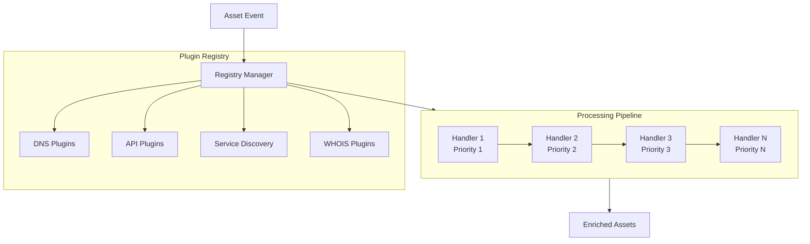
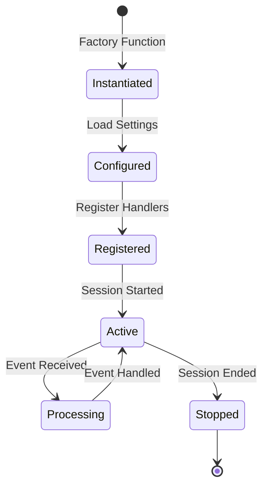
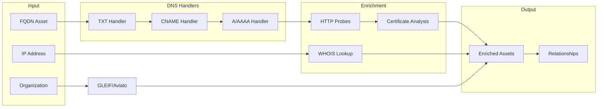
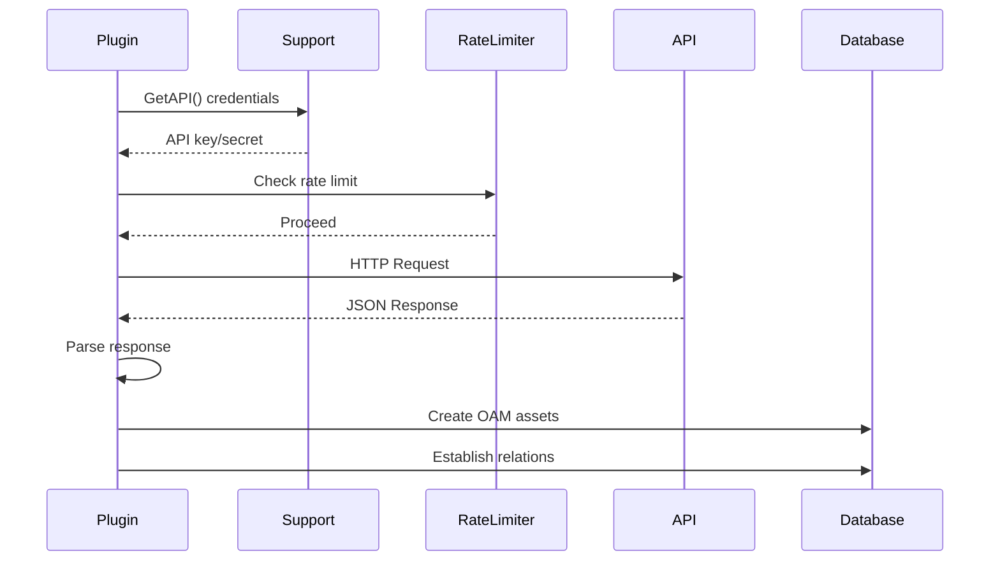

# Plugin System

Amass employs an **event-driven plugin architecture** where plugins register handlers for specific asset types. The system coordinates multiple discovery plugins through a central registry that builds processing pipelines.

## Plugin Architecture



## Handler Registration

Plugins register handlers with the Registry, which builds processing pipelines based on:

| Property | Description |
|----------|-------------|
| **Priority** | Execution order (1-9, lower runs first) |
| **EventType** | Which OAM asset types trigger the handler |
| **Transforms** | Asset type conversions produced |
| **Callback** | Function executed when events match |
| **MaxInstances** | Concurrent handler limit |

```go
type Handler struct {
    Name         string
    Priority     int           // 1-9
    EventType    oam.AssetType // FQDN, IPAddress, etc.
    Transforms   []oam.AssetType
    Callback     func(*Event) error
    MaxInstances int
}
```

## Plugin Categories

### DNS Plugins

Core DNS-based discovery handlers:

| Plugin | Priority | Function |
|--------|----------|----------|
| `dns_txt` | 1 | Extract data from TXT records |
| `dns_cname` | 2 | Follow CNAME chains |
| `dns_ip` | 3 | Resolve A/AAAA records |
| `dns_subdomain` | 4 | Subdomain enumeration |
| `dns_reverse` | 5 | Reverse DNS lookups |
| `dns_nsec` | 6 | NSEC/NSEC3 walking |

### API Integration Plugins

External service integrations:

| Plugin | Source | Data Provided |
|--------|--------|---------------|
| `api_shodan` | Shodan | Open ports, services, banners |
| `api_censys` | Censys | Certificate and host data |
| `api_virustotal` | VirusTotal | Passive DNS records |
| `api_securitytrails` | SecurityTrails | Historical DNS data |
| `api_gleif` | GLEIF | Legal entity identifiers |
| `api_aviato` | Aviato | Company intelligence |
| `api_bgptools` | BGP.Tools | ASN and netblock data |

### Service Discovery Plugins

Infrastructure and service detection:

| Plugin | Function |
|--------|----------|
| `http_probe_fqdn` | Probe HTTP services on domains |
| `http_probe_ip` | Probe HTTP services on IPs |
| `cert_analysis` | TLS certificate extraction |
| `service_fingerprint` | Service identification |

### WHOIS/Network Plugins

Network intelligence gathering:

| Plugin | Function |
|--------|----------|
| `whois_domain` | Domain registration data |
| `whois_ip` | IP allocation records |
| `rdap_lookup` | RDAP protocol queries |
| `reverse_whois` | Find domains by registrant |

## Plugin Lifecycle



### Initialization Phase

1. Plugin instantiation via factory functions
2. Configuration with API credentials and settings
3. Handler registration with the registry
4. Priority assignment for execution ordering

### Execution Phase

Plugins operate within an event-driven model:

1. Assets flow through discovery pipelines
2. Each plugin's handler processes relevant asset types
3. Handlers generate new assets or enriched data
4. System feeds new assets back into pipelines

## Asset Flow Through Plugins



### Example: FQDN Discovery Flow

```
Input: example.com (FQDN)
    │
    ├─► DNS TXT Handler (Priority 1)
    │   └─► Discovers SPF, DKIM records
    │
    ├─► DNS CNAME Handler (Priority 2)
    │   └─► Follows CNAME to cdn.example.com
    │
    ├─► DNS A Handler (Priority 3)
    │   └─► Resolves to 192.0.2.1
    │
    ├─► HTTP Probe (Priority 4)
    │   └─► Detects nginx/1.18.0
    │
    └─► Certificate Analysis (Priority 5)
        └─► Extracts SAN: *.example.com

Output: Enriched FQDN + IP + Certificate + Relations
```

## API Plugin Pattern

External API integrations follow a consistent pattern:



### Implementation Steps

1. **Credential Management**: Retrieve API keys via `support.GetAPI()`
2. **Rate Limiting**: Enforce per-service QPS limits
3. **HTTP Communication**: Submit requests to external services
4. **Response Parsing**: Extract relevant asset data
5. **Asset Creation**: Generate OAM entities with relationships

## Session Context

Plugins operate within isolated session contexts providing:

| Resource | Purpose |
|----------|---------|
| **Configuration** | Session-specific settings |
| **Asset Cache** | Deduplication of discovered assets |
| **Graph Database** | Persistent storage access |
| **Scope Validator** | Target filtering rules |
| **Rate Limiter** | Per-resolver QPS control |
| **Resolver Pool** | DNS resolution infrastructure |

## Writing Custom Plugins

### Basic Plugin Structure

```go
package myplugin

import (
    "github.com/owasp-amass/amass/v5/engine"
    "github.com/owasp-amass/oam"
)

type MyPlugin struct {
    engine.BasePlugin
}

func NewMyPlugin() *MyPlugin {
    return &MyPlugin{}
}

func (p *MyPlugin) Start(r *engine.Registry) error {
    r.RegisterHandler(&engine.Handler{
        Name:      "my_handler",
        Priority:  5,
        EventType: oam.FQDN,
        Callback:  p.handleFQDN,
    })
    return nil
}

func (p *MyPlugin) handleFQDN(e *engine.Event) error {
    fqdn := e.Asset.(oam.FQDN)
    // Process the FQDN
    // Create new assets
    // Return results
    return nil
}
```

### Registering Multiple Handlers

```go
func (p *MyPlugin) Start(r *engine.Registry) error {
    handlers := []*engine.Handler{
        {Name: "fqdn_handler", Priority: 1, EventType: oam.FQDN, Callback: p.handleFQDN},
        {Name: "ip_handler", Priority: 2, EventType: oam.IPAddress, Callback: p.handleIP},
    }

    for _, h := range handlers {
        r.RegisterHandler(h)
    }
    return nil
}
```

## Priority Guidelines

| Priority Range | Plugin Type | Examples |
|----------------|-------------|----------|
| 1-3 | Core DNS | TXT, CNAME, A records |
| 4-5 | Secondary DNS | Reverse, NSEC |
| 6-7 | Service Discovery | HTTP probes, certificates |
| 8-9 | Enrichment | API integrations, WHOIS |

!!! tip "Priority Best Practices"
    - Lower priorities run first and should handle foundational discovery
    - Higher priorities should focus on enrichment and validation
    - Avoid priority conflicts between related handlers
