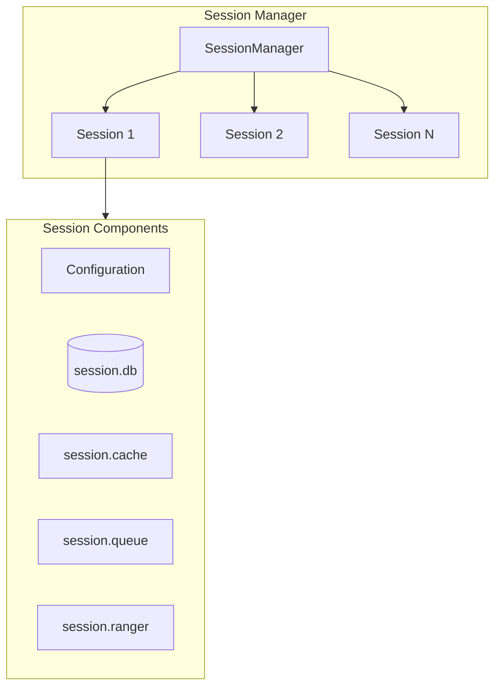
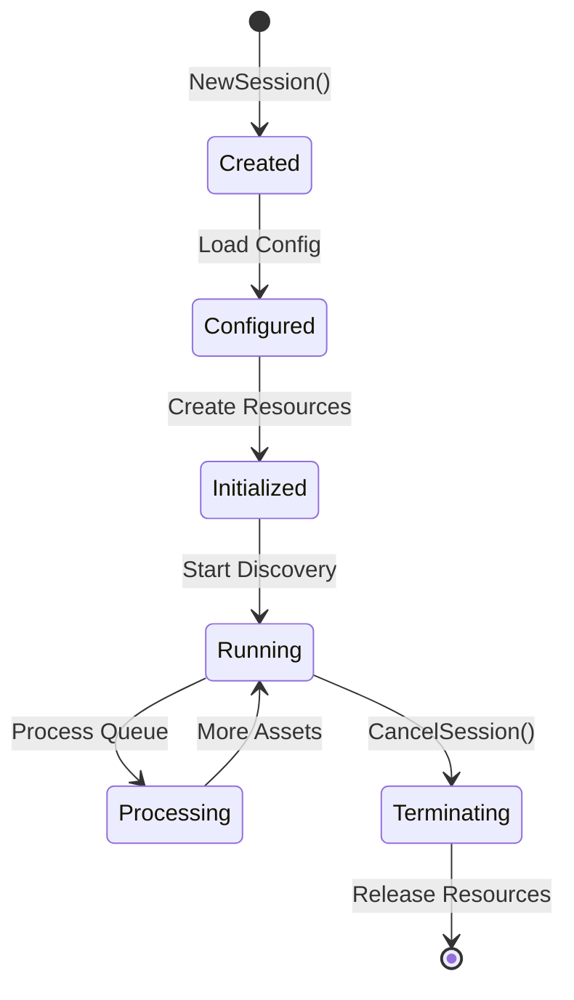
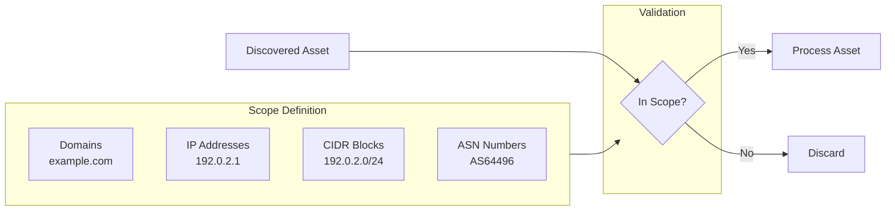
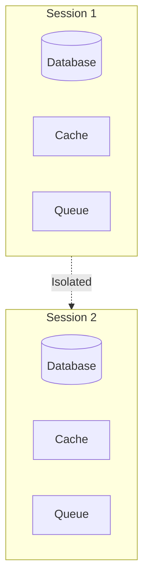
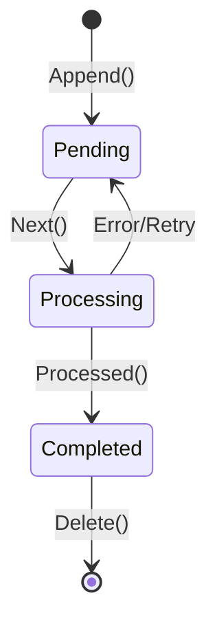
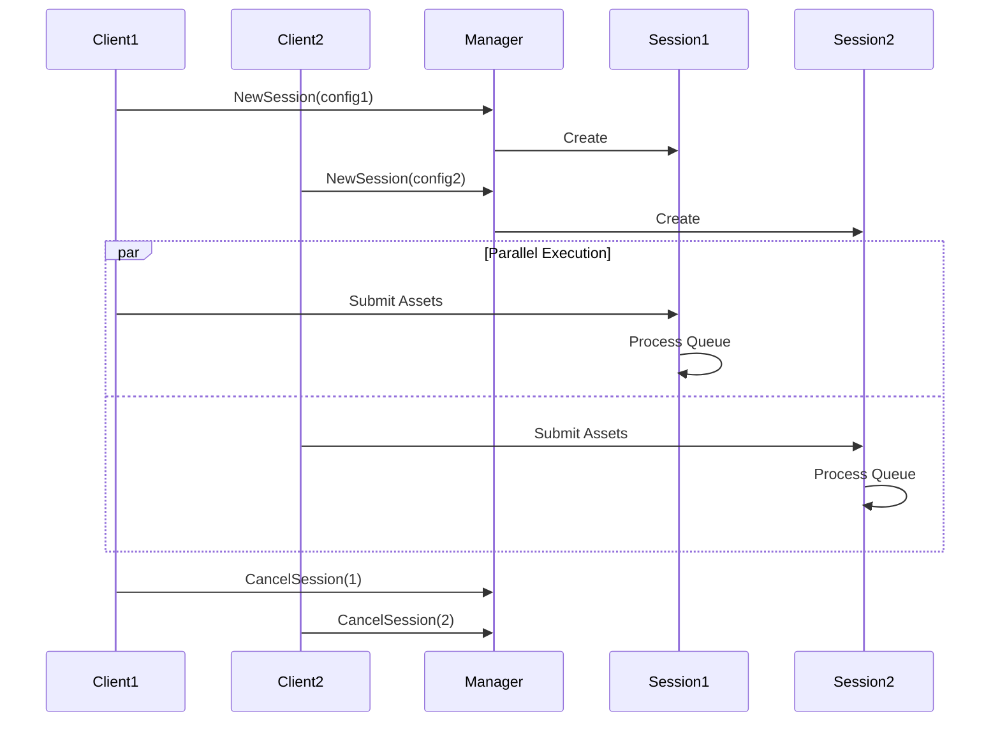

# Session & Scope Management

Amass implements isolated discovery sessions through the `SessionManager`, enabling concurrent enumerations with separate state, configuration, and caching.

## Session Architecture



## Session Lifecycle



### Lifecycle Phases

| Phase | Operations |
|-------|------------|
| **Creation** | `manager.NewSession()` initializes session struct |
| **Configuration** | Load and validate settings |
| **Initialization** | Create temp directory, cache, queue, database |
| **Running** | Process discovery queue |
| **Termination** | `manager.CancelSession()` releases resources |

## Session Components

Each session maintains completely isolated data structures:

| Component | Type | Purpose |
|-----------|------|---------|
| `session.db` | SQLite | Per-session persistent storage |
| `session.cache` | In-memory | Asset deduplication cache |
| `session.queue` | QueueDB | Asset processing queue |
| `session.ranger` | CIDR Ranger | IP range matching |
| `session.config` | Config | Session-specific settings |

## Scope Configuration

### Scope Definition

Scope defines what targets are in-scope for discovery:



### Configuration Methods

| Method | Example |
|--------|---------|
| **CLI Flags** | `-d example.com -cidr 192.0.2.0/24` |
| **Config File** | `scope.domains: [example.com]` |
| **GraphQL API** | `createSessionFromJson(config: {...})` |

### Scope YAML Structure

```yaml
scope:
  domains:
    - example.com
    - example.org
  addresses:
    - 192.0.2.1
    - 192.0.2.10-20
  cidrs:
    - 192.0.2.0/24
    - 198.51.100.0/24
  asns:
    - 64496
    - 64497
  ports:
    - 80
    - 443
    - 8080
```

## Session Isolation



### Isolation Properties

| Property | Isolation Level |
|----------|-----------------|
| **Database** | Separate SQLite file per session |
| **Cache** | Independent in-memory cache |
| **Queue** | Separate processing queue |
| **Configuration** | Session-specific settings |
| **Temporary Files** | Unique temp directory |

## Queue Management

### Queue Table Schema

```sql
CREATE TABLE Element (
    entity_id TEXT PRIMARY KEY,
    etype TEXT NOT NULL,
    processed BOOLEAN DEFAULT FALSE,
    created_at TIMESTAMP DEFAULT CURRENT_TIMESTAMP
);
```

### Queue Operations

| Operation | Description |
|-----------|-------------|
| `Append()` | Add new asset to queue |
| `Next()` | Retrieve next unprocessed asset |
| `Processed()` | Mark asset as completed |
| `Delete()` | Remove from queue |

### Queue State Flow



## CIDR Ranger

The session maintains a CIDR ranger for efficient IP range matching:

```go
// Check if IP is in scope
inScope := session.ranger.Contains(net.ParseIP("192.0.2.50"))
```

### Ranger Operations

| Operation | Description |
|-----------|-------------|
| `Add(cidr)` | Add CIDR block to ranger |
| `Contains(ip)` | Check if IP is in any range |
| `Remove(cidr)` | Remove CIDR block |

## Concurrent Sessions

Multiple sessions can run concurrently with complete isolation:



## Session Statistics

Query session progress via GraphQL:

```graphql
query {
  sessionStats(sessionId: "session-123") {
    assetsDiscovered
    assetsProcessed
    queueSize
    duration
    status
  }
}
```

## Best Practices

!!! tip "Session Management"
    - Use separate sessions for different targets
    - Set appropriate timeouts to prevent runaway sessions
    - Monitor queue size to track progress
    - Clean up completed sessions to free resources

!!! warning "Resource Usage"
    Each session consumes memory and disk space. For large enumerations, ensure adequate system resources.
