# Session & Scope Management

Amass implements isolated discovery sessions through the `SessionManager`, enabling concurrent enumerations with separate state, configuration, and caching.

## Session Architecture

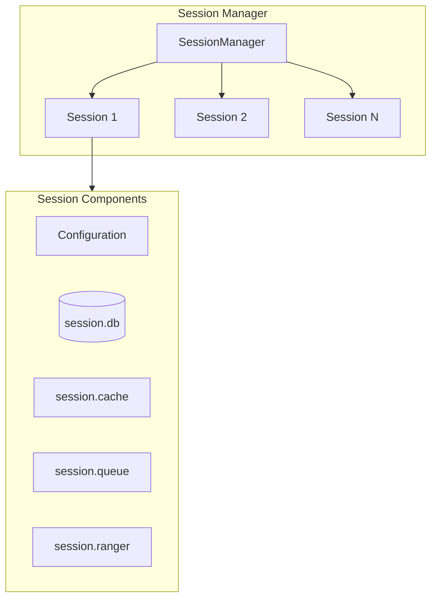

## Session Lifecycle

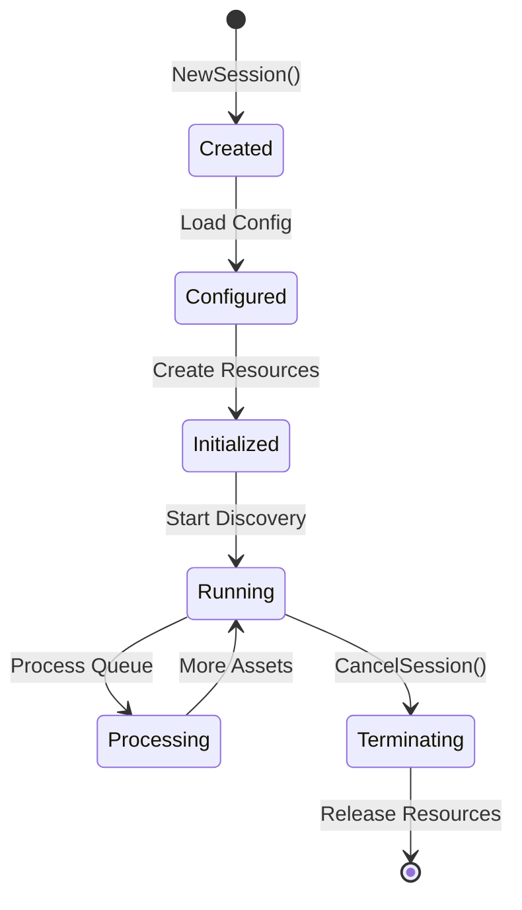

### Lifecycle Phases

| Phase | Operations |
|-------|------------|
| **Creation** | `manager.NewSession()` initializes session struct |
| **Configuration** | Load and validate settings |
| **Initialization** | Create temp directory, cache, queue, database |
| **Running** | Process discovery queue |
| **Termination** | `manager.CancelSession()` releases resources |

## Session Components

Each session maintains completely isolated data structures:

| Component | Type | Purpose |
|-----------|------|---------|
| `session.db` | SQLite | Per-session persistent storage |
| `session.cache` | In-memory | Asset deduplication cache |
| `session.queue` | QueueDB | Asset processing queue |
| `session.ranger` | CIDR Ranger | IP range matching |
| `session.config` | Config | Session-specific settings |

## Scope Configuration

### Scope Definition

Scope defines what targets are in-scope for discovery:

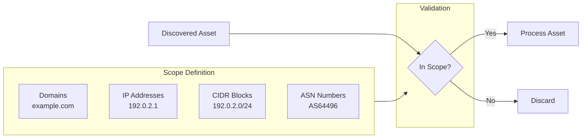

### Configuration Methods

| Method | Example |
|--------|---------|
| **CLI Flags** | `-d example.com -cidr 192.0.2.0/24` |
| **Config File** | `scope.domains: [example.com]` |
| **GraphQL API** | `createSessionFromJson(config: {...})` |

### Scope YAML Structure

```yaml
scope:
  domains:
    - example.com
    - example.org
  addresses:
    - 192.0.2.1
    - 192.0.2.10-20
  cidrs:
    - 192.0.2.0/24
    - 198.51.100.0/24
  asns:
    - 64496
    - 64497
  ports:
    - 80
    - 443
    - 8080
```

## Session Isolation

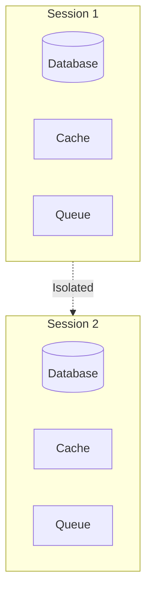

### Isolation Properties

| Property | Isolation Level |
|----------|-----------------|
| **Database** | Separate SQLite file per session |
| **Cache** | Independent in-memory cache |
| **Queue** | Separate processing queue |
| **Configuration** | Session-specific settings |
| **Temporary Files** | Unique temp directory |

## Queue Management

### Queue Table Schema

```sql
CREATE TABLE Element (
    entity_id TEXT PRIMARY KEY,
    etype TEXT NOT NULL,
    processed BOOLEAN DEFAULT FALSE,
    created_at TIMESTAMP DEFAULT CURRENT_TIMESTAMP
);
```

### Queue Operations

| Operation | Description |
|-----------|-------------|
| `Append()` | Add new asset to queue |
| `Next()` | Retrieve next unprocessed asset |
| `Processed()` | Mark asset as completed |
| `Delete()` | Remove from queue |

### Queue State Flow

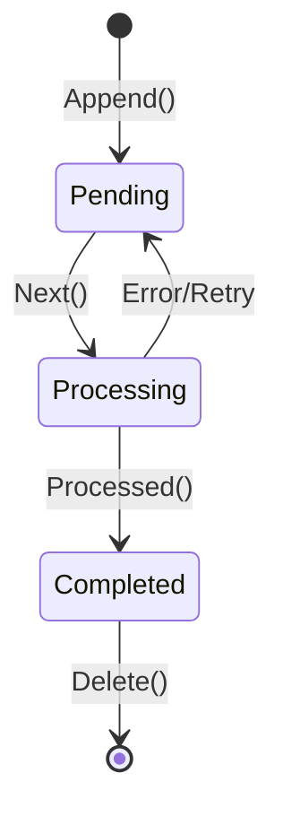

## CIDR Ranger

The session maintains a CIDR ranger for efficient IP range matching:

```go
// Check if IP is in scope
inScope := session.ranger.Contains(net.ParseIP("192.0.2.50"))
```

### Ranger Operations

| Operation | Description |
|-----------|-------------|
| `Add(cidr)` | Add CIDR block to ranger |
| `Contains(ip)` | Check if IP is in any range |
| `Remove(cidr)` | Remove CIDR block |

## Concurrent Sessions

Multiple sessions can run concurrently with complete isolation:

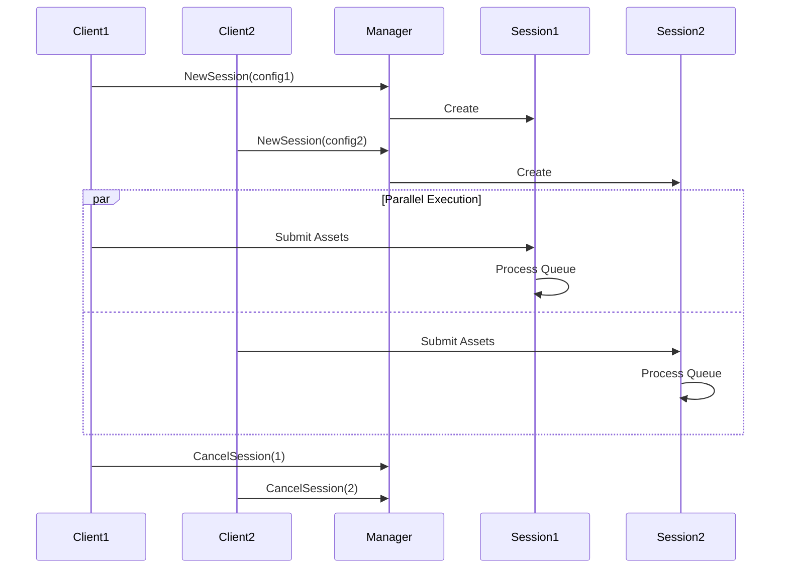

## Session Statistics

Query session progress via GraphQL:

```graphql
query {
  sessionStats(sessionId: "session-123") {
    assetsDiscovered
    assetsProcessed
    queueSize
    duration
    status
  }
}
```

## Technical Reference

### Session Object

The `Session` struct represents the state of an active engine enumeration. Each session is uniquely identified by a UUID and contains all necessary components to execute an independent enumeration operation.

| Field | Type | Purpose |
|-------|------|---------|
| `id` | `uuid.UUID` | Unique identifier for the session |
| `log` | `*slog.Logger` | Structured JSON logger for session events |
| `ps` | `*pubsub.Logger` | Publish-subscribe logger for GraphQL subscriptions |
| `cfg` | `*config.Config` | Session configuration including scope and transformations |
| `scope` | `*scope.Scope` | Determines which assets are in-scope for enumeration |
| `db` | `repository.Repository` | Primary database connection (SQLite, Postgres, or Neo4j) |
| `cache` | `*cache.Cache` | Two-tier cache with temporary and persistent storage |
| `queue` | `*sessionQueue` | Work queue backed by SQLite database |
| `ranger` | `cidranger.Ranger` | CIDR range manager for IP address matching |
| `tmpdir` | `string` | Temporary directory for session-specific files |
| `stats` | `*et.SessionStats` | Work item counters (completed vs total) |
| `done` | `chan struct{}` | Signals session termination |
| `finished` | `bool` | Indicates if session has been terminated |

**Session Component Architecture**

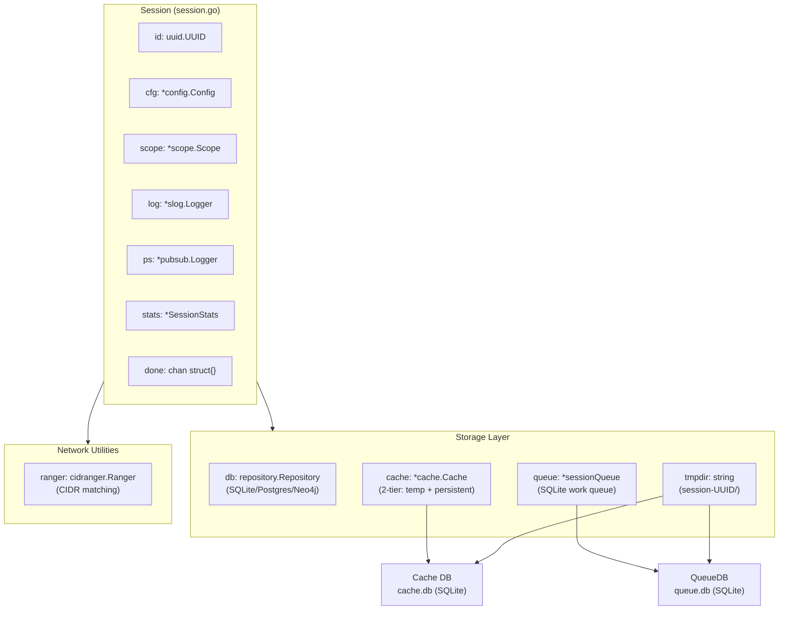

### Session Creation Flow

Sessions are created via the `CreateSession` function, which performs the following initialization sequence:

1. **Configuration Validation**: Uses provided config or creates default
2. **Session Object Creation**: Generates UUID, initializes scope, ranger, and stats
3. **Database Setup**: Determines primary database from config and establishes connection
4. **Temporary Directory**: Creates `session-{UUID}` directory in output path
5. **Cache Initialization**: Creates file-based cache repository with 1-minute TTL
6. **Queue Creation**: Initializes SQLite-backed work queue

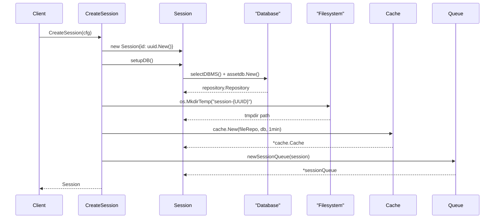

### Database Selection

The `selectDBMS` method determines which database to use based on the `GraphDBs` configuration. If no primary database is specified, SQLite is used by default.

| System | DSN Format | Default Pragmas |
|--------|-----------|-----------------|
| **SQLite** | `{output_dir}/assetdb.db?_pragma=...` | `busy_timeout(30000)`, `journal_mode(WAL)` |
| **Postgres** | `host={host} port={port} user={user} password={pass} dbname={db}` | None |
| **Neo4j** | `{url}` (`bolt://` or `neo4j://`) | None |

### Session Manager

The `manager` struct is a singleton that manages the lifecycle of all active sessions. It provides thread-safe operations using a `sync.RWMutex` and maintains a map of session UUIDs to Session objects.

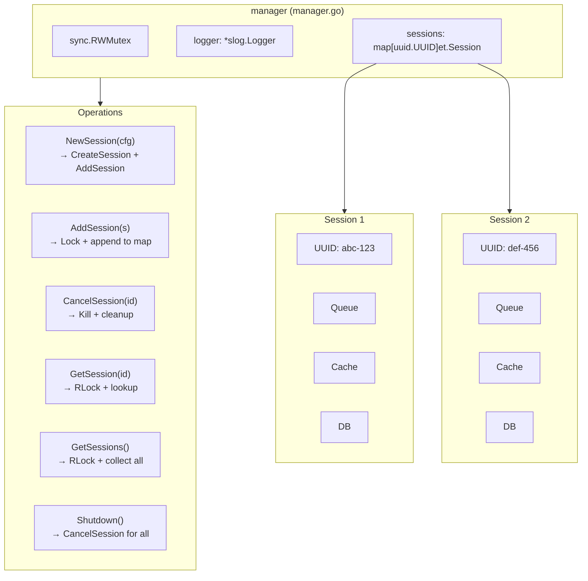

### Session Termination

The `CancelSession` method performs graceful termination:

1. **Signal Termination**: Calls `s.Kill()` to close the `done` channel
2. **Wait for Completion**: Polls session stats every 500ms until all work items are completed
3. **Cleanup Resources**: Closes queue DB, cache, nullifies CIDR ranger, removes temp directory, closes primary DB
4. **Remove from Map**: Deletes the session from the manager's map

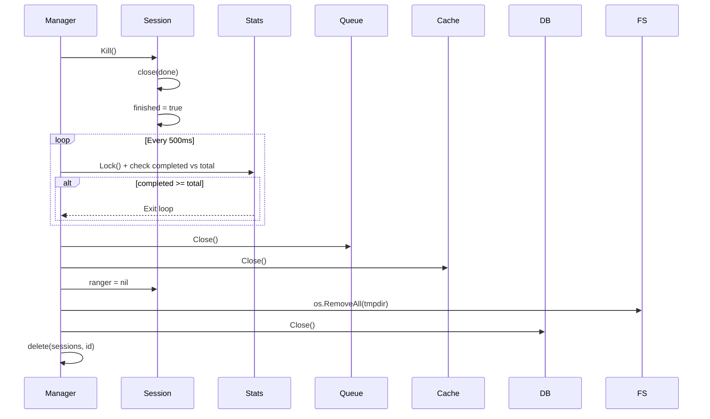

### Queue Operations Detail

**Work Queue Flow**

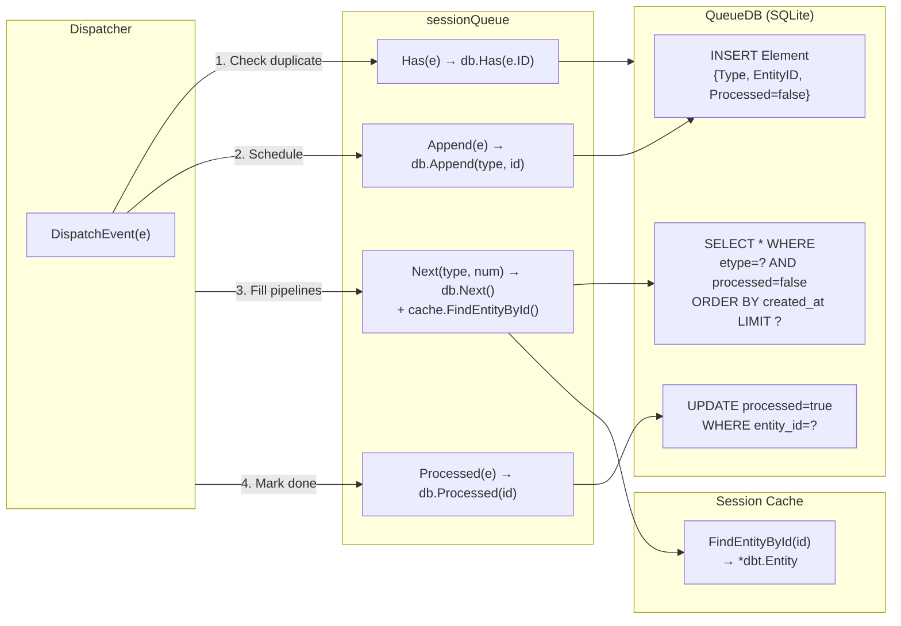

### GraphQL Client/Server Architecture

Sessions are exposed via a GraphQL API that enables remote enumeration control. The API follows a client-server architecture where `amass enum` acts as a client and `amass engine` runs the server.

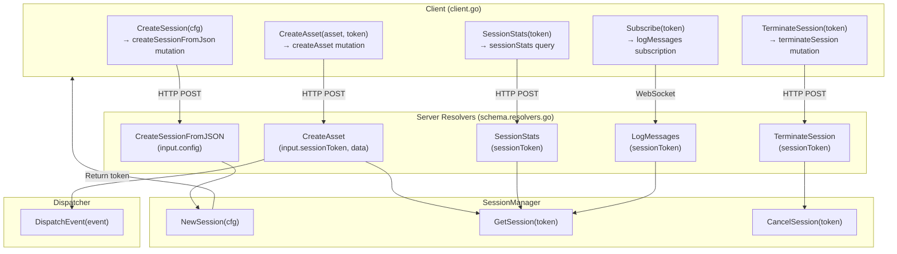

## Best Practices

!!! tip "Session Management"
    - Use separate sessions for different targets
    - Set appropriate timeouts to prevent runaway sessions
    - Monitor queue size to track progress
    - Clean up completed sessions to free resources

!!! warning "Resource Usage"
    Each session consumes memory and disk space. For large enumerations, ensure adequate system resources.
