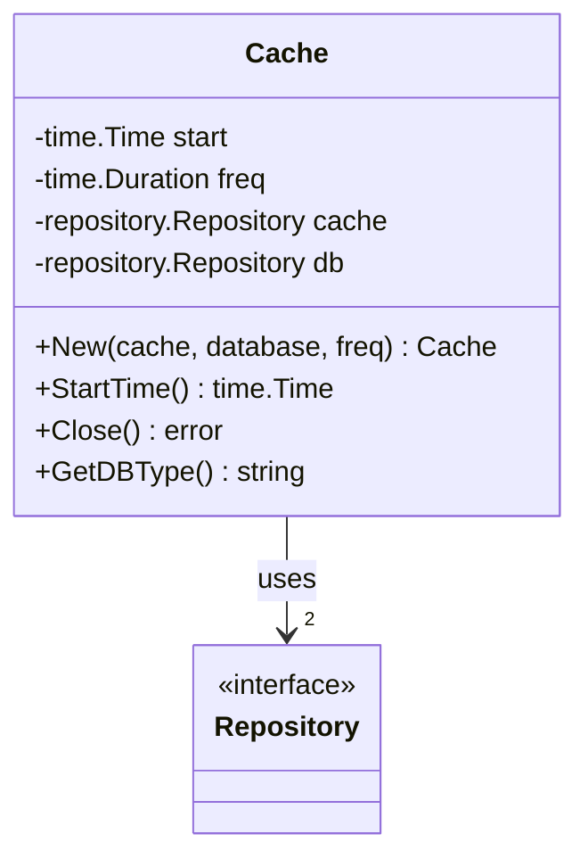
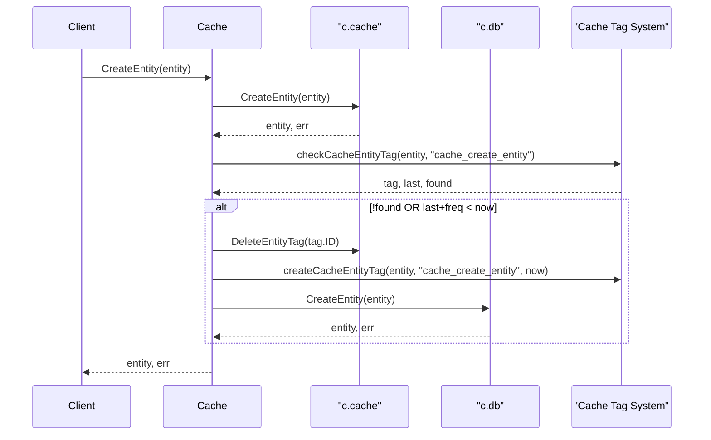
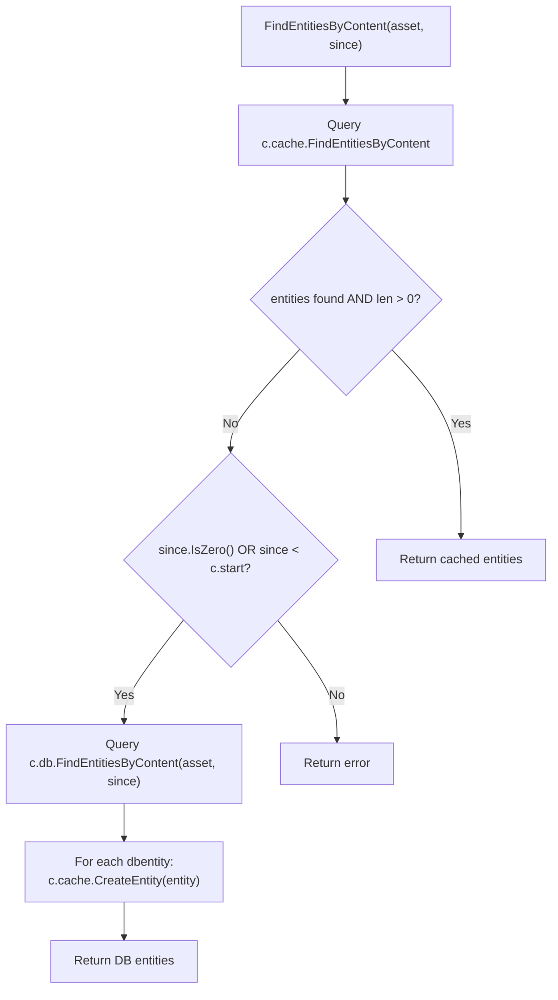
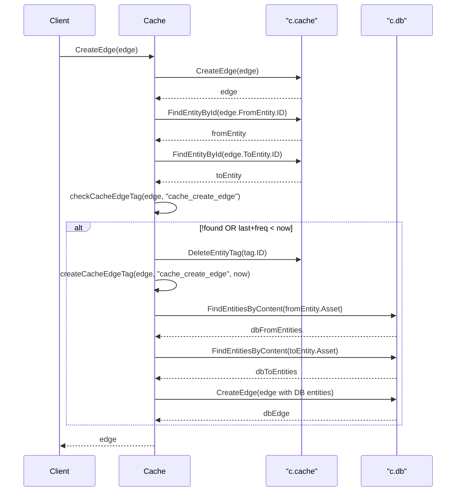
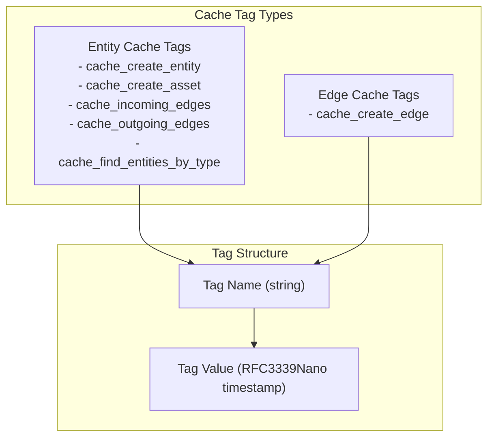
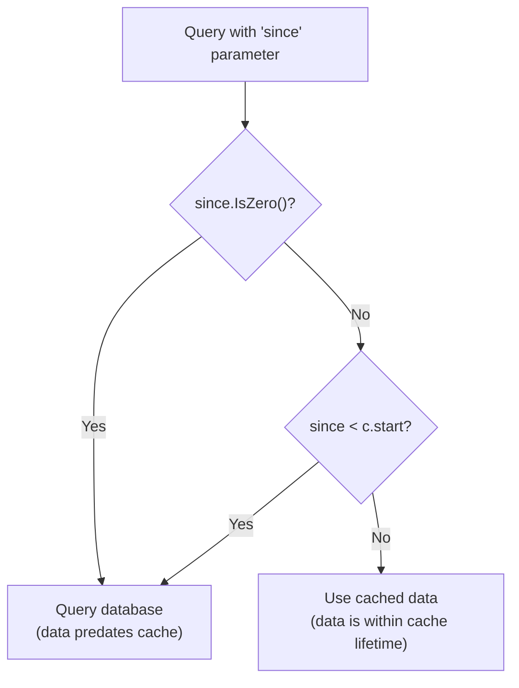

# Cache Interface

This page documents the Cache interface implementation and its methods. The Cache provides a performance optimization layer that wraps any `repository.Repository` implementation with an in-memory cache and frequency-based write throttling.

For overall cache architecture and design patterns, see [Cache Architecture](./caching.md#cache-architecture). For cache-specific behavior with entities and edges, see [Entity Caching](#6.2) and [Edge Caching](#6.3). This page focuses on the API reference for the `Cache` type and its methods.

---

# Cache Type and Initialization

## Cache Structure

The `Cache` type wraps two repository instances: an in-memory cache repository and a persistent database repository.



| Field | Type | Description |
|-------|------|-------------|
| `start` | `time.Time` | Timestamp when the cache was created, used as a baseline for temporal queries |
| `freq` | `time.Duration` | Frequency threshold for write throttling to the persistent database |
| `cache` | `repository.Repository` | In-memory repository for fast data access |
| `db` | `repository.Repository` | Persistent repository for durable storage |

---

## New Function

```go
func New(cache, database repository.Repository, freq time.Duration) (*Cache, error)
```

Creates a new `Cache` instance that wraps two repositories with frequency-based throttling.

**Parameters:**
- `cache`: In-memory repository implementation (typically SQLite in-memory)
- `database`: Persistent repository implementation (PostgreSQL, SQLite file, or Neo4j)
- `freq`: Duration threshold for throttling writes to the persistent database

**Returns:** `*Cache` instance and error

---

## Utility Methods

### StartTime

```go
func (c *Cache) StartTime() time.Time
```

Returns the timestamp when the cache was created. This baseline time is used internally to determine whether `since` parameters in queries should trigger database queries.

### Close

```go
func (c *Cache) Close() error
```

Closes the cache repository. Note that this only closes the cache repository; the persistent database repository must be closed separately.

### GetDBType

```go
func (c *Cache) GetDBType() string
```

Returns the database type of the underlying persistent repository (e.g., "postgres", "sqlite", "neo4j").

---

# Entity Operations

## CreateEntity

```go
func (c *Cache) CreateEntity(input *types.Entity) (*types.Entity, error)
```

Creates an entity in both the cache and (conditionally) the persistent database.

**Behavior Flow:**



**Write Throttling:** The entity is always written to the cache immediately. However, it is only written to the persistent database if:
1. No `cache_create_entity` tag exists for this entity, OR
2. The existing tag's timestamp plus `c.freq` is before the current time

---

## CreateAsset

```go
func (c *Cache) CreateAsset(asset oam.Asset) (*types.Entity, error)
```

Creates an entity from an OAM Asset with the same caching and throttling behavior as `CreateEntity`.

**Write Throttling:** Uses the `cache_create_asset` tag for frequency-based throttling.

---

## FindEntityById

```go
func (c *Cache) FindEntityById(id string) (*types.Entity, error)
```

Retrieves an entity by its ID from the cache repository only. Does not query the persistent database.

---

## FindEntitiesByContent

```go
func (c *Cache) FindEntitiesByContent(asset oam.Asset, since time.Time) ([]*types.Entity, error)
```

Finds entities matching the given asset content, implementing a cache-aside pattern.

**Cache-Aside Pattern:**



**Temporal Logic:** Only queries the database if `since` is zero or before `c.start`.

---

## FindEntitiesByType

```go
func (c *Cache) FindEntitiesByType(atype oam.AssetType, since time.Time) ([]*types.Entity, error)
```

Finds entities of a specific asset type, with tag-based cache freshness checking.

**Cache Freshness Logic:**
1. Query cache for entities
2. If entities found and `since` is recent (≥ `c.start`), return cached results
3. Check for `cache_find_entities_by_type` tag on first entity
4. If tag missing or `since` is before the tag's timestamp, query database
5. Populate cache with database results and update tags

---

## DeleteEntity

```go
func (c *Cache) DeleteEntity(id string) error
```

Deletes an entity from both the cache and the persistent database.

**Deletion Flow:**
1. Find entity in cache by ID
2. Delete from cache
3. Find matching entities in database by content
4. Delete all matching entities from database

---

# Edge Operations

## CreateEdge

```go
func (c *Cache) CreateEdge(edge *types.Edge) (*types.Edge, error)
```

Creates an edge in the cache and conditionally in the persistent database with frequency-based throttling.

**Edge Creation Flow:**



**Write Throttling:** Uses the `cache_create_edge` tag on the edge to determine if the persistent database should be updated.

---

## FindEdgeById

```go
func (c *Cache) FindEdgeById(id string) (*types.Edge, error)
```

Retrieves an edge by its ID from the cache repository only.

---

## IncomingEdges

```go
func (c *Cache) IncomingEdges(entity *types.Entity, since time.Time, labels ...string) ([]*types.Edge, error)
```

Retrieves edges pointing to the given entity, with tag-based cache freshness checking.

**Cache Tag:** `cache_incoming_edges`

**Query Decision Logic:**

| Condition | Action |
|-----------|--------|
| `since.IsZero()` OR `since < c.start` | Check cache tag for freshness |
| Tag not found OR `since < tag.timestamp` | Query database and populate cache |
| Otherwise | Return cached results |

**Database Query and Cache Population:**
1. Find matching entity in database by content
2. Query `c.db.IncomingEdges(dbEntity, since)`
3. For each database edge, resolve `ToEntity` by ID
4. Create entities and edges in cache

---

## OutgoingEdges

```go
func (c *Cache) OutgoingEdges(entity *types.Entity, since time.Time, labels ...string) ([]*types.Edge, error)
```

Retrieves edges originating from the given entity, with identical caching behavior to `IncomingEdges`.

**Cache Tag:** `cache_outgoing_edges`

---

## DeleteEdge

```go
func (c *Cache) DeleteEdge(id string) error
```

Deletes an edge from both the cache and the persistent database.

**Deletion Flow:**
1. Find edge in cache by ID
2. Find `FromEntity` and `ToEntity` in cache
3. Delete edge from cache
4. Find matching entities in database by content
5. Query outgoing edges from database `FromEntity` with matching label
6. Find edge with matching `ToEntity` and relation content
7. Delete matching edge from database

---

# Tag Management (Internal)

## Cache Tag System

The cache uses special entity and edge tags to track synchronization state and implement frequency-based throttling.



---

## createCacheEntityTag

```go
func (c *Cache) createCacheEntityTag(entity *types.Entity, name string, since time.Time) error
```

Internal helper that creates a cache management tag on an entity with a timestamp value.

**Tag Format:**
- Property Name: `name` (e.g., "cache_create_entity")
- Property Value: `since.Format(time.RFC3339Nano)` (timestamp as string)
- Property Type: `general.SimpleProperty`

---

## checkCacheEntityTag

```go
func (c *Cache) checkCacheEntityTag(entity *types.Entity, name string) (*types.EntityTag, time.Time, bool)
```

Internal helper that retrieves and parses a cache management tag from an entity.

**Returns:**
- `*types.EntityTag`: The tag object (if found)
- `time.Time`: Parsed timestamp from the tag value
- `bool`: `true` if tag exists and timestamp parsed successfully

---

## createCacheEdgeTag

```go
func (c *Cache) createCacheEdgeTag(edge *types.Edge, name string, since time.Time) error
```

Internal helper that creates a cache management tag on an edge with a timestamp value. Identical behavior to `createCacheEntityTag` but operates on edges.

---

## checkCacheEdgeTag

```go
func (c *Cache) checkCacheEdgeTag(edge *types.Edge, name string) (*types.EdgeTag, time.Time, bool)
```

Internal helper that retrieves and parses a cache management tag from an edge. Identical behavior to `checkCacheEntityTag` but operates on edges.

---

# Configuration Parameters

## Frequency Duration (freq)

The `freq` parameter controls write throttling to the persistent database.

| Operation | Cache Tag Used | Throttling Behavior |
|-----------|----------------|---------------------|
| `CreateEntity` | `cache_create_entity` | Only write to DB if tag doesn't exist OR `tag.timestamp + freq < now` |
| `CreateAsset` | `cache_create_asset` | Only write to DB if tag doesn't exist OR `tag.timestamp + freq < now` |
| `CreateEdge` | `cache_create_edge` | Only write to DB if tag doesn't exist OR `tag.timestamp + freq < now` |

**Example:** If `freq = 5 * time.Minute`, repeated calls to `CreateEntity` for the same entity will only update the persistent database every 5 minutes, while the cache is updated immediately.

---

## Start Time Baseline

The `start` field establishes a temporal baseline for cache queries.

**Usage in Temporal Queries:**



**Rationale:** If `since` is before the cache was created (`c.start`), the cache cannot contain the requested historical data, so the database must be queried.

