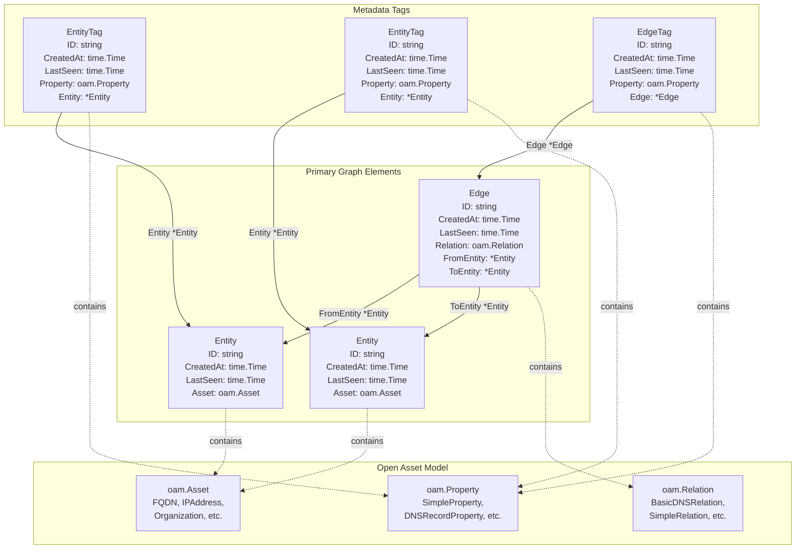
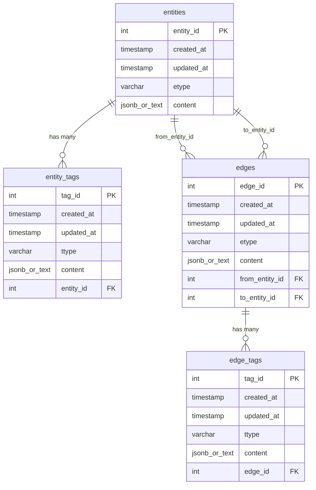
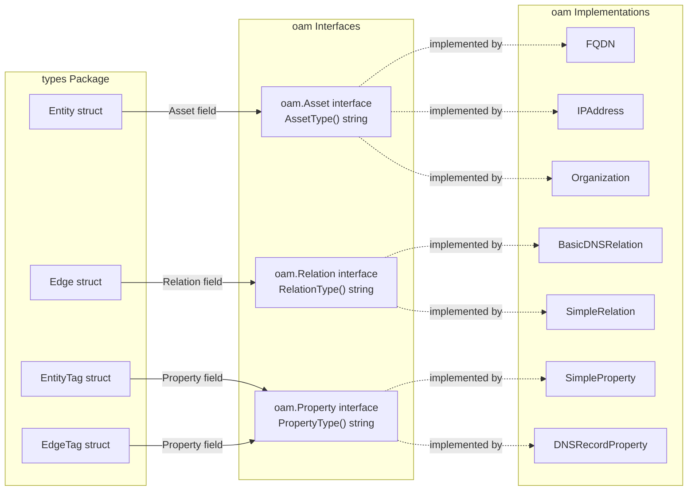

# Core Data Types


This page provides reference documentation for the four core data types defined in the `types` package: `Entity`, `Edge`, `EntityTag`, and `EdgeTag`. These types form the foundation of the asset-db data model and are used consistently across all repository implementations.

For information about how these types are used in the Repository interface operations, see [Repository Interface](./api-reference.md#repository-interface). For details on Open Asset Model integration and asset/property/relation definitions, see [Open Asset Model Integration](./index.md#open-asset-model-integration).

---

# Type Overview

The asset-db system uses four primary data types that implement a property graph model:

| Type | Purpose | Contains | References |
|------|---------|----------|------------|
| `Entity` | Represents a node/asset in the graph | `oam.Asset` | None |
| `Edge` | Represents a directed relationship between entities | `oam.Relation` | `FromEntity`, `ToEntity` |
| `EntityTag` | Metadata property attached to an entity | `oam.Property` | `Entity` |
| `EdgeTag` | Metadata property attached to an edge | `oam.Property` | `Edge` |

All types include temporal fields (`CreatedAt`, `LastSeen`) for tracking data lifecycle and an `ID` field for unique identification.

---

# Entity Type

## Type Definition

The `Entity` type represents an asset node in the graph database.

```go
type Entity struct {
    ID        string
    CreatedAt time.Time
    LastSeen  time.Time
    Asset     oam.Asset
}
```

## Field Descriptions

| Field | Type | Description |
|-------|------|-------------|
| `ID` | `string` | Unique identifier for the entity |
| `CreatedAt` | `time.Time` | Timestamp when the entity was first created |
| `LastSeen` | `time.Time` | Timestamp when the entity was last observed or updated |
| `Asset` | `oam.Asset` | The actual asset data conforming to the Open Asset Model |

## Usage Context

Entities represent discoverable assets such as:
- Fully Qualified Domain Names (FQDNs)
- IP Addresses
- Organizations
- Network Blocks
- Autonomous Systems

The `Asset` field contains the structured data that defines the asset type and its properties, as specified by the Open Asset Model.

---

# EntityTag Type

## Type Definition

The `EntityTag` type represents additional metadata properties attached to an entity.

```go
type EntityTag struct {
    ID        string
    CreatedAt time.Time
    LastSeen  time.Time
    Property  oam.Property
    Entity    *Entity
}
```

## Field Descriptions

| Field | Type | Description |
|-------|------|-------------|
| `ID` | `string` | Unique identifier for the tag |
| `CreatedAt` | `time.Time` | Timestamp when the tag was first created |
| `LastSeen` | `time.Time` | Timestamp when the tag was last observed or updated |
| `Property` | `oam.Property` | The property data conforming to the Open Asset Model |
| `Entity` | `*Entity` | Pointer to the entity this tag is attached to |

## Usage Context

Entity tags provide extensible metadata capabilities, allowing multiple properties to be associated with a single entity without modifying the entity's core structure. Examples include:
- DNS records associated with an FQDN
- Port information for an IP address
- Geolocation data
- Historical snapshots of property values

The many-to-one relationship between tags and entities enables flexible property storage.

---

# Edge Type

## Type Definition

The `Edge` type represents a directed relationship between two entities.

```go
type Edge struct {
    ID         string
    CreatedAt  time.Time
    LastSeen   time.Time
    Relation   oam.Relation
    FromEntity *Entity
    ToEntity   *Entity
}
```

## Field Descriptions

| Field | Type | Description |
|-------|------|-------------|
| `ID` | `string` | Unique identifier for the edge |
| `CreatedAt` | `time.Time` | Timestamp when the edge was first created |
| `LastSeen` | `time.Time` | Timestamp when the edge was last observed or updated |
| `Relation` | `oam.Relation` | The relationship type conforming to the Open Asset Model |
| `FromEntity` | `*Entity` | Pointer to the source entity |
| `ToEntity` | `*Entity` | Pointer to the target entity |

## Usage Context

Edges create directed relationships in the asset graph. The direction is semantically meaningful:
- DNS relationships: FQDN → IP Address
- Organizational ownership: Organization → Asset
- Network containment: Network Block → IP Address

The `Relation` field defines the relationship type and semantics according to the Open Asset Model.

---

# EdgeTag Type

## Type Definition

The `EdgeTag` type represents additional metadata properties attached to an edge.

```go
type EdgeTag struct {
    ID        string
    CreatedAt time.Time
    LastSeen  time.Time
    Property  oam.Property
    Edge      *Edge
}
```

## Field Descriptions

| Field | Type | Description |
|-------|------|-------------|
| `ID` | `string` | Unique identifier for the tag |
| `CreatedAt` | `time.Time` | Timestamp when the tag was first created |
| `LastSeen` | `time.Time` | Timestamp when the tag was last observed or updated |
| `Property` | `oam.Property` | The property data conforming to the Open Asset Model |
| `Edge` | `*Edge` | Pointer to the edge this tag is attached to |

## Usage Context

Edge tags provide metadata for relationships, enabling enriched relationship information without modifying the core edge structure. Examples include:
- Confidence scores for discovered relationships
- Source attribution (which tool discovered the relationship)
- Relationship validity periods
- Protocol-specific information for network relationships

---

# Type Relationships

The following diagram illustrates the relationships between the core data types:

## Diagram: Core Type Relationships



**Relationship Summary:**
- **Edge** maintains directed references to two **Entity** instances via `FromEntity` and `ToEntity` pointers
- **EntityTag** references a single **Entity** via pointer, establishing a many-to-one relationship
- **EdgeTag** references a single **Edge** via pointer, establishing a many-to-one relationship
- All types embed Open Asset Model interfaces: **Entity** contains `oam.Asset`, **Edge** contains `oam.Relation`, and both tag types contain `oam.Property`

---

# Database Schema Mapping

The core types map to database tables in both SQL (PostgreSQL/SQLite) and Neo4j implementations. The following diagram shows the SQL schema structure:

## Diagram: SQL Schema Mapping



## SQL Table Details

### entities Table

Maps to the `Entity` type:

| Column | Type | Go Field | Description |
|--------|------|----------|-------------|
| `entity_id` | INT/INTEGER | `ID` | Primary key, auto-generated |
| `created_at` | TIMESTAMP | `CreatedAt` | Creation timestamp |
| `updated_at` | TIMESTAMP | `LastSeen` | Last update timestamp |
| `etype` | VARCHAR(255)/TEXT | `Asset.AssetType()` | Asset type extracted from OAM |
| `content` | JSONB/TEXT | `Asset` | Serialized asset data |

**Indexes:**
- `idx_entities_updated_at` on `updated_at`
- `idx_entities_etype` on `etype`

### entity_tags Table

Maps to the `EntityTag` type:

| Column | Type | Go Field | Description |
|--------|------|----------|-------------|
| `tag_id` | INT/INTEGER | `ID` | Primary key, auto-generated |
| `created_at` | TIMESTAMP | `CreatedAt` | Creation timestamp |
| `updated_at` | TIMESTAMP | `LastSeen` | Last update timestamp |
| `ttype` | VARCHAR(255)/TEXT | `Property.PropertyType()` | Property type extracted from OAM |
| `content` | JSONB/TEXT | `Property` | Serialized property data |
| `entity_id` | INT/INTEGER | `Entity.ID` | Foreign key to entities table |

**Indexes:**
- `idx_enttag_updated_at` on `updated_at`
- `idx_enttag_entity_id` on `entity_id`

**Foreign Key:** `entity_id` references `entities(entity_id)` with `ON DELETE CASCADE`

### edges Table

Maps to the `Edge` type:

| Column | Type | Go Field | Description |
|--------|------|----------|-------------|
| `edge_id` | INT/INTEGER | `ID` | Primary key, auto-generated |
| `created_at` | TIMESTAMP | `CreatedAt` | Creation timestamp |
| `updated_at` | TIMESTAMP | `LastSeen` | Last update timestamp |
| `etype` | VARCHAR(255)/TEXT | `Relation.RelationType()` | Relation type extracted from OAM |
| `content` | JSONB/TEXT | `Relation` | Serialized relation data |
| `from_entity_id` | INT/INTEGER | `FromEntity.ID` | Foreign key to source entity |
| `to_entity_id` | INT/INTEGER | `ToEntity.ID` | Foreign key to target entity |

**Indexes:**
- `idx_edge_updated_at` on `updated_at`
- `idx_edge_from_entity_id` on `from_entity_id`
- `idx_edge_to_entity_id` on `to_entity_id`

**Foreign Keys:**
- `from_entity_id` references `entities(entity_id)` with `ON DELETE CASCADE`
- `to_entity_id` references `entities(entity_id)` with `ON DELETE CASCADE`

### edge_tags Table

Maps to the `EdgeTag` type:

| Column | Type | Go Field | Description |
|--------|------|----------|-------------|
| `tag_id` | INT/INTEGER | `ID` | Primary key, auto-generated |
| `created_at` | TIMESTAMP | `CreatedAt` | Creation timestamp |
| `updated_at` | TIMESTAMP | `LastSeen` | Last update timestamp |
| `ttype` | VARCHAR(255)/TEXT | `Property.PropertyType()` | Property type extracted from OAM |
| `content` | JSONB/TEXT | `Property` | Serialized property data |
| `edge_id` | INT/INTEGER | `Edge.ID` | Foreign key to edges table |

**Indexes:**
- `idx_edgetag_updated_at` on `updated_at`
- `idx_edgetag_edge_id` on `edge_id`

**Foreign Key:** `edge_id` references `edges(edge_id)` with `ON DELETE CASCADE`

---

# Temporal Field Semantics

All four core types include two temporal fields that track data lifecycle:

## CreatedAt Field

- **Type:** `time.Time`
- **Semantic Meaning:** Records when the record was first inserted into the database
- **Mutability:** Set once on creation, never updated
- **Database Default:** `CURRENT_TIMESTAMP` at insertion time
- **Usage:** Useful for historical analysis and data auditing

## LastSeen Field

- **Type:** `time.Time`
- **Semantic Meaning:** Records when the record was last observed or confirmed
- **Mutability:** Updated whenever the record is re-discovered or reconfirmed
- **Database Column:** Maps to `updated_at` column in SQL schemas
- **Usage:** Critical for temporal queries, stale data detection, and incremental updates

## Temporal Query Patterns

The `since` parameter in repository query methods leverages the `LastSeen`/`updated_at` field:

```go
// Example: Find entities updated after a specific time
entities, err := repo.FindEntitiesByType("fqdn", since)
```

This pattern enables:
- **Incremental Processing:** Only fetch records modified since last processing
- **Change Detection:** Identify new or updated assets
- **Stale Data Filtering:** Exclude outdated records from queries
- **Temporal Windowing:** Query data within specific time ranges

---

# Open Asset Model Integration

The core types leverage the Open Asset Model (OAM) for standardized asset definitions:

## Diagram: OAM Integration in Core Types



## Type Extraction Methods

Each OAM interface provides a type identification method:

| OAM Interface | Method | Return Value Example |
|---------------|--------|----------------------|
| `oam.Asset` | `AssetType()` | `"fqdn"`, `"ipaddress"`, `"organization"` |
| `oam.Relation` | `RelationType()` | `"basic_dns_relation"`, `"simple_relation"` |
| `oam.Property` | `PropertyType()` | `"simple_property"`, `"dns_record_property"` |

These type strings are stored in the `etype` (entities, edges) and `ttype` (entity_tags, edge_tags) database columns, enabling type-based queries and filtering.

## Serialization Contract

The OAM types must be serializable:
- **PostgreSQL:** Uses JSONB columns for efficient storage and querying
- **SQLite:** Uses TEXT columns with JSON serialization
- **Neo4j:** Stores as properties on nodes and relationships

Repository implementations handle serialization/deserialization transparently.

---

# Field Naming Conventions

The core types follow consistent naming patterns:

| Go Field Name | Database Column Name | Purpose |
|---------------|---------------------|----------|
| `ID` | `entity_id`, `edge_id`, `tag_id` | Primary key identifier |
| `CreatedAt` | `created_at` | Initial creation timestamp |
| `LastSeen` | `updated_at` | Last observation timestamp |
| `Asset` | `etype` (type), `content` (data) | OAM asset in entities |
| `Relation` | `etype` (type), `content` (data) | OAM relation in edges |
| `Property` | `ttype` (type), `content` (data) | OAM property in tags |
| `Entity` | `entity_id` | Foreign key reference |
| `Edge` | `edge_id` | Foreign key reference |
| `FromEntity` | `from_entity_id` | Source entity foreign key |
| `ToEntity` | `to_entity_id` | Target entity foreign key |

This consistent mapping simplifies understanding the relationship between Go types and database schemas across different implementations.

# See Also

- [Architecture](./index.md#architecture)
- [Caching](./caching.md)
- [Getting Started](./getting-started.md)
