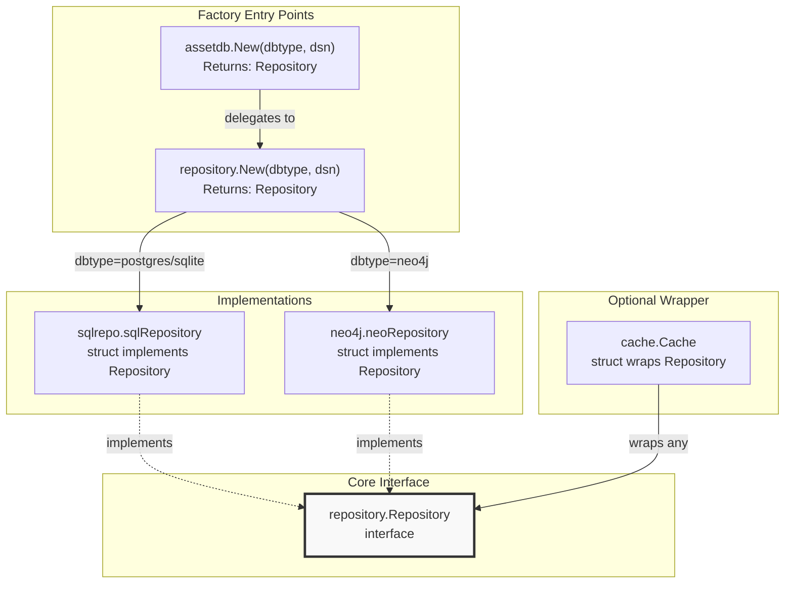
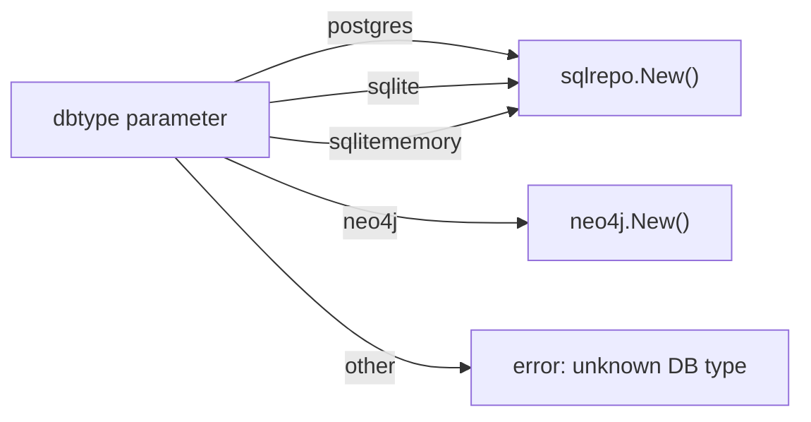
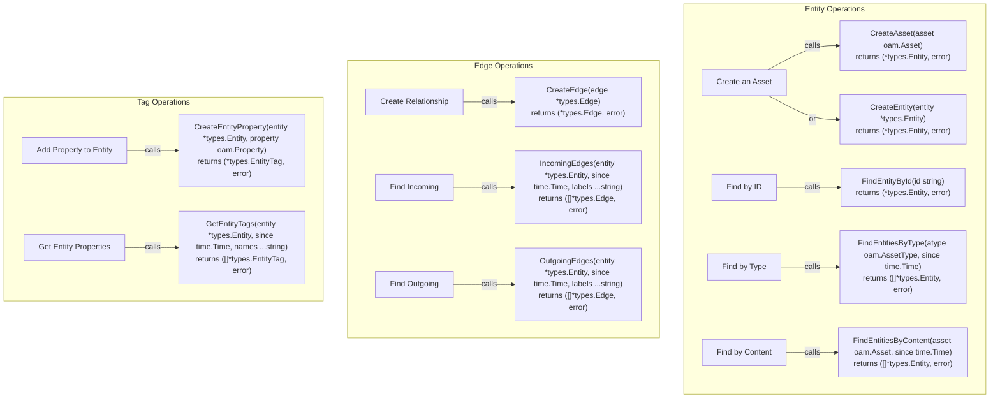
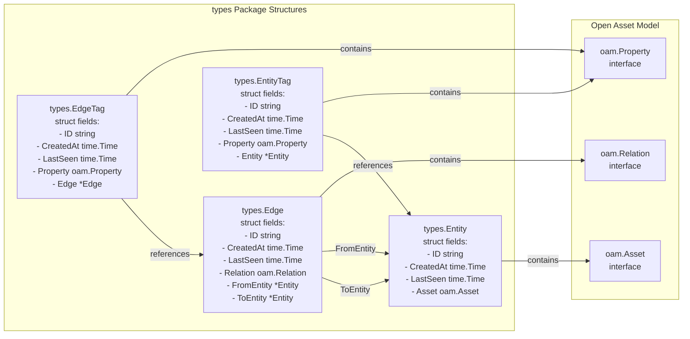
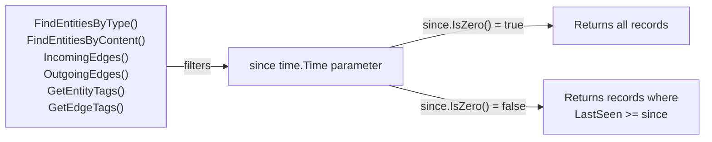
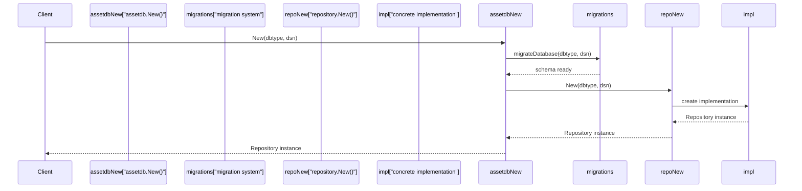
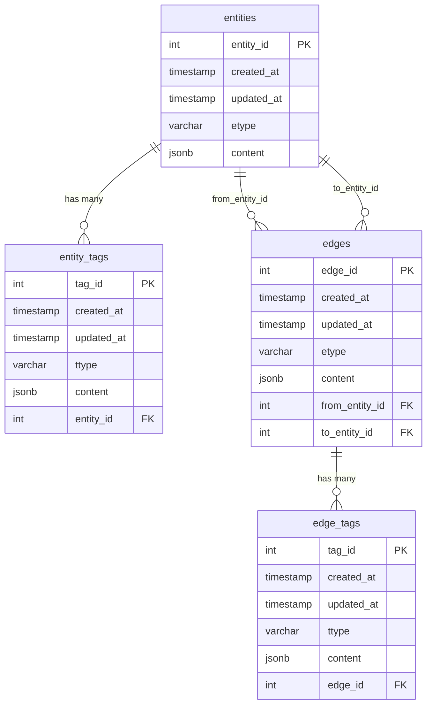

# API Reference

This page provides an overview of the asset-db API structure and conventions. It describes the main interfaces, factory methods, and type system that developers interact with when using asset-db as a library.

For detailed documentation of specific methods, see:
- **[Repository Interface](./api-reference.md#repository-interface)** - Complete method signatures and behavior
- **[Cache Interface](./api-reference.md#cache-interface)** - Caching layer methods and configuration
- **[Core Data Types](./api-reference.md#core-data-types)** - Entity, Edge, EntityTag, and EdgeTag structures

For architectural context about how these APIs fit into the system design, see [Architecture](./index.md#architecture).

---

## API Organization

The asset-db API is organized into three primary areas:

| Component | Package | Purpose |
|-----------|---------|---------|
| **Repository Interface** | `repository` | Core abstraction for all database operations |
| **Cache Wrapper** | `cache` | Optional performance layer wrapping any Repository |
| **Data Types** | `types` | Entity, Edge, and Tag structures used throughout the API |

All database implementations (SQL and Neo4j) satisfy the `repository.Repository` interface, providing a unified API regardless of the underlying storage mechanism.

---

## Interface Hierarchy

The following diagram shows how the main interfaces and implementations relate to each other in code:

**Factory Method Selection Logic:**

---

## Repository Method Categories

The `repository.Repository` interface defines 22 methods organized into logical operation categories:

### Method Organization Table

| Category | Method Count | Methods |
|----------|--------------|---------|
| **Metadata** | 1 | `GetDBType()` |
| **Entity Operations** | 6 | `CreateEntity()`, `CreateAsset()`, `FindEntityById()`, `FindEntitiesByContent()`, `FindEntitiesByType()`, `DeleteEntity()` |
| **Edge Operations** | 5 | `CreateEdge()`, `FindEdgeById()`, `IncomingEdges()`, `OutgoingEdges()`, `DeleteEdge()` |
| **Entity Tag Operations** | 5 | `CreateEntityTag()`, `CreateEntityProperty()`, `FindEntityTagById()`, `FindEntityTagsByContent()`, `GetEntityTags()`, `DeleteEntityTag()` |
| **Edge Tag Operations** | 4 | `CreateEdgeTag()`, `CreateEdgeProperty()`, `FindEdgeTagById()`, `FindEdgeTagsByContent()`, `GetEdgeTags()`, `DeleteEdgeTag()` |
| **Lifecycle** | 1 | `Close()` |

### Method Signature Patterns

The following diagram maps natural language operations to actual method signatures in the codebase:

---

## Core Type System

The API uses four primary data structures from the `types` package:

### Type Field Summary

| Type | ID Type | Content Field | Reference Field(s) |
|------|---------|---------------|-------------------|
| `Entity` | `string` | `Asset oam.Asset` | - |
| `Edge` | `string` | `Relation oam.Relation` | `FromEntity`, `ToEntity` |
| `EntityTag` | `string` | `Property oam.Property` | `Entity` |
| `EdgeTag` | `string` | `Property oam.Property` | `Edge` |

All types include temporal metadata: `CreatedAt` (immutable creation time) and `LastSeen` (updated on each observation).

---

## Common API Patterns

### Time-Based Query Pattern

Many find operations accept a `since time.Time` parameter to enable temporal queries:

### Dual Creation Methods Pattern

For both entities and tags, the API provides two creation methods:

| Low-Level Method | High-Level Method | Difference |
|------------------|-------------------|------------|
| `CreateEntity(entity *types.Entity)` | `CreateAsset(asset oam.Asset)` | Wraps asset in Entity struct |
| `CreateEntityTag(entity, tag)` | `CreateEntityProperty(entity, property)` | Wraps property in EntityTag struct |
| `CreateEdgeTag(edge, tag)` | `CreateEdgeProperty(edge, property)` | Wraps property in EdgeTag struct |

The high-level methods (`CreateAsset`, `CreateEntityProperty`, `CreateEdgeProperty`) are convenience wrappers that handle the struct initialization internally.

---

## Factory Methods

### Primary Entry Point: `assetdb.New()`

**Supported Database Types:**

| `dbtype` String | Implementation | Package |
|----------------|----------------|---------|
| `"postgres"` | PostgreSQL with GORM | `repository/sqlrepo` |
| `"sqlite"` | SQLite file-based with GORM | `repository/sqlrepo` |
| `"sqlitememory"` | SQLite in-memory with GORM | `repository/sqlrepo` |
| `"neo4j"` | Neo4j graph database | `repository/neo4j` |

---

## Database Schema Mapping

The Repository interface methods map to the following database schema structures:

### SQL Schema (PostgreSQL/SQLite)

**Key Schema Characteristics:**

- **Primary Keys:** Auto-incrementing integers (`entity_id`, `edge_id`, `tag_id`)
- **Content Storage:** JSONB in PostgreSQL, TEXT in SQLite (serialized JSON)
- **Type Fields:** `etype` and `ttype` store the OAM type identifier
- **Timestamps:** `created_at` (immutable) and `updated_at` (corresponds to `LastSeen`)
- **Foreign Keys:** Cascade delete ensures referential integrity

---

## Error Handling Conventions

All Repository methods that can fail return `error` as their last return value. Common error scenarios include:

| Error Scenario | Affected Methods | Typical Error Message Pattern |
|----------------|------------------|-------------------------------|
| Record not found | `FindEntityById()`, `FindEdgeById()`, `FindEntityTagById()`, `FindEdgeTagById()` | Returns `nil` result with `nil` error, or specific not-found error |
| Invalid reference | `CreateEdge()`, `CreateEntityTag()`, `CreateEdgeTag()` | Foreign key constraint violations |
| Connection failure | All methods | Database connection errors |
| Invalid input | `CreateEntity()`, `CreateAsset()` | Validation errors |

The specific error types and messages vary by implementation (SQL vs Neo4j).

---

## Concurrency and Thread Safety

The `repository.Repository` interface implementations have the following concurrency characteristics:

- **SQL Repositories:** Thread-safe through GORM's connection pooling
- **Neo4j Repository:** Thread-safe through neo4j-go-driver's session management
- **Cache Wrapper:** Requires external synchronization for concurrent access

For production use with concurrent goroutines, clients should implement their own synchronization or use a connection pool at the application level.

---

## Method Naming Conventions

The API follows consistent naming patterns:

| Prefix | Meaning | Returns | Example |
|--------|---------|---------|---------|
| `Create*` | Inserts new record | Single object + error | `CreateEntity()` |
| `Find*ById` | Retrieves by ID | Single object + error | `FindEntityById()` |
| `Find*By*` | Searches by criteria | Slice of objects + error | `FindEntitiesByType()` |
| `Get*` | Retrieves related records | Slice of objects + error | `GetEntityTags()` |
| `*Edges` | Graph traversal | Slice of edges + error | `IncomingEdges()` |
| `Delete*` | Removes record | error only | `DeleteEntity()` |

---

## Summary

The asset-db API provides:

1. **Unified Interface:** `repository.Repository` abstracts SQL and Neo4j databases
2. **Factory Pattern:** `assetdb.New()` and `repository.New()` handle implementation selection
3. **Type Safety:** Strong typing through `types.Entity`, `types.Edge`, and tag structures
4. **Temporal Queries:** Consistent `since time.Time` parameter for filtering by `LastSeen`
5. **OAM Integration:** Direct support for Open Asset Model types through `CreateAsset()` and `CreateEntityProperty()` convenience methods

For detailed method signatures and behaviors, see the child pages listed at the top of this document.

