# API Reference

## Purpose and Scope

This page provides an overview of the asset-db API structure and conventions. It describes the main interfaces, factory methods, and type system that developers interact with when using asset-db as a library.

For detailed documentation of specific methods, see:
- **[Repository Interface](./api-reference.md#repository-interface)** - Complete method signatures and behavior
- **[Cache Interface](./api-reference.md#cache-interface)** - Caching layer methods and configuration
- **[Core Data Types](./api-reference.md#core-data-types)** - Entity, Edge, EntityTag, and EdgeTag structures

For architectural context about how these APIs fit into the system design, see [Architecture](./index.md#architecture).

---

## API Organization

The asset-db API is organized into three primary areas:

| Component | Package | Purpose |
|-----------|---------|---------|
| **Repository Interface** | `repository` | Core abstraction for all database operations |
| **Cache Wrapper** | `cache` | Optional performance layer wrapping any Repository |
| **Data Types** | `types` | Entity, Edge, and Tag structures used throughout the API |

All database implementations (SQL and Neo4j) satisfy the `repository.Repository` interface, providing a unified API regardless of the underlying storage mechanism.

---

## Interface Hierarchy

The following diagram shows how the main interfaces and implementations relate to each other in code:

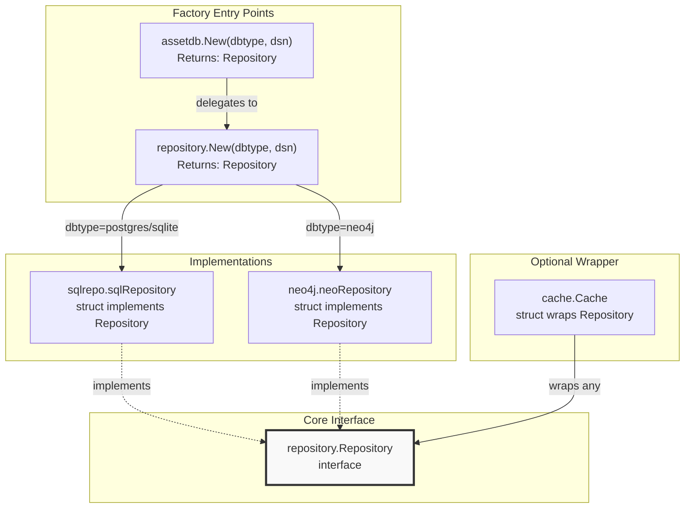

**Factory Method Selection Logic:**

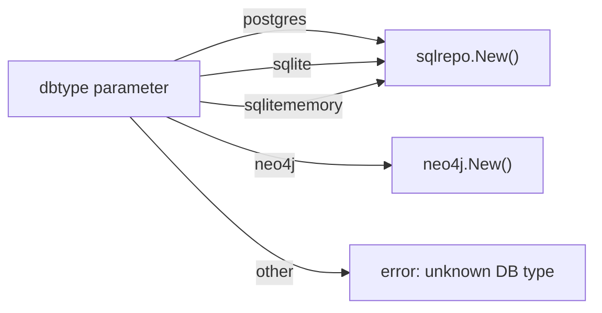

---

## Repository Method Categories

The `repository.Repository` interface defines 22 methods organized into logical operation categories:

### Method Organization Table

| Category | Method Count | Methods |
|----------|--------------|---------|
| **Metadata** | 1 | `GetDBType()` |
| **Entity Operations** | 6 | `CreateEntity()`, `CreateAsset()`, `FindEntityById()`, `FindEntitiesByContent()`, `FindEntitiesByType()`, `DeleteEntity()` |
| **Edge Operations** | 5 | `CreateEdge()`, `FindEdgeById()`, `IncomingEdges()`, `OutgoingEdges()`, `DeleteEdge()` |
| **Entity Tag Operations** | 5 | `CreateEntityTag()`, `CreateEntityProperty()`, `FindEntityTagById()`, `FindEntityTagsByContent()`, `GetEntityTags()`, `DeleteEntityTag()` |
| **Edge Tag Operations** | 4 | `CreateEdgeTag()`, `CreateEdgeProperty()`, `FindEdgeTagById()`, `FindEdgeTagsByContent()`, `GetEdgeTags()`, `DeleteEdgeTag()` |
| **Lifecycle** | 1 | `Close()` |

### Method Signature Patterns

The following diagram maps natural language operations to actual method signatures in the codebase:

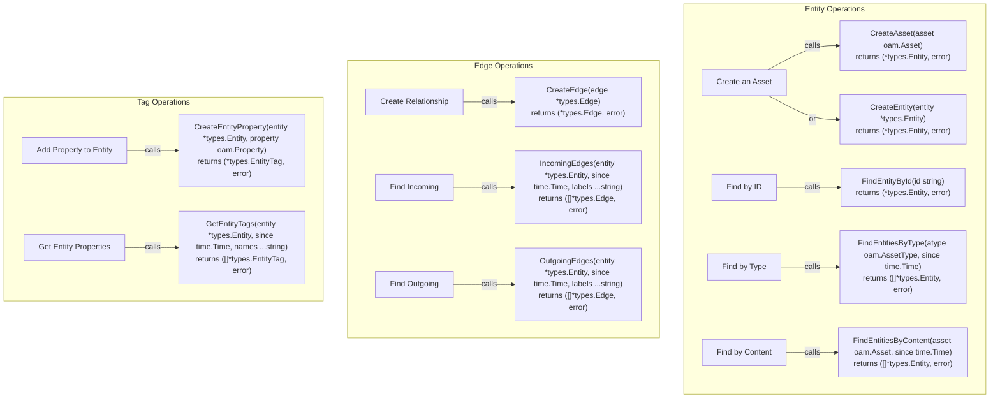

---

## Core Type System

The API uses four primary data structures from the `types` package:

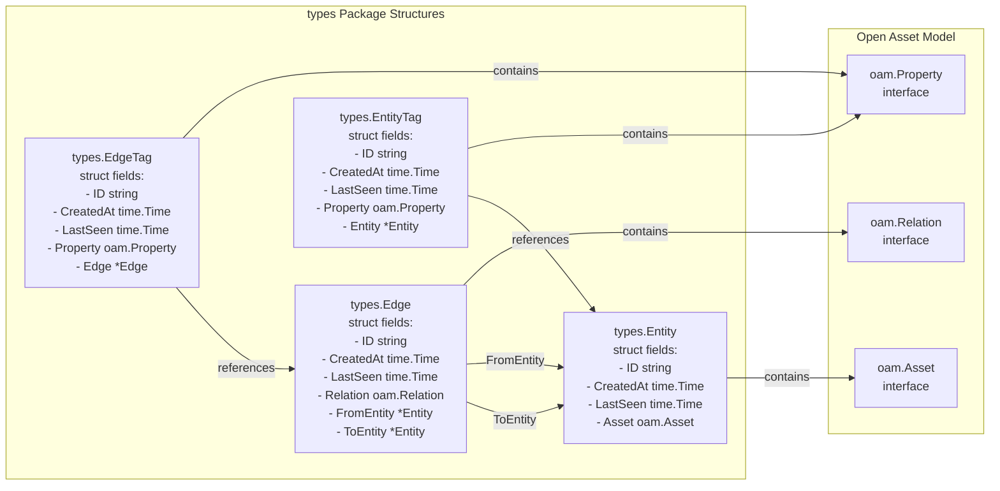

### Type Field Summary

| Type | ID Type | Content Field | Reference Field(s) |
|------|---------|---------------|-------------------|
| `Entity` | `string` | `Asset oam.Asset` | - |
| `Edge` | `string` | `Relation oam.Relation` | `FromEntity`, `ToEntity` |
| `EntityTag` | `string` | `Property oam.Property` | `Entity` |
| `EdgeTag` | `string` | `Property oam.Property` | `Edge` |

All types include temporal metadata: `CreatedAt` (immutable creation time) and `LastSeen` (updated on each observation).

---

## Common API Patterns

### Time-Based Query Pattern

Many find operations accept a `since time.Time` parameter to enable temporal queries:

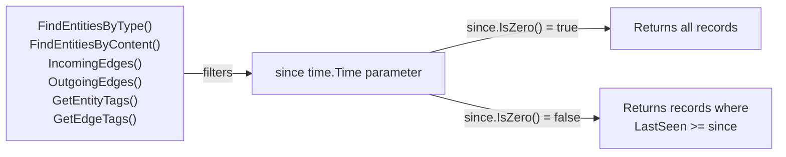

### Dual Creation Methods Pattern

For both entities and tags, the API provides two creation methods:

| Low-Level Method | High-Level Method | Difference |
|------------------|-------------------|------------|
| `CreateEntity(entity *types.Entity)` | `CreateAsset(asset oam.Asset)` | Wraps asset in Entity struct |
| `CreateEntityTag(entity, tag)` | `CreateEntityProperty(entity, property)` | Wraps property in EntityTag struct |
| `CreateEdgeTag(edge, tag)` | `CreateEdgeProperty(edge, property)` | Wraps property in EdgeTag struct |

The high-level methods (`CreateAsset`, `CreateEntityProperty`, `CreateEdgeProperty`) are convenience wrappers that handle the struct initialization internally.

---

## Factory Methods

### Primary Entry Point: `assetdb.New()`

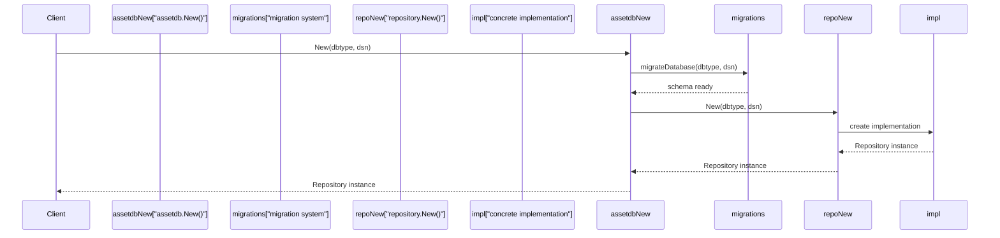

**Supported Database Types:**

| `dbtype` String | Implementation | Package |
|----------------|----------------|---------|
| `"postgres"` | PostgreSQL with GORM | `repository/sqlrepo` |
| `"sqlite"` | SQLite file-based with GORM | `repository/sqlrepo` |
| `"sqlitememory"` | SQLite in-memory with GORM | `repository/sqlrepo` |
| `"neo4j"` | Neo4j graph database | `repository/neo4j` |

---

## Database Schema Mapping

The Repository interface methods map to the following database schema structures:

### SQL Schema (PostgreSQL/SQLite)

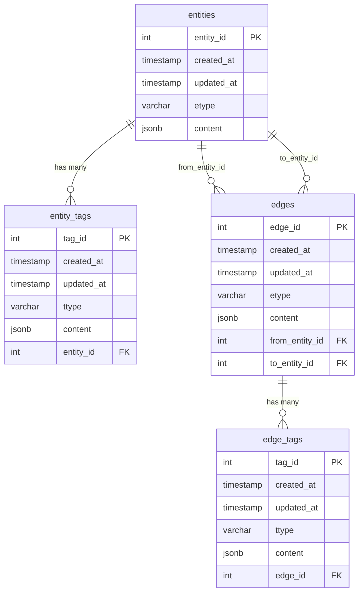

**Key Schema Characteristics:**

- **Primary Keys:** Auto-incrementing integers (`entity_id`, `edge_id`, `tag_id`)
- **Content Storage:** JSONB in PostgreSQL, TEXT in SQLite (serialized JSON)
- **Type Fields:** `etype` and `ttype` store the OAM type identifier
- **Timestamps:** `created_at` (immutable) and `updated_at` (corresponds to `LastSeen`)
- **Foreign Keys:** Cascade delete ensures referential integrity

---

## Error Handling Conventions

All Repository methods that can fail return `error` as their last return value. Common error scenarios include:

| Error Scenario | Affected Methods | Typical Error Message Pattern |
|----------------|------------------|-------------------------------|
| Record not found | `FindEntityById()`, `FindEdgeById()`, `FindEntityTagById()`, `FindEdgeTagById()` | Returns `nil` result with `nil` error, or specific not-found error |
| Invalid reference | `CreateEdge()`, `CreateEntityTag()`, `CreateEdgeTag()` | Foreign key constraint violations |
| Connection failure | All methods | Database connection errors |
| Invalid input | `CreateEntity()`, `CreateAsset()` | Validation errors |

The specific error types and messages vary by implementation (SQL vs Neo4j).

---

## Concurrency and Thread Safety

The `repository.Repository` interface implementations have the following concurrency characteristics:

- **SQL Repositories:** Thread-safe through GORM's connection pooling
- **Neo4j Repository:** Thread-safe through neo4j-go-driver's session management
- **Cache Wrapper:** Requires external synchronization for concurrent access

For production use with concurrent goroutines, clients should implement their own synchronization or use a connection pool at the application level.

---

## Method Naming Conventions

The API follows consistent naming patterns:

| Prefix | Meaning | Returns | Example |
|--------|---------|---------|---------|
| `Create*` | Inserts new record | Single object + error | `CreateEntity()` |
| `Find*ById` | Retrieves by ID | Single object + error | `FindEntityById()` |
| `Find*By*` | Searches by criteria | Slice of objects + error | `FindEntitiesByType()` |
| `Get*` | Retrieves related records | Slice of objects + error | `GetEntityTags()` |
| `*Edges` | Graph traversal | Slice of edges + error | `IncomingEdges()` |
| `Delete*` | Removes record | error only | `DeleteEntity()` |

---

## Summary

The asset-db API provides:

1. **Unified Interface:** `repository.Repository` abstracts SQL and Neo4j databases
2. **Factory Pattern:** `assetdb.New()` and `repository.New()` handle implementation selection
3. **Type Safety:** Strong typing through `types.Entity`, `types.Edge`, and tag structures
4. **Temporal Queries:** Consistent `since time.Time` parameter for filtering by `LastSeen`
5. **OAM Integration:** Direct support for Open Asset Model types through `CreateAsset()` and `CreateEntityProperty()` convenience methods

For detailed method signatures and behaviors, see the child pages listed at the top of this document.

## Repository Interface

## Purpose and Scope

The Repository interface is the central contract for all database operations in asset-db. It defines a unified API for creating, retrieving, and managing entities, edges, and tags across different database backends (PostgreSQL, SQLite, Neo4j). This page documents all methods in the `repository.Repository` interface.

For implementation-specific details, see [SQL Repository](./postgres.md#sql-repository-implementation) and [Neo4j Repository](./triples.md#neo4j-repository). For performance optimization using caching, see [Caching System](./caching.md).

---

## Interface Overview

The `Repository` interface defines 24 methods organized into five functional categories:

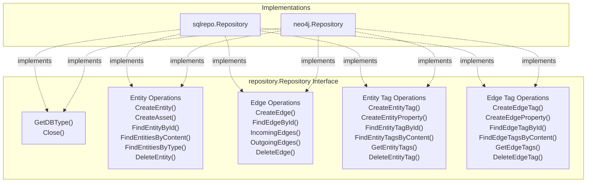

---

## Factory Method

The `repository.New()` function creates Repository instances based on the database type:

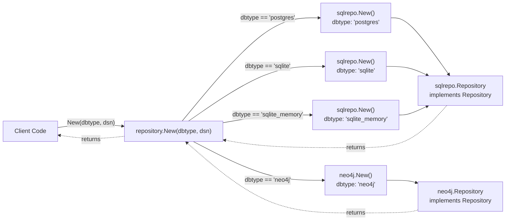

### Method Signature

```go
func New(dbtype, dsn string) (Repository, error)
```

### Parameters

| Parameter | Type | Description |
|-----------|------|-------------|
| `dbtype` | `string` | Database type identifier (case-insensitive) |
| `dsn` | `string` | Database connection string |

### Supported Database Types

| Value | Implementation | Description |
|-------|----------------|-------------|
| `"postgres"` | `sqlrepo` | PostgreSQL database |
| `"sqlite"` | `sqlrepo` | SQLite file-based database |
| `"sqlite_memory"` | `sqlrepo` | SQLite in-memory database |
| `"neo4j"` | `neo4j` | Neo4j graph database |

### Return Values

- **Success**: Returns a `Repository` interface implementation
- **Error**: Returns `nil` and an error "unknown DB type" if `dbtype` is not recognized

---

## Core Methods

### GetDBType

Returns the database type identifier for the repository instance.

```go
GetDBType() string
```

**Returns:** Database type string (e.g., `"postgres"`, `"sqlite"`, `"neo4j"`)

**Use Case:** Identifying which database backend is in use, useful for conditional logic or logging.

---

### Close

Closes the database connection and releases resources.

```go
Close() error
```

**Returns:** Error if connection cannot be closed cleanly

**Use Case:** Called when shutting down the application or releasing repository resources.

---

## Entity Operations

Entity operations manage the core nodes/assets in the graph structure. Entities represent assets as defined by the Open Asset Model.

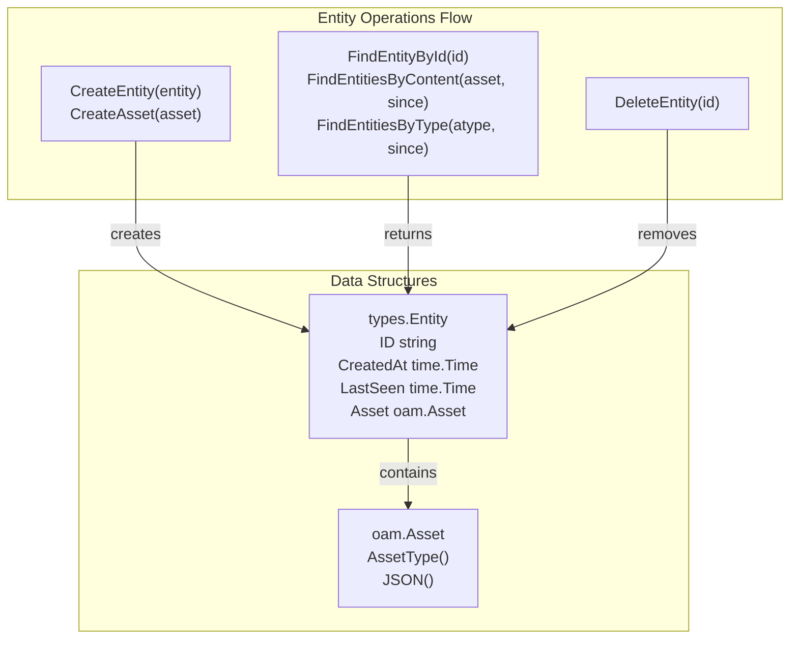

### CreateEntity

Creates a new entity record in the database.

```go
CreateEntity(entity *types.Entity) (*types.Entity, error)
```

**Parameters:**
- `entity`: Entity with `Asset` field populated (other fields may be empty)

**Returns:**
- Created entity with populated `ID`, `CreatedAt`, and `LastSeen` fields
- Error if creation fails

**Behavior:**
- Assigns unique `ID` (UUID)
- Sets `CreatedAt` and `LastSeen` timestamps
- Serializes `Asset` content for storage

---

### CreateAsset

Convenience method that wraps an OAM Asset in a types.Entity and creates it.

```go
CreateAsset(asset oam.Asset) (*types.Entity, error)
```

**Parameters:**
- `asset`: Open Asset Model asset (e.g., `FQDN`, `IPAddress`, `Organization`)

**Returns:**
- Created entity
- Error if creation fails

**Behavior:**
- Internally creates a `types.Entity{Asset: asset}` and calls `CreateEntity()`
- Equivalent to manually wrapping asset in entity structure

---

### FindEntityById

Retrieves an entity by its unique identifier.

```go
FindEntityById(id string) (*types.Entity, error)
```

**Parameters:**
- `id`: Entity UUID string

**Returns:**
- Entity if found
- Error if entity doesn't exist or query fails

**Use Case:** Direct entity lookup when ID is known (e.g., from edge references).

---

### FindEntitiesByContent

Searches for entities matching specific asset content.

```go
FindEntitiesByContent(asset oam.Asset, since time.Time) ([]*types.Entity, error)
```

**Parameters:**
- `asset`: Asset with content to match (type and fields must match)
- `since`: Return only entities last seen on or after this time

**Returns:**
- Slice of matching entities
- Error if query fails

**Behavior:**
- Matches on both asset type and content
- For FQDN: must match name exactly
- For IPAddress: must match address and type (IPv4/IPv6)
- Temporal filtering via `since` parameter

**Use Case:** Finding existing entities before creating duplicates, or querying specific known assets.

---

### FindEntitiesByType

Retrieves all entities of a specific asset type.

```go
FindEntitiesByType(atype oam.AssetType, since time.Time) ([]*types.Entity, error)
```

**Parameters:**
- `atype`: Asset type (e.g., `oam.FQDN`, `oam.IPAddress`, `oam.Organization`)
- `since`: Return only entities last seen on or after this time

**Returns:**
- Slice of entities matching the type
- Error if query fails

**Use Case:** Enumerating all assets of a specific category, bulk operations on asset types.

---

### DeleteEntity

Removes an entity and its associated data from the database.

```go
DeleteEntity(id string) error
```

**Parameters:**
- `id`: Entity UUID to delete

**Returns:**
- Error if deletion fails or entity doesn't exist

**Behavior:**
- Implementation-specific cascade behavior:
  - SQL: May cascade delete tags via foreign keys
  - Neo4j: May require explicit edge/tag deletion first

**Warning:** Behavior may differ between implementations regarding orphaned edges.

---

## Edge Operations

Edge operations manage directed relationships between entities. Edges represent relations as defined by the Open Asset Model.

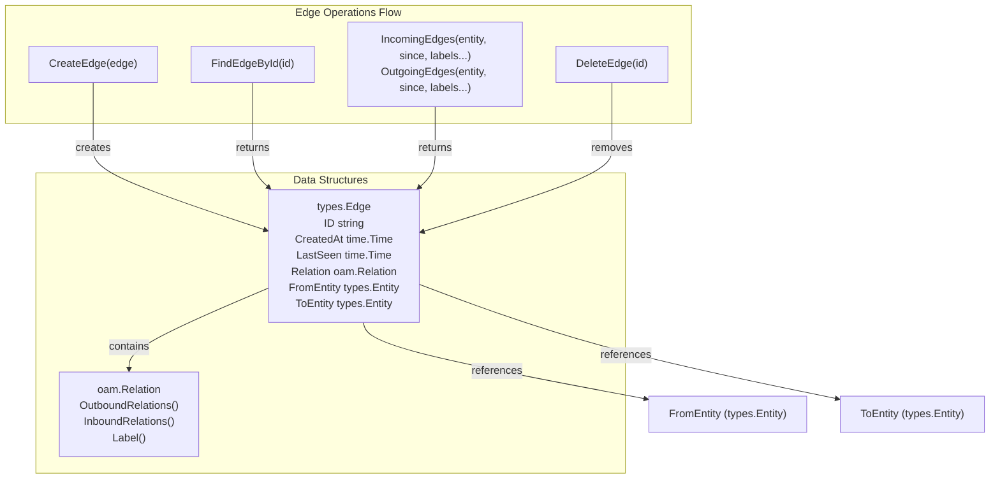

### CreateEdge

Creates a directed relationship between two entities.

```go
CreateEdge(edge *types.Edge) (*types.Edge, error)
```

**Parameters:**
- `edge`: Edge with `Relation`, `FromEntity`, and `ToEntity` populated

**Returns:**
- Created edge with populated `ID`, `CreatedAt`, and `LastSeen` fields
- Error if creation fails or entities don't exist

**Behavior:**
- Validates `FromEntity` and `ToEntity` exist in database
- Assigns unique `ID` (UUID)
- Sets `CreatedAt` and `LastSeen` timestamps
- May prevent duplicate edges (implementation-specific)

---

### FindEdgeById

Retrieves an edge by its unique identifier.

```go
FindEdgeById(id string) (*types.Edge, error)
```

**Parameters:**
- `id`: Edge UUID string

**Returns:**
- Edge with fully populated `FromEntity` and `ToEntity`
- Error if edge doesn't exist or query fails

---

### IncomingEdges

Finds all edges pointing to an entity.

```go
IncomingEdges(entity *types.Entity, since time.Time, labels ...string) ([]*types.Edge, error)
```

**Parameters:**
- `entity`: Target entity (appears as `ToEntity` in returned edges)
- `since`: Return only edges last seen on or after this time
- `labels`: Optional filter for relation labels (empty = all labels)

**Returns:**
- Slice of edges where `edge.ToEntity.ID == entity.ID`
- Error if query fails

**Use Case:** Finding what entities point to this entity (reverse relationships).

**Example Labels:** `"dns_record"`, `"service_on"`, `"netblock_contains"`

---

### OutgoingEdges

Finds all edges originating from an entity.

```go
OutgoingEdges(entity *types.Entity, since time.Time, labels ...string) ([]*types.Edge, error)
```

**Parameters:**
- `entity`: Source entity (appears as `FromEntity` in returned edges)
- `since`: Return only edges last seen on or after this time
- `labels`: Optional filter for relation labels (empty = all labels)

**Returns:**
- Slice of edges where `edge.FromEntity.ID == entity.ID`
- Error if query fails

**Use Case:** Finding what entities this entity points to (forward relationships).

---

### DeleteEdge

Removes an edge from the database.

```go
DeleteEdge(id string) error
```

**Parameters:**
- `id`: Edge UUID to delete

**Returns:**
- Error if deletion fails or edge doesn't exist

**Behavior:**
- Removes relationship but leaves entities intact
- May cascade delete associated tags (implementation-specific)

---

## Entity Tag Operations

Entity tag operations manage metadata (properties) attached to entities. Tags allow flexible key-value style annotations.

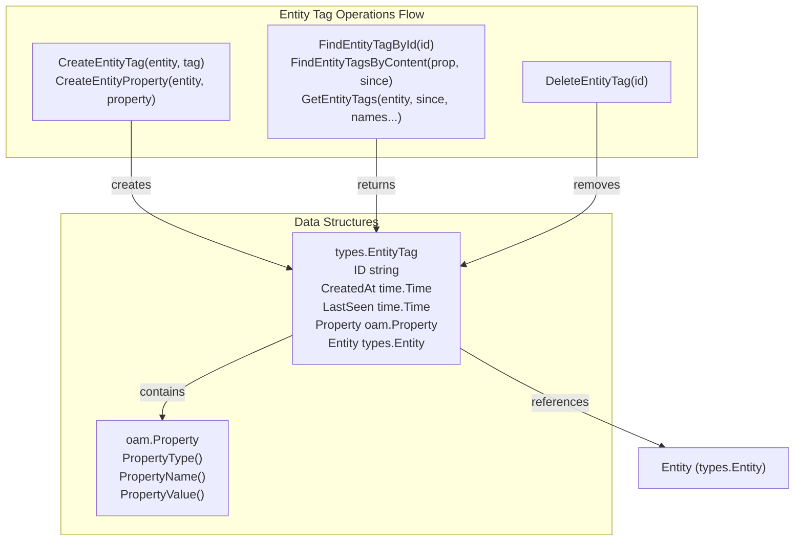

### CreateEntityTag

Attaches a tag to an entity.

```go
CreateEntityTag(entity *types.Entity, tag *types.EntityTag) (*types.EntityTag, error)
```

**Parameters:**
- `entity`: Entity to attach tag to
- `tag`: Tag with `Property` field populated

**Returns:**
- Created tag with populated `ID`, `CreatedAt`, `LastSeen`, and `Entity` reference
- Error if creation fails or entity doesn't exist

**Behavior:**
- Links tag to entity via entity ID
- Assigns unique tag `ID`
- Sets timestamps

---

### CreateEntityProperty

Convenience method that wraps an OAM Property in a types.EntityTag.

```go
CreateEntityProperty(entity *types.Entity, property oam.Property) (*types.EntityTag, error)
```

**Parameters:**
- `entity`: Entity to attach property to
- `property`: Open Asset Model property (e.g., `SimpleProperty`, `DNSRecordProperty`)

**Returns:**
- Created entity tag
- Error if creation fails

**Behavior:**
- Internally creates a `types.EntityTag{Property: property}` and calls `CreateEntityTag()`

---

### FindEntityTagById

Retrieves a tag by its unique identifier.

```go
FindEntityTagById(id string) (*types.EntityTag, error)
```

**Parameters:**
- `id`: EntityTag UUID string

**Returns:**
- Tag with populated `Entity` reference
- Error if tag doesn't exist or query fails

---

### FindEntityTagsByContent

Searches for entity tags matching specific property content.

```go
FindEntityTagsByContent(prop oam.Property, since time.Time) ([]*types.EntityTag, error)
```

**Parameters:**
- `prop`: Property with content to match (type and value must match)
- `since`: Return only tags last seen on or after this time

**Returns:**
- Slice of matching entity tags
- Error if query fails

**Use Case:** Finding all entities with a specific property value (e.g., all entities with source="amass").

---

### GetEntityTags

Retrieves all tags attached to an entity.

```go
GetEntityTags(entity *types.Entity, since time.Time, names ...string) ([]*types.EntityTag, error)
```

**Parameters:**
- `entity`: Entity whose tags to retrieve
- `since`: Return only tags last seen on or after this time
- `names`: Optional filter for property names (empty = all names)

**Returns:**
- Slice of tags attached to the entity
- Error if query fails

**Use Case:** Getting all metadata for an entity, or specific named properties.

**Example Names:** `"source"`, `"confidence"`, `"dns_record"`

---

### DeleteEntityTag

Removes a tag from the database.

```go
DeleteEntityTag(id string) error
```

**Parameters:**
- `id`: EntityTag UUID to delete

**Returns:**
- Error if deletion fails or tag doesn't exist

**Behavior:**
- Removes tag but leaves entity intact

---

## Edge Tag Operations

Edge tag operations manage metadata (properties) attached to edges. Similar to entity tags but for relationships.


### CreateEdgeTag

Attaches a tag to an edge.

```go
CreateEdgeTag(edge *types.Edge, tag *types.EdgeTag) (*types.EdgeTag, error)
```

**Parameters:**
- `edge`: Edge to attach tag to
- `tag`: Tag with `Property` field populated

**Returns:**
- Created tag with populated `ID`, `CreatedAt`, `LastSeen`, and `Edge` reference
- Error if creation fails or edge doesn't exist

---

### CreateEdgeProperty

Convenience method that wraps an OAM Property in a types.EdgeTag.

```go
CreateEdgeProperty(edge *types.Edge, property oam.Property) (*types.EdgeTag, error)
```

**Parameters:**
- `edge`: Edge to attach property to
- `property`: Open Asset Model property

**Returns:**
- Created edge tag
- Error if creation fails

---

### FindEdgeTagById

Retrieves a tag by its unique identifier.

```go
FindEdgeTagById(id string) (*types.EdgeTag, error)
```

**Parameters:**
- `id`: EdgeTag UUID string

**Returns:**
- Tag with populated `Edge` reference
- Error if tag doesn't exist or query fails

---

### FindEdgeTagsByContent

Searches for edge tags matching specific property content.

```go
FindEdgeTagsByContent(prop oam.Property, since time.Time) ([]*types.EdgeTag, error)
```

**Parameters:**
- `prop`: Property with content to match
- `since`: Return only tags last seen on or after this time

**Returns:**
- Slice of matching edge tags
- Error if query fails

---

### GetEdgeTags

Retrieves all tags attached to an edge.

```go
GetEdgeTags(edge *types.Edge, since time.Time, names ...string) ([]*types.EdgeTag, error)
```

**Parameters:**
- `edge`: Edge whose tags to retrieve
- `since`: Return only tags last seen on or after this time
- `names`: Optional filter for property names (empty = all names)

**Returns:**
- Slice of tags attached to the edge
- Error if query fails

---

### DeleteEdgeTag

Removes a tag from the database.

```go
DeleteEdgeTag(id string) error
```

**Parameters:**
- `id`: EdgeTag UUID to delete

**Returns:**
- Error if deletion fails or tag doesn't exist

---

## Method Summary Table

### Entity Operations

| Method | Returns | Primary Use Case |
|--------|---------|------------------|
| `CreateEntity(entity)` | `*types.Entity, error` | Create new entity node |
| `CreateAsset(asset)` | `*types.Entity, error` | Create entity from OAM asset |
| `FindEntityById(id)` | `*types.Entity, error` | Direct lookup by UUID |
| `FindEntitiesByContent(asset, since)` | `[]*types.Entity, error` | Search by asset content |
| `FindEntitiesByType(atype, since)` | `[]*types.Entity, error` | Query by asset type |
| `DeleteEntity(id)` | `error` | Remove entity |

### Edge Operations

| Method | Returns | Primary Use Case |
|--------|---------|------------------|
| `CreateEdge(edge)` | `*types.Edge, error` | Create relationship |
| `FindEdgeById(id)` | `*types.Edge, error` | Direct lookup by UUID |
| `IncomingEdges(entity, since, labels...)` | `[]*types.Edge, error` | Find edges pointing to entity |
| `OutgoingEdges(entity, since, labels...)` | `[]*types.Edge, error` | Find edges from entity |
| `DeleteEdge(id)` | `error` | Remove relationship |

### Entity Tag Operations

| Method | Returns | Primary Use Case |
|--------|---------|------------------|
| `CreateEntityTag(entity, tag)` | `*types.EntityTag, error` | Attach tag to entity |
| `CreateEntityProperty(entity, property)` | `*types.EntityTag, error` | Attach OAM property to entity |
| `FindEntityTagById(id)` | `*types.EntityTag, error` | Direct lookup by UUID |
| `FindEntityTagsByContent(prop, since)` | `[]*types.EntityTag, error` | Search by property content |
| `GetEntityTags(entity, since, names...)` | `[]*types.EntityTag, error` | Get entity's tags |
| `DeleteEntityTag(id)` | `error` | Remove tag |

### Edge Tag Operations

| Method | Returns | Primary Use Case |
|--------|---------|------------------|
| `CreateEdgeTag(edge, tag)` | `*types.EdgeTag, error` | Attach tag to edge |
| `CreateEdgeProperty(edge, property)` | `*types.EdgeTag, error` | Attach OAM property to edge |
| `FindEdgeTagById(id)` | `*types.EdgeTag, error` | Direct lookup by UUID |
| `FindEdgeTagsByContent(prop, since)` | `[]*types.EdgeTag, error` | Search by property content |
| `GetEdgeTags(edge, since, names...)` | `[]*types.EdgeTag, error` | Get edge's tags |
| `DeleteEdgeTag(id)` | `error` | Remove tag |

---

## Temporal Querying

Many methods accept a `since time.Time` parameter for temporal filtering:

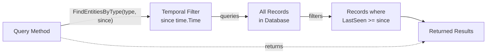

**Behavior:**
- `since = time.Time{}` (zero value): Returns all records regardless of timestamp
- `since = time.Now()`: Returns only recently updated records
- Compares against `LastSeen` field in database records

**Affected Methods:**
- `FindEntitiesByContent()`
- `FindEntitiesByType()`
- `IncomingEdges()`
- `OutgoingEdges()`
- `GetEntityTags()`
- `GetEdgeTags()`
- `FindEntityTagsByContent()`
- `FindEdgeTagsByContent()`

## Cache Interface

This page documents the Cache interface implementation and its methods. The Cache provides a performance optimization layer that wraps any `repository.Repository` implementation with an in-memory cache and frequency-based write throttling.

For overall cache architecture and design patterns, see [Cache Architecture](./caching.md#cache-architecture). For cache-specific behavior with entities and edges, see [Entity Caching](#6.2) and [Edge Caching](#6.3). This page focuses on the API reference for the `Cache` type and its methods.

---

## Cache Type and Initialization

### Cache Structure

The `Cache` type wraps two repository instances: an in-memory cache repository and a persistent database repository.

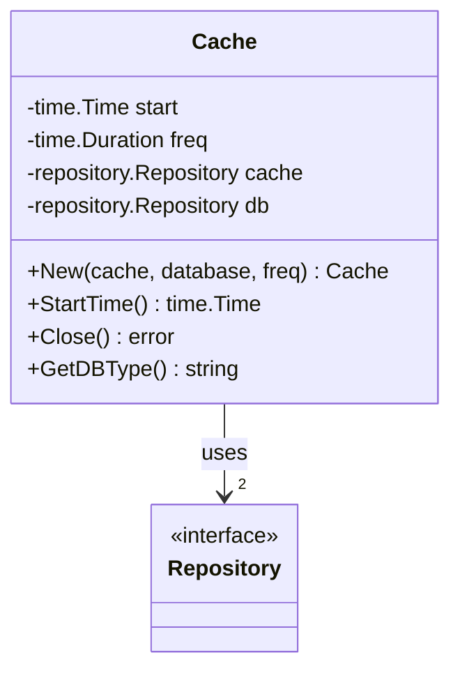

| Field | Type | Description |
|-------|------|-------------|
| `start` | `time.Time` | Timestamp when the cache was created, used as a baseline for temporal queries |
| `freq` | `time.Duration` | Frequency threshold for write throttling to the persistent database |
| `cache` | `repository.Repository` | In-memory repository for fast data access |
| `db` | `repository.Repository` | Persistent repository for durable storage |

---

### New Function

```go
func New(cache, database repository.Repository, freq time.Duration) (*Cache, error)
```

Creates a new `Cache` instance that wraps two repositories with frequency-based throttling.

**Parameters:**
- `cache`: In-memory repository implementation (typically SQLite in-memory)
- `database`: Persistent repository implementation (PostgreSQL, SQLite file, or Neo4j)
- `freq`: Duration threshold for throttling writes to the persistent database

**Returns:** `*Cache` instance and error

---

### Utility Methods

#### StartTime

```go
func (c *Cache) StartTime() time.Time
```

Returns the timestamp when the cache was created. This baseline time is used internally to determine whether `since` parameters in queries should trigger database queries.

#### Close

```go
func (c *Cache) Close() error
```

Closes the cache repository. Note that this only closes the cache repository; the persistent database repository must be closed separately.

#### GetDBType

```go
func (c *Cache) GetDBType() string
```

Returns the database type of the underlying persistent repository (e.g., "postgres", "sqlite", "neo4j").

---

## Entity Operations

### CreateEntity

```go
func (c *Cache) CreateEntity(input *types.Entity) (*types.Entity, error)
```

Creates an entity in both the cache and (conditionally) the persistent database.

**Behavior Flow:**

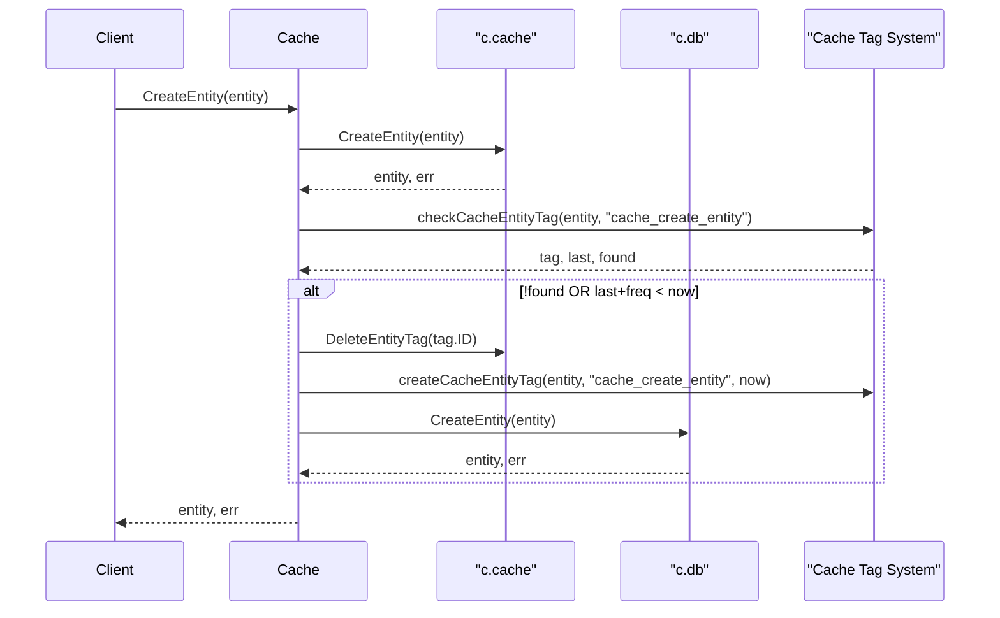

**Write Throttling:** The entity is always written to the cache immediately. However, it is only written to the persistent database if:
1. No `cache_create_entity` tag exists for this entity, OR
2. The existing tag's timestamp plus `c.freq` is before the current time

---

### CreateAsset

```go
func (c *Cache) CreateAsset(asset oam.Asset) (*types.Entity, error)
```

Creates an entity from an OAM Asset with the same caching and throttling behavior as `CreateEntity`.

**Write Throttling:** Uses the `cache_create_asset` tag for frequency-based throttling.

---

### FindEntityById

```go
func (c *Cache) FindEntityById(id string) (*types.Entity, error)
```

Retrieves an entity by its ID from the cache repository only. Does not query the persistent database.

---

### FindEntitiesByContent

```go
func (c *Cache) FindEntitiesByContent(asset oam.Asset, since time.Time) ([]*types.Entity, error)
```

Finds entities matching the given asset content, implementing a cache-aside pattern.

**Cache-Aside Pattern:**

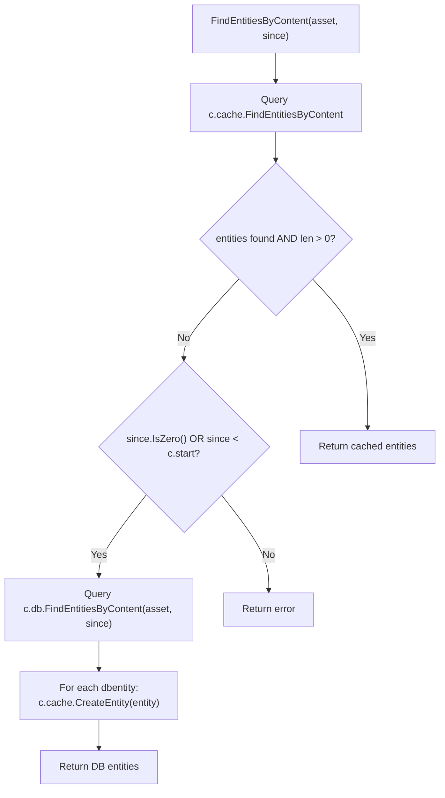

**Temporal Logic:** Only queries the database if `since` is zero or before `c.start`.

---

### FindEntitiesByType

```go
func (c *Cache) FindEntitiesByType(atype oam.AssetType, since time.Time) ([]*types.Entity, error)
```

Finds entities of a specific asset type, with tag-based cache freshness checking.

**Cache Freshness Logic:**
1. Query cache for entities
2. If entities found and `since` is recent (≥ `c.start`), return cached results
3. Check for `cache_find_entities_by_type` tag on first entity
4. If tag missing or `since` is before the tag's timestamp, query database
5. Populate cache with database results and update tags

---

### DeleteEntity

```go
func (c *Cache) DeleteEntity(id string) error
```

Deletes an entity from both the cache and the persistent database.

**Deletion Flow:**
1. Find entity in cache by ID
2. Delete from cache
3. Find matching entities in database by content
4. Delete all matching entities from database

---

## Edge Operations

### CreateEdge

```go
func (c *Cache) CreateEdge(edge *types.Edge) (*types.Edge, error)
```

Creates an edge in the cache and conditionally in the persistent database with frequency-based throttling.

**Edge Creation Flow:**

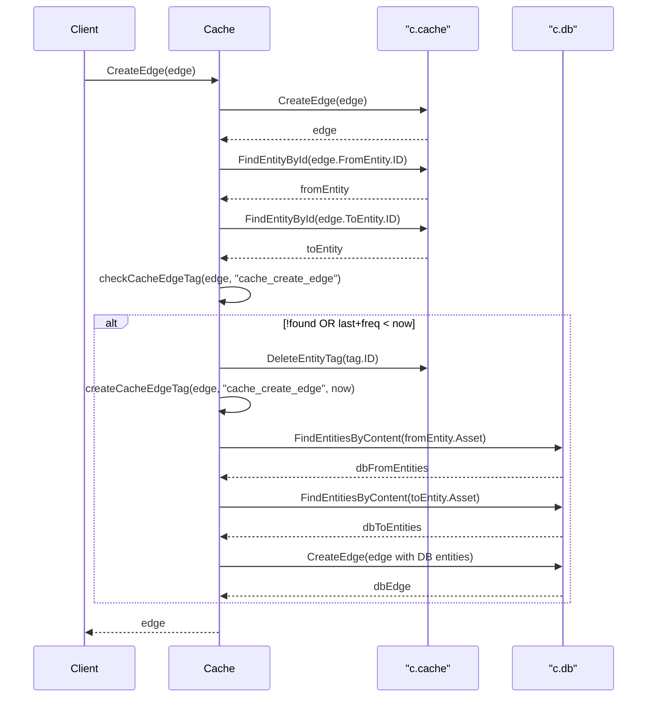

**Write Throttling:** Uses the `cache_create_edge` tag on the edge to determine if the persistent database should be updated.

---

### FindEdgeById

```go
func (c *Cache) FindEdgeById(id string) (*types.Edge, error)
```

Retrieves an edge by its ID from the cache repository only.

---

### IncomingEdges

```go
func (c *Cache) IncomingEdges(entity *types.Entity, since time.Time, labels ...string) ([]*types.Edge, error)
```

Retrieves edges pointing to the given entity, with tag-based cache freshness checking.

**Cache Tag:** `cache_incoming_edges`

**Query Decision Logic:**

| Condition | Action |
|-----------|--------|
| `since.IsZero()` OR `since < c.start` | Check cache tag for freshness |
| Tag not found OR `since < tag.timestamp` | Query database and populate cache |
| Otherwise | Return cached results |

**Database Query and Cache Population:**
1. Find matching entity in database by content
2. Query `c.db.IncomingEdges(dbEntity, since)`
3. For each database edge, resolve `ToEntity` by ID
4. Create entities and edges in cache

---

### OutgoingEdges

```go
func (c *Cache) OutgoingEdges(entity *types.Entity, since time.Time, labels ...string) ([]*types.Edge, error)
```

Retrieves edges originating from the given entity, with identical caching behavior to `IncomingEdges`.

**Cache Tag:** `cache_outgoing_edges`

---

### DeleteEdge

```go
func (c *Cache) DeleteEdge(id string) error
```

Deletes an edge from both the cache and the persistent database.

**Deletion Flow:**
1. Find edge in cache by ID
2. Find `FromEntity` and `ToEntity` in cache
3. Delete edge from cache
4. Find matching entities in database by content
5. Query outgoing edges from database `FromEntity` with matching label
6. Find edge with matching `ToEntity` and relation content
7. Delete matching edge from database

---

## Tag Management (Internal)

### Cache Tag System

The cache uses special entity and edge tags to track synchronization state and implement frequency-based throttling.

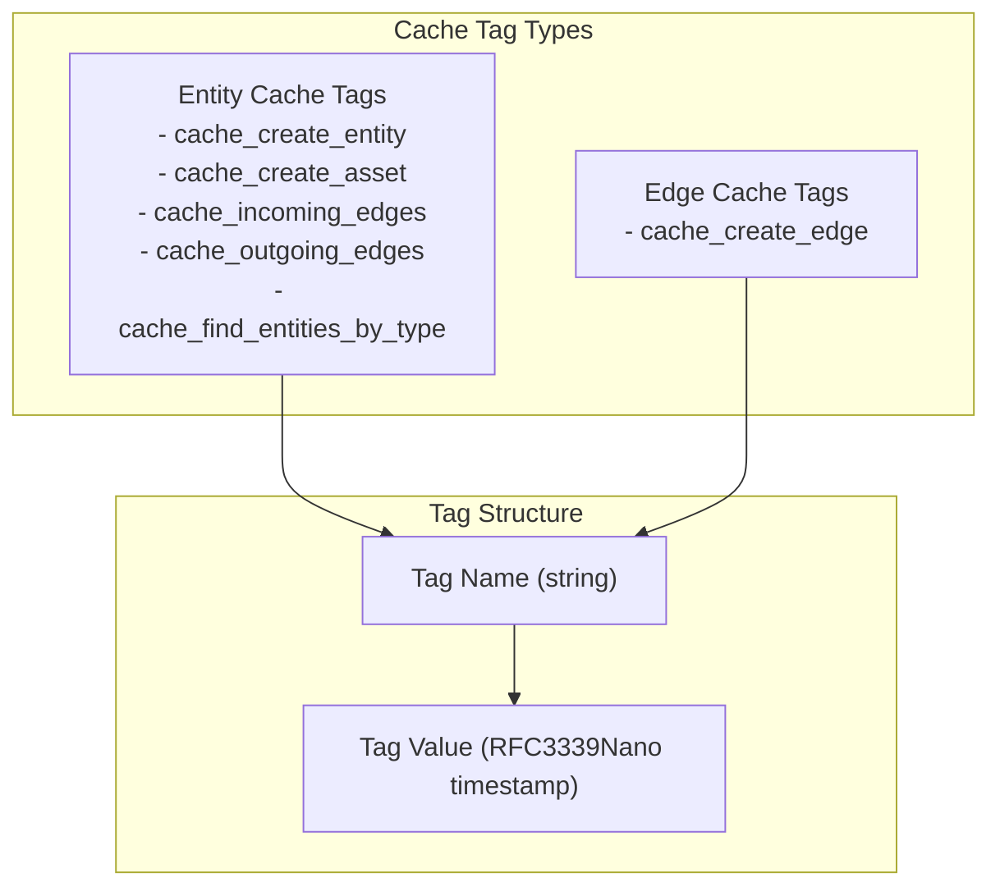

---

### createCacheEntityTag

```go
func (c *Cache) createCacheEntityTag(entity *types.Entity, name string, since time.Time) error
```

Internal helper that creates a cache management tag on an entity with a timestamp value.

**Tag Format:**
- Property Name: `name` (e.g., "cache_create_entity")
- Property Value: `since.Format(time.RFC3339Nano)` (timestamp as string)
- Property Type: `general.SimpleProperty`

---

### checkCacheEntityTag

```go
func (c *Cache) checkCacheEntityTag(entity *types.Entity, name string) (*types.EntityTag, time.Time, bool)
```

Internal helper that retrieves and parses a cache management tag from an entity.

**Returns:**
- `*types.EntityTag`: The tag object (if found)
- `time.Time`: Parsed timestamp from the tag value
- `bool`: `true` if tag exists and timestamp parsed successfully

---

### createCacheEdgeTag

```go
func (c *Cache) createCacheEdgeTag(edge *types.Edge, name string, since time.Time) error
```

Internal helper that creates a cache management tag on an edge with a timestamp value. Identical behavior to `createCacheEntityTag` but operates on edges.

---

### checkCacheEdgeTag

```go
func (c *Cache) checkCacheEdgeTag(edge *types.Edge, name string) (*types.EdgeTag, time.Time, bool)
```

Internal helper that retrieves and parses a cache management tag from an edge. Identical behavior to `checkCacheEntityTag` but operates on edges.

---

## Configuration Parameters

### Frequency Duration (freq)

The `freq` parameter controls write throttling to the persistent database.

| Operation | Cache Tag Used | Throttling Behavior |
|-----------|----------------|---------------------|
| `CreateEntity` | `cache_create_entity` | Only write to DB if tag doesn't exist OR `tag.timestamp + freq < now` |
| `CreateAsset` | `cache_create_asset` | Only write to DB if tag doesn't exist OR `tag.timestamp + freq < now` |
| `CreateEdge` | `cache_create_edge` | Only write to DB if tag doesn't exist OR `tag.timestamp + freq < now` |

**Example:** If `freq = 5 * time.Minute`, repeated calls to `CreateEntity` for the same entity will only update the persistent database every 5 minutes, while the cache is updated immediately.

---

### Start Time Baseline

The `start` field establishes a temporal baseline for cache queries.

**Usage in Temporal Queries:**

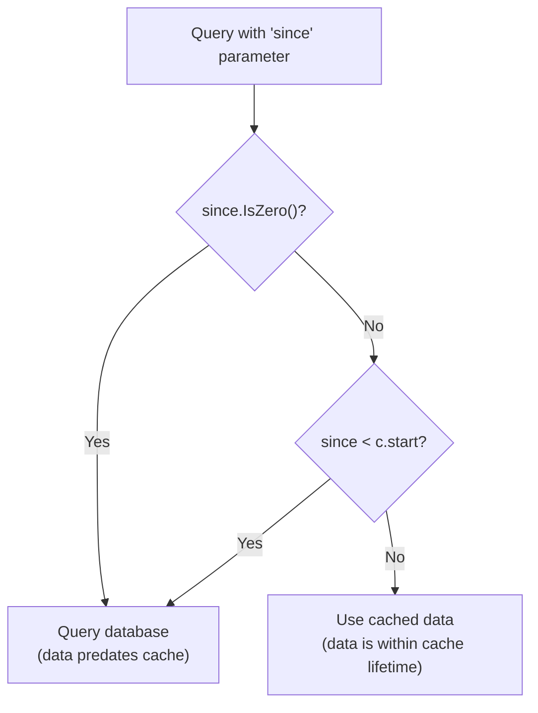

**Rationale:** If `since` is before the cache was created (`c.start`), the cache cannot contain the requested historical data, so the database must be queried.

## Core Data Types

## Purpose and Scope

This page provides reference documentation for the four core data types defined in the `types` package: `Entity`, `Edge`, `EntityTag`, and `EdgeTag`. These types form the foundation of the asset-db data model and are used consistently across all repository implementations.

For information about how these types are used in the Repository interface operations, see [Repository Interface](./api-reference.md#repository-interface). For details on Open Asset Model integration and asset/property/relation definitions, see [Open Asset Model Integration](./index.md#open-asset-model-integration).

---

## Type Overview

The asset-db system uses four primary data types that implement a property graph model:

| Type | Purpose | Contains | References |
|------|---------|----------|------------|
| `Entity` | Represents a node/asset in the graph | `oam.Asset` | None |
| `Edge` | Represents a directed relationship between entities | `oam.Relation` | `FromEntity`, `ToEntity` |
| `EntityTag` | Metadata property attached to an entity | `oam.Property` | `Entity` |
| `EdgeTag` | Metadata property attached to an edge | `oam.Property` | `Edge` |

All types include temporal fields (`CreatedAt`, `LastSeen`) for tracking data lifecycle and an `ID` field for unique identification.

---

## Entity Type

### Type Definition

The `Entity` type represents an asset node in the graph database.

```go
type Entity struct {
    ID        string
    CreatedAt time.Time
    LastSeen  time.Time
    Asset     oam.Asset
}
```

### Field Descriptions

| Field | Type | Description |
|-------|------|-------------|
| `ID` | `string` | Unique identifier for the entity |
| `CreatedAt` | `time.Time` | Timestamp when the entity was first created |
| `LastSeen` | `time.Time` | Timestamp when the entity was last observed or updated |
| `Asset` | `oam.Asset` | The actual asset data conforming to the Open Asset Model |

### Usage Context

Entities represent discoverable assets such as:
- Fully Qualified Domain Names (FQDNs)
- IP Addresses
- Organizations
- Network Blocks
- Autonomous Systems

The `Asset` field contains the structured data that defines the asset type and its properties, as specified by the Open Asset Model.

---

## EntityTag Type

### Type Definition

The `EntityTag` type represents additional metadata properties attached to an entity.

```go
type EntityTag struct {
    ID        string
    CreatedAt time.Time
    LastSeen  time.Time
    Property  oam.Property
    Entity    *Entity
}
```

### Field Descriptions

| Field | Type | Description |
|-------|------|-------------|
| `ID` | `string` | Unique identifier for the tag |
| `CreatedAt` | `time.Time` | Timestamp when the tag was first created |
| `LastSeen` | `time.Time` | Timestamp when the tag was last observed or updated |
| `Property` | `oam.Property` | The property data conforming to the Open Asset Model |
| `Entity` | `*Entity` | Pointer to the entity this tag is attached to |

### Usage Context

Entity tags provide extensible metadata capabilities, allowing multiple properties to be associated with a single entity without modifying the entity's core structure. Examples include:
- DNS records associated with an FQDN
- Port information for an IP address
- Geolocation data
- Historical snapshots of property values

The many-to-one relationship between tags and entities enables flexible property storage.

---

## Edge Type

### Type Definition

The `Edge` type represents a directed relationship between two entities.

```go
type Edge struct {
    ID         string
    CreatedAt  time.Time
    LastSeen   time.Time
    Relation   oam.Relation
    FromEntity *Entity
    ToEntity   *Entity
}
```

### Field Descriptions

| Field | Type | Description |
|-------|------|-------------|
| `ID` | `string` | Unique identifier for the edge |
| `CreatedAt` | `time.Time` | Timestamp when the edge was first created |
| `LastSeen` | `time.Time` | Timestamp when the edge was last observed or updated |
| `Relation` | `oam.Relation` | The relationship type conforming to the Open Asset Model |
| `FromEntity` | `*Entity` | Pointer to the source entity |
| `ToEntity` | `*Entity` | Pointer to the target entity |

### Usage Context

Edges create directed relationships in the asset graph. The direction is semantically meaningful:
- DNS relationships: FQDN → IP Address
- Organizational ownership: Organization → Asset
- Network containment: Network Block → IP Address

The `Relation` field defines the relationship type and semantics according to the Open Asset Model.

---

## EdgeTag Type

### Type Definition

The `EdgeTag` type represents additional metadata properties attached to an edge.

```go
type EdgeTag struct {
    ID        string
    CreatedAt time.Time
    LastSeen  time.Time
    Property  oam.Property
    Edge      *Edge
}
```

### Field Descriptions

| Field | Type | Description |
|-------|------|-------------|
| `ID` | `string` | Unique identifier for the tag |
| `CreatedAt` | `time.Time` | Timestamp when the tag was first created |
| `LastSeen` | `time.Time` | Timestamp when the tag was last observed or updated |
| `Property` | `oam.Property` | The property data conforming to the Open Asset Model |
| `Edge` | `*Edge` | Pointer to the edge this tag is attached to |

### Usage Context

Edge tags provide metadata for relationships, enabling enriched relationship information without modifying the core edge structure. Examples include:
- Confidence scores for discovered relationships
- Source attribution (which tool discovered the relationship)
- Relationship validity periods
- Protocol-specific information for network relationships

---

## Type Relationships

The following diagram illustrates the relationships between the core data types:

### Diagram: Core Type Relationships

```mermaid
graph TB
    subgraph "Primary Graph Elements"
        Entity1["Entity<br/>ID: string<br/>CreatedAt: time.Time<br/>LastSeen: time.Time<br/>Asset: oam.Asset"]
        Entity2["Entity<br/>ID: string<br/>CreatedAt: time.Time<br/>LastSeen: time.Time<br/>Asset: oam.Asset"]
        Edge["Edge<br/>ID: string<br/>CreatedAt: time.Time<br/>LastSeen: time.Time<br/>Relation: oam.Relation<br/>FromEntity: *Entity<br/>ToEntity: *Entity"]
    end
    
    subgraph "Metadata Tags"
        EntityTag1["EntityTag<br/>ID: string<br/>CreatedAt: time.Time<br/>LastSeen: time.Time<br/>Property: oam.Property<br/>Entity: *Entity"]
        EntityTag2["EntityTag<br/>ID: string<br/>CreatedAt: time.Time<br/>LastSeen: time.Time<br/>Property: oam.Property<br/>Entity: *Entity"]
        EdgeTag["EdgeTag<br/>ID: string<br/>CreatedAt: time.Time<br/>LastSeen: time.Time<br/>Property: oam.Property<br/>Edge: *Edge"]
    end
    
    subgraph "Open Asset Model"
        OAMAsset["oam.Asset<br/>FQDN, IPAddress,<br/>Organization, etc."]
        OAMProperty["oam.Property<br/>SimpleProperty,<br/>DNSRecordProperty, etc."]
        OAMRelation["oam.Relation<br/>BasicDNSRelation,<br/>SimpleRelation, etc."]
    end
    
    Edge -->|"FromEntity *Entity"| Entity1
    Edge -->|"ToEntity *Entity"| Entity2
    
    EntityTag1 -->|"Entity *Entity"| Entity1
    EntityTag2 -->|"Entity *Entity"| Entity2
    EdgeTag -->|"Edge *Edge"| Edge
    
    Entity1 -.->|"contains"| OAMAsset
    Entity2 -.->|"contains"| OAMAsset
    Edge -.->|"contains"| OAMRelation
    EntityTag1 -.->|"contains"| OAMProperty
    EntityTag2 -.->|"contains"| OAMProperty
    EdgeTag -.->|"contains"| OAMProperty
```

**Relationship Summary:**
- **Edge** maintains directed references to two **Entity** instances via `FromEntity` and `ToEntity` pointers
- **EntityTag** references a single **Entity** via pointer, establishing a many-to-one relationship
- **EdgeTag** references a single **Edge** via pointer, establishing a many-to-one relationship
- All types embed Open Asset Model interfaces: **Entity** contains `oam.Asset`, **Edge** contains `oam.Relation`, and both tag types contain `oam.Property`

---

## Database Schema Mapping

The core types map to database tables in both SQL (PostgreSQL/SQLite) and Neo4j implementations. The following diagram shows the SQL schema structure:

### Diagram: SQL Schema Mapping

```mermaid
erDiagram
    entities ||--o{ entity_tags : "has many"
    entities ||--o{ edges : "from_entity_id"
    entities ||--o{ edges : "to_entity_id"
    edges ||--o{ edge_tags : "has many"
    
    entities {
        int entity_id PK
        timestamp created_at
        timestamp updated_at
        varchar etype
        jsonb_or_text content
    }
    
    entity_tags {
        int tag_id PK
        timestamp created_at
        timestamp updated_at
        varchar ttype
        jsonb_or_text content
        int entity_id FK
    }
    
    edges {
        int edge_id PK
        timestamp created_at
        timestamp updated_at
        varchar etype
        jsonb_or_text content
        int from_entity_id FK
        int to_entity_id FK
    }
    
    edge_tags {
        int tag_id PK
        timestamp created_at
        timestamp updated_at
        varchar ttype
        jsonb_or_text content
        int edge_id FK
    }
```

### SQL Table Details

#### entities Table

Maps to the `Entity` type:

| Column | Type | Go Field | Description |
|--------|------|----------|-------------|
| `entity_id` | INT/INTEGER | `ID` | Primary key, auto-generated |
| `created_at` | TIMESTAMP | `CreatedAt` | Creation timestamp |
| `updated_at` | TIMESTAMP | `LastSeen` | Last update timestamp |
| `etype` | VARCHAR(255)/TEXT | `Asset.AssetType()` | Asset type extracted from OAM |
| `content` | JSONB/TEXT | `Asset` | Serialized asset data |

**Indexes:**
- `idx_entities_updated_at` on `updated_at`
- `idx_entities_etype` on `etype`

#### entity_tags Table

Maps to the `EntityTag` type:

| Column | Type | Go Field | Description |
|--------|------|----------|-------------|
| `tag_id` | INT/INTEGER | `ID` | Primary key, auto-generated |
| `created_at` | TIMESTAMP | `CreatedAt` | Creation timestamp |
| `updated_at` | TIMESTAMP | `LastSeen` | Last update timestamp |
| `ttype` | VARCHAR(255)/TEXT | `Property.PropertyType()` | Property type extracted from OAM |
| `content` | JSONB/TEXT | `Property` | Serialized property data |
| `entity_id` | INT/INTEGER | `Entity.ID` | Foreign key to entities table |

**Indexes:**
- `idx_enttag_updated_at` on `updated_at`
- `idx_enttag_entity_id` on `entity_id`

**Foreign Key:** `entity_id` references `entities(entity_id)` with `ON DELETE CASCADE`

#### edges Table

Maps to the `Edge` type:

| Column | Type | Go Field | Description |
|--------|------|----------|-------------|
| `edge_id` | INT/INTEGER | `ID` | Primary key, auto-generated |
| `created_at` | TIMESTAMP | `CreatedAt` | Creation timestamp |
| `updated_at` | TIMESTAMP | `LastSeen` | Last update timestamp |
| `etype` | VARCHAR(255)/TEXT | `Relation.RelationType()` | Relation type extracted from OAM |
| `content` | JSONB/TEXT | `Relation` | Serialized relation data |
| `from_entity_id` | INT/INTEGER | `FromEntity.ID` | Foreign key to source entity |
| `to_entity_id` | INT/INTEGER | `ToEntity.ID` | Foreign key to target entity |

**Indexes:**
- `idx_edge_updated_at` on `updated_at`
- `idx_edge_from_entity_id` on `from_entity_id`
- `idx_edge_to_entity_id` on `to_entity_id`

**Foreign Keys:**
- `from_entity_id` references `entities(entity_id)` with `ON DELETE CASCADE`
- `to_entity_id` references `entities(entity_id)` with `ON DELETE CASCADE`

#### edge_tags Table

Maps to the `EdgeTag` type:

| Column | Type | Go Field | Description |
|--------|------|----------|-------------|
| `tag_id` | INT/INTEGER | `ID` | Primary key, auto-generated |
| `created_at` | TIMESTAMP | `CreatedAt` | Creation timestamp |
| `updated_at` | TIMESTAMP | `LastSeen` | Last update timestamp |
| `ttype` | VARCHAR(255)/TEXT | `Property.PropertyType()` | Property type extracted from OAM |
| `content` | JSONB/TEXT | `Property` | Serialized property data |
| `edge_id` | INT/INTEGER | `Edge.ID` | Foreign key to edges table |

**Indexes:**
- `idx_edgetag_updated_at` on `updated_at`
- `idx_edgetag_edge_id` on `edge_id`

**Foreign Key:** `edge_id` references `edges(edge_id)` with `ON DELETE CASCADE`

---

## Temporal Field Semantics

All four core types include two temporal fields that track data lifecycle:

### CreatedAt Field

- **Type:** `time.Time`
- **Semantic Meaning:** Records when the record was first inserted into the database
- **Mutability:** Set once on creation, never updated
- **Database Default:** `CURRENT_TIMESTAMP` at insertion time
- **Usage:** Useful for historical analysis and data auditing

### LastSeen Field

- **Type:** `time.Time`
- **Semantic Meaning:** Records when the record was last observed or confirmed
- **Mutability:** Updated whenever the record is re-discovered or reconfirmed
- **Database Column:** Maps to `updated_at` column in SQL schemas
- **Usage:** Critical for temporal queries, stale data detection, and incremental updates

### Temporal Query Patterns

The `since` parameter in repository query methods leverages the `LastSeen`/`updated_at` field:

```go
// Example: Find entities updated after a specific time
entities, err := repo.FindEntitiesByType("fqdn", since)
```

This pattern enables:
- **Incremental Processing:** Only fetch records modified since last processing
- **Change Detection:** Identify new or updated assets
- **Stale Data Filtering:** Exclude outdated records from queries
- **Temporal Windowing:** Query data within specific time ranges

---

## Open Asset Model Integration

The core types leverage the Open Asset Model (OAM) for standardized asset definitions:

### Diagram: OAM Integration in Core Types

```mermaid
graph LR
    subgraph "types Package"
        EntityStruct["Entity struct"]
        EdgeStruct["Edge struct"]
        EntityTagStruct["EntityTag struct"]
        EdgeTagStruct["EdgeTag struct"]
    end
    
    subgraph "oam Interfaces"
        AssetInterface["oam.Asset interface<br/>AssetType() string"]
        RelationInterface["oam.Relation interface<br/>RelationType() string"]
        PropertyInterface["oam.Property interface<br/>PropertyType() string"]
    end
    
    subgraph "oam Implementations"
        FQDNAsset["FQDN"]
        IPAddressAsset["IPAddress"]
        OrganizationAsset["Organization"]
        BasicDNSRelation["BasicDNSRelation"]
        SimpleRelation["SimpleRelation"]
        SimpleProperty["SimpleProperty"]
        DNSRecordProperty["DNSRecordProperty"]
    end
    
    EntityStruct -->|"Asset field"| AssetInterface
    EdgeStruct -->|"Relation field"| RelationInterface
    EntityTagStruct -->|"Property field"| PropertyInterface
    EdgeTagStruct -->|"Property field"| PropertyInterface
    
    AssetInterface -.->|"implemented by"| FQDNAsset
    AssetInterface -.->|"implemented by"| IPAddressAsset
    AssetInterface -.->|"implemented by"| OrganizationAsset
    RelationInterface -.->|"implemented by"| BasicDNSRelation
    RelationInterface -.->|"implemented by"| SimpleRelation
    PropertyInterface -.->|"implemented by"| SimpleProperty
    PropertyInterface -.->|"implemented by"| DNSRecordProperty
```

### Type Extraction Methods

Each OAM interface provides a type identification method:

| OAM Interface | Method | Return Value Example |
|---------------|--------|----------------------|
| `oam.Asset` | `AssetType()` | `"fqdn"`, `"ipaddress"`, `"organization"` |
| `oam.Relation` | `RelationType()` | `"basic_dns_relation"`, `"simple_relation"` |
| `oam.Property` | `PropertyType()` | `"simple_property"`, `"dns_record_property"` |

These type strings are stored in the `etype` (entities, edges) and `ttype` (entity_tags, edge_tags) database columns, enabling type-based queries and filtering.

### Serialization Contract

The OAM types must be serializable:
- **PostgreSQL:** Uses JSONB columns for efficient storage and querying
- **SQLite:** Uses TEXT columns with JSON serialization
- **Neo4j:** Stores as properties on nodes and relationships

Repository implementations handle serialization/deserialization transparently.

---

## Field Naming Conventions

The core types follow consistent naming patterns:

| Go Field Name | Database Column Name | Purpose |
|---------------|---------------------|----------|
| `ID` | `entity_id`, `edge_id`, `tag_id` | Primary key identifier |
| `CreatedAt` | `created_at` | Initial creation timestamp |
| `LastSeen` | `updated_at` | Last observation timestamp |
| `Asset` | `etype` (type), `content` (data) | OAM asset in entities |
| `Relation` | `etype` (type), `content` (data) | OAM relation in edges |
| `Property` | `ttype` (type), `content` (data) | OAM property in tags |
| `Entity` | `entity_id` | Foreign key reference |
| `Edge` | `edge_id` | Foreign key reference |
| `FromEntity` | `from_entity_id` | Source entity foreign key |
| `ToEntity` | `to_entity_id` | Target entity foreign key |

This consistent mapping simplifies understanding the relationship between Go types and database schemas across different implementations.

## See Also

- [Architecture](./index.md#architecture)
- [Caching](./caching.md)
- [Getting Started](./getting-started.md)
