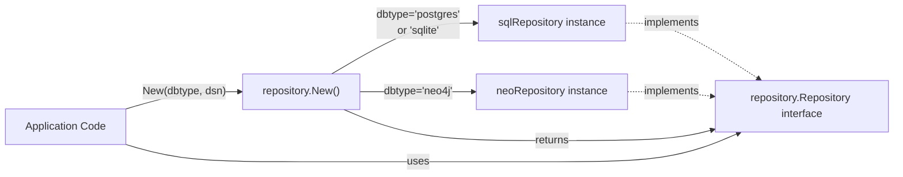
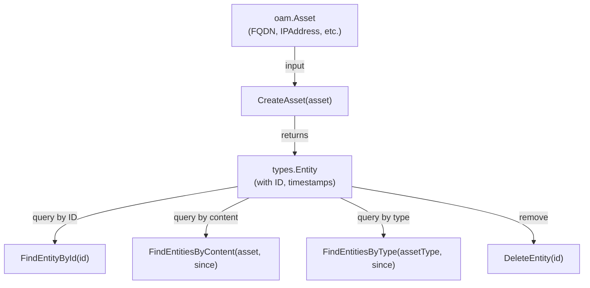
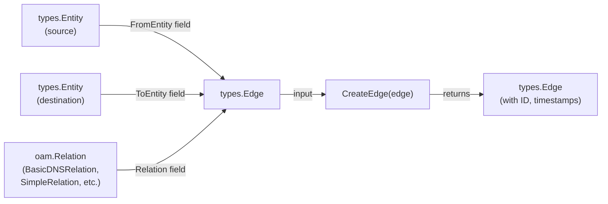
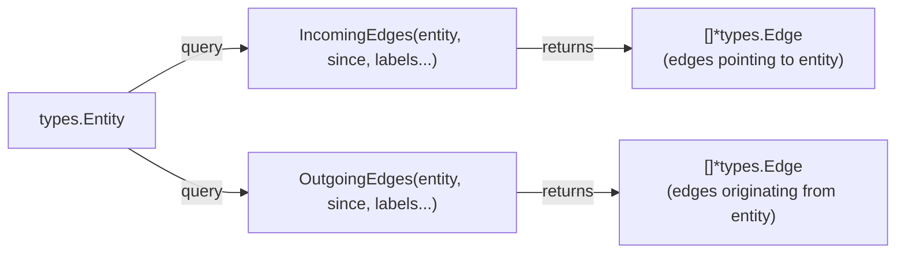
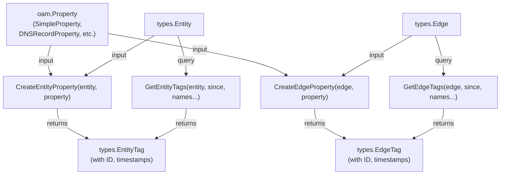

# Basic Usage Examples

This page provides practical code examples for common operations in asset-db. It demonstrates how to initialize a repository, create entities and edges, add metadata through tags, and perform basic queries. These examples assume you have already installed asset-db ([see Installation](#2.1)) and configured your database connection ([see Database Configuration](#2.2)).

For detailed information about the repository interface and all available methods, see [Repository Interface](./api-reference.md#repository-interface). For advanced usage patterns including caching, see [Caching System](./caching.md).

---

# Initializing a Repository

The entry point for using asset-db is the `repository.New()` factory function, which creates the appropriate repository implementation based on the database type.

## Basic Initialization Pattern

The initialization process follows a simple factory pattern:



## Example: PostgreSQL Repository

```go
import (
    "github.com/owasp-amass/asset-db/repository"
)

// Initialize PostgreSQL repository
repo, err := repository.New("postgres", 
    "host=localhost port=5432 user=myuser password=mypass dbname=assetdb")
if err != nil {
    // Handle error
}
defer repo.Close()
```

## Example: SQLite Repository

```go
// Initialize SQLite file-based repository
repo, err := repository.New("sqlite", "assets.db")
if err != nil {
    // Handle error
}
defer repo.Close()

// Or use in-memory SQLite for testing
repo, err := repository.New("sqlite_memory", ":memory:")
```

## Example: Neo4j Repository

```go
// Initialize Neo4j repository
repo, err := repository.New("neo4j", 
    "bolt://localhost:7687")
if err != nil {
    // Handle error
}
defer repo.Close()
```

---

# Working with Entities (Assets)

Entities represent nodes in the asset graph. The asset-db system uses the Open Asset Model (OAM) to define standardized asset types.

## Entity Lifecycle Operations



## Example: Creating an FQDN Entity

```go
import (
    "github.com/owasp-amass/open-asset-model/dns"
)

// Create an FQDN asset
fqdn := &dns.FQDN{Name: "www.example.com"}

// Store it as an entity
entity, err := repo.CreateAsset(fqdn)
if err != nil {
    // Handle error
}

// The entity now has an ID and timestamps
fmt.Printf("Entity ID: %s\n", entity.ID)
fmt.Printf("Created At: %s\n", entity.CreatedAt)
fmt.Printf("Last Seen: %s\n", entity.LastSeen)
```

## Example: Creating an IP Address Entity

```go
import (
    "net/netip"
    "github.com/owasp-amass/open-asset-model/network"
)

// Create an IP address asset
ip, _ := netip.ParseAddr("192.168.1.1")
ipAsset := &network.IPAddress{
    Address: ip,
    Type:    "IPv4",
}

entity, err := repo.CreateAsset(ipAsset)
if err != nil {
    // Handle error
}
```

## Example: Creating Other Asset Types

```go
import (
    "net/netip"
    "github.com/owasp-amass/open-asset-model/network"
    oamreg "github.com/owasp-amass/open-asset-model/registration"
)

// Autonomous System
as := &network.AutonomousSystem{Number: 15169}
asEntity, err := repo.CreateAsset(as)

// Netblock (CIDR)
cidr, _ := netip.ParsePrefix("198.51.100.0/24")
netblock := &network.Netblock{
    CIDR: cidr,
    Type: "IPv4",
}
netblockEntity, err := repo.CreateAsset(netblock)

// Registration Record
autnumRecord := &oamreg.AutnumRecord{
    Number: 15169,
    Handle: "AS15169",
    Name:   "GOOGLE",
}
recordEntity, err := repo.CreateAsset(autnumRecord)
```

## Duplicate Asset Handling

When you create an asset that already exists (same content), the system updates the `LastSeen` timestamp rather than creating a duplicate.

```go
// Create asset first time
entity1, _ := repo.CreateAsset(&dns.FQDN{Name: "example.com"})

// Wait a moment
time.Sleep(time.Second)

// Create same asset again
entity2, _ := repo.CreateAsset(&dns.FQDN{Name: "example.com"})

// entity1.ID == entity2.ID (same entity)
// entity2.LastSeen > entity1.LastSeen (updated timestamp)
```

---

# Querying Entities

The repository provides multiple ways to find entities based on different criteria.

## Query Methods Summary

| Method | Purpose | Returns |
|--------|---------|---------|
| `FindEntityById(id)` | Find specific entity by ID | Single entity or error |
| `FindEntitiesByContent(asset, since)` | Find entities matching asset content | List of entities |
| `FindEntitiesByType(assetType, since)` | Find all entities of a specific type | List of entities |

## Example: Finding Entity by ID

```go
// Retrieve a specific entity
entity, err := repo.FindEntityById("entity-uuid-here")
if err != nil {
    // Handle error (entity not found)
}
```

## Example: Finding Entities by Content

```go
import (
    "time"
)

// Find all entities matching this FQDN
fqdn := &dns.FQDN{Name: "www.example.com"}
start := time.Now().Add(-24 * time.Hour) // Last 24 hours

entities, err := repo.FindEntitiesByContent(fqdn, start)
if err != nil {
    // Handle error
}

// entities is a slice of all matching entities
for _, entity := range entities {
    fmt.Printf("Found: %s\n", entity.ID)
}
```

## Example: Finding Entities by Type

```go
import (
    oam "github.com/owasp-amass/open-asset-model"
)

// Find all FQDN entities
start := time.Now().Add(-7 * 24 * time.Hour) // Last 7 days

entities, err := repo.FindEntitiesByType(oam.FQDN, start)
if err != nil {
    // Handle error
}

// Or find all IP addresses
ipEntities, err := repo.FindEntitiesByType(oam.IPAddress, start)
```

---

# Working with Edges (Relationships)

Edges represent directed relationships between entities. Each edge has a source entity (`FromEntity`), a destination entity (`ToEntity`), and a relation type from the Open Asset Model.

## Edge Creation Pattern



## Example: Creating a DNS Relationship

```go
import (
    "github.com/owasp-amass/asset-db/types"
    "github.com/owasp-amass/open-asset-model/dns"
)

// Create two FQDN entities
domain, _ := repo.CreateAsset(&dns.FQDN{Name: "example.com"})
subdomain, _ := repo.CreateAsset(&dns.FQDN{Name: "www.example.com"})

// Create a DNS record relationship
edge := &types.Edge{
    Relation: &dns.BasicDNSRelation{
        Name: "dns_record",
        Header: dns.RRHeader{
            RRType: 5, // CNAME record
            Class:  1,
            TTL:    3600,
        },
    },
    FromEntity: domain,
    ToEntity:   subdomain,
}

createdEdge, err := repo.CreateEdge(edge)
if err != nil {
    // Handle error
}
```

## Example: Creating Simple Relationships

```go
import (
    "github.com/owasp-amass/open-asset-model/general"
)

// AS announces netblock
asEntity, _ := repo.CreateAsset(&network.AutonomousSystem{Number: 15169})
netblockEntity, _ := repo.CreateAsset(&network.Netblock{CIDR: cidr, Type: "IPv4"})

edge := &types.Edge{
    Relation: &general.SimpleRelation{Name: "announces"},
    FromEntity: asEntity,
    ToEntity: netblockEntity,
}

createdEdge, err := repo.CreateEdge(edge)
```

## Example: FQDN to IP Address Relationship

```go
// FQDN resolves to IP address
fqdnEntity, _ := repo.CreateAsset(&dns.FQDN{Name: "www.domain.com"})
ipEntity, _ := repo.CreateAsset(&network.IPAddress{Address: ip, Type: "IPv4"})

edge := &types.Edge{
    Relation: &dns.BasicDNSRelation{
        Name: "dns_record",
        Header: dns.RRHeader{RRType: 1}, // A record
    },
    FromEntity: fqdnEntity,
    ToEntity: ipEntity,
}

createdEdge, err := repo.CreateEdge(edge)
```

---

# Querying Edges

The repository provides methods to traverse the graph by finding incoming and outgoing edges for any entity.

## Edge Query Methods



## Example: Finding Outgoing Edges

```go
// Find all edges originating from an entity
start := time.Now().Add(-24 * time.Hour)

// Get all outgoing edges (no label filter)
edges, err := repo.OutgoingEdges(sourceEntity, start)
if err != nil {
    // Handle error
}

// Get only DNS record edges
dnsEdges, err := repo.OutgoingEdges(sourceEntity, start, "dns_record")
if err != nil {
    // Handle error
}

for _, edge := range dnsEdges {
    fmt.Printf("Edge from %s to %s\n", 
        edge.FromEntity.ID, edge.ToEntity.ID)
}
```

## Example: Finding Incoming Edges

```go
// Find all edges pointing to an entity
start := time.Now().Add(-24 * time.Hour)

// Get all incoming edges
edges, err := repo.IncomingEdges(destinationEntity, start)
if err != nil {
    // Handle error
}

// Get only specific relation types
dnsEdges, err := repo.IncomingEdges(destinationEntity, start, "dns_record")
if err != nil {
    // Handle error
}

for _, edge := range dnsEdges {
    fmt.Printf("Edge from %s to %s\n", 
        edge.FromEntity.ID, edge.ToEntity.ID)
}
```

## Example: Filtering Edges by Multiple Labels

```go
// Query with multiple relation labels
edges, err := repo.OutgoingEdges(entity, start, "dns_record", "contains")
if err != nil {
    // Handle error
}

// Query all relations (empty label list)
allEdges, err := repo.OutgoingEdges(entity, start)
```

---

# Working with Tags (Properties)

Tags allow you to attach metadata (properties) to entities and edges. Each tag contains an Open Asset Model property and has its own lifecycle tracking (`CreatedAt`, `LastSeen`).

## Tag Operations Flow



## Example: Adding Properties to an Entity

```go
import (
    "github.com/owasp-amass/open-asset-model/general"
)

// Create an entity
entity, _ := repo.CreateAsset(&dns.FQDN{Name: "example.com"})

// Add a simple property
property := &general.SimpleProperty{
    PropertyName:  "source",
    PropertyValue: "passive_dns",
}

tag, err := repo.CreateEntityProperty(entity, property)
if err != nil {
    // Handle error
}

fmt.Printf("Tag ID: %s\n", tag.ID)
fmt.Printf("Property Name: %s\n", tag.Property.Name())
fmt.Printf("Property Value: %s\n", tag.Property.Value())
```

## Example: Adding Properties to an Edge

```go
// Create edge between entities
edge, _ := repo.CreateEdge(&types.Edge{
    Relation: &dns.BasicDNSRelation{
        Name: "dns_record",
        Header: dns.RRHeader{RRType: 5},
    },
    FromEntity: sourceEntity,
    ToEntity:   destEntity,
})

// Add property to the edge
property := &general.SimpleProperty{
    PropertyName:  "resolver",
    PropertyValue: "8.8.8.8",
}

tag, err := repo.CreateEdgeProperty(edge, property)
if err != nil {
    // Handle error
}
```

## Example: Retrieving Tags

```go
// Get all tags for an entity
start := time.Now().Add(-24 * time.Hour)

allTags, err := repo.GetEntityTags(entity, start)
if err != nil {
    // Handle error
}

// Get tags with specific property names
specificTags, err := repo.GetEntityTags(entity, start, "source", "confidence")
if err != nil {
    // Handle error
}

for _, tag := range specificTags {
    fmt.Printf("Property: %s = %s\n", 
        tag.Property.Name(), tag.Property.Value())
}
```

## Tag Update Behavior

When you create a property that already exists (same name and value), the system updates the `LastSeen` timestamp. If you create a property with the same name but different value, it creates a new tag.

```go
// Create initial property
prop1 := &general.SimpleProperty{
    PropertyName:  "status",
    PropertyValue: "active",
}
tag1, _ := repo.CreateEntityProperty(entity, prop1)

time.Sleep(time.Second)

// Same property again - updates LastSeen
tag2, _ := repo.CreateEntityProperty(entity, prop1)
// tag1.ID == tag2.ID
// tag2.LastSeen > tag1.LastSeen

// Different value - creates new tag
prop1.PropertyValue = "inactive"
tag3, _ := repo.CreateEntityProperty(entity, prop1)
// tag3.ID != tag1.ID (new tag created)
```

---

# Deleting Data

The repository provides methods to delete entities, edges, and tags.

## Example: Deleting an Edge

```go
err := repo.DeleteEdge(edgeID)
if err != nil {
    // Handle error
}
```

## Example: Deleting an Entity

```go
err := repo.DeleteEntity(entityID)
if err != nil {
    // Handle error
}

// Verify deletion
_, err = repo.FindEntityById(entityID)
// err will be non-nil (entity not found)
```

## Example: Deleting Tags

```go
// Delete entity tag
err := repo.DeleteEntityTag(tagID)
if err != nil {
    // Handle error
}

// Delete edge tag
err = repo.DeleteEdgeTag(tagID)
if err != nil {
    // Handle error
}
```

---

# Complete Example: Building a Simple Asset Graph

This example demonstrates a typical workflow: creating entities, linking them with edges, and adding metadata.

```go
package main

import (
    "fmt"
    "net/netip"
    "time"
    
    "github.com/owasp-amass/asset-db/repository"
    "github.com/owasp-amass/asset-db/types"
    "github.com/owasp-amass/open-asset-model/dns"
    "github.com/owasp-amass/open-asset-model/general"
    "github.com/owasp-amass/open-asset-model/network"
)

func main() {
    // Initialize repository
    repo, err := repository.New("sqlite", "example.db")
    if err != nil {
        panic(err)
    }
    defer repo.Close()
    
    // Create an FQDN entity
    fqdn, err := repo.CreateAsset(&dns.FQDN{Name: "www.example.com"})
    if err != nil {
        panic(err)
    }
    fmt.Printf("Created FQDN: %s\n", fqdn.ID)
    
    // Create an IP address entity
    ip, _ := netip.ParseAddr("192.0.2.1")
    ipAddr, err := repo.CreateAsset(&network.IPAddress{
        Address: ip,
        Type:    "IPv4",
    })
    if err != nil {
        panic(err)
    }
    fmt.Printf("Created IP: %s\n", ipAddr.ID)
    
    // Create DNS A record relationship
    edge, err := repo.CreateEdge(&types.Edge{
        Relation: &dns.BasicDNSRelation{
            Name: "dns_record",
            Header: dns.RRHeader{
                RRType: 1, // A record
                TTL:    300,
            },
        },
        FromEntity: fqdn,
        ToEntity:   ipAddr,
    })
    if err != nil {
        panic(err)
    }
    fmt.Printf("Created edge: %s\n", edge.ID)
    
    // Add metadata to the FQDN
    sourceTag, err := repo.CreateEntityProperty(fqdn, &general.SimpleProperty{
        PropertyName:  "source",
        PropertyValue: "certificate_transparency",
    })
    if err != nil {
        panic(err)
    }
    fmt.Printf("Added tag: %s\n", sourceTag.ID)
    
    // Query all outgoing edges from the FQDN
    start := time.Now().Add(-1 * time.Hour)
    edges, err := repo.OutgoingEdges(fqdn, start)
    if err != nil {
        panic(err)
    }
    
    fmt.Printf("\nFound %d outgoing edges\n", len(edges))
    for _, e := range edges {
        fmt.Printf("  Edge: %s -> %s (%s)\n",
            e.FromEntity.ID,
            e.ToEntity.ID,
            e.Relation.Label())
    }
    
    // Query tags on the FQDN
    tags, err := repo.GetEntityTags(fqdn, start)
    if err != nil {
        panic(err)
    }
    
    fmt.Printf("\nFound %d tags\n", len(tags))
    for _, tag := range tags {
        fmt.Printf("  %s = %s\n",
            tag.Property.Name(),
            tag.Property.Value())
    }
}
```

# See Also

- [Asset Database Overview](./index.md)
- [PostgreSQL Setup](./postgres.md)
- [Caching](./caching.md)
- [API Reference](./api-reference.md)
