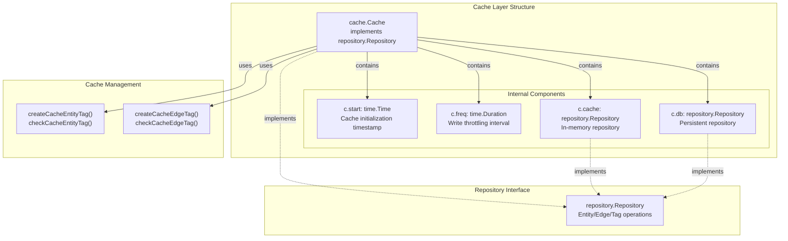
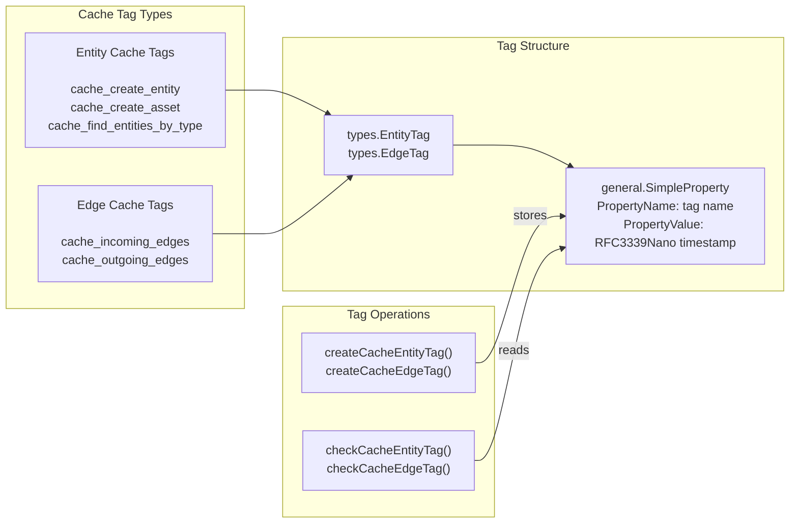
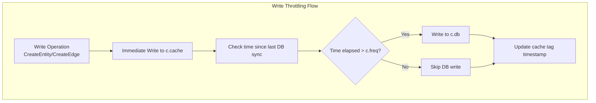
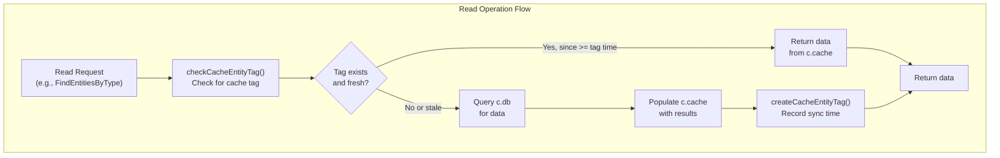
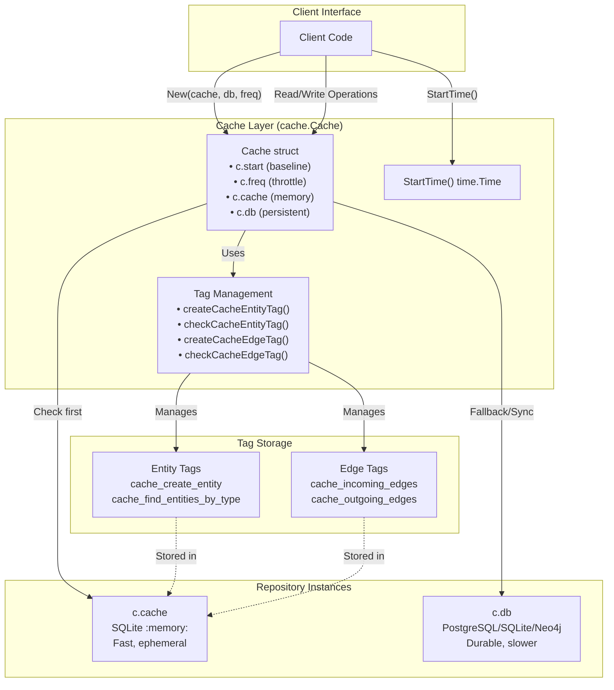
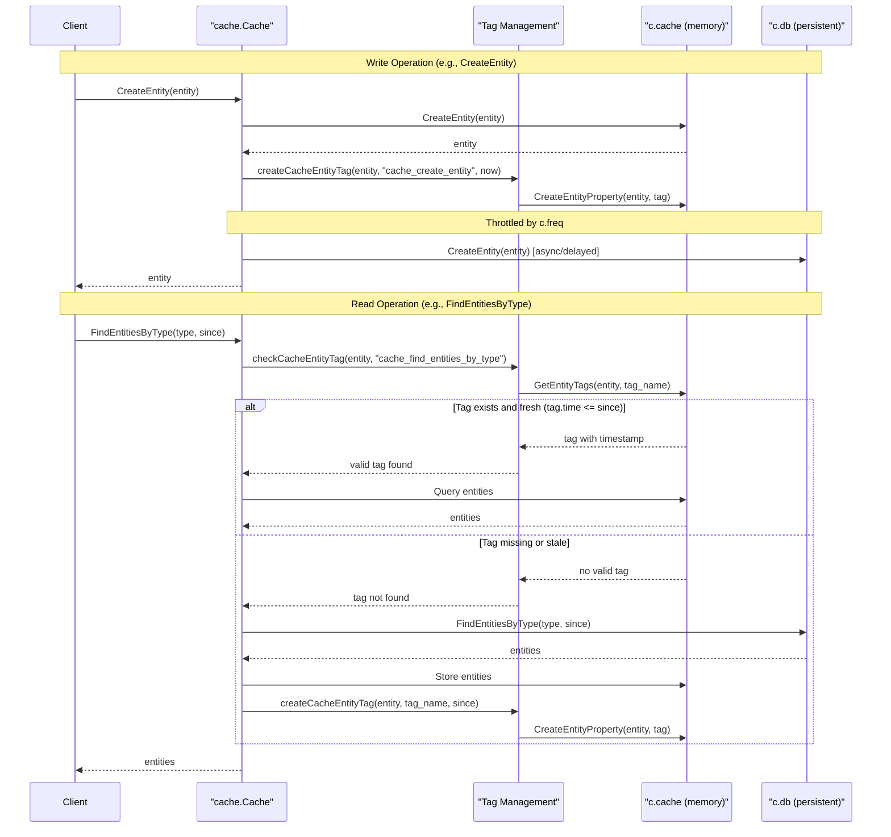

# Caching System

The caching system provides a performance optimization layer that wraps any `repository.Repository` implementation with an in-memory cache. It reduces database load through tag-based cache invalidation, frequency-based write throttling, and temporal query optimization. The cache implements the same `repository.Repository` interface, making it a transparent drop-in wrapper for any existing repository.

This document covers the overall caching architecture and mechanisms. For detailed operation-specific behavior, see [Entity Caching](#6.2), [Edge Caching](#6.3), and [Tag Caching](#6.4). For the underlying repository abstraction, see [Repository Pattern](./index.md#repository-pattern).

---

## Core Architecture

The caching system is built around a dual-repository pattern where an in-memory repository serves as a fast cache layer over a persistent database repository. The `Cache` struct wraps both repositories and implements the `repository.Repository` interface.



---

## Cache Struct Components

The `Cache` struct contains four primary fields that control its behavior:

| Field | Type | Purpose |
|-------|------|---------|
| `start` | `time.Time` | Records when the cache was initialized. Used as a baseline for temporal queries. |
| `freq` | `time.Duration` | Controls write throttling frequency. Determines how often cache data is synchronized to the persistent database. |
| `cache` | `repository.Repository` | In-memory repository for fast data access. Typically a SQLite in-memory database. |
| `db` | `repository.Repository` | Persistent repository for durable storage. Can be PostgreSQL, SQLite file, or Neo4j. |

The cache is created using the `New` function:

```go
func New(cache, database repository.Repository, freq time.Duration) (*Cache, error)
```

---

## Dual Repository Pattern

The caching system implements a dual-repository pattern where operations are distributed between the fast in-memory cache and the slower persistent database based on operation type and temporal parameters.

```mermaid
sequenceDiagram
    participant Client
    participant Cache["cache.Cache"]
    participant CacheRepo["c.cache<br/>(In-Memory)"]
    participant DBRepo["c.db<br/>(Persistent)"]
    
    Note over Client,DBRepo: Write Operation Flow
    Client->>Cache: "CreateEntity(entity)"
    Cache->>CacheRepo: "CreateEntity(entity)"
    CacheRepo-->>Cache: "entity"
    Cache->>Cache: "createCacheEntityTag()"
    Cache->>DBRepo: "CreateEntity() (throttled)"
    DBRepo-->>Cache: "entity"
    Cache-->>Client: "entity"
    
    Note over Client,DBRepo: Read Operation Flow (Cache Hit)
    Client->>Cache: "FindEntityById(id)"
    Cache->>CacheRepo: "FindEntityById(id)"
    CacheRepo-->>Cache: "entity (found)"
    Cache-->>Client: "entity"
    
    Note over Client,DBRepo: Read Operation Flow (Cache Miss)
    Client->>Cache: "FindEntitiesByType(type, since)"
    Cache->>Cache: "checkCacheEntityTag()"
    Cache->>DBRepo: "FindEntitiesByType()"
    DBRepo-->>Cache: "entities"
    Cache->>CacheRepo: "Populate cache"
    Cache->>Cache: "createCacheEntityTag()"
    Cache-->>Client: "entities"
```

**Write Operations:** Data is immediately written to the in-memory cache and tagged with a cache timestamp. Writes to the persistent database are throttled based on the `freq` duration to reduce database load.

**Read Operations:** The cache checks the in-memory repository first. If data is not found or is stale (based on `since` parameters and cache tags), the persistent database is queried and the cache is populated.

---

## Tag-Based Cache Invalidation

Cache invalidation is managed through a tag system where each cached entity or edge is tagged with a timestamp indicating when it was last synchronized from the persistent database. These tags enable the cache to determine data freshness without constant database queries.



**Cache Tag Functions:**

- `createCacheEntityTag(entity, name, since)` - Creates an entity tag with a timestamp 
- `checkCacheEntityTag(entity, name)` - Retrieves and parses entity tag timestamp 
- `createCacheEdgeTag(edge, name, since)` - Creates an edge tag with a timestamp 
- `checkCacheEdgeTag(edge, name)` - Retrieves and parses edge tag timestamp 

Each tag is stored as a `general.SimpleProperty` with:
- `PropertyName`: The cache tag identifier (e.g., `"cache_create_entity"`)
- `PropertyValue`: Timestamp in RFC3339Nano format

---

## Frequency-Based Write Throttling

The `freq` duration parameter controls how often cached data is written to the persistent database. This throttling mechanism significantly reduces database write load while maintaining eventual consistency.



The frequency parameter is specified when creating the cache:

```go
cache, err := New(inMemoryRepo, persistentRepo, time.Minute)
```

With `freq` set to `time.Minute`, writes to the persistent database are throttled to occur no more frequently than once per minute, regardless of how many write operations are performed on the cache.

---

## Temporal Awareness

The caching system is temporally aware, using timestamps to determine data freshness and synchronization requirements. This is achieved through two primary mechanisms: the cache start time and the `since` parameter in query operations.

### Start Time

The `start` field records when the cache was initialized and serves as a baseline for temporal queries:

```go
func (c *Cache) StartTime() time.Time {
    return c.start
}
```

Operations using `c.StartTime()` as the `since` parameter will only return entities created or modified after the cache was initialized. This is useful for retrieving only new data without querying the entire persistent database.

### Since Parameter

Most query methods accept a `since time.Time` parameter that filters results to only include entities/edges modified after that timestamp. The cache uses this parameter to determine whether cached data is fresh enough or if a database query is needed.

**Example from tests:**

```go
// Query entities created after the cache start time
entities, err := cache.FindEntitiesByType(oam.FQDN, cache.StartTime())

// Query older entities
entities, err := cache.FindEntitiesByType(oam.FQDN, ctime1)
```

When a `since` timestamp is older than the cached tag timestamp, the cache queries the persistent database for historical data.

---

## Implementation Overview

The `Cache` struct implements the complete `repository.Repository` interface, providing transparent caching for all repository operations:

| Operation Category | Methods | Behavior |
|-------------------|---------|----------|
| **Initialization** | `New()`, `Close()`, `GetDBType()`, `StartTime()` | Setup and metadata |
| **Entity Operations** | `CreateEntity()`, `CreateAsset()`, `FindEntityById()`, `FindEntitiesByContent()`, `FindEntitiesByType()`, `DeleteEntity()` | Cache-aside pattern with tag tracking |
| **Edge Operations** | `CreateEdge()`, `FindEdgeById()`, `IncomingEdges()`, `OutgoingEdges()`, `DeleteEdge()` | Cache-aside pattern with tag tracking |
| **Tag Operations** | `CreateEntityProperty()`, `GetEntityTags()`, `CreateEdgeProperty()`, `GetEdgeTags()` | Direct passthrough to cache repository |

The cache transparently wraps any repository implementation, whether SQL-based ([SQL Repository](./postgres.md#sql-repository-implementation)) or graph-based ([Neo4j Repository](./triples.md#neo4j-repository)).

---

## Usage Example

Creating and using a cached repository:

```go
import (
    "time"
    assetdb "github.com/owasp-amass/asset-db"
    "github.com/owasp-amass/asset-db/cache"
    "github.com/owasp-amass/asset-db/repository/sqlrepo"
)

// Create in-memory cache repository
cacheRepo, err := assetdb.New(sqlrepo.SQLiteMemory, "")

// Create persistent database repository
dbRepo, err := assetdb.New(sqlrepo.SQLite, "/path/to/db.sqlite")

// Wrap with cache layer (1-minute write throttling)
cachedRepo, err := cache.New(cacheRepo, dbRepo, time.Minute)
defer cachedRepo.Close()

// Use cachedRepo like any repository.Repository
entity, err := cachedRepo.CreateAsset(&dns.FQDN{Name: "example.com"})
entities, err := cachedRepo.FindEntitiesByType(oam.FQDN, cachedRepo.StartTime())
```

## Cache Architecture

## Purpose and Scope

This document describes the architectural design of the caching layer in asset-db. The cache provides a performance optimization layer that wraps any repository implementation (SQL or Neo4j) with an in-memory cache. This page focuses on the core architectural patterns: the dual-repository design, tag-based cache invalidation, and frequency-based write throttling.

For specific caching operations, see:
- Entity caching operations: [6.2](#6.2)
- Edge caching operations: [6.3](#6.3)
- Tag caching operations: [6.4](#6.4)

For information about the underlying repository implementations being cached, see [3.1](#3.1) for the Repository pattern.

---

## Overview

The caching system implements a sophisticated dual-repository architecture that provides performance optimization through intelligent cache management. The design balances three competing concerns:

1. **Performance** - Fast in-memory access to frequently used data
2. **Durability** - Persistent storage in the underlying database
3. **Consistency** - Controlled synchronization between cache and database

The cache operates transparently by implementing the `repository.Repository` interface, allowing it to be used as a drop-in replacement for any repository implementation.

---

## Dual Repository Pattern

### Architecture

The `Cache` struct maintains two separate repository instances:

```go
type Cache struct {
    start time.Time              // Baseline timestamp for temporal queries
    freq  time.Duration           // Throttling frequency for DB writes
    cache repository.Repository   // In-memory repository (fast)
    db    repository.Repository   // Persistent repository (durable)
}
```

### Repository Roles

| Repository | Purpose | Storage | Speed | Durability |
|-----------|---------|---------|-------|------------|
| `c.cache` | Fast data access, temporary storage | In-memory (SQLite `:memory:`) | Very fast | Ephemeral |
| `c.db` | Persistent data storage, source of truth | File-based or remote DB | Slower | Durable |

The dual pattern operates as follows:

1. **Reads** check `c.cache` first (cache-aside pattern)
2. On cache miss, data is fetched from `c.db` and populated into `c.cache`
3. **Writes** go immediately to `c.cache`
4. Writes to `c.db` are throttled based on the `c.freq` duration

### Construction

The cache is constructed using the `New` function:

```go
func New(cache, database repository.Repository, freq time.Duration) (*Cache, error)
```

**Parameters:**
- `cache` - In-memory repository (typically SQLite in-memory)
- `database` - Persistent repository (PostgreSQL, SQLite file, or Neo4j)
- `freq` - Frequency duration for throttling database writes

**Example from tests:**

```
cache, err := assetdb.New(sqlrepo.SQLiteMemory, "")  // In-memory
db, err := assetdb.New(sqlrepo.SQLite, "assetdb.sqlite")  // Persistent
c, err := New(cache, db, time.Minute)  // 1-minute write throttling
```

---

## Tag-Based Invalidation System

### Cache Tag Mechanism

The cache uses entity and edge tags to track when data was last synchronized between `c.cache` and `c.db`. Each synchronized operation creates a tag with a timestamp indicating when the synchronization occurred.

### Cache Tag Structure

Cache tags are regular entity/edge tags with specific naming conventions and timestamp values:

| Field | Value |
|-------|-------|
| Property Name | Operation-specific identifier (e.g., `cache_create_entity`) |
| Property Value | RFC3339Nano formatted timestamp |
| Property Type | `general.SimpleProperty` |

### Standard Cache Tag Names

The following cache tag names are used by the system:

| Tag Name | Purpose | Applied To |
|----------|---------|------------|
| `cache_create_entity` | Tracks entity creation synchronization | Entity |
| `cache_create_asset` | Tracks asset creation synchronization | Entity |
| `cache_find_entities_by_type` | Tracks type-based query synchronization | Entity |
| `cache_incoming_edges` | Tracks incoming edge query synchronization | Entity |
| `cache_outgoing_edges` | Tracks outgoing edge query synchronization | Entity |

### Tag Management Methods

The cache provides internal methods for managing cache tags:

**For Entity Tags:**
```go
func (c *Cache) createCacheEntityTag(entity *types.Entity, name string, since time.Time) error
func (c *Cache) checkCacheEntityTag(entity *types.Entity, name string) (*types.EntityTag, time.Time, bool)
```

**For Edge Tags:**
```go
func (c *Cache) createCacheEdgeTag(edge *types.Edge, name string, since time.Time) error
func (c *Cache) checkCacheEdgeTag(edge *types.Edge, name string) (*types.EdgeTag, time.Time, bool)
```

The `check` methods return three values:
1. The tag itself (if found)
2. The parsed timestamp from the tag
3. A boolean indicating whether a valid tag was found

### Diagram: Tag-Based Invalidation Flow



---

## Frequency-Based Throttling

### Throttling Mechanism

The `c.freq` field controls how frequently write operations are synchronized to the persistent database. This reduces database load by batching writes and deferring non-critical synchronizations.

### Throttling Strategy

| Write Type | Cache Behavior | Database Behavior |
|-----------|----------------|-------------------|
| Entity creation | Immediate write to `c.cache` | Throttled write to `c.db` |
| Edge creation | Immediate write to `c.cache` | Throttled write to `c.db` |
| Tag creation | Immediate write to `c.cache` | Throttled write to `c.db` |
| Entity deletion | Immediate delete from `c.cache` | Throttled delete from `c.db` |
| Edge deletion | Immediate delete from `c.cache` | Throttled delete from `c.db` |

### Frequency Duration

The frequency duration is set during cache construction and cannot be changed afterward:

```go
c, err := New(cache, db, time.Minute)  // 1-minute throttling
```

**Common frequency values:**
- **Testing:** `250 * time.Millisecond` - Fast synchronization for tests
- **Development:** `time.Minute` - 1-minute intervals
- **Production:** `5 * time.Minute` or higher - Reduced database load

### Eventual Consistency

The throttling mechanism provides **eventual consistency** between the cache and database:

1. Writes are immediately visible in `c.cache`
2. Reads from `c.cache` see the latest data immediately
3. Writes to `c.db` occur asynchronously within the `c.freq` window
4. After the throttling delay, `c.db` is synchronized

**Test verification:** Tests use `time.Sleep(250 * time.Millisecond)` to wait for database synchronization before verifying data in `c.db`.

---

## Start Time Baseline

### Purpose

The `c.start` field stores the timestamp when the cache was created. This serves as a baseline for temporal queries, allowing the cache to determine which data is "new" since the cache was initialized.

### Start Time Usage

```go
func (c *Cache) StartTime() time.Time {
    return c.start
}
```

The start time is used to:

1. **Filter queries** - Only return data created/modified after cache initialization
2. **Determine cache hits** - Data older than `c.start` may not be in cache
3. **Query optimization** - Avoid unnecessary database queries for old data

### Example Usage Pattern

```
Cache created at T0 (c.start = T0)
Data created at T-5 (before cache) → Not in cache, must query c.db
Data created at T+5 (after cache) → May be in cache
Query with since=T-10 → Will query c.db (older than c.start)
Query with since=T+1 → May use cache (newer than c.start)
```

**Test verification:**

 demonstrates this behavior:
- Old data (24 hours before) is added directly to `c.db`
- Medium-old data (8 hours before) is added to `c.db`
- New data is added through the cache
- Queries with different `since` values behave differently based on `c.start`

---

## Diagram: Complete Cache Architecture



---

## Diagram: Cache Operation Sequence



---

## Implementation Details

### Cache Struct Definition

The complete `Cache` struct from :

```go
type Cache struct {
    start time.Time              // Timestamp when cache was created
    freq  time.Duration           // Frequency for throttling DB writes
    cache repository.Repository   // In-memory repository
    db    repository.Repository   // Persistent repository
}
```

### Core Methods

| Method | Purpose | Returns |
|--------|---------|---------|
| `New(cache, database, freq)` | Constructor | `*Cache, error` |
| `StartTime()` | Get cache creation time | `time.Time` |
| `Close()` | Close cache repository | `error` |
| `GetDBType()` | Get underlying DB type | `string` |

### Tag Management Implementation

The tag system uses `general.SimpleProperty` from the Open Asset Model to store timestamp information:

**Creating a cache tag:**
```go
func (c *Cache) createCacheEntityTag(entity *types.Entity, name string, since time.Time) error {
    _, err := c.cache.CreateEntityProperty(entity, &general.SimpleProperty{
        PropertyName:  name,
        PropertyValue: since.Format(time.RFC3339Nano),
    })
    return err
}
```

**Checking a cache tag:**
```go
func (c *Cache) checkCacheEntityTag(entity *types.Entity, name string) (*types.EntityTag, time.Time, bool) {
    if tags, err := c.cache.GetEntityTags(entity, time.Time{}, name); err == nil && len(tags) == 1 {
        if t, err := time.Parse(time.RFC3339Nano, tags[0].Property.Value()); err == nil {
            return tags[0], t, true
        }
    }
    return nil, time.Time{}, false
}
```

### Interface Compliance

The `Cache` type implements the `repository.Repository` interface, allowing it to be used wherever a repository is expected:

```go
var _ repository.Repository = &Cache{}
var _ repository.Repository = (*Cache)(nil)
```

This is verified in tests at .

---

## Testing Infrastructure

### Test Repository Setup

Tests create dual repositories using a helper function:

```go
func createTestRepositories() (repository.Repository, repository.Repository, string, error)
```

This creates:
1. An in-memory SQLite repository for the cache
2. A file-based SQLite repository for persistent storage
3. A temporary directory for the file-based database

### Example Test Pattern

 demonstrates the complete pattern:

1. Create dual repositories
2. Construct cache with frequency parameter
3. Perform operation (e.g., `CreateEntity`)
4. Verify immediate cache presence
5. Wait for frequency delay (`time.Sleep`)
6. Verify database synchronization

---

## Performance Characteristics

### Cache Hit Scenarios

| Scenario | Cache Behavior | Database Queries |
|----------|----------------|------------------|
| Recent data query | Cache hit, return from `c.cache` | 0 |
| Historical data query | Cache miss, fetch from `c.db` | 1 |
| Repeated query | Cache hit after first query | 1 (first time only) |
| Write operation | Immediate in `c.cache` | 1 (throttled) |

### Throttling Impact

With frequency `f`:
- **Best case**: Database writes delayed by `0` to `f`
- **Average case**: Database writes delayed by `f/2`
- **Worst case**: Database writes delayed by `f`

**Example:** With `freq = time.Minute`:
- Write at T+0 → DB write between T+0 and T+60
- Write at T+10 → DB write between T+10 and T+70
- Write at T+59 → DB write between T+59 and T+119

---

## Summary

The cache architecture provides performance optimization through:

1. **Dual Repository Pattern**: Separate in-memory and persistent storage with controlled synchronization
2. **Tag-Based Invalidation**: Timestamp-based tags track data freshness and enable intelligent cache decisions
3. **Frequency-Based Throttling**: Configurable write delays reduce database load while maintaining eventual consistency
4. **Temporal Awareness**: Start time baseline enables efficient query optimization

This architecture enables the cache to transparently optimize any repository implementation while maintaining the same `repository.Repository` interface.

## See Also

- [Asset Database Overview](./index.md)
- [API Reference](./api-reference.md)
