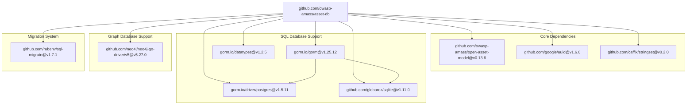
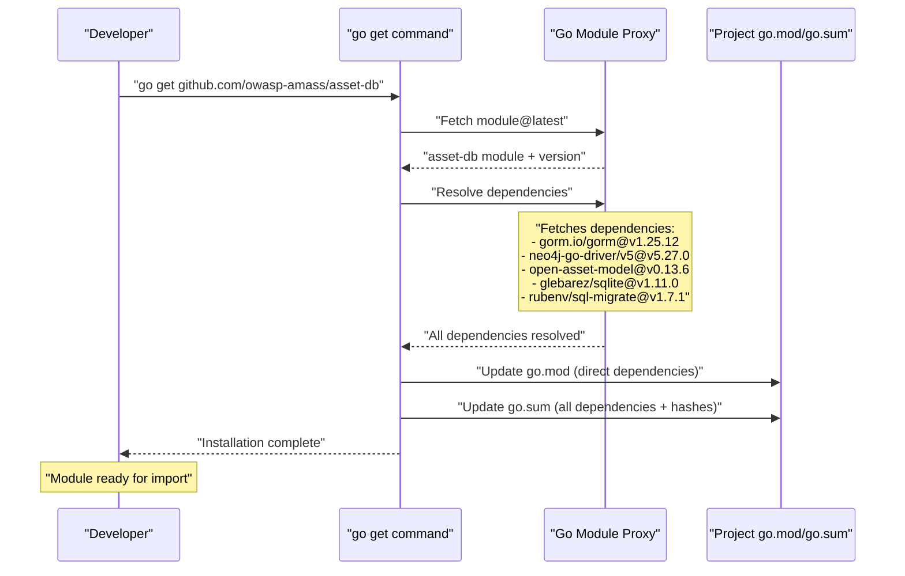

# Installation

This page describes how to install the `asset-db` module as a Go dependency in your application and configure the necessary database backends. For information about configuring specific database connections, see [Database Configuration](./getting-started.md#database-configuration). For basic usage examples after installation, see [Basic Usage Examples](./getting-started.md#basic-usage-examples).

---

# Overview

The `asset-db` system is distributed as a Go module that can be imported into any Go application. The installation process involves adding the module to your project and ensuring the appropriate database backend is available. The system supports three database backends: PostgreSQL, SQLite, and Neo4j, each with different installation requirements.

---

# Prerequisites

## Go Version Requirement

The `asset-db` module requires **Go 1.23.1** or later. This version requirement is specified in .

```bash
# Verify your Go version
go version
```

## Database Backend Selection

Before installation, determine which database backend(s) you will use:

| Database Backend | Use Case | Additional Setup Required |
|-----------------|----------|---------------------------|
| **SQLite** | Development, testing, embedded applications | None (pure Go driver) |
| **PostgreSQL** | Production deployments, ACID compliance | PostgreSQL server installation |
| **Neo4j** | Graph-heavy queries, relationship-focused workloads | Neo4j server installation |

---

# Installation Steps

## Step 1: Add Module to Your Project

Add the `asset-db` module to your Go project using `go get`:

```bash
go get github.com/owasp-amass/asset-db
```

This command automatically downloads the module and its dependencies, updating your `go.mod` and `go.sum` files.

## Step 2: Core Dependencies

When you install `asset-db`, the following core dependencies are automatically installed:



**Diagram: Module Dependency Structure** - Shows the direct dependencies that are automatically installed with `asset-db`, mapped to their specific versions as declared in `go.mod`.

---

# Database-Specific Installation

## SQLite (Embedded Database)

**No additional installation required.** SQLite support is provided through a pure Go driver (`glebarez/sqlite`), which is automatically included with the module.

The SQLite driver dependencies include:
- `github.com/glebarez/sqlite@v1.11.0` - GORM-compatible SQLite driver
- `github.com/glebarez/go-sqlite@v1.22.0` - Underlying pure Go SQLite implementation
- `modernc.org/sqlite@v1.34.5` - Pure Go SQLite engine

These are automatically installed as indirect dependencies when you install `asset-db`.

---

## PostgreSQL

**PostgreSQL server must be installed separately.** The Go driver (`pgx/v5`) is included with `asset-db`, but you need a running PostgreSQL instance.

### PostgreSQL Server Installation

Choose one of the following methods:

**Option 1: Using Docker (Recommended for Development)**

The repository includes a Docker setup for PostgreSQL. See [PostgreSQL Docker Container](#8.1) for details.

```bash
# Pull and run PostgreSQL container
docker pull postgres:latest
docker run --name asset-db-postgres \
  -e POSTGRES_PASSWORD=yourpassword \
  -e POSTGRES_DB=assetdb \
  -p 5432:5432 \
  -d postgres:latest
```

**Option 2: Native Installation**

Follow the official PostgreSQL installation guide for your operating system: https://www.postgresql.org/download/

### PostgreSQL Driver Dependencies

The following packages provide PostgreSQL connectivity:
- `gorm.io/driver/postgres@v1.5.11` - GORM PostgreSQL driver
- `github.com/jackc/pgx/v5@v5.7.2` - PostgreSQL driver and toolkit
- `github.com/jackc/pgpassfile@v1.0.0` - Password file parsing
- `github.com/jackc/pgservicefile@v0.0.0-20240606120523-5a60cdf6a761` - Service file parsing
- `github.com/jackc/puddle/v2@v2.2.2` - Connection pooling

These are automatically installed as dependencies.

---

## Neo4j

**Neo4j server must be installed separately.** The Go driver (`neo4j-go-driver/v5`) is included with `asset-db`, but you need a running Neo4j instance.

### Neo4j Server Installation

**Option 1: Using Docker (Recommended for Development)**

```bash
# Pull and run Neo4j container
docker pull neo4j:latest
docker run --name asset-db-neo4j \
  -e NEO4J_AUTH=neo4j/yourpassword \
  -p 7474:7474 \
  -p 7687:7687 \
  -d neo4j:latest
```

**Option 2: Neo4j Desktop or Native Installation**

Download Neo4j Desktop or Community Edition from: https://neo4j.com/download/

### Neo4j Driver Dependencies

The Neo4j support is provided by:
- `github.com/neo4j/neo4j-go-driver/v5@v5.27.0` - Official Neo4j Go driver

This is automatically installed as a dependency.

---

# Verification

After installation, verify that the module is correctly installed and importable:

## Step 1: Create a Test File

Create a file named `verify_install.go`:

```go
package main

import (
    "fmt"
    "github.com/owasp-amass/asset-db"
)

func main() {
    // This will compile successfully if installation is correct
    fmt.Println("asset-db module is correctly installed")
    
    // You can check the version by examining go.mod
    fmt.Println("Ready to create repository instances")
}
```

## Step 2: Run the Verification

```bash
go run verify_install.go
```

If the module is installed correctly, this will compile and run without errors.

## Step 3: Verify Dependencies

Check that all dependencies are correctly resolved:

```bash
# List all dependencies
go list -m all | grep -E "(gorm|neo4j|sqlite|asset)"

# Verify module integrity
go mod verify
```

Expected output should include lines similar to:
```
github.com/owasp-amass/asset-db v0.x.x
github.com/owasp-amass/open-asset-model v0.13.6
github.com/neo4j/neo4j-go-driver/v5 v5.27.0
gorm.io/gorm v1.25.12
github.com/glebarez/sqlite v1.11.0
```

---

# Installation Flow



**Diagram: Installation Sequence** - Shows the complete flow from running `go get` to having the module ready for use, including dependency resolution through the Go module proxy.

---

# Troubleshooting

## Issue: Go Version Too Old

**Error:** `go.mod requires go >= 1.23.1`

**Solution:** Upgrade your Go installation to version 1.23.1 or later.

## Issue: Database Driver Import Errors

**Error:** `could not import gorm.io/driver/postgres`

**Solution:** Ensure all dependencies are downloaded:
```bash
go mod download
go mod tidy
```

## Issue: Module Checksum Mismatch

**Error:** `verifying module: checksum mismatch`

**Solution:** Clear the module cache and re-download:
```bash
go clean -modcache
go mod download
```

## Issue: Neo4j Driver Compatibility

**Error:** `incompatible with neo4j server version`

**Solution:** The driver supports Neo4j 5.x. Ensure your Neo4j server is version 5.0 or later, or use the Docker image recommended above.

---

# Next Steps

After successful installation:

1. **Configure Database Connection:** See [Database Configuration](./getting-started.md#database-configuration) for details on connecting to PostgreSQL, SQLite, or Neo4j
2. **Initialize Repository:** Learn how to create repository instances using the factory pattern
3. **Run Migrations:** Understand how database schemas are automatically initialized
4. **Basic Operations:** Try creating entities and edges with [Basic Usage Examples](./getting-started.md#basic-usage-examples)

