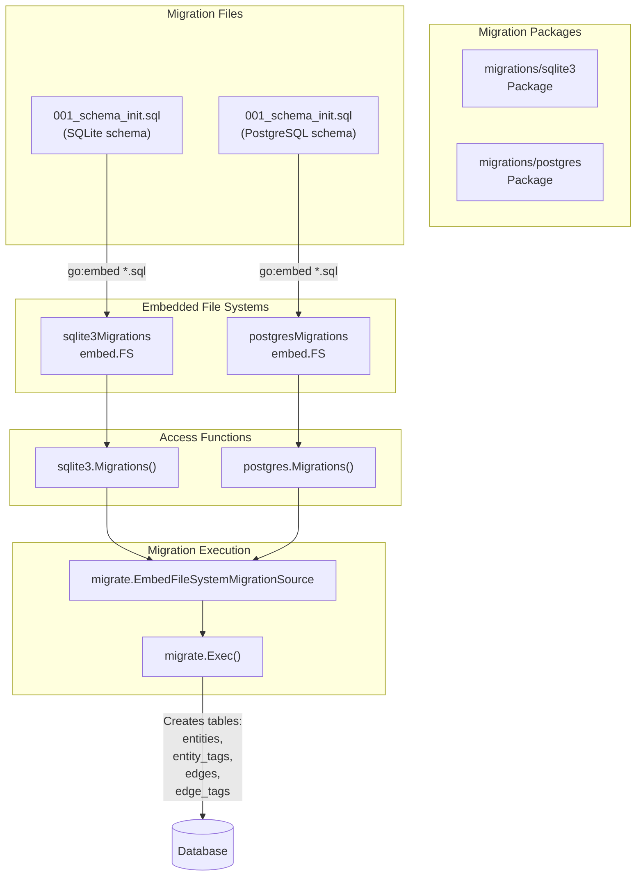
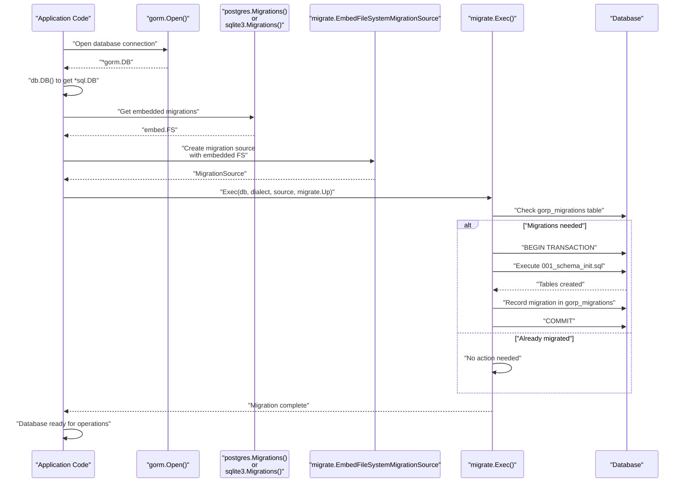
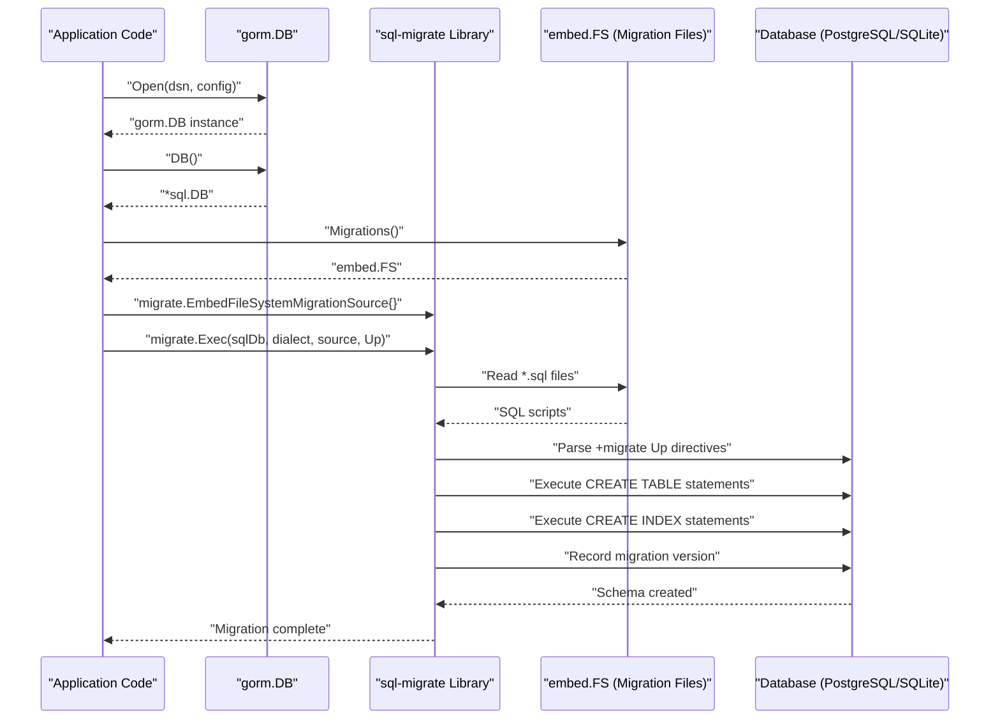
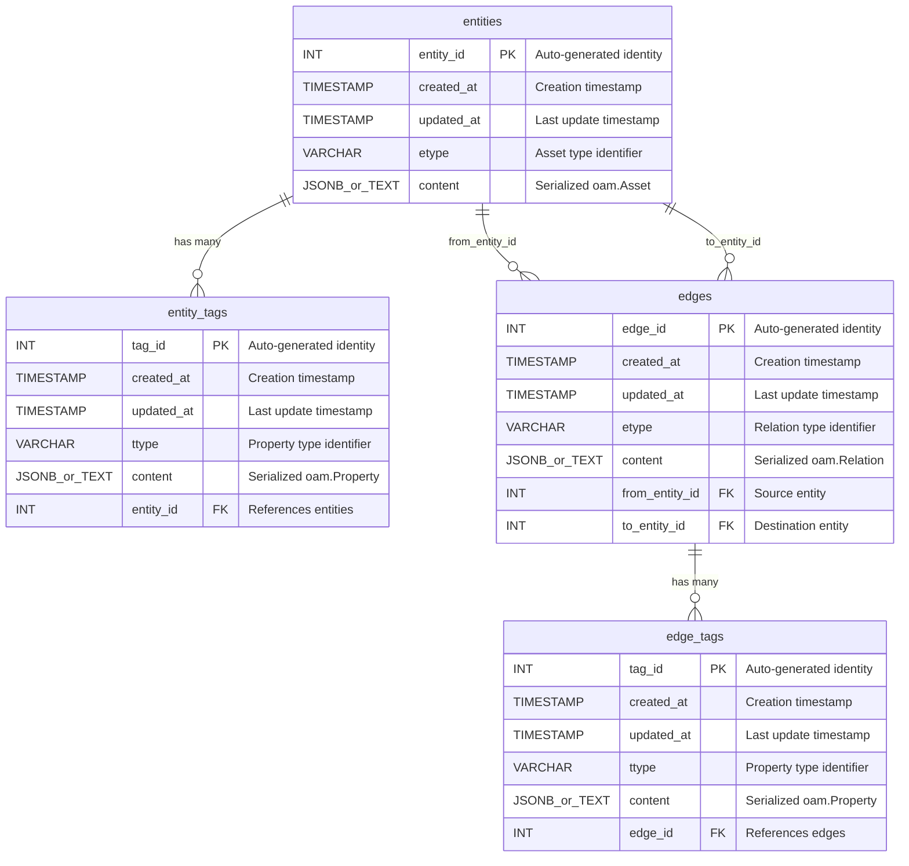
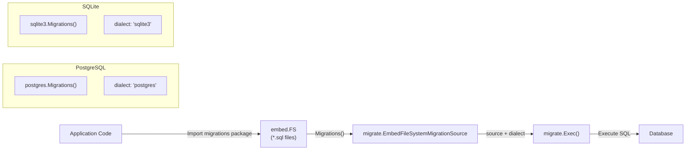
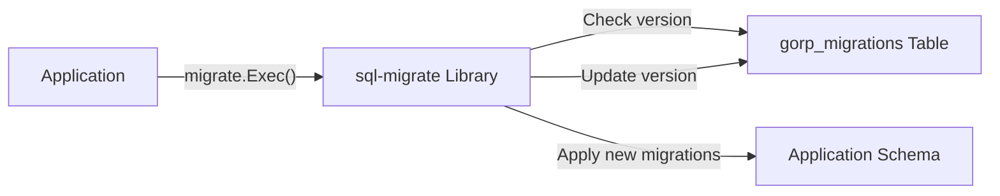

# Database Migrations


This page provides an overview of the database migration system in asset-db, which ensures database schemas are properly initialized and versioned before data operations begin. The migration system automatically creates the necessary tables, indexes, and constraints required by the repository implementations.

This page covers:
- The overall migration architecture and execution flow
- The embedded migration file system pattern used for SQL databases
- How the `sql-migrate` library is integrated for schema versioning

For detailed information about specific implementations:
- SQL schema structure and migration scripts: see [SQL Schema Migrations](./migrations.md#sql-schema-migrations)
- Neo4j constraint and index initialization: see [Neo4j Schema Initialization](#7.2)

---

## Migration System Overview

The asset-db migration system uses different approaches for SQL and graph databases:

| Database Type | Migration Tool | Migration Format | Location |
|--------------|----------------|------------------|----------|
| PostgreSQL | `rubenv/sql-migrate` | Embedded SQL scripts | [migrations/postgres/]() |
| SQLite | `rubenv/sql-migrate` | Embedded SQL scripts | [migrations/sqlite3/]() |
| Neo4j | Custom Cypher initialization | Programmatic constraints |  |

The SQL migration system leverages Go's `embed` package to bundle migration scripts directly into the compiled binary, eliminating the need for external migration files at runtime.

---

## Migration Architecture

The following diagram illustrates how migrations are organized and accessed:



The migration packages expose a `Migrations()` function that returns an `embed.FS` containing all SQL migration files. This pattern allows the `sql-migrate` library to read migration scripts as if they were regular files, while actually reading from embedded data compiled into the binary.

---

## Migration Execution Flow

The following sequence diagram shows how migrations are executed during database initialization:



The `sql-migrate` library maintains its own tracking table (`gorp_migrations`) to record which migrations have been applied, preventing duplicate execution of migration scripts.

---

## Embedded Migration Pattern

The migration system uses Go's `embed` directive to package SQL files into the compiled binary. Here's how the pattern works:

### SQLite Migration Package

The  file demonstrates the pattern:

```go
//go:embed *.sql
var sqlite3Migrations embed.FS

func Migrations() embed.FS {
    return sqlite3Migrations
}
```

The `//go:embed *.sql` directive instructs the Go compiler to embed all `.sql` files in the package directory into the `sqlite3Migrations` variable of type `embed.FS`. The `Migrations()` function provides external access to this embedded file system.

### PostgreSQL Migration Package

The  file follows the same pattern:

```go
//go:embed *.sql
var postgresMigrations embed.FS

func Migrations() embed.FS {
    return postgresMigrations
}
```

This consistent pattern allows both database types to be handled uniformly by the migration execution code.

---

## Using Migrations in Code

The following example from  demonstrates how to execute migrations:

```go
// 1. Open database connection with GORM
db, err := gorm.Open(sqlite.Open(dsn), &gorm.Config{})

// 2. Get standard *sql.DB from GORM
sqlDb, _ := db.DB()

// 3. Create migration source from embedded file system
migrationsSource := migrate.EmbedFileSystemMigrationSource{
    FileSystem: Migrations(),  // Get embed.FS
    Root:       "/",           // Root directory in the embedded FS
}

// 4. Execute migrations
_, err = migrate.Exec(sqlDb, "sqlite3", migrationsSource, migrate.Up)
```

The `migrate.Exec()` function takes:
- `sqlDb`: A standard `*sql.DB` connection
- `"sqlite3"` or `"postgres"`: The SQL dialect identifier
- `migrationsSource`: The embedded migration source
- `migrate.Up`: Direction (apply migrations)

---

## Migration File Naming Convention

Migration files follow a numbered naming convention to control execution order:

| File Name | Purpose | Apply Order |
|-----------|---------|-------------|
| `001_schema_init.sql` | Initial schema creation | First |
| `002_*.sql` | Future migrations | Second |
| `003_*.sql` | Future migrations | Third |

The numeric prefix ensures migrations are applied in the correct sequence. Each file contains both `-- +migrate Up` and `-- +migrate Down` sections, allowing bidirectional migration.

### Migration File Structure

```sql
-- +migrate Up
CREATE TABLE entities(...);
CREATE INDEX idx_entities_updated_at ON entities (updated_at);
-- ... more DDL statements

-- +migrate Down
DROP INDEX IF EXISTS idx_entities_updated_at;
DROP TABLE entities;
-- ... rollback statements
```

The `-- +migrate Up` section defines the forward migration (creating schema), while `-- +migrate Down` defines the rollback (dropping schema). The `sql-migrate` library parses these directives to execute the appropriate section.

---

## Database Schema Components

All SQL migrations create four core tables that map to the [types package](#3.2):

| Table Name | Maps To Type | Purpose |
|------------|--------------|---------|
| `entities` | `types.Entity` | Stores asset nodes |
| `entity_tags` | `types.EntityTag` | Stores entity metadata properties |
| `edges` | `types.Edge` | Stores relationships between entities |
| `edge_tags` | `types.EdgeTag` | Stores edge metadata properties |

Each table includes:
- Auto-incrementing primary key (`entity_id`, `tag_id`, `edge_id`)
- Timestamp fields (`created_at`, `updated_at`)
- Type field (`etype`, `ttype`) for storing OAM type information
- Content field (`content`) for storing serialized OAM objects
- Foreign key constraints for referential integrity
- Indexes on `updated_at` fields for efficient temporal queries

---

## Database-Specific Differences

While the schema structure is identical across SQL databases, there are implementation differences:

| Feature | PostgreSQL | SQLite |
|---------|------------|--------|
| Primary Key | `INT GENERATED ALWAYS AS IDENTITY` | `INTEGER PRIMARY KEY` (autoincrement) |
| JSON Storage | `JSONB` (binary JSON with indexing) | `TEXT` (JSON as string) |
| Timestamp Type | `TIMESTAMP without time zone` | `DATETIME` |
| Foreign Key Default | Enforced by default | Requires `PRAGMA foreign_keys = ON` |
| Constraint Naming | Named constraints (`fk_entity_tags_entities`) | Anonymous constraints |

### SQLite Specific Configuration

SQLite requires explicit foreign key enforcement via pragma:

```sql
-- see https://www.sqlite.org/foreignkeys.html#fk_enable about enabling foreign keys
PRAGMA foreign_keys = ON;
```

This pragma must be set at the beginning of each connection, not just during migration.

---

## Migration State Tracking

The `sql-migrate` library automatically creates and manages a `gorp_migrations` table to track applied migrations:

```
gorp_migrations
├── id (migration identifier, e.g., "001_schema_init.sql")
└── applied_at (timestamp of application)
```

This table is created automatically and should not be modified manually. The library queries this table to determine which migrations need to be applied during `migrate.Exec()` execution.

---

## Integration with Repository Layer

Migrations are executed before repository creation in the initialization flow. From the high-level architecture diagrams, the sequence is:

1. `assetdb.New()` is called with database type and connection string
2. Migration system executes schema initialization
3. Repository implementation (`sqlRepository` or `neoRepository`) is created
4. Repository is returned to the caller

This ensures the database schema is always in the correct state before any data operations occur. The migration execution is transparent to repository consumers.

For details on how repositories use the migrated schema:
- SQL repository usage: see [SQL Repository](./postgres.md#sql-repository-implementation)
- Neo4j repository usage: see [Neo4j Repository](./triples.md#neo4j-repository)

## SQL Schema Migrations


This document covers the SQL schema migration system for PostgreSQL and SQLite databases in the asset-db repository. It details the migration scripts, table structures, indexes, constraints, and the execution mechanism using the `sql-migrate` library.

For Neo4j graph database schema initialization, see [Neo4j Schema Initialization](#7.2).

---

## Migration Architecture

The SQL migration system uses the `rubenv/sql-migrate` library to manage database schema versioning. Migration scripts are embedded directly into the Go binary using Go's `embed` package, ensuring that schema definitions are always available at runtime without external file dependencies.

### Embedded Migration Files

Each database type has its own migration package with embedded SQL files:

**PostgreSQL Migrations:**
- Package: `migrations/postgres`
- Embedded via: 
- Accessor function: `Migrations()` returns `embed.FS` 

**SQLite Migrations:**
- Package: `migrations/sqlite3`
- Embedded via: 
- Accessor function: `Migrations()` returns `embed.FS` 

---

## Migration Execution Flow



---

## Schema Structure

The SQL schema implements a property graph model with four core tables: `entities`, `entity_tags`, `edges`, and `edge_tags`. This structure corresponds to the types defined in .

### Entity-Relationship Diagram



---

## PostgreSQL Schema Details

### Table Definitions

The PostgreSQL schema uses native JSONB columns for storing serialized Open Asset Model content, providing efficient querying and indexing capabilities.

#### Entities Table

| Column | Type | Constraints | Description |
|--------|------|-------------|-------------|
| `entity_id` | `INT` | `PRIMARY KEY`, `GENERATED ALWAYS AS IDENTITY` | Auto-incrementing primary key |
| `created_at` | `TIMESTAMP without time zone` | `DEFAULT CURRENT_TIMESTAMP` | Record creation time |
| `updated_at` | `TIMESTAMP without time zone` | `DEFAULT CURRENT_TIMESTAMP` | Last modification time |
| `etype` | `VARCHAR(255)` | - | Asset type from Open Asset Model |
| `content` | `JSONB` | - | Serialized `oam.Asset` object |

#### Entity Tags Table

| Column | Type | Constraints | Description |
|--------|------|-------------|-------------|
| `tag_id` | `INT` | `PRIMARY KEY`, `GENERATED ALWAYS AS IDENTITY` | Auto-incrementing primary key |
| `created_at` | `TIMESTAMP without time zone` | `DEFAULT CURRENT_TIMESTAMP` | Record creation time |
| `updated_at` | `TIMESTAMP without time zone` | `DEFAULT CURRENT_TIMESTAMP` | Last modification time |
| `ttype` | `VARCHAR(255)` | - | Property type from Open Asset Model |
| `content` | `JSONB` | - | Serialized `oam.Property` object |
| `entity_id` | `INT` | `FOREIGN KEY`, `ON DELETE CASCADE` | References `entities(entity_id)` |

#### Edges Table

| Column | Type | Constraints | Description |
|--------|------|-------------|-------------|
| `edge_id` | `INT` | `PRIMARY KEY`, `GENERATED ALWAYS AS IDENTITY` | Auto-incrementing primary key |
| `created_at` | `TIMESTAMP without time zone` | `DEFAULT CURRENT_TIMESTAMP` | Record creation time |
| `updated_at` | `TIMESTAMP without time zone` | `DEFAULT CURRENT_TIMESTAMP` | Last modification time |
| `etype` | `VARCHAR(255)` | - | Relation type from Open Asset Model |
| `content` | `JSONB` | - | Serialized `oam.Relation` object |
| `from_entity_id` | `INT` | `FOREIGN KEY`, `ON DELETE CASCADE` | Source entity reference |
| `to_entity_id` | `INT` | `FOREIGN KEY`, `ON DELETE CASCADE` | Destination entity reference |

#### Edge Tags Table

| Column | Type | Constraints | Description |
|--------|------|-------------|-------------|
| `tag_id` | `INT` | `PRIMARY KEY`, `GENERATED ALWAYS AS IDENTITY` | Auto-incrementing primary key |
| `created_at` | `TIMESTAMP without time zone` | `DEFAULT CURRENT_TIMESTAMP` | Record creation time |
| `updated_at` | `TIMESTAMP without time zone` | `DEFAULT CURRENT_TIMESTAMP` | Last modification time |
| `ttype` | `VARCHAR(255)` | - | Property type from Open Asset Model |
| `content` | `JSONB` | - | Serialized `oam.Property` object |
| `edge_id` | `INT` | `FOREIGN KEY`, `ON DELETE CASCADE` | References `edges(edge_id)` |

### Foreign Key Constraints

PostgreSQL uses named constraints for referential integrity:

- `fk_entity_tags_entities`: Links `entity_tags.entity_id` to `entities.entity_id` 
- `fk_edges_entities_from`: Links `edges.from_entity_id` to `entities.entity_id` 
- `fk_edges_entities_to`: Links `edges.to_entity_id` to `entities.entity_id` 
- `fk_edge_tags_edges`: Links `edge_tags.edge_id` to `edges.edge_id` 

All foreign keys use `ON DELETE CASCADE` to ensure dependent records are automatically removed when parent records are deleted.

---

## SQLite Schema Details

### Table Definitions

The SQLite schema is structurally similar to PostgreSQL but uses `TEXT` columns for JSON content and requires explicit foreign key enforcement.

#### Foreign Key Enforcement

SQLite requires explicit enablement of foreign key constraints:

```sql
PRAGMA foreign_keys = ON;
```

#### Entities Table

| Column | Type | Constraints | Description |
|--------|------|-------------|-------------|
| `entity_id` | `INTEGER` | `PRIMARY KEY` | Auto-incrementing primary key |
| `created_at` | `DATETIME` | `DEFAULT CURRENT_TIMESTAMP` | Record creation time |
| `updated_at` | `DATETIME` | `DEFAULT CURRENT_TIMESTAMP` | Last modification time |
| `etype` | `TEXT` | - | Asset type from Open Asset Model |
| `content` | `TEXT` | - | JSON-serialized `oam.Asset` object |

#### Entity Tags Table

| Column | Type | Constraints | Description |
|--------|------|-------------|-------------|
| `tag_id` | `INTEGER` | `PRIMARY KEY` | Auto-incrementing primary key |
| `created_at` | `DATETIME` | `DEFAULT CURRENT_TIMESTAMP` | Record creation time |
| `updated_at` | `DATETIME` | `DEFAULT CURRENT_TIMESTAMP` | Last modification time |
| `ttype` | `TEXT` | - | Property type from Open Asset Model |
| `content` | `TEXT` | - | JSON-serialized `oam.Property` object |
| `entity_id` | `INTEGER` | `FOREIGN KEY`, `ON DELETE CASCADE` | References `entities(entity_id)` |

#### Edges Table

| Column | Type | Constraints | Description |
|--------|------|-------------|-------------|
| `edge_id` | `INTEGER` | `PRIMARY KEY` | Auto-incrementing primary key |
| `created_at` | `DATETIME` | `DEFAULT CURRENT_TIMESTAMP` | Record creation time |
| `updated_at` | `DATETIME` | `DEFAULT CURRENT_TIMESTAMP` | Last modification time |
| `etype` | `TEXT` | - | Relation type from Open Asset Model |
| `content` | `TEXT` | - | JSON-serialized `oam.Relation` object |
| `from_entity_id` | `INTEGER` | `FOREIGN KEY`, `ON DELETE CASCADE` | Source entity reference |
| `to_entity_id` | `INTEGER` | `FOREIGN KEY`, `ON DELETE CASCADE` | Destination entity reference |

#### Edge Tags Table

| Column | Type | Constraints | Description |
|--------|------|-------------|-------------|
| `tag_id` | `INTEGER` | `PRIMARY KEY` | Auto-incrementing primary key |
| `created_at` | `DATETIME` | `DEFAULT CURRENT_TIMESTAMP` | Record creation time |
| `updated_at` | `DATETIME` | `DEFAULT CURRENT_TIMESTAMP` | Last modification time |
| `ttype` | `TEXT` | - | Property type from Open Asset Model |
| `content` | `TEXT` | - | JSON-serialized `oam.Property` object |
| `edge_id` | `INTEGER` | `FOREIGN KEY`, `ON DELETE CASCADE` | References `edges(edge_id)` |

---

## Index Strategy

Both PostgreSQL and SQLite schemas include identical indexing strategies to optimize common query patterns.

### Index Definitions

| Index Name | Table | Columns | Purpose |
|------------|-------|---------|---------|
| `idx_entities_updated_at` | `entities` | `updated_at` | Temporal queries filtering by last update time |
| `idx_entities_etype` | `entities` | `etype` | Type-based entity lookups |
| `idx_enttag_updated_at` | `entity_tags` | `updated_at` | Temporal queries for entity tags |
| `idx_enttag_entity_id` | `entity_tags` | `entity_id` | Fast lookup of tags for a specific entity |
| `idx_edge_updated_at` | `edges` | `updated_at` | Temporal queries for relationships |
| `idx_edge_from_entity_id` | `edges` | `from_entity_id` | Outgoing edge traversal |
| `idx_edge_to_entity_id` | `edges` | `to_entity_id` | Incoming edge traversal |
| `idx_edgetag_updated_at` | `edge_tags` | `updated_at` | Temporal queries for edge tags |
| `idx_edgetag_edge_id` | `edge_tags` | `edge_id` | Fast lookup of tags for a specific edge |

**PostgreSQL:** , [29-30](), [51-53](), [69-70]()

**SQLite:** , [29-30](), [48-50](), [64-65]()

### Temporal Query Optimization

All `updated_at` indexes support the repository's temporal query pattern, where operations accept a `since` parameter to retrieve only records modified after a specific timestamp. This is critical for the caching system's synchronization strategy.

---

## PostgreSQL vs SQLite Differences

### Content Storage

| Feature | PostgreSQL | SQLite |
|---------|-----------|--------|
| Content Column Type | `JSONB` | `TEXT` |
| JSON Querying | Native JSONB operators | String-based parsing |
| Indexing Content | GIN indexes supported | Full-text search extensions |
| Storage Efficiency | Binary JSON format | String serialization |

**PostgreSQL:**   
**SQLite:** 

### Identity/Auto-increment

| Feature | PostgreSQL | SQLite |
|---------|-----------|--------|
| Primary Key Generation | `GENERATED ALWAYS AS IDENTITY` | `INTEGER PRIMARY KEY` (implicit auto-increment) |
| Syntax | SQL standard | SQLite-specific |

**PostgreSQL:**   
**SQLite:** 

### Foreign Key Handling

| Feature | PostgreSQL | SQLite |
|---------|-----------|--------|
| Foreign Keys | Always enforced | Requires `PRAGMA foreign_keys = ON` |
| Constraint Naming | Named constraints (e.g., `fk_entity_tags_entities`) | Anonymous constraints |

**PostgreSQL:**   
**SQLite:** , [24-26]()

### Timestamp Types

| Feature | PostgreSQL | SQLite |
|---------|-----------|--------|
| Timestamp Type | `TIMESTAMP without time zone` | `DATETIME` |
| Default Value | `CURRENT_TIMESTAMP` | `CURRENT_TIMESTAMP` |

---

## Migration Execution Example

### Code Integration



### PostgreSQL Migration Execution

The PostgreSQL example demonstrates the complete migration flow:

1. **Open GORM Connection:** 
2. **Get SQL Database:** 
3. **Create Migration Source:** 
4. **Execute Migrations:** 
5. **Verify Tables:** 

### SQLite Migration Execution

The SQLite example follows the same pattern but uses SQLite-specific configuration:

1. **Open GORM Connection:** 
2. **Get SQL Database:** 
3. **Create Migration Source:** 
4. **Execute Migrations:** 
5. **Verify Tables:** 

---

## Migration Directives

The `sql-migrate` library uses special comment directives to identify migration sections:

### Up Migration

```sql
-- +migrate Up
```

Marks the beginning of forward migration SQL statements. This section is executed when upgrading the database schema.

**PostgreSQL:**   
**SQLite:** 

### Down Migration

```sql
-- +migrate Down
```

Marks the beginning of rollback migration SQL statements. This section is executed when downgrading the database schema.

**PostgreSQL:**   
**SQLite:** 

### Rollback Order

The down migration drops objects in reverse dependency order:

1. Drop `edge_tags` indexes and table
2. Drop `edges` indexes and table
3. Drop `entity_tags` indexes and table
4. Drop `entities` indexes and table

This ensures foreign key constraints are not violated during schema teardown.

**PostgreSQL:**   
**SQLite:** 

---

## Schema Version Tracking

The `sql-migrate` library automatically creates a `gorp_migrations` table to track applied migrations:



This table stores:
- Migration ID (filename)
- Applied timestamp

This prevents duplicate execution of migrations and enables proper ordering of schema changes.

## See Also

- [Asset Database Overview](./index.md)
- [PostgreSQL Setup](./postgres.md)
