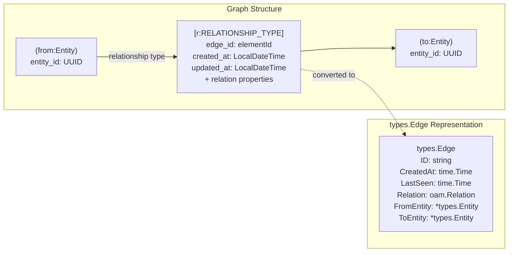
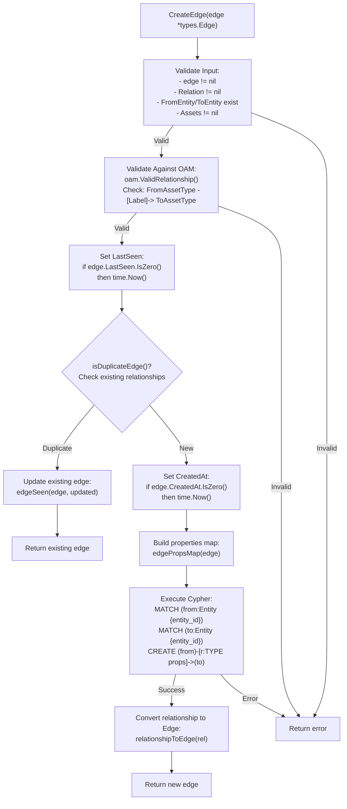
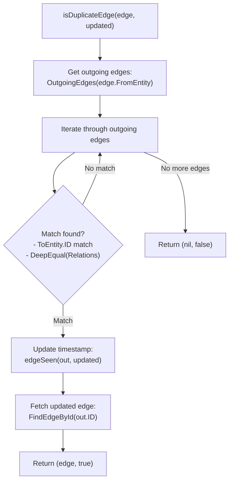
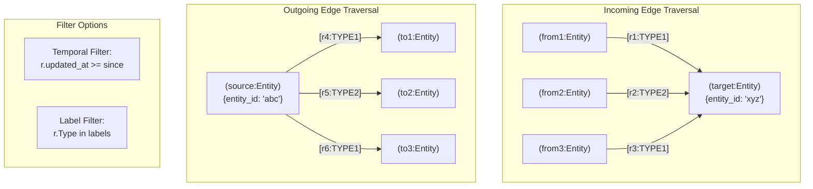
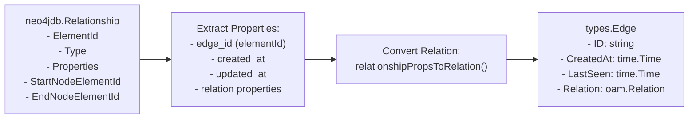

# Neo4j Edge Operations


This document describes the edge (relationship) operations in the Neo4j repository implementation. Edges represent directed relationships between entities in the graph database, enabling traversal and querying of asset connections. For entity-level operations, see [Neo4j Entity Operations](#5.1). For tag management on edges, see [Neo4j Tag Management](#5.3).

## Overview

The Neo4j repository stores edges as native graph relationships in Neo4j, using relationship types derived from the Open Asset Model. Each edge connects two entity nodes and includes temporal metadata (creation time, last seen) along with relationship-specific properties.

**Key Features:**
- Relationship validation against OAM taxonomy
- Duplicate edge detection and timestamp updates
- Bidirectional edge traversal (incoming/outgoing)
- Temporal filtering with `since` parameter
- Label-based filtering for relationship types
- Native Cypher query execution


---

## Edge Data Model

Edges in Neo4j are represented as relationships between entity nodes. The relationship type corresponds to the OAM relation label (e.g., `DNS_RECORD`, `NODE`, `SIMPLE_RELATION`).



**Sources:** , [types/types.go]()

---

## Edge Creation

### Validation and Creation Flow

The `CreateEdge` method performs comprehensive validation before creating relationships in the graph database.




### Implementation Details

#### Input Validation

The method first validates all required fields:

```
Validation checks (edge.go:24-27):
- edge != nil
- edge.Relation != nil
- edge.FromEntity != nil && edge.FromEntity.Asset != nil
- edge.ToEntity != nil && edge.ToEntity.Asset != nil
```


#### OAM Taxonomy Validation

The relationship must be valid according to the Open Asset Model taxonomy:

```
oam.ValidRelationship(
    edge.FromEntity.Asset.AssetType(),
    edge.Relation.Label(),
    edge.Relation.RelationType(),
    edge.ToEntity.Asset.AssetType()
)
```

Returns error if invalid: `"{FromType} -{Label}-> {ToType} is not valid in the taxonomy"`


#### Cypher Query Construction

The relationship is created using a three-part Cypher query:

```
MATCH (from:Entity {entity_id: '{fromID}'})
MATCH (to:Entity {entity_id: '{toID}'})
CREATE (from)-[r:RELATIONSHIP_TYPE $props]->(to)
RETURN r
```

The relationship type is uppercased from the relation label (e.g., `dns_record` → `DNS_RECORD`).


---

## Duplicate Edge Handling

### Duplicate Detection Logic

The `isDuplicateEdge` method prevents duplicate relationships between the same entities with identical relation content.



**Duplicate Criteria:**
1. Same `ToEntity.ID`
2. `reflect.DeepEqual(edge.Relation, out.Relation)` returns true


### Timestamp Update

When a duplicate is detected, the `edgeSeen` method updates the `updated_at` timestamp:

```
Cypher query (edge.go:117):
MATCH ()-[r]->() 
WHERE elementId(r) = $eid 
SET r.updated_at = localDateTime('{timestamp}')
```


---

## Edge Retrieval

### Find Edge By ID

The `FindEdgeById` method retrieves a specific edge using its Neo4j element ID:

```
MATCH (from:Entity)-[r]->(to:Entity) 
WHERE elementId(r) = $eid 
RETURN r, from.entity_id AS fid, to.entity_id AS tid
```

**Returns:**
- `types.Edge` with populated `FromEntity.ID` and `ToEntity.ID`
- Error if edge not found


---

## Edge Traversal

### Incoming Edges

The `IncomingEdges` method finds all edges pointing to a specific entity:

**Method Signature:**
```
IncomingEdges(entity *types.Entity, since time.Time, labels ...string) ([]*types.Edge, error)
```

**Cypher Queries:**

| Condition | Query Pattern |
|-----------|---------------|
| No temporal filter | `MATCH (:Entity {entity_id: $eid})<-[r]-(from:Entity) RETURN r, from.entity_id AS fid` |
| With `since` filter | `MATCH (:Entity {entity_id: $eid})<-[r]-(from:Entity) WHERE r.updated_at >= localDateTime('{since}') RETURN r, from.entity_id AS fid` |

**Label Filtering:**

After query execution, results are filtered by relationship type if labels are specified:

```
Post-processing (edge.go:214-227):
- If labels provided, check each relationship
- Compare r.Type against provided labels (case-insensitive)
- Only include matching relationships
```


### Outgoing Edges

The `OutgoingEdges` method finds all edges originating from a specific entity:

**Method Signature:**
```
OutgoingEdges(entity *types.Entity, since time.Time, labels ...string) ([]*types.Edge, error)
```

**Cypher Queries:**

| Condition | Query Pattern |
|-----------|---------------|
| No temporal filter | `MATCH (:Entity {entity_id: $eid})-[r]->(to:Entity) RETURN r, to.entity_id AS tid` |
| With `since` filter | `MATCH (:Entity {entity_id: $eid})-[r]->(to:Entity) WHERE r.updated_at >= localDateTime('{since}') RETURN r, to.entity_id AS tid` |

**Label Filtering:**

Identical to incoming edges, with post-processing label filtering.


### Traversal Patterns




---

## Edge Deletion

The `DeleteEdge` method removes a relationship from the graph:

**Cypher Query:**
```
MATCH ()-[r]->() 
WHERE elementId(r) = $eid 
DELETE r
```

**Note:** This only deletes the relationship; entity nodes remain intact.


---

## Data Conversion

### Relationship to Edge Conversion

The Neo4j driver returns relationships as `neo4jdb.Relationship` objects, which must be converted to `types.Edge`:



**Key Functions:**

| Function | Purpose | Location |
|----------|---------|----------|
| `relationshipToEdge` | Converts Neo4j relationship to `types.Edge` | [repository/neo4j/extract_edge.go]() |
| `relationshipPropsToRelation` | Extracts OAM relation from relationship properties | [repository/neo4j/extract_edge.go]() |
| `edgePropsMap` | Creates property map for relationship creation | [repository/neo4j/property_edge.go]() |


---

## Testing

The Neo4j edge operations include comprehensive integration tests:

| Test | Description | File Reference |
|------|-------------|----------------|
| `TestCreateEdge` | Tests edge creation, validation, and duplicate handling |  |
| `TestFindEdgeById` | Tests edge retrieval by ID |  |
| `TestIncomingEdges` | Tests incoming edge traversal and filtering |  |
| `TestOutgoingEdges` | Tests outgoing edge traversal and filtering |  |
| `TestDeleteEdge` | Tests edge deletion |  |

**Test Scenarios:**
- Invalid label validation
- Duplicate edge detection with timestamp updates
- Temporal filtering with `since` parameter
- Label filtering with multiple relationship types
- Edge deletion and verification


---

## Error Handling

The edge operations return errors in the following scenarios:

| Error Condition | Error Message | Method |
|----------------|---------------|---------|
| Null inputs | "failed input validation checks" | `CreateEdge` |
| Invalid OAM relationship | "{FromType} -{Label}-> {ToType} is not valid in the taxonomy" | `CreateEdge` |
| No records returned | "no records returned from the query" | `CreateEdge` |
| Nil relationship | "the record value for the relationship is nil" | `CreateEdge`, `FindEdgeById` |
| Edge not found | "no edge was found" | `FindEdgeById` |
| Zero edges found | "zero edges found" | `IncomingEdges`, `OutgoingEdges` |


---

## Performance Considerations

### Indexes

The Neo4j schema includes indexes on relationship properties to optimize edge queries:

```
Edge-related indexes (schema.go):
- CREATE INDEX edgetag_range_index_edge_id 
  FOR (n:EdgeTag) ON (n.edge_id)
```

**Note:** Relationships do not support unique constraints or indexes on their properties in Neo4j. Performance is optimized through:
1. Entity node indexes on `entity_id`
2. Efficient Cypher query patterns
3. Label filtering in application layer when needed


### Query Optimization

**Best Practices:**
1. Use temporal filtering (`since` parameter) to limit result sets
2. Specify relationship labels to reduce post-processing
3. Index entity nodes for fast relationship endpoint lookups
4. Leverage Neo4j's native graph traversal algorithms
