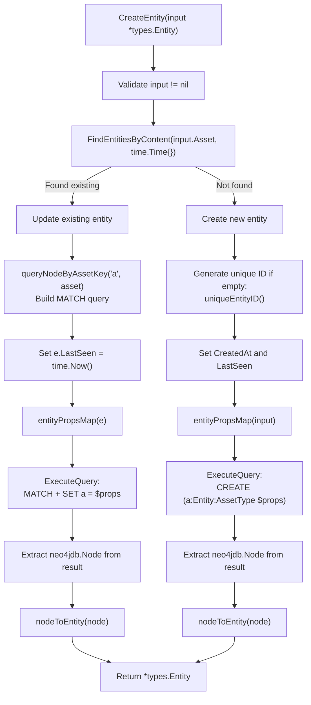
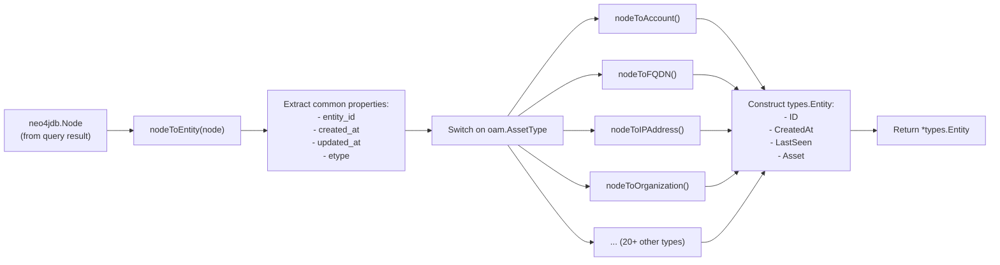
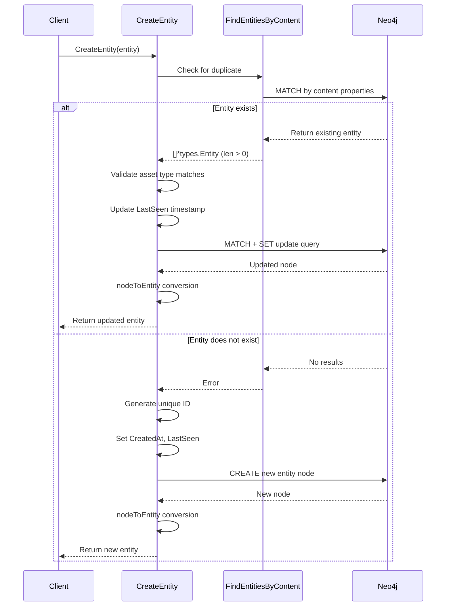

# Neo4j Entity Operations


This document describes entity management operations in the Neo4j graph database repository implementation. It covers creating, querying, updating, and deleting entity nodes, as well as the conversion between Neo4j nodes and the application's `types.Entity` structures.

For information about edge (relationship) operations, see [Neo4j Edge Operations](#5.2). For tag management, see [Neo4j Tag Management](#5.3). For schema constraints and indexes, see [Neo4j Schema and Constraints](#5.4).

---

## Overview of Entity Operations

The `neoRepository` provides five core entity operations that interact with Neo4j nodes labeled as `:Entity`:

| Operation | Method | Description |
|-----------|--------|-------------|
| Create | `CreateEntity(*types.Entity)` | Creates a new entity node or updates existing if duplicate detected |
| Create Asset | `CreateAsset(oam.Asset)` | Convenience wrapper for creating entity from asset |
| Find by ID | `FindEntityById(string)` | Retrieves entity by unique entity_id |
| Find by Content | `FindEntitiesByContent(oam.Asset, time.Time)` | Searches for entities matching asset content |
| Find by Type | `FindEntitiesByType(oam.AssetType, time.Time)` | Retrieves all entities of a specific asset type |
| Delete | `DeleteEntity(string)` | Removes entity node and its relationships |


---

## Entity Creation Flow

The `CreateEntity` method implements a duplicate-prevention mechanism by first checking if an entity with matching content already exists.

### CreateEntity Process Diagram




### Key Implementation Details

The `CreateEntity` method performs the following steps:

1. **Duplicate Detection** : Calls `FindEntitiesByContent` to check if an entity with the same asset content exists
2. **Update Path** : If duplicate found:
   - Validates asset types match 
   - Builds Cypher `MATCH` query using `queryNodeByAssetKey` 
   - Updates `LastSeen` timestamp 
   - Executes `SET` query to update node properties 
3. **Create Path** : If new entity:
   - Generates unique ID using `uniqueEntityID()` 
   - Sets `CreatedAt` and `LastSeen` timestamps 
   - Executes `CREATE` query with entity type label 

The method uses `neo4jdb.ExecuteQuery` with a 30-second timeout context [repository/neo4j/entity.go:48-49, 91-92]().


---

## Query Operations

### FindEntityById

Retrieves a single entity by its unique `entity_id` property:

```cypher
MATCH (a:Entity {entity_id: $eid}) RETURN a
```

**Implementation:** 

### FindEntitiesByContent

Searches for entities matching specific asset content. Constructs a `MATCH` query using `queryNodeByAssetKey` to match on asset-specific properties:

```cypher
MATCH (a:AssetType {key_property: value}) WHERE a.updated_at >= localDateTime('...') RETURN a
```

The `since` parameter filters entities by their `updated_at` timestamp. If `since.IsZero()`, no time filter is applied .

**Implementation:** 

### FindEntitiesByType

Retrieves all entities of a specific asset type using the asset type as a node label:

```cypher
MATCH (a:FQDN) WHERE a.updated_at >= localDateTime('...') RETURN a
```

Returns a slice of `[]*types.Entity` by iterating through all matching records .

**Implementation:** 

### DeleteEntity

Removes an entity and all its relationships using `DETACH DELETE`:

```cypher
MATCH (n:Entity {entity_id: $eid}) DETACH DELETE n
```

The `DETACH` clause ensures all incoming and outgoing relationships are deleted first .

**Implementation:** 


---

## Node to Entity Conversion

### Conversion Architecture




### nodeToEntity Dispatcher

The `nodeToEntity` function  extracts common entity properties and dispatches to type-specific converters:

1. **Extract Common Properties:**
   - `entity_id` (string) 
   - `created_at` (neo4jdb.LocalDateTime) 
   - `updated_at` (neo4jdb.LocalDateTime) 
   - `etype` (asset type string) 

2. **Dispatch by Asset Type:** Uses a switch statement on `oam.AssetType`  to call the appropriate converter function

3. **Construct Entity:** Returns `types.Entity` with populated fields 


---

## Supported Asset Types

The following table lists all supported asset types and their conversion functions:

| Asset Type | Converter Function | Key Properties | Lines |
|------------|-------------------|----------------|-------|
| `Account` | `nodeToAccount` | unique_id, account_type, username, account_number, balance, active | [113-152]() |
| `AutnumRecord` | `nodeToAutnumRecord` | raw, number, handle, name, whois_server, created_date, updated_date, status | [154-211]() |
| `AutonomousSystem` | `nodeToAutonomousSystem` | number | [213-221]() |
| `ContactRecord` | `nodeToContactRecord` | discovered_at | [223-230]() |
| `DomainRecord` | `nodeToDomainRecord` | raw, id, domain, punycode, name, extension, whois_server, dates, status, dnssec | [232-312]() |
| `File` | `nodeToFile` | url, name, type | [314-335]() |
| `FQDN` | `nodeToFQDN` | name | [337-344]() |
| `FundsTransfer` | `nodeToFundsTransfer` | unique_id, amount, reference_number, currency, transfer_method, exchange_date, exchange_rate | [346-391]() |
| `Identifier` | `nodeToIdentifier` | unique_id, entity_id, id_type, category, dates, status | [393-444]() |
| `IPAddress` | `nodeToIPAddress` | address (parsed as netip.Addr), type | [446-466]() |
| `IPNetRecord` | `nodeToIPNetRecord` | raw, cidr (netip.Prefix), handle, start/end addresses, type, name, method, country, parent_handle, whois_server, dates, status | [468-575]() |
| `Location` | `nodeToLocation` | address, building, building_number, street_name, unit, po_box, city, locality, province, country, postal_code | [577-646]() |
| `Netblock` | `nodeToNetblock` | cidr (netip.Prefix), type | [648-668]() |
| `Organization` | `nodeToOrganization` | unique_id, name, legal_name, founding_date, industry, active, non_profit, num_of_employees | [670-722]() |
| `Person` | `nodeToPerson` | unique_id, full_name, first_name, middle_name, family_name, birth_date, gender | [724-769]() |
| `Phone` | `nodeToPhone` | type, raw, e164, country_abbrev, country_code, ext | [771-811]() |
| `Product` | `nodeToProduct` | unique_id, product_name, product_type, category, description, country_of_origin | [813-852]() |
| `ProductRelease` | `nodeToProductRelease` | name, release_date | [854-869]() |
| `Service` | `nodeToService` | unique_id, service_type, output, output_length | [871-899]() |
| `TLSCertificate` | `nodeToTLSCertificate` | version, serial_number, subject/issuer common names, not_before/after, key_usage, ext_key_usage, signature/public key algorithms, is_ca, crl_distribution_points, subject/authority key IDs | [901-1003]() |
| `URL` | `nodeToURL` | url, scheme, username, password, host, port, path, options, fragment | [1005-1063]() |


---

## Property Extraction Patterns

### String Properties

Most string properties use `neo4jdb.GetProperty[string]`:

```go
name, err := neo4jdb.GetProperty[string](node, "name")
if err != nil {
    return nil, err
}
```

**Example:** 

### Numeric Properties

Integer properties are extracted as `int64` and converted to `int`:

```go
num, err := neo4jdb.GetProperty[int64](node, "number")
if err != nil {
    return nil, err
}
number := int(num)
```

**Example:** 

### Network Address Properties

IP addresses and CIDR blocks use `netip` package types:

```go
ip, err := neo4jdb.GetProperty[string](node, "address")
if err != nil {
    return nil, err
}
addr, err := netip.ParseAddr(ip)
if err != nil {
    return nil, err
}
```

**Example:** 

### Array Properties

String arrays are extracted as `[]interface{}` and converted:

```go
list, err := neo4jdb.GetProperty[[]interface{}](node, "status")
if err != nil {
    return nil, err
}
var status []string
for _, s := range list {
    status = append(status, s.(string))
}
```

**Example:** 


---

## Duplicate Prevention Mechanism

### Duplicate Detection Flow




### Uniqueness Guarantees

The system prevents duplicates through two mechanisms:

1. **Application-Level Deduplication:** The `CreateEntity` method checks for existing entities before creating new ones 

2. **Database Constraints:** Neo4j unique constraints on content properties ensure database-level uniqueness. See schema initialization in  which creates constraints like:
   - `FQDN.name` must be unique 
   - `IPAddress.address` must be unique 
   - `Organization.unique_id` must be unique 


---

## Unique ID Generation

The `uniqueEntityID` function generates universally unique identifiers for entities:

```go
func (neo *neoRepository) uniqueEntityID() string {
    for {
        id := uuid.New().String()
        if _, err := neo.FindEntityById(id); err != nil {
            return id
        }
    }
}
```

This implementation:
1. Generates a UUID v4 using `google/uuid` package
2. Verifies uniqueness by attempting to find an entity with that ID
3. Loops until a unique ID is found (collision is extremely unlikely with UUID v4)


---

## Test Coverage

The entity operations are validated through integration tests in . Key test scenarios include:

| Test | Coverage | Lines |
|------|----------|-------|
| `TestCreateEntity` | Duplicate prevention, timestamp handling | [23-67]() |
| `TestFindEntityById` | ID-based retrieval | [69-88]() |
| `TestFindEntitiesByContent` | Content-based search, time filtering | [90-114]() |
| `TestFindEntitiesByType` | Type-based queries with time filters | [116-148]() |
| `TestDeleteEntity` | Entity deletion | [150-163]() |

Tests verify:
- Duplicate entities are not created 
- `LastSeen` timestamps are updated on duplicates 
- `CreatedAt` remains unchanged for duplicates 
- Content-based queries respect `since` parameter 
- Type-based queries return multiple entities
