# Triples Query Language

The **Triples Query Language** allows users of the OWASP Amass framework to request data from the Asset Database using the **OWASP Open Asset Model**. This query language enables traversals across the graph, where each triple describes a directed edge between two nodes.

A **triple** is a traversal path that describes a step in a graph walk, or a "hop" in your graph between two nodes. Each triple consists of a **subject**, a **predicate**, and an **object**. The subject is the node being queried, the predicate describes the relationship, and the object is the target node. Results from the previous triple can serve as subjects for subsequent triples, enabling complex queries across the graph.

## Syntax Overview

A single **triple** follows the format for outgoing relations from the subject:

```
<subject> - <predicate> -> <object>
```

Or, the arrow pointing in the other direction for incoming relations to the subject:

```
<subject> <- <predicate> - <object>
```

- **Subject**: The starting node of the traversal.
- **Predicate**: Describes the relationship.
- **Object**: The ending node of the traversal.

### Components of a Triple

Each node and predicate in the triple has the following format:

```
<type:label,since:DATE,prop:[type:label,atrribute:value]>

<ipaddress:#/72.*/#,prop:[sourceproperty:DNS-IP,since:2025-07-01,confidence:80]>
```

Here is an example of 

- **type**: The type of the node (e.g., `fqdn` or `ipaddress`).
- **label**: The specific value associated with the node (e.g. `dns_record`).
- **since**: An optional filter specifying a date to limit results after a certain point.
- **prop**: Optional properties for the node, such as additional attributes or metadata.
- **attributes**: Optional fields from the data type used for filtering (e.g. `header.rr_type:#/1|28/#`).

### Supported Query Elements

- **Constant Values**: Specific, static values for filtering (e.g., `fqdn:owasp.org`).
- **Wildcard ('*')**: A wildcard character that can match any value (e.g., `ipaddress:*`).
- **Regular Expressions ('#//#')**: A regular expression for more specific filtering (e.g. `#/.*google.*/#`).

## Example Queries

### 1. From Root Domain Name to IP Addresses

This query retrieves all IP addresses associated with the root domain name `owasp.org`, starting from the domain and considering DNS records since July 1st, 2025.

```
<fqdn:owasp.org> - <*:dns_record,since:2025-07-01> -> <ipaddress:*>
```

- **Subject**: `<fqdn:owasp.org>`
- **Predicate**: `<*:dns_record,since:2025-07-01>`
- **Object**: `<ipaddress:*>`

### 2. Root Domain Name to Subdomains

This query retrieves all subdomains of the root domain `owasp.org`, starting from the domain and considering the relationship to nodes since July 1st, 2025.

```
<fqdn:owasp.org> - <*:node,since:2025-07-01> -> <*>
```

- **Subject**: `<fqdn:owasp.org>`
- **Predicate**: `<*:node,since:2025-07-01>`
- **Object**: `<*>`

The object can simply specify the wildcard character, since the 'node' relation outcoming from an FQDN must connect with another FQDN.

### 3. Subdomain to IP Address

This query retrieves IP addresses for all subdomain names (e.g. `subdomain.owasp.org`), acquired from a previous triple, and their DNS records since July 1st, 2025.

```
<fqdn:#/.*owasp.org/#> - <*:dns_record,since:2025-07-01> -> <ipaddress:*>
```

- **Subject**: `<fqdn:#/.*owasp.org/#>`
- **Predicate**: `<*:dns_record,since:2025-07-01>`
- **Object**: `<ipaddress:*>`

## Filtering with Regular Expressions

You can use regular expressions to filter the query results. For example, if you want to query IP addresses associated with domain names that match a specific pattern, you can use:

```
<fqdn:google.com> - <*:dns_record> -> <ipaddress:#/192.168.*/#>
```

- **Subject**: `<fqdn:google.com>`
- **Predicate**: `<*:dns_record>`
- **Object**: `<ipaddress:#/192.168.*/#>`

This query retrieves IP addresses for `google.com` where the IP address matches the `192.168.*` range.

## Traversing Multiple Steps

Triples allow for multiple traversals in a query. You can chain multiple triples to traverse from one node to another through various relationships. For example:

```
amass assoc -t1 '<fqdn:owasp.org> - <*:node> -> <*>' -t2 '<fqdn:*> - <*:dns_record> -> <ipaddress:*>'
```

Here, the first triple retrieves all nodes related to the root domain `owasp.org`, and the second triple retrieves IP addresses associated with those nodes. The entire walk that traverses all triples, and all related properties, is provided in the JSON output.

## Conclusion

The **Triples Query Language** is a powerful way to interact with the OWASP Asset Database and extract relevant data from the Open Asset Model. By using this language, users can perform flexible, precise queries to navigate the complex relationships between assets, making it a valuable tool for asset discovery and attack surface management.

## See Also

* [Asset Database](./index.md)
* [Setting Up PostgreSQL](./postgres.md)

## Neo4j Repository


The Neo4j Repository provides a graph database implementation of the Repository interface, enabling asset storage and retrieval using Neo4j's native graph data model. This implementation leverages Neo4j's Cypher query language and graph traversal capabilities to efficiently manage entities, edges, and their associated tags.

This page covers the Neo4j repository architecture, connection management, data model mapping, and query patterns. For detailed operation-level documentation, see:
- Entity operations: [Neo4j Entity Operations](./triples.md#neo4j-entity-operations)
- Edge operations: [Neo4j Edge Operations](./triples.md#neo4j-edge-operations)
- Tag operations: [Neo4j Tag Management](./triples.md#neo4j-tag-management)
- Schema and constraints: [Neo4j Schema and Constraints](./triples.md#neo4j-schema-and-constraints)

For SQL-based implementations, see [SQL Repository](./postgres.md#sql-repository-implementation).

---

## Repository Implementation Structure

The `neoRepository` struct implements the `Repository` interface using the Neo4j Go Driver. It maintains a driver connection and database name for all operations.

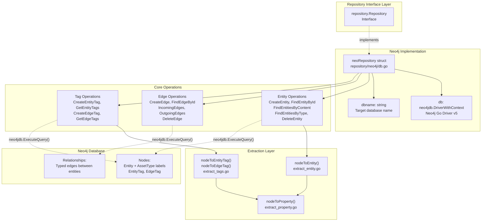

---

## Connection and Initialization

The `New()` function creates a `neoRepository` instance by parsing the DSN, establishing a driver connection, and verifying connectivity.

### DSN Format

The DSN format is: `neo4j://[username:password@]host[:port]/database`

### Connection Configuration

| Parameter | Value | Description |
|-----------|-------|-------------|
| `MaxConnectionPoolSize` | 20 | Maximum concurrent connections |
| `MaxConnectionLifetime` | 1 hour | Connection lifetime before refresh |
| `ConnectionLivenessCheckTimeout` | 10 minutes | Timeout for liveness checks |

```mermaid
sequenceDiagram
    participant Client
    participant New["New() function<br/>db.go:27-59"]
    participant URLParse["url.Parse()<br/>DSN parsing"]
    participant Driver["neo4jdb.NewDriverWithContext()<br/>Driver creation"]
    participant Verify["driver.VerifyConnectivity()<br/>Connection test"]
    participant Repo["neoRepository"]
    
    Client->>New: New(dbtype, dsn)
    New->>URLParse: Parse DSN
    URLParse-->>New: URL components
    New->>New: Extract auth credentials
    New->>New: Extract database name from path
    New->>Driver: Create driver with config
    Driver-->>New: neo4jdb.DriverWithContext
    New->>Verify: Test connectivity (5s timeout)
    alt Connection successful
        Verify-->>New: nil error
        New->>Repo: Create neoRepository
        Repo-->>Client: Return repository
    else Connection failed
        Verify-->>New: error
        New-->>Client: Return error
    end
```

---

## Entity-to-Node Mapping

Entities are stored as Neo4j nodes with dual labels: a base `Entity` label and an asset-specific type label (e.g., `FQDN`, `IPAddress`, `Organization`). All asset properties are flattened into node properties.

### Node Structure

Each entity node contains:
- **entity_id**: Unique identifier (constrained)
- **etype**: Asset type string
- **created_at**: Creation timestamp (LocalDateTime)
- **updated_at**: Last seen timestamp (LocalDateTime)
- **Asset-specific properties**: Flattened from OAM asset structure

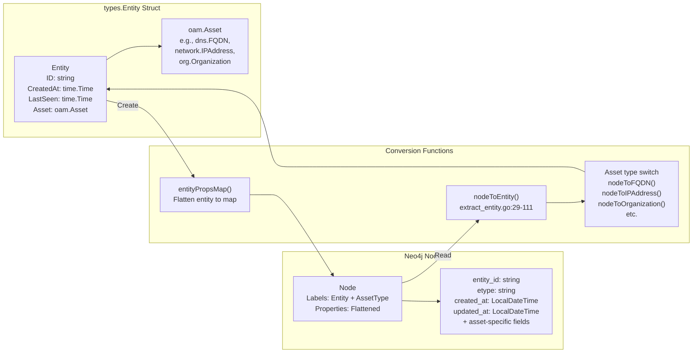

### Supported Asset Types

The `nodeToEntity()` function supports conversion for all OAM asset types:

| Asset Type | Converter Function | Unique Key Property |
|------------|-------------------|---------------------|
| `Account` | `nodeToAccount()` | `unique_id` |
| `AutnumRecord` | `nodeToAutnumRecord()` | `handle`, `number` |
| `AutonomousSystem` | `nodeToAutonomousSystem()` | `number` |
| `ContactRecord` | `nodeToContactRecord()` | `discovered_at` |
| `DomainRecord` | `nodeToDomainRecord()` | `domain` |
| `File` | `nodeToFile()` | `url` |
| `FQDN` | `nodeToFQDN()` | `name` |
| `FundsTransfer` | `nodeToFundsTransfer()` | `unique_id` |
| `Identifier` | `nodeToIdentifier()` | `unique_id` |
| `IPAddress` | `nodeToIPAddress()` | `address` |
| `IPNetRecord` | `nodeToIPNetRecord()` | `handle` |
| `Location` | `nodeToLocation()` | `address` |
| `Netblock` | `nodeToNetblock()` | `cidr` |
| `Organization` | `nodeToOrganization()` | `unique_id` |
| `Person` | `nodeToPerson()` | `unique_id` |
| `Phone` | `nodeToPhone()` | `e164`, `raw` |
| `Product` | `nodeToProduct()` | `unique_id` |
| `ProductRelease` | `nodeToProductRelease()` | `name` |
| `Service` | `nodeToService()` | `unique_id` |
| `TLSCertificate` | `nodeToTLSCertificate()` | `serial_number` |
| `URL` | `nodeToURL()` | `url` |

---

## Cypher Query Patterns

The Neo4j repository uses standardized Cypher query patterns for consistency and performance.

### Entity Creation Pattern

```
CREATE (a:Entity:{AssetType} $props) RETURN a
```

Example for FQDN:
```cypher
CREATE (a:Entity:FQDN {
  entity_id: "uuid-here",
  etype: "FQDN",
  created_at: localdatetime(),
  updated_at: localdatetime(),
  name: "example.com"
}) RETURN a
```

### Entity Retrieval Patterns

| Operation | Cypher Pattern |
|-----------|---------------|
| By ID | `MATCH (a:Entity {entity_id: $eid}) RETURN a` |
| By Content | `MATCH (a:{AssetType} {key: value}) RETURN a` |
| By Type | `MATCH (a:{AssetType}) RETURN a` |
| By Type + Since | `MATCH (a:{AssetType}) WHERE a.updated_at >= localDateTime($since) RETURN a` |

### Entity Update Pattern

```cypher
MATCH (a:Entity {entity_id: $eid})
SET a = $props
RETURN a
```

### Entity Deletion Pattern

```cypher
MATCH (n:Entity {entity_id: $eid})
DETACH DELETE n
```

The `DETACH DELETE` ensures all relationships are removed before node deletion.

---

## Duplicate Prevention Strategy

The repository prevents duplicate entities by checking for existing entities before creation. When a duplicate is detected, the existing entity's `updated_at` timestamp is refreshed rather than creating a new node.

```mermaid
sequenceDiagram
    participant Client
    participant CreateEntity["CreateEntity()<br/>entity.go:23-124"]
    participant FindContent["FindEntitiesByContent()"]
    participant UpdateNode["MATCH + SET query"]
    participant CreateNode["CREATE query"]
    participant ExtractNode["nodeToEntity()"]
    
    Client->>CreateEntity: CreateEntity(input)
    CreateEntity->>FindContent: Check for existing entity
    alt Entity exists
        FindContent-->>CreateEntity: Existing entity found
        CreateEntity->>CreateEntity: Validate asset type match
        CreateEntity->>UpdateNode: Update existing node timestamp
        UpdateNode-->>CreateEntity: Updated node
        CreateEntity->>ExtractNode: Convert to Entity
        ExtractNode-->>Client: Return existing entity
    else Entity not found
        FindContent-->>CreateEntity: No entity found
        CreateEntity->>CreateEntity: Generate UUID if needed
        CreateEntity->>CreateEntity: Set timestamps
        CreateEntity->>CreateNode: CREATE new node
        CreateNode-->>CreateEntity: New node
        CreateEntity->>ExtractNode: Convert to Entity
        ExtractNode-->>Client: Return new entity
    end
```

---

## Time Handling

Neo4j uses `LocalDateTime` for timestamp storage, which doesn't include timezone information. The repository converts between Go's `time.Time` and Neo4j's `LocalDateTime` format.

### Conversion Functions

**Go Time to Neo4j Format:**
```go
func timeToNeo4jTime(t time.Time) string {
    return t.Format("2006-01-02T15:04:05")
}
```

**Neo4j Format to Go Time:**
```go
func neo4jTimeToTime(t neo4jdb.LocalDateTime) time.Time {
    return time.Date(
        t.Year(), time.Month(t.Month()), t.Day(),
        t.Hour(), t.Minute(), t.Second(),
        t.Nanosecond(), time.UTC,
    )
}
```

All timestamps are stored and compared in UTC.

---

## Property Extraction Pipeline

The property extraction pipeline converts Neo4j node properties back into typed Go structures. This is a multi-stage process that handles different property types.

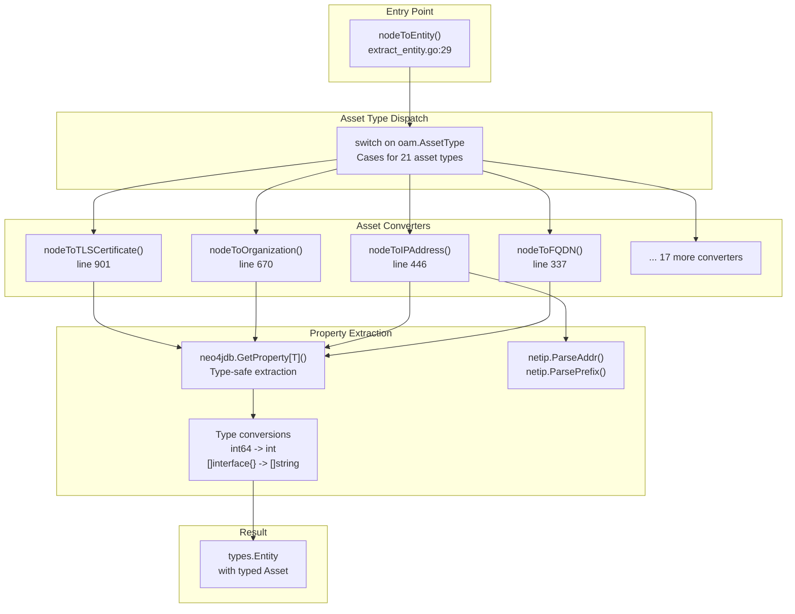

### Error Handling

Each property extraction uses `neo4jdb.GetProperty[T]()` which returns an error if:
- The property doesn't exist on the node
- The property type doesn't match the expected type `T`

All errors are propagated up the call stack, ensuring that malformed data is never silently ignored.

---

## Context and Timeout Management

All Neo4j operations use context-based timeouts for reliability. The standard timeout is 30 seconds for query execution.

```go
ctx, cancel := context.WithTimeout(context.Background(), 30*time.Second)
defer cancel()

result, err := neo4jdb.ExecuteQuery(ctx, neo.db, query, params,
    neo4jdb.EagerResultTransformer,
    neo4jdb.ExecuteQueryWithDatabase(neo.dbname))
```

This pattern ensures:
- Operations don't hang indefinitely
- Resources are properly released via `defer cancel()`
- Database-specific queries are routed correctly via `ExecuteQueryWithDatabase()`

---

## Database-Specific Query Execution

All queries specify the target database using `neo4jdb.ExecuteQueryWithDatabase(neo.dbname)`. This allows multi-database Neo4j deployments where different databases serve different purposes.

The database name is extracted from the DSN path during initialization:

```go
dbname := strings.TrimPrefix(u.Path, "/")
```

For example, DSN `neo4j://localhost:7687/assetdb` results in `dbname = "assetdb"`.

---

## Summary

The Neo4j Repository implementation provides:

| Feature | Implementation |
|---------|----------------|
| **Connection Management** | Neo4j Go Driver v5 with connection pooling |
| **Data Model** | Dual-labeled nodes (Entity + AssetType) with flattened properties |
| **Query Language** | Cypher with parameterized queries |
| **Duplicate Prevention** | Content-based lookup before creation |
| **Type Safety** | Type-safe property extraction with error handling |
| **Timeout Management** | 30-second context-based timeouts |
| **Asset Type Support** | All 21 OAM asset types |
| **Schema Management** | Constraints and indexes for performance (see [Neo4j Schema and Constraints](./triples.md#neo4j-schema-and-constraints)) |

The implementation leverages Neo4j's native graph capabilities while maintaining compatibility with the unified Repository interface, enabling seamless database backend switching.

### Neo4j Entity Operations

This document describes entity management operations in the Neo4j graph database repository implementation. It covers creating, querying, updating, and deleting entity nodes, as well as the conversion between Neo4j nodes and the application's `types.Entity` structures.

For information about edge (relationship) operations, see [Neo4j Edge Operations](./triples.md#neo4j-edge-operations). For tag management, see [Neo4j Tag Management](./triples.md#neo4j-tag-management). For schema constraints and indexes, see [Neo4j Schema and Constraints](./triples.md#neo4j-schema-and-constraints).

---

### Overview of Entity Operations

The `neoRepository` provides five core entity operations that interact with Neo4j nodes labeled as `:Entity`:

| Operation | Method | Description |
|-----------|--------|-------------|
| Create | `CreateEntity(*types.Entity)` | Creates a new entity node or updates existing if duplicate detected |
| Create Asset | `CreateAsset(oam.Asset)` | Convenience wrapper for creating entity from asset |
| Find by ID | `FindEntityById(string)` | Retrieves entity by unique entity_id |
| Find by Content | `FindEntitiesByContent(oam.Asset, time.Time)` | Searches for entities matching asset content |
| Find by Type | `FindEntitiesByType(oam.AssetType, time.Time)` | Retrieves all entities of a specific asset type |
| Delete | `DeleteEntity(string)` | Removes entity node and its relationships |

---

### Entity Creation Flow

The `CreateEntity` method implements a duplicate-prevention mechanism by first checking if an entity with matching content already exists.

#### CreateEntity Process Diagram

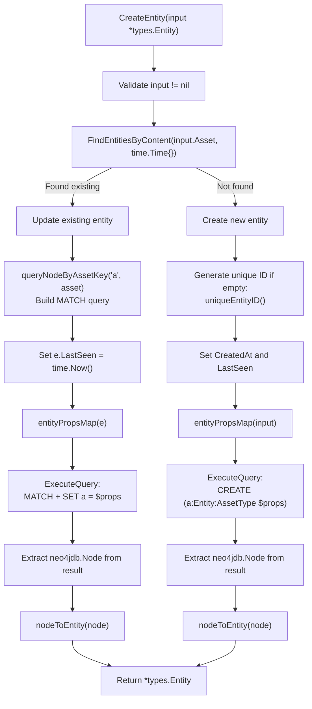

#### Key Implementation Details

The `CreateEntity` method performs the following steps:

1. **Duplicate Detection** : Calls `FindEntitiesByContent` to check if an entity with the same asset content exists
2. **Update Path** : If duplicate found:
   - Validates asset types match 
   - Builds Cypher `MATCH` query using `queryNodeByAssetKey` 
   - Updates `LastSeen` timestamp 
   - Executes `SET` query to update node properties 
3. **Create Path** : If new entity:
   - Generates unique ID using `uniqueEntityID()` 
   - Sets `CreatedAt` and `LastSeen` timestamps 
   - Executes `CREATE` query with entity type label 

The method uses `neo4jdb.ExecuteQuery` with a 30-second timeout context .

---

### Query Operations

#### FindEntityById

Retrieves a single entity by its unique `entity_id` property:

```cypher
MATCH (a:Entity {entity_id: $eid}) RETURN a
```

**Implementation:** 

#### FindEntitiesByContent

Searches for entities matching specific asset content. Constructs a `MATCH` query using `queryNodeByAssetKey` to match on asset-specific properties:

```cypher
MATCH (a:AssetType {key_property: value}) WHERE a.updated_at >= localDateTime('...') RETURN a
```

The `since` parameter filters entities by their `updated_at` timestamp. If `since.IsZero()`, no time filter is applied .

**Implementation:** 

#### FindEntitiesByType

Retrieves all entities of a specific asset type using the asset type as a node label:

```cypher
MATCH (a:FQDN) WHERE a.updated_at >= localDateTime('...') RETURN a
```

Returns a slice of `[]*types.Entity` by iterating through all matching records .

**Implementation:** 

#### DeleteEntity

Removes an entity and all its relationships using `DETACH DELETE`:

```cypher
MATCH (n:Entity {entity_id: $eid}) DETACH DELETE n
```

The `DETACH` clause ensures all incoming and outgoing relationships are deleted first .

**Implementation:** 

---

### Node to Entity Conversion

#### Conversion Architecture

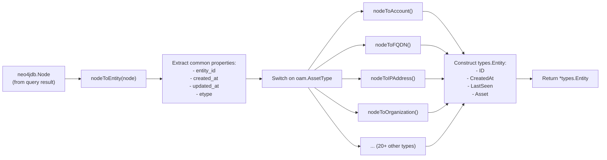

#### nodeToEntity Dispatcher

The `nodeToEntity` function  extracts common entity properties and dispatches to type-specific converters:

1. **Extract Common Properties:**
   - `entity_id` (string) 
   - `created_at` (neo4jdb.LocalDateTime) 
   - `updated_at` (neo4jdb.LocalDateTime) 
   - `etype` (asset type string) 

2. **Dispatch by Asset Type:** Uses a switch statement on `oam.AssetType`  to call the appropriate converter function

3. **Construct Entity:** Returns `types.Entity` with populated fields 

---

### Supported Asset Types

The following table lists all supported asset types and their conversion functions:

| Asset Type | Converter Function | Key Properties | Lines |
|------------|-------------------|----------------|-------|
| `Account` | `nodeToAccount` | unique_id, account_type, username, account_number, balance, active | [113-152]() |
| `AutnumRecord` | `nodeToAutnumRecord` | raw, number, handle, name, whois_server, created_date, updated_date, status | [154-211]() |
| `AutonomousSystem` | `nodeToAutonomousSystem` | number | [213-221]() |
| `ContactRecord` | `nodeToContactRecord` | discovered_at | [223-230]() |
| `DomainRecord` | `nodeToDomainRecord` | raw, id, domain, punycode, name, extension, whois_server, dates, status, dnssec | [232-312]() |
| `File` | `nodeToFile` | url, name, type | [314-335]() |
| `FQDN` | `nodeToFQDN` | name | [337-344]() |
| `FundsTransfer` | `nodeToFundsTransfer` | unique_id, amount, reference_number, currency, transfer_method, exchange_date, exchange_rate | [346-391]() |
| `Identifier` | `nodeToIdentifier` | unique_id, entity_id, id_type, category, dates, status | [393-444]() |
| `IPAddress` | `nodeToIPAddress` | address (parsed as netip.Addr), type | [446-466]() |
| `IPNetRecord` | `nodeToIPNetRecord` | raw, cidr (netip.Prefix), handle, start/end addresses, type, name, method, country, parent_handle, whois_server, dates, status | [468-575]() |
| `Location` | `nodeToLocation` | address, building, building_number, street_name, unit, po_box, city, locality, province, country, postal_code | [577-646]() |
| `Netblock` | `nodeToNetblock` | cidr (netip.Prefix), type | [648-668]() |
| `Organization` | `nodeToOrganization` | unique_id, name, legal_name, founding_date, industry, active, non_profit, num_of_employees | [670-722]() |
| `Person` | `nodeToPerson` | unique_id, full_name, first_name, middle_name, family_name, birth_date, gender | [724-769]() |
| `Phone` | `nodeToPhone` | type, raw, e164, country_abbrev, country_code, ext | [771-811]() |
| `Product` | `nodeToProduct` | unique_id, product_name, product_type, category, description, country_of_origin | [813-852]() |
| `ProductRelease` | `nodeToProductRelease` | name, release_date | [854-869]() |
| `Service` | `nodeToService` | unique_id, service_type, output, output_length | [871-899]() |
| `TLSCertificate` | `nodeToTLSCertificate` | version, serial_number, subject/issuer common names, not_before/after, key_usage, ext_key_usage, signature/public key algorithms, is_ca, crl_distribution_points, subject/authority key IDs | [901-1003]() |
| `URL` | `nodeToURL` | url, scheme, username, password, host, port, path, options, fragment | [1005-1063]() |

---

### Property Extraction Patterns

#### String Properties

Most string properties use `neo4jdb.GetProperty[string]`:

```go
name, err := neo4jdb.GetProperty[string](node, "name")
if err != nil {
    return nil, err
}
```

**Example:** 

#### Numeric Properties

Integer properties are extracted as `int64` and converted to `int`:

```go
num, err := neo4jdb.GetProperty[int64](node, "number")
if err != nil {
    return nil, err
}
number := int(num)
```

**Example:** 

#### Network Address Properties

IP addresses and CIDR blocks use `netip` package types:

```go
ip, err := neo4jdb.GetProperty[string](node, "address")
if err != nil {
    return nil, err
}
addr, err := netip.ParseAddr(ip)
if err != nil {
    return nil, err
}
```

**Example:** 

#### Array Properties

String arrays are extracted as `[]interface{}` and converted:

```go
list, err := neo4jdb.GetProperty[[]interface{}](node, "status")
if err != nil {
    return nil, err
}
var status []string
for _, s := range list {
    status = append(status, s.(string))
}
```

**Example:** 

---

### Duplicate Prevention Mechanism

#### Duplicate Detection Flow

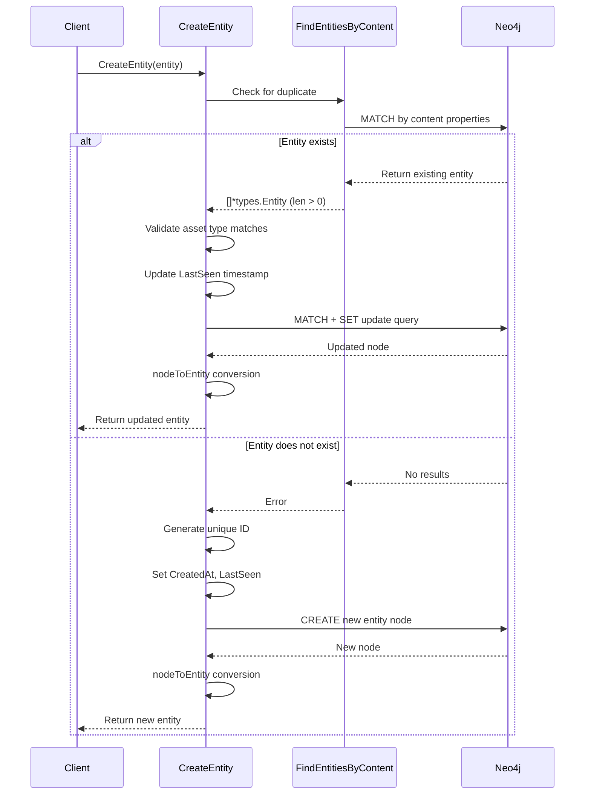

#### Uniqueness Guarantees

The system prevents duplicates through two mechanisms:

1. **Application-Level Deduplication:** The `CreateEntity` method checks for existing entities before creating new ones 

2. **Database Constraints:** Neo4j unique constraints on content properties ensure database-level uniqueness. See schema initialization in  which creates constraints like:
   - `FQDN.name` must be unique 
   - `IPAddress.address` must be unique 
   - `Organization.unique_id` must be unique 

---

### Unique ID Generation

The `uniqueEntityID` function generates universally unique identifiers for entities:

```go
func (neo *neoRepository) uniqueEntityID() string {
    for {
        id := uuid.New().String()
        if _, err := neo.FindEntityById(id); err != nil {
            return id
        }
    }
}
```

This implementation:
1. Generates a UUID v4 using `google/uuid` package
2. Verifies uniqueness by attempting to find an entity with that ID
3. Loops until a unique ID is found (collision is extremely unlikely with UUID v4)

---

### Test Coverage

The entity operations are validated through integration tests in . Key test scenarios include:

| Test | Coverage | Lines |
|------|----------|-------|
| `TestCreateEntity` | Duplicate prevention, timestamp handling | [23-67]() |
| `TestFindEntityById` | ID-based retrieval | [69-88]() |
| `TestFindEntitiesByContent` | Content-based search, time filtering | [90-114]() |
| `TestFindEntitiesByType` | Type-based queries with time filters | [116-148]() |
| `TestDeleteEntity` | Entity deletion | [150-163]() |

Tests verify:
- Duplicate entities are not created 
- `LastSeen` timestamps are updated on duplicates 
- `CreatedAt` remains unchanged for duplicates 
- Content-based queries respect `since` parameter 
- Type-based queries return multiple entities

### Neo4j Edge Operations

This document describes the edge (relationship) operations in the Neo4j repository implementation. Edges represent directed relationships between entities in the graph database, enabling traversal and querying of asset connections. For entity-level operations, see [Neo4j Entity Operations](./triples.md#neo4j-entity-operations). For tag management on edges, see [Neo4j Tag Management](./triples.md#neo4j-tag-management).

### Overview

The Neo4j repository stores edges as native graph relationships in Neo4j, using relationship types derived from the Open Asset Model. Each edge connects two entity nodes and includes temporal metadata (creation time, last seen) along with relationship-specific properties.

**Key Features:**
- Relationship validation against OAM taxonomy
- Duplicate edge detection and timestamp updates
- Bidirectional edge traversal (incoming/outgoing)
- Temporal filtering with `since` parameter
- Label-based filtering for relationship types
- Native Cypher query execution

---

### Edge Data Model

Edges in Neo4j are represented as relationships between entity nodes. The relationship type corresponds to the OAM relation label (e.g., `DNS_RECORD`, `NODE`, `SIMPLE_RELATION`).

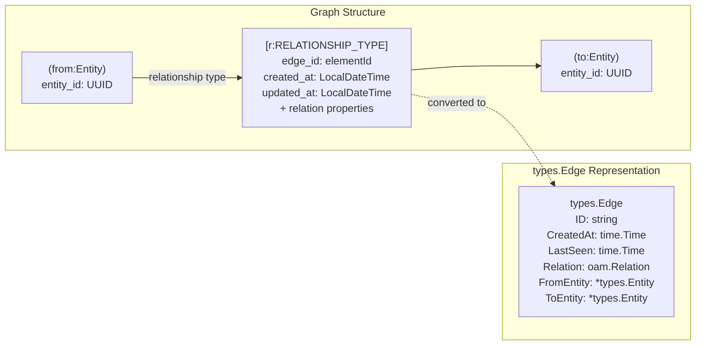

---

### Edge Creation

#### Validation and Creation Flow

The `CreateEdge` method performs comprehensive validation before creating relationships in the graph database.

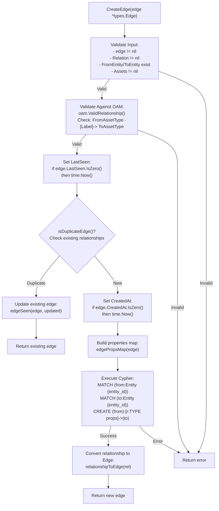

#### Implementation Details

##### Input Validation

The method first validates all required fields:

```
Validation checks (edge.go:24-27):
- edge != nil
- edge.Relation != nil
- edge.FromEntity != nil && edge.FromEntity.Asset != nil
- edge.ToEntity != nil && edge.ToEntity.Asset != nil
```

##### OAM Taxonomy Validation

The relationship must be valid according to the Open Asset Model taxonomy:

```
oam.ValidRelationship(
    edge.FromEntity.Asset.AssetType(),
    edge.Relation.Label(),
    edge.Relation.RelationType(),
    edge.ToEntity.Asset.AssetType()
)
```

Returns error if invalid: `"{FromType} -{Label}-> {ToType} is not valid in the taxonomy"`

##### Cypher Query Construction

The relationship is created using a three-part Cypher query:

```
MATCH (from:Entity {entity_id: '{fromID}'})
MATCH (to:Entity {entity_id: '{toID}'})
CREATE (from)-[r:RELATIONSHIP_TYPE $props]->(to)
RETURN r
```

The relationship type is uppercased from the relation label (e.g., `dns_record` → `DNS_RECORD`).

---

### Duplicate Edge Handling

#### Duplicate Detection Logic

The `isDuplicateEdge` method prevents duplicate relationships between the same entities with identical relation content.

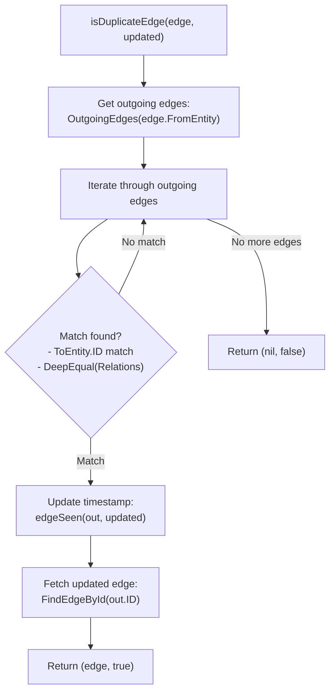

**Duplicate Criteria:**
1. Same `ToEntity.ID`
2. `reflect.DeepEqual(edge.Relation, out.Relation)` returns true

#### Timestamp Update

When a duplicate is detected, the `edgeSeen` method updates the `updated_at` timestamp:

```
Cypher query (edge.go:117):
MATCH ()-[r]->() 
WHERE elementId(r) = $eid 
SET r.updated_at = localDateTime('{timestamp}')
```

---

### Edge Retrieval

#### Find Edge By ID

The `FindEdgeById` method retrieves a specific edge using its Neo4j element ID:

```
MATCH (from:Entity)-[r]->(to:Entity) 
WHERE elementId(r) = $eid 
RETURN r, from.entity_id AS fid, to.entity_id AS tid
```

**Returns:**
- `types.Edge` with populated `FromEntity.ID` and `ToEntity.ID`
- Error if edge not found

---

### Edge Traversal

#### Incoming Edges

The `IncomingEdges` method finds all edges pointing to a specific entity:

**Method Signature:**
```
IncomingEdges(entity *types.Entity, since time.Time, labels ...string) ([]*types.Edge, error)
```

**Cypher Queries:**

| Condition | Query Pattern |
|-----------|---------------|
| No temporal filter | `MATCH (:Entity {entity_id: $eid})<-[r]-(from:Entity) RETURN r, from.entity_id AS fid` |
| With `since` filter | `MATCH (:Entity {entity_id: $eid})<-[r]-(from:Entity) WHERE r.updated_at >= localDateTime('{since}') RETURN r, from.entity_id AS fid` |

**Label Filtering:**

After query execution, results are filtered by relationship type if labels are specified:

```
Post-processing (edge.go:214-227):
- If labels provided, check each relationship
- Compare r.Type against provided labels (case-insensitive)
- Only include matching relationships
```

#### Outgoing Edges

The `OutgoingEdges` method finds all edges originating from a specific entity:

**Method Signature:**
```
OutgoingEdges(entity *types.Entity, since time.Time, labels ...string) ([]*types.Edge, error)
```

**Cypher Queries:**

| Condition | Query Pattern |
|-----------|---------------|
| No temporal filter | `MATCH (:Entity {entity_id: $eid})-[r]->(to:Entity) RETURN r, to.entity_id AS tid` |
| With `since` filter | `MATCH (:Entity {entity_id: $eid})-[r]->(to:Entity) WHERE r.updated_at >= localDateTime('{since}') RETURN r, to.entity_id AS tid` |

**Label Filtering:**

Identical to incoming edges, with post-processing label filtering.

#### Traversal Patterns

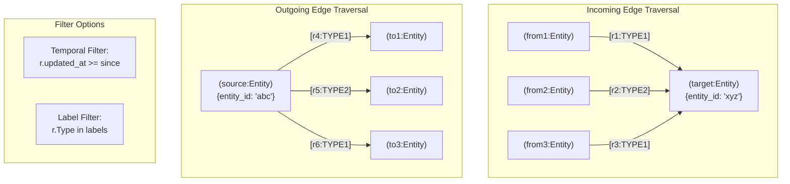

---

### Edge Deletion

The `DeleteEdge` method removes a relationship from the graph:

**Cypher Query:**
```
MATCH ()-[r]->() 
WHERE elementId(r) = $eid 
DELETE r
```

**Note:** This only deletes the relationship; entity nodes remain intact.

---

### Data Conversion

#### Relationship to Edge Conversion

The Neo4j driver returns relationships as `neo4jdb.Relationship` objects, which must be converted to `types.Edge`:

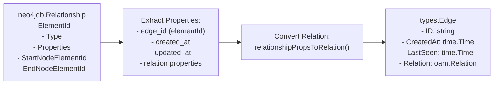

**Key Functions:**

| Function | Purpose | Location |
|----------|---------|----------|
| `relationshipToEdge` | Converts Neo4j relationship to `types.Edge` |  |
| `relationshipPropsToRelation` | Extracts OAM relation from relationship properties |  |
| `edgePropsMap` | Creates property map for relationship creation |  |

---

### Testing

The Neo4j edge operations include comprehensive integration tests:

| Test | Description | File Reference |
|------|-------------|----------------|
| `TestCreateEdge` | Tests edge creation, validation, and duplicate handling |  |
| `TestFindEdgeById` | Tests edge retrieval by ID |  |
| `TestIncomingEdges` | Tests incoming edge traversal and filtering |  |
| `TestOutgoingEdges` | Tests outgoing edge traversal and filtering |  |
| `TestDeleteEdge` | Tests edge deletion |  |

**Test Scenarios:**
- Invalid label validation
- Duplicate edge detection with timestamp updates
- Temporal filtering with `since` parameter
- Label filtering with multiple relationship types
- Edge deletion and verification

---

### Error Handling

The edge operations return errors in the following scenarios:

| Error Condition | Error Message | Method |
|----------------|---------------|---------|
| Null inputs | "failed input validation checks" | `CreateEdge` |
| Invalid OAM relationship | "{FromType} -{Label}-> {ToType} is not valid in the taxonomy" | `CreateEdge` |
| No records returned | "no records returned from the query" | `CreateEdge` |
| Nil relationship | "the record value for the relationship is nil" | `CreateEdge`, `FindEdgeById` |
| Edge not found | "no edge was found" | `FindEdgeById` |
| Zero edges found | "zero edges found" | `IncomingEdges`, `OutgoingEdges` |

---

### Performance Considerations

#### Indexes

The Neo4j schema includes indexes on relationship properties to optimize edge queries:

```
Edge-related indexes (schema.go):
- CREATE INDEX edgetag_range_index_edge_id 
  FOR (n:EdgeTag) ON (n.edge_id)
```

**Note:** Relationships do not support unique constraints or indexes on their properties in Neo4j. Performance is optimized through:
1. Entity node indexes on `entity_id`
2. Efficient Cypher query patterns
3. Label filtering in application layer when needed

#### Query Optimization

**Best Practices:**
1. Use temporal filtering (`since` parameter) to limit result sets
2. Specify relationship labels to reduce post-processing
3. Index entity nodes for fast relationship endpoint lookups
4. Leverage Neo4j's native graph traversal algorithms

### Neo4j Tag Management

### Purpose and Scope

This document covers tag management operations in the Neo4j repository implementation. Tags are metadata properties attached to entities and edges, implemented as separate nodes in the Neo4j graph database. Tags use the Open Asset Model (OAM) property types to provide structured, type-safe metadata storage.

For entity and edge operations themselves, see [Neo4j Entity Operations](./triples.md#neo4j-entity-operations) and [Neo4j Edge Operations](./triples.md#neo4j-edge-operations). For schema initialization including tag node constraints, see [Neo4j Schema and Constraints](./triples.md#neo4j-schema-and-constraints).

---

### Tag Data Model

#### Core Tag Types

Tags in Neo4j are represented as separate nodes with relationships to their parent entities or edges. The system supports two tag types:

| Tag Type | Purpose | Parent Relationship | Node Label Pattern |
|----------|---------|-------------------|-------------------|
| `EntityTag` | Properties attached to entities | Links to Entity node via `entity_id` | `:EntityTag:{PropertyType}` |
| `EdgeTag` | Properties attached to edges | Links to Edge relationship via `edge_id` | `:EdgeTag:{PropertyType}` |

Both tag types share a common structure defined in the `types` package:

```
EntityTag {
  ID        string         // Unique tag identifier (tag_id)
  CreatedAt time.Time      // Initial creation timestamp
  LastSeen  time.Time      // Most recent update timestamp
  Property  oam.Property   // OAM property instance
  Entity    *types.Entity  // Reference to parent entity
}

EdgeTag {
  ID        string         // Unique tag identifier (tag_id)
  CreatedAt time.Time      // Initial creation timestamp
  LastSeen  time.Time      // Most recent update timestamp
  Property  oam.Property   // OAM property instance
  Edge      *types.Edge    // Reference to parent edge
}
```

#### Neo4j Node Structure

Tags are stored as nodes with multiple labels for efficient querying:

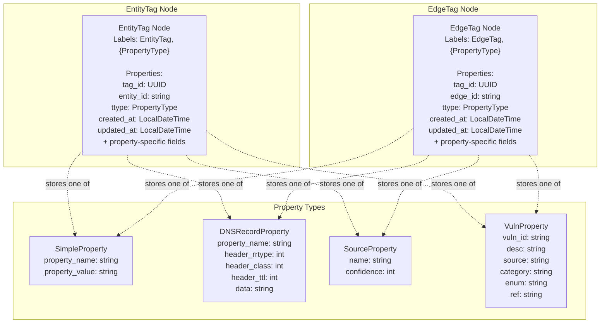

The dual-label system (`:EntityTag:{PropertyType}`) enables:
- Fast filtering by tag type (EntityTag vs EdgeTag)
- Type-specific queries without scanning all tags
- Efficient property content matching

---

### Entity Tag Operations

#### Tag Creation with Duplicate Handling

The `CreateEntityTag` and `CreateEntityProperty` functions implement sophisticated duplicate detection and timestamp updating:

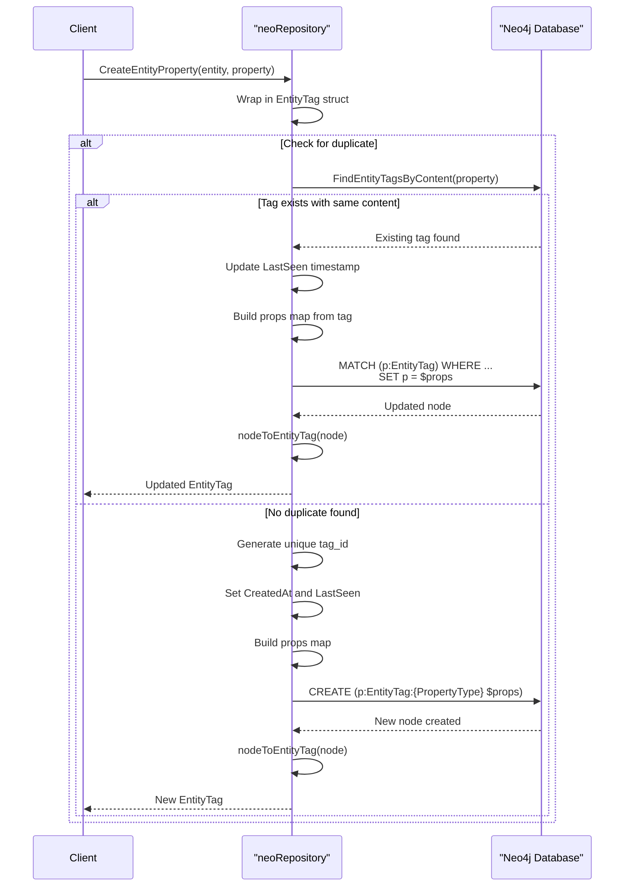

**Key Implementation Details:**

| Function | Purpose | Cypher Pattern |
|----------|---------|----------------|
| `CreateEntityTag` | Main tag creation | `CREATE (p:EntityTag:{PropertyType} $props)` |
| `CreateEntityProperty` | Convenience wrapper | Delegates to `CreateEntityTag` |
| `uniqueEntityTagID` | Generate unique UUID | Loop until `FindEntityTagById` fails |
| `entityTagPropsMap` | Serialize tag to map | Flatten Property fields to node properties |

The duplicate detection strategy at  ensures:
1. Properties with identical content reuse existing tags
2. `LastSeen` timestamp is updated on duplicates
3. Property type must match for updates
4. `CreatedAt` remains unchanged for duplicates

#### Finding Tags by ID

`FindEntityTagById` retrieves a specific tag using its unique identifier:

```
Query: MATCH (p:EntityTag {tag_id: $tid}) RETURN p
```

The function at :
1. Executes parameterized Cypher query with 30-second timeout
2. Returns error if no records found
3. Extracts node from result record
4. Calls `nodeToEntityTag` for property deserialization

#### Content-Based Tag Search

`FindEntityTagsByContent` searches for tags matching a specific property value:

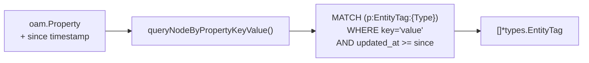

The `queryNodeByPropertyKeyValue` helper function (defined elsewhere in the codebase) constructs type-specific MATCH patterns. For example, a `SimpleProperty` with `name="test"` and `value="foo"` generates:

```
MATCH (p:EntityTag:SimpleProperty {property_name: 'test', property_value: 'foo'})
```

Time filtering is applied when `since` is non-zero:
```
WHERE p.updated_at >= localDateTime('2025-01-15T10:30:00')
```

#### Retrieving All Entity Tags

`GetEntityTags` fetches all tags for a specific entity with optional filtering:

| Parameter | Type | Purpose |
|-----------|------|---------|
| `entity` | `*types.Entity` | Parent entity to query |
| `since` | `time.Time` | Filter by update timestamp (ignored if zero) |
| `names` | `...string` | Optional property names to filter (returns all if empty) |

**Query Patterns:**

```cypher
## Without time filter
MATCH (p:EntityTag {entity_id: '{entity.ID}'}) RETURN p

## With time filter
MATCH (p:EntityTag {entity_id: '{entity.ID}'})
WHERE p.updated_at >= localDateTime('{since}')
RETURN p
```

Post-query filtering at  applies the `names` parameter in-memory by comparing `Property.Name()` against the provided list.

#### Tag Deletion

`DeleteEntityTag` removes a tag node completely:

```cypher
MATCH (n:EntityTag {tag_id: $tid})
DETACH DELETE n
```

The `DETACH DELETE` ensures any relationships to the tag are also removed, maintaining graph integrity.

---

### Edge Tag Operations

Edge tag operations mirror entity tag operations with different node labels and parent relationships. The implementation follows the same patterns but uses `:EdgeTag` labels and `edge_id` properties instead of `entity_id`.

**Key Functions:**

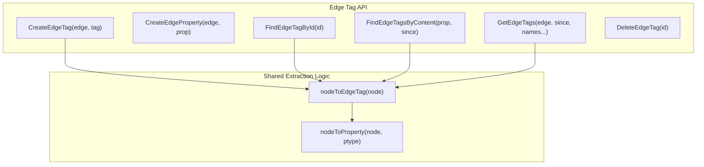

The implementation reuses the same property extraction logic as entity tags, differing only in:
- Node label: `:EdgeTag` instead of `:EntityTag`
- Parent reference field: `edge_id` instead of `entity_id`
- Return type: `*types.EdgeTag` instead of `*types.EntityTag`

---

### Property Extraction System

#### Converting Neo4j Nodes to Tags

The extraction functions transform Neo4j nodes back into Go structs:

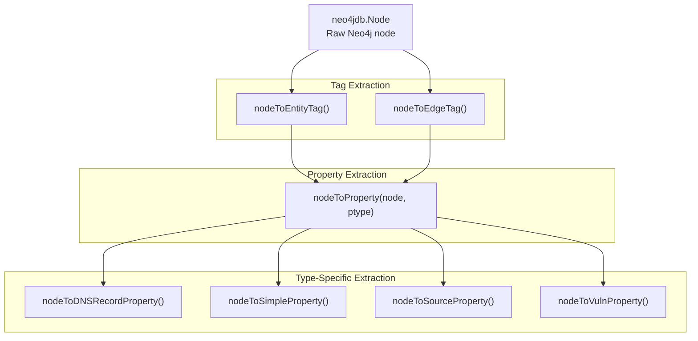

**Extraction Flow:**

1. **Read Common Fields** - Extract `tag_id`, `entity_id`/`edge_id`, timestamps
2. **Determine Property Type** - Read `ttype` field to identify OAM property type
3. **Dispatch to Type Handler** - Call appropriate `nodeTo{Type}Property` function
4. **Assemble Tag Struct** - Combine extracted data into `EntityTag` or `EdgeTag`

#### Property Type Handlers

Each OAM property type has a dedicated extraction function:

| Property Type | Extractor Function | Key Fields Extracted |
|---------------|-------------------|---------------------|
| `DNSRecordProperty` | `nodeToDNSRecordProperty` | `property_name`, `header_rrtype`, `header_class`, `header_ttl`, `data` |
| `SimpleProperty` | `nodeToSimpleProperty` | `property_name`, `property_value` |
| `SourceProperty` | `nodeToSourceProperty` | `name`, `confidence` |
| `VulnProperty` | `nodeToVulnProperty` | `vuln_id`, `desc`, `source`, `category`, `enum`, `ref` |

**Example: SimpleProperty Extraction**

 demonstrates the straightforward extraction:

```
1. Call neo4jdb.GetProperty[string](node, "property_name")
2. Call neo4jdb.GetProperty[string](node, "property_value")
3. Return &general.SimpleProperty with both fields
```

Each extractor uses `neo4jdb.GetProperty[T]` for type-safe property access. Errors propagate upward if required fields are missing.

---

### Time Management

#### Timestamp Fields

Tags maintain two timestamps for tracking:

| Field | Purpose | Update Strategy |
|-------|---------|-----------------|
| `CreatedAt` | Initial creation time | Set once, never updated |
| `LastSeen` | Most recent observation | Updated on every duplicate detection |

Both timestamps use Neo4j's `LocalDateTime` type for storage, converted via helper functions:

```
Go time.Time --> Neo4j LocalDateTime: timeToNeo4jTime(t)
Neo4j LocalDateTime --> Go time.Time: neo4jTimeToTime(t)
```

**Timestamp Behavior in Queries:**

```cypher
## Time filter format
WHERE p.updated_at >= localDateTime('2025-01-15T10:30:00.123456789')
```

The `since` parameter in query functions filters tags by `updated_at` (alias for `LastSeen`), enabling temporal queries for recently modified tags.

---

### Duplicate Detection Strategy

#### Content Matching Logic

The duplicate detection system at  prevents redundant tag creation:

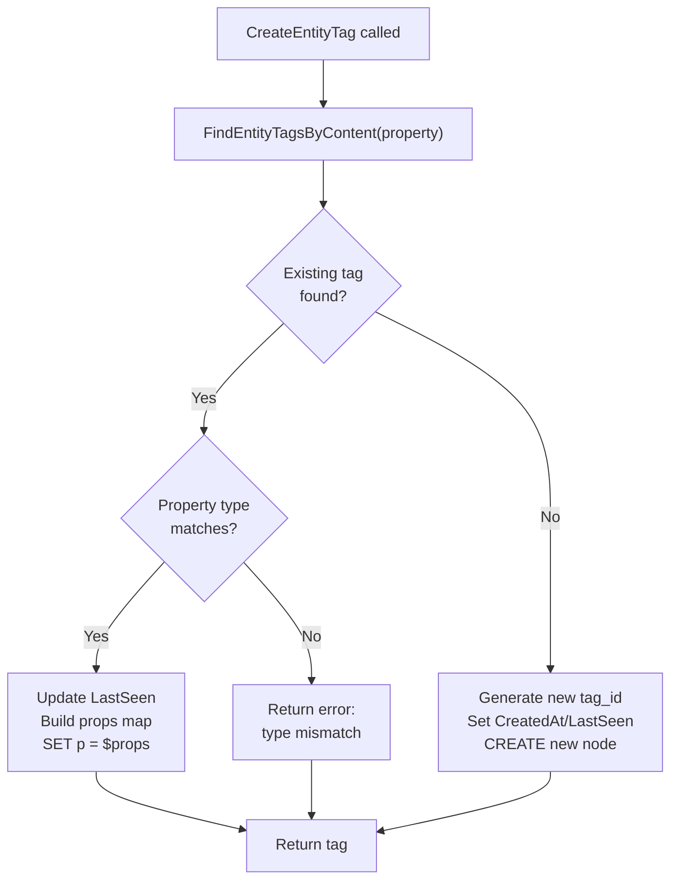

**Property Type Validation:**

The check at  ensures type consistency:
```
if input.Property.PropertyType() != t.Property.PropertyType() {
    return error
}
```

This prevents a `SimpleProperty` from updating a `DNSRecordProperty` with the same name, maintaining data integrity.

---

### Test Coverage

The integration tests in  verify:

| Test Case | Coverage |
|-----------|----------|
| `TestEntityTag` | Full lifecycle: create, find, duplicate handling, timestamp updates, query by name, deletion |
| `TestEdgeTag` | Parallel verification for edge tags |

**Key Test Scenarios:**

1. **Initial Creation** - Verify `CreatedAt` and `LastSeen` are set correctly
2. **Duplicate Detection** - Second creation with same property updates `LastSeen` only
3. **Value Change** - New property value creates new tag with later `CreatedAt`
4. **Filtered Retrieval** - `GetEntityTags` with name filter returns correct subset
5. **Deletion** - Tag removal and subsequent lookup failure

### Neo4j Schema and Constraints

This page documents the Neo4j schema initialization system, including uniqueness constraints, range indexes, and database creation. It covers how the Neo4j repository ensures data integrity and query performance through structured schema definitions.

For details on how these constraints are used during entity, edge, and tag operations, see [Neo4j Entity Operations](./triples.md#neo4j-entity-operations), [Neo4j Edge Operations](./triples.md#neo4j-edge-operations), and [Neo4j Tag Management](./triples.md#neo4j-tag-management). For broader migration system context, see [Neo4j Schema Initialization](#7.2).

### Schema Initialization Overview

The Neo4j schema is initialized through the `InitializeSchema` function, which creates the database, establishes constraints, and defines indexes. This initialization occurs automatically when a new Neo4j repository is created via `assetdb.New`.

#### Initialization Flow

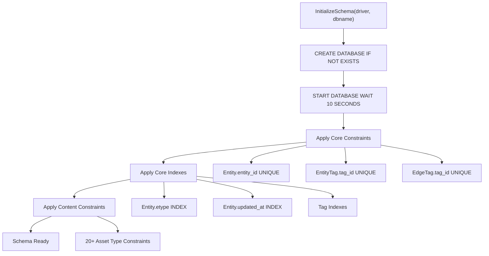

### Core Schema Components

The Neo4j schema defines three primary node types with associated constraints and indexes:

#### Entity Nodes

| Property | Constraint Type | Purpose |
|----------|----------------|---------|
| `entity_id` | UNIQUE | Ensures each entity has a unique identifier |
| `etype` | RANGE INDEX | Enables efficient queries by asset type |
| `updated_at` | RANGE INDEX | Supports temporal queries and filtering |

#### EntityTag Nodes

| Property | Constraint Type | Purpose |
|----------|----------------|---------|
| `tag_id` | UNIQUE | Ensures each tag has a unique identifier |
| `ttype` | RANGE INDEX | Enables queries by property type |
| `updated_at` | RANGE INDEX | Supports temporal filtering |
| `entity_id` | RANGE INDEX | Optimizes tag lookup by entity |

#### EdgeTag Nodes

| Property | Constraint Type | Purpose |
|----------|----------------|---------|
| `tag_id` | UNIQUE | Ensures each tag has a unique identifier |
| `ttype` | RANGE INDEX | Enables queries by property type |
| `updated_at` | RANGE INDEX | Supports temporal filtering |
| `edge_id` | RANGE INDEX | Optimizes tag lookup by edge |

### Constraint Implementation Details

The schema uses Cypher's `CREATE CONSTRAINT` syntax with the `IF NOT EXISTS` clause to ensure idempotent initialization.

```mermaid
graph TB
    subgraph "Entity Constraint"
        EntityNode["(:Entity)"]
        EntityProp["n.entity_id"]
        EntityConstraint["constraint_entities_entity_id"]
        
        EntityNode --> EntityProp
        EntityProp --> EntityConstraint
    end
    
    subgraph "EntityTag Constraint"
        TagNode["(:EntityTag)"]
        TagProp["n.tag_id"]
        TagConstraint["constraint_enttag_tag_id"]
        
        TagNode --> TagProp
        TagProp --> TagConstraint
    end
    
    subgraph "EdgeTag Constraint"
        EdgeTagNode["(:EdgeTag)"]
        EdgeTagProp["n.tag_id"]
        EdgeTagConstraint["constraint_edgetag_tag_id"]
        
        EdgeTagNode --> EdgeTagProp
        EdgeTagProp --> EdgeTagConstraint
    end
```

#### executeQuery Helper

The `executeQuery` function provides a wrapper around Neo4j's `ExecuteQuery` API, abstracting the context and transaction handling:

```mermaid
sequenceDiagram
    participant Init as InitializeSchema
    participant Exec as executeQuery
    participant Driver as neo4jdb.Driver
    participant DB as Neo4j Database
    
    Init->>Exec: executeQuery(driver, dbname, query)
    Exec->>Driver: ExecuteQuery(context, driver, query)
    Driver->>DB: Execute Cypher query
    DB-->>Driver: Result or error
    Driver-->>Exec: Result or error
    Exec-->>Init: error or nil
```

### Content-Specific Constraints

Each Open Asset Model asset type has its own constraint ensuring uniqueness on a natural key property. The `entitiesContentIndexes` function defines constraints for all 21 supported asset types.

#### Asset Type Constraint Mapping

| Asset Type | Node Label | Unique Property | Constraint Name |
|------------|-----------|-----------------|-----------------|
| `Account` | `:Account` | `unique_id` | `constraint_account_content_unique_id` |
| `AutnumRecord` | `:AutnumRecord` | `handle`, `number` | `constraint_autnum_content_handle`, `constraint_autnum_content_number` |
| `AutonomousSystem` | `:AutonomousSystem` | `number` | `constraint_autsys_content_number` |
| `ContactRecord` | `:ContactRecord` | `discovered_at` | `constraint_contact_record_content_discovered_at` |
| `DomainRecord` | `:DomainRecord` | `domain` | `constraint_domainrec_content_domain` |
| `File` | `:File` | `url` | `constraint_file_content_url` |
| `FQDN` | `:FQDN` | `name` | `constraint_fqdn_content_name` |
| `FundsTransfer` | `:FundsTransfer` | `unique_id` | `constraint_ft_content_unique_id` |
| `Identifier` | `:Identifier` | `unique_id` | `constraint_identifier_content_unique_id` |
| `IPAddress` | `:IPAddress` | `address` | `constraint_ipaddr_content_address` |
| `IPNetRecord` | `:IPNetRecord` | `handle` | `constraint_ipnetrec_content_handle` |
| `Location` | `:Location` | `address` | `constraint_location_content_name` |
| `Netblock` | `:Netblock` | `cidr` | `constraint_netblock_content_cidr` |
| `Organization` | `:Organization` | `unique_id` | `constraint_org_content_id` |
| `Person` | `:Person` | `unique_id` | `constraint_person_content_id` |
| `Phone` | `:Phone` | `e164`, `raw` | `constraint_phone_content_e164`, `constraint_phone_content_raw` |
| `Product` | `:Product` | `unique_id` | `constraint_product_content_id` |
| `ProductRelease` | `:ProductRelease` | `name` | `constraint_productrelease_content_name` |
| `Service` | `:Service` | `unique_id` | `constraint_service_content_id` |
| `TLSCertificate` | `:TLSCertificate` | `serial_number` | `constraint_tls_content_serial_number` |
| `URL` | `:URL` | `url` | `constraint_url_content_url` |

#### Additional Content Indexes

Beyond uniqueness constraints, certain asset types have additional range indexes for frequently queried properties:

| Asset Type | Indexed Property | Purpose |
|------------|------------------|---------|
| `IPNetRecord` | `cidr` | Efficient CIDR range queries |
| `Organization` | `name`, `legal_name` | Name-based searches |
| `Person` | `full_name` | Name-based searches |
| `Product` | `product_name` | Name-based searches |

### Schema-to-Code Mapping

```mermaid
graph LR
    subgraph "Neo4j Schema"
        EntityLabel["(:Entity)"]
        AccountLabel["(:Account)"]
        FQDNLabel["(:FQDN)"]
        IPLabel["(:IPAddress)"]
    end
    
    subgraph "Go Code Structs"
        EntityStruct["types.Entity"]
        AccountStruct["account.Account"]
        FQDNStruct["dns.FQDN"]
        IPStruct["network.IPAddress"]
    end
    
    subgraph "Conversion Functions"
        NodeToEntity["nodeToEntity()"]
        NodeToAccount["nodeToAccount()"]
        NodeToFQDN["nodeToFQDN()"]
        NodeToIP["nodeToIPAddress()"]
    end
    
    EntityLabel --> NodeToEntity
    AccountLabel --> NodeToAccount
    FQDNLabel --> NodeToFQDN
    IPLabel --> NodeToIP
    
    NodeToEntity --> EntityStruct
    NodeToAccount --> AccountStruct
    NodeToFQDN --> FQDNStruct
    NodeToIP --> IPStruct
```

### Constraint Enforcement

Neo4j enforces these constraints at write time, preventing duplicate entities and ensuring data integrity:

```mermaid
sequenceDiagram
    participant Repo as neoRepository
    participant DB as Neo4j Database
    participant Schema as Constraint Engine
    
    Note over Repo,Schema: Creating Entity with FQDN "example.com"
    
    Repo->>DB: CREATE (e:Entity {entity_id: uuid})
    DB->>Schema: Check constraint_entities_entity_id
    Schema-->>DB: OK (unique entity_id)
    
    Repo->>DB: CREATE (f:FQDN {name: "example.com"})
    DB->>Schema: Check constraint_fqdn_content_name
    
    alt FQDN already exists
        Schema-->>DB: Constraint violation
        DB-->>Repo: Error: "example.com" already exists
    else FQDN is unique
        Schema-->>DB: OK (unique name)
        DB-->>Repo: Node created
    end
```

### Index Types and Performance

Neo4j uses **range indexes** for all non-constraint indexes, enabling efficient range queries, equality checks, and sorting operations.

#### Index Usage Patterns

| Index | Query Pattern | Example Cypher |
|-------|--------------|----------------|
| `entities_range_index_etype` | Filter by asset type | `MATCH (e:Entity) WHERE e.etype = 'FQDN'` |
| `entities_range_index_updated_at` | Temporal queries | `MATCH (e:Entity) WHERE e.updated_at > datetime('2024-01-01')` |
| `enttag_range_index_entity_id` | Tag lookup | `MATCH (t:EntityTag) WHERE t.entity_id = $id` |
| `org_range_index_name` | Name searches | `MATCH (o:Organization) WHERE o.name CONTAINS 'Example'` |

### Database Creation

The initialization process begins by ensuring the database exists and is started:

```mermaid
flowchart LR
    CreateCmd["CREATE DATABASE dbname<br/>IF NOT EXISTS"]
    StartCmd["START DATABASE dbname<br/>WAIT 10 SECONDS"]
    Ready["Database Ready"]
    
    CreateCmd --> StartCmd
    StartCmd --> Ready
```

These commands are executed with best-effort error handling (errors are ignored) since the database may already exist or be started.

### Error Handling

The schema initialization uses fail-fast error handling for constraints and indexes. If any constraint or index creation fails, the entire initialization process returns an error, preventing partial schema states.

```mermaid
graph TD
    Start["InitializeSchema()"]
    CreateConstraint["Create Constraint"]
    CheckError{"Error?"}
    NextStep["Next Constraint/Index"]
    ReturnError["return err"]
    Complete["return nil"]
    
    Start --> CreateConstraint
    CreateConstraint --> CheckError
    CheckError -->|Yes| ReturnError
    CheckError -->|No| NextStep
    NextStep --> CreateConstraint
    NextStep --> Complete
```

### Property Extraction from Nodes

The schema's property names directly correspond to the `neo4jdb.GetProperty` calls in entity extraction functions:

```mermaid
graph TB
    subgraph "FQDN Schema Constraint"
        FQDNNode["(:FQDN)"]
        NameProp["n.name UNIQUE"]
        FQDNNode --> NameProp
    end
    
    subgraph "nodeToFQDN Function"
        GetProp["neo4jdb.GetProperty[string](node, 'name')"]
        FQDNStruct["&dns.FQDN{Name: name}"]
        GetProp --> FQDNStruct
    end
    
    NameProp -.->|"Same property name"| GetProp
```

### Multi-Property Constraints

Some asset types require multiple unique constraints to ensure different forms of the same data are treated as distinct:

#### Phone Number Example

The `Phone` asset type has two separate uniqueness constraints:
- `constraint_phone_content_e164` on the standardized E.164 format
- `constraint_phone_content_raw` on the raw input string

This allows the same phone number to exist in multiple formats while preventing exact duplicates.

#### AutnumRecord Example

The `AutnumRecord` asset type has two constraints:
- `constraint_autnum_content_handle` on the registry handle
- `constraint_autnum_content_number` on the AS number

This prevents duplicates by both registry identifier and numeric AS value.
